# AI 교육 3단계 프로그램
## 문제 정의 → 질문 능력 → 해결 실행

---

## 🎯 프로그램 핵심 철학

### "문제를 정의하는 능력이 AI 시대의 핵심 역량이다"

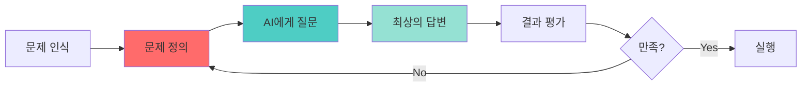

**AI 시대의 성공 방정식**:
```
좋은 문제 정의 × 효과적인 질문 = 최상의 결과
```

### 왜 문제 정의가 중요한가?

AI는 **당신이 질문한 것**에만 답합니다.
- ❌ 나쁜 질문 → 나쁜 답변
- ✅ 좋은 문제 정의 → 명확한 질문 → 탁월한 결과

---

## 📊 전체 프로그램 구조

### 3단계 학습 여정

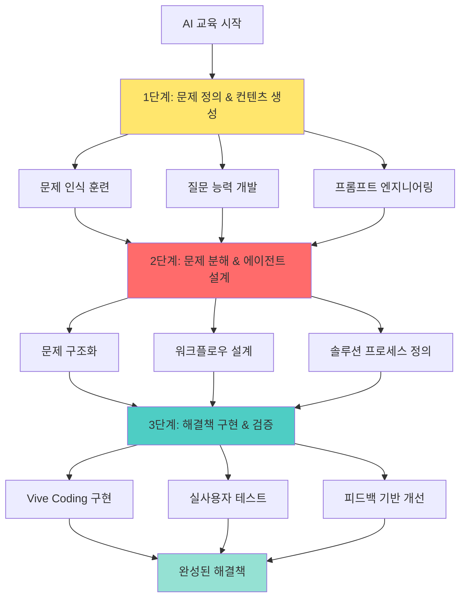

### 문제 해결 능력 발전 단계

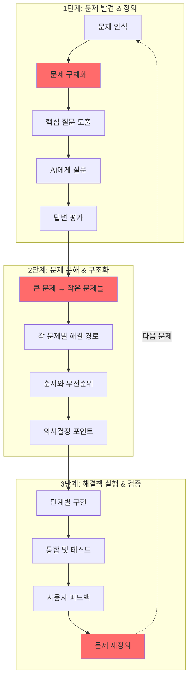

---

## 🔑 핵심 역량: 문제 정의 능력

### 문제 정의 프레임워크

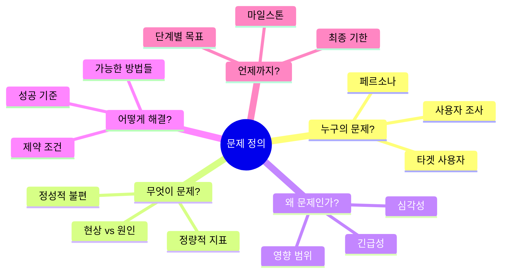

### 좋은 문제 정의의 5가지 요소

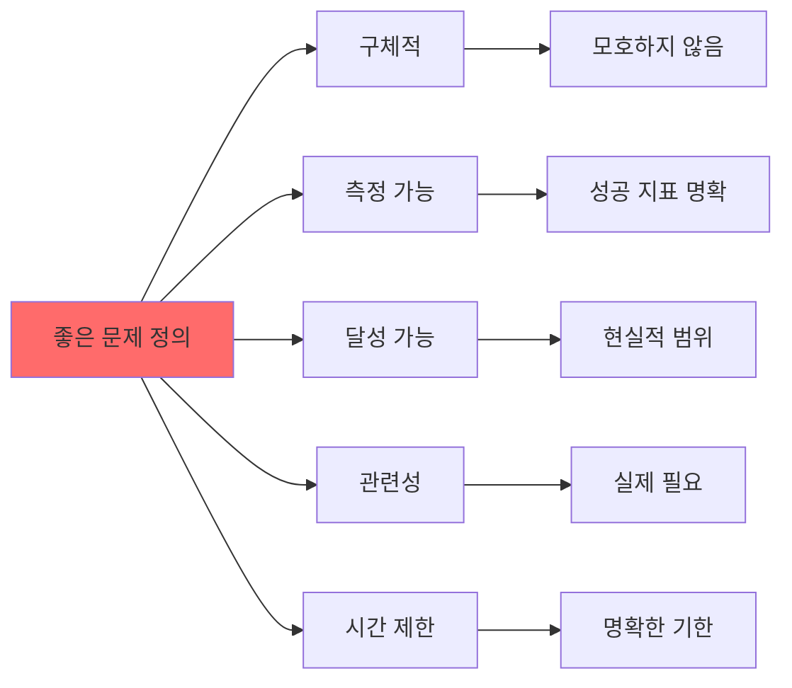

---

## 📚 1단계: 문제 정의 & AI 컨텐츠 생성 (8차시)

### 학습 목표
1. **문제 인식 능력**: 일상에서 해결할 가치가 있는 문제 발견
2. **문제 정의 능력**: 문제를 명확하고 구체적으로 표현
3. **질문 능력**: AI에게 효과적으로 질문하는 방법
4. **비판적 평가**: AI 답변을 평가하고 개선하는 능력

### 1단계 핵심 프로세스

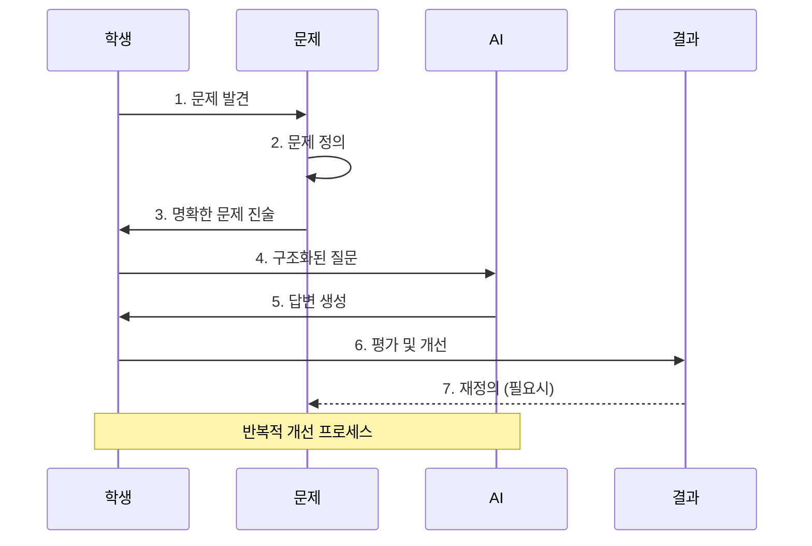

---

### 1차시: 문제 인식 훈련 - "좋은 문제란?"

#### 학습 목표
문제를 발견하고 가치 있는 문제를 식별하는 능력 개발

#### 도입 (10분)

**문제 vs 불편함**

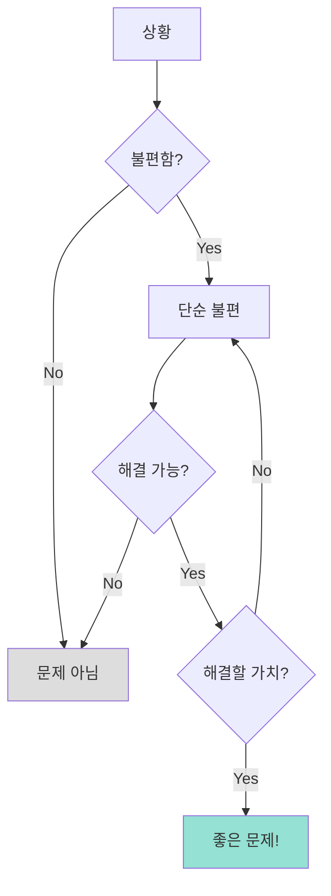

**질문하기**:
- "오늘 하루 불편했던 점 3가지는?"
- "그 중 해결하고 싶은 것은?"
- "왜 그것을 선택했나요?"

#### 전개 (30분)

**활동 1: 문제 발견 카드 (15분)**

```
┌─────────────────────────────────────┐
│      문제 발견 워크시트              │
├─────────────────────────────────────┤
│                                     │
│ 카테고리별 문제 찾기:               │
│                                     │
│ 📚 학습:                            │
│ - 문제 1: ___________________       │
│ - 심각도: ☆☆☆☆☆                   │
│ - 빈도: 매일/주간/월간              │
│                                     │
│ 👥 대인관계:                        │
│ - 문제 1: ___________________       │
│ - 영향: ___________________         │
│                                     │
│ ⏰ 시간관리:                        │
│ - 문제 1: ___________________       │
│ - 손실: ___________________         │
│                                     │
│ 💰 자원:                            │
│ - 문제 1: ___________________       │
│ - 비용: ___________________         │
│                                     │
│ 🎯 목표달성:                        │
│ - 문제 1: ___________________       │
│ - 장애물: _________________         │
└─────────────────────────────────────┘
```

**활동 2: 문제 선정 기준 적용 (15분)**

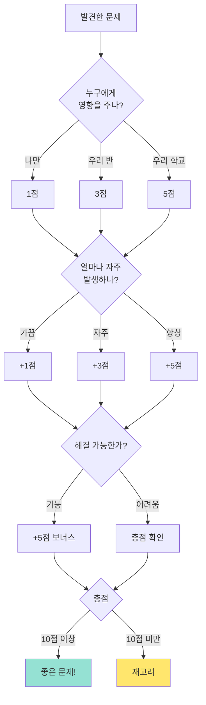

#### 정리 (10분)

**문제 우선순위 매트릭스**

```
중요도 ↑
    │
 A  │  B
────┼────→ 긴급도
 C  │  D
    │

A: 중요하고 긴급 - 즉시 해결
B: 중요하지만 긴급하지 않음 - 계획적 접근
C: 긴급하지만 중요하지 않음 - 빠른 해결
D: 둘 다 아님 - 무시
```

#### 과제
```
3가지 좋은 문제 찾아오기:

각 문제마다 작성:
1. 문제 제목 (한 문장)
2. 누구의 문제?
3. 왜 문제인가? (데이터/사례)
4. 해결하면 어떤 변화?
5. 문제 점수 (위 기준 적용)
```

---

### 2차시: 문제 정의 프레임워크 - "명확하게 표현하기"

#### 학습 목표
문제를 명확하고 구체적으로 정의하는 방법 습득

#### 도입 (10분)

**나쁜 문제 정의 vs 좋은 문제 정의**

```
❌ 나쁜 예:
"공부가 어려워요"

✅ 좋은 예:
"수학 문제를 풀 때 어떤 공식을 사용해야 할지 
판단하는 데 평균 5분이 걸리고, 이로 인해 
시험 시간이 부족합니다. 지난 3번의 시험에서 
모두 마지막 2문제를 풀지 못했습니다."
```

#### 전개 (30분)

**5W1H 문제 정의 프레임워크**

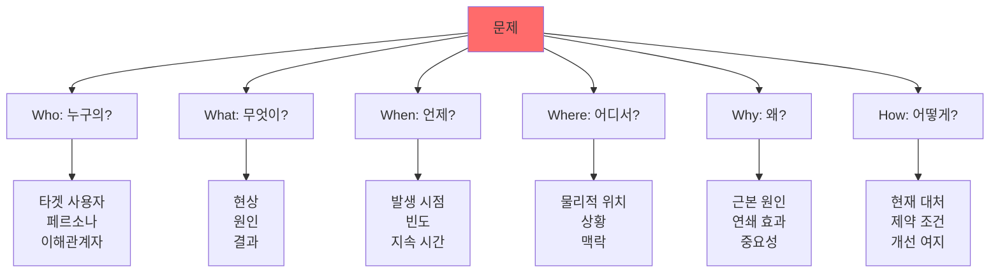

**활동: 문제 정의서 작성**

```
┌─────────────────────────────────────────────────┐
│           문제 정의서 템플릿                    │
├─────────────────────────────────────────────────┤
│                                                 │
│ 문제 제목: ________________________________     │
│                                                 │
│ 1. WHO - 누구의 문제인가?                      │
│    대상: ________________________________       │
│    특징: ________________________________       │
│    규모: ________________________________       │
│                                                 │
│ 2. WHAT - 무엇이 문제인가?                     │
│    현상: ________________________________       │
│    원인: ________________________________       │
│    결과: ________________________________       │
│                                                 │
│ 3. WHEN - 언제 발생하는가?                     │
│    시점: ________________________________       │
│    빈도: ________________________________       │
│    기간: ________________________________       │
│                                                 │
│ 4. WHERE - 어디서 발생하는가?                  │
│    장소: ________________________________       │
│    상황: ________________________________       │
│    맥락: ________________________________       │
│                                                 │
│ 5. WHY - 왜 문제인가?                          │
│    근본 원인: ___________________________       │
│    2차 영향: ____________________________       │
│    중요성: ______________________________       │
│                                                 │
│ 6. HOW - 어떻게 해결할 것인가?                 │
│    현재 대처: ___________________________       │
│    제약 조건: ___________________________       │
│    목표 상태: ___________________________       │
│                                                 │
│ 성공 지표:                                      │
│ □ 정량적: ________________________________      │
│ □ 정성적: ________________________________      │
│                                                 │
│ 해결 기한: ________________________________     │
└─────────────────────────────────────────────────┘
```

#### 정리 (10분)

**문제 정의 체크리스트**

```
✅ 명확성: 누구나 이해할 수 있는가?
✅ 구체성: 추상적이지 않고 구체적인가?
✅ 측정성: 해결 여부를 측정할 수 있는가?
✅ 실행성: 실제로 해결 가능한가?
✅ 가치성: 해결할 가치가 있는가?
```

---

### 3차시: AI에게 효과적으로 질문하기 - "프롬프트 엔지니어링"

#### 학습 목표
문제 정의를 기반으로 AI에게 최상의 질문을 하는 방법 습득

#### 도입 (10분)

**질문의 질이 답변의 질을 결정한다**

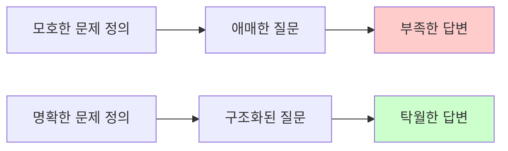

#### 전개 (30분)

**프롬프트 구조 설계**

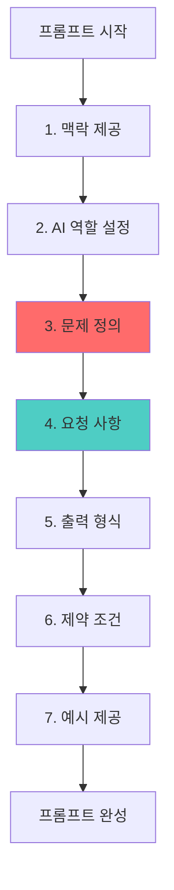

**완벽한 프롬프트 템플릿**

```
┌─────────────────────────────────────────────────┐
│         AI 질문 프롬프트 템플릿                 │
├─────────────────────────────────────────────────┤
│                                                 │
│ 1. 역할 설정                                    │
│ "당신은 [전문가/코치/컨설턴트] 역할입니다."    │
│                                                 │
│ 2. 맥락 제공                                    │
│ "상황: [배경 설명]"                             │
│ "대상: [타겟 사용자]"                           │
│ "목적: [달성하고자 하는 것]"                    │
│                                                 │
│ 3. 문제 정의 (5W1H)                            │
│ "문제:                                          │
│  - Who: [누구의 문제]                           │
│  - What: [무엇이 문제]                          │
│  - Why: [왜 중요한가]"                          │
│                                                 │
│ 4. 구체적 요청                                  │
│ "다음을 해주세요:                               │
│  1) [첫 번째 요청]                              │
│  2) [두 번째 요청]                              │
│  3) [세 번째 요청]"                             │
│                                                 │
│ 5. 출력 형식                                    │
│ "형식:                                          │
│  - 구조: [리스트/표/문단]                       │
│  - 길이: [300자/5가지/3문단]                    │
│  - 톤: [친근한/전문적/격려하는]"                │
│                                                 │
│ 6. 제약 조건                                    │
│ "제약:                                          │
│  - 포함: [필수 요소]                            │
│  - 제외: [금지 사항]                            │
│  - 기준: [평가 기준]"                           │
│                                                 │
│ 7. 예시 (선택)                                  │
│ "예시:                                          │
│  [원하는 형태의 샘플]"                          │
└─────────────────────────────────────────────────┘
```

**실습: 프롬프트 작성 & 개선**

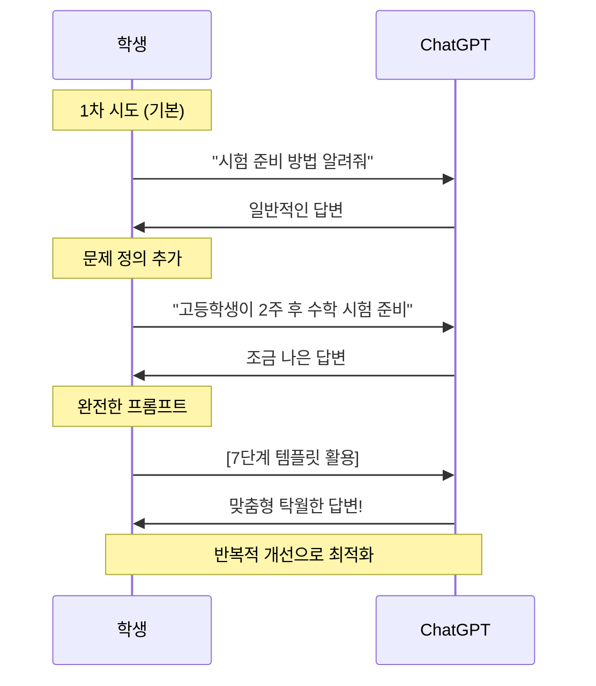

#### 정리 (10분)

**프롬프트 품질 자가 평가**

```
내 프롬프트 점수는?

□ 역할 설정 (+10점)
□ 맥락 제공 (+15점)
□ 5W1H 문제 정의 (+20점)
□ 구체적 요청 (+20점)
□ 출력 형식 지정 (+15점)
□ 제약 조건 명시 (+10점)
□ 예시 포함 (+10점)

총점: ___/100점

90점 이상: 탁월한 프롬프트
70-89점: 좋은 프롬프트
50-69점: 개선 필요
50점 미만: 재작성 필요
```

#### 과제
```
이전 차시에서 정의한 문제를 AI에게 질문하기:

제출 내용:
1. 문제 정의서
2. 1차 프롬프트 (기본)
3. AI 답변 1
4. 2차 프롬프트 (개선)
5. AI 답변 2
6. 3차 프롬프트 (최종)
7. AI 답변 3
8. 각 단계별 개선 포인트 설명
```

---

### 4-5차시: 반복적 개선과 결과 평가

#### 4차시: PRIMM 사이클로 프롬프트 최적화

**학습 목표**: 체계적인 개선 프로세스 습득

**PRIMM 프로세스 상세**

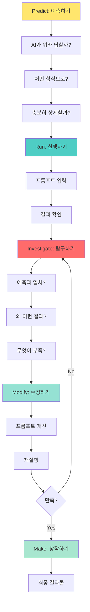

**활동: 프롬프트 개선 로그**

```
┌─────────────────────────────────────────────────┐
│        프롬프트 개선 로그                        │
├─────────────────────────────────────────────────┤
│                                                 │
│ 버전 1.0 (기본)                                 │
│ ───────────────                                 │
│ 프롬프트: [최초 질문]                           │
│ 예상: [어떤 답변이 올까?]                       │
│ 실제: [실제 답변 요약]                          │
│ 문제점:                                         │
│  □ 너무 일반적                                  │
│  □ 맥락 부족                                    │
│  □ 형식 불명확                                  │
│  □ 예시 없음                                    │
│ 개선 방향: [구체적 개선 계획]                   │
│                                                 │
│ 버전 2.0 (개선)                                 │
│ ───────────────                                 │
│ 변경 사항:                                      │
│  ✓ [추가한 것]                                  │
│  ✓ [수정한 것]                                  │
│ 결과: [개선된 점]                               │
│ 남은 문제: [여전한 문제]                        │
│                                                 │
│ 버전 3.0 (최적화)                               │
│ ───────────────                                 │
│ 최종 프롬프트: [완성된 프롬프트]                │
│ 만족도: ☆☆☆☆☆                                  │
│ 핵심 개선 포인트:                               │
│  1) ___________________________________         │
│  2) ___________________________________         │
│  3) ___________________________________         │
└─────────────────────────────────────────────────┘
```

#### 5차시: 결과 평가 및 비판적 사고

**AI 답변 평가 프레임워크**

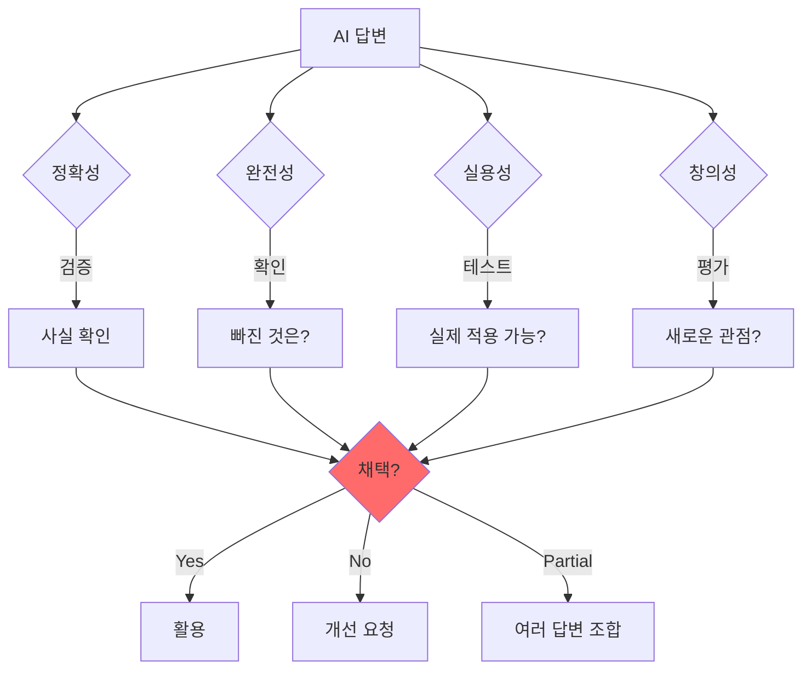

---

### 6-8차시: 최종 프로젝트 - 문제 정의 기반 컨텐츠 제작

#### 프로젝트: "문제 해결 교육 컨텐츠 패키지"

**프로젝트 흐름**

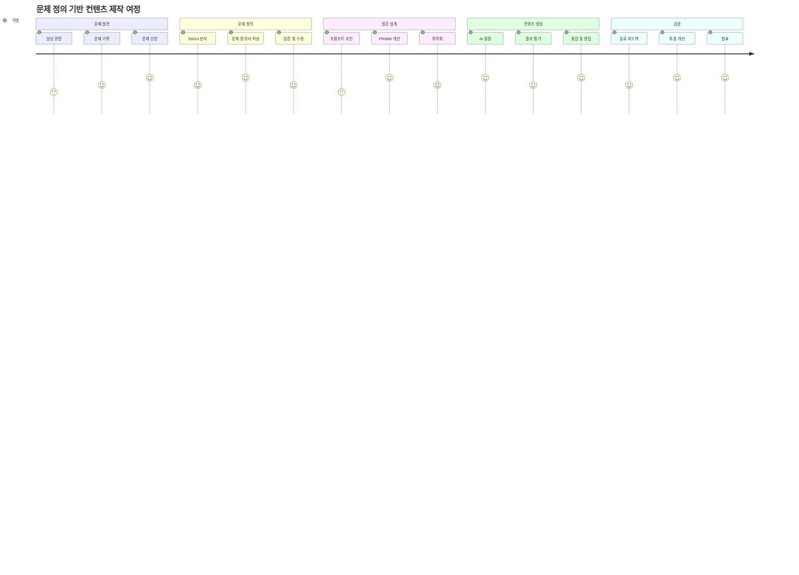

**요구사항**

```
┌─────────────────────────────────────────────────┐
│     문제 해결 컨텐츠 패키지 체크리스트          │
├─────────────────────────────────────────────────┤
│                                                 │
│ 1단계: 문제 정의 (필수) ⭐⭐⭐                   │
│ □ 문제 발견 과정 문서화                         │
│ □ 5W1H 문제 정의서 완성                         │
│ □ 문제 가치 평가 (점수 10점 이상)              │
│                                                 │
│ 2단계: 질문 설계 (필수) ⭐⭐⭐                   │
│ □ 프롬프트 개선 로그 (3회 이상)                │
│ □ 최종 프롬프트 (7단계 템플릿)                 │
│ □ AI 답변 품질 평가                             │
│                                                 │
│ 3단계: 컨텐츠 제작 (필수) ⭐⭐                  │
│ □ AI로 생성한 교육 자료                         │
│ □ 인터랙티브 요소 포함                          │
│ □ 사용자 가이드                                 │
│                                                 │
│ 4단계: 검증 및 개선 (필수) ⭐                   │
│ □ 동료 피드백 3명 이상                          │
│ □ 피드백 반영 내역                              │
│ □ 최종 버전                                     │
│                                                 │
│ 5단계: 발표 (필수) ⭐⭐⭐                        │
│ □ 문제 정의 과정 설명                           │
│ □ 질문 개선 과정 시연                           │
│ □ 최종 결과물 소개                              │
└─────────────────────────────────────────────────┘
```

---

## 🤖 2단계: 문제 분해 & AI 에이전트 설계 (8차시)

### 학습 목표
1. **문제 분해 능력**: 큰 문제를 작은 문제들로 나누기
2. **구조화 능력**: 문제 해결 프로세스를 체계적으로 설계
3. **시스템 사고**: 각 요소 간 연결과 흐름 이해
4. **자동화 설계**: AI 에이전트로 해결 프로세스 구현

### 2단계 핵심: 문제의 구조화

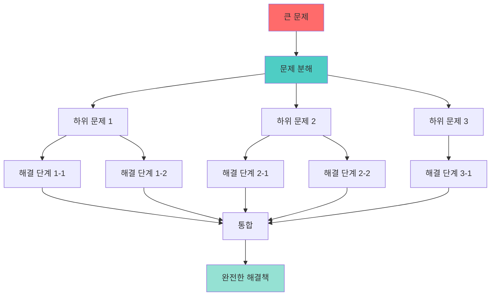

### 9-10차시: 문제 분해 및 워크플로우 설계

**문제 분해 프레임워크**

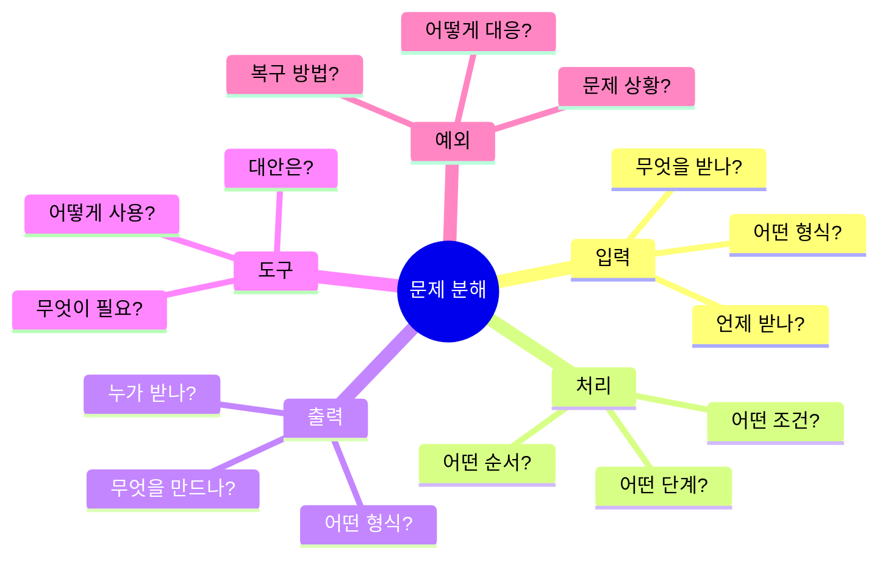

**워크플로우 설계 예시**

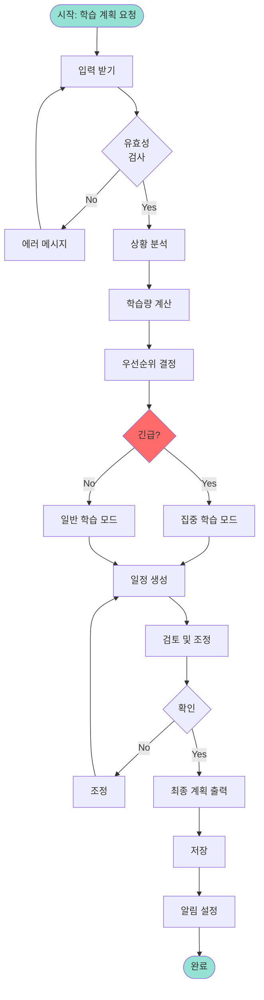

### 11-12차시: 의사결정 로직 설계

**의사결정 트리**

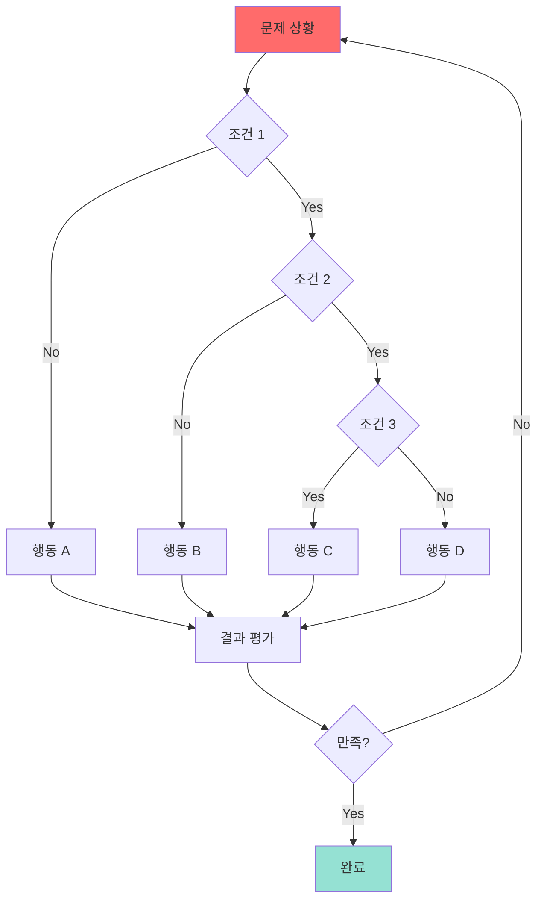

### 13-16차시: Custom GPT 에이전트 구현

**에이전트 구조**

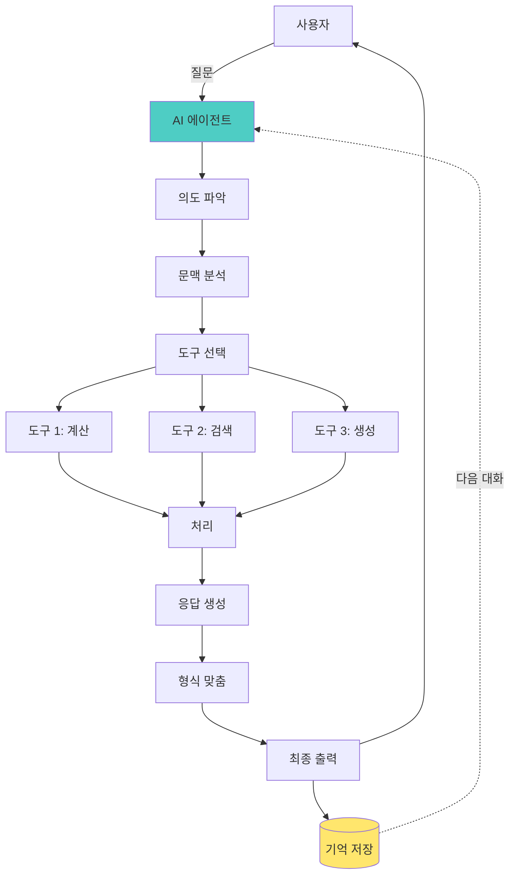

---

## 💻 3단계: 해결책 구현 & 검증 (8차시)

### 학습 목표
1. **구현 능력**: 설계를 실제 동작하는 서비스로 변환
2. **통합 능력**: 1-2단계 결과물을 하나로 통합
3. **테스트 능력**: 실사용자 피드백 수집 및 분석
4. **개선 능력**: 피드백 기반 반복적 개선

### 3단계 핵심: 문제 해결의 완성

```mermaid
graph LR
    A[1단계<br/>문제 정의<br/>컨텐츠] --> B[2단계<br/>문제 분해<br/>에이전트]
    B --> C[3단계<br/>통합 구현<br/>웹 앱]
    
    C --> D[실사용자]
    D --> E[피드백]
    E --> F{문제<br/>해결?}
    
    F -->|No| G[문제 재정의]
    G -.-> A
    
    F -->|Yes| H[성공!]
    
    style A fill:#ffe66d
    style B fill:#ff6b6b
    style C fill:#4ecdc4
    style H fill:#95e1d3
```

### 17-18차시: Cursor로 빠른 프로토타이핑

**Vive Coding 프로세스**

```mermaid
sequenceDiagram
    participant 학생
    participant Cursor
    participant AI
    participant 결과물
    
    학생->>Cursor: 1. 문제 정의서 제공
    Cursor->>AI: 2. 맥락 이해
    AI->>Cursor: 3. 코드 구조 제안
    Cursor->>학생: 4. 초안 생성
    
    학생->>Cursor: 5. "여기 개선해줘"
    Cursor->>AI: 6. 개선 요청
    AI->>Cursor: 7. 수정 코드
    Cursor->>학생: 8. 업데이트
    
    학생->>결과물: 9. 테스트
    결과물->>학생: 10. 동작 확인
    
    Note over 학생,결과물: 빠른 반복으로 완성도 향상
```

### 19-22차시: 통합 및 개선

**통합 프로세스**

```mermaid
graph TD
    Content[1단계<br/>컨텐츠] --> Integrate
    Agent[2단계<br/>에이전트] --> Integrate
    
    Integrate[통합] --> UI[UI 구현]
    Integrate --> Logic[로직 연결]
    Integrate --> Data[데이터 관리]
    
    UI --> Test1[UI 테스트]
    Logic --> Test2[기능 테스트]
    Data --> Test3[데이터 테스트]
    
    Test1 --> Beta[베타 버전]
    Test2 --> Beta
    Test3 --> Beta
    
    Beta --> Users[실사용자]
    Users --> Feedback[피드백]
    
    Feedback --> Analyze[분석]
    Analyze --> Decide{큰 변경<br/>필요?}
    
    Decide -->|Yes| Redesign[재설계]
    Redesign --> Integrate
    
    Decide -->|No| Improve[개선]
    Improve --> Final[최종 버전]
    
    style Integrate fill:#4ecdc4
    style Final fill:#95e1d3
```

### 23-24차시: 최종 발표 및 회고

**발표 구조**

```mermaid
graph LR
    A[1. 문제 정의<br/>어떤 문제?] --> B[2. 해결 과정<br/>어떻게 분해?]
    B --> C[3. 구현<br/>어떻게 만들었나?]
    C --> D[4. 검증<br/>실제로 해결되나?]
    D --> E[5. 배운 점<br/>무엇을 깨달았나?]
    
    style A fill:#ff6b6b
    style D fill:#95e1d3
```

---

## 📊 전체 프로그램 통합 구조

### 문제 해결 능력의 진화

```mermaid
graph TB
    subgraph "핵심 역량 발전"
        Stage1[1단계<br/>문제 인식 & 정의]
        Stage2[2단계<br/>문제 분해 & 구조화]
        Stage3[3단계<br/>해결 & 검증]
        
        Stage1 --> Skill1[질문 능력]
        Stage1 --> Skill2[비판적 사고]
        
        Stage2 --> Skill3[시스템 사고]
        Stage2 --> Skill4[설계 능력]
        
        Stage3 --> Skill5[실행력]
        Stage3 --> Skill6[개선 능력]
        
        Skill1 --> Expert[문제 해결<br/>전문가]
        Skill2 --> Expert
        Skill3 --> Expert
        Skill4 --> Expert
        Skill5 --> Expert
        Skill6 --> Expert
    end
    
    style Expert fill:#95e1d3,stroke:#333,stroke-width:4px
```

### 도구 활용의 진화

```mermaid
timeline
    title AI 도구 활용 발전 단계
    section 1단계
        기본 대화 : ChatGPT로 간단한 질문
        프롬프트 작성 : 구조화된 질문
        결과 평가 : 답변 품질 판단
    section 2단계
        워크플로우 : 문제 해결 프로세스 설계
        Custom GPT : 에이전트 구축
        도구 통합 : 여러 기능 연결
    section 3단계
        Vive Coding : Cursor로 빠른 구현
        통합 개발 : 전체 시스템 완성
        사용자 검증 : 실제 테스트 및 개선
```

---

## 💡 성공 사례: 문제 정의가 바꾼 결과

### 사례 1: "공부가 어려워요" → 구체적 해결책

```mermaid
graph LR
    A[막연한 문제<br/>'공부가 어려워요'] --> B[문제 정의<br/>수학 공식 선택에<br/>평균 5분 소요]
    B --> C[질문 설계<br/>공식 선택 프로세스<br/>자동화 방법]
    C --> D[AI 답변<br/>의사결정 트리<br/>기반 가이드]
    D --> E[구현<br/>인터랙티브<br/>공식 선택 도구]
    E --> F[결과<br/>선택 시간<br/>1분으로 단축]
    
    style A fill:#ffcccc
    style B fill:#ffe66d
    style F fill:#ccffcc
```

### 사례 2: 단계별 성장

**Before (문제 정의 전)**
```
학생: "영어 단어 외우는 앱 만들어줘"
AI: [일반적인 플래시카드 앱 코드 생성]
결과: 사용 3일 후 포기
```

**After (문제 정의 후)**
```
학생: "문제 정의:
- Who: 수능 준비 고3 학생
- What: 단어는 외우지만 문맥에서 의미 파악 못함
- Why: 예문 없이 단어만 암기
- How: 실제 문장에서 단어 의미 추론 연습 필요

요청: 지문 독해 중 단어 뜻 추론 게임"

AI: [맞춤형 문맥 기반 학습 게임 생성]
결과: 3개월 사용, 모의고사 어휘 점수 30% 향상
```

---

## 🎓 평가 체계

### 종합 평가 프레임워크

```mermaid
graph TD
    Eval[전체 평가] --> P1[문제 정의 능력<br/>40점]
    Eval --> P2[질문 능력<br/>30점]
    Eval --> P3[구현 능력<br/>20점]
    Eval --> P4[개선 능력<br/>10점]
    
    P1 --> P1_1[명확성: 10점]
    P1 --> P1_2[구체성: 10점]
    P1 --> P1_3[측정성: 10점]
    P1 --> P1_4[가치성: 10점]
    
    P2 --> P2_1[프롬프트 구조: 10점]
    P2 --> P2_2[개선 과정: 10점]
    P2 --> P2_3[결과 품질: 10점]
    
    P3 --> P3_1[완성도: 10점]
    P3 --> P3_2[통합성: 10점]
    
    P4 --> P4_1[피드백 반영: 5점]
    P4 --> P4_2[반복 개선: 5점]
    
    style P1 fill:#ff6b6b
    style P2 fill:#4ecdc4
```

---

## 🚀 프로그램 운영 가이드

### 교사를 위한 체크리스트

```mermaid
graph TD
    Start[프로그램 시작] --> Prep[준비]
    
    Prep --> P1[도구 계정 확인]
    Prep --> P2[예시 자료 준비]
    Prep --> P3[평가 기준 설정]
    
    P1 --> Run[수업 진행]
    P2 --> Run
    P3 --> Run
    
    Run --> R1[문제 정의 강조]
    Run --> R2[질문 코칭]
    Run --> R3[반복 개선 독려]
    
    R1 --> Monitor[모니터링]
    R2 --> Monitor
    R3 --> Monitor
    
    Monitor --> M1[학생 진도 확인]
    Monitor --> M2[어려움 파악]
    Monitor --> M3[개별 지도]
    
    M1 --> Eval[평가]
    M2 --> Eval
    M3 --> Eval
    
    Eval --> E1[문제 정의 평가]
    Eval --> E2[프로세스 평가]
    Eval --> E3[결과물 평가]
    
    E1 --> Feedback[피드백]
    E2 --> Feedback
    E3 --> Feedback
    
    Feedback --> Improve[개선]
    Improve --> Next[다음 단계]
    
    style R1 fill:#ff6b6b
    style E1 fill:#ff6b6b
```

---

## 📚 학습 자료 및 참고 문헌

### 추천 학습 순서

```mermaid
graph TD
    Start[학습 시작] --> Beginner[초보자 경로]
    Start --> Advanced[심화 경로]
    
    Beginner --> B1[문제 정의 기초]
    Beginner --> B2[ChatGPT 기본 사용]
    Beginner --> B3[간단한 프로젝트]
    
    B1 --> B_Next[1단계 완료]
    B2 --> B_Next
    B3 --> B_Next
    
    Advanced --> A1[복잡한 문제 분해]
    Advanced --> A2[Custom GPT 고급]
    Advanced --> A3[통합 프로젝트]
    
    A1 --> A_Next[전문가 레벨]
    A2 --> A_Next
    A3 --> A_Next
    
    B_Next --> Next1[2단계 진행]
    A_Next --> Next2[실전 프로젝트]
    
    style B_Next fill:#ffe66d
    style A_Next fill:#95e1d3
```

---

## 🎯 맺음말

### 핵심 메시지

```mermaid
mindmap
  root((AI 시대<br/>성공 공식))
    문제 정의 능력
      문제를 보는 눈
      본질 파악
      구체화
    질문 능력
      명확한 표현
      구조화된 질문
      반복 개선
    실행 능력
      빠른 프로토타입
      테스트와 검증
      지속적 개선
    협업 능력
      피드백 수용
      지식 공유
      함께 성장
```

### 프로그램의 약속

```
이 프로그램을 완료하면:

✅ 문제를 정의하는 전문가가 됩니다
✅ AI에게 효과적으로 질문할 수 있습니다
✅ 아이디어를 실제 서비스로 만들 수 있습니다
✅ 실패를 두려워하지 않고 개선합니다
✅ 평생 학습하는 태도를 갖습니다
```

### 다음 단계

```mermaid
graph LR
    Complete[프로그램 완료] --> Path1[창업]
    Complete --> Path2[오픈소스]
    Complete --> Path3[연구]
    Complete --> Path4[교육]
    
    Path1 --> Future[미래 혁신가]
    Path2 --> Future
    Path3 --> Future
    Path4 --> Future
    
    style Complete fill:#95e1d3
    style Future fill:#ffe66d
```

---

**"문제를 잘 정의하는 사람이 AI 시대의 주인공입니다."**

---

**버전**: 2.0 (문제 정의 중심 강화)  
**최종 수정일**: 2025-11-26  
**대상**: 고등학생 (9-11학년)  
**교육 방식**: 문제 정의 중심 + PRIMM + 메이커 교육  
**소요 시간**: 학년별 24차시 (총 3개월)  
**핵심 도구**: Mermaid 다이어그램 활용
