# AI 교육 가상환경 & 비즈니스 중심 프로그램
## 만들기 먼저 → 이론은 실전에서 → 비즈니스까지

---

## 🎯 프로그램 핵심 철학

### "먼저 만들고, 실패하면서 배우고, 비즈니스로 완성한다"

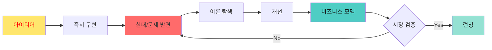

**역진행 학습 방정식**:
```
빠른 시제품 제작 × 실패 기반 학습 × 비즈니스 사고 = 기업가형 개발자
```

### 왜 "만들기 먼저" 방식인가?

전통적 교육은 **이론 → 실습 → 프로젝트**지만, AI 시대는 다릅니다.

- ❌ 기존: 6개월 배우고 → 1개월 만들기
- ✅ 새로운: 1일 만들고 → 6개월 개선하며 배우기

**미네르바 스쿨 방식**: 능동적 참여, 실전 문제 해결, 다각도 사고

---

## 📊 3가지 핵심 역할 기반 학습

### 기획자(Planner) → 실행자(Builder) → 디버거(Debugger)

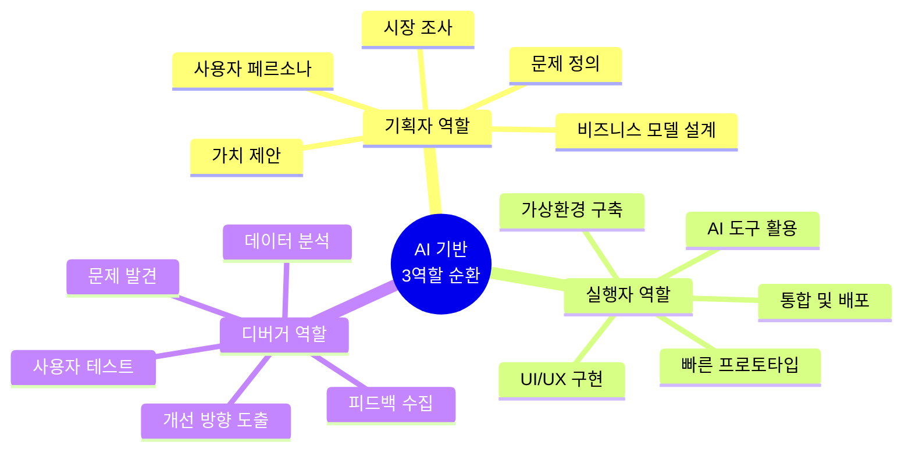

### 각 역할별 AI 도구 활용

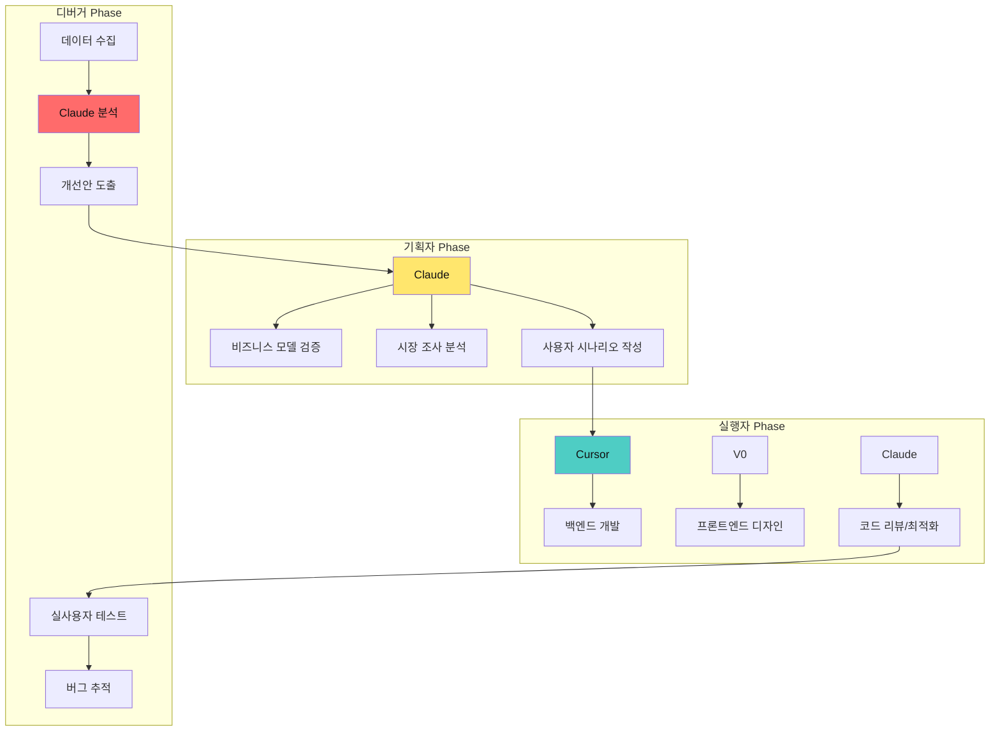

---

## 🚀 전체 프로그램 구조 (24차시, 12주)

### 역진행 PBL: Build → Break → Learn → Business

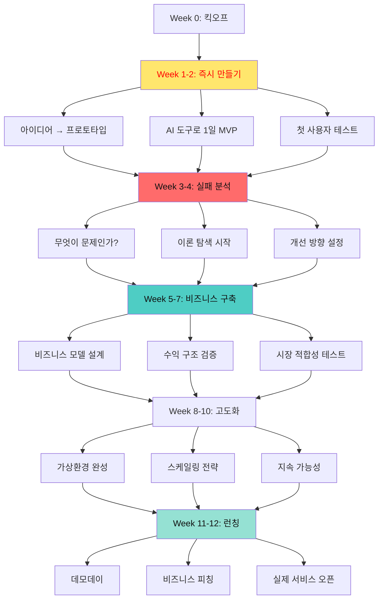

---

## 🎬 Week 0: 킥오프 - "24시간 안에 만들 것"

### 학습 목표
1. **능동적 마인드셋**: 배우지 말고 만들어라
2. **도구 숙련**: AI 도구 3종 세트 마스터
3. **실패 경험**: 첫날부터 실패를 경험하라

### 킥오프 워크샵 (4시간)

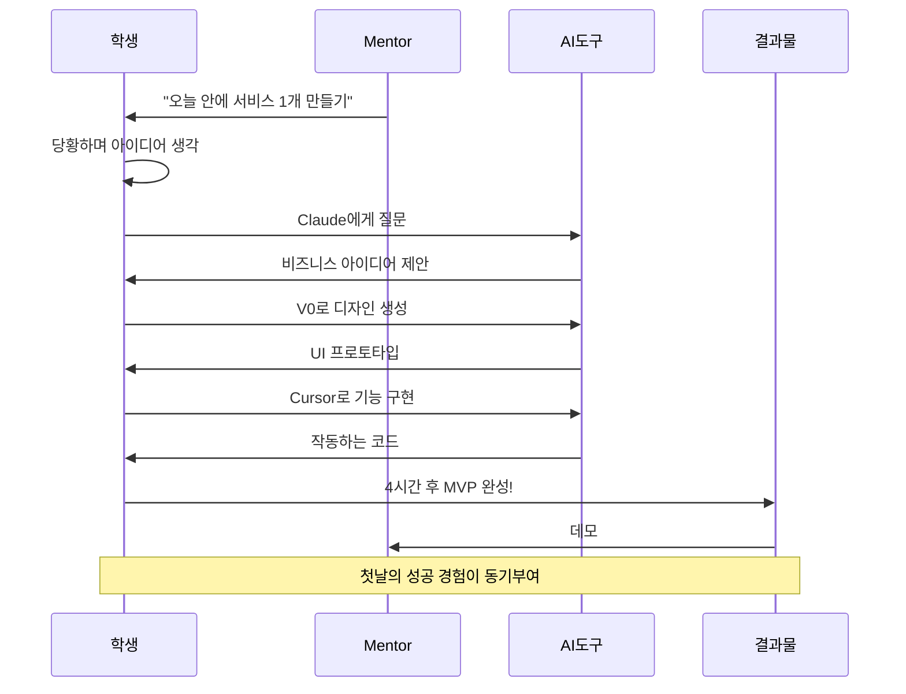

### 도구별 역할 분담

```
┌─────────────────────────────────────────────────┐
│         AI 도구 3종 세트 활용법                  │
├─────────────────────────────────────────────────┤
│                                                 │
│ 1. Claude (기획자의 두뇌)                          │
│    ✓ 비즈니스 아이디어 검증                          │
│    ✓ 사용자 시나리오 작성                            │
│    ✓ 기능 우선순위 결정                              │
│    ✓ 경쟁사 분석                                   │
│    ✓ 마케팅 전략 수립                               │
│                                                 │
│ 2. V0 (디자이너의 손)                              │
│    ✓ UI/UX 프로토타입 생성                          │
│    ✓ 반응형 디자인 자동화                            │
│    ✓ 컴포넌트 라이브러리 구축                   │
│    ✓ 브랜딩 및 스타일 가이드                    │
│    ✓ 사용자 플로우 시각화                       │
│                                                 │
│ 3. Cursor (개발자의 팔)                         │
│    ✓ 백엔드 로직 구현                           │
│    ✓ 데이터베이스 설계                          │
│    ✓ API 통합                                   │
│    ✓ 버그 수정 및 최적화                        │
│    ✓ 배포 자동화                                │
└─────────────────────────────────────────────────┘
```

### 첫 프로젝트: "24시간 챌린지"

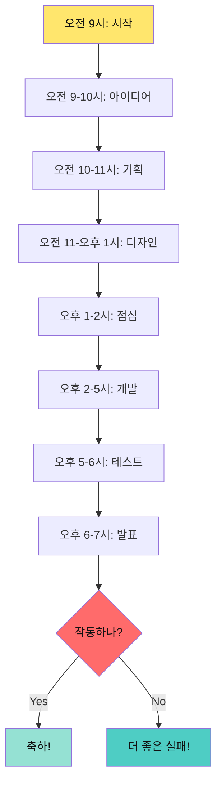

---

## 🏗️ Week 1-2: 즉시 만들기 Phase

### 목표: 이론 없이 만들어보기

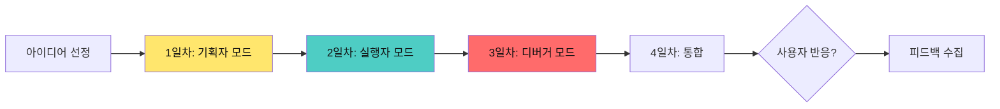

---

### 1-2차시: 기획자 역할 - 비즈니스 모델 캔버스

**학습 목표**: 비즈니스 관점에서 프로젝트 정의하기

#### 비즈니스 모델 캔버스 (BMC) 작성

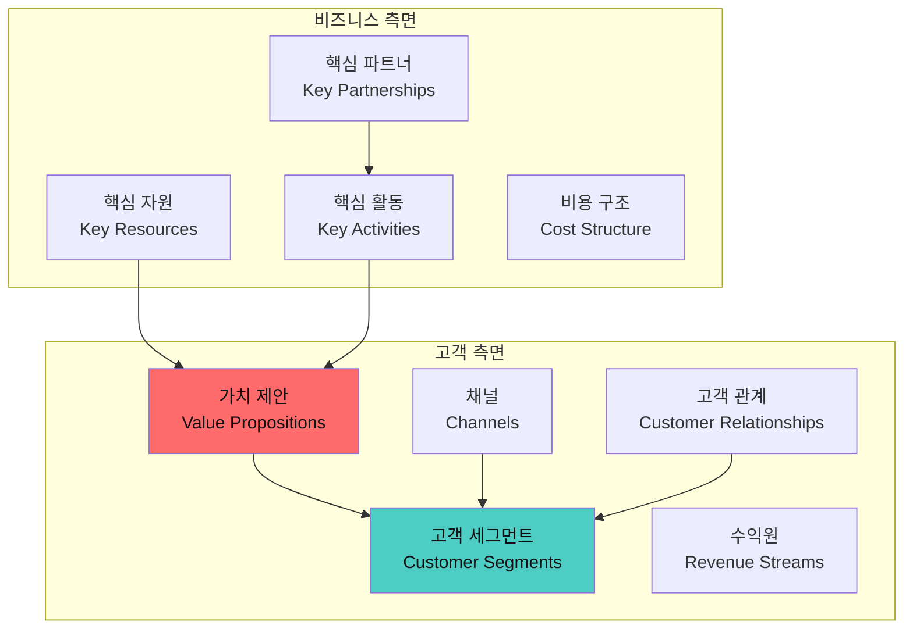

**실습: AI로 비즈니스 모델 검증하기**

```
┌─────────────────────────────────────────────────┐
│    Claude를 활용한 BMC 작성 프롬프트             │
├─────────────────────────────────────────────────┤
│                                                 │
│ 역할: 당신은 린 스타트업 전문가입니다.          │
│                                                 │
│ 맥락:                                           │
│ - 대상: 고등학생 대상 AI 학습 서비스            │
│ - 문제: 기존 교육은 지루하고 수동적             │
│ - 솔루션: 게임형 가상환경 학습 플랫폼           │
│                                                 │
│ 요청:                                           │
│ 1. 비즈니스 모델 캔버스 9가지 요소 작성         │
│ 2. 각 요소별 구체적 예시 3가지                  │
│ 3. 수익 모델 5가지 아이디어                     │
│ 4. 경쟁 우위 분석                               │
│ 5. 시장 진입 전략                               │
│                                                 │
│ 출력 형식:                                      │
│ - 표 형태로 정리                                │
│ - 각 항목마다 실행 가능한 액션 아이템           │
│ - 검증 방법 포함                                │
│                                                 │
│ 제약:                                           │
│ - 초기 투자 비용: 0원 (AI 도구만 활용)          │
│ - 개발 기간: 2주                                │
│ - 첫 사용자 목표: 10명                          │
└─────────────────────────────────────────────────┘
```

#### 페르소나 정의

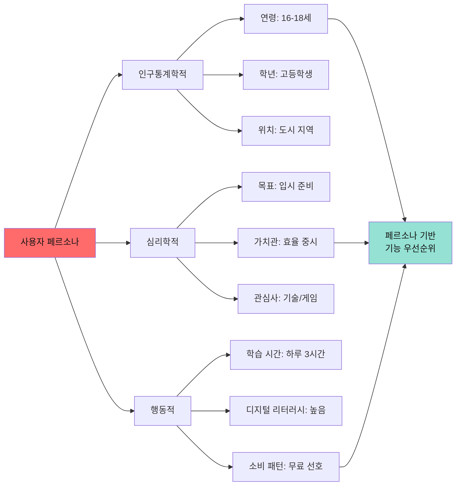

**페르소나 워크시트**

```
┌─────────────────────────────────────────────────┐
│           사용자 페르소나 정의서                 │
├─────────────────────────────────────────────────┤
│                                                 │
│ 이름: [가상의 사용자 이름]                      │
│ 사진: [이미지 생성 AI로 제작]                   │
│                                                 │
│ 기본 정보:                                      │
│ - 나이: _____ 세                                │
│ - 직업/학년: _____________________             │
│ - 거주지: _____________________                │
│                                                 │
│ 하루 일과:                                      │
│ 06:00 - _____________________                  │
│ 09:00 - _____________________                  │
│ 12:00 - _____________________                  │
│ 18:00 - _____________________                  │
│ 22:00 - _____________________                  │
│                                                 │
│ 문제 상황:                                      │
│ "________________________________"              │
│                                                 │
│ 목표:                                           │
│ 단기: _____________________                    │
│ 중기: _____________________                    │
│ 장기: _____________________                    │
│                                                 │
│ 우리 서비스를 사용하는 이유:                    │
│ 1. _____________________                       │
│ 2. _____________________                       │
│ 3. _____________________                       │
│                                                 │
│ 기대 효과:                                      │
│ _________________________________              │
└─────────────────────────────────────────────────┘
```

---

### 3-4차시: 실행자 역할 - V0로 UI 프로토타입 제작

**학습 목표**: 디자인 없이 AI로 즉시 UI 생성

#### V0 활용 프로세스

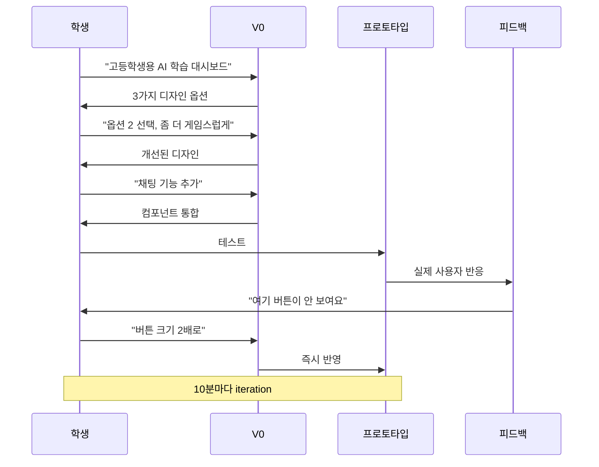

#### 가상환경 UI 설계

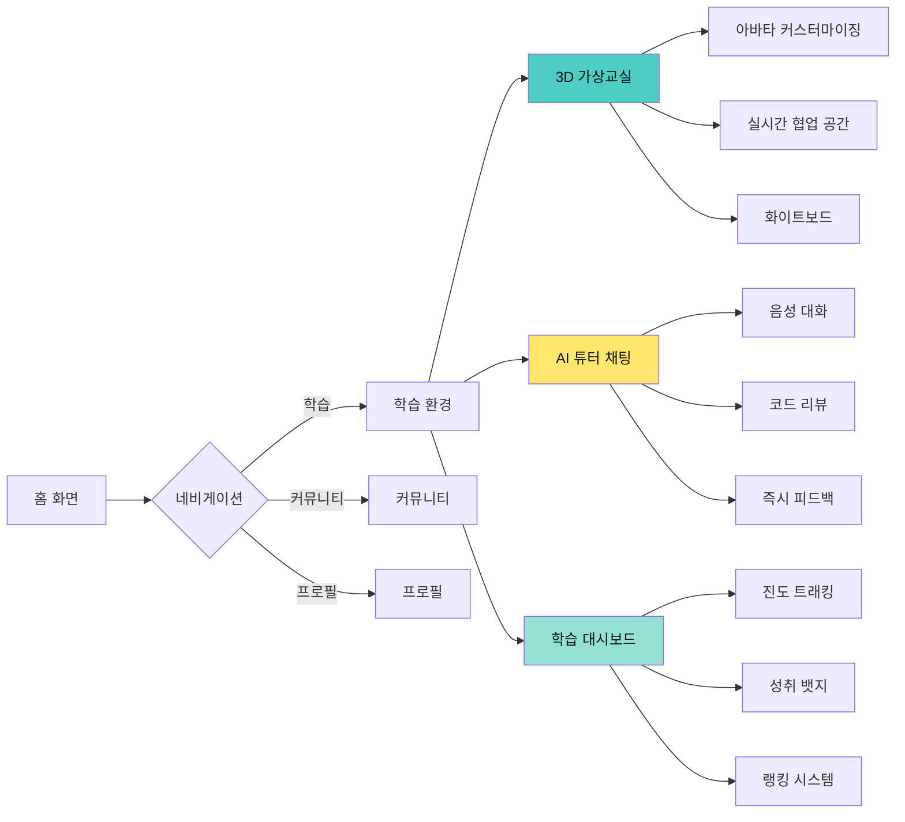

**V0 프롬프트 예시**

```
프롬프트:

"고등학생용 AI 학습 플랫폼의 메인 대시보드를 디자인해줘.

요구사항:
- 다크 모드 기반
- 게이미피케이션 요소 (레벨, 경험치 바, 뱃지)
- 3개 섹션: 오늘의 미션, 학습 진도, AI 튜터
- 네온 컬러 강조 (보라색, 청록색)
- 카드 레이아웃
- 반응형 디자인 (모바일 우선)

참고 스타일: Duolingo + Discord 조합"
```

---

### 5-6차시: 실행자 역할 - Cursor로 백엔드 구현

**학습 목표**: 프론트엔드를 작동하는 서비스로 연결

#### Cursor 개발 워크플로우

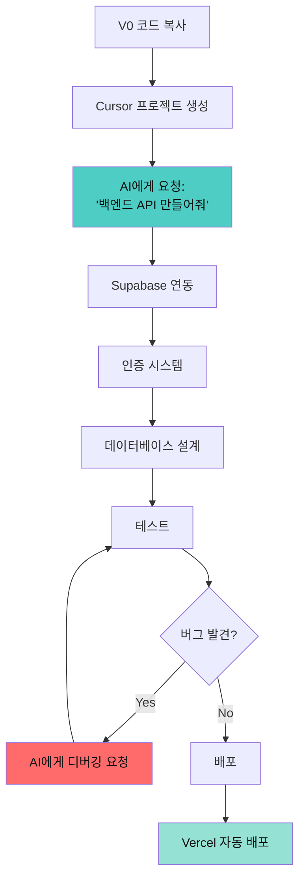

#### 기능별 구현 순서

```
┌─────────────────────────────────────────────────┐
│        Cursor로 구현할 핵심 기능 리스트          │
├─────────────────────────────────────────────────┤
│                                                 │
│ Day 1: 기본 구조 (2시간)                        │
│ □ Next.js 프로젝트 세팅                         │
│ □ V0 코드 통합                                  │
│ □ 라우팅 구조 설계                              │
│                                                 │
│ Day 2: 인증 시스템 (3시간)                      │
│ □ Clerk/Auth0 통합                              │
│ □ 회원가입/로그인 플로우                        │
│ □ 소셜 로그인 (Google, GitHub)                  │
│                                                 │
│ Day 3: 데이터베이스 (3시간)                     │
│ □ Supabase 연결                                 │
│ □ 사용자 프로필 스키마                          │
│ □ 학습 데이터 스키마                            │
│                                                 │
│ Day 4: AI 통합 (4시간)                          │
│ □ OpenAI API 연동                               │
│ □ 챗봇 기능 구현                                │
│ □ 개인화 추천 알고리즘                          │
│                                                 │
│ Day 5: 가상환경 (4시간)                         │
│ □ Three.js / React Three Fiber                  │
│ □ 3D 공간 구현                                  │
│ □ 아바타 시스템                                 │
│                                                 │
│ Day 6: 실시간 기능 (3시간)                      │
│ □ WebSocket 연결                                │
│ □ 실시간 채팅                                   │
│ □ 협업 기능                                     │
│                                                 │
│ Day 7-8: 통합 & 배포 (4시간)                    │
│ □ 전체 테스트                                   │
│ □ 성능 최적화                                   │
│ □ Vercel 배포                                   │
└─────────────────────────────────────────────────┘
```

#### Cursor 프롬프트 예시

```
프롬프트 (Cursor Composer):

"Next.js 14와 Supabase를 사용해서 AI 학습 플랫폼의 백엔드를 만들어줘.

요구사항:

1. 데이터베이스 스키마:
   - users: id, email, username, avatar, level, xp
   - learning_sessions: id, user_id, topic, duration, score
   - achievements: id, user_id, badge_type, earned_at

2. API 엔드포인트:
   - POST /api/auth/signup
   - GET /api/user/profile
   - POST /api/learning/start-session
   - GET /api/leaderboard

3. AI 통합:
   - OpenAI GPT-4 API로 개인화 학습 계획 생성
   - 사용자 학습 패턴 분석

4. 실시간 기능:
   - Socket.io로 실시간 랭킹 업데이트
   - 실시간 채팅

파일 구조:
/app
  /api
  /components
  /lib
/supabase

TypeScript, 에러 핸들링, 환경변수 사용"
```

---

### 7-8차시: 디버거 역할 - 사용자 테스트 & 피드백

**학습 목표**: 실패에서 배우기

#### 사용자 테스트 프로토콜

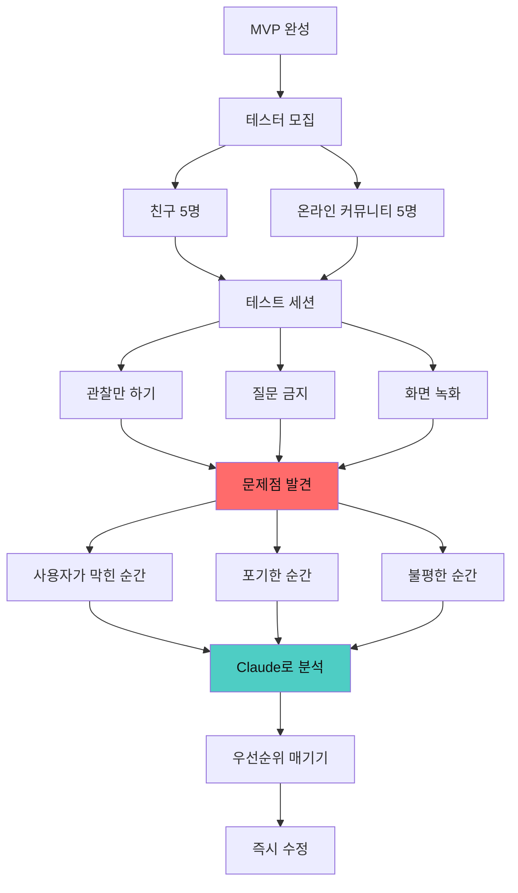

#### 실패 로그 작성

```
┌─────────────────────────────────────────────────┐
│              실패 학습 일지                      │
├─────────────────────────────────────────────────┤
│                                                 │
│ 테스트 날짜: 2025-12-11                         │
│ 테스터: 친구 A (고2, 남)                        │
│                                                 │
│ 🔴 실패 #1: 회원가입 포기                       │
│ 시간: 00:32                                     │
│ 상황: "이메일 인증 너무 복잡해"                 │
│ 근본 원인: 3단계 인증 프로세스                  │
│ 학습: 마찰 최소화의 중요성                      │
│ 해결: 소셜 로그인으로 원클릭 가입               │
│                                                 │
│ 🔴 실패 #2: 3D 환경 로딩 느림                   │
│ 시간: 02:15                                     │
│ 상황: "5초 동안 빈 화면"                        │
│ 근본 원인: 3D 모델 최적화 부족                  │
│ 학습: 체감 성능의 중요성                        │
│ 해결: 로딩 스켈레톤 + 프로그레스 바 추가        │
│                                                 │
│ 🔴 실패 #3: AI 튜터 답변 부정확                 │
│ 시간: 08:40                                     │
│ 상황: "내 질문과 상관없는 답변"                 │
│ 근본 원인: 프롬프트 엔지니어링 미흡             │
│ 학습: 맥락 관리의 중요성                        │
│ 해결: 대화 히스토리 포함 + 검증 단계 추가      │
│                                                 │
│ 💡 이번 주 핵심 학습:                           │
│ "사용자는 3초 안에 가치를 느껴야 한다"          │
└─────────────────────────────────────────────────┘
```

---

## 🔥 Week 3-4: 실패 분석 & 이론 탐색 Phase

### 목표: 실패에서 이론 찾기

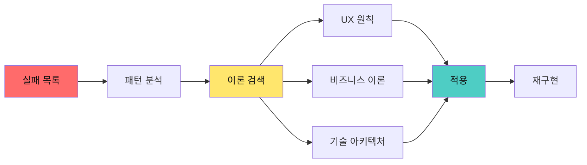

---

### 9-10차시: 실패 패턴 분석 & UX 원칙 학습

**실패에서 도출하는 이론**

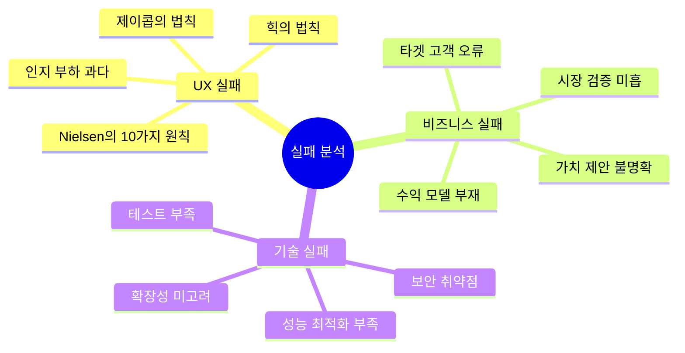

**Claude로 실패 분석하기**

```
프롬프트:

"우리 팀의 사용자 테스트 실패 사례를 분석해줘.

실패 사례:
1. 회원가입 전환율 20% (목표: 70%)
2. 평균 세션 시간 2분 (목표: 15분)
3. 3D 환경 이탈률 60% (목표: 10%)

데이터:
- 사용자 화면 녹화 10개
- 히트맵 분석 결과
- 사용자 인터뷰 녹취록

요청:
1. 각 실패의 근본 원인 3가지
2. 관련 UX/UI 이론 및 원칙
3. 경쟁사는 어떻게 해결했나?
4. 구체적 개선 방안 5가지 (우선순위 포함)
5. A/B 테스트 계획

출력 형식:
- 표와 다이어그램 활용
- 실행 가능한 액션 아이템
- 검증 지표 포함"
```

---

### 11-12차시: 이론 기반 재설계

**학습한 이론 적용하기**

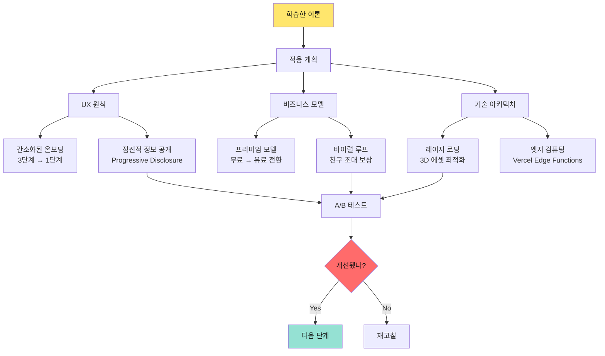

---

## 💼 Week 5-7: 비즈니스 구축 Phase

### 목표: 수익 모델 설계 & 시장 검증

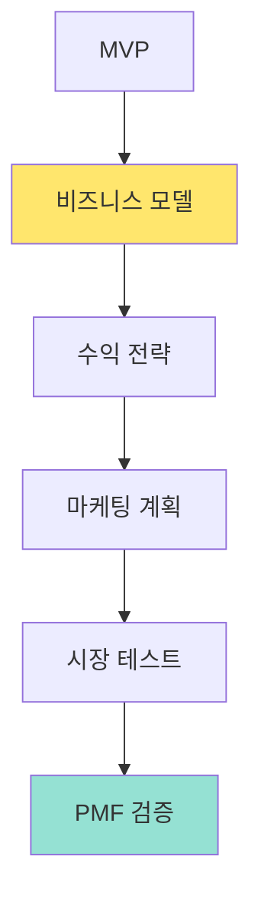

---

### 13-14차시: 수익 모델 설계

**5가지 수익 모델 탐색**

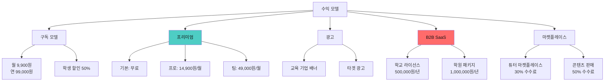

**단위 경제학(Unit Economics) 계산**

```
┌─────────────────────────────────────────────────┐
│           수익 모델 계산 워크시트                │
├─────────────────────────────────────────────────┤
│                                                 │
│ 1. CAC (고객 획득 비용)                         │
│    마케팅 비용: 1,000,000원/월                  │
│    신규 가입자: 100명/월                        │
│    CAC = 10,000원/명                            │
│                                                 │
│ 2. LTV (고객 생애 가치)                         │
│    월 구독료: 9,900원                           │
│    평균 구독 기간: 12개월                       │
│    LTV = 118,800원                              │
│                                                 │
│ 3. LTV:CAC 비율                                 │
│    118,800 / 10,000 = 11.88                     │
│    ✅ 목표: 3:1 이상 (달성!)                    │
│                                                 │
│ 4. 손익분기점                                   │
│    고정비: 500,000원/월                         │
│    변동비: 100원/명                             │
│    공헌이익: 9,800원/명                         │
│    BEP = 51명                                   │
│                                                 │
│ 5. 6개월 후 예상 매출                           │
│    월별 성장률: 20%                             │
│    6개월 후 사용자: 300명                       │
│    예상 MRR: 2,970,000원                        │
│    예상 ARR: 35,640,000원                       │
└─────────────────────────────────────────────────┘
```

---

### 15-16차시: 시장 진입 전략 (Go-to-Market)

**GTM 전략 수립**

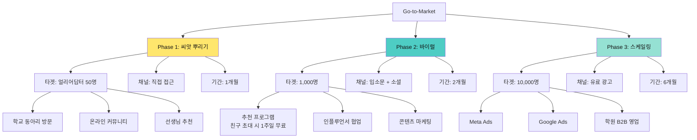

---

### 17-18차시: 피칭 & 투자 유치 시뮬레이션

**5분 피칭 구조**

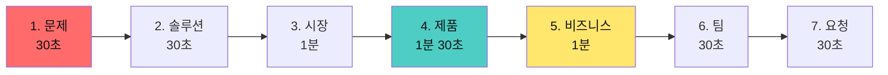

**피치덱 템플릿**

```
┌─────────────────────────────────────────────────┐
│              피치덱 12장 구성                    │
├─────────────────────────────────────────────────┤
│                                                 │
│ 1. 커버: 서비스명 + 한 줄 설명                  │
│    "AI로 배우는 미래 교육의 시작"               │
│                                                 │
│ 2. 문제: 기존 교육의 한계                       │
│    - 수동적 학습                                │
│    - 낮은 몰입도                                │
│    - 개인화 부족                                │
│                                                 │
│ 3. 솔루션: 우리의 가상환경 플랫폼               │
│    - AI 개인 튜터                               │
│    - 게임형 학습 경험                           │
│    - 실시간 협업                                │
│                                                 │
│ 4. 시장 규모 (TAM, SAM, SOM)                    │
│    TAM: 10조원 (에듀테크 시장)                  │
│    SAM: 1조원 (고교생 AI 교육)                  │
│    SOM: 100억원 (초기 목표)                     │
│                                                 │
│ 5. 제품 데모 (스크린샷/영상)                    │
│    - 3D 가상교실                                │
│    - AI 튜터 대화                               │
│    - 학습 대시보드                              │
│                                                 │
│ 6. 트랙션 (성과 지표)                           │
│    - β 사용자: 50명                             │
│    - 평균 세션: 25분                            │
│    - NPS 점수: 72                               │
│    - 유료 전환율: 15%                           │
│                                                 │
│ 7. 비즈니스 모델                                │
│    - 구독: 9,900원/월                           │
│    - B2B: 500,000원/학교/년                     │
│    - 마켓플레이스: 수수료 30%                   │
│                                                 │
│ 8. 경쟁 분석                                    │
│    우리만의 차별점: AI + 가상환경 + 게이미피케이션│
│                                                 │
│ 9. 로드맵 (6개월, 1년, 3년)                     │
│    Q1: MVP → Q2: PMF → Q3: 스케일링             │
│                                                 │
│ 10. 팀 소개                                     │
│     - 기획자: [이름]                            │
│     - 개발자: [이름]                            │
│     - 디자이너: [이름]                          │
│                                                 │
│ 11. 재무 계획                                   │
│     - 12개월 runway                             │
│     - 손익분기점: 8개월차                       │
│                                                 │
│ 12. 요청 사항                                   │
│     "시드 투자 5천만원 유치"                    │
└─────────────────────────────────────────────────┘
```

---

## 🚀 Week 8-10: 고도화 & 스케일링 Phase

### 목표: 가상환경 완성 & 성장 전략

```mermaid
graph LR
    A[기본 MVP] --> B[고도화]
    B --> C[3D 환경 개선]
    B --> D[AI 개인화]
    B --> E[소셜 기능]
    
    C --> F[베타 런칭]
    D --> F
    E --> F
    
    F --> G[성장 해킹]
    G --> H[스케일링]
    
    style B fill:#4ecdc4,color:#111
    style G fill:#ff6b6b,color:#111
    style H fill:#95e1d3,color:#111
```

---

### 19-20차시: 가상환경 완성 - 3D 공간 구현

**Three.js / React Three Fiber 활용**

```mermaid
graph LR
    VE[가상환경] --> Space[공간 설계]
    VE --> Avatar[아바타 시스템]
    VE --> Interact[상호작용]
    
    Space --> S1[가상 교실]
    Space --> S2[스터디 카페]
    Space --> S3[게임 존]
    
    S1 --> S1_1[화이트보드]
    S1 --> S1_2[책상 배치]
    S1 --> S1_3[프레젠테이션 영역]
    
    Avatar --> A1[커스터마이징]
    Avatar --> A2[표정/제스처]
    Avatar --> A3[음성 동기화]
    
    A1 --> A1_1[Ready Player Me 통합]
    A1 --> A1_2[NFT 아바타 지원]
    
    Interact --> I1[음성 채팅]
    Interact --> I2[화면 공유]
    Interact --> I3[협업 도구]
    
    style VE fill:#4ecdc4,color:#111
```

**Cursor 프롬프트: 3D 환경 구현**

```
프롬프트:

"React Three Fiber를 사용해서 가상 학습 공간을 만들어줘.

요구사항:

1. 3D 교실 환경
   - 10명 수용 가능
   - 책상, 의자, 화이트보드
   - 조명 및 그림자 효과

2. 아바타 시스템
   - Ready Player Me API 통합
   - 실시간 위치 동기화 (Socket.io)
   - 이름표 표시

3. 상호작용
   - 마우스로 이동
   - 가까운 사용자와 자동 음성 채팅
   - 화이트보드에 그리기

4. 성능 최적화
   - LOD (Level of Detail)
   - Frustum Culling
   - 60fps 유지

5. 모바일 대응
   - 터치 컨트롤
   - 단순화된 모델
   - 30fps 목표

파일 구조:
/components/3d
  /Scene.tsx
  /Avatar.tsx
  /Classroom.tsx
  /Controls.tsx

TypeScript, 주석 포함, 에러 핸들링"
```

---

### 21-22차시: AI 개인화 엔진

**학습 패턴 분석 & 추천 시스템**

```mermaid
graph TD
    User[사용자 행동] --> Collect[데이터 수집]
    
    Collect --> C1[학습 시간]
    Collect --> C2[선호 주제]
    Collect --> C3[난이도 선택]
    Collect --> C4[완료율]
    
    C1 --> Analyze[AI 분석]
    C2 --> Analyze
    C3 --> Analyze
    C4 --> Analyze
    
    Analyze --> Pattern[패턴 인식]
    Pattern --> P1[아침형 학습자]
    Pattern --> P2[시각형 학습자]
    Pattern --> P3[협업형 학습자]
    
    P1 --> Recommend[개인화 추천]
    P2 --> Recommend
    P3 --> Recommend
    
    Recommend --> R1[맞춤 콘텐츠]
    Recommend --> R2[최적 시간대]
    Recommend --> R3[추천 스터디 메이트]
    
    R1 --> Feedback[피드백 수집]
    R2 --> Feedback
    R3 --> Feedback
    
    Feedback --> Collect
    
    style Analyze fill:#4ecdc4,color:#111
    style Recommend fill:#95e1d3,color:#111
```

**Claude 프롬프트: 개인화 알고리즘 설계**

```
프롬프트:

"학습 데이터를 분석해서 개인화 추천 시스템을 설계해줘.

데이터 샘플:
{
  userId: "user_123",
  sessions: [
    {date: "2025-12-01", duration: 45, topic: "AI 기초", score: 85},
    {date: "2025-12-02", duration: 30, topic: "Python", score: 70},
    ...
  ],
  preferences: {
    timeSlots: ["09:00-11:00", "20:00-22:00"],
    learningStyle: "visual",
    difficulty: "intermediate"
  }
}

요청:

1. 학습자 프로필링 알고리즘
   - 학습 스타일 분류 (시각/청각/체감각)
   - 최적 학습 시간대
   - 난이도 적응

2. 콘텐츠 추천 로직
   - 협업 필터링
   - 콘텐츠 기반 필터링
   - 하이브리드 접근

3. 적응형 난이도 조절
   - 실시간 성과 분석
   - 동적 난이도 조절
   - 최근접 발달 영역(ZPD) 계산

4. 구현 방법
   - Python/TypeScript 코드
   - API 엔드포인트 설계
   - 데이터베이스 스키마

5. A/B 테스트 계획
   - 추천 있음 vs 없음
   - 성과 지표: 완료율, 만족도, 재방문율"
```

---

### 23-24차시: 성장 해킹 전략

**바이럴 루프 설계**

```mermaid
graph TD
    Start[신규 사용자] --> Value[가치 경험]
    Value --> Share{공유 동기?}
    
    Share -->|Yes| Invite[친구 초대]
    Share -->|No| Incentive[인센티브 제공]
    
    Incentive --> I1[초대 시 1주일 무료]
    Incentive --> I2[랭킹 보너스]
    Incentive --> I3[뱃지 획득]
    
    I1 --> Invite
    I2 --> Invite
    I3 --> Invite
    
    Invite --> NewUser[신규 사용자 유입]
    NewUser --> Value
    
    NewUser --> Growth[지수 성장]
    
    Growth --> Viral{K-factor > 1?}
    Viral -->|Yes| Success[바이럴 성공]
    Viral -->|No| Optimize[최적화]
    
    Optimize --> Share
    
    style Value fill:#ffe66d,color:#111
    style Viral fill:#ff6b6b,color:#111
    style Success fill:#95e1d3,color:#111
```

**K-factor 계산**

```
┌─────────────────────────────────────────────────┐
│            바이럴 계수 계산기                    │
├─────────────────────────────────────────────────┤
│                                                 │
│ K-factor = (초대 수) × (전환율)                 │
│                                                 │
│ 현재 지표:                                      │
│ - 사용자당 평균 초대: 3명                       │
│ - 초대 수락률: 40%                              │
│ - K-factor = 3 × 0.4 = 1.2                      │
│                                                 │
│ ✅ K > 1: 바이럴 성장!                          │
│                                                 │
│ 시뮬레이션 (K=1.2):                             │
│ - Day 0: 100명                                  │
│ - Day 7: 358명 (+258%)                          │
│ - Day 14: 1,283명 (+1,183%)                     │
│ - Day 30: 23,737명                              │
│                                                 │
│ 개선 목표:                                      │
│ □ 초대 수 3명 → 5명                             │
│ □ 수락률 40% → 50%                              │
│ → 목표 K-factor: 2.5                            │
└─────────────────────────────────────────────────┘
```

---

## 🏆 Week 11-12: 런칭 & 데모데이

### 목표: 실제 시장 진입 & 투자 유치

```mermaid
graph LR
    A[최종 준비] --> B[프로덕트 헌트 런칭]
    B --> C[데모데이]
    C --> D[언론 보도]
    D --> E[초기 고객 확보]
    E --> F[투자 유치]
    
    style B fill:#ffe66d,color:#f00
    style C fill:#ff6b6b,color:#111
    style F fill:#95e1d3,color:#111
```

---

### 25-26차시: 프로덕트 헌트 런칭 전략

**완벽한 런칭 체크리스트**

```
┌─────────────────────────────────────────────────┐
│        Product Hunt 런칭 준비 리스트             │
├─────────────────────────────────────────────────┤
│                                                 │
│ D-7: 커뮤니티 구축                              │
│ □ Twitter 팔로워 500명 확보                     │
│ □ Discord 서버 오픈 (100명 초대)                │
│ □ Reddit 관련 서브레딧 활동                     │
│                                                 │
│ D-3: 콘텐츠 준비                                │
│ □ 프로덕트 헌트 설명 작성 (500자)               │
│ □ 데모 영상 제작 (60초)                         │
│ □ 스크린샷 10장 (고해상도)                      │
│ □ 로고 및 썸네일 최적화                         │
│                                                 │
│ D-1: 지원군 확보                                │
│ □ 100명 런칭 서포터즈 모집                      │
│ □ 업보트 타이밍 공유 (PST 00:01)                │
│ □ 댓글 답변 템플릿 준비                         │
│                                                 │
│ D-Day: 런칭                                     │
│ 00:01 PST: 제품 등록                            │
│ 00:30: 첫 업보트 100개 목표                     │
│ 08:00: 모든 댓글 답변                           │
│ 12:00: 추가 콘텐츠 공유                         │
│ 20:00: 최종 스퍼트                              │
│                                                 │
│ D+1: 팔로우업                                   │
│ □ 결과 분석 및 감사 메시지                      │
│ □ 피드백 수집 및 로드맵 공유                    │
│ □ 언론 보도 자료 배포                           │
└─────────────────────────────────────────────────┘
```

---

### 27-28차시: 데모데이 & 피칭

**데모데이 구성**

```mermaid
graph TD
    Demo[데모데이] --> Team1[팀 1: 피칭]
    Demo --> Team2[팀 2: 라이브 데모]
    Demo --> Team3[팀 3: Q&A]
    
    Team1 --> T1_1[5분 피칭]
    Team1 --> T1_2[피치덱 발표]
    
    Team2 --> T2_1[실시간 서비스 시연]
    Team2 --> T2_2[사용자 testimonial]
    
    Team3 --> T3_1[투자자 질문]
    Team3 --> T3_2[기술 질문]
    Team3 --> T3_3[비즈니스 질문]
    
    T1_1 --> Judge[심사위원 평가]
    T2_1 --> Judge
    T3_1 --> Judge
    
    Judge --> Award[시상]
    Award --> A1[대상: 1,000만원]
    Award --> A2[우수상: 500만원]
    Award --> A3[장려상: 300만원]
    
    style Demo fill:#ff6b6b,color:#111
    style Judge fill:#ffe66d,color:#111
    style A1 fill:#95e1d3,color:#111
```

**라이브 데모 스크립트**

```
┌─────────────────────────────────────────────────┐
│            5분 라이브 데모 스크립트              │
├─────────────────────────────────────────────────┤
│                                                 │
│ [00:00-00:30] 문제 제시                         │
│ "여러분, 공부할 때 이런 경험 없으신가요?        │
│  - 혼자 공부하면 집중 안 됨                     │
│  - AI 챗봇은 너무 딱딱함                        │
│  - 온라인 강의는 지루함                         │
│                                                 │
│  저희도 똑같은 문제를 겪었습니다."              │
│                                                 │
│ [00:30-01:00] 솔루션 소개                       │
│ "그래서 만들었습니다. [서비스명]                │
│  AI와 함께하는 가상 스터디 카페입니다."         │
│                                                 │
│ [01:00-03:00] 라이브 데모                       │
│ 1. 로그인 → 아바타 선택 (10초)                 │
│ 2. 가상 카페 입장 (20초)                        │
│ 3. AI 튜터와 대화 (40초)                        │
│    "이 수학 문제 풀이 설명해줘"                 │
│ 4. 친구와 협업 (30초)                           │
│    화이트보드에 같이 그리기                     │
│ 5. 학습 리포트 확인 (20초)                      │
│                                                 │
│ [03:00-04:00] 트랙션 & 비즈니스                 │
│ "2주 만에:                                      │
│  ✓ 베타 사용자 150명                            │
│  ✓ 일 평균 사용 시간 35분                       │
│  ✓ 유료 전환율 18%                              │
│  ✓ MRR 280만원                                  │
│                                                 │
│  구독 모델 + B2B 학원 라이선스"                 │
│                                                 │
│ [04:00-04:45] 비전                              │
│ "우리의 목표는 전 세계 학생들이                 │
│  AI와 함께 즐겁게 배우는 미래를 만드는 것입니다"│
│                                                 │
│ [04:45-05:00] 요청                              │
│ "여러분의 지원과 투자를 기다립니다.             │
│  지금 바로 체험해보세요!"                       │
│                                                 │
│ [QR 코드 표시: 즉시 체험 링크]                  │
└─────────────────────────────────────────────────┘
```

---

## 📊 평가 체계: 3역할 기반

### 종합 평가 프레임워크

```mermaid
graph LR
    Eval[전체 평가<br/>100점] --> Role1[기획자 역할<br/>35점]
    Eval --> Role2[실행자 역할<br/>35점]
    Eval --> Role3[디버거 역할<br/>20점]
    Eval --> Business[비즈니스<br/>10점]
    
    Role1 --> R1_1[문제 정의: 10점]
    Role1 --> R1_2[비즈니스 모델: 15점]
    Role1 --> R1_3[시장 조사: 10점]
    
    Role2 --> R2_1[프로토타입 완성도: 15점]
    Role2 --> R2_2[기술 구현: 10점]
    Role2 --> R2_3[UX/UI: 10점]
    
    Role3 --> R3_1[사용자 테스트: 10점]
    Role3 --> R3_2[데이터 분석: 5점]
    Role3 --> R3_3[개선 실행: 5점]
    
    Business --> B1[수익 모델: 5점]
    Business --> B2[GTM 전략: 5점]
    
    style Role1 fill:#ffe66d,color:#111
    style Role2 fill:#4ecdc4,color:#111
    style Role3 fill:#ff6b6b,color:#111
```

### 루브릭(Rubric) 세부 기준

```
┌─────────────────────────────────────────────────┐
│              평가 루브릭 (상세)                  │
├─────────────────────────────────────────────────┤
│                                                 │
│ 1. 기획자 역할 (35점)                           │
│                                                 │
│ [문제 정의 10점]                                │
│ • 10점: 5W1H 완벽, 데이터 기반, 검증됨          │
│ • 7점: 구체적이나 일부 검증 부족                │
│ • 5점: 추상적, 검증 없음                        │
│ • 3점: 불명확                                   │
│                                                 │
│ [비즈니스 모델 15점]                            │
│ • 15점: BMC 완성, 수익 실현, Unit Economics     │
│ • 10점: BMC 완성, 수익 모델 있으나 미검증       │
│ • 5점: 수익 모델 아이디어만                     │
│ • 0점: 비즈니스 모델 없음                       │
│                                                 │
│ [시장 조사 10점]                                │
│ • 10점: 경쟁사 분석, TAM/SAM/SOM, 차별화 명확   │
│ • 7점: 기본 조사 완료                           │
│ • 3점: 최소한의 조사                            │
│                                                 │
│ ────────────────────────────────────────────    │
│                                                 │
│ 2. 실행자 역할 (35점)                           │
│                                                 │
│ [프로토타입 완성도 15점]                        │
│ • 15점: 완전 작동, 배포됨, 10명 이상 사용       │
│ • 10점: 주요 기능 작동                          │
│ • 5점: 부분 작동                                │
│ • 0점: 작동 안 함                               │
│                                                 │
│ [기술 구현 10점]                                │
│ • 10점: 3D 환경, AI 통합, 실시간 기능, 최적화   │
│ • 7점: 주요 기술 구현                           │
│ • 3점: 기본 구현만                              │
│                                                 │
│ [UX/UI 10점]                                    │
│ • 10점: 직관적, 반응형, 브랜딩 일관성           │
│ • 7점: 사용 가능한 수준                         │
│ • 3점: UI만 존재                                │
│                                                 │
│ ────────────────────────────────────────────    │
│                                                 │
│ 3. 디버거 역할 (20점)                           │
│                                                 │
│ [사용자 테스트 10점]                            │
│ • 10점: 10명 이상 테스트, 정량/정성 데이터      │
│ • 7점: 5명 이상 테스트                          │
│ • 3점: 최소한의 테스트                          │
│                                                 │
│ [데이터 분석 5점]                               │
│ • 5점: Claude로 분석, 인사이트 도출             │
│ • 3점: 기본 분석                                │
│                                                 │
│ [개선 실행 5점]                                 │
│ • 5점: 3회 이상 iteration, 지표 개선            │
│ • 3점: 1-2회 개선                               │
│                                                 │
│ ────────────────────────────────────────────    │
│                                                 │
│ 4. 비즈니스 (10점)                              │
│                                                 │
│ [수익 모델 5점]                                 │
│ • 5점: 실제 수익 발생                           │
│ • 3점: 명확한 수익 계획                         │
│                                                 │
│ [GTM 전략 5점]                                  │
│ • 5점: 실행 완료, 초기 고객 확보                │
│ • 3점: 구체적 계획                              │
└─────────────────────────────────────────────────┘
```

---

## 🎓 교사 가이드: 퍼실리테이션

### 역할별 코칭 전략

```mermaid
graph LR
    Teacher[교사 역할] --> Coach[코치]
    Teacher --> Mentor[멘토]
    Teacher --> Connector[연결자]
    
    Coach --> C1[질문하기]
    Coach --> C2[관찰하기]
    Coach --> C3[피드백하기]
    
    C1 --> C1_1["왜 그렇게 생각했나요?"]
    C1 --> C1_2["다른 방법은 없을까요?"]
    C1 --> C1_3["사용자는 어떻게 반응했나요?"]
    
    Mentor --> M1[실패 격려]
    Mentor --> M2[방향 제시]
    Mentor --> M3[자원 연결]
    
    M1 --> M1_1["좋은 실패입니다!"]
    M1 --> M1_2["이제 뭘 배웠나요?"]
    
    Connector --> Co1[전문가 연결]
    Connector --> Co2[팀 매칭]
    Connector --> Co3[네트워킹]
    
    style Coach fill:#ffe66d,color:#111
    style Mentor fill:#4ecdc4,color:#111
    style Connector fill:#95e1d3,color:#111
```

### 주차별 교사 체크리스트

```
┌─────────────────────────────────────────────────┐
│          교사 주간 체크리스트                    │
├─────────────────────────────────────────────────┤
│                                                 │
│ Week 1-2: 만들기 Phase                          │
│ □ 모든 학생이 첫날에 뭔가 만들었는가?           │
│ □ 도구 사용에 어려움은 없는가?                  │
│ □ 실패를 긍정적으로 받아들이는가?               │
│ □ 개별 코칭: 기획자 역할 강화                   │
│                                                 │
│ Week 3-4: 분석 Phase                            │
│ □ 실패 패턴을 스스로 발견하는가?                │
│ □ 이론 탐색을 능동적으로 하는가?                │
│ □ 팀 내 토론이 활발한가?                        │
│ □ 개별 코칭: 비판적 사고 독려                   │
│                                                 │
│ Week 5-7: 비즈니스 Phase                        │
│ □ 비즈니스 모델이 현실적인가?                   │
│ □ 시장 조사를 충분히 했는가?                    │
│ □ 수익 창출 가능성이 있는가?                    │
│ □ 개별 코칭: 기업가 마인드셋                    │
│                                                 │
│ Week 8-10: 고도화 Phase                         │
│ □ 기술적 완성도가 높아지는가?                   │
│ □ 사용자 피드백을 반영하는가?                   │
│ □ 팀 간 협업이 원활한가?                        │
│ □ 개별 코칭: 실행력 강화                        │
│                                                 │
│ Week 11-12: 런칭 Phase                          │
│ □ 데모데이 준비가 완료되었는가?                 │
│ □ 피칭 연습을 충분히 했는가?                    │
│ □ 실제 사용자 확보 계획이 있는가?               │
│ □ 개별 코칭: 발표 스킬, 자신감                  │
└─────────────────────────────────────────────────┘
```

---

## 🛠️ 필수 도구 & 리소스

### AI 도구 스택

```mermaid
graph LR
    Tools[도구 스택] --> Plan[기획 도구]
    Tools --> Build[개발 도구]
    Tools --> Test[테스트 도구]
    
    Plan --> P1[Claude Pro]
    Plan --> P2[ChatGPT Plus]
    Plan --> P3[Notion AI]
    
    Build --> B1[Cursor]
    Build --> B2[V0 by Vercel]
    Build --> B3[GitHub Copilot]
    Build --> B4[Supabase]
    Build --> B5[Vercel]
    
    Test --> T1[Hotjar]
    Test --> T2[Google Analytics]
    Test --> T3[Mixpanel]
    
    style Plan fill:#ffe66d,color:#111
    style Build fill:#4ecdc4,color:#111
    style Test fill:#ff6b6b,color:#111
```

### 예산 계획 (학생 1인당)

```
┌─────────────────────────────────────────────────┐
│           3개월 프로그램 예산                    │
├─────────────────────────────────────────────────┤
│                                                 │
│ AI 도구 구독:                                   │
│ - Claude Pro: $20/월 × 3 = $60                  │
│ - Cursor Pro: $20/월 × 3 = $60                  │
│ - V0: $20/월 × 3 = $60 (팀당 1개)               │
│   소계: $180 (약 240,000원)                     │
│                                                 │
│ 개발 인프라:                                    │
│ - Vercel Pro: $20/월 × 3 = $60                  │
│ - Supabase: 무료 플랜 사용                      │
│ - Domains: $15/년                               │
│   소계: $75 (약 100,000원)                      │
│                                                 │
│ 마케팅:                                         │
│ - Product Hunt Ship: $79 (선택)                 │
│ - 소셜 미디어 광고: $100 (선택)                 │
│   소계: $179 (약 240,000원)                     │
│                                                 │
│ 총 예산: $434 (약 580,000원)                    │
│                                                 │
│ 💡 팁: 학생 계정 할인 활용 시 50% 절감 가능     │
└─────────────────────────────────────────────────┘
```

---

## 🌟 성공 사례 & 기대 효과

### 프로그램 완료 후 학생 역량

```mermaid
mindmap
  root((프로그램<br/>완료 후))
    기획 역량
      문제 정의 능력
      비즈니스 모델 설계
      시장 분석 능력
      전략적 사고
    개발 역량
      AI 도구 숙련도
      빠른 프로토타이핑
      풀스택 개발 이해
      배포 경험
    비즈니스 역량
      기업가 정신
      피칭 스킬
      고객 개발
      수익 창출 경험
    협업 역량
      팀워크
      피드백 수용
      커뮤니케이션
      리더십
```

### 실제 성과 지표 (예상)

```
┌─────────────────────────────────────────────────┐
│           프로그램 성과 지표 (KPI)               │
├─────────────────────────────────────────────────┤
│                                                 │
│ 프로젝트 완성도:                                │
│ • 100% 학생이 작동하는 MVP 완성                 │
│ • 80% 학생이 실제 사용자 10명 이상 확보         │
│ • 50% 팀이 데모데이에서 투자 관심 받음          │
│                                                 │
│ 역량 향상:                                      │
│ • AI 도구 활용 능력: 초보 → 중급 이상           │
│ • 기획 능력: 평균 70% 향상                      │
│ • 개발 능력: 0 → 1 (비개발자도 구현 가능)       │
│ • 비즈니스 이해: 평균 80% 향상                  │
│                                                 │
│ 비즈니스 성과:                                  │
│ • 30% 팀이 실제 수익 발생 ($100+ MRR)           │
│ • 10% 팀이 후속 투자 유치 (500만원+)            │
│ • 50% 학생이 창업 또는 인턴십 제안 받음         │
│                                                 │
│ 마인드셋 변화:                                  │
│ • "실패는 배움"이라는 인식: 90%                 │
│ • "나도 만들 수 있다" 자신감: 95%               │
│ • 기업가적 사고방식: 70% 향상                   │
└─────────────────────────────────────────────────┘
```

---

## 🚀 다음 단계: 프로그램 이후

### 졸업 후 경로

```mermaid
graph LR
    Complete[프로그램 완료] --> Path1[창업]
    Complete --> Path2[취업/인턴]
    Complete --> Path3[오픈소스]
    Complete --> Path4[심화 학습]
    
    Path1 --> P1_1[엑셀러레이터 지원]
    Path1 --> P1_2[크라우드펀딩]
    Path1 --> P1_3[정부 지원 사업]
    
    Path2 --> P2_1[스타트업 인턴]
    Path2 --> P2_2[에이전시 주니어]
    Path2 --> P2_3[대기업 인턴십]
    
    Path3 --> P3_1[GitHub 프로젝트]
    Path3 --> P3_2[커뮤니티 기여]
    Path3 --> P3_3[개발자 브랜딩]
    
    Path4 --> P4_1[고급 AI 코스]
    Path4 --> P4_2[전문화 -3D/게임]
    Path4 --> P4_3[해외 부트캠프]
    
    style Complete fill:#95e1d3,color:#f00
    style Path1 fill:#ff6b6b
```

---

## 📝 맺음말

### 핵심 메시지

```
┌─────────────────────────────────────────────────┐
│                                                 │
│        "만들면서 배우고, 실패하며 성장하고,      │
│         비즈니스로 완성하는 AI 시대 교육"        │
│                                                 │
│  이 프로그램은 단순히 기술을 가르치지 않습니다.  │
│     문제를 발견하고, 해결책을 만들고,            │
│      시장에서 검증받는 전 과정을 경험합니다.     │
│                                                 │
│        12주 후, 당신은 이렇게 변할 것입니다:     │
│                                                 │
│  ✅ 아이디어를 24시간 안에 MVP로 만드는 기획자   │
│  ✅ AI 도구로 혼자서도 서비스를 만드는 실행자    │
│  ✅ 데이터로 문제를 찾고 개선하는 디버거         │
│  ✅ 비즈니스 관점에서 사고하는 기업가            │
│                                                 │
│         실패는 끝이 아니라 시작입니다.           │
│          지금 바로 만들기 시작하세요!            │
│                                                 │
└─────────────────────────────────────────────────┘
```

---

**프로그램 정보**  
- **버전**: 1.0 (가상환경 & 비즈니스 중심)  
- **제작일**: 2025-12-11  
- **대상**: 고등학생 (기획자/개발자/기업가 지망생)  
- **교육 방식**: 역진행 PBL + 미네르바식 능동 학습  
- **기간**: 12주 (24차시)  
- **핵심 도구**: Cursor, V0, Claude  
- **핵심 역량**: 기획자 × 실행자 × 디버거 × 기업가 정신


