# 바이브 코딩 AI 개발 프로세스 📐🤖

> **핵심 철학:** "문제 정의 × AI 활용 = 최상의 결과"

---

## 📋 목차

1. [프로세스 개요](#프로세스-개요)
2. [7단계 개발 프로세스](#7단계-개발-프로세스)
3. [질문 정의 방법론](#질문-정의-방법론)
4. [AI 활용 전략](#ai-활용-전략)
5. [5대 주제별 적용](#5대-주제별-적용)
6. [평가 기준](#평가-기준)

---

## 프로세스 개요

### 🎯 바이브 코딩이란?

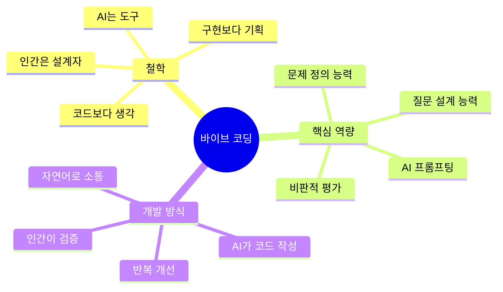

### 전체 프로세스 흐름

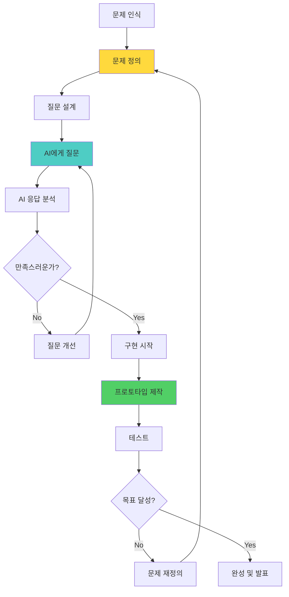

### ⏱️ 시간 배분 원칙

```
┌─────────────────────────────────────┐
│  전체 프로젝트 시간 배분 (100%)      │
├─────────────────────────────────────┤
│                                     │
│  문제 정의 ████████████░░  40%      │
│  AI 활용   ████████░░░░░  25%      │
│  구현      ██████░░░░░░░  20%      │
│  테스트    ███░░░░░░░░░░  10%      │
│  개선      █░░░░░░░░░░░░   5%      │
│                                     │
└─────────────────────────────────────┘
```

**왜 문제 정의에 40%를?**
- 잘 정의된 문제 = AI가 정확히 이해
- 명확한 질문 = 원하는 답변 획득
- 시행착오 최소화 = 전체 시간 단축

---

## 7단계 개발 프로세스

### 📊 전체 단계 Overview

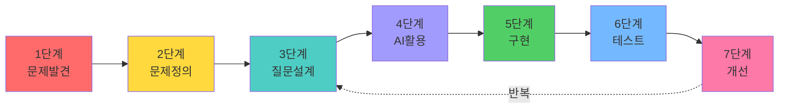

---

### 1️⃣ 단계: 문제 발견 (Problem Discovery)

#### 목표
**일상의 불편함을 발견하고 해결할 가치가 있는 문제 선택**

#### 활동

**브레인스토밍 질문**
```
1. 내가 자주 겪는 불편함은?
2. 친구들이 힘들어하는 것은?
3. 시간이 많이 걸리는 일은?
4. 반복적으로 하는 귀찮은 일은?
5. 더 나아질 수 있는 것은?
```

**문제 발견 프레임워크**

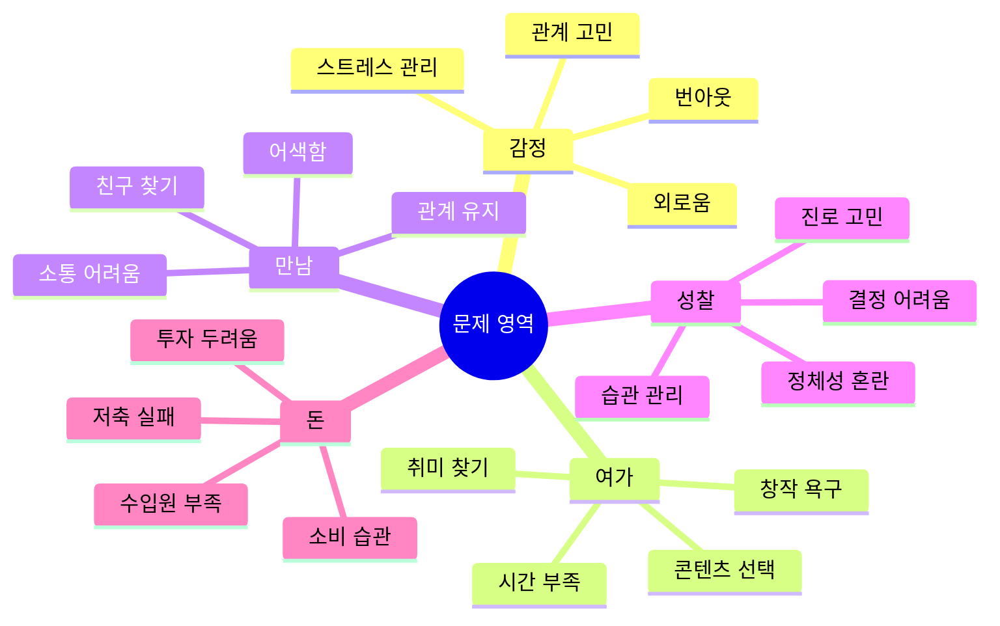

**실습 워크시트**

```
┌─────────────────────────────────┐
│  문제 발견 워크시트              │
├─────────────────────────────────┤
│  1. 불편한 상황 3가지            │
│     ① _____________________     │
│     ② _____________________     │
│     ③ _____________________     │
│                                 │
│  2. 각 상황의 빈도               │
│     ① 매일 / 주 3회 / 월 1회   │
│     ② 매일 / 주 3회 / 월 1회   │
│     ③ 매일 / 주 3회 / 월 1회   │
│                                 │
│  3. 해결 시 가장 큰 효과는?      │
│     ______________________      │
│                                 │
│  4. 선택한 문제                  │
│     ______________________      │
│     (가장 빈도 높고 효과 큰 것)  │
└─────────────────────────────────┘
```

---

### 2️⃣ 단계: 문제 정의 (Problem Definition)

#### 목표
**5W1H로 문제를 구체적으로 정의하기**

#### 문제 정의 템플릿

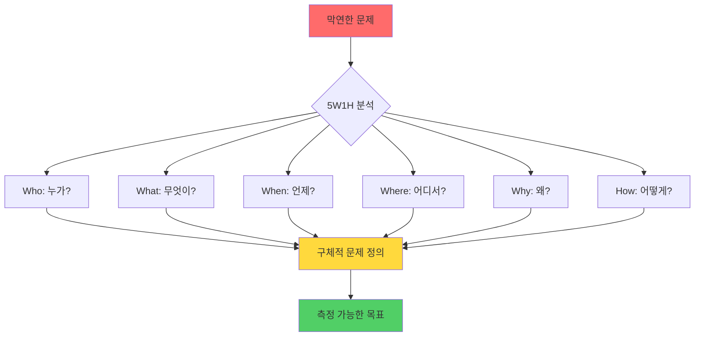

#### 실전 예시

**❌ 나쁜 예: 막연한 문제**
```
"공부가 어려워요"
```

**✅ 좋은 예: 구체적 문제**
```
┌─────────────────────────────────────┐
│  문제 정의서                         │
├─────────────────────────────────────┤
│  Who (누가):                         │
│  고등학생 나, 특히 수학 시험 때      │
│                                     │
│  What (무엇이):                      │
│  문제 유형 판단에 시간 소요          │
│                                     │
│  When (언제):                        │
│  시험 중 문제당 평균 5분             │
│                                     │
│  Where (어디서):                     │
│  객관식 20문제 중 10문제에서         │
│                                     │
│  Why (왜):                           │
│  비슷한 문제 유형 구별 못함          │
│                                     │
│  How (어떻게):                       │
│  → AI로 유형 자동 판단 시스템 개발   │
│                                     │
│  📊 측정 목표:                       │
│  판단 시간 5분 → 1분으로 단축 (80%)  │
└─────────────────────────────────────┘
```

#### 문제 정의 체크리스트

```
✅ 구체적인가? (Specific)
   □ 누가, 무엇을, 언제가 명확한가?

✅ 측정 가능한가? (Measurable)
   □ 숫자로 표현할 수 있는가?
   □ 개선 정도를 측정할 수 있는가?

✅ 달성 가능한가? (Achievable)
   □ 현실적으로 해결 가능한가?
   □ 내가 만들 수 있는 범위인가?

✅ 관련성이 있는가? (Relevant)
   □ 실제로 도움이 되는가?
   □ 사용할 사람이 있는가?

✅ 기한이 있는가? (Time-bound)
   □ 언제까지 만들 것인가?
```

---

### 3️⃣ 단계: 질문 설계 (Question Design)

#### 목표
**AI가 정확히 이해할 수 있는 프롬프트 작성**

#### 7단계 프롬프트 템플릿

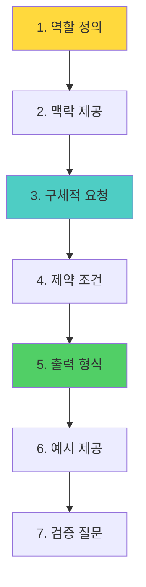

#### 프롬프트 구조

```
┌─────────────────────────────────────────┐
│  7단계 프롬프트 템플릿                   │
├─────────────────────────────────────────┤
│                                         │
│  1️⃣ 역할 (Role)                         │
│  당신은 [전문가]입니다.                  │
│  예: "당신은 10년 경력의 UX 디자이너"    │
│                                         │
│  2️⃣ 맥락 (Context)                      │
│  [상황 설명]                             │
│  예: "고등학생 대상 감정 일기 앱 기획"   │
│                                         │
│  3️⃣ 요청 (Request)                      │
│  [구체적인 요청]                         │
│  예: "UI/UX 개선 방안 3가지 제안"        │
│                                         │
│  4️⃣ 제약 (Constraints)                  │
│  [제한 조건]                             │
│  예: "모바일 우선, 3클릭 이내 도달"      │
│                                         │
│  5️⃣ 출력 형식 (Format)                  │
│  [원하는 형식]                           │
│  예: "표 형식으로, 각 항목마다 이유 설명" │
│                                         │
│  6️⃣ 예시 (Example)                      │
│  [참고 예시]                             │
│  예: "비슷한 앱: Daylio, Moodflow"       │
│                                         │
│  7️⃣ 검증 (Verification)                 │
│  [확인 질문]                             │
│  예: "각 제안의 구현 난이도도 알려줘"    │
│                                         │
└─────────────────────────────────────────┘
```

#### 실전 예시: 감정 AI

**❌ 나쁜 프롬프트**
```
"감정 일기 앱 만들어줘"
```

**✅ 좋은 프롬프트**
```
당신은 10년 경력의 UX/UI 디자이너입니다.

[맥락]
고등학생들이 감정을 기록하고 패턴을 발견하는 
감정 일기 앱을 기획하고 있습니다.

[문제]
학생들은 일기 쓰기를 귀찮아하고, 
매일 지속하기 어려워합니다.

[요청]
10대가 매일 사용할 수 있도록
1. 입력을 최소화하는 방법 3가지
2. 지속 동기를 주는 장치 3가지
3. 감정 시각화 아이디어 3가지

[제약 조건]
- 일일 입력 시간 3분 이내
- 모바일 최적화
- 무료 사용 가능

[출력 형식]
표 형식으로 정리하되, 각 아이디어마다:
- 핵심 설명 (50자 이내)
- 예상 효과
- 구현 난이도 (하/중/상)

[예시]
참고할 앱: Daylio (감정 트래킹), 
          Notion (템플릿 시스템)

[검증]
각 아이디어를 실제 고등학생이 
사용할지 평가도 해주세요.
```

---

### 4️⃣ 단계: AI 활용 (AI Utilization)

#### 목표
**AI 도구를 활용하여 원하는 결과 얻기**

#### AI 도구별 활용 전략

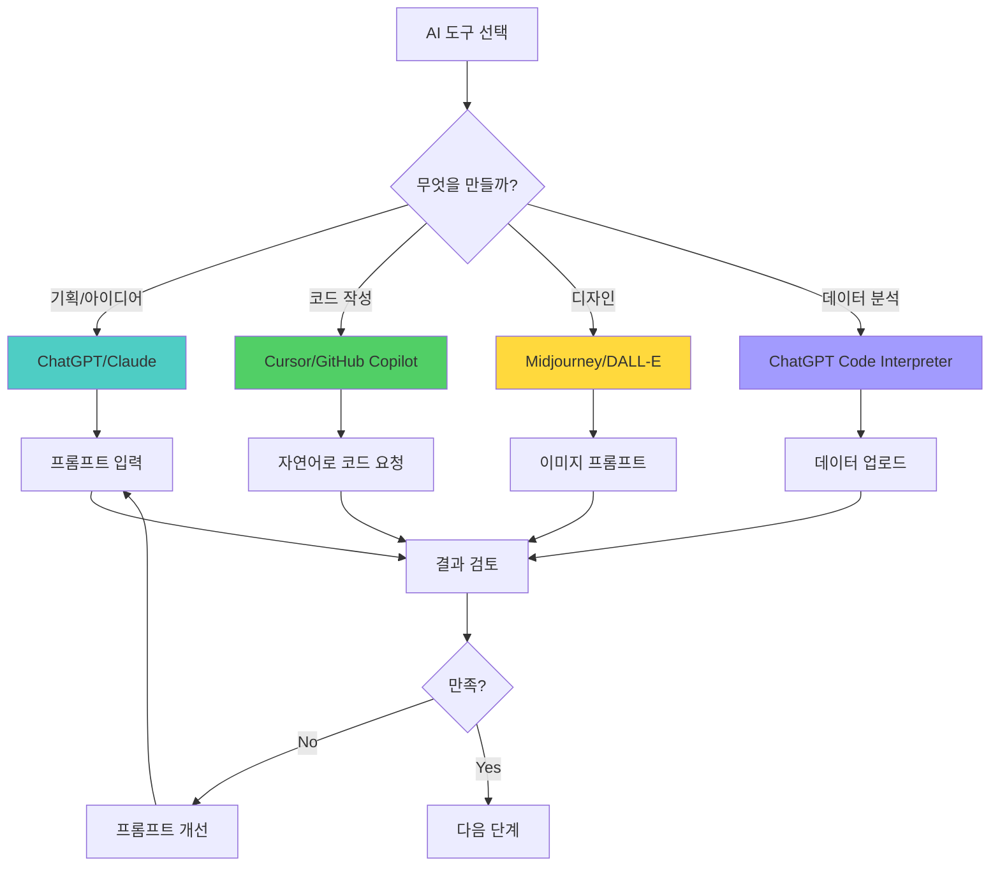

#### PRIMM 사이클 (반복 개선)

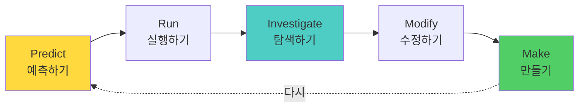

**각 단계 설명:**

```
┌─────────────────────────────────────┐
│  P - Predict (예측하기)              │
├─────────────────────────────────────┤
│  AI가 만들어줄 결과를 미리 예상      │
│                                     │
│  질문:                               │
│  • 이 프롬프트로 무엇이 나올까?      │
│  • 원하는 결과와 같을까?             │
│  • 부족한 정보는 없을까?             │
└─────────────────────────────────────┘

┌─────────────────────────────────────┐
│  R - Run (실행하기)                  │
├─────────────────────────────────────┤
│  프롬프트를 AI에게 입력하고 실행     │
│                                     │
│  주의:                               │
│  • 첫 결과를 바로 수용하지 말 것     │
│  • 여러 버전 생성해서 비교           │
└─────────────────────────────────────┘

┌─────────────────────────────────────┐
│  I - Investigate (탐색하기)          │
├─────────────────────────────────────┤
│  AI 결과를 꼼꼼히 분석               │
│                                     │
│  체크리스트:                         │
│  ✓ 내가 원한 것이 맞는가?            │
│  ✓ 빠진 것은 없는가?                 │
│  ✓ 잘못된 것은 없는가?               │
│  ✓ 개선할 점은?                      │
└─────────────────────────────────────┘

┌─────────────────────────────────────┐
│  M - Modify (수정하기)               │
├─────────────────────────────────────┤
│  프롬프트를 개선하거나 결과 수정     │
│                                     │
│  방법:                               │
│  • 프롬프트에 구체적 조건 추가       │
│  • 예시 제공                         │
│  • 잘못된 부분 지적하고 수정 요청    │
└─────────────────────────────────────┘

┌─────────────────────────────────────┐
│  M - Make (만들기)                   │
├─────────────────────────────────────┤
│  최종 결과물 완성                    │
│                                     │
│  확인:                               │
│  • 처음 목표와 일치하는가?           │
│  • 실제 사용 가능한가?               │
│  • 다른 사람이 이해할 수 있는가?     │
└─────────────────────────────────────┘
```

---

### 5️⃣ 단계: 구현 (Implementation)

#### 목표
**AI가 생성한 코드/디자인을 실제로 작동하게 만들기**

#### 구현 프로세스

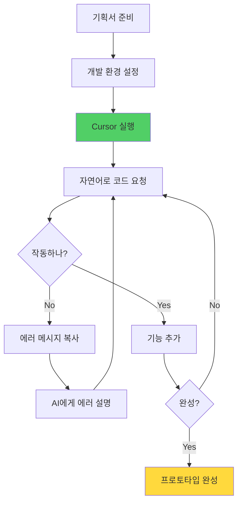

#### Cursor 활용 전략

**기본 원칙:**
```
1. 큰 기능을 작은 단위로 분해
2. 한 번에 하나씩 구현
3. 테스트 후 다음 기능
4. 에러 발생 시 즉시 해결
```

**효과적인 코드 요청 방법:**

```
┌─────────────────────────────────────┐
│  Cursor 프롬프트 예시                │
├─────────────────────────────────────┤
│                                     │
│  단계별 요청:                        │
│                                     │
│  1️⃣ 기본 구조                       │
│  "React로 감정 일기 앱 기본 구조     │
│   만들어줘. 메인 페이지, 입력 페이지,│
│   통계 페이지 3개 필요해"            │
│                                     │
│  2️⃣ 첫 기능                         │
│  "메인 페이지에 오늘 감정 선택하는   │
│   버튼 5개 추가해줘.                 │
│   (기쁨, 슬픔, 화남, 불안, 평온)"    │
│                                     │
│  3️⃣ 데이터 저장                     │
│  "선택한 감정을 로컬스토리지에       │
│   저장하고, 날짜와 함께 저장해줘"    │
│                                     │
│  4️⃣ 시각화                          │
│  "저장된 데이터를 주간 그래프로      │
│   보여주는 통계 페이지 만들어줘"     │
│                                     │
└─────────────────────────────────────┘
```

---

### 6️⃣ 단계: 테스트 (Testing)

#### 목표
**실제 사용자 관점에서 검증하기**

#### 테스트 체크리스트

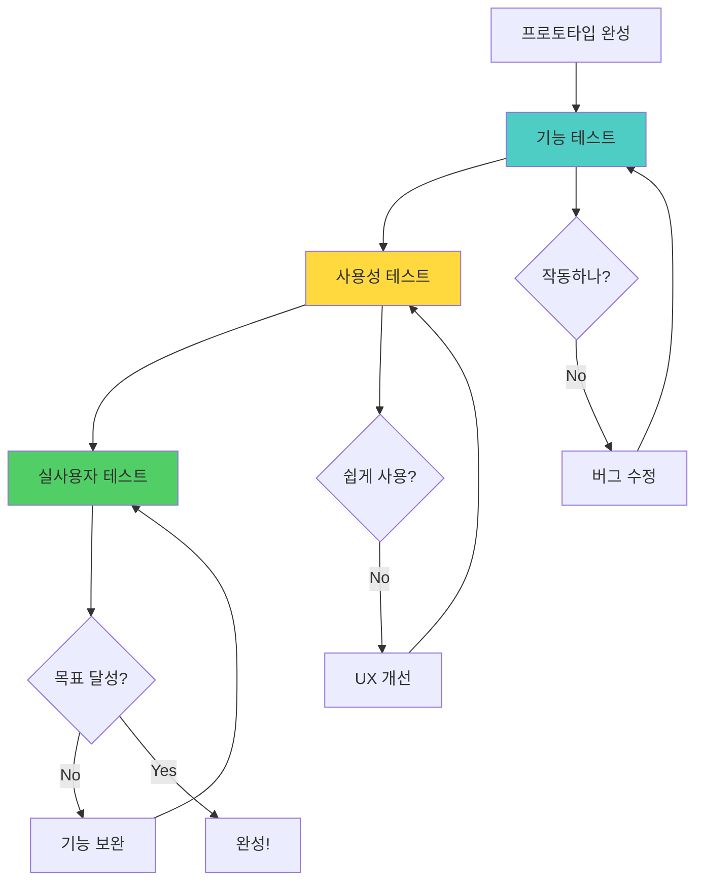

**테스트 워크시트:**

```
┌─────────────────────────────────────┐
│  사용성 테스트 시트                  │
├─────────────────────────────────────┤
│  테스터: ___________                │
│  날짜: _____________                │
│                                     │
│  1. 첫인상 (5점 만점)                │
│     ⭐⭐⭐⭐⭐                       │
│                                     │
│  2. 사용 편의성                      │
│     매우 쉬움 / 보통 / 어려움        │
│                                     │
│  3. 이해하기                         │
│     직관적 / 보통 / 혼란스러움       │
│                                     │
│  4. 불편한 점                        │
│     ________________________        │
│     ________________________        │
│                                     │
│  5. 개선 제안                        │
│     ________________________        │
│     ________________________        │
│                                     │
│  6. 실제로 사용할 의향                │
│     매우 그렇다 / 보통 / 아니다      │
│                                     │
└─────────────────────────────────────┘
```

---

### 7️⃣ 단계: 개선 (Improvement)

#### 목표
**피드백을 반영하여 완성도 높이기**

#### 개선 사이클

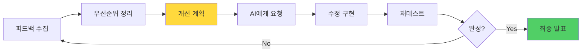

**우선순위 매트릭스:**

```
┌─────────────────────────────────────┐
│  중요도 × 긴급도 매트릭스            │
├─────────────────────────────────────┤
│                                     │
│  높음 │ 1순위        2순위           │
│  중   │ 즉시 해결    계획적 해결      │
│  요   ├─────────────────────────    │
│  도   │ 3순위        4순위           │
│  낮음 │ 여유있을 때  하지 않음        │
│       └─────────────────────────    │
│         낮음    높음                │
│           긴급도                     │
│                                     │
│  예시:                               │
│  1순위: 앱이 자주 멈춤 (버그 수정)   │
│  2순위: 디자인 개선                  │
│  3순위: 추가 기능 (음성 입력)        │
│  4순위: 색상 변경 옵션               │
│                                     │
└─────────────────────────────────────┘
```

---

## 질문 정의 방법론

### 🎯 좋은 질문의 4가지 조건

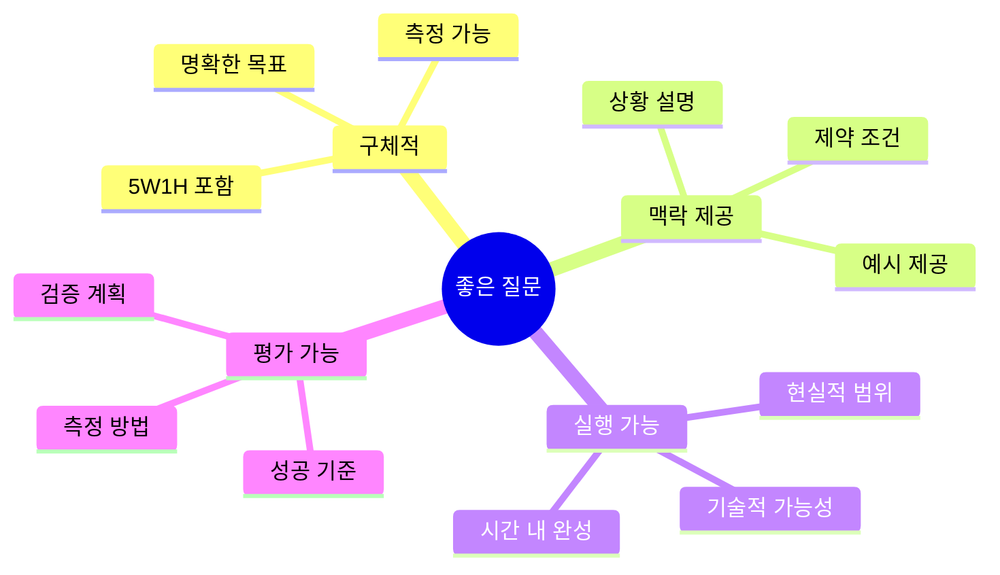

### 질문 레벨 업그레이드

```
┌─────────────────────────────────────┐
│  질문의 진화 과정                    │
├─────────────────────────────────────┤
│                                     │
│  Level 1 (막연) ❌                   │
│  "감정 일기 앱 만들어줘"             │
│                                     │
│  ↓ 누가 사용하나?                    │
│                                     │
│  Level 2 (대상 추가) △               │
│  "고등학생을 위한 감정 일기 앱"      │
│                                     │
│  ↓ 무슨 문제를 해결하나?             │
│                                     │
│  Level 3 (문제 정의) ○               │
│  "감정 기록을 귀찮아하는             │
│   고등학생을 위한 3분 일기 앱"       │
│                                     │
│  ↓ 어떤 기능으로?                    │
│                                     │
│  Level 4 (기능 명시) ◎               │
│  "음성으로 1분 말하면                │
│   AI가 자동 분석해서                 │
│   감정 그래프로 보여주는 앱"         │
│                                     │
│  ↓ 어떻게 측정하나?                  │
│                                     │
│  Level 5 (완벽) ✅                   │
│  "음성 입력으로 일기 작성 시간을     │
│   10분에서 3분으로 줄이고,           │
│   주간 감정 패턴을 시각화해서        │
│   자기 이해를 돕는 앱"               │
│                                     │
└─────────────────────────────────────┘
```

### 질문 품질 체크리스트

```
✅ 5W1H 체크
   □ Who: 누가 사용하는가?
   □ What: 무엇을 만드는가?
   □ When: 언제 사용하는가?
   □ Where: 어디서 사용하는가?
   □ Why: 왜 필요한가?
   □ How: 어떻게 작동하는가?

✅ SMART 체크
   □ Specific: 구체적인가?
   □ Measurable: 측정 가능한가?
   □ Achievable: 달성 가능한가?
   □ Relevant: 관련성 있는가?
   □ Time-bound: 기한이 있는가?

✅ 프롬프트 체크
   □ 역할 정의했는가?
   □ 맥락 제공했는가?
   □ 제약 조건 명시했는가?
   □ 출력 형식 지정했는가?
   □ 예시 제공했는가?
```

---

## AI 활용 전략

### 도구별 Best Practice

#### ChatGPT / Claude

**강점:**
- 아이디어 브레인스토밍
- 기획서 작성
- 사용자 시나리오 생성
- 문서 검토 및 개선

**활용 예시:**

```
┌─────────────────────────────────────┐
│  ChatGPT 활용 시나리오               │
├─────────────────────────────────────┤
│                                     │
│  상황: 감정 AI 프로젝트 기획 단계    │
│                                     │
│  1단계: 아이디어 확장                │
│  "감정 일기 앱에 들어갈 기능         │
│   아이디어 10가지 알려줘"            │
│                                     │
│  2단계: 우선순위 정리                │
│  "위 10가지 중 고등학생이            │
│   가장 좋아할 3가지 골라줘"          │
│                                     │
│  3단계: 구체화                       │
│  "1번 기능을 UI 화면으로             │
│   자세히 설명해줘"                   │
│                                     │
│  4단계: 검증                         │
│  "이 기능의 장단점과                 │
│   구현 난이도 알려줘"                │
│                                     │
└─────────────────────────────────────┘
```

#### Cursor / GitHub Copilot

**강점:**
- 실시간 코드 작성
- 버그 수정
- 리팩토링
- 주석 자동 생성

**활용 팁:**

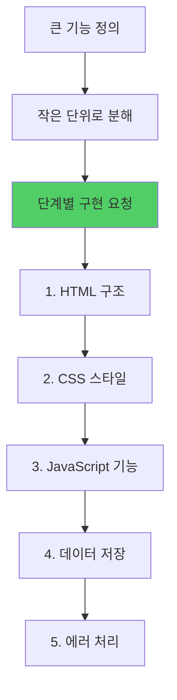

**좋은 프롬프트 예시:**

```javascript
// ✅ 좋은 예: 구체적 요청
// 감정 선택 버튼 5개를 만들어줘
// 각 버튼은 이모지와 텍스트 포함
// 클릭하면 해당 감정이 state에 저장
// 선택된 버튼은 배경색이 변경

// ❌ 나쁜 예: 막연한 요청
// 감정 버튼 만들어줘
```

#### Midjourney / DALL-E

**강점:**
- UI 목업 생성
- 아이콘 제작
- 일러스트 생성

**프롬프트 구조:**

```
[주제] + [스타일] + [색상] + [분위기] + [기술적 세부사항]

예시:
"감정 일기 앱 메인 화면, 미니멀 디자인,
파스텔 톤, 따뜻한 분위기, 모바일 UI,
Figma 스타일, 4K"
```

---

## 5대 주제별 적용

### 1️⃣ 감정 AI 프로젝트

#### 문제 정의 예시

```
┌─────────────────────────────────────┐
│  감정 AI: 번아웃 감지 시스템         │
├─────────────────────────────────────┤
│  Who: 고3 수험생                     │
│  What: 스트레스 레벨 자동 감지       │
│  When: 매일 저녁 10시                │
│  Where: 스마트폰 앱                  │
│  Why: 번아웃 예방                    │
│  How: 음성 일기 감정 분석            │
│                                     │
│  목표:                               │
│  번아웃 조기 감지율 80% 달성         │
└─────────────────────────────────────┘
```

#### 개발 프로세스

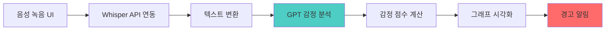

**핵심 AI 활용:**
- Whisper: 음성 → 텍스트
- GPT-4: 감정 분석
- Chart.js: 시각화

---

### 2️⃣ 여가 AI 프로젝트

#### 문제 정의 예시

```
┌─────────────────────────────────────┐
│  여가 AI: 주말 활동 추천 시스템      │
├─────────────────────────────────────┤
│  Who: 20대 직장인                    │
│  What: 맞춤형 활동 추천              │
│  When: 금요일 저녁                   │
│  Where: 모바일 앱                    │
│  Why: 결정 피로도 감소               │
│  How: 상황 기반 AI 매칭              │
│                                     │
│  목표:                               │
│  활동 결정 시간 30분 → 3분으로 단축  │
└─────────────────────────────────────┘
```

#### 개발 프로세스

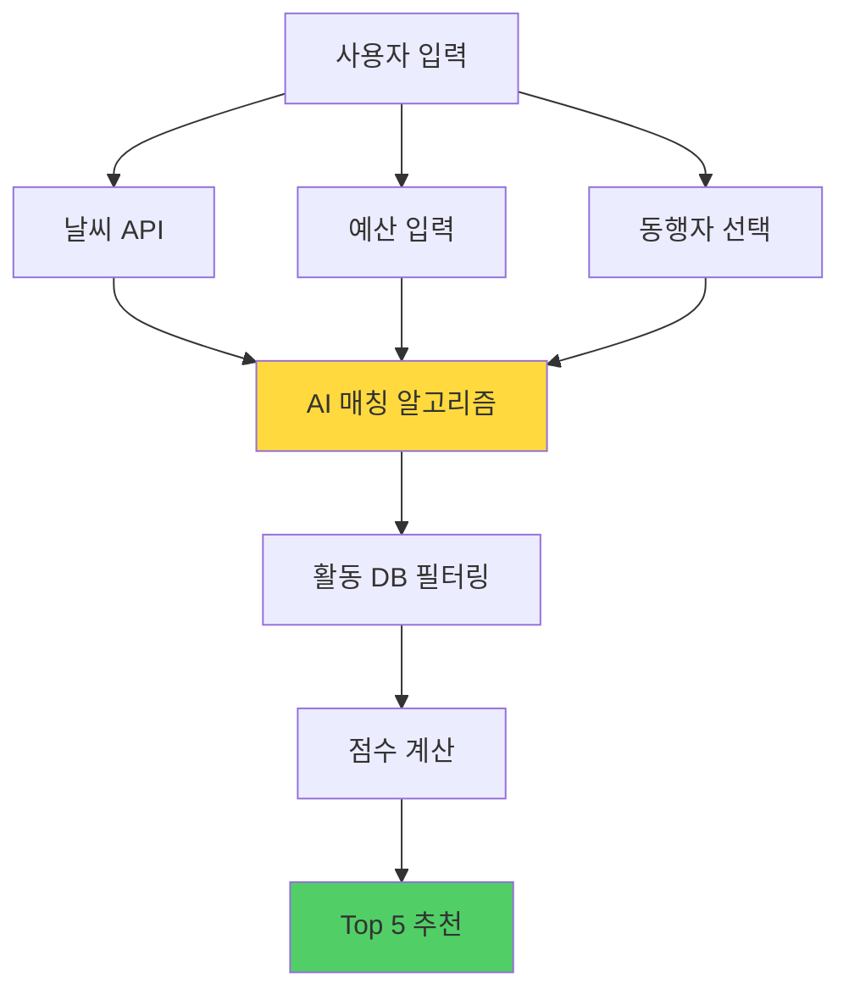

**핵심 AI 활용:**
- GPT-4: 매칭 로직
- 날씨 API: 실시간 데이터
- Google Maps: 장소 정보

---

### 3️⃣ 만남 AI 프로젝트

#### 문제 정의 예시

```
┌─────────────────────────────────────┐
│  만남 AI: 대화 코치 시스템           │
├─────────────────────────────────────┤
│  Who: 사회 초년생                    │
│  What: 실시간 대화 조언              │
│  When: 네트워킹 이벤트 중            │
│  Where: 이어폰 알림                  │
│  Why: 대화 자신감 향상               │
│  How: AI 대화 분석 및 제안           │
│                                     │
│  목표:                               │
│  대화 지속 시간 5분 → 20분 증가      │
└─────────────────────────────────────┘
```

#### 개발 프로세스

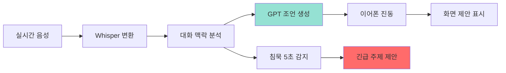

**핵심 AI 활용:**
- Whisper: 실시간 STT
- GPT-4: 대화 분석 + 제안
- TTS: 음성 코칭 (선택)

---

### 4️⃣ 성찰 AI 프로젝트

#### 문제 정의 예시

```
┌─────────────────────────────────────┐
│  성찰 AI: 10년 후 시뮬레이터         │
├─────────────────────────────────────┤
│  Who: 진로 고민 대학생               │
│  What: 미래 예측 시스템              │
│  When: 중요 결정 시점                │
│  Where: 웹 대시보드                  │
│  Why: 후회 없는 선택                 │
│  How: 습관 데이터 기반 예측          │
│                                     │
│  목표:                               │
│  의사결정 만족도 60% → 85% 향상      │
└─────────────────────────────────────┘
```

#### 개발 프로세스

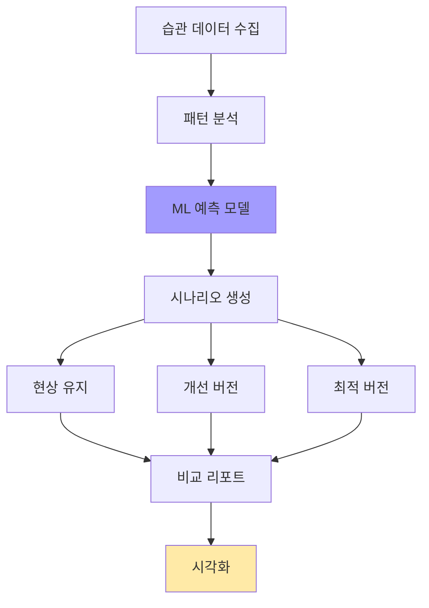

**핵심 AI 활용:**
- GPT-4: 시나리오 생성
- Time Series ML: 예측
- D3.js: 데이터 시각화

---

### 5️⃣ 돈 AI 프로젝트

#### 문제 정의 예시

```
┌─────────────────────────────────────┐
│  돈 AI: 소비 습관 진단 시스템        │
├─────────────────────────────────────┤
│  Who: 저축 실패하는 직장인           │
│  What: 새는 돈 자동 발견             │
│  When: 월말 정산 시                  │
│  Where: 모바일 앱                    │
│  Why: 실질 저축액 증가               │
│  How: 카드 내역 AI 분석              │
│                                     │
│  목표:                               │
│  월 저축액 0원 → 30만원 달성         │
└─────────────────────────────────────┘
```

#### 개발 프로세스

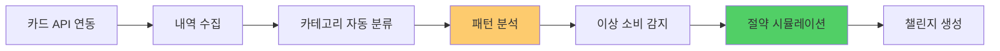

**핵심 AI 활용:**
- GPT-4: 소비 패턴 분석
- ML 분류: 카테고리 자동 분류
- 예측 모델: 10년 시뮬레이션

---

## 평가 기준

### 📊 종합 평가표

```
┌─────────────────────────────────────┐
│  AI 프로젝트 평가 기준 (100점)       │
├─────────────────────────────────────┤
│                                     │
│  1. 문제 정의 능력 (40점)            │
│     ├─ 5W1H 명확성 (15점)           │
│     ├─ 측정 가능성 (10점)            │
│     ├─ 해결 가치 (10점)              │
│     └─ 범위 적절성 (5점)             │
│                                     │
│  2. 질문 설계 능력 (30점)            │
│     ├─ 프롬프트 구조 (10점)          │
│     ├─ 맥락 제공 (10점)              │
│     └─ 반복 개선 (10점)              │
│                                     │
│  3. 구현 능력 (20점)                 │
│     ├─ 기능 완성도 (10점)            │
│     ├─ 코드 품질 (5점)               │
│     └─ UI/UX (5점)                  │
│                                     │
│  4. 개선 능력 (10점)                 │
│     ├─ 피드백 반영 (5점)             │
│     └─ 완성도 향상 (5점)             │
│                                     │
└─────────────────────────────────────┘
```

### 세부 평가 루브릭

#### 문제 정의 평가

```
S등급 (37-40점)
━━━━━━━━━━━━━━━━━━━━━
• 5W1H가 완벽하게 정의됨
• 정량적 목표가 명확함
• 실제 사용자 니즈 반영
• 적절한 범위 설정

A등급 (32-36점)
━━━━━━━━━━━━━━━━━━━━━
• 대부분의 W1H 포함
• 목표가 구체적
• 해결 가치 있음

B등급 (28-31점)
━━━━━━━━━━━━━━━━━━━━━
• 기본 정의는 되어 있음
• 일부 모호한 부분 존재
• 개선 필요

C등급 (24-27점)
━━━━━━━━━━━━━━━━━━━━━
• 막연한 문제 정의
• 측정 목표 불명확
• 범위 조정 필요

D등급 (0-23점)
━━━━━━━━━━━━━━━━━━━━━
• 문제 정의 부족
• 재작성 필요
```

#### 질문 설계 평가

```
S등급 (28-30점)
━━━━━━━━━━━━━━━━━━━━━
• 7단계 프롬프트 완벽
• PRIMM 3회 이상 반복
• AI 답변 품질 우수

A등급 (24-27점)
━━━━━━━━━━━━━━━━━━━━━
• 프롬프트 구조 양호
• 2회 이상 개선
• 원하는 결과 도출

B등급 (18-23점)
━━━━━━━━━━━━━━━━━━━━━
• 기본 프롬프트 작성
• 개선 시도 있음

C등급 (12-17점)
━━━━━━━━━━━━━━━━━━━━━
• 프롬프트 구조 미흡
• 반복 개선 부족

D등급 (0-11점)
━━━━━━━━━━━━━━━━━━━━━
• 막연한 질문
• AI 활용 미숙
```

---

## 학습 자료

### 📚 추천 리소스

**프롬프트 엔지니어링:**
- [OpenAI Prompt Engineering Guide](https://platform.openai.com/docs/guides/prompt-engineering)
- [Anthropic Claude Prompting](https://docs.anthropic.com/claude/docs/introduction-to-prompt-design)

**AI 도구 튜토리얼:**
- Cursor: [공식 문서](https://cursor.sh/docs)
- Midjourney: [프롬프트 가이드](https://docs.midjourney.com/)

**커뮤니티:**
- [바이브 코딩 Discord](링크 추가 필요)
- [GitHub 샘플 프로젝트](링크 추가 필요)

---

## 다음 단계

### 🚀 지금 바로 시작하기

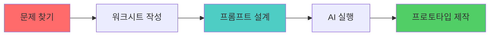

**1주차 목표:**
- 문제 발견 및 정의 (2일)
- 질문 설계 및 AI 테스트 (2일)
- 기본 프로토타입 제작 (3일)

**실습 과제:**
1. 자신의 문제 찾기
2. 5W1H 워크시트 작성
3. 7단계 프롬프트 작성
4. ChatGPT로 3회 개선
5. Cursor로 프로토타입 제작

---

**마지막 업데이트:** 2025-11-26  
**버전:** 2.0  
**다음 문서:** [5대 주제 통합 가이드](./주제/AI교육_5대주제_통합가이드.md)

