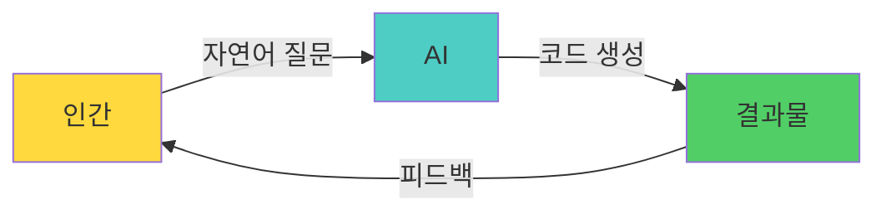
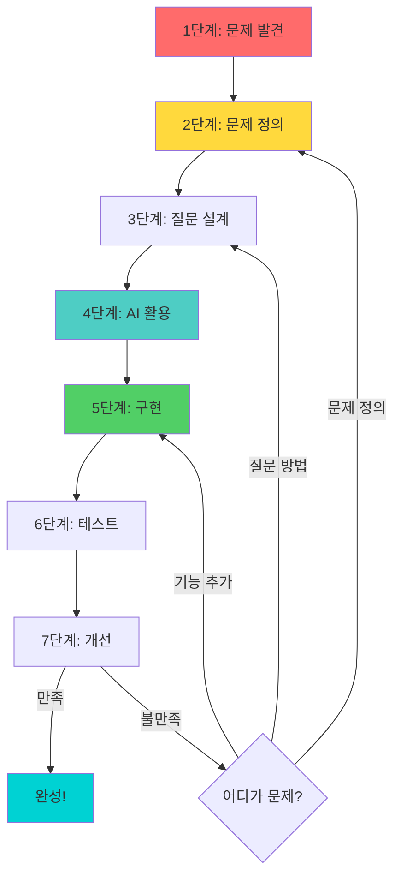
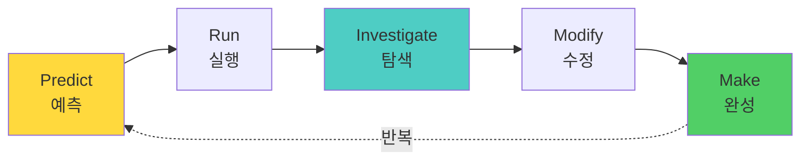
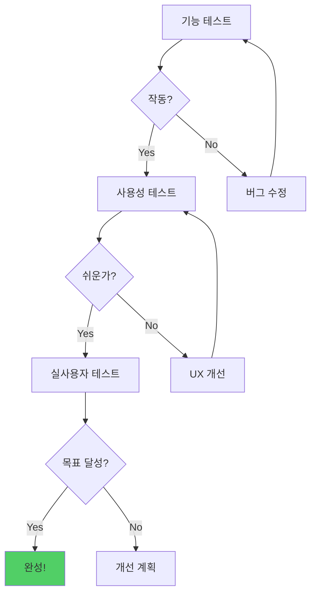
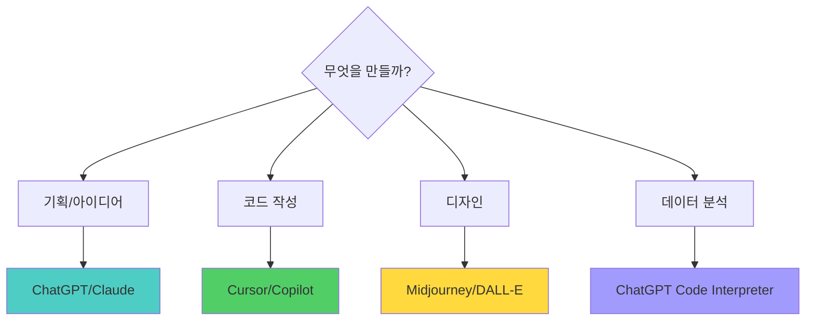
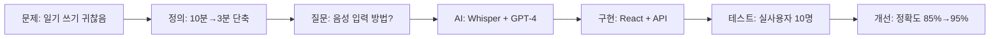
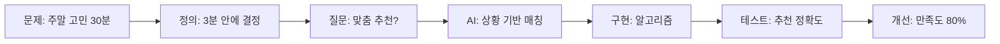
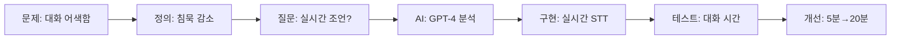
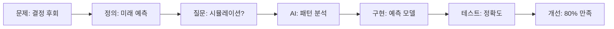
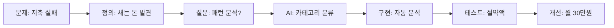

# 바이브 코딩 방법론 v3.0 📚

> **2025.11.26 업데이트**: 5대 실생활 주제 + 7단계 개발 프로세스

---

## 📋 목차

1. [방법론 개요](#방법론-개요)
2. [핵심 원칙](#핵심-원칙)
3. [7단계 프로세스](#7단계-프로세스)
4. [질문 정의 방법](#질문-정의-방법)
5. [AI 도구 활용](#ai-도구-활용)
6. [5대 주제 적용](#5대-주제-적용)
7. [평가 및 피드백](#평가-및-피드백)

---

## 방법론 개요

### 🎯 바이브 코딩이란?

**정의:**
자연어(한국어)로 AI와 소통하여 소프트웨어를 개발하는 새로운 코딩 패러다임

**핵심 개념:**


### 🆚 전통적 코딩 vs 바이브 코딩

```
┌─────────────────────────────────────────────┐
│  전통적 코딩 (Old Way)                       │
├─────────────────────────────────────────────┤
│  1. 프로그래밍 언어 학습 (수개월)            │
│  2. 문법과 구조 암기                         │
│  3. 한 줄씩 코드 작성                        │
│  4. 디버깅에 시간 소요                       │
│  5. 결과물 완성까지 오래 걸림                │
│                                             │
│  ⏱️ 평균 개발 시간: 3-6개월                 │
└─────────────────────────────────────────────┘

vs

┌─────────────────────────────────────────────┐
│  바이브 코딩 (New Way)                       │
├─────────────────────────────────────────────┤
│  1. 문제 정의 능력 (핵심!)                   │
│  2. 자연어로 AI에게 설명                     │
│  3. AI가 코드 자동 생성                      │
│  4. 결과 확인 및 개선 요청                   │
│  5. 빠른 프로토타입 완성                     │
│                                             │
│  ⏱️ 평균 개발 시간: 1-2주                   │
└─────────────────────────────────────────────┘
```

### 📊 효과성 비교

```mermaid
xychart-beta
    title "개발 시간 비교"
    x-axis [문제정의, 학습, 개발, 테스트, 배포]
    y-axis "시간(시간)" 0 --> 100
    bar [10, 5, 20, 10, 5]
    line [40, 30, 100, 30, 20]
```

**바이브 코딩 = 파란색 (빠름)**  
**전통 코딩 = 빨간색 (느림)**

---

## 핵심 원칙

### 1️⃣ 코드보다 생각

```
❌ "어떻게 코드를 짤까?"
✅ "무슨 문제를 해결할까?"

AI가 코드를 작성합니다.
당신은 무엇을 만들지 정의하세요.
```

### 2️⃣ 구현보다 기획

```
❌ "일단 만들고 보자"
✅ "왜, 누구를 위해, 어떻게?"

명확한 기획 = 빠른 개발
```

### 3️⃣ 반복적 개선

```
❌ "한 번에 완벽하게"
✅ "작게 시작 → 테스트 → 개선"

PRIMM 사이클:
Predict → Run → Investigate → Modify → Make
```

### 4️⃣ 문제 정의가 40%

```
전체 시간 배분:
━━━━━━━━━━━━━━━━━━━━━━━━━━━━━━

문제 정의  ████████████░░  40%
AI 활용    ████████░░░░░  25%
구현       ██████░░░░░░  20%
테스트     ███░░░░░░░░░  10%
개선       █░░░░░░░░░░░   5%
```

**왜 문제 정의에 40%?**
- 잘 정의된 문제 → AI가 정확히 이해
- 명확한 질문 → 원하는 답변
- 시행착오 최소화 → 전체 시간 단축

---

## 7단계 프로세스

### 전체 흐름도



### 각 단계 상세

#### 1단계: 문제 발견 (Problem Discovery)
**시간: 전체의 10%**

```
질문 리스트:
───────────────────────────────
□ 내가 자주 겪는 불편함은?
□ 친구들이 힘들어하는 것은?
□ 시간이 많이 걸리는 일은?
□ 반복적으로 하는 귀찮은 일은?
□ 더 나아질 수 있는 것은?

선택 기준:
───────────────────────────────
✓ 빈도가 높은가? (매일/주 3회+)
✓ 해결 시 효과가 큰가?
✓ 내가 만들 수 있는가?
```

#### 2단계: 문제 정의 (Problem Definition)
**시간: 전체의 30%** ⭐ 가장 중요!

**5W1H 템플릿:**
```
┌─────────────────────────────────┐
│  문제 정의서                     │
├─────────────────────────────────┤
│  Who (누가):                     │
│  _________________________      │
│                                 │
│  What (무엇이):                  │
│  _________________________      │
│                                 │
│  When (언제):                    │
│  _________________________      │
│                                 │
│  Where (어디서):                 │
│  _________________________      │
│                                 │
│  Why (왜):                       │
│  _________________________      │
│                                 │
│  How (어떻게):                   │
│  _________________________      │
│                                 │
│  📊 측정 목표:                   │
│  현재 _____ → 목표 _____        │
│  개선율: _____%                  │
└─────────────────────────────────┘
```

**SMART 체크:**
```
✅ Specific (구체적)
✅ Measurable (측정 가능)
✅ Achievable (달성 가능)
✅ Relevant (관련성)
✅ Time-bound (기한)
```

#### 3단계: 질문 설계 (Question Design)
**시간: 전체의 15%**

**7단계 프롬프트 구조:**

```
┌───────────────────────────────────┐
│  1. 역할 (Role)                   │
│  "당신은 [전문가]입니다"           │
├───────────────────────────────────┤
│  2. 맥락 (Context)                │
│  "[상황 설명]"                     │
├───────────────────────────────────┤
│  3. 요청 (Request)                │
│  "[구체적 요청]"                   │
├───────────────────────────────────┤
│  4. 제약 (Constraints)            │
│  "[제한 조건]"                     │
├───────────────────────────────────┤
│  5. 형식 (Format)                 │
│  "[출력 형태]"                     │
├───────────────────────────────────┤
│  6. 예시 (Example)                │
│  "[참고 사례]"                     │
├───────────────────────────────────┤
│  7. 검증 (Verification)           │
│  "[확인 질문]"                     │
└───────────────────────────────────┘
```

#### 4단계: AI 활용 (AI Utilization)
**시간: 전체의 10%**

**PRIMM 사이클:**



**반복 횟수:**
- 최소 3회 이상
- 만족할 때까지 계속

#### 5단계: 구현 (Implementation)
**시간: 전체의 20%**

**Cursor 활용 전략:**

```python
# ✅ 좋은 요청: 단계별로
"""
1. "React 앱 기본 구조 만들어줘"
2. "메인 페이지에 버튼 3개 추가"
3. "버튼 클릭 시 상태 변경"
4. "상태를 로컬스토리지에 저장"
"""

# ❌ 나쁜 요청: 한번에 다
"""
"감정 일기 앱 전체 만들어줘"
"""
```

#### 6단계: 테스트 (Testing)
**시간: 전체의 10%**

**3단계 테스트:**



#### 7단계: 개선 (Improvement)
**시간: 전체의 5%**

**우선순위 매트릭스:**

```
       높은 중요도
            ↑
   ┌─────────┬─────────┐
   │         │         │
   │ 1순위   │ 2순위   │
   │ 즉시    │ 계획적  │
   │         │         │
낮은├─────────┼─────────┤높은
긴급│ 3순위   │ 4순위   │긴급
도  │ 여유시  │ 안 함   │도
   │         │         │
   └─────────┴─────────┘
            ↓
       낮은 중요도
```

---

## 질문 정의 방법

### 질문의 진화 과정

```
Level 1: "앱 만들어줘" ❌
         └─> 너무 막연함

Level 2: "감정 일기 앱 만들어줘" △
         └─> 누가 사용?

Level 3: "고등학생용 감정 일기 앱" ○
         └─> 무슨 문제 해결?

Level 4: "매일 쓰기 귀찮아하는 
         고등학생을 위한 
         3분 감정 일기 앱" ◎
         └─> 어떻게 해결?

Level 5: "음성으로 1분 말하면 
         AI가 감정 분석해서 
         그래프로 보여주는 
         고등학생용 앱" ✅
         └─> 완벽!
```

### 질문 품질 체크리스트

```
□ 5W1H 모두 포함?
   □ Who (누가)
   □ What (무엇)
   □ When (언제)
   □ Where (어디)
   □ Why (왜)
   □ How (어떻게)

□ 측정 가능한 목표?
   □ 숫자로 표현
   □ 비교 기준
   □ 개선 정도

□ 제약 조건 명시?
   □ 시간
   □ 비용
   □ 기술

□ 예시 제공?
   □ 비슷한 사례
   □ 참고 자료
```

---

## AI 도구 활용

### 도구 선택 가이드



### ChatGPT 활용법

**용도:**
- 아이디어 브레인스토밍
- 기획서 작성
- 사용자 시나리오
- 프롬프트 개선

**예시:**
```
나: "고등학생 감정 일기 앱 기획 중이야.
    기능 아이디어 10가지 알려줘"

GPT: [10가지 아이디어 제시]

나: "그 중 가장 중요한 3가지만 골라서
    각각 UI 화면으로 자세히 설명해줘"

GPT: [3가지 상세 설명]

나: "좋아! 1번 기능의 장단점과
    구현 난이도도 알려줘"

GPT: [분석 제공]
```

### Cursor 활용법

**용도:**
- 실시간 코드 작성
- 버그 수정
- 코드 설명
- 리팩토링

**팁:**
```
1. 큰 기능 → 작은 단위로 분해
2. 한 번에 하나씩 요청
3. 테스트 후 다음 단계
4. 에러 발생 시 즉시 AI에게 물어보기
```

### Midjourney 활용법

**용도:**
- UI 목업
- 아이콘
- 일러스트

**프롬프트 구조:**
```
[주제] + [스타일] + [색상] + [분위기] + [기술]

예시:
"감정 일기 앱 메인 화면,
 미니멀 디자인,
 파스텔 톤,
 따뜻한 분위기,
 모바일 UI,
 4K"
```

---

## 5대 주제 적용

### 주제별 프로세스 예시

#### 1. 감정 AI - 음성 감정 일기



**핵심 AI:**
- Whisper: 음성 → 텍스트
- GPT-4: 감정 분석
- Chart.js: 시각화

#### 2. 여가 AI - 활동 추천



#### 3. 만남 AI - 대화 코치



#### 4. 성찰 AI - 10년 후 시뮬레이터



#### 5. 돈 AI - 소비 분석



---

## 평가 및 피드백

### 평가 기준 (100점)

```
┌─────────────────────────────────┐
│  1. 문제 정의 (40점)             │
│     ├─ 5W1H 명확성 (15)         │
│     ├─ 측정 가능성 (10)          │
│     ├─ 해결 가치 (10)            │
│     └─ 범위 적절성 (5)           │
│                                 │
│  2. 질문 설계 (30점)             │
│     ├─ 프롬프트 구조 (10)        │
│     ├─ 맥락 제공 (10)            │
│     └─ 반복 개선 (10)            │
│                                 │
│  3. 구현 (20점)                  │
│     ├─ 기능 완성도 (10)          │
│     ├─ 코드 품질 (5)             │
│     └─ UI/UX (5)                │
│                                 │
│  4. 개선 (10점)                  │
│     ├─ 피드백 반영 (5)           │
│     └─ 완성도 향상 (5)           │
└─────────────────────────────────┘
```

### 등급 기준

```
S등급 (90-100점)
━━━━━━━━━━━━━━━━
• 문제 정의 완벽
• AI 활용 탁월
• 실사용 가능한 완성도
• 창의적 해결책

A등급 (80-89점)
━━━━━━━━━━━━━━━━
• 명확한 문제 정의
• 효과적인 AI 활용
• 기능적으로 완성
• 개선 여지 있음

B등급 (70-79점)
━━━━━━━━━━━━━━━━
• 기본적 정의
• AI 사용 가능
• 프로토타입 수준

C등급 (60-69점)
━━━━━━━━━━━━━━━━
• 모호한 정의
• AI 활용 미흡
• 추가 개선 필요
```

### 피드백 양식

```
┌─────────────────────────────────┐
│  프로젝트 피드백 시트            │
├─────────────────────────────────┤
│  프로젝트명: _______________    │
│  제작자: ___________________    │
│  날짜: _____________________    │
│                                 │
│  💪 잘한 점 (3가지)              │
│  1. _______________________     │
│  2. _______________________     │
│  3. _______________________     │
│                                 │
│  📈 개선할 점 (3가지)            │
│  1. _______________________     │
│  2. _______________________     │
│  3. _______________________     │
│                                 │
│  💡 제안 사항                    │
│  _________________________      │
│  _________________________      │
│                                 │
│  ⭐ 총평 (5점)                   │
│  ⭐⭐⭐⭐⭐                       │
└─────────────────────────────────┘
```

---

## 실습 과제

### 1주차 미션

```
□ Day 1-2: 문제 발견 및 정의
   - 불편한 점 10가지 찾기
   - 하나 선택해서 5W1H 작성

□ Day 3-4: 질문 설계
   - 7단계 프롬프트 작성
   - ChatGPT로 3회 개선

□ Day 5-7: 프로토타입 제작
   - Cursor로 기본 구조
   - 핵심 기능 1개 구현
   - 친구에게 테스트
```

### 체크리스트

```
✅ 문제 정의서 작성 완료
✅ 5W1H 모두 포함
✅ 측정 가능한 목표 설정
✅ 7단계 프롬프트 작성
✅ PRIMM 3회 이상 반복
✅ 프로토타입 작동
✅ 1명 이상 테스트
✅ 피드백 반영
```

---

## 참고 자료

### 📚 추천 문서

**방법론:**
- [7단계 개발 프로세스](./바이브코딩_AI개발_프로세스.md)
- [5대 주제 통합 가이드](./주제/AI교육_5대주제_통합가이드.md)

**주제별 상세:**
- [감정 AI](./주제/감정AI_상세가이드.md)
- [여가 AI](./주제/여가AI_상세가이드.md)
- [만남 AI](./주제/만남AI_상세가이드.md)
- [성찰 AI](./주제/성찰AI_상세가이드.md)
- [돈 AI](./주제/돈AI_상세가이드.md)

### 🔗 외부 링크

- [OpenAI Prompt Engineering](https://platform.openai.com/docs/guides/prompt-engineering)
- [Cursor 공식 문서](https://cursor.sh/docs)
- [Anthropic Claude Guide](https://docs.anthropic.com/claude/docs)

---

## FAQ

**Q1: 코딩을 전혀 모르는데 가능한가요?**  
A: 네! 바이브 코딩은 자연어로 소통합니다. 문제 정의와 질문 능력이 더 중요합니다.

**Q2: AI가 모든 걸 해주나요?**  
A: 아니요. AI는 도구일 뿐입니다. 문제 정의, 기획, 판단은 인간이 해야 합니다.

**Q3: 얼마나 걸리나요?**  
A: 기본 프로토타입은 1-2주, 완성된 앱은 4-6주 정도입니다.

**Q4: 어떤 AI 도구가 필요한가요?**  
A: ChatGPT 또는 Claude (기획), Cursor (코딩), Midjourney (디자인, 선택)

**Q5: 실제로 앱을 배포할 수 있나요?**  
A: 네! 프로토타입 완성 후 Vercel, Netlify 등으로 무료 배포 가능합니다.

---

**마지막 업데이트:** 2025-11-26  
**버전:** 3.0  
**작성자:** Vive Coding Team

**다음 단계:**  
→ [7단계 프로세스 상세](./바이브코딩_AI개발_프로세스.md)  
→ [첫 프로젝트 시작하기](./주제/AI교육_5대주제_통합가이드.md)

