# AI 교육 5대 주제 통합 가이드

> **생활 밀착형 AI 교육 프로그램**  
> 감정, 여가, 만남, 성찰, 돈 - 사람들이 진짜 필요한 AI 솔루션

---

## 📋 목차

1. [프로그램 개요](#프로그램-개요)
2. [전체 구조도](#전체-구조도)
3. [학습 여정 맵](#학습-여정-맵)
4. [주요 고객 페르소나](#주요-고객-페르소나)
5. [5대 주제 소개](#5대-주제-소개)
6. [UI/UX 설계 원칙](#uiux-설계-원칙)
7. [구현 기술 스택](#구현-기술-스택)

---

## 프로그램 개요

### 🎯 핵심 가치
**"기술이 아닌 삶의 문제 해결"**

현대인의 5가지 핵심 고민을 AI로 해결하는 실용적 교육 프로그램

### 📊 프로그램 특징

| 구분 | 내용 |
|------|------|
| **대상** | AI 입문자, 실무 활용 희망자, 취미 개발자 |
| **기간** | 각 주제당 4-6주 (총 20-30주) |
| **방식** | PBL(프로젝트 기반 학습) + 실습 중심 |
| **결과물** | 실제 사용 가능한 개인 AI 도구 5개 |

---

## 전체 구조도

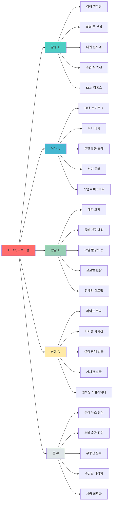

---

## 학습 여정 맵

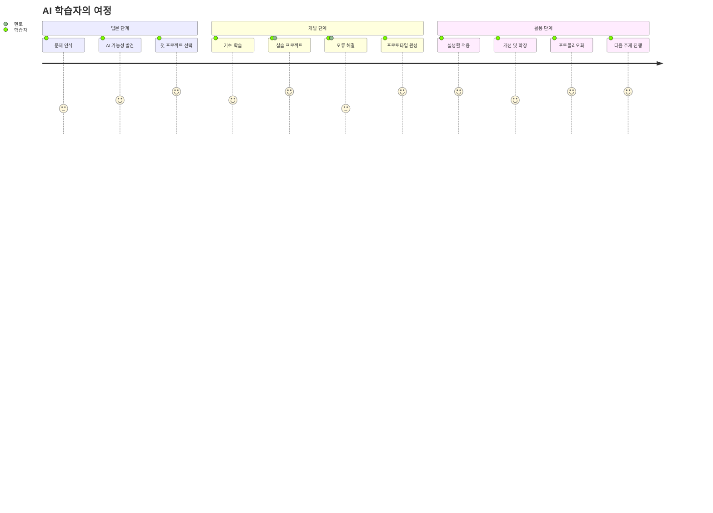

---

## 주요 고객 페르소나

### 👤 페르소나 1: 민지 (27세, 마케터)

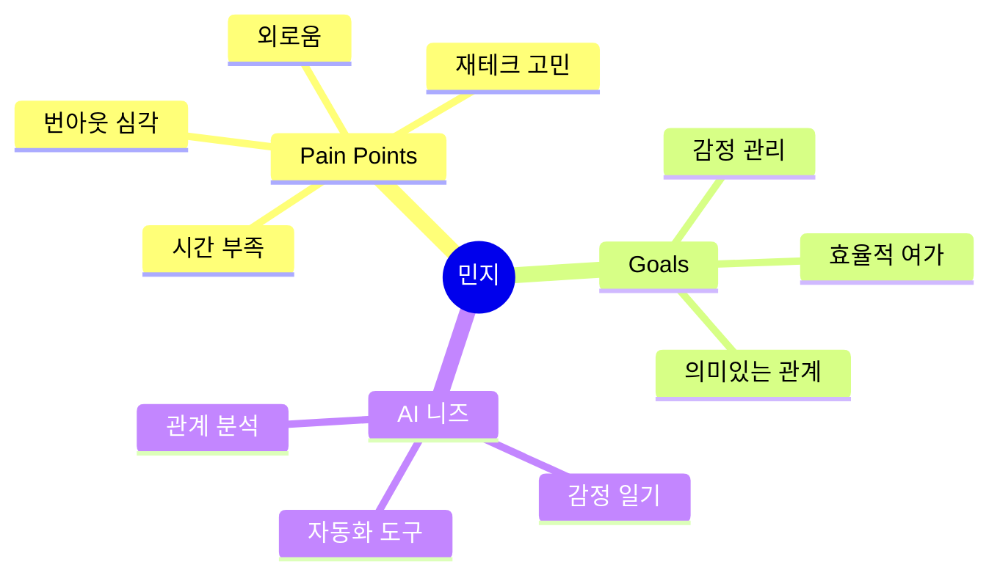

**프로필:**
- 직업: 디지털 마케팅 담당자
- 특징: 야근 많음, 퇴근 후 녹초, SNS 중독
- 고민: "내 삶이 일뿐인가?", "친구들과 소원해짐"
- AI 활용 목표:
  - 감정 일기로 번아웃 관리
  - 짧은 여가시간 최대 활용
  - 친구들과 연락 유지 자동화

**유저 시나리오:**
```
1. 월요일 아침, 출근길 지하철
   → AI 감정 일기에 음성으로 주말 회고
   → "당신은 지난주 스트레스 지수 85%입니다" 알림

2. 점심시간 휴식
   → 주말 활동 AI 룰렛 실행
   → 예산 3만원, 혼자, 힐링 → "북한산 둘레길" 추천

3. 퇴근 후 집
   → 관계망 히트맵 확인
   → "수진이와 2개월째 연락 없음" → AI 추천 메시지 전송

4. 잠들기 전
   → 수면 질 개선 AI가 맞춤 명상 음악 생성
   → 오늘 감정 데이터 자동 기록
```

---

### 👤 페르소나 2: 준호 (35세, 프리랜서 개발자)

**프로필:**
- 직업: 프리랜서 풀스택 개발자
- 특징: 재택근무, N잡 관심, 투자 공부 중
- 고민: "수입 불안정", "자기계발 방향성"
- AI 활용 목표:
  - 주식 투자 보조
  - 사이드 프로젝트 수익화
  - 효율적 자기계발

**유저 시나리오:**
```
1. 오전 9시, 업무 시작 전
   → AI 주식 뉴스 필터링 확인
   → 보유 종목 관련 뉴스 3개 요약 수신

2. 점심 후, 재테크 고민
   → 소비 습관 AI 리포트 확인
   → "배달앱에 월 25만원 지출, 연 300만원 절약 가능"

3. 오후 3시, 사이드 프로젝트 기획
   → 수입원 다각화 AI 컨설팅
   → "당신의 React 스킬로 클래스101 강의 가능"

4. 저녁, 자기계발 시간
   → 라이프 코치 AI와 10년 계획 시뮬레이션
```

---

### 👤 페르소나 3: 수현 (22세, 대학생)

**프로필:**
- 직업: 경영학과 4학년, 취업 준비 중
- 특징: 외국어 공부 중, 여행 좋아함, 새 친구 사귀고 싶음
- 고민: "진로 불안", "관계 형성 어려움"
- AI 활용 목표:
  - 언어 교환 친구 만들기
  - 자기소개서 최적화
  - 취미 영상 제작

**유저 시나리오:**
```
1. 아침, 영어 공부
   → 글로벌 펜팔 AI로 미국인과 실시간 번역 대화
   → 문화적 뉘앙스까지 배움

2. 오후, 카페에서 과제
   → 독서 비서 AI로 경영학 책 핵심 요약
   → 자동 생성된 질문으로 이해도 체크

3. 저녁, 친구 만남
   → 대화 코치 AI로 어색한 순간 대비
   → 실시간 대화 주제 추천 받음

4. 주말, 콘텐츠 제작
   → 60초 브이로그 자동 생성기로 여행 영상 제작
```

---

### 👤 페르소나 4: 영수 (42세, 직장인/부모)

**프로필:**
- 직업: 중견기업 과장, 기혼 2자녀
- 특징: 가족 중시, 자기계발 욕구, 시간 부족
- 고민: "경력 정체", "가족과의 시간"
- AI 활용 목표:
  - 커리어 전환 준비
  - 가족 관계 개선
  - 효율적 학습

**유저 시나리오:**
```
1. 출근길, 자기계발
   → AI 멘토링 시뮬레이터로 "빌 게이츠라면?" 질문
   → 커리어 전환 시뮬레이션

2. 회의 중
   → 회의 톤 분석기로 발표 피드백 실시간 수신
   → 자신감 지수 70% → 목소리 톤 조절 제안

3. 퇴근 후 가족 시간
   → 대화 온도계로 배우자와의 대화 패턴 분석
   → 관계 건강도 체크

4. 주말 가족 나들이
   → 주말 활동 룰렛 (4인 가족, 예산 10만원)
   → 맞춤 장소 추천
```

---

### 👤 페르소나 5: 지은 (55세, 예비 은퇴자)

**프로필:**
- 직업: 공무원, 5년 후 퇴직 예정
- 특징: 제2의 인생 준비, 취미 개발 희망
- 고민: "노후 자금", "은퇴 후 무엇을 할까"
- AI 활용 목표:
  - 체계적 재무 관리
  - 새로운 취미 발견
  - 인생 회고 및 정리

**유저 시나리오:**
```
1. 아침, 재무 점검
   → 세금 최적화 AI로 연금 세금 계산
   → 부동산 AI로 은퇴 후 거주지 분석

2. 점심, 취미 탐색
   → 취미 튜터 AI로 "사진 촬영" 맞춤 학습
   → YouTube 강의 중 내 수준에 맞는 것만 큐레이션

3. 저녁, 인생 회고
   → 디지털 자서전 AI로 과거 사진/일기 자동 정리
   → "당신의 50대는 이런 시간이었습니다" 영상

4. 주말, 새로운 관계
   → 동네 친구 매칭으로 같이 운동할 사람 찾기
```

---

## 5대 주제 소개

### 1️⃣ 감정 AI: 마음을 읽는 인공지능

**핵심 가치:** 현대인의 외로움과 번아웃 해결

**소주제:**
1. 나만의 AI 감정 일기장
2. 리얼타임 회의 톤 분석기
3. 연인/가족 대화 온도계
4. AI 기반 수면 질 개선
5. 소셜미디어 디톡스 도우미

**상세 문서:** [감정AI_상세가이드.md](./감정AI_상세가이드.md)

---

### 2️⃣ 여가 AI: 나만의 취미 큐레이터

**핵심 가치:** 시간 빈곤 시대의 효율적 여가 + 자기표현

**소주제:**
1. 60초 브이로그 자동 생성기
2. AI 독서 비서: 책 내용을 내 것으로
3. 주말 활동 AI 룰렛
4. AI 취미 튜터 플랫폼
5. 게임 하이라이트 자동 편집

**상세 문서:** [여가AI_상세가이드.md](./여가AI_상세가이드.md)

---

### 3️⃣ 만남 AI: 연결과 소통의 기술

**핵심 가치:** 진짜 연결의 어려움 해결

**소주제:**
1. AI 대화 코치: 어색함 제로 프로젝트
2. 동네 친구 AI 매칭
3. 모임 활성화 AI 봇
4. 글로벌 펜팔 AI 번역 시스템
5. 관계망 히트맵 분석

**상세 문서:** [만남AI_상세가이드.md](./만남AI_상세가이드.md)

---

### 4️⃣ 성찰 AI: 나를 발견하는 여정

**핵심 가치:** 정체성 혼란 시대의 자기 발견과 방향성

**소주제:**
1. AI 라이프 코치: 10년 후 나는?
2. 나의 디지털 자서전
3. 결정 장애 탈출 AI
4. 나만의 가치관 발굴 프로젝트
5. AI 멘토링 시뮬레이터

**상세 문서:** [성찰AI_상세가이드.md](./성찰AI_상세가이드.md)

---

### 5️⃣ 돈 AI: 똑똑한 재테크 비서

**핵심 가치:** 경제적 불안 해소 + 실질적 부의 축적

**소주제:**
1. AI 주식 뉴스 필터링
2. 소비 습관 AI 진단 + 재설계
3. 부동산 AI 분석 플랫폼
4. N잡러를 위한 수입원 다각화 AI
5. AI 세금 최적화 비서

**상세 문서:** [돈AI_상세가이드.md](./돈AI_상세가이드.md)

---

## UI/UX 설계 원칙

### 🎨 디자인 철학

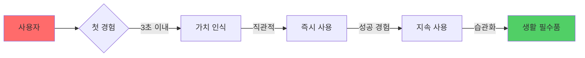

### 📱 UI/UX 핵심 원칙

#### 1. **즉시성 (Immediacy)**
- ✅ 3초 안에 가치 전달
- ✅ 클릭 3번 이내 핵심 기능 도달
- ✅ 로딩 시간 1초 이하

**적용 예시:**
```
❌ 나쁜 예: 회원가입 → 설정 → 튜토리얼 → 기능 사용
✅ 좋은 예: 바로 사용 → 사용하며 학습 → 필요시 회원가입
```

#### 2. **단순성 (Simplicity)**
- ✅ 한 화면에 하나의 목적
- ✅ 전문 용어 제거 (일상 언어 사용)
- ✅ 선택지 3개 이하

**적용 예시:**
```
❌ 나쁜 예: "NLP 기반 감정 분석 파라미터 설정"
✅ 좋은 예: "오늘 기분이 어때요?"
```

#### 3. **피드백 (Feedback)**
- ✅ 모든 액션에 즉각 반응
- ✅ 진행 상황 시각화
- ✅ 성취감 부여

**적용 예시:**
```
✅ "분석 중..." (진행률 바)
✅ "완료! 당신의 감정 패턴을 발견했어요 🎉"
✅ "3일 연속 기록 중! 계속해봐요 🔥"
```

#### 4. **개인화 (Personalization)**
- ✅ 사용자 이름 호칭
- ✅ 과거 데이터 기반 추천
- ✅ 학습하는 인터페이스

---

### 🖼️ 공통 UI 컴포넌트

#### 메인 대시보드 구조

```
┌─────────────────────────────────────┐
│  👤 [사용자명]님, 안녕하세요!        │
│  오늘의 인사이트                     │
├─────────────────────────────────────┤
│                                     │
│  📊 [핵심 지표 카드]                │
│  "지난주보다 스트레스 20% 감소"      │
│                                     │
├─────────────────────────────────────┤
│  🎯 추천 액션                        │
│  ▶ [바로 시작하기 버튼]             │
│                                     │
├─────────────────────────────────────┤
│  📈 히스토리 (간단한 그래프)         │
│                                     │
└─────────────────────────────────────┘
```

#### 컬러 시스템

| 주제 | 메인 컬러 | 감성 키워드 | HEX 코드 |
|------|-----------|-------------|----------|
| 감정 AI | 🟦 차분한 블루 | 안정, 신뢰 | `#4ECDC4` |
| 여가 AI | 🟨 활기찬 옐로우 | 즐거움, 에너지 | `#FFD93D` |
| 만남 AI | 🟩 따뜻한 그린 | 성장, 연결 | `#95E1D3` |
| 성찰 AI | 🟪 깊은 퍼플 | 지혜, 성찰 | `#A29BFE` |
| 돈 AI | 🟧 신뢰감 오렌지 | 안정, 성장 | `#FDCB6E` |

#### 타이포그래피

```css
/* 제목 */
h1: Pretendard Bold, 32px, line-height 1.4

/* 본문 */
body: Pretendard Regular, 16px, line-height 1.6

/* 강조 */
strong: Pretendard SemiBold, 색상 강조
```

---

### 📱 반응형 디자인

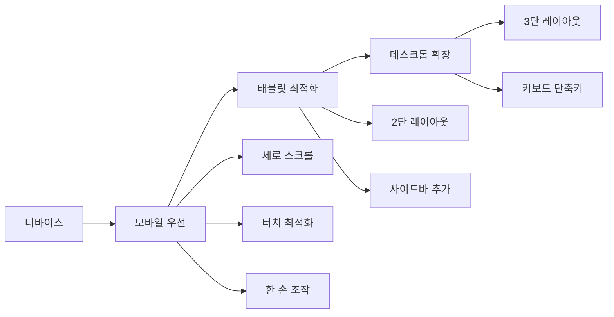

---

### 🎭 인터랙션 패턴

#### 로딩 상태
```
1. 스켈레톤 UI (내용 대신 회색 박스)
2. 진행률 표시 (0% → 100%)
3. 재치있는 메시지
   - "당신의 감정을 분석하는 중..."
   - "AI가 열심히 생각하고 있어요 🤔"
```

#### 에러 처리
```
❌ 나쁜 예: "Error 500: Internal Server Error"
✅ 좋은 예: "앗! 잠시 문제가 생겼어요. 다시 시도해볼까요?"
```

#### 빈 상태 (Empty State)
```
❌ 나쁜 예: 빈 화면
✅ 좋은 예: 
   "아직 데이터가 없어요"
   "첫 기록을 시작해볼까요?"
   [시작하기 버튼]
```

---

### 🔔 알림 전략

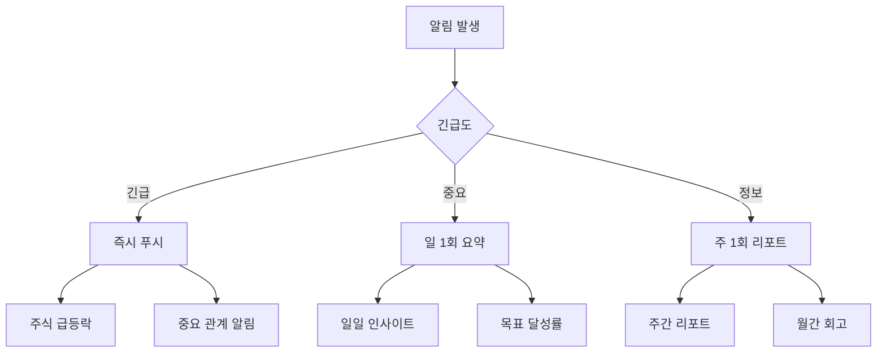

---

### 💡 UX 라이팅 가이드

#### 원칙
1. **친구처럼 말하기** - 격식 낮추기
2. **긍정적 표현** - "불가능" 대신 "아직"
3. **행동 유도** - 명확한 동사 사용

#### 예시

| 상황 | ❌ 나쁜 예 | ✅ 좋은 예 |
|------|-----------|-----------|
| 시작 화면 | "서비스를 이용하려면 로그인하세요" | "반가워요! 시작해볼까요?" |
| 데이터 입력 | "필수 입력 항목입니다" | "이것만 알려주시면 시작할 수 있어요" |
| 완료 | "작업이 완료되었습니다" | "완료! 👏 결과를 확인해보세요" |
| 에러 | "오류가 발생했습니다" | "앗, 잠깐 문제가 생겼어요. 다시 시도해볼까요?" |

---

## 구현 기술 스택

### 🛠️ 기술 아키텍처

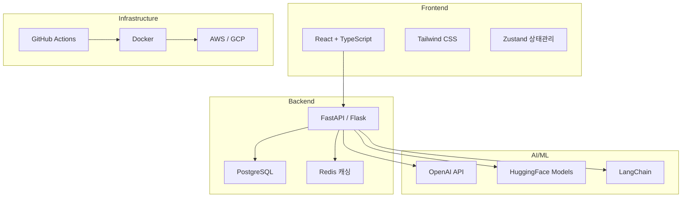

---

### 📚 주제별 핵심 기술

| 주제 | 핵심 기술 | 라이브러리/API |
|------|-----------|----------------|
| 감정 AI | 자연어 처리, 음성 인식 | OpenAI API, Whisper, BERT |
| 여가 AI | 컴퓨터 비전, 추천 시스템 | CLIP, Stable Diffusion, Collaborative Filtering |
| 만남 AI | 매칭 알고리즘, 번역 | Graph Neural Network, DeepL API |
| 성찰 AI | 데이터 시각화, 예측 모델 | D3.js, Prophet, Time Series |
| 돈 AI | 금융 데이터 분석, 크롤링 | yfinance, BeautifulSoup, Pandas |

---

### 🔒 보안 및 프라이버시

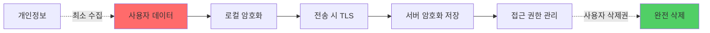

**핵심 원칙:**
- ✅ 개인 데이터 로컬 우선 저장
- ✅ 민감 정보 익명화 처리
- ✅ 사용자 데이터 삭제권 보장
- ✅ GDPR/개인정보보호법 준수

---

## 📖 학습 로드맵

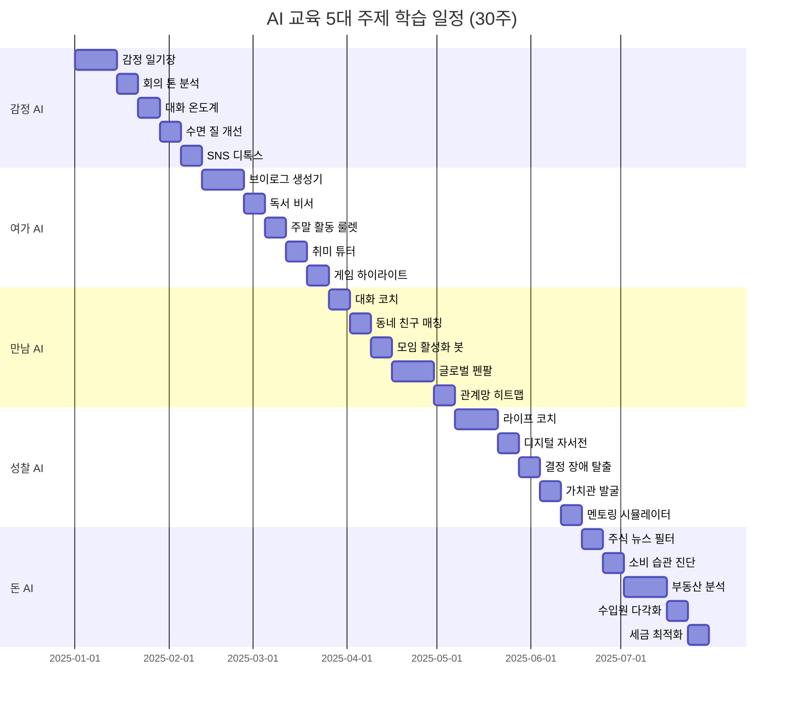

---

## 🎓 학습 방법론

### PBL(Project-Based Learning) 구조

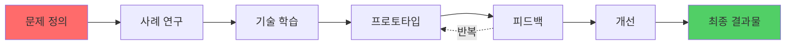

### 주차별 학습 패턴

```
Week 1: 이해하기
- 문제 정의 및 사례 분석
- 필요한 AI 기술 이론 학습
- 유사 프로젝트 리서치

Week 2-3: 만들기
- 프로토타입 개발
- 핵심 기능 구현
- 테스트 및 디버깅

Week 4: 완성하기
- UI/UX 개선
- 실사용 테스트
- 포트폴리오 문서화
```

---

## 📊 성과 측정 지표

### 학습 성과

| 지표 | 측정 방법 | 목표 |
|------|-----------|------|
| 프로젝트 완성도 | 기능 구현률 | 90% 이상 |
| 실사용률 | 완성 후 지속 사용 | 60% 이상 |
| 포트폴리오 퀄리티 | GitHub Stars, 리뷰 | 평균 4점 이상 |
| 기술 이해도 | 퀴즈, 코드 리뷰 | 80점 이상 |

### 임팩트 측정

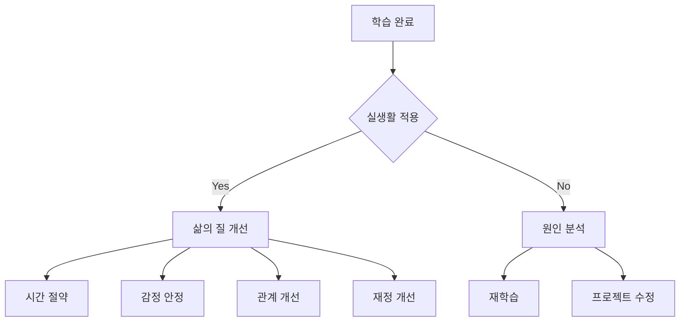

---

## 🤝 커뮤니티 및 지원

### 학습 지원 체계

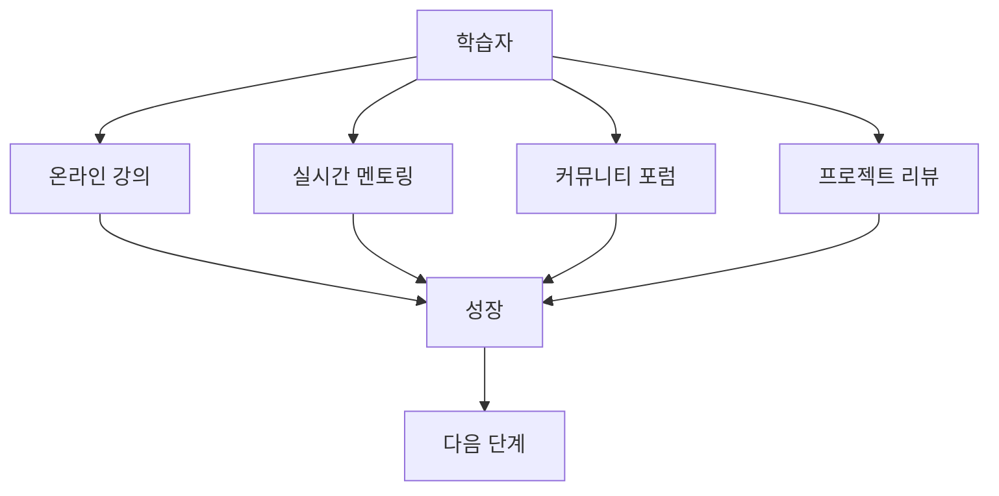

### 지원 채널

1. **Discord 커뮤니티**
   - 실시간 질의응답
   - 프로젝트 쇼케이스
   - 스터디 그룹 형성

2. **GitHub Repository**
   - 샘플 코드
   - 이슈 트래킹
   - PR 리뷰

3. **주간 오피스 아워**
   - 멘토 1:1 상담
   - 코드 리뷰
   - 진로 상담

---

## 📝 다음 단계

### 각 주제별 상세 가이드 확인

1. [감정 AI 상세 가이드](./감정AI_상세가이드.md) - 페르소나, 시나리오, 구현 방법
2. [여가 AI 상세 가이드](./여가AI_상세가이드.md) - UI/UX, 기술 스택
3. [만남 AI 상세 가이드](./만남AI_상세가이드.md) - 매칭 알고리즘, 프라이버시
4. [성찰 AI 상세 가이드](./성찰AI_상세가이드.md) - 데이터 분석, 시각화
5. [돈 AI 상세 가이드](./돈AI_상세가이드.md) - 금융 API, 법적 고려사항

---

## 💬 문의 및 피드백

프로그램 관련 문의사항이나 개선 제안은 아래로 연락 주세요:

- 📧 Email: vivecoding@example.com
- 💬 Discord: [초대 링크]
- 📝 GitHub Issues: [저장소 링크]

---

**Last Updated:** 2025-11-26  
**Version:** 1.0.0  
**Author:** Vive Coding Team

