# AI 교육 5대 주제 5단계 통합 가이드

> **LLM 활용 프로젝트 기반 교육 프로그램**  
> 감정, 여가, 만남, 성찰, 돈 - 단계별 실전 프로젝트로 배우는 AI 개발

---

## 📋 목차

1. [프로그램 개요](#프로그램-개요)
2. [5단계 교육 구조](#5단계-교육-구조)
3. [전체 학습 로드맵](#전체-학습-로드맵)
4. [주제별 상세 단계](#주제별-상세-단계)
5. [단계별 학습 가이드](#단계별-학습-가이드)
6. [평가 체계](#평가-체계)

---

## 프로그램 개요

### 🎯 핵심 가치
**"단계별 실전 프로젝트로 배우는 LLM 활용 개발"**

프롬프트 엔지니어링부터 AI Agent, 풀스택 개발까지 5단계로 완성하는 실용적 교육 프로그램

### 📊 프로그램 특징

| 구분 | 내용 |
|------|------|
| **대상** | AI 입문자, 실무 활용 희망자, 취미 개발자 |
| **기간** | 각 주제당 5단계 × 2주 = 10주 (총 50주) |
| **방식** | 단계별 프로젝트 기반 학습 (PBL) |
| **결과물** | 각 주제별 완성된 AI 웹 애플리케이션 5개 |
| **핵심 기술** | Prompt Engineering → LangChain → V0 → Cursor/Claude → Backend |

---

## 5단계 교육 구조

### 전체 구조도

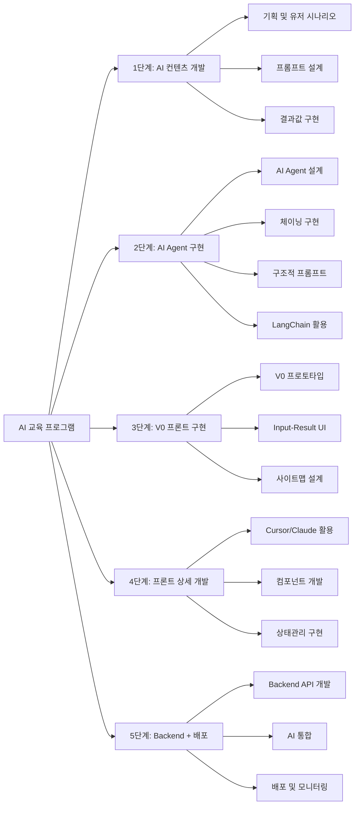

### 5단계 상세 개요

```mermaid
journey
    title 5단계 학습 여정
    section 1단계: 컨텐츠 개발
      문제 정의: 5: 학습자
      유저 시나리오 작성: 4: 학습자
      프롬프트 설계: 5: 학습자
      결과값 검증: 4: 학습자
    section 2단계: AI Agent
      Agent 설계: 4: 학습자
      체이닝 구현: 5: 학습자
      자동화 테스트: 4: 학습자
    section 3단계: V0 프론트
      프로토타입 생성: 5: 학습자
      UI/UX 개선: 4: 학습자
    section 4단계: 상세 개발
      컴포넌트 구현: 5: 학습자
      상태관리: 4: 학습자
    section 5단계: 배포
      Backend 개발: 5: 학습자
      AI 통합: 4: 학습자
      배포 완료: 5: 학습자
```

---

## 전체 학습 로드맵

### 주제별 5단계 일정표

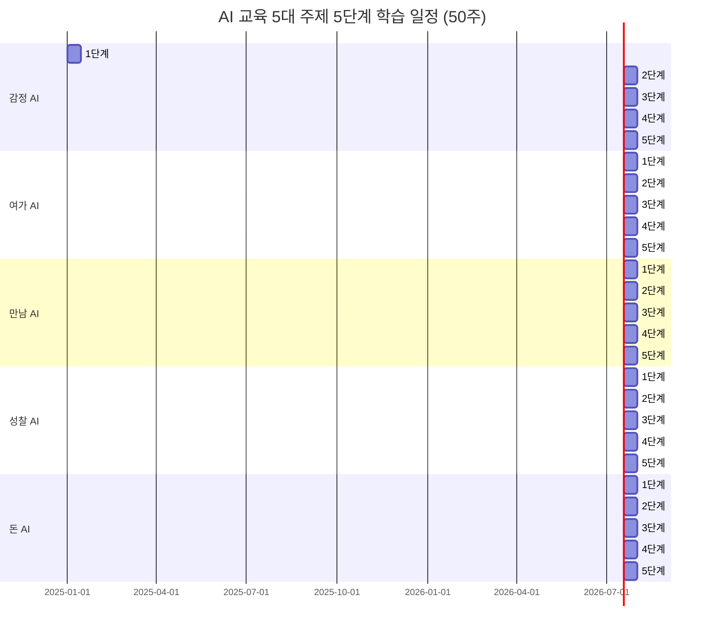

### 단계별 학습 목표

| 단계 | 핵심 목표 | 주요 도구 | 산출물 |
|------|-----------|-----------|--------|
| **1단계** | 프롬프트 엔지니어링 기초 | ChatGPT, Claude, Gemini | 프롬프트 템플릿, 결과 샘플 |
| **2단계** | AI Agent 자동화 시스템 | LangChain, OpenAI API | Agent 프로토타입 |
| **3단계** | 빠른 UI 프로토타입 | V0, Shadcn UI | 인터랙티브 프로토타입 |
| **4단계** | 프로덕션 수준 프론트엔드 | Cursor, Claude Code | 완성된 프론트엔드 |
| **5단계** | 풀스택 AI 애플리케이션 | FastAPI, PostgreSQL, 배포 | 배포된 웹 앱 |

---

## 주제별 상세 단계

### 1️⃣ 감정 AI: 마음을 읽는 인공지능

#### 소주제 목록

1. **나만의 AI 감정 일기장**
2. **리얼타임 회의 톤 분석기**
3. **연인/가족 대화 온도계**
4. **AI 기반 수면 질 개선**
5. **소셜미디어 디톡스 도우미**

---

#### 소주제별 프롬프트 및 결과 예시

##### 소주제 1: 나만의 AI 감정 일기장

**프롬프트 템플릿:**
```
당신은 감정 분석 전문가입니다.
사용자의 일기 내용을 분석하여 다음 정보를 제공하세요:

1. 감정 상태 (기쁨, 슬픔, 분노, 불안, 평온, 혼란, 희망 중 선택)
2. 감정 강도 (1-10점)
3. 감정 원인 분석 (구체적 사건이나 상황)
4. 감정 패턴 (이전 기록과의 비교)
5. 개선 제안 (구체적 행동 제안)

일기 내용: {user_diary}
이전 감정 기록: {previous_emotions} (선택사항)

출력 형식: JSON
{
  "emotion": "감정 상태",
  "intensity": 0,
  "causes": ["원인1", "원인2"],
  "pattern": "패턴 설명",
  "suggestions": [
    {
      "action": "행동 제안",
      "reason": "이유",
      "priority": "high/medium/low"
    }
  ],
  "insight": "종합 인사이트"
}
```

**입력 예시:**
```
일기 내용: 오늘 회의에서 내 의견이 무시당한 것 같아서 기분이 안 좋았다. 
퇴근 후 집에 와서도 계속 생각이 나고, 내가 잘못 말한 건 아닐까 걱정된다.
이전 감정 기록: 지난주 월요일-불안(7점), 화요일-슬픔(6점), 수요일-평온(5점)
```

**예상 출력 결과:**
```json
{
  "emotion": "불안",
  "intensity": 7,
  "causes": [
    "회의에서 의견이 무시당한 경험",
    "자기 의심과 반성적 사고",
    "대인관계에서의 불안감"
  ],
  "pattern": "지난주와 유사하게 월요일에 불안 수준이 높게 나타남. 업무 관련 스트레스가 주기적으로 반복되는 패턴",
  "suggestions": [
    {
      "action": "신뢰하는 동료나 상사에게 회의 내용에 대해 피드백 요청",
      "reason": "객관적 시각 확보로 불필요한 걱정 감소",
      "priority": "high"
    },
    {
      "action": "명상이나 호흡 운동 10분 실시",
      "reason": "즉각적인 불안 완화 효과",
      "priority": "high"
    },
    {
      "action": "내일 회의 전에 의견을 문서로 정리하여 준비",
      "reason": "자신감 향상 및 체계적 의사소통",
      "priority": "medium"
    }
  ],
  "insight": "업무 환경에서의 인정 욕구와 자기 의심이 주요 감정 요인으로 보입니다. 주기적인 패턴을 보이므로 주간 회고 시간을 마련하여 감정을 정리하는 것이 도움이 될 것 같습니다."
}
```

**결과 활용 방법:**
- 프론트엔드: 감정 카드 컴포넌트에 표시, 제안 사항을 체크리스트로 제공
- 데이터베이스: 감정 히스토리 저장, 패턴 분석을 위한 시계열 데이터
- 시각화: 감정 강도 그래프, 패턴 트렌드 차트

---

##### 소주제 2: 리얼타임 회의 톤 분석기

**프롬프트 템플릿:**
```
당신은 커뮤니케이션 분석 전문가입니다.
회의나 대화의 음성/텍스트를 분석하여 다음을 제공하세요:

1. 전체 톤 분석 (긍정적/중립적/부정적)
2. 참여자별 톤 점수 (1-10점)
3. 대화 건강도 (건강/주의/위험)
4. 개선 제안
5. 핵심 키워드 추출

대화 내용: {conversation_text}
참여자: {participants}
대화 시간: {duration}

출력 형식: JSON
{
  "overall_tone": "긍정적/중립적/부정적",
  "tone_score": 0,
  "participants_analysis": [
    {
      "name": "참여자명",
      "tone": "톤",
      "score": 0,
      "contribution": "기여도 설명"
    }
  ],
  "health_status": "건강/주의/위험",
  "keywords": ["키워드1", "키워드2"],
  "improvements": [
    {
      "issue": "문제점",
      "suggestion": "개선 제안",
      "impact": "예상 효과"
    }
  ],
  "summary": "대화 요약"
}
```

**입력 예시:**
```
대화 내용: 
A: "이번 프로젝트 일정이 너무 촉박한 것 같은데요."
B: "그래도 해야죠. 어차피 우리가 할 수밖에 없어요."
A: "하지만 품질이 떨어질 수 있어요."
B: "그럼 어떻게 하라는 거예요? 상사가 원하는 거니까요."
참여자: A(팀장), B(팀원)
대화 시간: 5분
```

**예상 출력 결과:**
```json
{
  "overall_tone": "부정적",
  "tone_score": 3,
  "participants_analysis": [
    {
      "name": "A",
      "tone": "우려/걱정",
      "score": 4,
      "contribution": "건설적 우려 제기, 품질에 대한 관심 표현"
    },
    {
      "name": "B",
      "tone": "수동적/체념",
      "score": 2,
      "contribution": "해결책 제시 없이 현실 수용만 표현, 소극적 태도"
    }
  ],
  "health_status": "주의",
  "keywords": ["일정 촉박", "품질", "상사 지시", "부담"],
  "improvements": [
    {
      "issue": "해결책 모색 부족 - 문제만 제기하고 대안 없음",
      "suggestion": "구체적 대안 제시 (일정 조정, 우선순위 재조정, 추가 인력 요청 등)",
      "impact": "건설적 대화로 전환, 팀 역량 강화"
    },
    {
      "issue": "소통 방식 - B의 수동적 태도가 갈등 야기 가능",
      "suggestion": "B가 적극적으로 의견 제시하도록 유도, A는 듣기 자세 강화",
      "impact": "상호 존중과 협력 분위기 조성"
    }
  ],
  "summary": "프로젝트 일정에 대한 우려와 체념이 혼재된 대화. 해결책 모색보다는 문제 인식에 그쳐 건설적 소통이 부족함."
}
```

**결과 활용 방법:**
- 실시간 피드백: 회의 중 대시보드에 톤 점수 표시
- 회의 리포트: 종료 후 자동 리포트 생성 및 이메일 발송
- 개선 추적: 주간/월간 톤 트렌드 분석

---

##### 소주제 3: 연인/가족 대화 온도계

**프롬프트 템플릿:**
```
당신은 관계 상담 전문가입니다.
연인이나 가족 간의 대화를 분석하여 관계 건강도를 평가하세요:

1. 대화 온도 (따뜻함/보통/차갑음)
2. 감정 교류 수준 (높음/보통/낮음)
3. 관계 건강도 점수 (1-10점)
4. 긍정적 요소
5. 개선이 필요한 부분
6. 관계 개선 제안

대화 내용: {conversation}
관계 유형: {relationship_type} (연인/부모-자녀/형제자매/친구)
대화 맥락: {context}

출력 형식: JSON
{
  "temperature": "따뜻함/보통/차갑음",
  "temperature_score": 0,
  "emotional_exchange": "높음/보통/낮음",
  "relationship_health": 0,
  "positive_aspects": ["긍정 요소1", "긍정 요소2"],
  "concerns": [
    {
      "issue": "문제점",
      "severity": "high/medium/low",
      "explanation": "설명"
    }
  ],
  "improvements": [
    {
      "suggestion": "개선 제안",
      "how": "구체적 방법",
      "expected_effect": "예상 효과"
    }
  ],
  "relationship_insight": "관계에 대한 종합 인사이트"
}
```

**입력 예시:**
```
대화 내용:
부: "오늘 회사에서 힘들었어."
자: "그래요. 저도 오늘 시험 공부하느라 힘들었어요."
부: "시험 잘 봤어?"
자: "네, 괜찮을 것 같아요."
부: "그럼 다행이네."
관계 유형: 부모-자녀
대화 맥락: 저녁 식사 후 거실
```

**예상 출력 결과:**
```json
{
  "temperature": "보통",
  "temperature_score": 5,
  "emotional_exchange": "낮음",
  "relationship_health": 6,
  "positive_aspects": [
    "서로의 하루를 공유하려는 시도",
    "배려하는 태도 (부모의 관심, 자녀의 응답)"
  ],
  "concerns": [
    {
      "issue": "표면적 대화 - 깊이 있는 감정 교류 부족",
      "severity": "medium",
      "explanation": "서로의 감정 상태를 언급했지만 구체적인 공감이나 지지 표현이 부족함"
    },
    {
      "issue": "일방적 질문-답변 패턴",
      "severity": "low",
      "explanation": "부모가 질문하고 자녀가 답하는 구조로 상호 대화가 제한적"
    }
  ],
  "improvements": [
    {
      "suggestion": "감정 공감 표현 강화",
      "how": "부: '힘들었구나. 어떤 부분이 가장 힘들었어?' / 자: '아빠도 힘드셨구나. 괜찮으세요?'",
      "expected_effect": "더 깊은 감정 교류와 상호 지지 관계 형성"
    },
    {
      "suggestion": "대화 시간 확대",
      "how": "각자 하루의 구체적 경험과 감정을 3-5분씩 나누기",
      "expected_effect": "관계 친밀도 향상, 신뢰 강화"
    }
  ],
  "relationship_insight": "기본적인 소통은 이루어지고 있으나 감정적 깊이가 부족합니다. 서로의 감정을 더 구체적으로 나누고 공감하는 대화 패턴을 연습하면 관계가 더욱 돈독해질 것입니다."
}
```

**결과 활용 방법:**
- 관계 대시보드: 주간/월간 관계 건강도 트렌드 표시
- 알림 시스템: 관계 건강도가 낮을 때 개선 제안 알림
- 대화 가이드: 실시간 대화 제안 제공

---

##### 소주제 4: AI 기반 수면 질 개선

**프롬프트 템플릿:**
```
당신은 수면 전문가입니다.
사용자의 수면 패턴과 일일 활동을 분석하여 수면 질 개선 방안을 제시하세요:

1. 수면 질 점수 (1-10점)
2. 수면 패턴 분석
3. 수면에 영향을 주는 요인
4. 맞춤형 개선 방안
5. 수면 전 루틴 제안

일일 활동 로그: {daily_activities}
수면 데이터: {sleep_data}
{
  "bedtime": "취침 시간",
  "wake_time": "기상 시간",
  "sleep_duration": "수면 시간",
  "sleep_quality": "주관적 수면 질 (1-10)",
  "wake_count": "야간 각성 횟수"
}
스트레스 수준: {stress_level} (1-10)

출력 형식: JSON
{
  "sleep_score": 0,
  "sleep_pattern": {
    "regularity": "규칙적/불규칙적",
    "duration_adequacy": "충분/부족/과다",
    "quality_assessment": "양호/보통/불량"
  },
  "influencing_factors": [
    {
      "factor": "영향 요인",
      "impact": "high/medium/low",
      "description": "설명"
    }
  ],
  "improvements": [
    {
      "action": "개선 행동",
      "timing": "언제",
      "method": "구체적 방법",
      "expected_benefit": "예상 효과"
    }
  ],
  "bedtime_routine": [
    {
      "time": "시간",
      "activity": "활동",
      "duration": "소요 시간",
      "reason": "이유"
    }
  ],
  "personalized_insight": "맞춤형 인사이트"
}
```

**입력 예시:**
```
일일 활동 로그:
- 오전 9시: 기상, 피곤함
- 오전 10시: 커피 2잔
- 오후 2시: 점심 식사
- 오후 6시: 운동 없음
- 오후 9시: 저녁 식사
- 오후 11시: 스마트폰 사용
- 오전 1시: 취침
수면 데이터: {
  "bedtime": "01:00",
  "wake_time": "09:00",
  "sleep_duration": "8시간",
  "sleep_quality": 4,
  "wake_count": 3
}
스트레스 수준: 7
```

**예상 출력 결과:**
```json
{
  "sleep_score": 4,
  "sleep_pattern": {
    "regularity": "불규칙적",
    "duration_adequacy": "충분",
    "quality_assessment": "불량"
  },
  "influencing_factors": [
    {
      "factor": "늦은 취침 시간 (01:00)",
      "impact": "high",
      "description": "생체리듬과 맞지 않는 취침 시간으로 수면 질 저하"
    },
    {
      "factor": "취침 전 스마트폰 사용",
      "impact": "high",
      "description": "블루라이트가 멜라토닌 분비를 억제하여 수면 유도 어려움"
    },
    {
      "factor": "낮 운동 부족",
      "impact": "medium",
      "description": "신체적 피로 부족으로 깊은 수면 어려움"
    },
    {
      "factor": "높은 스트레스 수준 (7/10)",
      "impact": "high",
      "description": "스트레스로 인한 각성 상태 유지, 야간 각성 증가"
    }
  ],
  "improvements": [
    {
      "action": "취침 시간 점진적 조정",
      "timing": "매일 15분씩 앞당기기",
      "method": "1주차: 00:45, 2주차: 00:30, 3주차: 00:15, 4주차: 00:00",
      "expected_benefit": "생체리듬 정상화, 수면 질 향상"
    },
    {
      "action": "취침 1시간 전 스마트폰 사용 중단",
      "timing": "취침 1시간 전",
      "method": "스마트폰을 다른 방에 두고, 대신 독서나 명상",
      "expected_benefit": "멜라토닌 분비 정상화, 수면 유도 용이"
    },
    {
      "action": "오후 운동 추가",
      "timing": "오후 4-6시",
      "method": "유산소 운동 30분 (걷기, 조깅, 자전거)",
      "expected_benefit": "신체적 피로로 깊은 수면 유도"
    },
    {
      "action": "스트레스 관리",
      "timing": "저녁 시간",
      "method": "일기 쓰기, 호흡 운동, 따뜻한 목욕",
      "expected_benefit": "심리적 안정, 수면 전 이완"
    }
  ],
  "bedtime_routine": [
    {
      "time": "22:00",
      "activity": "스마트폰 사용 중단",
      "duration": "즉시",
      "reason": "블루라이트 차단"
    },
    {
      "time": "22:15",
      "activity": "따뜻한 목욕 또는 샤워",
      "duration": "15분",
      "reason": "체온 상승 후 하강으로 수면 유도"
    },
    {
      "time": "22:30",
      "activity": "일기 쓰기 또는 명상",
      "duration": "15분",
      "reason": "스트레스 해소, 마음 정리"
    },
    {
      "time": "22:45",
      "activity": "가벼운 독서",
      "duration": "15분",
      "reason": "눈 피로, 이완"
    },
    {
      "time": "23:00",
      "activity": "취침",
      "duration": "-",
      "reason": "규칙적 수면 패턴 형성"
    }
  ],
  "personalized_insight": "수면 시간은 충분하나 수면 질이 낮습니다. 주요 원인은 불규칙한 취침 시간, 취침 전 스마트폰 사용, 높은 스트레스입니다. 위 개선 방안을 2주간 실천하면 수면 질 점수가 4점에서 7점 이상으로 향상될 것으로 예상됩니다."
}
```

**결과 활용 방법:**
- 수면 대시보드: 수면 패턴 시각화, 개선 진행 상황 추적
- 알림 시스템: 취침 전 루틴 알림, 수면 시간 알림
- 맞춤형 가이드: 개인별 수면 루틴 추천

---

##### 소주제 5: 소셜미디어 디톡스 도우미

**프롬프트 템플릿:**
```
당신은 디지털 웰빙 전문가입니다.
사용자의 소셜미디어 사용 패턴을 분석하여 건강한 사용 방안을 제시하세요:

1. 사용 패턴 분석
2. 중독 위험도 (낮음/보통/높음)
3. 부정적 영향 요인
4. 디톡스 계획
5. 건강한 사용 가이드

사용 데이터: {usage_data}
{
  "daily_usage_time": "일일 사용 시간",
  "usage_times": ["사용 시간대"],
  "platforms": ["사용 플랫폼"],
  "triggers": ["사용 트리거"],
  "mood_after_use": "사용 후 기분 (1-10)"
}
현재 기분: {current_mood}

출력 형식: JSON
{
  "usage_pattern": {
    "frequency": "사용 빈도",
    "duration": "사용 시간",
    "pattern_type": "패턴 유형"
  },
  "addiction_risk": "낮음/보통/높음",
  "risk_score": 0,
  "negative_factors": [
    {
      "factor": "부정적 요인",
      "impact": "영향 설명",
      "severity": "high/medium/low"
    }
  ],
  "detox_plan": [
    {
      "phase": "단계",
      "duration": "기간",
      "actions": ["행동"],
      "goal": "목표"
    }
  ],
  "healthy_usage_guide": {
    "daily_limit": "일일 제한 시간",
    "best_times": ["권장 사용 시간"],
    "avoid_times": ["피해야 할 시간"],
    "alternatives": ["대체 활동"]
  },
  "insight": "종합 인사이트"
}
```

**입력 예시:**
```
사용 데이터: {
  "daily_usage_time": "5시간",
  "usage_times": ["아침 기상 직후", "점심 시간", "저녁 식사 후", "취침 전"],
  "platforms": ["인스타그램", "틱톡", "유튜브"],
  "triggers": ["지루함", "스트레스", "불안"],
  "mood_after_use": 3
}
현재 기분: 불안, 우울감
```

**예상 출력 결과:**
```json
{
  "usage_pattern": {
    "frequency": "매우 높음",
    "duration": "과도함 (일일 5시간)",
    "pattern_type": "회피형 사용 - 감정 회피를 위한 과도한 사용"
  },
  "addiction_risk": "높음",
  "risk_score": 8,
  "negative_factors": [
    {
      "factor": "과도한 사용 시간 (일일 5시간)",
      "impact": "실제 생활 시간 부족, 생산성 저하, 수면 부족",
      "severity": "high"
    },
    {
      "factor": "취침 전 사용",
      "impact": "수면 질 저하, 블루라이트 노출",
      "severity": "high"
    },
    {
      "factor": "감정 회피 목적 사용",
      "impact": "근본적 문제 해결 방해, 중독 위험 증가",
      "severity": "high"
    },
    {
      "factor": "사용 후 기분 악화 (3/10)",
      "impact": "부정적 감정 강화, 자존감 저하 가능성",
      "severity": "high"
    }
  ],
  "detox_plan": [
    {
      "phase": "1단계: 인식 및 준비",
      "duration": "3일",
      "actions": [
        "사용 시간 추적 앱 설치",
        "사용 목적 일기 작성",
        "대체 활동 목록 작성"
      ],
      "goal": "사용 패턴 인식, 동기 강화"
    },
    {
      "phase": "2단계: 점진적 감소",
      "duration": "1주",
      "actions": [
        "일일 사용 시간 5시간 → 3시간으로 감소",
        "취침 전 1시간 사용 금지",
        "아침 기상 직후 사용 금지 (1시간 대기)"
      ],
      "goal": "사용 시간 40% 감소"
    },
    {
      "phase": "3단계: 구조적 변경",
      "duration": "2주",
      "actions": [
        "일일 사용 시간 3시간 → 1.5시간",
        "특정 시간대만 사용 (예: 저녁 7-8시)",
        "앱 삭제 또는 알림 끄기",
        "대체 활동 실천 (운동, 독서, 취미)"
      ],
      "goal": "건강한 사용 패턴 형성"
    },
    {
      "phase": "4단계: 유지 및 개선",
      "duration": "지속",
      "actions": [
        "일일 1시간 이하 유지",
        "의도적 사용 (목적 있는 사용만)",
        "정기적 점검 (주 1회 사용 패턴 리뷰)"
      ],
      "goal": "건강한 디지털 라이프스타일 유지"
    }
  ],
  "healthy_usage_guide": {
    "daily_limit": "1-1.5시간",
    "best_times": ["오후 3-4시 (휴식 시간)", "저녁 7-8시 (의도적 사용)"],
    "avoid_times": ["아침 기상 직후", "취침 전 2시간", "식사 시간", "업무/공부 시간"],
    "alternatives": [
      "운동 (산책, 요가, 헬스)",
      "독서",
      "취미 활동 (그림, 음악, 요리)",
      "친구/가족과의 대면 만남",
      "명상 또는 호흡 운동"
    ]
  },
  "insight": "현재 소셜미디어 사용은 감정 회피 목적이 강하며, 사용 후 기분이 악화되는 패턴을 보입니다. 이는 중독 위험이 높은 상태입니다. 점진적 감소와 대체 활동을 통해 건강한 사용 패턴을 형성하는 것이 중요합니다. 특히 감정 회피 목적의 사용을 줄이고, 근본적인 감정 문제를 해결하는 것이 핵심입니다."
}
```

**결과 활용 방법:**
- 사용 추적: 실시간 사용 시간 모니터링
- 알림 시스템: 사용 시간 초과 알림, 디톡스 단계별 알림
- 대체 활동 추천: 개인 맞춤형 대체 활동 제안

---

#### 1단계: AI 컨텐츠 개발 (2주)

**Week 1: 기획 및 유저 시나리오**

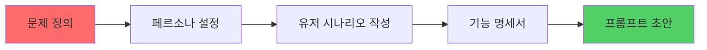

**학습 내용:**
- 문제 정의 및 페르소나 분석
- 유저 시나리오 작성 (5W1H 프레임워크)
- 기능 명세서 작성
- 프롬프트 초안 설계

**산출물:**
- 페르소나 문서 (1명 이상)
- 유저 시나리오 (3개 이상)
- 기능 명세서
- 프롬프트 초안

**Week 2: 프롬프트 설계 및 결과값 구현**

**학습 내용:**
- 구조적 프롬프트 템플릿 작성
- Few-shot Learning 적용
- Chain-of-Thought 프롬프트
- 결과값 검증 및 개선

**산출물:**
- 최적화된 프롬프트 템플릿
- 다양한 입력에 대한 결과 샘플 (10개 이상)
- 프롬프트 개선 로그

**예시 프롬프트 템플릿:**
```
당신은 감정 분석 전문가입니다.
사용자의 일기 내용을 분석하여 다음 정보를 제공하세요:

1. 감정 상태 (기쁨, 슬픔, 분노, 불안, 평온 중 선택)
2. 감정 강도 (1-10점)
3. 감정 원인 분석
4. 개선 제안

일기 내용: {user_diary}

형식: JSON
{
  "emotion": "",
  "intensity": 0,
  "analysis": "",
  "suggestions": []
}
```

#### 2단계: AI Agent 구현 (2주)

**Week 1: Agent 설계 및 체이닝**

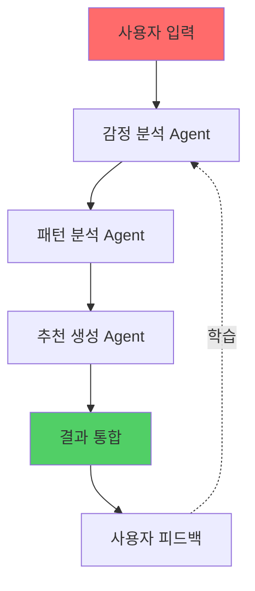

**학습 내용:**
- LangChain 기본 구조 이해
- Agent 설계 (Tools, Memory, Chain)
- Sequential Chain 구현
- Router Chain 구현

**산출물:**
- Agent 아키텍처 다이어그램
- LangChain 코드 (기본 구조)

**Week 2: 구조적 프롬프트 및 자동화**

**학습 내용:**
- PromptTemplate 활용
- OutputParser 구현
- Memory 관리 (ConversationBufferMemory)
- 자동화 워크플로우 구현

**산출물:**
- 완성된 AI Agent 코드
- 자동화 테스트 결과
- 성능 개선 리포트

**예시 Agent 구조:**
```python
from langchain.agents import initialize_agent, AgentType
from langchain.tools import Tool
from langchain.memory import ConversationBufferMemory

# 감정 분석 Agent
emotion_agent = initialize_agent(
    tools=[emotion_analyzer_tool],
    llm=llm,
    agent=AgentType.ZERO_SHOT_REACT_DESCRIPTION,
    memory=ConversationBufferMemory(),
    verbose=True
)
```

#### 3단계: V0 프론트 구현 (2주)

**Week 1: V0 프로토타입 생성**

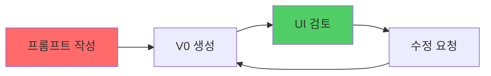

**학습 내용:**
- V0 사용법 및 프롬프트 작성
- 컴포넌트 구조 이해
- Input-Result UI 패턴 설계
- 사이트맵 작성

**산출물:**
- V0 프로토타입 링크
- 사이트맵 문서
- UI 컴포넌트 목록

**Week 2: UI/UX 개선**

**학습 내용:**
- 사용자 테스트 및 피드백 수집
- UI 개선 (V0 재생성)
- 반응형 디자인 적용
- 접근성 개선

**산출물:**
- 개선된 프로토타입
- 사용자 테스트 리포트
- UI/UX 개선 계획서

**V0 프롬프트 예시:**
```
감정 일기장 앱을 만들어주세요.

주요 기능:
1. 일기 작성 (텍스트 입력)
2. 감정 분석 결과 표시 (카드 형태)
3. 감정 히스토리 그래프
4. 개선 제안 리스트

디자인:
- 차분한 블루 계열 (#4ECDC4)
- 모바일 우선 반응형
- 부드러운 애니메이션
```

#### 4단계: 프론트 상세 개발 (2주)

**Week 1: Cursor/Claude 활용 개발**

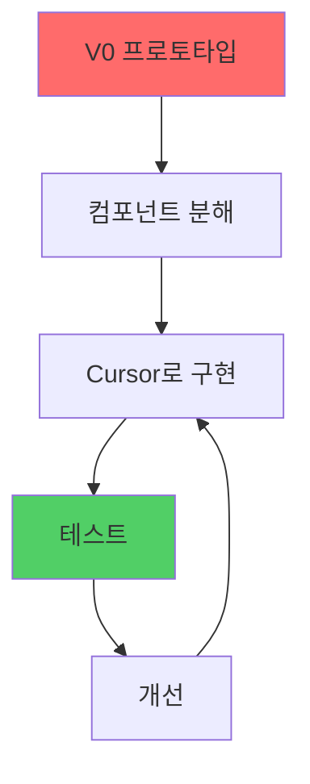

**학습 내용:**
- Cursor AI 활용법
- 컴포넌트 단위 개발
- TypeScript 타입 정의
- 상태관리 구조 설계

**산출물:**
- 컴포넌트 구조도
- TypeScript 인터페이스 정의
- 주요 컴포넌트 코드

**Week 2: 상태관리 및 통합**

**학습 내용:**
- Zustand/Redux 상태관리 구현
- API 연동 준비
- 에러 핸들링
- 로딩 상태 관리

**산출물:**
- 완성된 프론트엔드 코드
- 상태관리 다이어그램
- API 연동 인터페이스

**컴포넌트 구조 예시:**
```
src/
├── components/
│   ├── EmotionDiary/
│   │   ├── DiaryInput.tsx
│   │   ├── EmotionCard.tsx
│   │   ├── EmotionGraph.tsx
│   │   └── SuggestionsList.tsx
│   └── common/
│       ├── Button.tsx
│       └── Loading.tsx
├── stores/
│   └── emotionStore.ts
└── types/
    └── emotion.ts
```

#### 5단계: Backend + AI 적용 및 배포 (2주)

**Week 1: Backend API 개발**

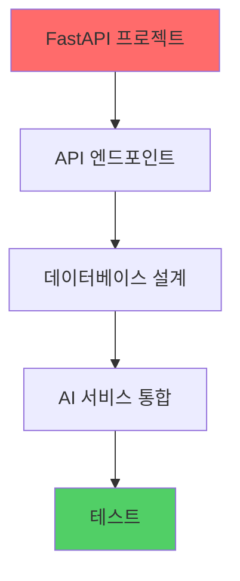

**학습 내용:**
- FastAPI 프로젝트 구조
- RESTful API 설계
- PostgreSQL 데이터베이스 설계
- LangChain Agent 통합

**산출물:**
- API 명세서
- 데이터베이스 ERD
- Backend 코드

**Week 2: 배포 및 모니터링**

**학습 내용:**
- Docker 컨테이너화
- 클라우드 배포 (Vercel, Railway, AWS)
- 환경 변수 관리
- 로깅 및 모니터링 설정

**산출물:**
- 배포된 웹 애플리케이션
- 배포 문서
- 모니터링 대시보드

**API 구조 예시:**
```python
from fastapi import FastAPI
from langchain.agents import initialize_agent

app = FastAPI()

@app.post("/api/analyze-emotion")
async def analyze_emotion(diary: str):
    # LangChain Agent 호출
    result = emotion_agent.run(diary)
    return {"emotion": result}
```

---

### 2️⃣ 여가 AI: 나만의 취미 큐레이터

#### 소주제 목록

1. **60초 브이로그 자동 생성기**
2. **AI 독서 비서: 책 내용을 내 것으로**
3. **주말 활동 AI 룰렛**
4. **AI 취미 튜터 플랫폼**
5. **게임 하이라이트 자동 편집**

---

#### 소주제별 프롬프트 및 결과 예시

##### 소주제 1: 60초 브이로그 자동 생성기

**프롬프트 템플릿:**
```
당신은 브이로그 제작 전문가입니다.
사용자가 제공한 일일 활동이나 사진을 바탕으로 60초 브이로그 스크립트와 편집 가이드를 생성하세요:

1. 브이로그 스토리 구조
2. 장면별 설명 (총 60초 분량)
3. 음악/분위기 추천
4. 편집 포인트
5. 썸네일 제안

일일 활동 로그: {daily_activities}
주요 사진/이벤트: {key_moments}
테마: {theme} (일상/여행/취미/특별한 날)

출력 형식: JSON
{
  "title": "브이로그 제목",
  "story_structure": {
    "opening": "오프닝 (0-5초)",
    "body": "본문 (5-50초)",
    "ending": "엔딩 (50-60초)"
  },
  "scenes": [
    {
      "time": "시간대",
      "duration": "지속 시간",
      "content": "장면 내용",
      "shot_type": "샷 타입 (와이드/클로즈업/타임랩스)",
      "narration": "나레이션 텍스트"
    }
  ],
  "music_suggestion": {
    "genre": "음악 장르",
    "mood": "분위기",
    "bpm": "템포"
  },
  "editing_tips": [
    {
      "tip": "편집 팁",
      "reason": "이유"
    }
  ],
  "thumbnail_concept": "썸네일 컨셉",
  "hashtags": ["해시태그1", "해시태그2"]
}
```

**입력 예시:**
```
일일 활동 로그:
- 오전 7시: 기상, 아침 운동 (조깅 30분)
- 오전 9시: 카페에서 공부
- 오후 1시: 친구와 점심 식사
- 오후 3시: 전시회 관람
- 오후 7시: 집에서 저녁 준비 및 식사
주요 사진/이벤트: 전시회 사진, 친구와의 점심 사진, 저녁 요리 사진
테마: 일상
```

**예상 출력 결과:**
```json
{
  "title": "나의 완벽한 하루 | 운동, 공부, 전시회, 요리",
  "story_structure": {
    "opening": "오프닝 (0-5초): 아침 기상, 창문 열기, 햇살 받는 장면",
    "body": "본문 (5-50초): 운동 → 카페 공부 → 친구 만남 → 전시회 → 저녁 요리",
    "ending": "엔딩 (50-60초): 저녁 식사, 하루 마무리, 내일 기대"
  },
  "scenes": [
    {
      "time": "0-5초",
      "duration": "5초",
      "content": "아침 기상, 커튼 열기, 햇살 받는 장면",
      "shot_type": "와이드샷 → 클로즈업",
      "narration": "좋은 아침이에요! 오늘도 화이팅!"
    },
    {
      "time": "5-12초",
      "duration": "7초",
      "content": "조깅하는 장면 (타임랩스)",
      "shot_type": "와이드샷, 타임랩스",
      "narration": "아침 운동으로 하루를 시작해요"
    },
    {
      "time": "12-20초",
      "duration": "8초",
      "content": "카페에서 공부하는 장면",
      "shot_type": "클로즈업 (노트북, 커피)",
      "narration": "카페에서 집중하는 시간"
    },
    {
      "time": "20-28초",
      "duration": "8초",
      "content": "친구와 점심 식사",
      "shot_type": "와이드샷 (대화하는 모습)",
      "narration": "친구와의 소중한 시간"
    },
    {
      "time": "28-40초",
      "duration": "12초",
      "content": "전시회 관람 (작품 클로즈업, 감상하는 모습)",
      "shot_type": "클로즈업 → 와이드샷",
      "narration": "예술 작품에 감동받는 오후"
    },
    {
      "time": "40-50초",
      "duration": "10초",
      "content": "저녁 요리 과정 (타임랩스)",
      "shot_type": "클로즈업, 타임랩스",
      "narration": "집에서 만드는 따뜻한 저녁"
    },
    {
      "time": "50-60초",
      "duration": "10초",
      "content": "저녁 식사, 하루 마무리",
      "shot_type": "와이드샷",
      "narration": "완벽한 하루의 마무리. 내일도 기대돼요!"
    }
  ],
  "music_suggestion": {
    "genre": "Lo-fi, Acoustic",
    "mood": "편안하고 따뜻한",
    "bpm": "70-80"
  },
  "editing_tips": [
    {
      "tip": "전환 효과: 부드러운 페이드 인/아웃 사용",
      "reason": "일상의 자연스러운 흐름 강조"
    },
    {
      "tip": "타임랩스: 운동, 요리 장면에 적용",
      "reason": "시간의 흐름을 압축하여 역동성 추가"
    },
    {
      "tip": "컬러 그레이딩: 따뜻한 톤 (오렌지, 노랑 계열)",
      "reason": "일상의 따뜻함과 긍정적 에너지 전달"
    },
    {
      "tip": "텍스트 오버레이: 각 장면의 시간대 표시",
      "reason": "하루의 흐름을 명확하게 전달"
    }
  ],
  "thumbnail_concept": "전시회 작품 앞에서 포즈 취하는 모습, 밝고 따뜻한 톤, '완벽한 하루' 텍스트 오버레이",
  "hashtags": ["일상브이로그", "데일리브이로그", "하루일기", "일상기록", "브이로그", "데일리", "일상", "데일리룩"]
}
```

**결과 활용 방법:**
- 편집 가이드: 자동 편집 소프트웨어에 입력하여 자동 편집
- 스크립트: 나레이션 녹음 가이드
- 썸네일 생성: AI 이미지 생성 도구에 컨셉 입력

---

##### 소주제 2: AI 독서 비서: 책 내용을 내 것으로

**프롬프트 템플릿:**
```
당신은 독서 코치입니다.
책의 내용을 분석하여 학습자가 이해하고 활용할 수 있도록 다음을 제공하세요:

1. 핵심 내용 요약
2. 주요 개념 정리
3. 실생활 적용 방법
4. 이해도 체크 질문
5. 심화 학습 제안

책 제목: {book_title}
작가: {author}
읽은 부분: {read_section}
학습자의 관심 분야: {interest_area}
학습 목적: {learning_goal}

출력 형식: JSON
{
  "summary": {
    "main_idea": "핵심 아이디어",
    "key_points": ["주요 포인트1", "주요 포인트2"],
    "summary_text": "요약 텍스트"
  },
  "concepts": [
    {
      "concept": "개념명",
      "explanation": "설명",
      "example": "예시"
    }
  ],
  "applications": [
    {
      "idea": "적용 아이디어",
      "how": "구체적 방법",
      "context": "적용 상황"
    }
  ],
  "comprehension_questions": [
    {
      "question": "질문",
      "type": "이해도/적용/분석",
      "answer_hint": "답변 힌트"
    }
  ],
  "further_learning": {
    "related_books": ["관련 도서"],
    "topics": ["심화 주제"],
    "practices": ["실습 활동"]
  }
}
```

**입력 예시:**
```
책 제목: 아토믹 하빗
작가: 제임스 클리어
읽은 부분: 1-3장 (습관의 힘, 습관 형성의 법칙)
학습자의 관심 분야: 자기계발, 생산성 향상
학습 목적: 좋은 습관 만들기, 나쁜 습관 고치기
```

**예상 출력 결과:**
```json
{
  "summary": {
    "main_idea": "작은 변화가 큰 결과를 만든다. 습관은 복리 효과를 가진다.",
    "key_points": [
      "습관은 1%의 개선이 모여 큰 변화를 만든다",
      "습관 형성의 4단계: 신호 → 갈망 → 반응 → 보상",
      "환경 설계가 습관 형성에 핵심적",
      "아이덴티티 기반 습관 형성이 지속 가능"
    ],
    "summary_text": "아토믹 하빗은 작은 습관의 힘을 강조합니다. 하루 1%만 개선해도 1년 후에는 37배 향상됩니다. 습관 형성은 신호-갈망-반응-보상의 4단계 루프로 이루어지며, 환경을 설계하고 원하는 아이덴티티에 맞는 습관을 만드는 것이 핵심입니다."
  },
  "concepts": [
    {
      "concept": "복리의 법칙",
      "explanation": "작은 변화가 시간이 지나면서 기하급수적으로 커지는 현상",
      "example": "매일 1% 개선하면 1년 후 37배 향상, 1% 악화하면 거의 0에 수렴"
    },
    {
      "concept": "습관 루프",
      "explanation": "신호 → 갈망 → 반응 → 보상의 4단계 순환 구조",
      "example": "알람 소리(신호) → 깨어나고 싶음(갈망) → 알람 끄기(반응) → 다시 잠(보상)"
    },
    {
      "concept": "환경 설계",
      "explanation": "습관을 쉽게 만들거나 어렵게 만드는 물리적 환경 조성",
      "example": "운동 습관: 운동복을 침대 옆에 두기, 스마트폰을 다른 방에 두기"
    }
  ],
  "applications": [
    {
      "idea": "아침 독서 습관 만들기",
      "how": "1) 책을 침대 옆에 두기(환경 설계) 2) 알람 후 바로 책 펼치기(신호 연결) 3) 1페이지만 읽기(작게 시작) 4) 읽은 후 체크리스트에 표시(보상)",
      "context": "매일 아침 5분 독서로 시작, 점진적으로 시간 늘리기"
    },
    {
      "idea": "스마트폰 사용 습관 개선",
      "how": "1) 침대에서 멀리 두기(환경 설계) 2) 사용 시간 제한 앱 설치(반응 어렵게) 3) 대체 활동 준비(독서, 운동)",
      "context": "취침 전 스마트폰 사용을 독서로 대체"
    },
    {
      "idea": "운동 습관 형성",
      "how": "1) 운동복 미리 준비(환경) 2) 기존 습관에 연결(커피 마신 후 운동) 3) 5분만 하기(작게 시작) 4) 운동 후 기록(보상)",
      "context": "매일 아침 커피 후 5분 운동으로 시작"
    }
  ],
  "comprehension_questions": [
    {
      "question": "습관 루프의 4단계를 설명하고, 내 생활의 한 습관을 예시로 들어 설명하세요.",
      "type": "이해도",
      "answer_hint": "신호-갈망-반응-보상 구조를 명확히 구분하여 설명"
    },
    {
      "question": "복리의 법칙을 활용하여 내가 만들고 싶은 습관을 설계하세요.",
      "type": "적용",
      "answer_hint": "1% 작은 변화로 시작, 시간에 따른 효과 계산, 구체적 행동 계획"
    },
    {
      "question": "환경 설계가 습관 형성에 미치는 영향을 분석하고, 내 환경을 어떻게 개선할 수 있을지 제안하세요.",
      "type": "분석",
      "answer_hint": "현재 환경의 문제점 파악, 구체적 개선 방안, 예상 효과"
    }
  ],
  "further_learning": {
    "related_books": ["습관의 힘(찰스 두히그)", "미니멀리즘(도미닉 로로)", "딥 워크(칼 뉴포트)"],
    "topics": ["신경과학과 습관", "동기부여 이론", "환경 심리학"],
    "practices": [
      "습관 추적 앱 사용 (Streaks, Habitica)",
      "30일 습관 챌린지 실천",
      "습관 일기 작성 (신호, 반응, 결과 기록)"
    ]
  }
}
```

**결과 활용 방법:**
- 학습 가이드: 개인 학습 플랫폼에 통합
- 퀴즈 생성: 이해도 체크 질문을 자동 퀴즈로 변환
- 추천 시스템: 관련 도서 및 학습 자료 추천

---

##### 소주제 3: 주말 활동 AI 룰렛

**프롬프트 템플릿:**
```
당신은 여가 활동 큐레이터입니다.
사용자의 제약 조건과 선호도를 바탕으로 맞춤형 주말 활동을 추천하세요:

1. 추천 활동 (3-5개)
2. 각 활동의 상세 정보
3. 예산 분석
4. 날씨 고려사항
5. 대체 활동

제약 조건:
- 예산: {budget}원
- 시간: {available_time}시간
- 인원: {people_count}명
- 위치: {location}
- 날씨: {weather}
선호도: {preferences}
이전 활동: {previous_activities} (선택사항)

출력 형식: JSON
{
  "recommendations": [
    {
      "activity": "활동명",
      "category": "카테고리",
      "description": "설명",
      "location": "장소",
      "estimated_cost": 0,
      "duration": "소요 시간",
      "best_time": "최적 시간",
      "weather_consideration": "날씨 고려사항",
      "why_recommend": "추천 이유",
      "preparation": ["준비물"],
      "tips": ["팁"]
    }
  ],
  "budget_breakdown": {
    "total_estimated": 0,
    "by_category": {
      "식비": 0,
      "교통비": 0,
      "입장료": 0,
      "기타": 0
    }
  },
  "alternative_activities": [
    {
      "activity": "대체 활동",
      "reason": "대체 이유"
    }
  ],
  "personalized_insight": "맞춤형 인사이트"
}
```

**입력 예시:**
```
예산: 50000원
시간: 6시간
인원: 2명 (연인)
위치: 서울 강남
날씨: 맑음, 20도
선호도: 문화/예술, 맛집 탐방, 사진 촬영
이전 활동: 지난주 박물관 관람, 카페 탐방
```

**예상 출력 결과:**
```json
{
  "recommendations": [
    {
      "activity": "한강공원 피크닉 + 전시회 관람",
      "category": "문화/야외",
      "description": "한강에서 피크닉을 즐긴 후 근처 갤러리에서 전시회 관람",
      "location": "반포한강공원 → 삼성미술관 리움",
      "estimated_cost": 35000,
      "duration": "5-6시간",
      "best_time": "오전 11시 시작",
      "weather_consideration": "맑은 날씨에 최적, 실내 전시는 날씨 영향 없음",
      "why_recommend": "야외 활동과 문화 활동을 모두 즐길 수 있고, 사진 촬영 기회가 많음",
      "preparation": ["돗자리", "간단한 음식", "카메라", "선크림"],
      "tips": [
        "한강에서 점심 피크닉 후 오후 2시경 전시회 관람",
        "리움 미술관은 사전 예약 필요",
        "한강 일몰 시간 확인하여 저녁 시간 활용"
      ]
    },
    {
      "activity": "압구정 로데오거리 쇼핑 + 브런치",
      "category": "쇼핑/맛집",
      "description": "압구정 거리를 걷며 쇼핑하고 트렌디한 브런치 카페에서 식사",
      "location": "압구정 로데오거리",
      "estimated_cost": 45000,
      "duration": "4-5시간",
      "best_time": "오전 10시 시작",
      "weather_consideration": "실내 중심이므로 날씨 영향 적음",
      "why_recommend": "트렌디한 분위기, 사진 촬영 명소, 다양한 맛집",
      "preparation": ["편한 신발", "카메라"],
      "tips": [
        "주말에는 사람이 많으니 브런치 예약 권장",
        "거리 걷기 좋은 날씨 활용",
        "인스타그램 핫플레이스 탐방"
      ]
    },
    {
      "activity": "국립중앙박물관 + 경복궁 산책",
      "category": "문화/역사",
      "description": "국립중앙박물관에서 특별전 관람 후 경복궁에서 산책",
      "location": "용산 국립중앙박물관 → 경복궁",
      "estimated_cost": 20000,
      "duration": "5-6시간",
      "best_time": "오전 10시 시작",
      "weather_consideration": "맑은 날에 경복궁 산책 최적",
      "why_recommend": "문화적 경험, 예산 내에서 가능, 사진 촬영 기회 많음",
      "preparation": ["편한 신발", "카메라"],
      "tips": [
        "박물관은 사전 예약 필요",
        "경복궁 한복 대여 가능 (추가 비용)",
        "오후 4시 이후 경복궁 입장료 무료"
      ]
    }
  ],
  "budget_breakdown": {
    "total_estimated": 35000,
    "by_category": {
      "식비": 20000,
      "교통비": 5000,
      "입장료": 10000,
      "기타": 0
    }
  },
  "alternative_activities": [
    {
      "activity": "실내 전시회만 관람 (비 오는 날 대비)",
      "reason": "날씨가 변할 경우를 대비한 실내 중심 활동"
    },
    {
      "activity": "한강 자전거 타기",
      "reason": "더 활동적인 옵션, 예산 절약 가능"
    }
  ],
  "personalized_insight": "문화/예술과 맛집을 좋아하시는 취향에 맞춰 야외 활동과 실내 문화 활동을 조합한 추천입니다. 예산 5만원 내에서 충분히 즐길 수 있으며, 사진 촬영 기회도 많아 SNS에 올리기 좋은 활동들입니다."
}
```

**결과 활용 방법:**
- 룰렛 UI: 추천 활동을 랜덤으로 선택하는 인터랙티브 UI
- 지도 통합: 추천 장소를 지도에 표시
- 예약 시스템: 필요한 예약 링크 제공

---

##### 소주제 4: AI 취미 튜터 플랫폼

**프롬프트 템플릿:**
```
당신은 취미 학습 전문가입니다.
사용자의 수준과 목표에 맞춰 단계별 학습 계획을 수립하세요:

1. 현재 수준 평가
2. 학습 목표 설정
3. 단계별 커리큘럼
4. 학습 자료 추천
5. 실습 과제

취미 분야: {hobby_field}
현재 수준: {current_level} (초급/중급/고급)
학습 목표: {learning_goal}
가용 시간: {available_time} (주당 시간)
학습 기간: {duration} (몇 주/개월)

출력 형식: JSON
{
  "level_assessment": {
    "current": "현재 수준",
    "description": "수준 설명"
  },
  "learning_goals": [
    {
      "goal": "학습 목표",
      "timeline": "달성 기간",
      "measurable": "측정 가능한 지표"
    }
  ],
  "curriculum": [
    {
      "week": 0,
      "topic": "주제",
      "objectives": ["학습 목표"],
      "content": "학습 내용",
      "resources": [
        {
          "type": "자료 유형 (동영상/책/튜토리얼)",
          "title": "제목",
          "url": "링크 (있는 경우)",
          "difficulty": "난이도"
        }
      ],
      "practice": {
        "assignment": "실습 과제",
        "time_required": "소요 시간",
        "deliverable": "제출물"
      }
    }
  ],
  "progress_milestones": [
    {
      "milestone": "마일스톤",
      "week": 0,
      "checkpoint": "체크포인트"
    }
  ],
  "tips": ["학습 팁"]
}
```

**입력 예시:**
```
취미 분야: 사진 촬영
현재 수준: 초급 (스마트폰으로만 촬영해봄)
학습 목표: DSLR 카메라로 인물 사진 잘 찍기
가용 시간: 주당 5시간
학습 기간: 8주
```

**예상 출력 결과:**
```json
{
  "level_assessment": {
    "current": "초급",
    "description": "스마트폰 기본 촬영 경험만 있음. 카메라 기본 조작과 사진 이론 학습 필요"
  },
  "learning_goals": [
    {
      "goal": "DSLR 카메라 기본 조작법 숙지",
      "timeline": "2주",
      "measurable": "셔터, 조리개, ISO를 수동으로 조절하여 촬영 가능"
    },
    {
      "goal": "인물 사진의 구도와 조명 이해",
      "timeline": "4주",
      "measurable": "3분할 구도, 골든 아워 활용한 인물 사진 촬영"
    },
    {
      "goal": "인물 사진 편집 기본기 습득",
      "timeline": "6주",
      "measurable": "Lightroom으로 기본 보정 및 색감 조정 가능"
    },
    {
      "goal": "포트폴리오 작품 10장 제작",
      "timeline": "8주",
      "measurable": "완성도 있는 인물 사진 10장 제출"
    }
  ],
  "curriculum": [
    {
      "week": 1,
      "topic": "카메라 기본기 - 셔터, 조리개, ISO",
      "objectives": [
        "셔터 스피드의 개념과 활용",
        "조리개와 심도의 관계",
        "ISO와 노이즈 이해"
      ],
      "content": "카메라의 3요소(셔터, 조리개, ISO)의 개념과 상호 관계 학습",
      "resources": [
        {
          "type": "동영상",
          "title": "DSLR 기초 강의 - 셔터, 조리개, ISO 완벽 이해",
          "url": "YouTube 검색: 'DSLR 기초 셔터 조리개 ISO'",
          "difficulty": "초급"
        },
        {
          "type": "튜토리얼",
          "title": "카메라 수동 모드 연습 가이드",
          "url": "",
          "difficulty": "초급"
        }
      ],
      "practice": {
        "assignment": "같은 피사체를 셔터/조리개/ISO를 각각 변경하며 10장씩 촬영",
        "time_required": "2시간",
        "deliverable": "촬영한 사진 30장 + 각 설정값 기록"
      }
    },
    {
      "week": 2,
      "topic": "인물 사진의 기본 - 포즈와 각도",
      "objectives": [
        "인물 포즈의 기본 원리",
        "카메라 각도에 따른 효과",
        "배경과 피사체의 관계"
      ],
      "content": "인물 사진에서 자연스러운 포즈와 각도 선택법 학습",
      "resources": [
        {
          "type": "동영상",
          "title": "인물 사진 포즈 가이드",
          "url": "",
          "difficulty": "초급"
        }
      ],
      "practice": {
        "assignment": "모델(친구/가족)과 함께 다양한 포즈와 각도로 20장 촬영",
        "time_required": "3시간",
        "deliverable": "촬영한 사진 20장 + 포즈/각도 설명"
      }
    },
    {
      "week": 3,
      "topic": "구도법 - 3분할 법칙, 대칭, 프레이밍",
      "objectives": [
        "3분할 법칙의 이해와 활용",
        "대칭 구도의 효과",
        "프레이밍 기법"
      ],
      "content": "사진의 시각적 균형과 흥미를 만드는 구도법 학습",
      "resources": [
        {
          "type": "동영상",
          "title": "사진 구도법 완벽 가이드",
          "url": "",
          "difficulty": "초급"
        }
      ],
      "practice": {
        "assignment": "3분할 법칙, 대칭, 프레이밍 각각 5장씩 촬영",
        "time_required": "2시간",
        "deliverable": "촬영한 사진 15장 + 구도 설명"
      }
    },
    {
      "week": 4,
      "topic": "조명 이해 - 자연광 활용",
      "objectives": [
        "골든 아워의 이해",
        "실내 자연광 활용",
        "그림자와 하이라이트"
      ],
      "content": "자연광을 활용한 인물 사진 촬영법",
      "resources": [
        {
          "type": "동영상",
          "title": "자연광 인물 사진 촬영",
          "url": "",
          "difficulty": "중급"
        }
      ],
      "practice": {
        "assignment": "골든 아워 시간대에 인물 사진 10장 촬영",
        "time_required": "2시간",
        "deliverable": "촬영한 사진 10장 + 시간대 기록"
      }
    },
    {
      "week": 5,
      "topic": "인물 사진 편집 기초 - Lightroom",
      "objectives": [
        "Lightroom 기본 조작",
        "밝기, 대비, 채도 조정",
        "색온도 조정"
      ],
      "content": "인물 사진 보정의 기본기 학습",
      "resources": [
        {
          "type": "동영상",
          "title": "Lightroom 인물 보정 기초",
          "url": "",
          "difficulty": "초급"
        }
      ],
      "practice": {
        "assignment": "이전에 촬영한 사진 5장을 Lightroom으로 보정",
        "time_required": "2시간",
        "deliverable": "원본/보정본 비교 5세트"
      }
    },
    {
      "week": 6,
      "topic": "인물 사진 편집 심화 - 피부 보정, 색감",
      "objectives": [
        "피부 톤 보정",
        "색감 조정 (HSL)",
        "로컬 조정"
      ],
      "content": "인물 사진의 완성도를 높이는 고급 보정 기법",
      "resources": [
        {
          "type": "동영상",
          "title": "인물 사진 고급 보정",
          "url": "",
          "difficulty": "중급"
        }
      ],
      "practice": {
        "assignment": "인물 사진 3장을 고급 보정 기법으로 편집",
        "time_required": "3시간",
        "deliverable": "보정된 사진 3장"
      }
    },
    {
      "week": 7,
      "topic": "포트폴리오 작품 촬영",
      "objectives": [
        "포트폴리오 기획",
        "통일성 있는 작품 제작",
        "스토리텔링"
      ],
      "content": "완성도 있는 포트폴리오 작품 제작",
      "resources": [
        {
          "type": "튜토리얼",
          "title": "사진 포트폴리오 만들기",
          "url": "",
          "difficulty": "중급"
        }
      ],
      "practice": {
        "assignment": "포트폴리오용 인물 사진 15장 촬영 및 편집",
        "time_required": "5시간",
        "deliverable": "완성된 사진 15장"
      }
    },
    {
      "week": 8,
      "topic": "포트폴리오 완성 및 리뷰",
      "objectives": [
        "최종 작품 선별",
        "포트폴리오 구성",
        "피드백 수용"
      ],
      "content": "8주간의 학습 성과를 포트폴리오로 정리",
      "resources": [],
      "practice": {
        "assignment": "최종 포트폴리오 10장 선별 및 구성, 피드백 반영",
        "time_required": "3시간",
        "deliverable": "완성된 포트폴리오 10장 + 학습 회고"
      }
    }
  ],
  "progress_milestones": [
    {
      "milestone": "카메라 기본기 숙지",
      "week": 2,
      "checkpoint": "수동 모드로 촬영 가능, 셔터/조리개/ISO 이해"
    },
    {
      "milestone": "인물 사진 기본기 완성",
      "week": 4,
      "checkpoint": "자연스러운 포즈와 구도로 촬영 가능"
    },
    {
      "milestone": "편집 기초 완성",
      "week": 6,
      "checkpoint": "Lightroom 기본 보정 가능"
    },
    {
      "milestone": "포트폴리오 완성",
      "week": 8,
      "checkpoint": "완성도 있는 인물 사진 10장 제작"
    }
  ],
  "tips": [
    "매일 카메라를 만져보며 조작법에 익숙해지기",
    "다른 사진작가의 작품을 많이 감상하며 영감 얻기",
    "실패한 사진도 분석하여 개선점 찾기",
    "모델과의 소통이 좋은 사진의 핵심"
  ]
}
```

**결과 활용 방법:**
- 학습 플랫폼: 단계별 커리큘럼을 학습 관리 시스템에 통합
- 진행 추적: 주차별 학습 진행 상황 추적
- 자동 평가: 실습 과제 제출 및 피드백

---

##### 소주제 5: 게임 하이라이트 자동 편집

**프롬프트 템플릿:**
```
당신은 게임 영상 편집 전문가입니다.
게임 플레이 영상을 분석하여 하이라이트를 자동으로 생성하세요:

1. 하이라이트 구간 식별
2. 편집 스크립트 생성
3. 음악/효과음 추천
4. 썸네일 제안
5. 자막 제안

게임 종류: {game_type}
플레이 시간: {play_duration}
주요 이벤트: {key_events} (킬, 승리, 실패, 재미있는 순간 등)
영상 길이 목표: {target_length} (예: 60초, 3분)

출력 형식: JSON
{
  "highlights": [
    {
      "timestamp": "시간",
      "duration": "지속 시간",
      "event": "이벤트 설명",
      "importance": "high/medium/low",
      "edit_style": "편집 스타일",
      "narration": "나레이션 제안"
    }
  ],
  "edit_script": {
    "opening": {
      "timestamp": "시간",
      "content": "오프닝 내용",
      "effect": "효과"
    },
    "body": [
      {
        "timestamp": "시간",
        "content": "본문 내용",
        "transition": "전환 효과",
        "speed": "재생 속도 (정상/빠름/슬로우)"
      }
    ],
    "ending": {
      "timestamp": "시간",
      "content": "엔딩 내용",
      "effect": "효과"
    }
  },
  "audio": {
    "music": {
      "genre": "장르",
      "mood": "분위기",
      "timing": "사용 시점"
    },
    "sound_effects": [
      {
        "effect": "효과음",
        "timing": "사용 시점"
      }
    ]
  },
  "thumbnail": {
    "concept": "썸네일 컨셉",
    "key_moment": "핵심 순간",
    "text_overlay": "텍스트 오버레이"
  },
  "subtitles": [
    {
      "timestamp": "시간",
      "text": "자막 텍스트",
      "style": "스타일"
    }
  ]
}
```

**입력 예시:**
```
게임 종류: FPS (발로란트)
플레이 시간: 30분
주요 이벤트:
- 5분: 첫 킬 (헤드샷)
- 12분: 3킬 연속 (클러치)
- 18분: 실수로 팀킬
- 25분: 게임 승리 (에이스)
영상 길이 목표: 60초
```

**예상 출력 결과:**
```json
{
  "highlights": [
    {
      "timestamp": "0:05",
      "duration": "5초",
      "event": "첫 킬 - 정확한 헤드샷",
      "importance": "medium",
      "edit_style": "슬로우 모션 + 줌 인",
      "narration": "첫 킬을 따냈다!"
    },
    {
      "timestamp": "0:12",
      "duration": "15초",
      "event": "3킬 연속 클러치",
      "importance": "high",
      "edit_style": "빠른 전환 + 강조 효과",
      "narration": "클러치! 3킬 연속!"
    },
    {
      "timestamp": "0:18",
      "duration": "3초",
      "event": "실수로 팀킬 (재미있는 순간)",
      "importance": "medium",
      "edit_style": "재생 속도 느리게 + 효과음",
      "narration": "어... 실수..."
    },
    {
      "timestamp": "0:25",
      "duration": "10초",
      "event": "게임 승리 - 에이스",
      "importance": "high",
      "edit_style": "드라마틱한 전환 + 승리 효과",
      "narration": "에이스! 게임 승리!"
    }
  ],
  "edit_script": {
    "opening": {
      "timestamp": "0:00-0:03",
      "content": "게임 타이틀 + 첫 킬 장면 미리보기",
      "effect": "빠른 전환, 화려한 효과"
    },
    "body": [
      {
        "timestamp": "0:03-0:08",
        "content": "첫 킬 헤드샷 (슬로우 모션)",
        "transition": "페이드 인",
        "speed": "슬로우 (0.5x)"
      },
      {
        "timestamp": "0:08-0:23",
        "content": "3킬 연속 클러치 (빠른 전환)",
        "transition": "빠른 컷",
        "speed": "빠름 (1.5x)"
      },
      {
        "timestamp": "0:23-0:26",
        "content": "팀킬 실수 (재미있는 순간)",
        "transition": "페이드",
        "speed": "슬로우 (0.3x) + 역재생"
      },
      {
        "timestamp": "0:26-0:36",
        "content": "에이스 및 승리 장면",
        "transition": "드라마틱한 전환",
        "speed": "정상 → 슬로우 (승리 순간)"
      }
    ],
    "ending": {
      "timestamp": "0:36-0:40",
      "content": "최종 스코어 + 다음 영상 예고",
      "effect": "페이드 아웃"
    }
  },
  "audio": {
    "music": {
      "genre": "Electronic, EDM",
      "mood": "에너지틱하고 긴장감 있는",
      "timing": "전체 배경음악, 클라이맥스 부분 볼륨 증가"
    },
    "sound_effects": [
      {
        "effect": "킬 사운드 강조",
        "timing": "각 킬 순간"
      },
      {
        "effect": "승리 팡파르",
        "timing": "게임 승리 순간"
      },
      {
        "effect": "실수 효과음 (재미있는)",
        "timing": "팀킬 순간"
      }
    ]
  },
  "thumbnail": {
    "concept": "에이스 순간의 스크린샷, 강렬한 색감",
    "key_moment": "에이스 킬 순간",
    "text_overlay": "에이스! | 5킬 클러치"
  },
  "subtitles": [
    {
      "timestamp": "0:05",
      "text": "첫 킬!",
      "style": "큰 글씨, 흰색, 그림자 효과"
    },
    {
      "timestamp": "0:12",
      "text": "클러치! 3킬!",
      "style": "큰 글씨, 노란색, 깜빡임 효과"
    },
    {
      "timestamp": "0:18",
      "text": "어... 실수...",
      "style": "작은 글씨, 회색, 움직임 효과"
    },
    {
      "timestamp": "0:25",
      "text": "에이스! 게임 승리!",
      "style": "매우 큰 글씨, 금색, 확대 효과"
    }
  ]
}
```

**결과 활용 방법:**
- 자동 편집: 편집 소프트웨어 API에 입력하여 자동 편집
- 썸네일 생성: AI 이미지 생성 도구에 컨셉 입력
- 자막 생성: 자막 파일 자동 생성

---

#### 1단계: AI 컨텐츠 개발 (2주)

#### 2단계: AI Agent 구현 (2주)

**핵심 학습:**
- 멀티 Agent 시스템 (활동 추천 + 예산 계산 + 날씨 확인)
- 외부 API 통합 (날씨, 지도)
- 메모리 기반 개인화

**Agent 구조:**
```python
# 활동 추천 Agent
activity_agent = initialize_agent(
    tools=[weather_tool, map_tool, budget_calculator],
    llm=llm,
    agent=AgentType.ZERO_SHOT_REACT_DESCRIPTION
)
```

#### 3단계: V0 프론트 구현 (2주)

**V0 프롬프트:**
```
주말 활동 추천 앱을 만들어주세요.

기능:
1. 예산/시간/선호도 입력 폼
2. 추천 활동 카드 (이미지 포함)
3. 지도 표시
4. 예산 분석 차트

디자인: 활기찬 옐로우 계열 (#FFD93D)
```

#### 4단계: 프론트 상세 개발 (2주)

**특별 고려사항:**
- 지도 API 통합 (Google Maps, Kakao Map)
- 이미지 갤러리 컴포넌트
- 차트 라이브러리 (Chart.js, Recharts)

#### 5단계: Backend + AI 적용 및 배포 (2주)

**특별 고려사항:**
- 외부 API 통합 (날씨, 지도)
- 이미지 저장 (S3, Cloudinary)
- 캐싱 전략 (Redis)

---

### 3️⃣ 만남 AI: 연결과 소통의 기술

#### 소주제 목록

1. **AI 대화 코치: 어색함 제로 프로젝트**
2. **동네 친구 AI 매칭**
3. **모임 활성화 AI 봇**
4. **글로벌 펜팔 AI 번역 시스템**
5. **관계망 히트맵 분석**

---

#### 소주제별 프롬프트 및 결과 예시

##### 소주제 1: AI 대화 코치: 어색함 제로 프로젝트

**프롬프트 템플릿:**
```
당신은 대화 코치입니다.
사용자의 상황과 상대방 정보를 바탕으로 대화 주제와 스크립트를 제안하세요:

1. 대화 주제 추천 (3-5개)
2. 첫 인사말 제안
3. 대화 흐름 가이드
4. 어색한 순간 대처법
5. 대화 마무리 제안

상황:
- 장소: {location}
- 관계: {relationship} (처음 만남/친구/동료/상사 등)
- 목적: {purpose} (업무/친목/데이트 등)
- 상대방 정보: {other_person_info}
- 이전 대화: {previous_conversation} (있는 경우)

출력 형식: JSON
{
  "topics": [
    {
      "topic": "주제",
      "why_good": "추천 이유",
      "conversation_starters": ["시작 문장1", "시작 문장2"],
      "follow_up_questions": ["이어가는 질문1", "이어가는 질문2"]
    }
  ],
  "opening_line": {
    "suggested": "추천 첫 인사말",
    "alternatives": ["대체 인사말1", "대체 인사말2"],
    "tone": "톤 (친근함/정중함/캐주얼)"
  },
  "conversation_flow": [
    {
      "phase": "단계 (오프닝/본문/마무리)",
      "suggested_lines": ["대화 라인"],
      "tips": ["팁"]
    }
  ],
  "awkward_moment_handlers": [
    {
      "situation": "어색한 상황",
      "response": "대응 방법",
      "example": "예시 대화"
    }
  ],
  "closing": {
    "suggested": "마무리 제안",
    "next_steps": "다음 만남 제안 (선택사항)"
  }
}
```

**입력 예시:**
```
장소: 회사 휴게실
관계: 처음 만남 (신입 동료)
목적: 친목
상대방 정보: 개발팀 신입, 25세, 취미는 독서
이전 대화: 없음
```

**예상 출력 결과:**
```json
{
  "topics": [
    {
      "topic": "회사 적응 및 업무",
      "why_good": "공통 경험으로 자연스럽게 시작 가능",
      "conversation_starters": [
        "회사 적응은 잘 되고 있나요?",
        "어떤 업무를 맡고 계신가요?"
      ],
      "follow_up_questions": [
        "개발팀 분위기는 어떤가요?",
        "어려운 점이 있으면 언제든 물어보세요"
      ]
    },
    {
      "topic": "취미 및 관심사",
      "why_good": "개인적 이야기로 친밀감 형성",
      "conversation_starters": [
        "독서 좋아하신다고 들었는데, 어떤 책을 읽으시나요?",
        "최근에 읽은 책 중 추천하고 싶은 책이 있나요?"
      ],
      "follow_up_questions": [
        "저도 독서 좋아하는데, 장르는 어떤 걸 선호하세요?",
        "독서 모임 같은 거 참여해보셨나요?"
      ]
    },
    {
      "topic": "주말 활동",
      "why_good": "캐주얼하고 가벼운 주제",
      "conversation_starters": [
        "주말에 뭐 하시면서 보내셨어요?",
        "주말에는 주로 어떻게 보내세요?"
      ],
      "follow_up_questions": [
        "혹시 좋아하는 카페나 장소 있으시면 추천해주세요",
        "다음에 같이 갈 만한 곳 있으면 좋겠네요"
      ]
    }
  ],
  "opening_line": {
    "suggested": "안녕하세요! 개발팀 신입이신가요? 저는 [이름]이라고 합니다.",
    "alternatives": [
      "안녕하세요! 커피 한 잔 하시나요?",
      "안녕하세요! 처음 뵙겠습니다. [이름]입니다."
    ],
    "tone": "친근함"
  },
  "conversation_flow": [
    {
      "phase": "오프닝",
      "suggested_lines": [
        "안녕하세요! 개발팀 신입이신가요?",
        "네, 맞아요. [이름]이라고 합니다.",
        "반갑습니다! 저는 [내 이름]입니다. 회사 적응은 잘 되고 있나요?"
      ],
      "tips": [
        "미소를 지으며 눈을 마주치기",
        "자연스러운 제스처 사용",
        "너무 긴장하지 않기"
      ]
    },
    {
      "phase": "본문",
      "suggested_lines": [
        "독서 좋아하신다고 들었는데, 어떤 장르를 선호하세요?",
        "저도 최근에 [책 제목] 읽었는데 정말 좋았어요",
        "회사 근처에 좋은 카페 있는데, 다음에 같이 가볼까요?"
      ],
      "tips": [
        "상대방의 답변에 진심으로 관심 가지기",
        "자신의 경험도 자연스럽게 공유",
        "질문과 답변의 균형 유지"
      ]
    },
    {
      "phase": "마무리",
      "suggested_lines": [
        "대화 즐거웠습니다!",
        "다음에 또 이야기 나눠요",
        "업무 관련해서 궁금한 거 있으면 언제든 물어보세요"
      ],
      "tips": [
        "자연스럽게 마무리",
        "다음 만남에 대한 긍정적 표현",
        "과도한 약속은 피하기"
      ]
    }
  ],
  "awkward_moment_handlers": [
    {
      "situation": "대화가 끊어질 때",
      "response": "침묵을 자연스럽게 받아들이고, 새로운 주제로 전환",
      "example": "아, 그렇구나. (잠시) 그런데 회사 근처에 맛집 아시나요?"
    },
    {
      "situation": "상대방이 짧게만 답할 때",
      "response": "열린 질문으로 대화 확장 시도",
      "example": "그렇구나. 어떤 점이 그렇게 생각하게 만드셨어요?"
    },
    {
      "situation": "주제가 맞지 않을 때",
      "response": "다른 주제로 자연스럽게 전환",
      "example": "아, 그렇군요. 그런데 혹시 [다른 주제]는 어떠세요?"
    }
  ],
  "closing": {
    "suggested": "대화 즐거웠습니다! 다음에 또 뵈요.",
    "next_steps": "회사 근처 카페 같이 가기 (선택사항)"
  }
}
```

**결과 활용 방법:**
- 실시간 대화 가이드: 앱에서 대화 중 실시간 제안 표시
- 대화 연습: 챗봇과 대화 연습 기능
- 피드백 시스템: 대화 후 개선점 제안

---

##### 소주제 2: 동네 친구 AI 매칭

**프롬프트 템플릿:**
```
당신은 친구 매칭 전문가입니다.
사용자의 프로필과 선호도를 바탕으로 동네 친구를 추천하세요:

1. 매칭 점수 계산
2. 공통점 분석
3. 추천 이유
4. 첫 만남 제안
5. 대화 주제 제안

사용자 프로필:
- 나이: {user_age}
- 위치: {user_location}
- 취미: {user_hobbies}
- 관심사: {user_interests}
- 성격: {user_personality}
- 만나고 싶은 활동: {desired_activities}

후보 프로필: {candidate_profiles}
[
  {
    "name": "이름",
    "age": 0,
    "location": "위치",
    "hobbies": ["취미"],
    "interests": ["관심사"],
    "personality": "성격",
    "bio": "소개"
  }
]

출력 형식: JSON
{
  "matches": [
    {
      "candidate_name": "이름",
      "match_score": 0,
      "common_points": {
        "hobbies": ["공통 취미"],
        "interests": ["공통 관심사"],
        "values": ["공통 가치관"]
      },
      "why_match": "매칭 이유",
      "first_meeting_suggestion": {
        "activity": "활동",
        "location": "장소",
        "time": "시간",
        "reason": "추천 이유"
      },
      "conversation_topics": ["대화 주제"],
      "compatibility": {
        "strengths": ["잘 맞는 점"],
        "potential_challenges": ["잠재적 어려움"],
        "tips": ["팁"]
      }
    }
  ],
  "overall_insight": "종합 인사이트"
}
```

**입력 예시:**
```
사용자 프로필:
- 나이: 28
- 위치: 서울 강남구
- 취미: 독서, 요가, 카페 탐방
- 관심사: 자기계발, 건강, 예술
- 성격: 내향적이지만 친구와는 활발함
- 만나고 싶은 활동: 카페에서 대화, 전시회 관람, 요가 클래스

후보 프로필: [
  {
    "name": "김민지",
    "age": 27,
    "location": "서울 강남구",
    "hobbies": ["독서", "요가", "사진 촬영"],
    "interests": ["자기계발", "예술", "웰빙"],
    "personality": "조용하지만 따뜻함",
    "bio": "독서와 요가를 좋아하는 평범한 직장인"
  },
  {
    "name": "박지훈",
    "age": 30,
    "location": "서울 서초구",
    "hobbies": ["게임", "운동"],
    "interests": ["기술", "스포츠"],
    "personality": "외향적, 활발함",
    "bio": "게임과 운동을 좋아하는 개발자"
  }
]
```

**예상 출력 결과:**
```json
{
  "matches": [
    {
      "candidate_name": "김민지",
      "match_score": 85,
      "common_points": {
        "hobbies": ["독서", "요가"],
        "interests": ["자기계발", "예술", "웰빙"],
        "values": ["평화로운 일상", "자기 성장"]
      },
      "why_match": "취미와 관심사가 거의 일치하며, 성격도 유사하여 자연스러운 친분이 형성될 가능성이 높습니다. 같은 지역에 거주하여 만남도 용이합니다.",
      "first_meeting_suggestion": {
        "activity": "카페에서 대화 + 전시회 관람",
        "location": "강남구 갤러리 근처 카페",
        "time": "주말 오후",
        "reason": "공통 관심사인 예술을 함께 즐기며 자연스럽게 대화할 수 있음"
      },
      "conversation_topics": [
        "최근 읽은 책 추천",
        "요가 클래스 경험",
        "좋아하는 전시회나 갤러리",
        "자기계발 방법"
      ],
      "compatibility": {
        "strengths": [
          "취미와 관심사가 거의 일치",
          "성격이 유사하여 편안한 대화 가능",
          "같은 지역 거주로 만남 용이"
        ],
        "potential_challenges": [
          "둘 다 내향적일 수 있어 초기 대화 시작이 어려울 수 있음"
        ],
        "tips": [
          "공통 취미(독서, 요가)를 시작점으로 대화 시작",
          "전시회나 요가 클래스 같은 활동 중심 만남 제안",
          "서로의 공간을 존중하며 점진적으로 친밀도 높이기"
        ]
      }
    },
    {
      "candidate_name": "박지훈",
      "match_score": 35,
      "common_points": {
        "hobbies": [],
        "interests": [],
        "values": []
      },
      "why_match": "취미와 관심사가 크게 다르며, 성격도 상이하여 초기 친분 형성이 어려울 수 있습니다.",
      "first_meeting_suggestion": {
        "activity": "카페에서 대화",
        "location": "중간 지점 카페",
        "time": "주말 오후",
        "reason": "서로의 관심사를 알아가는 시간"
      },
      "conversation_topics": [
        "서로의 취미와 관심사 소개",
        "일상 이야기",
        "공통 관심사 찾기"
      ],
      "compatibility": {
        "strengths": [
          "서로 다른 관점을 공유할 수 있음",
          "새로운 경험을 할 기회"
        ],
        "potential_challenges": [
          "취미와 관심사가 크게 다름",
          "성격 차이 (내향적 vs 외향적)",
          "만나고 싶은 활동이 다름"
        ],
        "tips": [
          "서로의 차이를 존중하며 대화",
          "공통 관심사를 찾기 위해 노력",
          "무리한 만남보다는 자연스러운 흐름 따르기"
        ]
      }
    }
  ],
  "overall_insight": "김민지님과는 높은 매칭 점수(85점)를 보이며, 취미와 관심사가 거의 일치합니다. 첫 만남은 카페에서 대화 후 전시회 관람을 추천합니다. 박지훈님과는 매칭 점수가 낮지만(35점), 서로 다른 관점을 공유할 수 있는 기회가 될 수 있습니다."
}
```

**결과 활용 방법:**
- 매칭 시스템: 사용자 프로필 기반 자동 매칭
- 추천 엔진: 매칭 점수 기반 추천 순위
- 만남 가이드: 첫 만남 활동 및 대화 주제 제안

---

##### 소주제 3: 모임 활성화 AI 봇

**프롬프트 템플릿:**
```
당신은 모임 활성화 전문가입니다.
모임의 상황을 분석하여 활성화 방안을 제시하세요:

1. 모임 상태 분석
2. 문제점 파악
3. 활성화 전략
4. 대화 주제 제안
5. 활동 제안

모임 정보:
- 모임 유형: {meeting_type} (친구 모임/동호회/스터디 등)
- 참여자 수: {participant_count}
- 모임 목적: {purpose}
- 현재 분위기: {current_atmosphere}
- 문제점: {issues} (있는 경우)

출력 형식: JSON
{
  "status_analysis": {
    "current_state": "현재 상태",
    "energy_level": "에너지 수준 (높음/보통/낮음)",
    "engagement": "참여도 (높음/보통/낮음)"
  },
  "issues": [
    {
      "issue": "문제점",
      "severity": "심각도",
      "impact": "영향"
    }
  ],
  "activation_strategies": [
    {
      "strategy": "전략",
      "how": "구체적 방법",
      "expected_effect": "예상 효과"
    }
  ],
  "conversation_topics": [
    {
      "topic": "주제",
      "why": "추천 이유",
      "starter_questions": ["시작 질문"]
    }
  ],
  "activities": [
    {
      "activity": "활동",
      "description": "설명",
      "duration": "소요 시간",
      "why": "추천 이유"
    }
  ],
  "bot_suggestions": [
    {
      "timing": "시점",
      "message": "봇이 할 말",
      "purpose": "목적"
    }
  ]
}
```

**입력 예시:**
```
모임 유형: 친구 모임
참여자 수: 5명
모임 목적: 친목
현재 분위기: 조용함, 대화가 끊김
문제점: 모두 스마트폰만 보고 있음, 대화 주제 부족
```

**예상 출력 결과:**
```json
{
  "status_analysis": {
    "current_state": "모임이 활성화되지 않음 - 참여자들이 각자 스마트폰에 집중",
    "energy_level": "낮음",
    "engagement": "낮음"
  },
  "issues": [
    {
      "issue": "스마트폰 사용으로 인한 소통 단절",
      "severity": "high",
      "impact": "모임의 목적(친목) 달성 어려움, 관계 형성 저해"
    },
    {
      "issue": "대화 주제 부족",
      "severity": "medium",
      "impact": "어색한 침묵, 모임 활성화 어려움"
    }
  ],
  "activation_strategies": [
    {
      "strategy": "스마트폰 수집 게임",
      "how": "모두의 스마트폰을 중앙에 모아두고, 게임이나 대화에 집중",
      "expected_effect": "스마트폰 의존도 감소, 서로에게 집중"
    },
    {
      "strategy": "질문 게임 시작",
      "how": "재미있는 질문 카드를 사용하거나, 간단한 질문으로 시작",
      "expected_effect": "대화 활성화, 서로에 대한 이해 증가"
    },
    {
      "strategy": "공동 활동 제안",
      "how": "함께 할 수 있는 게임이나 활동 제안",
      "expected_effect": "공동 경험 형성, 유대감 강화"
    }
  ],
  "conversation_topics": [
    {
      "topic": "최근 일상",
      "why": "가장 자연스럽고 접근하기 쉬운 주제",
      "starter_questions": [
        "요즘 뭐 하면서 지내?",
        "최근에 재미있었던 일 있어?",
        "주말에 뭐 했어?"
      ]
    },
    {
      "topic": "추억 공유",
      "why": "공통 경험을 통해 친밀감 형성",
      "starter_questions": [
        "우리 처음 만난 때 기억나?",
        "가장 재미있었던 모임 기억은?",
        "다음에 같이 하고 싶은 거 있어?"
      ]
    },
    {
      "topic": "미래 계획",
      "why": "서로의 목표와 계획을 공유하며 응원",
      "starter_questions": [
        "올해 목표 있어?",
        "다음에 같이 가고 싶은 곳 있어?",
        "버킷리스트 같은 거 있어?"
      ]
    }
  ],
  "activities": [
    {
      "activity": "질문 게임 (Never Have I Ever)",
      "description": "서로에 대해 알아가는 재미있는 게임",
      "duration": "20-30분",
      "why": "대화를 자연스럽게 시작하고, 서로에 대한 호기심 유발"
    },
    {
      "activity": "협동 게임 (보드게임, 카드게임)",
      "description": "함께 즐기는 게임",
      "duration": "30-60분",
      "why": "공동 목표를 통해 유대감 형성, 즐거움 제공"
    },
    {
      "activity": "사진 찍기",
      "description": "함께 사진을 찍고 공유",
      "duration": "10-15분",
      "why": "즉각적인 공동 활동, 추억 만들기"
    }
  ],
  "bot_suggestions": [
    {
      "timing": "모임 시작 5분 후",
      "message": "안녕하세요! 모임이 조금 조용한 것 같아요. 질문 게임 한 번 해볼까요?",
      "purpose": "모임 활성화 시작"
    },
    {
      "timing": "대화가 끊길 때",
      "message": "재미있는 질문: '여행 가고 싶은 곳은 어디인가요?'",
      "purpose": "대화 재개"
    },
    {
      "timing": "모임 중반",
      "message": "스마트폰 잠시 내려두고 서로에게 집중해볼까요?",
      "purpose": "스마트폰 사용 줄이기"
    }
  ]
}
```

**결과 활용 방법:**
- 모임 봇: 실시간으로 모임 상황 분석 및 제안
- 알림 시스템: 모임 활성화가 필요할 때 알림
- 활동 추천: 모임 유형에 맞는 활동 자동 추천

---

##### 소주제 4: 글로벌 펜팔 AI 번역 시스템

**프롬프트 템플릿:**
```
당신은 다국어 소통 전문가입니다.
서로 다른 언어를 사용하는 사람들 간의 대화를 번역하고 문화적 뉘앙스를 전달하세요:

1. 번역 (정확성 + 자연스러움)
2. 문화적 뉘앙스 설명
3. 대화 맥락 유지
4. 오해 방지
5. 관계 형성 도움

원문: {original_text}
원문 언어: {source_language}
목표 언어: {target_language}
대화 맥락: {context}
관계: {relationship} (친구/동료/처음 만남 등)

출력 형식: JSON
{
  "translation": {
    "literal": "직역",
    "natural": "자연스러운 번역",
    "explanation": "번역 설명"
  },
  "cultural_nuances": [
    {
      "aspect": "문화적 측면",
      "explanation": "설명",
      "importance": "중요도"
    }
  ],
  "context_preservation": {
    "tone": "톤 유지",
    "intent": "의도 유지",
    "relationship_level": "관계 수준 유지"
  },
  "misunderstanding_prevention": {
    "potential_issues": ["잠재적 오해"],
    "clarifications": ["명확화 제안"]
  },
  "relationship_building": {
    "suggestions": ["관계 형성 제안"],
    "follow_up": "이어가는 대화 제안"
  }
}
```

**입력 예시:**
```
원문: "오늘 정말 고마웠어요! 덕분에 즐거운 하루였어요."
원문 언어: 한국어
목표 언어: 영어
대화 맥락: 한국인 친구가 미국인 친구에게 감사 인사
관계: 친구
```

**예상 출력 결과:**
```json
{
  "translation": {
    "literal": "Today I was really grateful! Thanks to you, it was a fun day.",
    "natural": "Thank you so much for today! I had such a great time because of you.",
    "explanation": "한국어의 '고마웠어요'는 단순 감사 이상의 따뜻한 감정을 담고 있어 'Thank you so much'로 강조했습니다. '즐거운 하루'는 'great time'으로 자연스럽게 표현했습니다."
  },
  "cultural_nuances": [
    {
      "aspect": "감사 표현의 강도",
      "explanation": "한국어에서 '정말 고마웠어요'는 매우 진심 어린 감사 표현입니다. 영어에서는 'Thank you so much' 또는 'I really appreciate it'으로 전달하는 것이 적절합니다.",
      "importance": "high"
    },
    {
      "aspect": "관계의 친밀도",
      "explanation": "한국어에서는 친구 관계에서도 정중한 표현을 사용하지만, 영어에서는 친구 관계에서는 더 캐주얼한 표현이 자연스럽습니다. 하지만 감사 표현은 진심을 전달하는 것이 중요합니다.",
      "importance": "medium"
    }
  ],
  "context_preservation": {
    "tone": "따뜻하고 진심 어린 감사",
    "intent": "감사와 즐거움 표현",
    "relationship_level": "친구 관계 유지"
  },
  "misunderstanding_prevention": {
    "potential_issues": [
      "과도하게 격식 있는 표현으로 오해될 수 있음",
      "감사의 강도가 약하게 전달될 수 있음"
    ],
    "clarifications": [
      "친구 관계이므로 너무 격식 있지 않게, 하지만 진심은 전달",
      "감사의 강도를 'so much'로 강조"
    ]
  },
  "relationship_building": {
    "suggestions": [
      "다음 만남 제안: 'We should hang out again soon!'",
      "공통 관심사 언급: 'I'd love to do [공통 활동] together again!'"
    ],
    "follow_up": "다음 만남을 제안하거나, 오늘의 특별한 순간을 언급하면 관계가 더 깊어질 수 있습니다."
  }
}
```

**결과 활용 방법:**
- 실시간 번역: 채팅 앱에 통합하여 실시간 번역 제공
- 문화 가이드: 문화적 뉘앙스 설명을 함께 제공
- 관계 도우미: 관계 형성을 위한 제안 제공

---

##### 소주제 5: 관계망 히트맵 분석

**프롬프트 템플릿:**
```
당신은 관계 분석 전문가입니다.
사용자의 관계망 데이터를 분석하여 관계 패턴과 개선점을 제시하세요:

1. 관계망 구조 분석
2. 관계 강도 평가
3. 관계 건강도 분석
4. 소원해진 관계 식별
5. 관계 개선 제안

관계 데이터: {relationship_data}
{
  "contacts": [
    {
      "name": "이름",
      "relationship": "관계 (친구/가족/동료 등)",
      "last_contact": "마지막 연락일",
      "contact_frequency": "연락 빈도",
      "interaction_quality": "상호작용 품질 (높음/보통/낮음)",
      "importance": "중요도 (높음/보통/낮음)"
    }
  ],
  "time_period": "분석 기간"
}

출력 형식: JSON
{
  "network_structure": {
    "total_contacts": 0,
    "by_category": {
      "친구": 0,
      "가족": 0,
      "동료": 0
    },
    "density": "관계 밀도 (높음/보통/낮음)"
  },
  "relationship_strength": [
    {
      "name": "이름",
      "strength": "강도 (강함/보통/약함)",
      "score": 0,
      "factors": ["요인"]
    }
  ],
  "health_analysis": {
    "healthy_relationships": ["건강한 관계"],
    "at_risk": [
      {
        "name": "이름",
        "risk_level": "위험 수준",
        "reason": "이유",
        "last_contact": "마지막 연락일"
      }
    ],
    "distant": ["소원해진 관계"]
  },
  "improvements": [
    {
      "relationship": "관계",
      "issue": "문제점",
      "suggestion": "개선 제안",
      "priority": "우선순위"
    }
  ],
  "insights": "종합 인사이트"
}
```

**입력 예시:**
```
관계 데이터: {
  "contacts": [
    {
      "name": "김수진",
      "relationship": "친구",
      "last_contact": "2개월 전",
      "contact_frequency": "월 1회",
      "interaction_quality": "높음",
      "importance": "높음"
    },
    {
      "name": "박민호",
      "relationship": "친구",
      "last_contact": "1주 전",
      "contact_frequency": "주 2-3회",
      "interaction_quality": "높음",
      "importance": "높음"
    },
    {
      "name": "이지은",
      "relationship": "친구",
      "last_contact": "6개월 전",
      "contact_frequency": "거의 없음",
      "interaction_quality": "보통",
      "importance": "보통"
    }
  ],
  "time_period": "최근 6개월"
}
```

**예상 출력 결과:**
```json
{
  "network_structure": {
    "total_contacts": 3,
    "by_category": {
      "친구": 3,
      "가족": 0,
      "동료": 0
    },
    "density": "낮음"
  },
  "relationship_strength": [
    {
      "name": "박민호",
      "strength": "강함",
      "score": 90,
      "factors": [
        "최근 연락 (1주 전)",
        "높은 연락 빈도 (주 2-3회)",
        "높은 상호작용 품질",
        "높은 중요도"
      ]
    },
    {
      "name": "김수진",
      "strength": "보통",
      "score": 60,
      "factors": [
        "오래된 연락 (2개월 전)",
        "낮은 연락 빈도 (월 1회)",
        "높은 상호작용 품질",
        "높은 중요도"
      ]
    },
    {
      "name": "이지은",
      "strength": "약함",
      "score": 25,
      "factors": [
        "매우 오래된 연락 (6개월 전)",
        "거의 없는 연락 빈도",
        "보통 상호작용 품질",
        "보통 중요도"
      ]
    }
  ],
  "health_analysis": {
    "healthy_relationships": ["박민호"],
    "at_risk": [
      {
        "name": "김수진",
        "risk_level": "중간",
        "reason": "중요한 관계이지만 2개월간 연락이 없음",
        "last_contact": "2개월 전"
      }
    ],
    "distant": ["이지은"]
  },
  "improvements": [
    {
      "relationship": "김수진",
      "issue": "중요한 관계이지만 연락이 뜸함",
      "suggestion": "이번 주말에 연락하여 만남 제안. '요즘 어떻게 지내? 오랜만에 만나서 이야기 나눠볼까?'",
      "priority": "high"
    },
    {
      "relationship": "이지은",
      "issue": "6개월간 연락이 없어 관계가 소원해짐",
      "suggestion": "간단한 인사 메시지로 시작. '오랜만이야! 요즘 어떻게 지내? 간단히라도 연락하고 싶어서'",
      "priority": "medium"
    }
  ],
  "insights": "관계망이 작고(3명), 친구 관계에 집중되어 있습니다. 박민호와는 건강한 관계를 유지하고 있으나, 김수진과는 중요한 관계임에도 연락이 뜸합니다. 이지은과는 관계가 소원해진 상태입니다. 김수진과의 관계를 회복하는 것이 우선순위가 높습니다."
}
```

**결과 활용 방법:**
- 관계 대시보드: 관계 히트맵 시각화
- 알림 시스템: 소원해진 관계 알림 및 연락 제안
- 관계 관리: 자동 연락 제안 및 메시지 템플릿 제공

---

#### 1단계: AI 컨텐츠 개발 (2주)

#### 2단계: AI Agent 구현 (2주)

**핵심 학습:**
- 실시간 대화 Agent
- 매칭 알고리즘 Agent
- 번역 Agent 체이닝

#### 3단계: V0 프론트 구현 (2주)

**V0 프롬프트:**
```
대화 코치 앱을 만들어주세요.

기능:
1. 상황 입력 폼
2. 대화 주제 추천 카드
3. 실시간 대화 연습 (챗봇)
4. 피드백 및 개선 제안

디자인: 따뜻한 그린 계열 (#95E1D3)
```

#### 4단계: 프론트 상세 개발 (2주)

**특별 고려사항:**
- 실시간 채팅 UI (WebSocket 준비)
- 음성 입력/출력 (Web Speech API)
- 관계망 시각화 (D3.js, Cytoscape.js)

#### 5단계: Backend + AI 적용 및 배포 (2주)

**특별 고려사항:**
- WebSocket 서버 구현
- 번역 API 통합 (DeepL, Google Translate)
- 매칭 알고리즘 최적화

---

### 4️⃣ 성찰 AI: 나를 발견하는 여정

#### 소주제 목록

1. **AI 라이프 코치: 10년 후 나는?**
2. **나의 디지털 자서전**
3. **결정 장애 탈출 AI**
4. **나만의 가치관 발굴 프로젝트**
5. **AI 멘토링 시뮬레이터**

#### 1단계: AI 컨텐츠 개발 (2주)

**핵심 학습:**
- 장기 시뮬레이션 프롬프트
- 자기 성찰 프롬프트
- 의사결정 지원 프롬프트

**예시 프롬프트:**
```
당신은 라이프 코치입니다.
사용자의 현재 상태와 목표를 바탕으로 10년 후 시나리오를 시뮬레이션하세요.

입력:
- 현재 나이: {age}
- 현재 직업: {job}
- 목표: {goals}
- 가치관: {values}

출력:
{
  "scenarios": [
    {
      "year": 5,
      "description": "5년 후 시나리오",
      "probability": 0.7,
      "required_actions": ["액션1", "액션2"]
    }
  ],
  "recommendations": ["추천사항"]
}
```

#### 2단계: AI Agent 구현 (2주)

**핵심 학습:**
- 시계열 시뮬레이션 Agent
- 데이터 분석 Agent
- 의사결정 트리 Agent

#### 3단계: V0 프론트 구현 (2주)

**V0 프롬프트:**
```
라이프 코치 앱을 만들어주세요.

기능:
1. 현재 상태 입력 폼
2. 10년 타임라인 시각화
3. 시나리오 비교 차트
4. 액션 플랜 생성

디자인: 깊은 퍼플 계열 (#A29BFE)
```

#### 4단계: 프론트 상세 개발 (2주)

**특별 고려사항:**
- 타임라인 시각화 (Timeline.js, Vis.js)
- 인터랙티브 차트 (D3.js)
- 데이터 입력 마법사 (Wizard Form)

#### 5단계: Backend + AI 적용 및 배포 (2주)

**특별 고려사항:**
- 시계열 데이터 처리
- 복잡한 시뮬레이션 로직
- 데이터 시각화 API

---

### 5️⃣ 돈 AI: 똑똑한 재테크 비서

#### 소주제 목록

1. **AI 주식 뉴스 필터링**
2. **소비 습관 AI 진단 + 재설계**
3. **부동산 AI 분석 플랫폼**
4. **N잡러를 위한 수입원 다각화 AI**
5. **AI 세금 최적화 비서**

#### 1단계: AI 컨텐츠 개발 (2주)

**핵심 학습:**
- 금융 데이터 분석 프롬프트
- 소비 패턴 분석 프롬프트
- 투자 조언 프롬프트 (법적 고려)

**예시 프롬프트:**
```
당신은 재무 분석 전문가입니다.
사용자의 소비 내역을 분석하여 패턴과 개선점을 제시하세요.

주의: 투자 조언이 아닌 정보 제공만 합니다.

입력:
- 소비 내역: {transactions}
- 기간: {period}

출력:
{
  "categories": {
    "식비": {"amount": 0, "percentage": 0},
    "교통": {"amount": 0, "percentage": 0}
  },
  "patterns": ["패턴 분석"],
  "suggestions": ["개선 제안"],
  "disclaimer": "이 정보는 참고용입니다"
}
```

#### 2단계: AI Agent 구현 (2주)

**핵심 학습:**
- 금융 데이터 크롤링 Agent
- 데이터 분석 Agent
- 리포트 생성 Agent

#### 3단계: V0 프론트 구현 (2주)

**V0 프롬프트:**
```
소비 습관 분석 앱을 만들어주세요.

기능:
1. 소비 내역 입력/업로드
2. 카테고리별 차트
3. 패턴 분석 리포트
4. 절약 목표 설정

디자인: 신뢰감 오렌지 계열 (#FDCB6E)
```

#### 4단계: 프론트 상세 개발 (2주)

**특별 고려사항:**
- 복잡한 차트 시각화 (Recharts, Chart.js)
- CSV/Excel 파일 업로드
- 데이터 테이블 (TanStack Table)

#### 5단계: Backend + AI 적용 및 배포 (2주)

**특별 고려사항:**
- 금융 API 통합 (yfinance, 공공데이터)
- 데이터 크롤링 (BeautifulSoup, Scrapy)
- 보안 강화 (암호화, 인증)
- 법적 고지사항 처리

---

## 단계별 학습 가이드

### 1단계 상세 가이드: AI 컨텐츠 개발

#### 학습 목표

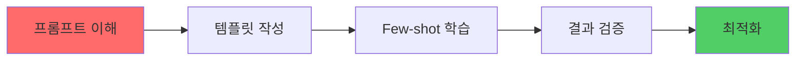

#### 핵심 개념

| 개념 | 설명 | 예시 |
|------|------|------|
| **Zero-shot** | 예시 없이 바로 질문 | "오늘 기분을 분석해줘" |
| **Few-shot** | 몇 개 예시 제공 | "이전 분석 예시 3개 + 새 질문" |
| **Chain-of-Thought** | 단계별 사고 과정 요청 | "먼저... 그 다음... 따라서..." |
| **Role Prompting** | 역할 부여 | "당신은 전문가입니다" |

#### 실습 워크시트

**1. 문제 정의**
```
문제: _____________________________
대상 사용자: ______________________
핵심 기능: ________________________
```

**2. 프롬프트 초안**
```
역할: _____________________________
작업: _____________________________
입력 형식: _______________________
출력 형식: _______________________
```

**3. 테스트 케이스**
| 입력 | 기대 출력 | 실제 출력 | 개선점 |
|------|-----------|-----------|--------|
|      |           |           |        |

#### 평가 기준

| 항목 | 배점 | 기준 |
|------|------|------|
| 문제 정의 명확성 | 20점 | 구체적이고 측정 가능한 문제 정의 |
| 유저 시나리오 완성도 | 20점 | 3개 이상의 상세한 시나리오 |
| 프롬프트 품질 | 30점 | 일관된 결과, 다양한 입력 처리 |
| 결과 검증 | 20점 | 10개 이상 테스트 케이스 |
| 문서화 | 10점 | 명확한 문서 및 개선 로그 |

---

### 2단계 상세 가이드: AI Agent 구현

#### 학습 목표

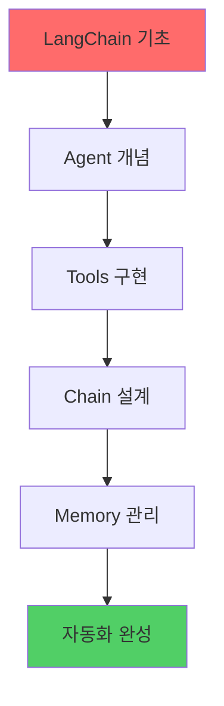

#### 핵심 개념

| 개념 | 설명 | 코드 예시 |
|------|------|-----------|
| **Agent** | 의사결정을 하는 AI | `initialize_agent()` |
| **Tool** | Agent가 사용하는 도구 | `Tool(name="", func=)` |
| **Chain** | 작업 연결 | `SequentialChain()` |
| **Memory** | 대화 기록 저장 | `ConversationBufferMemory()` |

#### 실습 워크시트

**1. Agent 설계**
```
입력: _____________________________
처리 단계:
1. _______________________________
2. _______________________________
3. _______________________________
출력: ____________________________
```

**2. Tools 정의**
```
Tool 1: __________________________
목적: ____________________________
입력: ____________________________
출력: ____________________________
```

**3. Chain 구조**
```python
# 예시 코드 작성
```

#### 평가 기준

| 항목 | 배점 | 기준 |
|------|------|------|
| Agent 설계 | 25점 | 명확한 아키텍처, 적절한 Tools |
| 체이닝 구현 | 25점 | Sequential/Router Chain 구현 |
| 자동화 완성도 | 30점 | 적은 입력으로 많은 결과 생성 |
| 코드 품질 | 20점 | 모듈화, 주석, 에러 처리 |

---

### 3단계 상세 가이드: V0 프론트 구현

#### 학습 목표

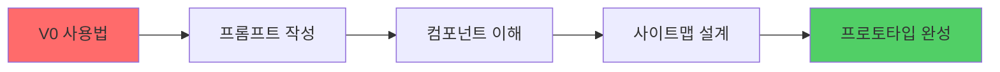

#### 핵심 개념

| 개념 | 설명 | 팁 |
|------|------|-----|
| **V0 프롬프트** | UI를 설명하는 프롬프트 | 구체적이고 시각적으로 |
| **컴포넌트** | 재사용 가능한 UI 요소 | Shadcn UI 활용 |
| **사이트맵** | 페이지 구조도 | 사용자 여정 기반 |

#### 실습 워크시트

**1. 사이트맵 작성**
```
메인 페이지
├── 기능 1 페이지
│   ├── 입력 화면
│   └── 결과 화면
├── 기능 2 페이지
└── 설정 페이지
```

**2. V0 프롬프트 작성**
```
앱 이름: ___________________________
주요 기능: _________________________
디자인 스타일: _____________________
컬러: _____________________________
```

#### 평가 기준

| 항목 | 배점 | 기준 |
|------|------|------|
| 사이트맵 완성도 | 20점 | 명확한 구조, 사용자 여정 반영 |
| V0 프로토타입 품질 | 30점 | 기능 구현, UI/UX 품질 |
| Input-Result 패턴 | 25점 | 명확한 입력/출력 흐름 |
| 반응형 디자인 | 15점 | 모바일/태블릿/데스크톱 |
| 사용자 테스트 | 10점 | 피드백 수집 및 반영 |

---

### 4단계 상세 가이드: 프론트 상세 개발

#### 학습 목표

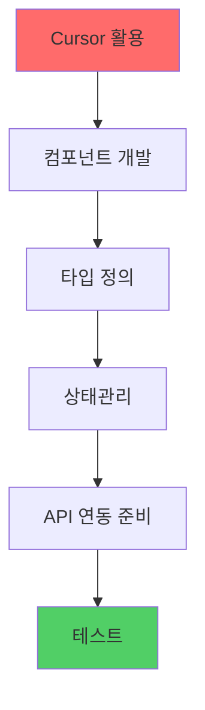

#### 핵심 개념

| 개념 | 설명 | 도구 |
|------|------|------|
| **컴포넌트 분해** | 큰 컴포넌트를 작은 단위로 | React, Vue |
| **타입 안정성** | TypeScript 타입 정의 | TypeScript |
| **상태관리** | 전역 상태 관리 | Zustand, Redux |
| **에러 핸들링** | 에러 처리 패턴 | Try-catch, Error Boundary |

#### 실습 워크시트

**1. 컴포넌트 구조**
```
src/
├── components/
│   ├── [기능명]/
│   │   ├── [컴포넌트명].tsx
│   └── common/
├── stores/
├── types/
└── utils/
```

**2. 타입 정의**
```typescript
// 예시 타입 작성
```

#### 평가 기준

| 항목 | 배점 | 기준 |
|------|------|------|
| 컴포넌트 구조 | 25점 | 모듈화, 재사용성 |
| 타입 정의 | 20점 | 완전한 타입 안정성 |
| 상태관리 | 25점 | 적절한 상태 관리 패턴 |
| 코드 품질 | 30점 | 클린 코드, 주석, 테스트 |

---

### 5단계 상세 가이드: Backend + AI 적용 및 배포

#### 학습 목표

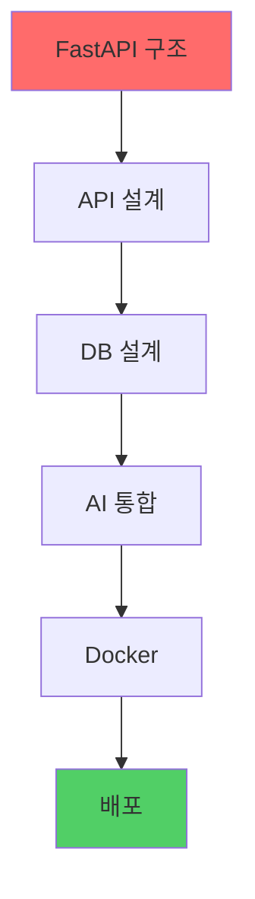

#### 핵심 개념

| 개념 | 설명 | 도구 |
|------|------|------|
| **RESTful API** | 표준 API 설계 | FastAPI, Flask |
| **ORM** | 데이터베이스 추상화 | SQLAlchemy |
| **Docker** | 컨테이너화 | Docker, Docker Compose |
| **배포** | 클라우드 배포 | Vercel, Railway, AWS |

#### 실습 워크시트

**1. API 설계**
```
GET  /api/[resource]      # 목록 조회
POST /api/[resource]      # 생성
GET  /api/[resource]/:id  # 상세 조회
PUT  /api/[resource]/:id  # 수정
DELETE /api/[resource]/:id # 삭제
```

**2. 데이터베이스 ERD**
```
[엔티티 다이어그램 작성]
```

#### 평가 기준

| 항목 | 배점 | 기준 |
|------|------|------|
| API 설계 | 25점 | RESTful 원칙, 명확한 엔드포인트 |
| 데이터베이스 | 20점 | 정규화, 관계 설계 |
| AI 통합 | 25점 | LangChain Agent 통합 |
| 배포 | 20점 | 성공적 배포, 환경 변수 관리 |
| 문서화 | 10점 | API 문서, 배포 가이드 |

---

## 평가 체계

### 전체 평가 구조

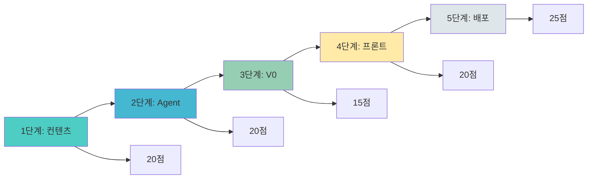

### 평가 기준표

| 단계 | 평가 항목 | 배점 | 합계 |
|------|-----------|------|------|
| **1단계** | 문제 정의, 유저 시나리오, 프롬프트 품질, 결과 검증, 문서화 | 각 20점 | 100점 |
| **2단계** | Agent 설계, 체이닝 구현, 자동화, 코드 품질 | 각 25점 | 100점 |
| **3단계** | 사이트맵, 프로토타입, Input-Result, 반응형, 테스트 | 각 20점 | 100점 |
| **4단계** | 컴포넌트 구조, 타입, 상태관리, 코드 품질 | 각 25점 | 100점 |
| **5단계** | API 설계, DB, AI 통합, 배포, 문서화 | 각 20점 | 100점 |
| **총점** | | | **500점** |

### 성취 등급

| 등급 | 점수 | 기준 |
|------|------|------|
| **S** | 450점 이상 | 모든 단계 완벽 구현, 배포 완료 |
| **A** | 400-449점 | 대부분 완성, 일부 개선 필요 |
| **B** | 350-399점 | 핵심 기능 구현, 추가 작업 필요 |
| **C** | 300-349점 | 기본 구조 완성, 기능 보완 필요 |
| **D** | 300점 미만 | 재수강 권장 |

---

## 학습 리소스

### 필수 도구

| 도구 | 용도 | 링크 |
|------|------|------|
| **ChatGPT/Claude** | 프롬프트 테스트 | https://chat.openai.com |
| **LangChain** | AI Agent 개발 | https://python.langchain.com |
| **V0** | UI 프로토타입 | https://v0.dev |
| **Cursor** | AI 코드 에디터 | https://cursor.sh |
| **FastAPI** | Backend 개발 | https://fastapi.tiangolo.com |

### 추천 학습 자료

1. **프롬프트 엔지니어링**
   - OpenAI Prompt Engineering Guide
   - LangChain Prompt Templates

2. **LangChain**
   - LangChain 공식 문서
   - LangChain 예제 코드

3. **프론트엔드**
   - React 공식 문서
   - TypeScript 핸드북
   - Shadcn UI 컴포넌트

4. **Backend**
   - FastAPI 튜토리얼
   - PostgreSQL 가이드
   - Docker 입문

---

## 다음 단계

### 각 주제별 상세 가이드

1. [감정 AI 상세 가이드](./감정AI_상세가이드.md)
2. [여가 AI 상세 가이드](./여가AI_상세가이드.md)
3. [만남 AI 상세 가이드](./만남AI_상세가이드.md)
4. [성찰 AI 상세 가이드](./성찰AI_상세가이드.md)
5. [돈 AI 상세 가이드](./돈AI_상세가이드.md)

---

## 💬 문의 및 피드백

프로그램 관련 문의사항이나 개선 제안은 아래로 연락 주세요:

- 📧 Email: vivecoding@example.com
- 💬 Discord: [초대 링크]
- 📝 GitHub Issues: [저장소 링크]

---

**Last Updated:** 2025-01-XX  
**Version:** 2.0.0  
**Author:** Vive Coding Team

