# 가상환경 체험 AI 교육 심화 가이드

> **몰입형 AI 학습 프로그램**  
> 가상 환경에서 현실을 시뮬레이션하고 직접 체험하며 배우는 차세대 AI 교육

---

## 📋 목차

1. [프로그램 개요](#프로그램-개요)
2. [핵심 교육 철학](#핵심-교육-철학)
3. [전체 시스템 아키텍처](#전체-시스템-아키텍처)
4. [3대 소주제 소개](#3대-소주제-소개)
5. [핵심 페르소나](#핵심-페르소나)
6. [AI-LLM 3단계 시스템](#ai-llm-3단계-시스템)
7. [개발 프로세스 로드맵](#개발-프로세스-로드맵)
8. [유저 시나리오 상세](#유저-시나리오-상세)
9. [성과 측정 및 평가](#성과-측정-및-평가)

---

## 프로그램 개요

### 🎯 핵심 목표

**"경험을 통한 학습, 시뮬레이션을 통한 성장"**

단순히 이론을 배우는 것이 아니라, 가상 환경에서 실제와 유사한 상황을 체험하고 AI와 상호작용하며 문제 해결 능력을 키우는 몰입형 교육 프로그램

### 📊 프로그램 특징

| 구분 | 내용 |
|------|------|
| **대상** | 실전 경험을 원하는 AI 학습자, 의사결정 능력 향상 희망자 |
| **기간** | 각 소주제당 8-12주 (총 24-36주) |
| **방식** | 가상환경 몰입 + 시뮬레이션 + AI 피드백 |
| **결과물** | 실전 대응 능력 + 포트폴리오 + 최종 분석 보고서 |

### 🌟 차별화 요소

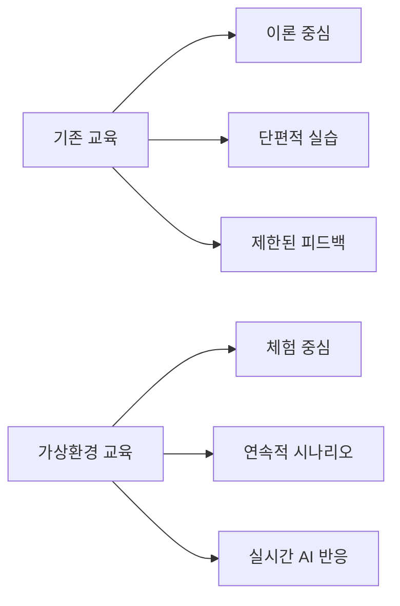
```mermaid
graph LR
    A[기존 교육] --> A1[이론 중심]
    A --> A2[단편적 실습]
    A --> A3[제한된 피드백]
    
    B[가상환경 교육] --> B1[체험 중심]
    B --> B2[연속적 시나리오]
    B --> B3[실시간 AI 반응]
    
```

---

## 핵심 교육 철학

### 💡 학습 원리

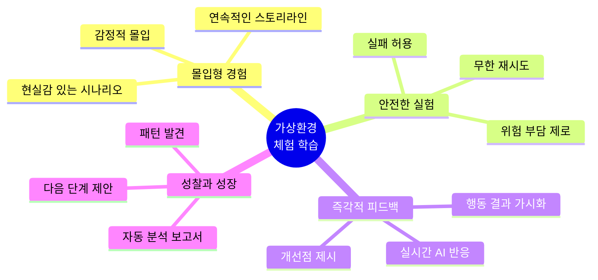
```mermaid
mindmap
  root((가상환경<br/>체험 학습))
    몰입형 경험
      현실감 있는 시나리오
      연속적인 스토리라인
      감정적 몰입
    안전한 실험
      실패 허용
      무한 재시도
      위험 부담 제로
    즉각적 피드백
      실시간 AI 반응
      행동 결과 가시화
      개선점 제시
    성찰과 성장
      자동 분석 보고서
      패턴 발견
      다음 단계 제안
```

### 🔄 학습 사이클

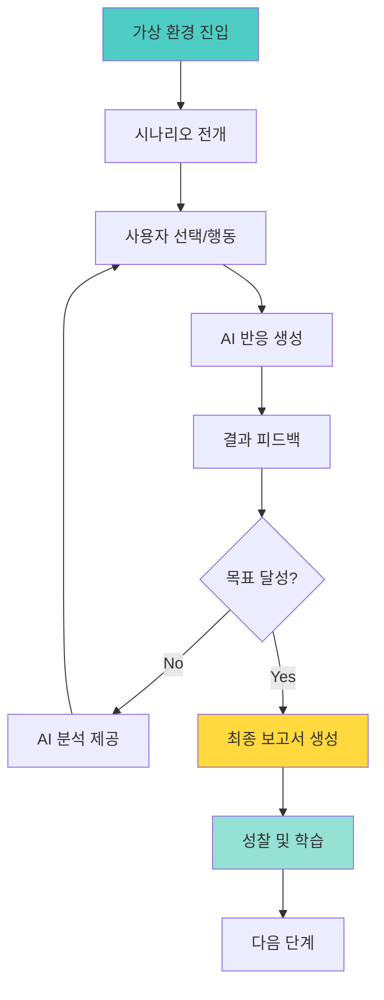
```mermaid
graph TB
    A[가상 환경 진입] --> B[시나리오 전개]
    B --> C[사용자 선택/행동]
    C --> D[AI 반응 생성]
    D --> E[결과 피드백]
    E --> F{목표 달성?}
    
    F -->|No| G[AI 분석 제공]
    G --> C
    
    F -->|Yes| H[최종 보고서 생성]
    H --> I[성찰 및 학습]
    I --> J[다음 단계]
    
    style A fill:#4ECDC4
    style H fill:#FFD93D
    style I fill:#95E1D3
```

---

## 전체 시스템 아키텍처

### 🏗️ 3계층 AI 시스템 구조

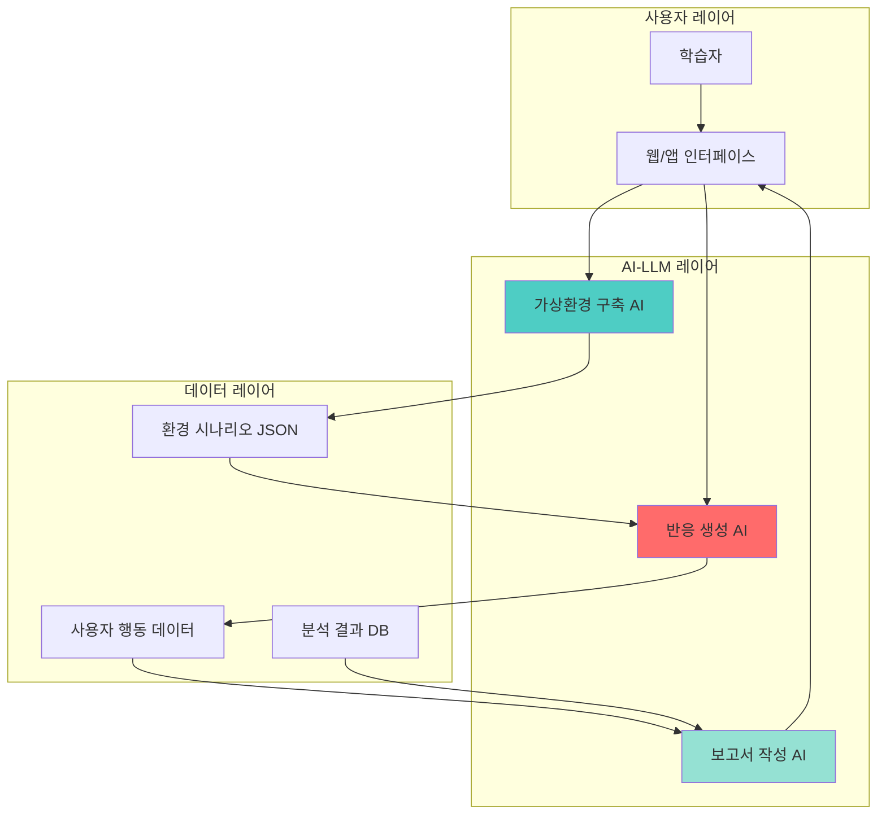
```mermaid
graph TB
    subgraph "사용자 레이어"
        U[학습자] --> UI[웹/앱 인터페이스]
    end
    
    subgraph "AI-LLM 레이어"
        ENV[가상환경 구축 AI]
        REACT[반응 생성 AI]
        REPORT[보고서 작성 AI]
    end
    
    subgraph "데이터 레이어"
        JSON[환경 시나리오 JSON]
        USER_DATA[사용자 행동 데이터]
        ANALYTICS[분석 결과 DB]
    end
    
    UI --> ENV
    ENV --> JSON
    
    UI --> REACT
    REACT --> USER_DATA
    JSON --> REACT
    
    USER_DATA --> REPORT
    ANALYTICS --> REPORT
    REPORT --> UI
    
    style ENV fill:#4ECDC4
    style REACT fill:#FF6B6B
    style REPORT fill:#95E1D3
```

### 📦 시스템 구성 요소

| 구성 요소 | 역할 | 핵심 기술 |
|----------|------|----------|
| **가상환경 구축 AI** | 안정적인 시나리오 환경 생성 | 사전 정의 JSON + LLM 검증 |
| **반응 생성 AI** | 현실적이고 일관된 NPC/상황 반응 | GPT-4 + 컨텍스트 관리 |
| **보고서 작성 AI** | 행동 패턴 분석 및 인사이트 도출 | 데이터 분석 + 자연어 생성 |

---

## 3대 소주제 소개

### 🎭 소주제 1: 비즈니스 협상 시뮬레이터

**목표:** 다양한 협상 상황에서 최적의 의사결정 능력 배양

#### 핵심 개념

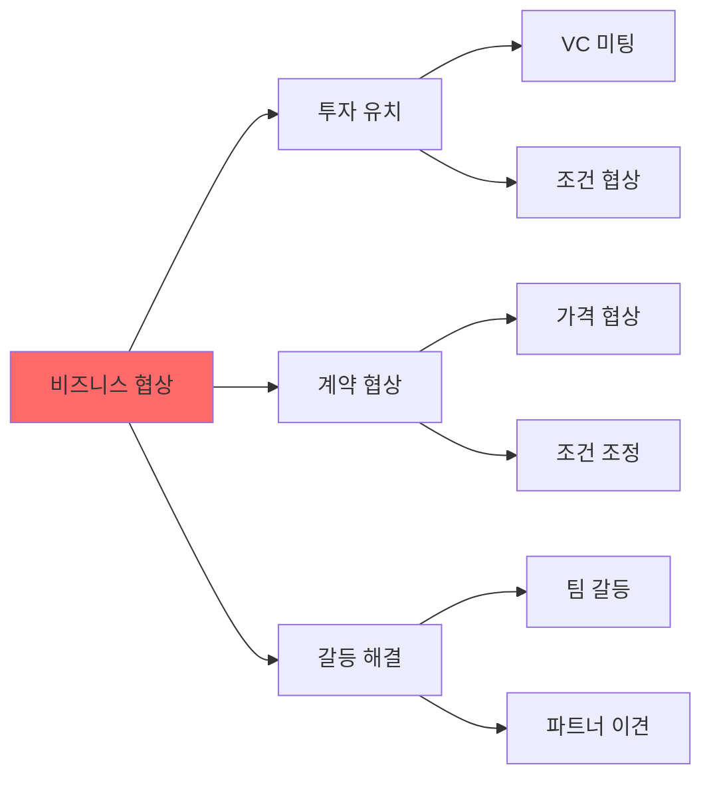
```mermaid
graph LR
    A[비즈니스 협상] --> B[투자 유치]
    A --> C[계약 협상]
    A --> D[갈등 해결]
    
    B --> E[VC 미팅]
    B --> F[조건 협상]
    
    C --> G[가격 협상]
    C --> H[조건 조정]
    
    D --> I[팀 갈등]
    D --> J[파트너 이견]
    
    style A fill:#FF6B6B
```

#### 학습 목표

- ✅ 협상 전략 수립 능력
- ✅ 상대방 심리 파악
- ✅ 윈-윈 솔루션 도출
- ✅ 위기 상황 대응력

#### 가상 환경 구성

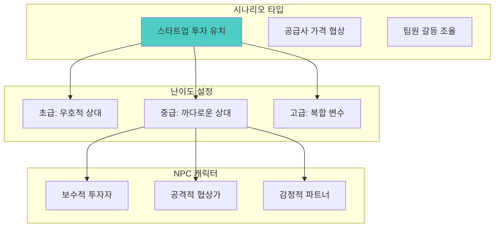
```mermaid
graph TB
    subgraph "시나리오 타입"
        S1[스타트업 투자 유치]
        S2[공급사 가격 협상]
        S3[팀원 갈등 조율]
    end
    
    subgraph "난이도 설정"
        L1[초급: 우호적 상대]
        L2[중급: 까다로운 상대]
        L3[고급: 복합 변수]
    end
    
    subgraph "NPC 캐릭터"
        N1[보수적 투자자]
        N2[공격적 협상가]
        N3[감정적 파트너]
    end
    
    S1 --> L1
    S1 --> L2
    S1 --> L3
    
    L2 --> N1
    L2 --> N2
    L2 --> N3
    
    style S1 fill:#4ECDC4
```

---

### 🏥 소주제 2: 위기 상황 대응 트레이너

**목표:** 예측 불가능한 위기 상황에서의 판단력과 리더십 향상

#### 핵심 개념

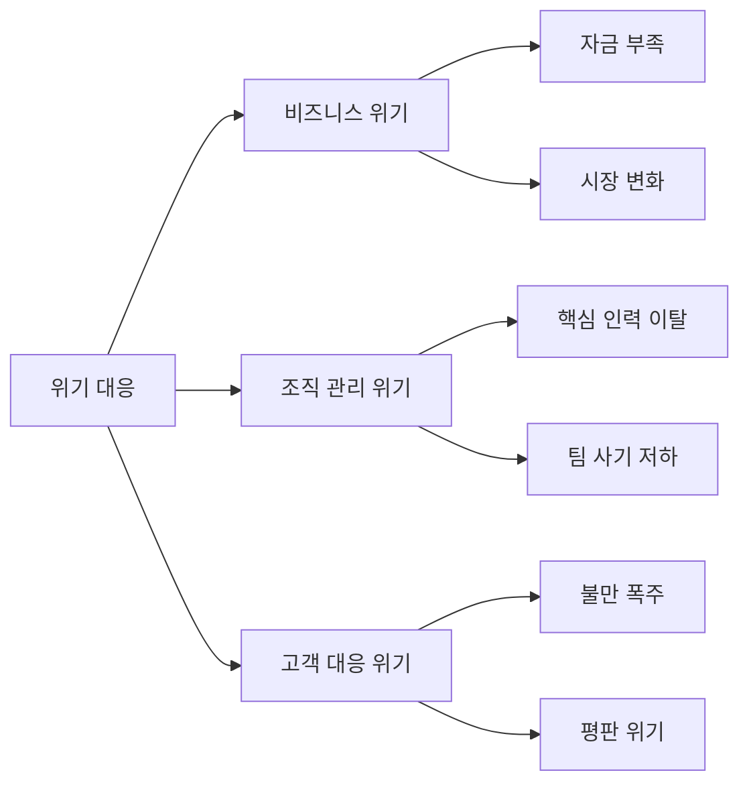
```mermaid
graph LR
    A[위기 대응] --> B[비즈니스 위기]
    A --> C[조직 관리 위기]
    A --> D[고객 대응 위기]
    
    B --> E[자금 부족]
    B --> F[시장 변화]
    
    C --> G[핵심 인력 이탈]
    C --> H[팀 사기 저하]
    
    D --> I[불만 폭주]
    D --> J[평판 위기]

```

#### 학습 목표

- ✅ 빠른 상황 판단 능력
- ✅ 우선순위 결정 능력
- ✅ 스트레스 관리
- ✅ 커뮤니케이션 능력

#### 가상 환경 구성

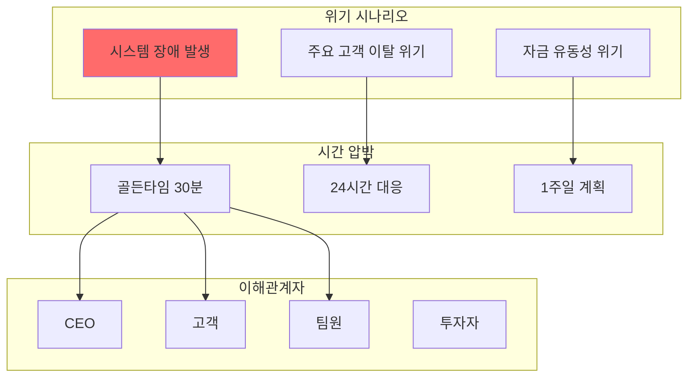
```mermaid
graph TB
    subgraph "위기 시나리오"
        C1[시스템 장애 발생]
        C2[주요 고객 이탈 위기]
        C3[자금 유동성 위기]
    end
    
    subgraph "시간 압박"
        T1[골든타임 30분]
        T2[24시간 대응]
        T3[1주일 계획]
    end
    
    subgraph "이해관계자"
        ST1[CEO]
        ST2[고객]
        ST3[팀원]
        ST4[투자자]
    end
    
    C1 --> T1
    C2 --> T2
    C3 --> T3
    
    T1 --> ST1
    T1 --> ST2
    T1 --> ST3
    
    style C1 fill:#FF6B6B
```

---

### 🌐 소주제 3: 글로벌 문화 적응 시뮬레이터

**목표:** 다문화 환경에서의 효과적인 소통과 협업 능력 개발

#### 핵심 개념

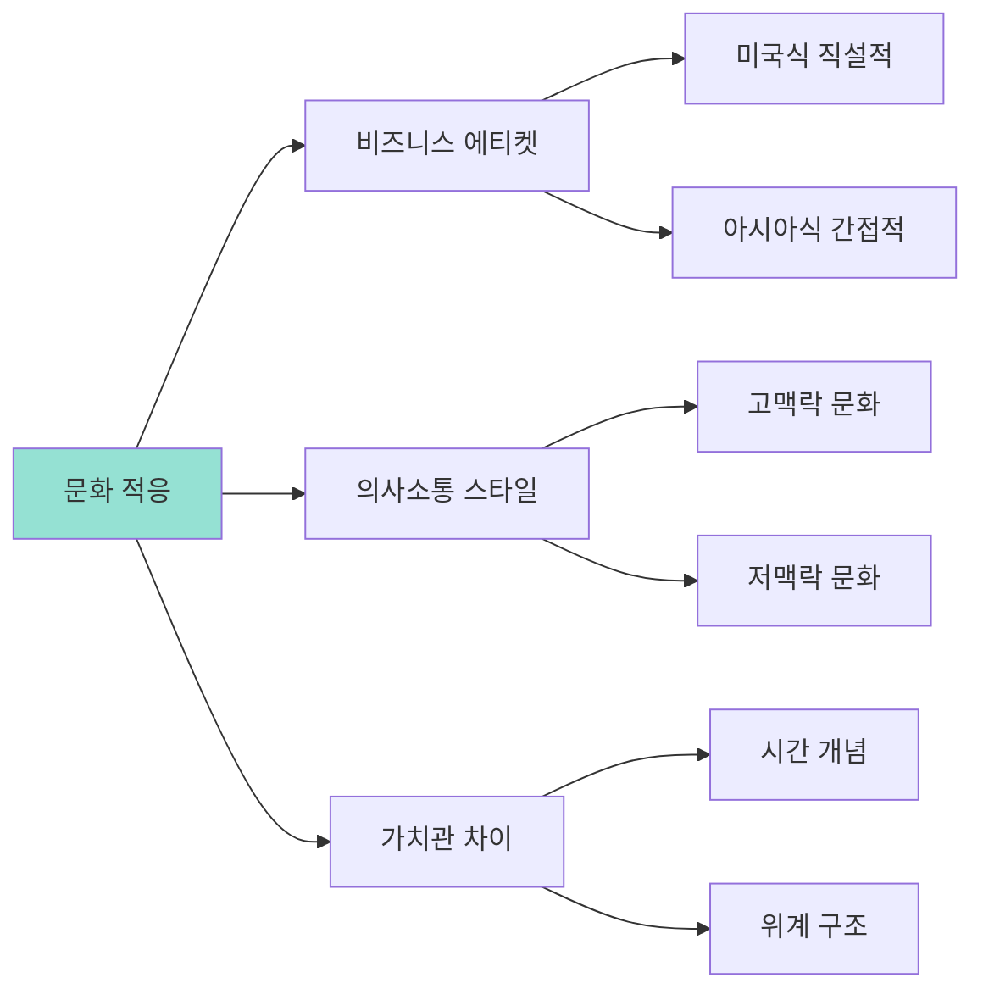
```mermaid
graph LR
    A[문화 적응] --> B[비즈니스 에티켓]
    A --> C[의사소통 스타일]
    A --> D[가치관 차이]
    
    B --> E[미국식 직설적]
    B --> F[아시아식 간접적]
    
    C --> G[고맥락 문화]
    C --> H[저맥락 문화]
    
    D --> I[시간 개념]
    D --> J[위계 구조]
    
    style A fill:#95E1D3
```

#### 학습 목표

- ✅ 문화적 감수성 향상
- ✅ 적응적 의사소통
- ✅ 오해 방지 및 해결
- ✅ 글로벌 네트워킹

#### 가상 환경 구성

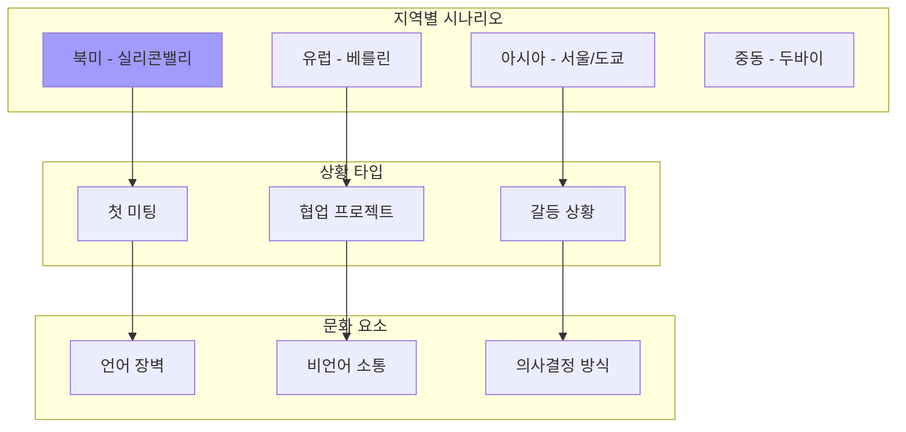
```mermaid
graph TB
    subgraph "지역별 시나리오"
        R1[북미 - 실리콘밸리]
        R2[유럽 - 베를린]
        R3[아시아 - 서울/도쿄]
        R4[중동 - 두바이]
    end
    
    subgraph "상황 타입"
        ST1[첫 미팅]
        ST2[협업 프로젝트]
        ST3[갈등 상황]
    end
    
    subgraph "문화 요소"
        CE1[언어 장벽]
        CE2[비언어 소통]
        CE3[의사결정 방식]
    end
    
    R1 --> ST1
    R2 --> ST2
    R3 --> ST3
    
    ST1 --> CE1
    ST2 --> CE2
    ST3 --> CE3
    
    style R1 fill:#A29BFE
```

---

## 핵심 페르소나

### 👤 페르소나 1: 민준 (29세, 스타트업 대표)

**프로필:**
- 직업: 에듀테크 스타트업 공동창업자
- 특징: 기술은 좋지만 협상/비즈니스 경험 부족
- 고민: "투자 유치 미팅이 두렵다", "팀 관리가 어렵다"

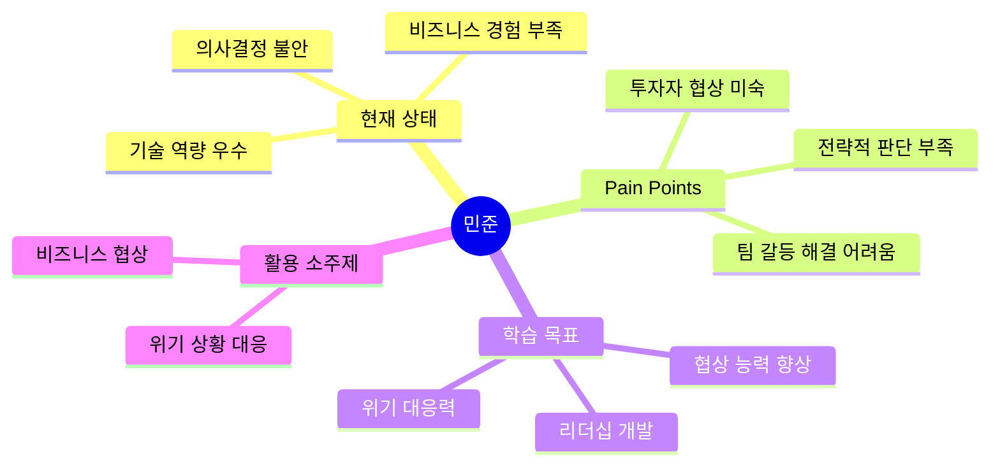
```mermaid
mindmap
  root((민준))
    현재 상태
      기술 역량 우수
      비즈니스 경험 부족
      의사결정 불안
    Pain Points
      투자자 협상 미숙
      팀 갈등 해결 어려움
      전략적 판단 부족
    학습 목표
      협상 능력 향상
      리더십 개발
      위기 대응력
    활용 소주제
      비즈니스 협상
      위기 상황 대응
```

**유저 시나리오 - 투자 유치 준비 과정:**

```
Day 1: 가상환경 시작
- 민준이 플랫폼에 로그인
- "시리즈 A 투자 유치" 시나리오 선택
- 가상환경 AI가 VC 투자자 3명 생성 (보수형, 공격형, 중립형)
- 초기 상황: "회사 가치 평가 50억, 투자 희망 금액 10억"

Day 1-2: 첫 번째 미팅
- 보수적 투자자와 미팅 시작
- 민준: "저희 서비스는..."
- AI 반응: "시장 규모가 작아 보이는데요" (표정: 회의적)
- 민준이 답변 선택 또는 직접 입력
- AI가 실시간으로 투자자 반응 생성
- 결과: 추가 미팅 약속 (진행도 30%)

Day 3-4: 재협상 준비
- 중간 피드백 리포트 수신
  "당신은 기술에만 집중했습니다"
  "시장 데이터 제시가 부족했습니다"
  "제안: 경쟁 분석 자료 준비"
- 개선된 자료로 두 번째 미팅

Day 5-7: 최종 협상
- 여러 시도 끝에 조건 협의
- 지분 희석률, 이사회 구성 등 논의
- 최종 결과: 성공/실패 + 상세 분석

최종 보고서 수신:
- "7번의 시도 끝에 성공"
- "당신의 강점: 빠른 학습, 데이터 기반 설득"
- "개선점: 감정 관리, 대안 제시 능력"
- "실제 투자 미팅 전 체크리스트"
```

---

### 👤 페르소나 2: 지혜 (34세, 프로덕트 매니저)

**프로필:**
- 직업: 중견 IT기업 PM
- 특징: 국내 경험은 많지만 글로벌 프로젝트 처음
- 고민: "해외 팀과 협업이 어렵다", "문화 차이가 크다"

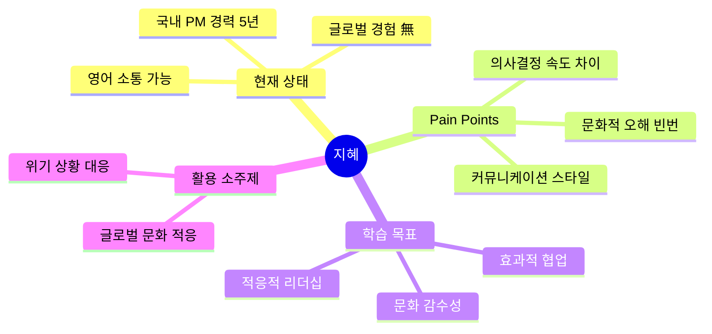
```mermaid
mindmap
  root((지혜))
    현재 상태
      국내 PM 경력 5년
      글로벌 경험 無
      영어 소통 가능
    Pain Points
      문화적 오해 빈번
      의사결정 속도 차이
      커뮤니케이션 스타일
    학습 목표
      문화 감수성
      적응적 리더십
      효과적 협업
    활용 소주제
      글로벌 문화 적응
      위기 상황 대응
```

**유저 시나리오 - 글로벌 프로젝트 착수:**

```
Week 1: 킥오프 미팅
- 시나리오: "미국-한국-독일 팀과 신규 프로젝트"
- 가상 환경: 각국 팀원 3-4명 (AI 캐릭터)
- 첫 화상회의 시뮬레이션

미팅 중:
- 미국 팀원(Jake): "Let's move fast and break things"
- 한국 팀원(수진): "계획을 먼저 세밀하게..."
- 독일 팀원(Klaus): "프로세스 문서가 필요합니다"
- 지혜가 중재 및 방향 제시 필요

AI 반응 시스템:
- 지혜의 발언에 따라 각 캐릭터 반응 변화
- Jake: 빠른 결정 선호 → 지연시 불만 표시
- 수진: 안정성 중시 → 급진적 변화에 저항
- Klaus: 규칙 준수 → 무계획 진행시 협조 거부

Week 2-3: 갈등 발생
- 일정 지연 이슈
- 문화적 오해로 인한 긴장
- 각 팀원의 불만 AI가 현실적으로 표현
- 지혜의 해결 시도

Week 4: 해결과 성장
- 여러 시도를 통한 조율
- 문화 차이 이해 및 극복
- 프로젝트 진행 정상화

최종 보고서:
- "초기 3번의 미팅에서 문화 충돌 발생"
- "4번째 시도에서 각 팀의 강점 활용 전략 성공"
- "학습한 스킬: 경청, 맥락 파악, 유연한 의사결정"
- "실제 글로벌 프로젝트 가이드라인"
```

---

### 👤 페르소나 3: 현우 (42세, 경영 컨설턴트)

**프로필:**
- 직업: 프리랜서 컨설턴트
- 특징: 이론은 풍부하지만 실전 위기 대응 경험 필요
- 고민: "클라이언트 위기 상황에서 빠른 판단이 어렵다"

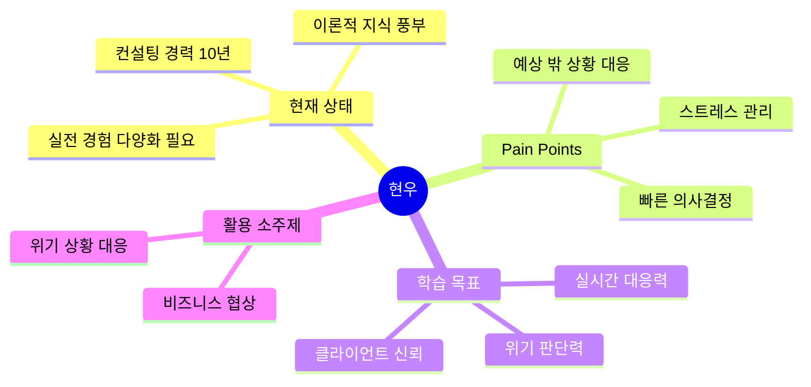
```mermaid
mindmap
  root((현우))
    현재 상태
      컨설팅 경력 10년
      이론적 지식 풍부
      실전 경험 다양화 필요
    Pain Points
      예상 밖 상황 대응
      빠른 의사결정
      스트레스 관리
    학습 목표
      위기 판단력
      실시간 대응력
      클라이언트 신뢰
    활용 소주제
      위기 상황 대응
      비즈니스 협상
```

**유저 시나리오 - 클라이언트 위기 대응:**

```
Hour 0: 위기 시작 (시뮬레이션 시작)
- 전화 벨: "긴급! 시스템 다운, 고객 불만 폭주"
- 클라이언트 CEO (AI): "당장 해결책을 내놓으시오!"
- 현우는 30분 안에 초기 대응 계획 수립 필요

Hour 1: 정보 수집
- 여러 이해관계자와 대화 (모두 AI)
  - CTO: "서버 과부하입니다"
  - 고객센터: "전화가 폭주하고 있습니다"
  - CFO: "매출 손실이 시간당 5천만원입니다"
- 현우가 질문하고 우선순위 결정

Hour 2-4: 솔루션 실행
- 여러 선택지 중 결정
  1) 서버 증설 (비용↑, 시간↓)
  2) 트래픽 제한 (비용↓, 고객 불만↑)
  3) 임시 공지 (시간벌기)
- 각 선택에 따른 AI 반응과 결과 실시간 전개

Hour 5-8: 사후 관리
- 위기 해결 후 평판 관리
- 재발 방지 대책 수립
- 클라이언트 신뢰 회복

최종 보고서:
- "총 소요 시간: 6시간 (목표: 4시간)"
- "최적 선택: 3번 시도에서 발견"
- "강점: 체계적 접근, 이해관계자 관리"
- "개선 영역: 초기 판단 속도, 스트레스 대응"
- "실전 위기 대응 매뉴얼"
```

---

## AI-LLM 3단계 시스템

### 🏗️ 1단계: 가상환경 구축 AI

**목적:** 안정적이고 일관성 있는 시뮬레이션 환경 생성

#### 시스템 구조

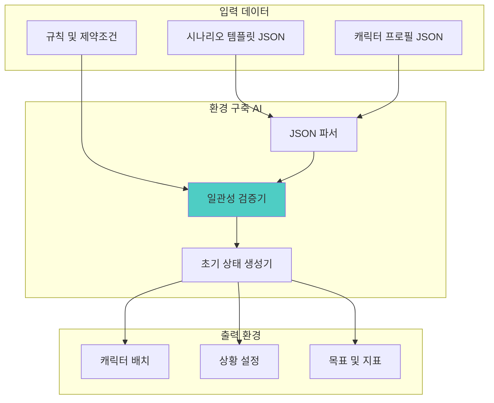
```mermaid
graph TB
    subgraph "입력 데이터"
        A1[시나리오 템플릿 JSON]
        A2[캐릭터 프로필 JSON]
        A3[규칙 및 제약조건]
    end
    
    subgraph "환경 구축 AI"
        B1[JSON 파서]
        B2[일관성 검증기]
        B3[초기 상태 생성기]
    end
    
    subgraph "출력 환경"
        C1[캐릭터 배치]
        C2[상황 설정]
        C3[목표 및 지표]
    end
    
    A1 --> B1
    A2 --> B1
    A3 --> B2
    
    B1 --> B2
    B2 --> B3
    
    B3 --> C1
    B3 --> C2
    B3 --> C3
    
    style B2 fill:#4ECDC4
```

#### JSON 시나리오 구조 예시

**비즈니스 협상 - 투자 유치 시나리오:**

```json
{
  "scenario_id": "investment_pitch_001",
  "scenario_name": "시리즈 A 투자 유치",
  "difficulty": "intermediate",
  "estimated_duration": "60-90분",
  
  "initial_context": {
    "company_valuation": 5000000000,
    "investment_target": 1000000000,
    "equity_offer": "15-20%",
    "runway": "6개월",
    "monthly_burn": 50000000
  },
  
  "npc_characters": [
    {
      "character_id": "investor_conservative_001",
      "name": "박성준",
      "role": "시니어 파트너, VC펀드",
      "personality": {
        "type": "보수적",
        "traits": ["데이터 중시", "리스크 회피", "꼼꼼함"],
        "decision_style": "느림",
        "trust_threshold": 0.7
      },
      "initial_stance": {
        "interest_level": 0.4,
        "concern_areas": ["시장 규모", "경쟁 우위", "수익 모델"],
        "positive_triggers": ["명확한 데이터", "차별화 전략", "경험 있는 팀"],
        "negative_triggers": ["모호한 답변", "과장된 주장", "준비 부족"]
      },
      "dialogue_patterns": {
        "opening": "자료를 먼저 보겠습니다. 시장 분석 부분이 궁금하네요.",
        "questioning_style": "구체적이고 날카로운 질문",
        "positive_feedback": "점진적으로 관심 표현",
        "negative_feedback": "회의적 표정과 추가 질문"
      }
    },
    {
      "character_id": "investor_aggressive_001",
      "name": "김서연",
      "role": "파트너, 성장형 펀드",
      "personality": {
        "type": "공격적",
        "traits": ["빠른 결정", "직관 중시", "도전적"],
        "decision_style": "빠름",
        "trust_threshold": 0.5
      },
      "initial_stance": {
        "interest_level": 0.6,
        "concern_areas": ["성장 속도", "스케일", "비전"],
        "positive_triggers": ["대담한 목표", "빠른 성장", "혁신성"],
        "negative_triggers": ["보수적 계획", "느린 진행", "방어적 태도"]
      }
    }
  ],
  
  "scenario_stages": [
    {
      "stage": 1,
      "name": "초기 피칭",
      "duration": "15-20분",
      "objectives": [
        "회사 소개 완료",
        "투자자 기본 관심 확보",
        "주요 질문 3개 이상 받기"
      ],
      "success_criteria": {
        "min_interest_level": 0.5,
        "required_topics_covered": ["문제 정의", "솔루션", "시장"]
      }
    },
    {
      "stage": 2,
      "name": "심화 질의응답",
      "duration": "20-30분",
      "objectives": [
        "우려사항 해소",
        "경쟁 우위 입증",
        "재무 계획 설명"
      ],
      "success_criteria": {
        "min_interest_level": 0.65,
        "concerns_addressed": 2
      }
    },
    {
      "stage": 3,
      "name": "조건 협상",
      "duration": "20-30분",
      "objectives": [
        "밸류에이션 합의",
        "지분율 협상",
        "이사회 구성 논의"
      ],
      "success_criteria": {
        "deal_reached": true,
        "acceptable_terms": true
      }
    }
  ],
  
  "branching_logic": {
    "good_preparation": {
      "condition": "자료 완비 + 명확한 답변",
      "outcome": "투자자 관심도 +20%, 빠른 진행"
    },
    "poor_communication": {
      "condition": "모호한 답변 3회 이상",
      "outcome": "투자자 관심도 -30%, 미팅 조기 종료 위험"
    },
    "emotional_reaction": {
      "condition": "방어적 태도 or 공격적 반응",
      "outcome": "신뢰도 -40%, 협상 결렬"
    }
  },
  
  "metrics_tracking": [
    "투자자 관심도",
    "신뢰 지수",
    "답변 품질",
    "협상 진행도",
    "시간 관리"
  ]
}
```

#### 환경 안정화 전략

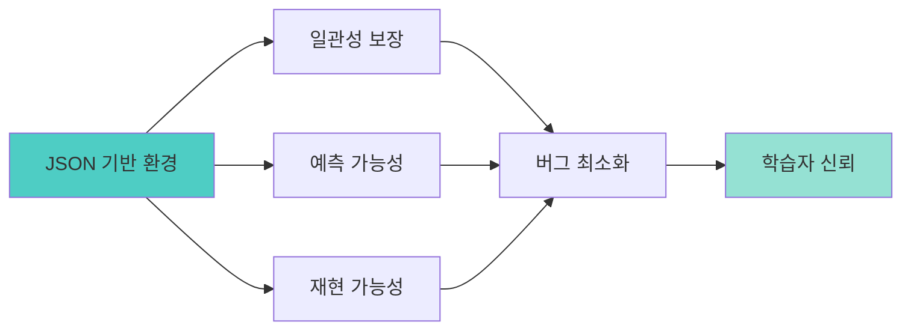
```mermaid
graph LR
    A[JSON 기반 환경] --> B[일관성 보장]
    A --> C[예측 가능성]
    A --> D[재현 가능성]
    
    B --> E[버그 최소화]
    C --> E
    D --> E
    
    E --> F[학습자 신뢰]
    
    style A fill:#4ECDC4
    style F fill:#95E1D3
```

**핵심 장점:**
- ✅ 사전 정의된 시나리오로 안정성 확보
- ✅ 버전 관리 및 업데이트 용이
- ✅ 다양한 난이도 조절 가능
- ✅ A/B 테스트 및 개선 가능

---

### 🎭 2단계: 반응 생성 AI (핵심 시스템)

**목적:** 현실감 있고 일관된 NPC 및 상황 반응 실시간 생성

#### 시스템 구조

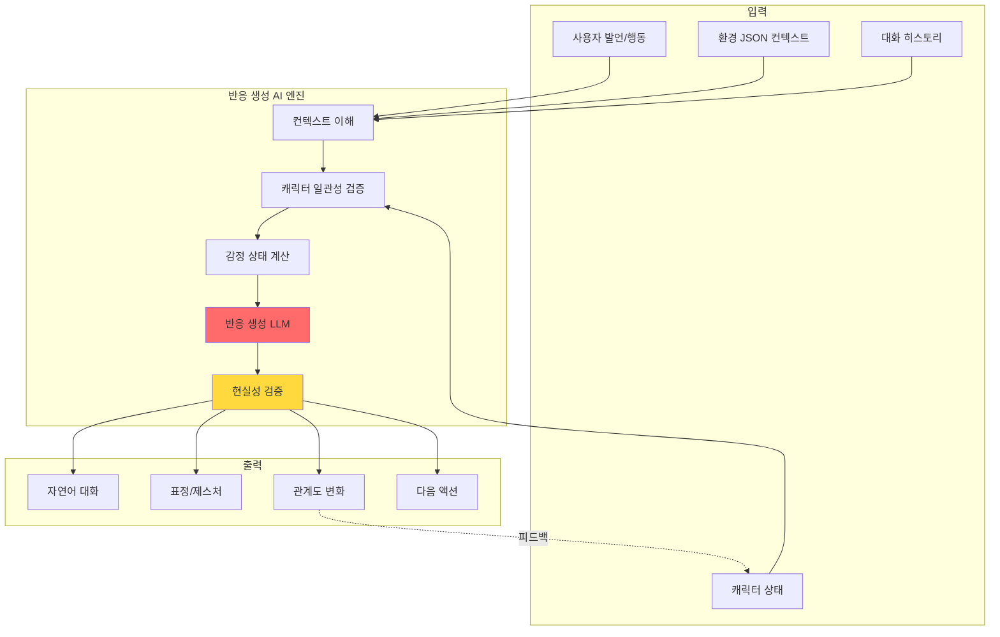
```mermaid
graph TB
    subgraph "입력"
        I1[사용자 발언/행동]
        I2[환경 JSON 컨텍스트]
        I3[캐릭터 상태]
        I4[대화 히스토리]
    end
    
    subgraph "반응 생성 AI 엔진"
        P1[컨텍스트 이해]
        P2[캐릭터 일관성 검증]
        P3[감정 상태 계산]
        P4[반응 생성 LLM]
        P5[현실성 검증]
    end
    
    subgraph "출력"
        O1[자연어 대화]
        O2[표정/제스처]
        O3[관계도 변화]
        O4[다음 액션]
    end
    
    I1 --> P1
    I2 --> P1
    I3 --> P2
    I4 --> P1
    
    P1 --> P2
    P2 --> P3
    P3 --> P4
    P4 --> P5
    
    P5 --> O1
    P5 --> O2
    P5 --> O3
    P5 --> O4
    
    O3 -.피드백.-> I3
    
    style P4 fill:#FF6B6B
    style P5 fill:#FFD93D
```

#### 현실감 있는 반응 생성 프로세스

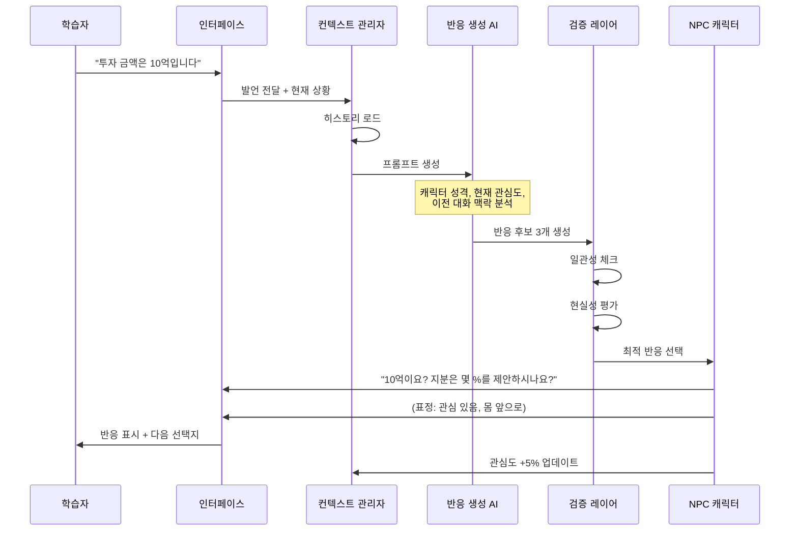
```mermaid
sequenceDiagram
    participant User as 학습자
    participant UI as 인터페이스
    participant Context as 컨텍스트 관리자
    participant LLM as 반응 생성 AI
    participant Validator as 검증 레이어
    participant NPC as NPC 캐릭터
    
    User->>UI: "투자 금액은 10억입니다"
    UI->>Context: 발언 전달 + 현재 상황
    Context->>Context: 히스토리 로드
    Context->>LLM: 프롬프트 생성
    
    Note over LLM: 캐릭터 성격, 현재 관심도,<br/>이전 대화 맥락 분석
    
    LLM->>Validator: 반응 후보 3개 생성
    Validator->>Validator: 일관성 체크
    Validator->>Validator: 현실성 평가
    Validator->>NPC: 최적 반응 선택
    
    NPC->>UI: "10억이요? 지분은 몇 %를 제안하시나요?"
    NPC->>UI: (표정: 관심 있음, 몸 앞으로)
    UI->>User: 반응 표시 + 다음 선택지
    
    NPC->>Context: 관심도 +5% 업데이트
```

#### 현실성 확보 메커니즘

**1. 캐릭터 일관성 유지**

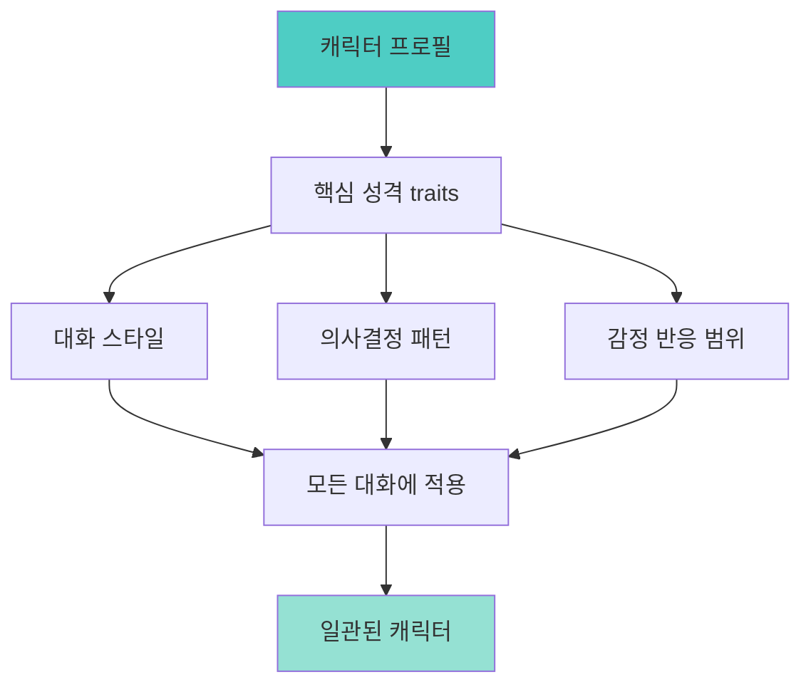
```mermaid
graph TB
    A[캐릭터 프로필] --> B[핵심 성격 traits]
    B --> C[대화 스타일]
    B --> D[의사결정 패턴]
    B --> E[감정 반응 범위]
    
    C --> F[모든 대화에 적용]
    D --> F
    E --> F
    
    F --> G[일관된 캐릭터]
    
    style A fill:#4ECDC4
    style G fill:#95E1D3
```

**예시: 보수적 투자자 캐릭터**

```
✅ 일관된 반응:
- 데이터 요청: "구체적인 숫자를 보여주시겠습니까?"
- 위험 회피: "만약 시장이 침체되면 어떻게 대응하실 건가요?"
- 신중한 결정: "좀 더 검토가 필요할 것 같습니다"

❌ 비일관적 반응 (시스템이 방지):
- 갑자기 공격적: "당장 투자하겠습니다!"
- 성격 변화: "데이터는 중요하지 않아요"
```

**2. 감정 상태 시뮬레이션**

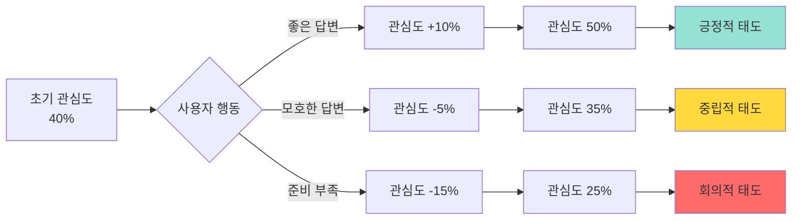
```mermaid
graph LR
    A[초기 관심도<br/>40%] --> B{사용자 행동}
    
    B -->|좋은 답변| C[관심도 +10%]
    B -->|모호한 답변| D[관심도 -5%]
    B -->|준비 부족| E[관심도 -15%]
    
    C --> F[관심도 50%]
    D --> G[관심도 35%]
    E --> H[관심도 25%]
    
    F --> I[긍정적 태도]
    G --> J[중립적 태도]
    H --> K[회의적 태도]
    
    style I fill:#95E1D3
    style J fill:#FFD93D
    style K fill:#FF6B6B
```

**3. 다층적 반응 생성**

| 레이어 | 설명 | 예시 |
|--------|------|------|
| **언어적 반응** | 실제 대화 내용 | "흥미롭군요. 시장 규모는 얼마나 되나요?" |
| **비언어적 반응** | 표정, 제스처, 목소리 톤 | 표정: 약간 관심, 몸: 앞으로 기울임 |
| **내부 상태 변화** | 보이지 않는 지표 업데이트 | 관심도 45→50%, 신뢰도 30→35% |
| **행동 변화** | 다음 액션에 영향 | 추가 질문 준비, 미팅 연장 제안 |

#### 프롬프트 엔지니어링 전략

**시스템 프롬프트 구조:**

```
당신은 {캐릭터 이름}, {역할}입니다.

### 성격 및 특성:
- 핵심 성격: {personality_type}
- 주요 traits: {traits}
- 의사결정 스타일: {decision_style}
- 현재 감정 상태: {current_emotion}

### 현재 상황:
- 미팅 진행도: {stage}
- 관심도 지수: {interest_level}/100
- 신뢰도 지수: {trust_level}/100
- 주요 우려사항: {concerns}

### 대화 히스토리:
{conversation_history}

### 방금 학습자의 발언:
"{user_input}"

### 응답 지침:
1. 당신의 성격에 맞게 일관되게 반응하세요
2. 현재 관심도와 신뢰도를 고려하세요
3. 현실적인 투자자처럼 행동하세요
4. 구체적이고 날카로운 질문을 하세요
5. 50단어 이내로 간결하게 답하세요

이제 {캐릭터 이름}으로서 자연스럽게 반응하세요.
```

**동적 프롬프트 조정:**

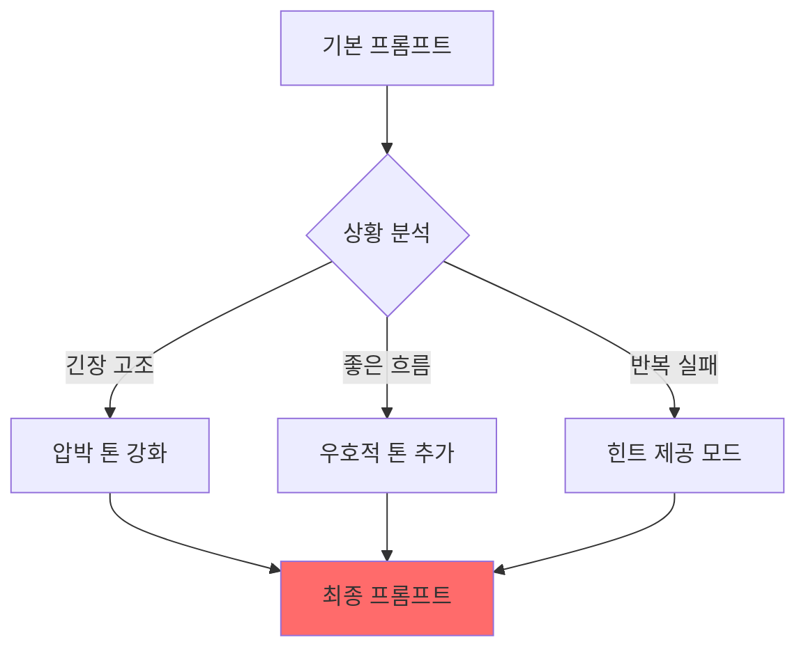
```mermaid
graph TB
    A[기본 프롬프트] --> B{상황 분석}
    
    B -->|긴장 고조| C[압박 톤 강화]
    B -->|좋은 흐름| D[우호적 톤 추가]
    B -->|반복 실패| E[힌트 제공 모드]
    
    C --> F[최종 프롬프트]
    D --> F
    E --> F
    
    style F fill:#FF6B6B
```

---

### 📊 3단계: 최종 보고서 AI

**목적:** 학습자의 행동 패턴 분석 및 개선 방향 제시

#### 시스템 구조

```mermaid
graph TB
    subgraph "데이터 수집"
        D1[대화 로그]
        D2[의사결정 기록]
        D3[시간 데이터]
        D4[감정 변화 추적]
    end
    
    subgraph "분석 엔진"
        A1[패턴 인식 AI]
        A2[강점/약점 분석]
        A3[비교 분석]
        A4[인사이트 도출]
    end
    
    subgraph "보고서 생성"
        R1[요약 대시보드]
        R2[상세 분석]
        R3[개선 제안]
        R4[다음 단계]
    end
    
    D1 --> A1
    D2 --> A1
    D3 --> A1
    D4 --> A1
    
    A1 --> A2
    A2 --> A3
    A3 --> A4
    
    A4 --> R1
    A4 --> R2
    A4 --> R3
    A4 --> R4
    
    style A4 fill:#95E1D3
```

#### 보고서 구성 요소

**1. 퍼포먼스 대시보드**

```mermaid
graph LR
    subgraph "핵심 지표"
        M1[목표 달성도<br/>75%]
        M2[평균 시도 횟수<br/>4.2회]
        M3[의사결정 속도<br/>중상]
        M4[NPC 만족도<br/>68점]
    end
    
    subgraph "평가"
        E1[전체: B+]
    end
    
    M1 --> E1
    M2 --> E1
    M3 --> E1
    M4 --> E1
    
    style E1 fill:#95E1D3
```

**2. 행동 패턴 분석**

```mermaid
graph TB
    A[학습자 행동] --> B[데이터 수집]
    
    B --> C1[협상 스타일]
    B --> C2[의사결정 패턴]
    B --> C3[스트레스 반응]
    B --> C4[학습 곡선]
    
    C1 --> D1[협력적 70%<br/>경쟁적 30%]
    C2 --> D2[분석형<br/>평균 3.5분/결정]
    C3 --> D3[중압감에 방어적]
    C4 --> D4[빠른 적응력]
    
    style D1 fill:#FFD93D
    style D2 fill:#FFD93D
    style D3 fill:#FF6B6B
    style D4 fill:#95E1D3
```

**3. 강점 및 개선 영역**

| 영역 | 강점 | 개선 필요 | 구체적 제안 |
|------|------|----------|------------|
| **커뮤니케이션** | 명확한 의사 전달<br/>경청 능력 우수 | 압박 상황에서 말이 빨라짐 | 긴장 시 3초 호흡 후 답변 |
| **협상 전략** | 데이터 기반 설득<br/>논리적 접근 | 감정적 대응 부족 | 공감 표현 연습 필요 |
| **의사결정** | 신중한 판단 | 결정 속도 느림 | 80% 확신에서 결정 훈련 |
| **위기 대응** | 체계적 접근 | 초기 반응 지연 | 위기 체크리스트 사전 준비 |

**4. 타임라인 분석**

```mermaid
gantt
    title 학습자 시도별 성과 변화
    dateFormat  X
    axisFormat %s
    
    section 1차 시도
    실패(관심도 30%) :done, 0, 1
    
    section 2차 시도
    실패(관심도 45%) :done, 1, 2
    
    section 3차 시도
    부분 성공(관심도 60%) :active, 2, 3
    
    section 4차 시도
    성공(관심도 75%) :crit, 3, 4
```

**5. AI 생성 인사이트**

```
🎯 핵심 발견:

1. 당신의 협상 스타일: "분석형 협력자"
   - 데이터와 논리를 중시하며, 상대방과 윈-윈을 추구합니다.
   - 이는 장기적 관계 구축에 유리하지만, 빠른 결단이 필요한 상황에서는
     기회를 놓칠 수 있습니다.

2. 성장 패턴:
   - 1-2차 시도: 준비 부족으로 투자자 우려사항 파악 실패
   - 3차 시도: 경쟁사 분석 추가 후 관심도 급상승 (45%→60%)
   - 4차 시도: 감정적 공감 추가로 신뢰 확보 성공
   
   → 학습 속도가 빠르며, 피드백을 잘 흡수합니다.

3. 실전 활용 팁:
   ✅ 미팅 전 상대방의 관심사 3가지 사전 조사
   ✅ 데이터 + 스토리 결합 (현재는 데이터 80%, 스토리 20%)
   ✅ 첫 5분에 핵심 메시지 전달 (현재 15분 소요)

4. 다음 추천 시나리오:
   📌 "어려운 투자자와의 협상" (난이도 상)
   📌 "복수 투자자 동시 관리" (복잡도 상)
```

**6. 비교 분석 (선택적)**

```mermaid
graph LR
    subgraph "당신의 성과"
        Y1[평균 시도: 4.2회]
        Y2[성공률: 75%]
        Y3[시간: 72분]
    end
    
    subgraph "상위 10% 학습자"
        T1[평균 시도: 3.1회]
        T2[성공률: 90%]
        T3[시간: 58분]
    end
    
    subgraph "평균 학습자"
        A1[평균 시도: 5.8회]
        A2[성공률: 65%]
        A3[시간: 95분]
    end
    
    Y1 -.-> T1
    Y1 -.-> A1
    
    style Y1 fill:#FFD93D
    style T1 fill:#95E1D3
    style A1 fill:#FF6B6B
```

#### 보고서 생성 프로세스

```mermaid
sequenceDiagram
    participant User as 학습자
    participant Sim as 시뮬레이션
    participant Logger as 데이터 로거
    participant Analyzer as 분석 AI
    participant Report as 보고서 생성기
    
    User->>Sim: 시뮬레이션 시작
    loop 시뮬레이션 진행
        Sim->>Logger: 모든 행동 기록
        Logger->>Logger: 타임스탬프, 컨텍스트 저장
    end
    
    User->>Sim: 시나리오 완료
    Sim->>Analyzer: 데이터 전달
    
    Analyzer->>Analyzer: 패턴 분석
    Analyzer->>Analyzer: 강점/약점 도출
    Analyzer->>Analyzer: 인사이트 생성
    
    Analyzer->>Report: 분석 결과 전달
    Report->>Report: 시각화 생성
    Report->>Report: 자연어 보고서 작성
    
    Report->>User: 최종 보고서 제공
    
    Note over User,Report: 평균 생성 시간: 30-60초
```

---

## 개발 프로세스 로드맵

### 🗺️ 전체 개발 흐름

```mermaid
graph TB
    Start[프로젝트 시작] --> Phase1[Phase 1: 기획]
    Phase1 --> Phase2[Phase 2: AI 시스템 구축]
    Phase2 --> Phase3[Phase 3: 프론트엔드 개발]
    Phase3 --> Phase4[Phase 4: 통합 및 테스트]
    Phase4 --> Phase5[Phase 5: 파일럿 런칭]
    Phase5 --> Phase6[Phase 6: 개선 및 확장]
    
    style Phase2 fill:#FF6B6B
    style Phase4 fill:#FFD93D
    style Phase5 fill:#95E1D3
```

### 📅 Phase 1: 기획 및 설계 (4주)

```mermaid
gantt
    title Phase 1 상세 일정
    dateFormat  YYYY-MM-DD
    
    section 시나리오 설계
    3대 소주제 기획       :a1, 2025-01-01, 1w
    JSON 구조 설계        :a2, after a1, 1w
    캐릭터 프로필 작성    :a3, after a1, 1w
    
    section 페르소나 개발
    사용자 리서치         :b1, 2025-01-01, 1w
    페르소나 정의         :b2, after b1, 1w
    유저 시나리오 작성    :b3, after b2, 1w
    
    section 기술 설계
    시스템 아키텍처       :c1, 2025-01-08, 2w
    AI 모델 선정          :c2, 2025-01-08, 1w
    데이터 구조 설계      :c3, after c2, 1w
```

**주요 산출물:**
- ✅ 3대 소주제별 시나리오 문서 (각 50페이지 이상)
- ✅ JSON 템플릿 10개 이상 (시나리오별)
- ✅ 캐릭터 프로필 30개 이상
- ✅ 페르소나 5개 + 유저 시나리오 15개
- ✅ 시스템 아키텍처 설계서

---

### 🤖 Phase 2: AI 시스템 구축 (8주)

#### Week 1-2: 가상환경 구축 AI

```mermaid
graph TB
    W1[Week 1-2] --> T1[JSON 파서 개발]
    W1 --> T2[검증 로직 구현]
    W1 --> T3[초기 상태 생성]
    
    T1 --> Test1[단위 테스트]
    T2 --> Test1
    T3 --> Test1
    
    Test1 --> Output1[10개 시나리오 로딩 성공]
    
    style W1 fill:#4ECDC4
```

**개발 작업:**
1. JSON 스키마 정의 및 검증기 구현
2. 캐릭터 로더 및 초기화 시스템
3. 시나리오 상태 관리자
4. 환경 일관성 체크 로직

**테스트 기준:**
- ✅ 모든 JSON 정상 로딩
- ✅ 캐릭터 상태 초기화 정확도 100%
- ✅ 환경 재현 가능성 확보

#### Week 3-5: 반응 생성 AI (핵심)

```mermaid
graph TB
    W3[Week 3-5] --> T1[LLM 통합]
    W3 --> T2[프롬프트 엔지니어링]
    W3 --> T3[컨텍스트 관리]
    W3 --> T4[일관성 검증]
    
    T1 --> Sub1[GPT-4 API 연동]
    T2 --> Sub2[동적 프롬프트 생성]
    T3 --> Sub3[대화 히스토리 관리]
    T4 --> Sub4[캐릭터 일관성 체크]
    
    Sub1 --> Test[통합 테스트]
    Sub2 --> Test
    Sub3 --> Test
    Sub4 --> Test
    
    Test --> Output[현실적 반응 생성 성공]
    
    style W3 fill:#FF6B6B
```

**개발 작업:**
1. **Week 3: 기본 LLM 통합**
   - OpenAI API 연동
   - 기본 프롬프트 템플릿 구축
   - 응답 파싱 시스템

2. **Week 4: 컨텍스트 관리 시스템**
   - 대화 히스토리 저장 및 로드
   - 캐릭터 상태 추적
   - 감정 지수 계산 로직
   - 토큰 최적화 (긴 대화 압축)

3. **Week 5: 고급 기능**
   - 동적 프롬프트 조정
   - 다중 캐릭터 동시 반응
   - 현실성 검증 레이어
   - 응답 캐싱 시스템

**품질 기준:**
- ✅ 캐릭터 일관성 유지율 95% 이상
- ✅ 응답 생성 속도 2초 이내
- ✅ 컨텍스트 정확도 90% 이상
- ✅ 테스터 현실감 평가 4점 이상 (5점 만점)

#### Week 6-8: 보고서 AI

```mermaid
graph TB
    W6[Week 6-8] --> T1[데이터 수집]
    W6 --> T2[패턴 분석]
    W6 --> T3[인사이트 생성]
    W6 --> T4[시각화]
    
    T1 --> D1[로깅 시스템]
    T2 --> D2[분석 알고리즘]
    T3 --> D3[AI 텍스트 생성]
    T4 --> D4[차트/그래프]
    
    D1 --> Final[보고서 생성기]
    D2 --> Final
    D3 --> Final
    D4 --> Final
    
    style W6 fill:#95E1D3
```

**개발 작업:**
1. **Week 6: 데이터 파이프라인**
   - 실시간 로깅 시스템
   - 데이터베이스 설계 (PostgreSQL)
   - 이벤트 추적 시스템

2. **Week 7: 분석 엔진**
   - 행동 패턴 분석 알고리즘
   - 강점/약점 도출 로직
   - 비교 분석 시스템

3. **Week 8: 보고서 생성**
   - LLM 기반 인사이트 생성
   - 자동 시각화 (D3.js/Chart.js)
   - PDF 출력 기능

---

### 💻 Phase 3: 프론트엔드 개발 (6주)

```mermaid
graph TB
    UI[프론트엔드] --> C1[대시보드]
    UI --> C2[시뮬레이션 뷰]
    UI --> C3[보고서 뷰]
    
    C1 --> F1[시나리오 선택]
    C1 --> F2[진행 상황]
    
    C2 --> F3[대화 인터페이스]
    C2 --> F4[실시간 피드백]
    C2 --> F5[선택지 UI]
    
    C3 --> F6[대시보드]
    C3 --> F7[상세 분석]
    C3 --> F8[다운로드]
    
    style C2 fill:#FF6B6B
```

**기술 스택:**
- React + TypeScript
- Tailwind CSS
- Zustand (상태 관리)
- React Query (데이터 fetching)
- Framer Motion (애니메이션)

**주요 화면:**

1. **메인 대시보드**
   - 소주제 선택
   - 진행 상황 표시
   - 추천 시나리오

2. **시뮬레이션 화면** (가장 중요)
   - 채팅형 인터페이스
   - NPC 표정/상태 표시
   - 실시간 관심도 지표
   - 선택지 또는 자유 입력
   - 되돌리기/힌트 기능

3. **보고서 화면**
   - 인터랙티브 차트
   - 타임라인 뷰
   - AI 인사이트 하이라이트
   - PDF 다운로드

---

### 🔧 Phase 4: 통합 및 테스트 (4주)

```mermaid
graph LR
    A[통합 테스트] --> B[시나리오 테스트]
    A --> C[AI 품질 테스트]
    A --> D[사용성 테스트]
    
    B --> E[10개 시나리오 완료]
    C --> F[반응 현실성 검증]
    D --> G[UX 개선]
    
    E --> H[버그 수정]
    F --> H
    G --> H
    
    H --> I[릴리즈 준비]
    
    style A fill:#FFD93D
```

**테스트 항목:**

1. **기능 테스트**
   - [ ] 모든 시나리오 정상 로딩
   - [ ] AI 반응 생성 안정성
   - [ ] 보고서 생성 정확도
   - [ ] 데이터 저장/로드

2. **AI 품질 테스트**
   - [ ] 캐릭터 일관성 검증 (30회 이상 대화)
   - [ ] 현실성 평가 (10명 테스터)
   - [ ] 응답 속도 측정
   - [ ] 엣지 케이스 처리

3. **사용자 테스트**
   - [ ] 5명 알파 테스터 참여
   - [ ] 완료율 측정
   - [ ] 만족도 설문
   - [ ] UX 개선사항 도출

---

### 🚀 Phase 5: 파일럿 런칭 (2주)

```mermaid
graph TB
    Launch[파일럿 시작] --> U1[20명 베타 테스터]
    
    U1 --> M1[데이터 수집]
    U1 --> M2[피드백 수집]
    U1 --> M3[버그 리포트]
    
    M1 --> A[분석]
    M2 --> A
    M3 --> A
    
    A --> I[개선 작업]
    I --> V2[Version 2.0]
    
    style Launch fill:#95E1D3
```

**목표:**
- ✅ 20명 이상 완주율 70% 이상
- ✅ 평균 만족도 4.0 이상
- ✅ 치명적 버그 0건
- ✅ AI 현실성 평가 3.8 이상

---

### 🔄 Phase 6: 개선 및 확장 (지속)

```mermaid
graph LR
    V1[Version 1.0] --> F1[피드백 수집]
    F1 --> A1[분석]
    A1 --> I1[개선]
    I1 --> V2[Version 2.0]
    
    V2 --> E1[시나리오 추가]
    V2 --> E2[기능 확장]
    V2 --> E3[AI 고도화]
    
    style V2 fill:#4ECDC4
```

**확장 방향:**
1. 시나리오 다양화 (난이도, 업종별)
2. 멀티플레이어 모드 (협업 시뮬레이션)
3. 음성 인터페이스
4. VR/AR 통합

---

## 유저 시나리오 상세

### 📖 시나리오 1: 민준의 투자 유치 여정

#### 전체 여정 맵

```mermaid
journey
    title 민준의 투자 유치 시뮬레이션 여정
    section 준비
      시나리오 선택: 5: 민준
      초기 설정: 4: 민준
      가이드 읽기: 3: 민준
    section 첫 시도
      미팅 시작: 4: 민준
      질문 답변: 2: 민준
      실패: 1: 민준
    section 학습
      피드백 확인: 5: 민준
      전략 수정: 4: 민준
    section 재도전
      두 번째 시도: 4: 민준
      개선된 답변: 4: 민준
      부분 성공: 3: 민준
    section 성공
      최종 시도: 5: 민준
      목표 달성: 5: 민준
      보고서 확인: 5: 민준
```

#### 상세 타임라인

**Day 1 - Morning: 시작**

```
09:00 - 플랫폼 로그인
민준: "오늘은 투자 유치 연습을 해봐야겠어"

09:05 - 시나리오 선택
[화면: 3개 시나리오 카드]
1. 시리즈 A 투자 유치 ⭐ 추천
2. 엔젤 투자자 미팅
3. 액셀러레이터 피칭

민준: 1번 선택

09:10 - 초기 설정
[AI 환경 구축 시작]
✓ 시나리오 로딩...
✓ 투자자 캐릭터 생성...
✓ 초기 상태 설정...

[화면 표시]
회사 정보:
- 가치 평가: 50억
- 투자 희망: 10억
- 지분 제시: 15-20%
- 현재 런웨이: 6개월

투자자 정보:
👤 박성준 (보수적 투자자)
- 경력: 15년, 시니어 파트너
- 관심 분야: 에듀테크, B2B SaaS
- 초기 관심도: ●●○○○ (40%)

09:15 - 미팅 시작
```

**시뮬레이션 진행 (첫 시도):**

```
[화면: 회의실 배경, 박성준 아바타]

박성준: "안녕하세요. 자료는 받아봤습니다. 
         먼저 시장 규모부터 설명해주시겠습니까?"

[민준의 선택지]
1. "한국 에듀테크 시장은 작년 기준..."
2. "글로벌 시장으로 보면..."
3. "정확한 숫자는 자료에 있습니다만..."
4. [직접 입력]

민준: 3번 선택

박성준: [표정: 실망]
"자료는 제가 보고 있습니다. 구체적인 숫자를 
말씀해주실 수 있으신가요?"

[관심도: 40% → 35%]
[힌트 표시: "구체적인 데이터 제시 필요"]

민준: [당황하며 답변 시도]
"아... 그러니까... 대략 1조 정도..."

박성준: [표정: 회의적]
"'대략'이라는 표현이 많으시네요. 
경쟁사는 어떻게 대응하고 계신가요?"

[관심도: 35% → 30%]
[경고: 미팅 조기 종료 위험]

민준: [계속 답변하지만 준비 부족 노출]

20분 후...

박성준: "죄송하지만 내부 검토 후 
다시 연락드리겠습니다."

[시뮬레이션 종료]
[결과: 실패 - 관심도 25%]
```

**즉시 피드백:**

```
💡 AI 중간 리포트

실패 원인 분석:
1. 준비 부족 (70% 원인)
   - 구체적 시장 데이터 미제시
   - 경쟁사 분석 부족
   - "대략", "아마" 등 모호한 표현 다수

2. 커뮤니케이션 (20% 원인)
   - 자신감 부족이 전달됨
   - 질문에 방어적 태도

3. 타이밍 (10% 원인)
   - 핵심 강점을 너무 늦게 언급

개선 제안:
✅ 시장 규모, 성장률, 경쟁사 데이터 준비
✅ 첫 5분에 핵심 메시지 전달
✅ "구체적 숫자 + 출처" 패턴 사용

다음 액션:
[재시도] [자료 보강 후 재시도] [다른 시나리오]
```

**Day 1 - Afternoon: 두 번째 시도**

```
14:00 - 재시작 (자료 보강 완료)

민준: "이번엔 데이터를 준비했어"

[시뮬레이션 재시작]
박성준: "안녕하세요. 시장 규모부터..."

민준: [준비된 답변]
"한국 에듀테크 시장은 2024년 기준 1.2조원,
연평균 15% 성장 중입니다. (출처: 교육부)
특히 저희가 타겟하는 B2B 세그먼트는..."

박성준: [표정: 관심]
"구체적이네요. 그럼 경쟁사는?"

[관심도: 40% → 50%]

민준: [자신감 있게]
"주요 경쟁사는 A사, B사이며,
저희는 이러한 차별점이 있습니다..."

[대화 계속... 40분 경과]

박성준: "흥미롭습니다. 재무 계획을 보고 싶은데요."

민준: [재무 데이터 제시]

박성준: "투자 후 18개월 안에 시리즈 B가 
가능할 것 같습니까?"

민준: "저희 시뮬레이션으로는..."

[결과: 부분 성공 - 관심도 65%]
[다음 미팅 약속 확보]
```

**Day 2: 최종 협상 (세 번째 시도)**

```
[이전 시도의 학습 반영]

박성준: "밸류에이션 50억이 높다고 생각합니다.
40억은 어떻습니까?"

민준: [협상 전략]
"시장 데이터를 다시 보시면...
유사 기업 평가는...
따라서 45억이 합리적이라 생각합니다."

[협상 진행...]

[최종 결과: 성공]
- 합의 금액: 47억 밸류에이션
- 투자 유치: 10억
- 지분: 21.3%
- 관심도: 75%
```

**최종 보고서 (민준 수신):**

```
🎉 시뮬레이션 완료!

=== 전체 성과 ===
- 시도 횟수: 3회
- 최종 결과: 성공
- 소요 시간: 총 4.5시간
- 전체 평가: B+

=== 성장 과정 ===
1차: 실패 (준비 부족)
2차: 부분 성공 (데이터 보강)
3차: 성공 (협상 전략 추가)

[그래프: 시도별 관심도 변화]

=== 당신의 스타일 ===
"데이터 중심 설득형"
- 논리적이고 체계적인 접근
- 빠른 학습과 개선 능력
- 감정적 공감은 보완 필요

=== 실전 체크리스트 ===
✅ 시장 데이터 (규모, 성장률, 트렌드)
✅ 경쟁 분석 (차별점 명확히)
✅ 재무 계획 (3개년 시뮬레이션)
✅ 협상 범위 (최소-최대 조건)
✅ 대안 시나리오 (Plan B, C)

=== 다음 추천 ===
📌 "까다로운 투자자" 시나리오
📌 "복수 투자자 경쟁" 시나리오

[보고서 다운로드] [다음 시뮬레이션]
```

---

### 📖 시나리오 2: 지혜의 글로벌 프로젝트

#### 전체 여정 맵

```mermaid
journey
    title 지혜의 글로벌 협업 시뮬레이션
    section 킥오프
      팀 소개: 4: 지혜
      목표 설정: 3: 지혜
      첫 갈등: 2: 지혜
    section 위기
      문화 충돌: 2: 지혜
      일정 지연: 1: 지혜
      스트레스: 2: 지혜
    section 해결 시도
      개별 면담: 4: 지혜
      조율 노력: 4: 지혜
      타협점 모색: 4: 지혜
    section 돌파구
      통합 전략: 5: 지혜
      팀 화합: 5: 지혜
      프로젝트 진행: 5: 지혜
    section 완료
      목표 달성: 5: 지혜
      학습 정리: 5: 지혜
```

*[상세 내용은 민준 시나리오와 유사한 구조로 전개]*

---

## 성과 측정 및 평가

### 📊 학습 성과 지표

```mermaid
graph TB
    학습자 --> M1[완료율]
    학습자 --> M2[성장 속도]
    학습자 --> M3[최종 성취도]
    학습자 --> M4[만족도]
    
    M1 --> E1[70% 이상 목표]
    M2 --> E2[시도당 10% 개선]
    M3 --> E3[B등급 이상]
    M4 --> E4[4.0/5.0 이상]
    
    E1 --> F[전체 평가]
    E2 --> F
    E3 --> F
    E4 --> F
    
    style F fill:#95E1D3
```

### 🎯 교육 효과성 평가

| 지표 | 측정 방법 | 목표 | 실제 활용도 |
|------|----------|------|------------|
| **스킬 향상** | 전/후 비교 테스트 | 30% 이상 | 실전 적용률 측정 |
| **자신감** | 자가 평가 설문 | 4.0/5.0 | 실제 미팅 성공률 |
| **의사결정 속도** | 시뮬레이션 데이터 | 20% 단축 | 업무 효율성 |
| **문화 감수성** | 시나리오 점수 | 80점 이상 | 글로벌 협업 성과 |

### 🔄 지속적 개선 사이클

```mermaid
graph LR
    A[학습자 데이터] --> B[AI 분석]
    B --> C[패턴 발견]
    C --> D[시나리오 개선]
    D --> E[AI 모델 튜닝]
    E --> F[서비스 업데이트]
    F --> A
    
    style B fill:#4ECDC4
    style E fill:#FF6B6B
```

---

## 📝 결론 및 비전

### 🌟 핵심 가치

```mermaid
mindmap
  root((가상환경<br/>AI 교육))
    실전 경험
      안전한 실패
      무한 반복 학습
      즉각적 피드백
    몰입형 학습
      현실감 있는 시뮬레이션
      감정적 참여
      스토리 기반
    개인화 교육
      맞춤형 난이도
      개인별 분석
      성장 경로 제시
    확장 가능성
      다양한 분야 적용
      지속적 업데이트
      커뮤니티 학습
```

### 🚀 향후 발전 방향

1. **AI 고도화**
   - GPT-5 등 최신 모델 적용
   - 음성 및 표정 인식
   - 더 정교한 감정 시뮬레이션

2. **콘텐츠 확장**
   - 업종별 시나리오 (의료, 법률, 교육 등)
   - 난이도 세분화 (10단계 이상)
   - 멀티 엔딩 시나리오

3. **소셜 기능**
   - 멀티플레이어 협업 시뮬레이션
   - 리더보드 및 커뮤니티
   - 전문가 멘토링 연결

4. **기술 혁신**
   - VR/AR 몰입형 환경
   - 실시간 음성 대화
   - AI 아바타 (디지털 휴먼)

---

## 📞 문의 및 참여

프로그램에 대한 문의나 베타 테스트 참여를 원하시면:

- 📧 Email: vivecoding.ai@example.com
- 💬 Discord: [커뮤니티 초대 링크]
- 📝 피드백: [설문 링크]

---

**Last Updated:** 2025-11-28  
**Version:** 1.0.0  
**Author:** 바이브코딩 AI 교육팀  
**Document Type:** 기획안 (코드 구현 별도)

---

## 부록

### A. JSON 스키마 전체 예시

*[위 본문의 투자 유치 시나리오 JSON 참조]*

### B. 프롬프트 템플릿 모음

*[개발 Phase에서 상세 작성 예정]*

### C. 측정 지표 상세 정의

*[각 지표의 계산 방식 및 해석 가이드]*

### D. 참고 자료

- 교육공학 이론: 구성주의 학습, 시뮬레이션 기반 학습
- AI 윤리: 편향 방지, 투명성 확보
- UX 리서치: 사용자 테스트 결과

---

**이 문서는 코딩 구현이 아닌 기획안입니다.**  
**실제 개발은 별도 프로세스로 진행됩니다.**

