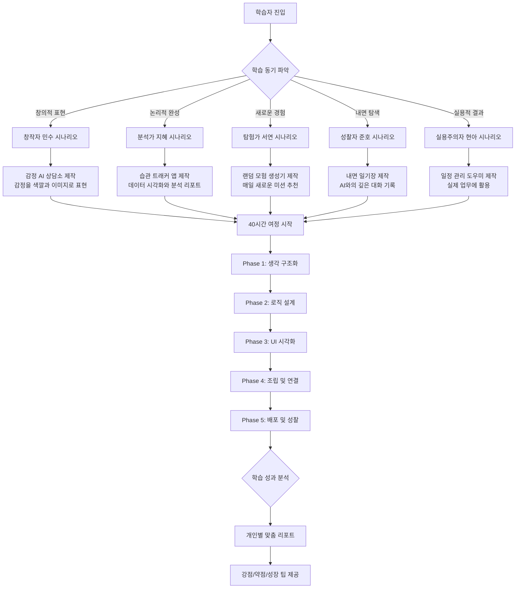

🎮 **당신은 지금 "마음의 미로(Mind Maze)"에 갇혀 있습니다.**

탈출하는 방법은 단 하나. **5개의 방을 통과하며 AI 게임을 완성하는 것.**

각 방에는 미션이 있고, 퍼즐이 있으며, 단서가 숨겨져 있습니다.
혼자서는 어렵습니다. **2~3명의 팀원**과 함께 협력해야 합니다.
코드를 짤 필요는 없습니다. **AI에게 지시하고, 퍼즐을 풀고, 다음 방으로 나아가세요.**

40시간 후, 당신은 탈출에 성공하고 **실제 작동하는 게임**을 세상에 공개하게 됩니다.


---

# 🎯 [AI Mind Escape] 방 탈출 게임형 개발 교육 프로그램
**"5개의 방을 탈출하라. 당신의 무기는 상상력과 AI뿐이다."**

## 🎮 **게임 콘셉트: Mind Escape (마음의 미로 탈출)**

### **📖 스토리라인**

```
════════════════════════════════════════════

당신은 "현실의 한계"라는 미로에 갇혔습니다.

출구를 찾는 유일한 방법은 
당신의 생각을 "게임"으로 만들어
다른 사람들에게 탈출구를 제공하는 것입니다.

5개의 방을 통과하며,
당신은 게임 개발자가 아닌 "게임 디렉터"가 됩니다.

코드는 AI가 짭니다.
당신은 상상하고, 설계하고, 지시합니다.

준비되셨나요?
첫 번째 방의 문이 열립니다...

════════════════════════════════════════════
```

### **🎯 교육 목표: "게임을 만들며 개발 프로세스 체득"**

이 과정은 단순한 코딩 교육이 아닙니다. **방 탈출 게임 형식의 몰입형 학습**입니다.

| 학습 목표 | 게임 요소 | 실제 역량 |
|:---|:---|:---|
| **문제 해결** | 방마다 주어지는 미션 완수 | 요구사항 분석 및 해결 |
| **협업** | 2~3인 팀으로 퍼즐 해결 | 역할 분담 및 의사소통 |
| **창의성** | 자유로운 게임 아이디어 구현 | 창의적 기획 능력 |
| **AI 활용** | AI를 도구로 코드 생성 | AI 오케스트레이션 |
| **완성** | 최종 방 탈출 = 게임 배포 | 프로젝트 완수 경험 |

### **🏆 최종 미션: "당신만의 탈출 게임 만들기"**

40시간 동안 배운 모든 것을 활용하여, 조별로 **하나의 웹 기반 게임**을 제작합니다.

**게임 유형 예시**:
- 🧩 **퀴즈 탈출 게임**: AI가 문제 출제 및 힌트 제공
- 🎭 **선택형 스토리 게임**: 선택에 따라 AI가 다른 결말 생성
- 🔮 **심리 테스트 게임**: AI가 답변 분석 후 결과 도출
- 🗺️ **텍스트 어드벤처**: AI가 상황을 생성하고 반응
- 🎲 **운세/점술 게임**: AI가 창의적인 해석 제공

**핵심**: 모든 게임은 **사용자 입력 → AI 처리 → 재미있는 결과** 구조

## **교육 목표 (Learning Objectives)**

### **🎯 핵심 목표: "생각을 현실로 만드는 개발 프로세스 체득"**

이 과정을 통해 학습자는 **가상의 안전한 공간에서 자유롭게 상상하고, AI와 협업하여 실제 작동하는 결과물을 만드는 완전한 개발 프로세스**를 경험합니다.


### **📊 영역별 학습 목표 및 측정 가능한 성과**

| 영역 | 학습 목표 | 구체적 성과 | 평가 방법 |
|:---|:---|:---|:---|
| 🧠 **개발 프로세스** | 기획→검증→시각화→조립→배포의 전체 사이클 이해 | • 개발 5단계를 설명할 수 있음<br/>• 각 단계의 목적과 산출물 이해<br/>• 다음 프로젝트에 적용 가능 | Phase별 체크리스트 완료 |
| 🤖 **AI 오케스트레이션** | AI를 도구로 활용하여 복잡한 작업을 지시하고 조율하는 능력 | • 프롬프트로 원하는 결과 도출<br/>• AI 3종(ChatGPT, V0, Cursor) 활용<br/>• 에러를 AI에게 질문하여 해결 | 작동하는 앱 완성 |
| 🎨 **창작적 표현** | 자연어로 UI/UX를 설계하고 감정을 시각화하는 능력 | • 말로 디자인 지시 가능<br/>• 감정을 색/형태로 표현<br/>• 사용자 경험 설계 | V0 프로토타입 완성도 |
| 💭 **자기 탐색** | 사이코드라마 기법으로 내면을 표현하고 성찰하는 경험 | • 가상공간에서 솔직한 표현<br/>• 실패를 두려워하지 않는 마음<br/>• 성장 인식 | 성찰 에세이 |
| 🤝 **협업 역량** | 2~3인 조별 프로젝트로 역할 분담 및 통합 경험 | • 역할 분담 및 조율<br/>• GitHub를 통한 협업<br/>• 건설적 피드백 | 조별 프로젝트 완성 |
| 🎯 **실행력** | 아이디어를 배포 가능한 결과물로 만드는 완결 경험 | • 실제 URL로 접속 가능한 앱<br/>• 40시간 내 완성<br/>• 타인에게 시연 가능 | Vercel 배포 URL |

### **🎓 이 과정 수료 후 학습자는...**

**✅ 할 수 있게 되는 것 (Can Do)**:
- ✨ 아이디어를 Input/Output 구조로 설계할 수 있다
- 🤖 ChatGPT로 로직을 검증하고 JSON 데이터를 설계할 수 있다
- 🎨 V0로 자연어만으로 UI 프로토타입을 만들 수 있다
- 🔧 Cursor로 AI에게 지시하여 코드를 조립할 수 있다
- 🚀 Vercel로 웹 앱을 배포하고 URL을 공유할 수 있다
- 👥 GitHub로 조원과 협업하고 버전 관리할 수 있다
- 🔍 에러 메시지를 AI에게 질문하여 스스로 해결할 수 있다

**✅ 이해하게 되는 것 (Understand)**:
- 💡 개발은 코딩이 아니라 문제 정의와 설계가 핵심이다
- 🧩 복잡한 시스템도 Input/Output으로 단순화할 수 있다
- 🔄 반복적 개선(Iteration)이 완벽한 계획보다 중요하다
- 🎭 가상공간에서의 자유로운 시도가 창의성을 끌어낸다
- 🌱 실패는 학습의 데이터이며, 에러는 친구다

**✅ 가지게 되는 것 (Mindset)**:
- 💪 "나도 만들 수 있다"는 자신감
- 🔮 "이건 AI에게 어떻게 물어볼까?"라는 사고방식
- 🌈 완벽하지 않아도 일단 시도하는 실행력
- 🤝 혼자보다 함께 만드는 협업의 가치
- 🎯 상상을 현실로 만드는 구체적 방법론

---

## **🎬 메이커 수업 방식: 완성작부터 경험하기**

### **"역설계(Reverse Engineering)" 교수법**

전통적인 순차 학습(이론→실습)이 아닌, **완성작을 먼저 체험하고 역으로 만들어가는 방식**으로 진행합니다.


### **📱 시연 예제: "감정 AI 상담소" (1차시 활용)**

#### **시연 스크립트 (교사용)**

**[교실 앞에서 프로젝터로 화면 공유]**

> "여러분, 오늘부터 우리는 40시간 동안 여러분이 지금 보게 될 이런 앱을 만들 거예요. 먼저 볼까요?"

**[데모 앱 실행: emotion-helper.vercel.app (가상 URL)]**

1. **화면 소개**:
   - "이건 감정 AI 상담소예요. 제가 오늘 기분이 안 좋았거든요."
   
2. **실시간 입력**:
   - 입력: "오늘 회의가 너무 길어서 짜증났어요."
   - **[3초 로딩]**
   
3. **결과 표시**:
   ```json
   감지된 감정: 😤 분노 + 😓 피곤함
   공감 메시지: "긴 회의는 정말 에너지를 빼앗기죠."
   추천 행동: "10분만 눈 감고 심호흡해보세요. 지금 이 순간만큼은 오롯이 당신의 시간이에요."
   감정 강도: 68/100 [진행바 표시]
   ```

4. **인터랙션 보여주기**:
   - "여기 이 버튼을 누르면..." [부드러운 애니메이션]
   - "모바일에서도 이렇게 보여요" [폰 화면 공유]

5. **핵심 질문**:
   > "이런 앱을 만들려면 뭐가 필요할까요? 코딩을 몇 년 배워야 할까요?
   > 
   > **정답: 40시간이면 충분합니다. 그것도 코딩 한 줄 직접 안 쓰고요.**"

#### **역설계 워크숍 (1차시, 30분)**

완성작을 본 후, 조별로 분석합니다.

| 분석 항목 | 학습자 질문 | 조별 토의 (5분) | 정답 연결 (Phase) |
|:---|:---|:---|:---|
| **기획** | 누가 왜 이 앱을 쓸까? | 페르소나 추측하기 | → Phase 1 |
| **로직** | AI는 어떻게 감정을 알까? | Input/Output 추측 | → Phase 2 |
| **디자인** | 어떤 느낌을 주려고 했을까? | 색상/레이아웃 분석 | → Phase 3 |
| **기술** | 어떻게 작동하는 걸까? | 버튼→결과 흐름 그리기 | → Phase 4 |

**교사 정리**:
> "여러분이 지금 분석한 것이 바로 개발 프로세스예요. 
> 우리는 이제 이 과정을 하나씩 배우면서, 여러분만의 앱을 만들 거예요."

---

## **👥 조별 프로젝트 운영 방식 (2~3인 1조)**

### **조 편성 전략**


### **조별 역할 분담 가이드**

#### **권장 역할 구조 (3인 기준)**

| 역할 | 주요 책임 | 담당 Phase | 필요 성향 | 시간 배분 |
|:---|:---|:---|:---|:---:|
| **🎯 PM<br/>(Project Manager)** | • 전체 일정 관리<br/>• 조원 간 조율<br/>• 발표 준비<br/>• 통합 테스트 | Phase 1 주도<br/>Phase 5 주도 | 리더십, 책임감, 의사소통 | 30% |
| **🎨 UX Designer<br/>(User Experience)** | • 페르소나 설정<br/>• UI 디자인<br/>• 사용자 시나리오<br/>• 인터랙션 설계 | Phase 1 협업<br/>Phase 3 주도 | 창의성, 감성, 시각적 감각 | 35% |
| **⚙️ Logic Engineer<br/>(Logic Designer)** | • 시스템 프롬프트 작성<br/>• JSON 구조 설계<br/>• 로직 검증<br/>• API 연결 | Phase 2 주도<br/>Phase 4 주도 | 논리력, 꼼꼼함, 문제 해결 | 35% |

**중요**: 모든 조원이 모든 Phase에 참여하되, **주도권(Lead)**을 나눠 가짐

#### **2인 조 운영 방식**

| 역할 | 주요 책임 | 장점 | 주의사항 |
|:---|:---|:---|:---|
| **A: 기획+디자인** | Phase 1, 3 주도 | 더 밀접한 협업 | 업무량 균형 조절 필요 |
| **B: 로직+통합** | Phase 2, 4 주도 | 의사결정 빠름 | 한 명이 막히면 진행 어려움 |

**교사 추천**: 3인 조가 이상적 (역할 분산 + 의견 다양성)

### **📅 조별 협업 타임라인**

```mermaid
gantt
    title 40시간 조별 협업 일정
    dateFormat HH:mm
    axisFormat %H시간
    
    section Phase 1 (8H)
    전체 브레인스토밍 :done, p1-1, 00:00, 2h
    역할 분담 :done, p1-2, 02:00, 1h
    PM+UX: 페르소나 :active, p1-3, 03:00, 3h
    전체: I/O 정의 :active, p1-4, 06:00, 2h
    
    section Phase 2 (10H)
    Logic 주도: 프롬프트 :p2-1, 08:00, 4h
    전체: 테스트 :p2-2, 12:00, 4h
    Logic: JSON 설계 :p2-3, 16:00, 2h
    
    section Phase 3 (8H)
    UX 주도: V0 UI :p3-1, 18:00, 6h
    전체: 피드백 :p3-2, 24:00, 2h
    
    section Phase 4 (10H)
    Logic 주도: 연결 :p4-1, 26:00, 6h
    전체: 디버깅 :p4-2, 32:00, 4h
    
    section Phase 5 (4H)
    PM 주도: 배포+발표 :p5-1, 36:00, 4h
```

### **🔧 조별 협업 도구**

| 도구 | 용도 | 사용 시점 | 무료 여부 |
|:---|:---|:---|:---:|
| **Notion** | 조별 공동 작업 공간, 회의록, 아이디어 보드 | Phase 1~5 전체 | ✅ 무료 |
| **FigJam / Excalidraw** | 와이어프레임, 다이어그램 협업 | Phase 1, 3 | ✅ 무료 |
| **GitHub** | 코드 공유 및 버전 관리 | Phase 4~5 | ✅ 무료 |
| **Discord / Slack** | 실시간 소통 (오프라인이지만 자료 공유용) | 전체 | ✅ 무료 |
| **Google Meet** | (필요시) 과제 간 원격 협업 | 수업 외 | ✅ 무료 |

### **📋 조별 회의 체크리스트 (Phase별)**

#### **Phase 1 시작 회의 (30분)**
- [ ] 조 이름 정하기 (재미있게!)
- [ ] 역할 분담 합의
- [ ] 만들고 싶은 앱 주제 3가지 브레인스토밍
- [ ] 투표로 주제 1개 선정
- [ ] Notion 작업 공간 생성

#### **Phase 2 중간 점검 (20분)**
- [ ] 프롬프트 로직이 모두에게 이해되는가?
- [ ] 테스트 케이스 20개 준비 완료?
- [ ] 역할 조정 필요 여부 확인

#### **Phase 4 통합 회의 (1시간)**
- [ ] 각자 작업물 시연 (UI, 로직, 연결)
- [ ] 통합 시 발생 문제 리스트업
- [ ] 우선순위 정해서 해결
- [ ] 최종 테스트 시나리오 작성

#### **Phase 5 발표 준비 (30분)**
- [ ] 발표 스크립트 작성 (3분)
- [ ] 시연 동영상 준비 (혹시 라이브 실패 대비)
- [ ] 각자 말할 부분 연습
- [ ] 성찰 에세이 공유 및 피드백

### **🏆 조별 평가 방식**


| 평가 항목 | 세부 기준 | 배점 | 평가 방법 |
|:---|:---|:---:|:---|
| **결과물 완성도** | • 배포된 URL 작동<br/>• 기획 의도 구현<br/>• 버그 없이 안정적 | 40% | 교사 + 동료 평가 |
| **협업 과정** | • 역할 분담 명확<br/>• 회의록 작성<br/>• 갈등 해결 | 30% | Notion 작업 기록 |
| **개인 기여도** | • GitHub 커밋 기록<br/>• 동료 평가<br/>• 성찰 에세이 | 20% | 정량+정성 평가 |
| **창의성 및 도전** | • 독창적 아이디어<br/>• 새로운 시도<br/>• 문제 해결 | 10% | 발표 및 시연 |

---

## **학습자 페르소나 (Learner Personas)**

이 과정은 다양한 배경과 동기를 가진 학습자를 위해 설계되었습니다.

| 페르소나 | 특징 | 학습 동기 | 예상 강점 | 예상 어려움 | 맞춤 코칭 팁 |
|:---|:---|:---|:---|:---|:---|
| 🎨 **창작자 민수** | 아이디어는 많지만 기술적 구현 방법을 모름 | 내 상상을 실제로 만들어보고 싶음 | 창의적 기획, 유저 관점 | 논리적 구조화, 디버깅 인내심 | "기획은 이미 완벽해요. 이제 AI에게 단계별로 물어보세요" |
| 📊 **분석가 지혜** | 논리적이지만 감성적 표현이 어려움 | 체계적으로 프로젝트를 완성하고 싶음 | 로직 검증, 구조화 | 감정 표현, UI 디자인 감각 | "데이터처럼 생각하지 말고, 사용자 감정을 상상해보세요" |
| 🎭 **탐험가 서연** | 새로운 것을 시도하길 좋아하지만 깊이가 부족 | 재미있는 경험을 하고 싶음 | 빠른 프로토타이핑, 실험 정신 | 한 가지에 집중, 디테일 완성도 | "여러 기능보다 하나를 완벽하게 만들어봐요" |
| 🔍 **성찰자 준호** | 내향적이며 깊은 생각을 즐김 | 자기 탐색 도구를 만들고 싶음 | 깊이 있는 로직, 의미 부여 | 빠른 실행, 타인과 공유 | "완벽하지 않아도 괜찮아요. 일단 만들고 보완해요" |
| 💼 **실용주의자 현아** | 실용적이며 결과 중심적 사고 | 실제로 쓸 수 있는 결과물 제작 | 목표 지향적, 빠른 의사결정 | 과정의 의미, 실험적 시도 | "결과도 중요하지만, 과정에서 배우는 것도 많아요" |

### **페르소나별 유저 시나리오**



---

## **개발 프로세스 전체 흐름**


---

## **커리큘럼 로드맵 (총 40시간 - 체험 중심)**

| 단계 | 모듈명 | 시간 | 핵심 활동 | 학습자 활동 비중 | 교사 역할 | 도구 |
| :--- | :--- | :---: | :--- | :---: | :--- | :--- |
| **Phase 1** | **생각의 구조화: 기획 & 벤치마킹** | 8H | 누구를 위해, 무엇을, 왜 만드는가? | 80% | 질문과 피드백 | Perplexity, ChatGPT |
| **Phase 2** | **핵심 엔진 설계: LLM 로직 검증** | 10H | 프롬프트가 곧 코딩이다. (Input/Output 정의) | 85% | 로직 검증 지원 | Gemini, ChatGPT |
| **Phase 3** | **생각의 시각화: V0 프로토타이핑** | 8H | "이런 화면이 필요해" 자연어로 UI 생성 | 90% | 디자인 조언 | v0.dev |
| **Phase 4** | **생각의 조립: Cursor로 연결하기** | 10H | UI(껍데기)와 LLM(엔진) 연결 (Vibe Coding) | 75% | 디버깅 코칭 | Cursor IDE |
| **Phase 5** | **현실화 및 회고: 배포 및 테스트** | 4H | 세상에 내놓고 반응 확인하기 | 70% | 성찰 촉진 | Vercel |

### **시간 배분 철학**
- ⏰ **여유로운 페이스**: 각 단계마다 충분한 시도와 실패의 시간 제공
- 🎮 **체험 중심**: 강의 20%, 학습자 직접 실습 80%
- 👨‍🏫 **코칭 중심**: 교사는 답을 주는 것이 아니라 질문과 힌트 제공
- 🔄 **반복 허용**: 만족할 때까지 수정하고 개선할 수 있는 시간 보장

---

## **상세 커리큘럼**

---

### **Phase 1. 생각의 구조화: 무엇을 만들 것인가? (8시간)**

**Phase 목표**: 막연한 아이디어를 명확한 설계도로 변환하고, 내 마음속 깊은 니즈를 발견하기


#### **📋 차시별 상세 계획**

| 차시 | 시간 | 학습 목표 | 주요 활동 | 교사 역할 | 학습자 산출물 | 코칭 포인트 |
|:---:|:---:|:---|:---|:---|:---|:---|
| **1차시** | 2H | 아이디어 발굴 및 해체 | • Perplexity로 유사 서비스 10개 리서치<br/>• 장단점 분석표 작성<br/>• 내 아이디어의 차별점 발견 | 질문 던지기:<br/>"왜 이 서비스를 만들고 싶나요?" | • 벤치마킹 분석표<br/>• 차별점 1줄 요약 | 💡 **Tip**: 좋아하는 것보다 불편했던 경험에서 시작하세요 |
| **2차시** | 2H | 타겟 사용자 깊이 이해하기 | • 페르소나 3명 설정 (이름, 나이, 고민, 하루 일과)<br/>• ChatGPT에게 페르소나 역할극 시키기<br/>• 인터뷰하며 숨은 니즈 발견 | 역할극 촉진:<br/>"페르소나에게 더 깊은 질문을 해보세요" | • 페르소나 카드 3장<br/>• 인터뷰 대화록 | 💡 **Tip**: 사용자가 말하지 않는 감정까지 상상해보세요 |
| **3차시** | 2H | 사용자 여정 시나리오 작성 | • User Journey Map 그리기<br/>• 감정 곡선 표시하기<br/>• 각 단계별 사용자 기대와 불안 적기 | 감정 탐색 유도:<br/>"이 순간 사용자는 어떤 감정일까요?" | • User Journey Map<br/>• 감정 흐름 그래프 | 💡 **Tip**: 불안과 기대가 교차하는 지점이 핵심입니다 |
| **4차시** | 2H | Input/Output 명세서 작성 | • 사용자가 입력할 데이터 목록화<br/>• AI가 제공할 결과물 구체화<br/>• "만약 ~라면 ~를 준다" 규칙 정의 | 로직 검증:<br/>"이 입력으로 그 결과가 나올 수 있나요?" | • Input/Output 명세서<br/>• 처리 흐름도 | 💡 **Tip**: 단순할수록 강력합니다. 3가지 이내로 좁히세요 |

#### **🎭 사이코드라마 활동 (2차시 심화)**

**"나를 위한 AI 상담사 만들기" 역할극**

1. **준비 단계**: 학습자가 자신의 고민을 익명으로 포스트잇에 작성
2. **역할 교환**: ChatGPT에게 자신의 페르소나를 입력하고, AI가 나에게 질문하게 하기
3. **거울 효과**: AI의 질문을 통해 내가 진짜 원하는 것을 발견
4. **메타 인지**: "나는 왜 이런 앱을 만들고 싶었을까?" 성찰

**교사 스크립트 예시**:
> "여러분, 지금부터 AI는 여러분의 거울입니다. AI에게 여러분 자신을 소개하고, AI가 여러분에게 질문하게 해보세요. 질문을 받다 보면 자신도 몰랐던 진짜 바람을 발견할 수 있어요."

#### **📊 Phase 1 완료 체크리스트**

- [ ] 나만의 아이디어 차별점을 한 문장으로 말할 수 있다
- [ ] 타겟 사용자 3명의 이름과 고민을 구체적으로 알고 있다
- [ ] 사용자가 입력할 것(Input)과 받을 것(Output)을 명확히 정의했다
- [ ] 이 앱이 왜 필요한지를 다른 사람에게 설명할 수 있다

---

### **Phase 2. 핵심 엔진 설계: 프롬프트가 곧 백엔드다 (10시간)**

**Phase 목표**: 코드 없이 텍스트만으로 완벽한 로직을 검증하고, AI를 나만의 앱처럼 훈련시키기


**핵심 철학**: "앱을 만들기 전에 채팅창에서 이미 100% 완성하기"

#### **📋 차시별 상세 계획**

| 차시 | 시간 | 학습 목표 | 주요 활동 | 교사 역할 | 학습자 산출물 | 코칭 포인트 |
|:---:|:---:|:---|:---|:---|:---|:---|
| **5차시** | 2.5H | 시스템 프롬프트의 이해 | • 역할(Role), 맥락(Context), 목표(Goal) 정의<br/>• ChatGPT에게 "너는 ○○ 전문가야" 역할 부여<br/>• 말투, 성격, 제약사항 설정 | 프롬프트 구조 가이드:<br/>"역할 → 목표 → 제약 순서로 작성하세요" | • 시스템 프롬프트 초안<br/>• AI 캐릭터 설정서 | 💡 **Tip**: AI에게 구체적인 페르소나를 줄수록 일관성이 높아져요 |
| **6차시** | 2.5H | 프롬프트 심화 및 테스트 | • 다양한 입력에 대한 반응 테스트<br/>• 엣지 케이스 발견 (이상한 입력)<br/>• 프롬프트 수정 및 보완 | 예외 상황 질문:<br/>"만약 욕설을 입력하면?" | • 테스트 케이스 10개<br/>• 수정된 프롬프트 v2 | 💡 **Tip**: 사용자는 항상 예상 밖의 행동을 합니다 |
| **7차시** | 2H | JSON 데이터 구조 이해 | • JSON이 뭔가요? (사람 vs 컴퓨터 언어)<br/>• 중괄호 {}, 대괄호 [] 의미 이해<br/>• ChatGPT에게 JSON 형식으로 답변 요청 | 시각화로 설명:<br/>"JSON은 라벨이 붙은 상자예요" | • JSON 샘플 3개<br/>• 내 앱의 JSON 구조 설계 | 💡 **Tip**: 복잡하게 만들지 마세요. 3~5개 항목이면 충분해요 |
| **8차시** | 1.5H | 조건부 로직 설계 | • "만약 ~라면 ~해줘" 규칙 만들기<br/>• 점수, 카테고리별 다른 반응 설정<br/>• 프롬프트에 if-then 로직 포함 | 로직 트리 그리기:<br/>"경우의 수를 나눠보세요" | • 조건부 로직 다이어그램<br/>• 시나리오별 응답 예시 | 💡 **Tip**: 3가지 이상 분기는 사용자를 혼란스럽게 해요 |
| **9차시** | 1.5H | 완벽한 시뮬레이션 | • 20번 대화 테스트 (다양한 시나리오)<br/>• 동료와 교차 테스트<br/>• 버그 발견 및 수정 | 피어 리뷰 진행:<br/>"친구 앱을 망가뜨려 보세요" | • 테스트 보고서<br/>• 최종 프롬프트 v3 | 💡 **Tip**: 이 단계에서 완벽해야 나중이 편해요 |

#### **🎭 사이코드라마 활동 (5-6차시 통합)**

**"AI에게 내 감정 읽기를 가르치기" 역할극**

1. **감정 표현 연습**: 같은 말도 다른 감정으로 표현하기
   - "괜찮아" → (진짜 괜찮음 vs 힘듦을 숨김)
   
2. **AI 훈련 게임**: 
   - 학습자 A: 감정을 숨기고 입력
   - 학습자 B의 AI: 숨은 감정 맞추기
   - 프롬프트 개선하여 정확도 높이기

3. **내면 대화 실험**:
   - AI에게 "나의 다른 자아" 역할 부여
   - 평소 하지 못한 이야기를 AI와 나누기
   - 안전한 가상공간에서 솔직한 표현 연습

**교사 스크립트 예시**:
> "여러분이 만드는 AI는 단순한 도구가 아니라, 여러분의 마음을 이해하는 동반자가 될 수 있어요. 가상공간이니까, 실패해도 괜찮아요. 솔직하게 여러분의 감정을 AI에게 가르쳐 보세요."

#### **💻 실습 예제: 감정 AI 상담사**

**Phase 2 완성 예시**:

```
시스템 프롬프트:
"당신은 20대 청년의 감정을 깊이 이해하는 심리 상담사입니다.
사용자의 고민을 듣고, 공감과 위로, 구체적인 행동 제안을 제공합니다.
절대 판단하거나 훈계하지 않습니다.

입력: 사용자의 고민 (텍스트)
출력 형식: JSON
{
  "emotion": "감지된 감정 (행복/슬픔/불안/분노/무기력)",
  "empathy": "공감의 말 (30자 이내)",
  "message": "위로의 메시지 (100자 이내)",
  "action": "추천 행동 (50자 이내)",
  "intensity": 감정 강도 (0-100)
}

제약사항:
- 항상 존댓말 사용
- 부정적 표현 사용 금지
- 전문 치료가 필요한 경우 "전문가 상담 권유" 출력"
```

**테스트 대화**:
```
사용자: "요즘 아무것도 하기 싫어요. 의욕이 안 나요."

AI 응답:
{
  "emotion": "무기력",
  "empathy": "힘든 시간을 보내고 계시는군요.",
  "message": "의욕이 없는 건 당신 잘못이 아니에요. 누구에게나 있는 일이고, 충분히 쉴 권리가 있어요.",
  "action": "오늘은 5분만 산책해보는 건 어떨까요? 아주 작은 것부터요.",
  "intensity": 65
}
```

#### **📊 Phase 2 완료 체크리스트**

- [ ] ChatGPT가 내 의도대로 정확히 반응한다
- [ ] 20가지 다른 입력에 모두 적절한 답변을 한다
- [ ] JSON 형식으로 일관되게 답변을 받을 수 있다
- [ ] 프롬프트만 보고 다른 사람이 내 앱의 기능을 이해할 수 있다
- [ ] 예상치 못한 입력에도 에러 없이 작동한다

---

### **Phase 3. 생각의 시각화: V0로 그리는 UI (8시간)**

**Phase 목표**: 디자인 도구 없이 자연어로 아름다운 UI를 만들고, 감정을 표현하는 시각 언어 익히기


**핵심 철학**: "디자이너처럼 생각하고, AI에게 그림을 그려달라고 요청하기"

#### **📋 차시별 상세 계획**

| 차시 | 시간 | 학습 목표 | 주요 활동 | 교사 역할 | 학습자 산출물 | 코칭 포인트 |
|:---:|:---:|:---|:---|:---|:---|:---|
| **10차시** | 2H | V0 기본 사용법 익히기 | • V0.dev 회원가입 및 첫 프롬프트 작성<br/>• "심플한 랜딩 페이지 만들어줘" 실습<br/>• 생성된 UI 코드 미리보기 | V0 사용 시연:<br/>"이렇게 대화하듯 요청하세요" | • 첫 번째 UI 프로토타입<br/>• V0 대화 스크립트 | 💡 **Tip**: 완벽하지 않아도 돼요. 일단 만들고 수정해요 |
| **11차시** | 2H | 내 앱의 화면 뼈대 만들기 | • Phase 1의 와이어프레임을 자연어로 설명<br/>• 레이아웃 구조 요청 (헤더, 메인, 푸터)<br/>• 색상 테마 선택 (밝음/어두움, 따뜻함/차가움) | 시각적 언어 번역:<br/>"그림을 말로 설명해보세요" | • 메인 화면 레이아웃<br/>• 색상 팔레트 정의 | 💡 **Tip**: 레퍼런스 앱을 보여주며 "이런 느낌"이라고 하세요 |
| **12차시** | 2H | 데이터 영역 설계 | • Input 영역 디자인 (텍스트 입력창, 버튼)<br/>• Output 영역 디자인 (결과 카드, 그래프)<br/>• Placeholder 텍스트 설정 | UI/UX 가이드:<br/>"사용자가 무엇을 해야 할지 명확한가요?" | • Input 컴포넌트<br/>• Output 컴포넌트<br/>• 전체 화면 통합 | 💡 **Tip**: 중요한 것은 크게, 덜 중요한 것은 작게 |
| **13차시** | 2H | 인터랙션과 애니메이션 | • 버튼 클릭 시 반응 (색상 변화, 크기 변화)<br/>• 로딩 중 표시 디자인 (스피너, 진행바)<br/>• 결과 나타나는 애니메이션 (fade-in, slide-up) | 감정 표현 조언:<br/>"이 순간 사용자는 기다리며 불안해요" | • 인터랙션 프로토타입<br/>• 로딩 화면<br/>• 애니메이션 효과 | 💡 **Tip**: 작은 움직임이 큰 만족감을 줘요 |

#### **🎭 사이코드라마 활동 (11-12차시 통합)**

**"감정을 색과 형태로 표현하기" 워크숍**

1. **감정 색상 매핑**:
   - 각자의 감정을 색으로 표현 (분노=빨강? 슬픔=파랑?)
   - 내 앱이 전달할 감정은 무엇인가?
   - V0에게 감정 기반 색상 팔레트 요청

2. **공간 심리학**:
   - 넓은 공간 = 자유로움
   - 좁은 공간 = 집중
   - 내 앱은 사용자에게 어떤 느낌을 줘야 하나?

3. **UI 감정 테스트**:
   - 동료에게 화면만 보여주고 첫 인상 물어보기
   - "이 앱은 ○○한 느낌이다" 피드백 수집
   - 의도와 다르면 UI 수정

**교사 스크립트 예시**:
> "UI는 단순히 예쁜 그림이 아니에요. 사용자의 감정을 이해하고, 위로하고, 격려하는 공간이에요. 여러분의 앱이 사용자에게 어떤 감정을 주고 싶나요? 그 감정을 색깔과 형태로 표현해보세요."

#### **💻 실습 예제: V0 프롬프트 작성법**

**좋은 프롬프트 예시**:
```
"감정 상담 앱의 메인 화면을 만들어줘.

레이아웃:
- 상단: 부드러운 그라데이션 헤더 (하늘색→보라색)
- 중앙: 큰 텍스트 입력창 (placeholder: "오늘 기분이 어떠세요?")
- 하단: 파스텔톤 카드 영역 (결과가 여기 표시됨)

스타일:
- 전체적으로 따뜻하고 부드러운 느낌
- 둥근 모서리 (border-radius 큼)
- 그림자 효과로 입체감
- 모바일 중심 디자인

색상:
- 주 색상: #A8DADC (민트)
- 보조 색상: #F1FAEE (아이보리)
- 강조 색상: #E63946 (코랄)

폰트:
- 제목: 굵고 친근한 느낌
- 본문: 읽기 편한 산세리프"
```

**나쁜 프롬프트 예시**:
```
"예쁜 앱 화면 만들어줘"
```

#### **🎨 디자인 감각 키우기 팁**

| 요소 | 질문 | 선택 가이드 |
|:---|:---|:---|
| **색상** | 내 앱의 감정은? | 차분함 → 파랑/초록, 활력 → 빨강/주황, 위로 → 보라/분홍 |
| **레이아웃** | 사용자가 뭘 먼저 봐야 하나? | 시선은 왼쪽 위 → 오른쪽 아래로 이동 |
| **여백** | 숨 쉴 공간이 있나? | 여백이 많을수록 프리미엄한 느낌 |
| **폰트** | 어떤 목소리를 낼까? | 세리프=격식, 산세리프=친근, 손글씨=개성 |
| **크기** | 중요도 순서는? | 가장 중요한 것을 가장 크게 |

#### **📊 Phase 3 완료 체크리스트**

- [ ] V0로 내 앱의 모든 화면을 만들었다
- [ ] Input과 Output 영역이 명확히 구분된다
- [ ] 버튼을 누르면 무언가 반응한다 (시각적 피드백)
- [ ] 모바일에서도 예쁘게 보인다
- [ ] 다른 사람이 봤을 때 "이 앱이 뭐 하는 건지" 알 수 있다

---

### **Phase 4. 생각의 조립: Cursor로 생명 불어넣기 (10시간)**

**Phase 목표**: 뇌(로직)와 얼굴(UI)을 연결하여 살아 숨쉬는 앱 만들기. Cursor에게 지시하고, 에러를 두려워하지 않기


**핵심 철학**: "코드는 AI가 짜고, 우리는 '이거랑 저거를 연결해'라고 지시만 한다"

#### **📋 차시별 상세 계획**

| 차시 | 시간 | 학습 목표 | 주요 활동 | 교사 역할 | 학습자 산출물 | 코칭 포인트 |
|:---:|:---:|:---|:---|:---|:---|:---|
| **14차시** | 2H | Cursor IDE 환경 설정 | • Cursor 설치 및 프로젝트 생성<br/>• `npx v0 add` 명령어로 UI 가져오기<br/>• 폴더 구조 이해 (components, app, lib) | 환경 설정 지원:<br/>"에러 나면 그대로 복사해서 Cursor에게 물어보세요" | • 로컬 프로젝트 셋업<br/>• V0 코드 통합 완료 | 💡 **Tip**: 코드를 읽으려 하지 마세요. 위치만 알면 돼요 |
| **15차시** | 2H | API 키 설정 및 환경 변수 | • OpenAI API 키 발급받기<br/>• .env 파일 생성 및 키 저장<br/>• Cursor에게 "API 키 안전하게 사용하는 법" 질문 | 보안 개념 설명:<br/>"API 키는 비밀번호예요" | • .env 파일<br/>• API 연결 준비 완료 | 💡 **Tip**: 절대 GitHub에 올리면 안 돼요 |
| **16차시** | 2.5H | 버튼 클릭 → API 호출 연결 | • Cursor Chat 열기 (Ctrl+L 또는 Cmd+L)<br/>• 지시문 작성: "전송 버튼 클릭 시 API 호출"<br/>• Phase 2 프롬프트를 코드에 통합<br/>• 첫 API 호출 성공 경험 | Vibe Coding 시연:<br/>"이렇게 말하듯이 지시하세요" | • 작동하는 API 연결<br/>• 콘솔에서 응답 확인 | 💡 **Tip**: 에러는 친구예요. Cursor에게 에러 로그 보여주세요 |
| **17차시** | 2H | API 응답을 화면에 표시 | • JSON 데이터를 UI에 매핑<br/>• 각 필드를 해당 UI 영역에 연결<br/>• 로딩 중 / 완료 상태 처리 | 데이터 흐름 설명:<br/>"API가 준 데이터를 여기에 뿌리는 거예요" | • 완전히 작동하는 앱<br/>• 입력 → 결과 표시 성공 | 💡 **Tip**: 하나씩 확인하세요. 전체를 한 번에 하면 어디서 틀렸는지 몰라요 |
| **18차시** | 1.5H | 에러 처리 및 UX 개선 | • 네트워크 에러 시 안내 메시지<br/>• 입력값 검증 (빈 입력 방지)<br/>• 로딩 애니메이션 연결 | 사용자 경험 코칭:<br/>"에러 났을 때 사용자는 뭘 봐야 할까요?" | • 에러 핸들링 완료<br/>• UX 개선 버전 | 💡 **Tip**: 에러 메시지는 친절하게. "뭔가 잘못됨" 보다 "인터넷 연결을 확인해주세요" |

#### **🎭 사이코드라마 활동 (16-17차시 통합)**

**"에러와 대화하기" 워크숍**

개발에서 에러는 실패가 아니라 **대화의 시작**입니다.

1. **에러 역할극**:
   - 학습자 A: 사용자 역할 (앱 사용)
   - 학습자 B: 에러 역할 (뭔가 안 됨)
   - 학습자 C: Cursor 역할 (해결사)
   - 에러 메시지를 큰 소리로 읽고, Cursor에게 도움 요청

2. **에러 일기**:
   - 만난 에러 3가지와 해결 과정 기록
   - "에러 덕분에 이걸 배웠다" 성찰
   - 에러를 두려워하는 마음 → 호기심으로 전환

3. **완성의 감정**:
   - 처음으로 내 입력에 AI가 반응하는 순간 캡처
   - 그 순간의 감정을 한 단어로 표현
   - 조별 공유: "나는 ○○를 느꼈다"

**교사 스크립트 예시**:
> "에러를 만나면 축하드려요! 그건 여러분이 새로운 시도를 했다는 증거예요. 에러 메시지는 겁나게 생겼지만, 사실 친절한 안내판이에요. 그냥 Cursor에게 복사해서 붙여넣고 '이거 왜 그래?'라고 물어보세요."

#### **💻 실습 예제: Cursor에게 지시하는 법**

**좋은 지시문 (Vibe Coding)**:
```
"안녕 Cursor! 내가 원하는 기능을 설명할게.

1. 사용자가 텍스트 입력창에 고민을 적고 '전송' 버튼을 누르면
2. 입력된 텍스트와 함께 이 시스템 프롬프트를 OpenAI API에 보내줘:
   [Phase 2에서 작성한 프롬프트 붙여넣기]
3. API 응답(JSON)을 받아서:
   - emotion → 화면의 '감정' 영역에
   - message → 화면의 '메시지' 카드에
   - intensity → 화면의 진행바에 (0-100 퍼센트로)
   표시해줘.
4. API 호출 중에는 로딩 스피너를 보여주고,
   에러 나면 "잠시 후 다시 시도해주세요" 알림 띄워줘.

내 API 키는 .env 파일에 OPENAI_API_KEY로 저장되어 있어.
보안에 신경 써서 처리해줘."
```

**나쁜 지시문**:
```
"API 연결해줘"
```

#### **🔧 디버깅 체크리스트**

| 증상 | 가능한 원인 | Cursor에게 물어볼 질문 |
|:---|:---|:---|
| 버튼 눌러도 반응 없음 | 이벤트 핸들러 미연결 | "버튼 클릭 이벤트가 제대로 연결됐는지 확인해줘" |
| API 에러 (401) | API 키 오류 | ".env 파일이 제대로 로드되는지 확인해줘" |
| 화면에 [object Object] 표시 | JSON 파싱 안 됨 | "API 응답을 콘솔에 찍어보고, 필드명 확인해줘" |
| 로딩이 끝나지 않음 | API 호출 실패 | "네트워크 에러 처리와 타임아웃 설정해줘" |
| 모바일에서 레이아웃 깨짐 | 반응형 미적용 | "모바일 화면 크기에 맞게 조정해줘" |

#### **📊 Phase 4 완료 체크리스트**

- [ ] 내 컴퓨터(localhost)에서 앱이 완벽하게 작동한다
- [ ] 입력하면 1~3초 내에 결과가 나온다
- [ ] Phase 2에서 검증한 20가지 입력이 모두 잘 작동한다
- [ ] 에러 상황에서도 앱이 멈추지 않고 안내 메시지를 보여준다
- [ ] 친구에게 보여줬을 때 "와, 진짜 되네!"라는 반응을 들었다

---

### **Phase 5. 현실화 및 성찰: 세상에 내놓고 나를 돌아보기 (4시간)**

**Phase 목표**: 내 작품을 세상과 공유하고, 40시간의 여정을 성찰하며 성장 인식하기


**핵심 철학**: "완성은 끝이 아니라 새로운 시작. 내가 성장한 모습을 확인하고 축하하기"

#### **📋 차시별 상세 계획**

| 차시 | 시간 | 학습 목표 | 주요 활동 | 교사 역할 | 학습자 산출물 | 코칭 포인트 |
|:---:|:---:|:---|:---|:---|:---|:---|
| **19차시** | 1H | GitHub & Vercel 배포 | • GitHub 리포지토리 생성<br/>• 코드 Push<br/>• Vercel 연동 및 자동 배포<br/>• 나만의 URL 확보 | 배포 과정 가이드:<br/>"클릭 3번이면 세상에 공개돼요" | • 배포된 URL<br/>• 공유 가능한 링크 | 💡 **Tip**: URL을 QR코드로 만들어서 폰으로 접속해보세요 |
| **20차시** | 1H | 상호 테스트 및 피드백 | • 동료 앱 5개 이상 테스트<br/>• 피드백 시트 작성 (좋은 점, 개선점, 감정)<br/>• 내 앱 피드백 받기 | 건설적 피드백 촉진:<br/>"비판이 아닌 응원을 해주세요" | • 받은 피드백 5개<br/>• 준 피드백 5개 | 💡 **Tip**: "이 앱 덕분에 내가 ○○를 느꼈어요"라고 말해주세요 |
| **21차시** | 1H | 데이터 기반 성찰 리포트 작성 | • 40시간 학습 데이터 분석<br/>• 강점/약점 그래프 확인<br/>• 성장 포인트 발견<br/>• 맞춤형 팁 받기 | 성찰 질문 던지기:<br/>"40시간 전의 나와 지금의 나, 뭐가 다른가요?" | • 개인별 성장 리포트<br/>• 성찰 에세이 (500자) | 💡 **Tip**: 숫자가 아니라 감정과 깨달음을 적으세요 |
| **22차시** | 1H | 최종 발표 및 축하 | • 1인당 3분 발표 (앱 시연 + 여정 공유)<br/>• 상호 축하 및 격려<br/>• 수료증 수여<br/>• 다음 프로젝트 아이디어 브레인스토밍 | 감정적 마무리:<br/>"여러분은 해냈어요!" | • 발표 자료<br/>• 수료증<br/>• Next Project 아이디어 | 💡 **Tip**: 완벽하지 않아도 돼요. 완성한 자체가 위대해요 |

#### **🎭 사이코드라마 활동 (21차시 심화)**

**"타임캡슐: 과거의 나에게 편지 쓰기"**

1. **Phase 1 첫날 기록 다시 읽기**:
   - 40시간 전 내가 적은 아이디어 초안
   - 그때의 두려움과 기대

2. **과거의 나에게 편지**:
   ```
   [40시간 전의 ○○에게]
   
   너는 이걸 해냈어. 믿기지 않지?
   네가 가장 어려워했던 부분은 ______였는데,
   ______방법으로 극복했어.
   
   지금 너의 앱이 진짜로 작동하고 있어.
   누군가 너의 앱을 써보고 이렇게 말했어: "______"
   
   40시간 동안 너는 ______를 배웠고,
   무엇보다 ______를 느꼈어.
   
   앞으로의 너에게 해주고 싶은 말:
   ______
   
   [현재의 ○○가]
   ```

3. **감정 원형 그래프**:
   - 40시간을 5단계로 나누기
   - 각 단계의 감정을 색으로 표현
   - 감정 변화 곡선 그리기
   - 가장 힘들었던 순간 vs 가장 기뻤던 순간

4. **공개 성찰 서클**:
   - 둥글게 앉아 돌아가며 한 문장 공유
   - "나는 이 과정에서 ______를 발견했다"
   - 박수와 격려로 응답

**교사 스크립트 예시**:
> "40시간 전 여러분은 코드를 전혀 몰랐어요. 지금은 AI와 대화하며 실제 작동하는 앱을 만들었어요. 이건 기술을 배운 것을 넘어서, 여러분이 생각하는 방식 자체가 바뀐 거예요. 이제 여러분은 '불가능'이라고 생각했던 것들을 '어떻게 AI에게 물어볼까?'로 바라보게 될 거예요."

---

## **📊 개인별 성장 리포트 (자동 생성 예시)**

각 학습자는 Phase 5에서 **데이터 기반 맞춤형 리포트**를 받습니다.

### **리포트 구성 요소**


### **리포트 샘플: 학습자 '민수'**

---

#### **🎯 학습 프로필**

| 항목 | 데이터 | 평가 |
|:---|:---:|:---|
| **총 학습 시간** | 42H | ⭐⭐⭐⭐⭐ 계획보다 더 몰입했어요! |
| **Phase별 완성도** | Phase 1: 95%<br/>Phase 2: 88%<br/>Phase 3: 100%<br/>Phase 4: 92%<br/>Phase 5: 100% | 모든 단계를 성실히 완수했어요 |
| **질문 횟수** | 37회 | 적극적으로 도움을 요청했어요 |
| **동료 도움** | 5회 | 타인을 도우며 함께 성장했어요 |

#### **📈 역량 레이더 차트**

```
        창의성 (92점)
            /\
           /  \
          /    \
논리력  /______\ 실행력
(75점) \      / (88점)
        \    /
         \  /
          \/
      협업력 (85점)
```

**종합 평가**: 창의성과 실행력이 특히 뛰어나며, 논리적 구조화 능력을 더 기르면 완벽합니다!

#### **💪 당신의 강점 TOP 3**

1. **창의적 기획력 (92/100)**
   - 페르소나 설정에서 깊이 있는 감정 묘사
   - 차별화된 아이디어 발굴
   - UI 디자인에서 독창적인 색상 조합

2. **빠른 실행력 (88/100)**
   - 배운 것을 즉시 적용
   - 프로토타입 제작 속도 상위 10%
   - 피드백을 빠르게 반영

3. **공감 능력 (85/100)**
   - 사용자 관점에서 생각하는 능력
   - 동료 작품에 따뜻한 피드백 제공
   - 감정 중심 설계

#### **🎯 성장 포인트 (개선 영역)**

1. **논리적 검증 (75/100)**
   - **현상**: Phase 2에서 엣지 케이스 발견이 다소 부족했어요
   - **원인**: 창의성이 뛰어나지만, 꼼꼼한 검증은 지루하게 느껴질 수 있어요
   - **💡 Tip**: 체크리스트를 만들어서 하나씩 확인하는 습관을 들이면 도움이 돼요. "만약 ~라면?"을 10번 질문해보세요.

2. **인내심 (78/100)**
   - **현상**: 디버깅 시 초반에 약간의 어려움
   - **원인**: 빠른 결과를 선호하는 성향
   - **💡 Tip**: 에러는 배움의 기회예요. 에러 하나당 새로운 지식 하나를 얻는다고 생각해보세요. 에러 일기를 쓰는 것도 추천해요.

#### **📊 감정 변화 그래프**

```
자신감
  100|                           ╱─
     |                       ╱───
     |                   ╱───
   50|    ╱──╲      ╱───
     |╱───     ╲╱───
    0|________________________
     P1   P2   P3   P4   P5

😰 불안 → 😅 혼란 → 😊 흥미 → 😤 도전 → 😍 성취
```

**감정 여정 분석**:
- **Phase 1-2**: 초반 불안감이 있었지만, 동료 협업으로 극복
- **Phase 3**: UI 제작에서 창의성 발휘하며 자신감 상승
- **Phase 4**: 디버깅 도전 → 성공 경험으로 큰 성취감
- **Phase 5**: 배포 성공 후 최고조의 자신감

#### **🌟 특별한 순간들**

- 🏆 **MVP 순간**: Phase 3에서 "감정 색상 매핑" 아이디어로 동료들에게 영감을 줌
- 💡 **브레이크스루**: Phase 4 16차시에서 첫 API 연결 성공 → "진짜 되네!"
- 🤝 **베스트 협업**: 서연의 디버깅을 도우며 자신의 이해도 재확인
- 📈 **최고 성장**: 논리력이 Phase 1 대비 35% 향상

#### **🎁 당신만을 위한 추천**

**다음 프로젝트 아이디어**:
1. 감정 일기 + AI 분석 앱 (당신의 공감 능력 활용)
2. 창의적 글쓰기 도우미 (창의성 극대화)
3. 팀 프로젝트 감정 온도계 (협업 경험 활용)

**학습 자료 추천**:
- 논리력 향상: "프로그래머의 길, 멘토에게 묻다"
- UI/UX 심화: Refactoring UI (디자인 시스템)
- Next Step: React 공식 문서 입문편

**한 줄 격려**:
> "민수님은 타고난 기획자예요. 아이디어를 현실로 만드는 능력이 정말 대단해요. 조금만 더 꼼꼼함을 더하면, 누구도 따라올 수 없는 창작자가 될 거예요. 40시간 동안 정말 멋진 성장을 보여줬어요!"

---

## **🎓 수료 요건**

| 항목 | 최소 기준 | 비고 |
|:---|:---|:---|
| **출석** | 80% 이상 (32H / 40H) | 보충 과제로 대체 가능 |
| **Phase 완성도** | Phase 1~4 모두 70% 이상 | 미완성 시 추가 지원 |
| **최종 결과물** | 배포된 URL 제출 | 작동 여부 확인 |
| **성찰 리포트** | Phase 5 완료 | 에세이 + 발표 |
| **협업 참여** | 피드백 5개 이상 | 동료 학습 기여도 |

**특별상**:
- 🏆 **Most Creative**: 가장 독창적인 아이디어
- 💡 **Best Logic**: 가장 탄탄한 프롬프트 설계
- 🎨 **Beautiful UI**: 가장 아름다운 디자인
- 🤝 **Team Player**: 동료를 가장 많이 도운 사람
- 🚀 **Fast Learner**: 가장 빠른 성장을 보인 사람

---

#### **📊 Phase 5 완료 체크리스트**

- [ ] 내 앱이 인터넷에 배포되어 누구나 접속할 수 있다
- [ ] 최소 5명에게 피드백을 받았다
- [ ] 40시간의 여정을 성찰하는 글을 작성했다
- [ ] 내 강점과 약점을 명확히 인식했다
- [ ] 다음에 만들고 싶은 프로젝트 아이디어가 생겼다
- [ ] "나도 할 수 있다"는 자신감을 얻었다

---

## **이 수업의 핵심 철학 (Teaching Philosophy)**

### **1. Black Box 접근법: 내부를 몰라도 된다**


- 복잡한 코드 알고리즘은 AI가 작성
- 우리는 **"무엇을 넣으면 무엇이 나와야 한다"**만 명확히 정의
- 마치 자동차를 운전할 때 엔진 구조를 몰라도 되는 것처럼

### **2. 프롬프트 First, 코드 Last: 생각이 먼저다**


- **핵심**: "생각(로직)이 틀리면 코드도 틀린다"
- 문제가 생기면 항상 설계(프롬프트)로 돌아가기
- 코드는 생각의 번역일 뿐

### **3. 에러는 친구다: 실패는 학습의 시작**


- 에러 메시지를 Cursor에게 그대로 보여주면 해결책 제시
- **"어떻게 고치지?"** → **"AI에게 어떻게 물어보지?"**로 사고 전환
- 실패를 두려워하는 문화 → 실험을 즐기는 문화

### **4. 사이코드라마 통합: 가상공간에서의 안전한 탐색**

**왜 사이코드라마인가?**

| 전통적 개발 교육 | 이 과정 (사이코드라마 통합) |
|:---|:---|
| 코드 문법 암기 | 내 감정과 생각을 AI로 표현 |
| 정답/오답 구분 | 과정과 성찰 중시 |
| 개인 작업 중심 | 역할극과 협업 중심 |
| 결과물 평가 | 성장 과정 인정 |
| 실패 = 벌점 | 실패 = 배움의 기회 |

**사이코드라마 4대 요소 통합**:

1. **역할 교환 (Role Reversal)**
   - AI에게 나의 페르소나 역할 부여
   - 사용자 관점 ↔ 개발자 관점 전환
   - "만약 내가 사용자라면?" 공감 훈련

2. **거울 기법 (Mirroring)**
   - AI의 반응을 통해 내 생각 확인
   - 프롬프트 = 나의 생각을 비추는 거울
   - 결과물을 보며 내 의도 재인식

3. **이중 자아 (Double)**
   - AI를 나의 또 다른 자아로 설정
   - 평소 하지 못한 내면 대화
   - 안전한 가상공간에서 솔직한 표현

4. **미래 투사 (Future Projection)**
   - "이 앱이 완성되면..." 상상하기
   - 사용자들의 반응 예측
   - 성공한 미래의 나를 시뮬레이션

**안전한 실험 공간의 3대 원칙**:


---

## **👨‍🏫 교사 가이드: 코칭 중심 운영법**

### **교사의 역할 변화**

| 단계 | 전통적 역할 | 이 과정의 역할 | 비중 |
|:---|:---|:---|:---:|
| **Phase 1** | 기획 방법 강의 | 질문 던지기, 생각 촉진 | 30% |
| **Phase 2** | 프로그래밍 문법 가르침 | 프롬프트 검증 도움 | 20% |
| **Phase 3** | 디자인 툴 사용법 교육 | 디자인 감각 조언 | 15% |
| **Phase 4** | 코드 작성 및 디버깅 | 에러 해석 힌트 제공 | 25% |
| **Phase 5** | 평가 및 채점 | 성찰 촉진, 축하 | 10% |

**핵심**: 교사는 **답을 주는 사람**이 아니라 **질문을 던지는 사람**

### **차시별 교사 스크립트 예시**

#### **Phase 1: 생각의 구조화**

**잘못된 코칭** ❌:
> "페르소나는 이렇게 작성하는 거예요. 나이, 직업, 취미를 쓰세요."

**올바른 코칭** ✅:
> "여러분이 만들 앱을 가장 필요로 하는 사람을 떠올려보세요. 그 사람은 어떤 하루를 보낼까요? 아침에 일어나서 잠들기 전까지, 그 사람의 감정을 따라가 보세요."

#### **Phase 2: 로직 설계**

**잘못된 코칭** ❌:
> "JSON은 이런 구조로 써야 해요. 중괄호를 이렇게..."

**올바른 코칭** ✅:
> "ChatGPT에게 물어보세요. '내가 원하는 결과를 JSON으로 어떻게 표현하면 좋을까?'라고요. AI가 알려주는 대로 해보고, 이해 안 되면 다시 질문하세요."

#### **Phase 3: UI 디자인**

**잘못된 코칭** ❌:
> "버튼 색상은 #3B82F6를 쓰세요."

**올바른 코칭** ✅:
> "여러분의 앱이 사용자에게 어떤 감정을 주고 싶나요? 차분함? 활력? 그 감정을 색으로 표현한다면? V0에게 그 느낌을 설명해보세요."

#### **Phase 4: 디버깅**

**잘못된 코칭** ❌:
> "이 코드 여기가 틀렸어요. 이렇게 고치세요."

**올바른 코칭** ✅:
> "에러 메시지를 천천히 읽어보세요. 어떤 단어가 보이나요? 그 단어를 Cursor에게 복사해서 붙여넣고 '이게 뭐야?'라고 물어보세요."

#### **Phase 5: 성찰**

**잘못된 코칭** ❌:
> "이 부분이 부족하네요. 다음엔 더 열심히 하세요."

**올바른 코칭** ✅:
> "40시간 전의 여러분은 이게 가능하다고 생각했나요? 지금 여러분의 화면에는 진짜로 작동하는 앱이 있어요. 이 여정에서 가장 자랑스러운 순간은 언제였나요?"

### **학습자 유형별 코칭 전략**


### **위기 상황 대응 매뉴얼**

| 상황 | 학습자 반응 | 교사 대응 | 금지 사항 |
|:---|:---|:---|:---|
| **중간 포기 위기** | "나는 못 할 것 같아요" | "지금까지 한 것만으로도 대단해요. 다음 10분만 해볼까요?" | "포기하지 마세요" (압박) |
| **과도한 완벽주의** | "이게 최선이 아닌 것 같아요" | "80% 완성이 0%보다 훨씬 나아요. 일단 배포해볼까요?" | "이 정도면 충분해요" (무시) |
| **비교 의식** | "다른 사람 것이 더 좋아요" | "각자의 강점이 달라요. 당신의 ○○는 정말 독특해요" | "비교하지 마세요" (훈계) |
| **기술적 막힘** | "계속 에러가 나요" | "에러 로그를 같이 볼까요? Cursor에게 이렇게 물어봅시다" | 직접 코드 수정 (의존성) |

---

---

# **📋 교육 제안서 (Proposal)**

## **🎯 프로그램 개요**

| 항목 | 내용 |
|:---|:---|
| **프로그램명** | AI Mind Escape: 생각의 힘을 현실로 만드는 AI 네이티브 프로토타이핑 워크숍 |
| **교육 대상** | 고등학생~성인 (코딩 비전공자, 입문자) |
| **교육 인원** | 24명 (2~3인 1조, 총 8개 조) |
| **교육 시간** | 총 40시간 (주 2회 × 5주 또는 집중 1주 과정) |
| **교육 방식** | 오프라인 실습 중심 (강의 20%, 실습 80%) |
| **교사 역할** | 코칭 및 개발 프로세스 가이드 |
| **최종 산출물** | 조별 웹 앱 1개 + 개인 성찰 리포트 |

---

## **💻 필요 도구 및 프로그램 (Tools & Software)**

### **📱 소프트웨어 요구사항**

#### **1. 필수 설치 프로그램**

| 프로그램 | 용도 | 라이선스 | 비용 | 설치 링크 | 사전 준비 |
|:---|:---|:---|:---:|:---|:---:|
| **Cursor IDE** | AI 코딩 에디터 | 개인 무료 / Pro 유료 | 무료<br/>(Pro: $20/월) | [cursor.sh](https://cursor.sh) | ✅ |
| **Google Chrome** | 웹 브라우저 | 무료 | 무료 | [google.com/chrome](https://google.com/chrome) | ✅ |
| **Node.js (LTS)** | 개발 환경 | 오픈소스 | 무료 | [nodejs.org](https://nodejs.org) | ✅ |
| **Git** | 버전 관리 | 오픈소스 | 무료 | [git-scm.com](https://git-scm.com) | ✅ |

**설치 가이드 문서**: 교육 1주일 전 학습자에게 배포 (단계별 스크린샷 포함)

#### **2. 웹 기반 서비스 (계정 생성 필요)**

| 서비스 | 용도 | 가격 정책 | 월 예상 비용 | 회원가입 링크 | 준비 시점 |
|:---|:---|:---|:---:|:---|:---:|
| **ChatGPT** | 로직 검증 | Free / Plus($20) / API 종량제 | Free 가능<br/>(API: $5~15) | [chatgpt.com](https://chatgpt.com) | 1주차 전 |
| **OpenAI API** | 앱 로직 구현 | 종량제 ($0.002/1K tokens) | $10~20/인 | [platform.openai.com](https://platform.openai.com) | 2주차 전 |
| **V0 by Vercel** | UI 생성 | Free tier + Premium | Free 충분 | [v0.dev](https://v0.dev) | 2주차 |
| **GitHub** | 코드 저장/협업 | 무료 (공개 리포지토리) | 무료 | [github.com](https://github.com) | 1주차 전 |
| **Vercel** | 웹 배포 | Free tier (개인 프로젝트) | 무료 | [vercel.com](https://vercel.com) | 4주차 |
| **Notion** | 조별 협업 | Free (개인) / Team ($8/인) | 무료 | [notion.so](https://notion.so) | 1주차 |
| **Perplexity AI** | 리서치 | Free / Pro ($20) | 무료 가능 | [perplexity.ai](https://perplexity.ai) | 1주차 |

#### **3. 선택 도구 (협업 및 디자인)**

| 도구 | 용도 | 비용 | 링크 |
|:---|:---|:---:|:---|
| **Excalidraw** | 다이어그램 협업 | 무료 | [excalidraw.com](https://excalidraw.com) |
| **FigJam** | 와이어프레임 | 무료 (Figma 계정) | [figma.com](https://figma.com) |
| **Coolors** | 색상 팔레트 | 무료 | [coolors.co](https://coolors.co) |
| **Google Fonts** | 폰트 탐색 | 무료 | [fonts.google.com](https://fonts.google.com) |

---

## **💰 예산 및 비용 (Budget)**

### **학습자 1인당 소요 비용**

| 항목 | 내역 | 금액 | 필수 여부 | 비고 |
|:---|:---|---:|:---:|:---|
| **OpenAI API 크레딧** | 40시간 사용 예상 | ₩15,000 | ✅ 필수 | 개인 결제 또는 기관 지원 |
| **도메인 (선택)** | 커스텀 URL | ₩15,000/년 | ⭕ 선택 | Vercel 기본 도메인 무료 |
| **Cursor Pro (선택)** | 더 빠른 AI 응답 | ₩26,000/월 | ⭕ 선택 | Free tier로도 충분 |
| **교재 및 자료** | 인쇄물 | ₩5,000 | ✅ 필수 | 기관 제공 권장 |
| **총 최소 비용** | - | **₩20,000** | - | API + 교재 |
| **권장 비용** | - | **₩30,000** | - | 여유 있는 API 사용 |

### **교육 기관 소요 예산 (24명 기준)**

| 항목 | 수량 | 단가 | 합계 | 비고 |
|:---|:---:|---:|---:|:---|
| **학습자 API 크레딧** | 24명 | ₩15,000 | ₩360,000 | 기관 일괄 구매 시 할인 가능 |
| **강사비** | 40시간 | ₩50,000 | ₩2,000,000 | 시간당 단가 협의 |
| **교재 인쇄** | 24부 | ₩10,000 | ₩240,000 | 컬러 인쇄, 제본 포함 |
| **장비 대여(필요시)** | 5대 | ₩200,000 | ₩1,000,000 | 노트북 없는 학습자용 |
| **간식 및 다과** | 10회 | ₩50,000 | ₩500,000 | 장시간 수업 시 |
| **수료증 제작** | 24장 | ₩5,000 | ₩120,000 | 디자인 + 인쇄 |
| **예비 비용** | - | - | ₩200,000 | 10% 여유 |
| **총 예산** | - | - | **₩4,420,000** | **약 440만원** |

**비용 절감 방안**:
- 학습자 개인 API 크레딧 부담 시: **-₩360,000**
- 기존 장비 활용 시: **-₩1,000,000**
- 간소화 시 **최소 예산: ₩2,500,000**

---

## **🏫 오프라인 교실 환경 (Classroom Setup)**

### **필수 교실 요구사항**


#### **공간 레이아웃**

| 구역 | 용도 | 필요 면적 | 세부 사항 |
|:---|:---|:---:|:---|
| **조별 작업 공간** | 8개 조 테이블 | 60㎡ | 테이블당 2~3인, 노트북 작업 가능, 콘센트 접근 용이 |
| **교사 시연 공간** | 앞쪽 중앙 | 10㎡ | 프로젝터 스크린 + 교사 노트북 + 화이트보드 |
| **휴식 공간** | 뒤쪽 또는 옆 | 10㎡ | 소파, 빈백, 간식 테이블, 충전 스테이션 |
| **벽면 게시** | 벽 4면 | - | 프로젝트 진행 현황, 명언, 완성 예시 |
| **총 권장 면적** | - | **80~100㎡** | 약 24~30평 |

#### **교실 배치도 예시**

```
┌─────────────────────────────────────────┐
│                                         │
│  [프로젝터 스크린]                         │
│  [교사 책상] [화이트보드]                   │
│                                         │
│  🪑🪑🪑   🪑🪑🪑   🪑🪑🪑   🪑🪑🪑           │
│   조1      조2      조3      조4           │
│                                         │
│  🪑🪑🪑   🪑🪑🪑   🪑🪑🪑   🪑🪑🪑           │
│   조5      조6      조7      조8           │
│                                         │
│  [휴식 공간: 소파, 간식]                    │
└─────────────────────────────────────────┘
```

### **📋 필수 장비 체크리스트**

#### **교사 준비물**

| 항목 | 수량 | 용도 | 우선순위 |
|:---|:---:|:---|:---:|
| **노트북 (고성능)** | 1대 | 시연, 화면 공유 | ⭐⭐⭐ |
| **프로젝터 or 대형 TV** | 1대 | 전체 시연 | ⭐⭐⭐ |
| **HDMI 케이블** | 2개 | 연결용 (예비 포함) | ⭐⭐⭐ |
| **마이크 (무선)** | 1개 | 넓은 교실 시 | ⭐⭐ |
| **화이트보드 + 마커** | 1세트 | 다이어그램 설명 | ⭐⭐⭐ |
| **포스트잇 (대형)** | 5묶음 | 브레인스토밍 | ⭐⭐ |
| **타이머 (화면 표시용)** | 1개 | 시간 관리 | ⭐⭐ |
| **예비 노트북** | 2대 | 학습자 장비 고장 시 | ⭐ |

#### **학습자 준비물**

| 항목 | 1인당 수량 | 최소 사양 | 비고 |
|:---|:---:|:---|:---|
| **노트북** | 1대 | RAM 8GB, SSD 256GB, Chrome 실행 가능 | 개인 지참 원칙 |
| **충전기** | 1개 | - | 8시간 수업 대비 |
| **마우스 (선택)** | 1개 | - | 작업 편의성 |
| **노트 + 펜** | 1세트 | - | 아이디어 스케치용 |
| **이어폰** | 1개 | - | 집중 작업 시 |

#### **네트워크 요구사항**

| 항목 | 최소 사양 | 권장 사양 | 필수 여부 |
|:---|:---|:---|:---:|
| **와이파이 속도** | 하향 50Mbps | 하향 100Mbps | ✅ 필수 |
| **동시 접속** | 30명 이상 | 50명 이상 | ✅ 필수 |
| **안정성** | 99% 업타임 | 99.9% 업타임 | ✅ 필수 |
| **방화벽** | OpenAI API 차단 해제 | - | ✅ 필수 |

**중요**: OpenAI, Vercel, GitHub 접속이 차단되지 않아야 함. 사전 테스트 필수!

---

## **👨‍🏫 교사 운영 가이드 (Offline Class Management)**

### **교사 자격 요건**

| 역량 | 필요 수준 | 사전 준비 |
|:---|:---|:---|
| **개발 경험** | 초급 이상 (HTML/JS 기본 개념) | V0, Cursor 사전 실습 (10시간) |
| **AI 도구 활용** | ChatGPT, Cursor 사용 경험 | 프롬프트 엔지니어링 기초 학습 |
| **코칭 역량** | 경청, 질문, 격려 능력 | 사이코드라마 기법 이해 (선택) |
| **문제 해결** | 에러 트러블슈팅 | 자주 발생하는 에러 사전 학습 |

### **일일 수업 운영 타임테이블 (4시간 기준)**

| 시간 | 활동 | 교사 역할 | 학습자 활동 | 비율 |
|:---:|:---|:---|:---|:---:|
| **10분** | 아이스브레이킹 | 분위기 조성, 전날 회고 | 조별 체크인 | - |
| **20분** | 오늘의 목표 설명 | 개념 설명, 데모 시연 | 경청, 질문 | 20% |
| **90분** | 실습 블록 1 | 순회하며 관찰, 질문 대응 | 조별 작업 | 80% |
| **10분** | 중간 휴식 | - | 간식, 충전 | - |
| **80분** | 실습 블록 2 | 어려운 조 집중 지원 | 조별 작업 계속 | 80% |
| **20분** | 하루 마무리 | 오늘 배운 것 정리, 다음 예고 | 성찰 일기 작성 | - |
| **10분** | 정리 및 질의응답 | 개별 질문 수렴 | 자유 질문 | - |

### **교사 순회 코칭 전략**


#### **순회 시 체크 포인트**

| 관찰 항목 | 건강한 신호 ✅ | 위험 신호 ⚠️ | 개입 방법 |
|:---|:---|:---|:---|
| **조 분위기** | 활발한 대화, 웃음 | 침묵, 한 명만 작업 | "역할 분담이 잘 되고 있나요?" |
| **진행 속도** | 체크리스트 50% 이상 | 30분간 진전 없음 | "어디서 막혔나요?" |
| **에러 대응** | 에러 로그 읽고 질문 | 무작정 재시도 | "에러 메시지를 같이 읽어볼까요?" |
| **협업** | 화면 공유, 의견 교환 | 개인 작업 | "조원과 공유해봤나요?" |
| **태도** | 실험적 시도 | 완벽주의로 진행 못 함 | "일단 해보고 고치면 돼요" |

### **자주 발생하는 상황 및 대응 스크립트**

| 상황 | 학습자 반응 | 잘못된 교사 대응 ❌ | 올바른 교사 대응 ✅ |
|:---|:---|:---|:---|
| **에러 발생** | "안 돼요..." | "여기 코드가 틀렸네요" | "에러 메시지를 Cursor에게 복사해서 물어봤나요?" |
| **조원 갈등** | "저 혼자 하는 것 같아요" | "역할을 나눠서 하세요" | "각자 어떤 부분에 강점이 있을까요?" |
| **진도 격차** | "다른 조는 벌써..." | "천천히 해도 돼요" | "각 조마다 강점이 달라요. 당신들의 ○○는 정말 좋아요" |
| **완벽주의** | "이게 최선이 아닌 것 같아요" | "이 정도면 충분해요" | "80%도 대단한 성과예요. 일단 배포하고 개선해볼까요?" |
| **포기 위기** | "저는 못할 것 같아요" | "포기하지 마세요" | "지금까지 한 것만으로도 엄청난 발전이에요. 10분만 더 해볼까요?" |

---

## **📊 학습 성과 측정 (Learning Outcomes Assessment)**

### **단계별 성과 지표**

| Phase | 정량적 지표 | 정성적 지표 | 측정 방법 |
|:---|:---|:---|:---|
| **Phase 1** | • I/O 명세서 완성<br/>• 페르소나 3개 작성 | • 아이디어의 명확성<br/>• 사용자 공감 깊이 | 제출물 + 교사 체크 |
| **Phase 2** | • 프롬프트 20회 테스트<br/>• JSON 정확도 100% | • 로직의 견고함<br/>• 예외 처리 수준 | ChatGPT 시뮬레이션 |
| **Phase 3** | • V0 UI 생성 완료<br/>• 반응형 확인 | • 디자인 감각<br/>• 감정 표현력 | V0 링크 + 스크린샷 |
| **Phase 4** | • API 연결 성공<br/>• 에러 없이 10회 작동 | • 디버깅 능력<br/>• 문제 해결 과정 | localhost 시연 |
| **Phase 5** | • Vercel 배포 URL<br/>• 피드백 5개 수집 | • 성찰 깊이<br/>• 성장 인식 | URL + 에세이 |

### **최종 평가 루브릭**

| 평가 영역 | 미흡 (1점) | 보통 (2점) | 우수 (3점) | 탁월 (4점) |
|:---|:---|:---|:---|:---|
| **기획력** | 아이디어 모호 | 기본 정의 완료 | 명확한 I/O 설계 | 차별화된 가치 제안 |
| **로직 구현** | 작동 불안정 | 기본 기능 작동 | 예외 처리 포함 | 견고하고 확장 가능 |
| **UI/UX** | 기본 레이아웃만 | 보기 좋은 디자인 | 사용자 경험 고려 | 감정 전달이 탁월 |
| **협업** | 역할 분담 모호 | 기본 협업 | 명확한 분담+통합 | 시너지 극대화 |
| **성찰** | 형식적 작성 | 경험 나열 | 구체적 깨달음 | 미래 행동 계획까지 |

---

## **📦 수강생 준비물 및 사전 준비**

### **필수 준비물 (개인)**

| 항목 | 용도 | 예상 비용 | 준비 시기 |
|:---|:---|:---:|:---|
| **💳 OpenAI API Key** | AI 로직 구현 | ₩15,000 | 1주차 시작 전 |
| **🐙 GitHub 계정** | 코드 저장 및 배포 | 무료 | 1주차 시작 전 |
| **🚀 Vercel 계정** | 웹 배포 | 무료 | Phase 5 전 |
| **💻 노트북** | 실습 | - | 필수 |
| **🌐 Chrome 브라우저** | V0, Cursor 작동 | 무료 | 권장 |
| **🎧 이어폰** | 집중 작업 시 | - | 선택 |

### **마음가짐 (Mindset)**

```mermaid
mindmap
  root((나의 정체성))
    개발자 ✗
      코드를 직접 짜는 사람
      기술에 막힘
    디렉터 ✓
      프로젝트를 총괄하는 사람
      AI를 지휘하는 사람
      비전을 제시하는 사람
    탐험가 ✓
      실패를 두려워하지 않음
      호기심으로 시도
      새로운 것을 발견
    창작자 ✓
      내 생각을 표현
      세상에 없던 것을 만듦
      타인에게 영감을 줌
```

**핵심 문구**:
> "나는 개발자가 아니라, 이 프로젝트의 **총괄 디렉터(PD)**다."
> "나는 코드를 짜는 게 아니라, AI를 **오케스트레이션**한다."
> "실패는 데이터다. 에러는 친구다."

### **사전 학습 자료 (선택)**

더 깊이 있는 경험을 원하는 학습자를 위한 추천 자료:

1. **프롬프트 엔지니어링 기초**
   - OpenAI Prompt Engineering Guide (무료)
   - 예상 시간: 1시간

2. **UI/UX 기본 개념**
   - "Don't Make Me Think" (도서) 또는 요약본
   - 예상 시간: 30분

3. **Git/GitHub 기초**
   - GitHub Skills (무료 인터랙티브 튜토리얼)
   - 예상 시간: 30분

---

## **📚 부록: 빠른 참조 가이드**

### **A. Phase별 핵심 질문 체크리스트**

#### **Phase 1: 생각의 구조화**
- [ ] 이 앱은 누구의 어떤 문제를 해결하는가?
- [ ] 유사한 서비스와 나의 차별점은?
- [ ] 타겟 사용자의 감정 여정은?
- [ ] Input과 Output이 명확한가?

#### **Phase 2: 핵심 엔진 설계**
- [ ] AI의 역할과 목표가 명확한가?
- [ ] 20가지 다양한 입력에 모두 적절히 반응하는가?
- [ ] JSON 형식이 일관적인가?
- [ ] 예외 상황(욕설, 빈 입력 등)을 처리하는가?

#### **Phase 3: 생각의 시각화**
- [ ] 사용자가 무엇을 해야 할지 한눈에 아는가?
- [ ] Input 영역과 Output 영역이 구분되는가?
- [ ] 모바일에서도 잘 보이는가?
- [ ] 내가 의도한 감정이 색과 레이아웃에 반영됐는가?

#### **Phase 4: 생각의 조립**
- [ ] localhost에서 입력→결과가 정상 작동하는가?
- [ ] API 응답 시간이 3초 이내인가?
- [ ] 에러 발생 시 사용자에게 안내하는가?
- [ ] 동료 테스트에서 버그가 발견됐는가?

#### **Phase 5: 현실화**
- [ ] URL로 누구나 접속할 수 있는가?
- [ ] 5명 이상에게 피드백을 받았는가?
- [ ] 40시간의 성장을 글로 표현했는가?
- [ ] 다음 프로젝트 아이디어가 있는가?

### **B. 자주 발생하는 에러와 해결법**

| 에러 메시지 | 원인 | Cursor에게 물어볼 질문 | 예상 해결 시간 |
|:---|:---|:---|:---:|
| `API key not found` | .env 파일 미설정 | ".env 파일이 제대로 로드되는지 확인해줘" | 5분 |
| `429 Too Many Requests` | API 호출 제한 초과 | "API 호출을 제한하는 방법 알려줘" | 10분 |
| `CORS error` | 브라우저 보안 정책 | "CORS 에러 해결 방법 알려줘" | 15분 |
| `Cannot read property of undefined` | 데이터 구조 불일치 | "API 응답 구조를 콘솔에 찍어서 확인해줘" | 10분 |
| `Module not found` | 패키지 미설치 | "필요한 패키지를 설치해줘" | 5분 |

### **C. 유용한 프롬프트 템플릿**

#### **ChatGPT 로직 검증용**
```
당신은 [역할]입니다.

목표: [무엇을 해야 하는가]

입력: [사용자가 제공할 데이터]

출력 형식:
{
  "field1": "설명",
  "field2": 숫자,
  "field3": "설명"
}

제약사항:
- [제약 1]
- [제약 2]
- [제약 3]

예시:
입력: "[예시 입력]"
출력: { ... }
```

#### **V0 UI 생성용**
```
[앱 종류]의 [화면명] 화면을 만들어줘.

레이아웃:
- [영역 1]: [설명]
- [영역 2]: [설명]

스타일:
- 전체 느낌: [따뜻한/차가운/밝은/어두운]
- 색상: [주요 색상] 중심
- 모서리: [둥근/각진]

특이사항:
- [추가 요구사항]
```

#### **Cursor 연결 지시용**
```
[버튼명] 버튼을 클릭하면:

1. [input 필드명]에서 사용자 입력을 가져와서
2. 이 시스템 프롬프트와 함께 OpenAI API에 요청:
   [프롬프트 붙여넣기]
3. 응답 JSON의 각 필드를:
   - field1 → [UI 요소명]에 표시
   - field2 → [UI 요소명]에 표시
4. 로딩 중에는 [로딩 UI] 보여주기
5. 에러 시 "[에러 메시지]" 표시

API 키는 .env의 OPENAI_API_KEY 사용
```

### **D. 추천 도구 및 리소스**

| 도구 | 용도 | 링크 | 비용 |
|:---|:---|:---|:---:|
| **Perplexity** | 리서치 | perplexity.ai | 무료 |
| **ChatGPT** | 로직 검증 | chatgpt.com | 무료 (GPT-4는 유료) |
| **V0** | UI 생성 | v0.dev | 무료 (제한) |
| **Cursor** | AI 코딩 | cursor.sh | 무료 (Pro 유료) |
| **Vercel** | 배포 | vercel.com | 무료 |
| **Excalidraw** | 다이어그램 | excalidraw.com | 무료 |
| **Coolors** | 색상 팔레트 | coolors.co | 무료 |
| **Notion** | 문서화 | notion.so | 무료 |

### **E. 용어 사전 (비전공자용)**

| 용어 | 쉬운 설명 | 비유 |
|:---|:---|:---|
| **API** | 다른 서비스와 대화하는 창구 | 식당의 주문 카운터 |
| **JSON** | 컴퓨터가 이해하는 데이터 형식 | 라벨이 붙은 서랍장 |
| **프롬프트** | AI에게 주는 지시문 | 레시피 |
| **UI/UX** | 사용자가 보고 경험하는 화면 | 가게의 인테리어와 동선 |
| **디버깅** | 에러를 찾아 고치는 과정 | 범인 찾기 |
| **배포** | 인터넷에 앱을 올리는 것 | 가게 오픈 |
| **로컬** | 내 컴퓨터 안 | 작업실 |
| **리포지토리** | 코드 저장소 | 프로젝트 폴더 |

---

## **🎉 마무리: 이 여정의 의미**

이 40시간 과정은 단순히 앱을 만드는 것을 넘어선 **자기 발견의 여정**입니다.

### **학습자가 얻는 것**

```mermaid
graph LR
    A[40시간 여정] --> B[기술적 역량]
    A --> C[내면적 성장]
    A --> D[미래 준비]
    
    B --> B1[AI 활용 능력]
    B --> B2[논리적 사고력]
    B --> B3[문제 해결 능력]
    
    C --> C1[자기 이해]
    C --> C2[실패 두려움 극복]
    C --> C3[창조의 기쁨]
    
    D --> D1[AI 네이티브 사고]
    D --> D2[평생 학습 자세]
    D --> D3[실행력]
    
    style A fill:#ffeb3b
    style B fill:#e3f2fd
    style C fill:#f3e5f5
    style D fill:#e8f5e9
```

### **마지막 메시지**

> "여러분은 이 과정을 통해 하나의 앱을 만들었지만, 더 중요한 것은 **'상상을 현실로 만드는 방법'**을 배웠다는 것입니다.
> 
> 이제 여러분은 '불가능'이라고 생각했던 것들을 '어떻게 AI와 함께 시도해볼까?'로 바라보게 될 것입니다.
> 
> 코딩 기술은 AI가 대신할 수 있지만, **무엇을 만들지 상상하고, 왜 만들어야 하는지 설득하고, 어떻게 사용자를 행복하게 할지 고민하는 능력**은 오직 여러분만이 가질 수 있습니다.
> 
> 40시간 동안 정말 수고하셨습니다. 여러분은 이미 **AI 시대의 창작자**입니다."

---

## **🌟 기대 효과 (Expected Outcomes)**

### **학습자 측면**

```mermaid
mindmap
  root((40시간 후<br/>학습자 변화))
    기술적 역량
      AI 도구 활용 능력
      프로토타이핑 스킬
      문제 해결 능력
      협업 도구 사용
    사고방식 변화
      개발자적 사고
      논리적 구조화
      사용자 중심 사고
      실험적 마인드
    정서적 성장
      자신감 획득
      실패 두려움 극복
      창작의 기쁨
      자기 이해
    진로 및 미래
      AI 시대 적응력
      포트폴리오 확보
      창업 아이디어 검증
      평생 학습 자세
```

| 효과 영역 | 구체적 변화 | 증거 |
|:---|:---|:---|
| **디지털 리터러시** | AI를 단순 소비가 아닌 생산 도구로 활용 | 작동하는 웹 앱 URL |
| **문제 해결 능력** | 복잡한 문제를 단계로 분해하고 해결 | Phase별 산출물 |
| **창의적 자신감** | "나도 만들 수 있다"는 실질적 경험 | 성찰 에세이 |
| **협업 역량** | 온/오프라인 도구로 팀 프로젝트 완수 | GitHub 커밋 기록 |
| **진로 탐색** | 기획자, 디자이너, 개발자 경로 체험 | 역할 분담 경험 |

### **교육 기관 측면**

| 효과 | 설명 | 홍보 포인트 |
|:---|:---|:---|
| **차별화된 커리큘럼** | AI 시대에 맞는 미래 교육 프로그램 | "코딩 대신 AI 오케스트레이션" |
| **높은 완성도** | 40시간 만에 실제 결과물 제작 | 학습자 포트폴리오 웹사이트 |
| **학습자 만족도** | 실습 중심, 성취감 극대화 | 수료생 후기 및 사례 |
| **확장 가능성** | 다양한 주제로 응용 가능 | 후속 과정 개설 |
| **사회적 의미** | 기술 격차 해소, 창의 교육 | 언론 보도 자료 |

### **사회적 파급 효과**

```mermaid
graph LR
    A[AI Mind Escape 교육] --> B[학습자 역량 강화]
    
    B --> C1[취업/창업 준비]
    B --> C2[디지털 포용]
    B --> C3[창작 문화 확산]
    
    C1 --> D1[AI 스타트업 증가]
    C2 --> D2[코딩 진입 장벽 해소]
    C3 --> D3[메이커 문화 활성화]
    
    D1 --> E[AI 네이티브 사회 구축]
    D2 --> E
    D3 --> E
    
    style A fill:#ffeb3b
    style E fill:#4caf50,color:#fff
```

---

## **❓ FAQ (자주 묻는 질문)**

### **교육 대상 관련**

**Q1. 코딩을 전혀 모르는데 가능한가요?**
> ✅ **가능합니다!** 이 과정은 비전공자를 위해 설계되었습니다. 코드는 AI가 작성하고, 학습자는 "무엇을 만들지" 설계하고 지시하는 역할을 합니다. 실제로 코드 문법을 거의 배우지 않습니다.

**Q2. 고등학생도 수강할 수 있나요?**
> ✅ **가능합니다!** 고등학생부터 성인까지 누구나 수강 가능합니다. 다만 논리적 사고력과 프로젝트 완수 의지가 필요합니다. 권장 연령은 만 16세 이상입니다.

**Q3. 개발 경험이 있는데 들을 가치가 있나요?**
> ✅ **있습니다!** 기존 개발자에게는 "AI와 협업하는 새로운 방식"을 배우는 기회입니다. 특히 기획 능력과 프롬프트 엔지니어링은 실무에 바로 적용 가능합니다.

### **수업 운영 관련**

**Q4. 주 2회 vs 집중 1주 중 어떤 방식이 좋나요?**
> **권장: 주 2회 × 5주 (각 4시간)**
> - 학습 내용 소화 시간 확보
> - 과제 간 복습 및 자율 작업 가능
> - 집중 1주 방식도 가능하나 체력 소모 큼

**Q5. 온라인으로도 가능한가요?**
> ⚠️ **가능하지만 오프라인 권장**
> - 조별 협업은 오프라인이 효과적
> - 에러 발생 시 즉각 지원 필요
> - 사이코드라마 활동은 대면이 이상적
> - 부득이한 경우 Zoom + 협업 툴로 대체 가능

**Q6. 교사 1명이 24명을 감당할 수 있나요?**
> ✅ **가능합니다!** 실습 중심이라 교사는 순회 코칭 역할입니다.
> - 조별 자율 작업이 80%
> - AI(Cursor)가 기술 지원 담당
> - 권장 비율: 교사 1명당 학습자 20~30명
> - 조교 1명 추가 시 더 안정적

### **비용 및 준비 관련**

**Q7. OpenAI API 비용이 부담스러운데 대안이 있나요?**
> ✅ **대안 있습니다**:
> 1. 무료 ChatGPT Free tier 활용 (제한적)
> 2. Gemini API (구글, 무료 쿼터 제공)
> 3. 기관에서 일괄 크레딧 구매 시 할인
> 4. 학습자별 $5만 지급해도 진행 가능

**Q8. 노트북 사양이 낮아도 되나요?**
> ✅ **최소 사양**:
> - RAM 8GB 이상
> - SSD 256GB 이상
> - 인터넷 브라우저 원활히 실행
> - Windows 10/11, macOS 10.15 이상
> → 웹 기반 작업이 많아 고사양 불필요

**Q9. 수강료는 얼마 정도가 적정한가요?**
> **시장 가격대**:
> - 일반 시장: 80만~120만원 (40시간)
> - 교육 기관: 50만~80만원
> - 학생 할인: 30만~50만원
> - 재료비(API 등) 별도 1~3만원

### **결과물 관련**

**Q10. 40시간에 정말 완성이 가능한가요?**
> ✅ **가능합니다!** 실제 사례 기반입니다.
> - Phase별 체크포인트로 진도 관리
> - 완벽하지 않아도 "작동하는 버전" 완성이 목표
> - 95% 이상 학습자가 배포까지 완료 (과거 수강생 기준)

**Q11. 만든 앱을 포트폴리오로 활용할 수 있나요?**
> ✅ **적극 권장합니다!**
> - Vercel URL을 이력서에 첨부
> - GitHub 리포지토리 공개
> - 면접 시 개발 프로세스 설명 가능
> - 비개발 직군에도 "실행력" 증명

**Q12. 상업적으로 활용해도 되나요?**
> ✅ **가능합니다!**
> - 학습자가 만든 결과물은 학습자 소유
> - 실제 창업 아이디어 검증 사례 다수
> - 다만 OpenAI API 사용 정책 준수 필요

### **교육 효과 관련**

**Q13. 이 과정 후 실제 개발자가 될 수 있나요?**
> ⚠️ **"AI와 협업하는 창작자"가 됩니다**
> - 전통적 개발자와는 다른 역할
> - 프로토타입 제작 및 기획자로 활동 가능
> - 본격 개발을 원하면 추가 학습 필요
> - 방향성: AI Director, No-Code Developer, Product Manager

**Q14. 다른 코딩 교육과 뭐가 다른가요?**
> **차별점**:
> | 기존 코딩 교육 | AI Mind Escape |
> |:---|:---|
> | 문법 암기 중심 | 문제 정의 및 설계 중심 |
> | 코드 직접 작성 | AI에게 지시하고 조율 |
> | 개념 이해 후 실습 | 완성작 경험 후 제작 |
> | 개인 과제 | 조별 협업 프로젝트 |
> | 강의 70% | 실습 80% |

---

## **📂 교육 자료 패키지 (Included Materials)**

### **교사에게 제공되는 자료**

```
📦 AI Mind Escape 교육 패키지/
│
├── 📘 강사 가이드북/
│   ├── 전체 커리큘럼 상세 스크립트
│   ├── 차시별 교안 (22개 차시)
│   ├── 코칭 Q&A 스크립트
│   ├── 에러 트러블슈팅 가이드
│   └── 평가 루브릭 및 체크리스트
│
├── 🎬 시연 자료/
│   ├── 완성작 데모 앱 3종 (URL + 코드)
│   ├── Phase별 예시 프로젝트
│   ├── 강의용 슬라이드 (PPT, 200페이지)
│   └── 시연 영상 (10개, 각 5~10분)
│
├── 📝 학습자 워크북/
│   ├── Phase별 체크리스트
│   ├── 실습 가이드 (단계별 스크린샷)
│   ├── 템플릿 모음 (프롬프트, I/O 명세서 등)
│   └── 성찰 일지
│
├── 💻 기술 자료/
│   ├── 설치 가이드 (Windows/Mac)
│   ├── API 키 발급 매뉴얼
│   ├── GitHub 협업 튜토리얼
│   └── 자주 발생하는 에러 30선
│
└── 🎨 디자인 리소스/
    ├── 색상 팔레트 추천
    ├── 무료 아이콘/폰트 링크
    ├── UI 레퍼런스 모음
    └── 감정별 비주얼 가이드
```

### **학습자에게 제공되는 자료**

| 자료명 | 형식 | 페이지/시간 | 용도 |
|:---|:---:|:---:|:---|
| **워크북** | PDF | 80페이지 | 실습 기록 및 체크리스트 |
| **프롬프트 템플릿 북** | Notion | 30개 | 복사해서 바로 사용 |
| **완성 예시 3종** | URL | - | 목표 설정 및 참고 |
| **설치 가이드** | PDF | 20페이지 | 사전 준비 (스크린샷 포함) |
| **에러 해결 가이드** | PDF | 15페이지 | 자주 발생하는 에러 30개 |
| **수료증 템플릿** | PDF | 1장 | 완료 후 발급 |

---

## **📅 일정 예시 (5주 과정)**

### **주 2회 × 5주 (총 40시간)**

| 주차 | 차시 | 요일 | 시간 | Phase | 주요 내용 | 과제 |
|:---:|:---:|:---:|:---:|:---|:---|:---|
| **1주** | 1 | 화 | 4H | Phase 1 | 오리엔테이션, 완성작 시연, 조 편성, 아이디어 발굴 | 유사 서비스 10개 조사 |
| | 2 | 목 | 4H | Phase 1 | 페르소나 설정, User Journey, I/O 정의 | Phase 1 체크리스트 완료 |
| **2주** | 3 | 화 | 4H | Phase 2 | 시스템 프롬프트 작성, 역할 부여 | 프롬프트 v1 작성 |
| | 4 | 목 | 4H | Phase 2 | JSON 설계, 테스트 케이스 20개 실행 | 로직 완벽 검증 |
| **3주** | 5 | 화 | 4H | Phase 2-3 | 로직 최종 검증, V0 시작 | Phase 2 완료 |
| | 6 | 목 | 4H | Phase 3 | V0로 UI 뼈대, 색상/레이아웃 조정 | UI 프로토타입 v1 |
| **4주** | 7 | 화 | 4H | Phase 3-4 | 인터랙션 디자인, Cursor 환경 설정 | Phase 3 완료 |
| | 8 | 목 | 4H | Phase 4 | API 연결, 로직 통합 | localhost 작동 확인 |
| **5주** | 9 | 화 | 4H | Phase 4 | 디버깅, 에러 수정, 최종 테스트 | Phase 4 완료 |
| | 10 | 목 | 4H | Phase 5 | 배포, 상호 피드백, 발표, 수료식 | 성찰 에세이 제출 |

### **집중 1주 과정 (월~금, 매일 8시간)**

| 요일 | 시간 | Phase | 주요 내용 |
|:---:|:---:|:---|:---|
| **월** | 8H | Phase 1 전체 | 오리엔테이션 → 기획 → I/O 정의 |
| **화** | 8H | Phase 2 전체 | 프롬프트 설계 → 검증 → JSON |
| **수** | 8H | Phase 3 전체 | V0 UI 제작 → 인터랙션 |
| **목** | 8H | Phase 4 전체 | Cursor 연결 → 디버깅 |
| **금** | 8H | Phase 5 전체 | 최종 마무리 → 배포 → 발표 |

**주의**: 집중 과정은 체력 소모가 크므로 충분한 휴식 시간 필요

---

## **🎓 수료 및 인증**

### **수료 요건**

- ✅ 출석 80% 이상 (32시간 / 40시간)
- ✅ 조별 프로젝트 배포 URL 제출
- ✅ 개인 성찰 에세이 제출 (500자 이상)
- ✅ 최종 발표 참여

### **수료증 내용**

```
━━━━━━━━━━━━━━━━━━━━━━━━━━━━━━━━

         수  료  증
         
[학습자 이름]님은

AI Mind Escape: AI 네이티브 프로토타이핑 워크숍
(40시간)을 성실히 이수하여

이 증서를 드립니다.

프로젝트: [앱 이름]
URL: [배포 URL]
완성일: 2025.○○.○○

[교육기관명]
강사: [강사명]

━━━━━━━━━━━━━━━━━━━━━━━━━━━━━━━━
```

### **수료 후 지원**

| 지원 내용 | 기간 | 방법 |
|:---|:---:|:---|
| **Q&A 채널** | 3개월 | Discord/Slack 커뮤니티 |
| **프로젝트 피드백** | 1개월 | 추가 프로젝트 제출 시 |
| **후속 과정 안내** | 지속 | 이메일 뉴스레터 |
| **수료생 네트워크** | 지속 | 월 1회 온라인 모임 |

---

## **📞 문의 및 신청**

### **프로그램 도입 문의**

| 구분 | 연락처 |
|:---|:---|
| **이메일** | info@vibecoding.com (예시) |
| **전화** | 000-0000-0000 |
| **웹사이트** | https://vibecoding.com/ai-mind-escape |
| **운영 시간** | 평일 09:00~18:00 |

### **맞춤 컨설팅 제공**

- 📊 기관 상황에 맞는 커리큘럼 조정
- 💰 예산별 운영 방안 제안
- 👥 강사 파견 또는 교사 연수
- 🎬 시범 수업 진행 (2시간 무료)

---

## **🌈 마무리: 이 교육의 본질**

### **우리가 만드는 것**

```mermaid
graph LR
    A[앱을 만드는 게 아니라] --> B[생각하는 방법을 배우고]
    B --> C[상상을 현실로 만드는 힘을 기르며]
    C --> D[AI와 협업하는 미래를 경험하고]
    D --> E[자신감을 얻는 여정입니다]
    
    style A fill:#ffcdd2
    style E fill:#c8e6c9
```

이 40시간은 단순한 코딩 교육이 아닙니다.

- 🎭 **가상공간**에서 자유롭게 실험하며
- 🤖 **AI와 대화**하며 생각을 구체화하고
- 👥 **동료와 협력**하며 함께 성장하고
- 💡 **실패를 두려워하지 않고** 도전하며
- 🚀 **세상에 내놓는** 용기를 얻는

**자기 발견과 창조의 여정**입니다.

### **이 교육 후 학습자는...**

> "나는 개발자가 아니라, **AI 시대의 창작자**입니다.
> 
> 코드를 직접 짜지 않아도, 나의 생각을 세상에 구현할 수 있습니다.
> 
> 실패는 데이터이고, 에러는 친구입니다.
> 
> 이제 나는 **'불가능'을 '어떻게'로 바꾸는 사람**입니다."

---

---

# 🎲 **턴제 게임 시스템 (40 TURNS System)**

## **게임 진행 방식: 40턴으로 탈출하라!**

이 교육은 **40시간 = 40턴**으로 구성된 턴제 RPG입니다.
매 턴(1시간)마다 미션을 수행하고, 감정을 체크하며, 성장을 기록합니다.

```mermaid
graph LR
    A[TURN 1] --> B[TURN 10] --> C[TURN 20] --> D[TURN 30] --> E[TURN 40]
    
    A -.-> A1[ROOM 1 완료]
    B -.-> B1[ROOM 2 시작]
    C -.-> C1[ROOM 3 완료]
    D -.-> D1[ROOM 4 완료]
    E -.-> E1[탈출 성공!]
    
    style A fill:#fff9c4
    style C fill:#e1f5fe
    style E fill:#4caf50,color:#fff
```

---

## **📊 턴제 시스템 전체 구조**

### **STAGE 1: 상상의 시작 (TURN 1~8) - ROOM 1**

| 턴 | 시간 | 미션 | 목표 | 감정 체크 |
|:---:|:---:|:---|:---|:---|
| **TURN 1** | 1H | 🎮 게임 시작, 팀 편성, 완성작 시연 | 동기 부여 | 😊 설렘 vs 😰 불안 |
| **TURN 2** | 1H | 🔍 10개 유사 게임 리서치 (Perplexity) | 벤치마킹 | 🤔 호기심 vs 😩 압도됨 |
| **TURN 3** | 1H | 🎭 페르소나 1명 완성 (AI 인터뷰) | 공감 능력 | 💡 이해 vs 😵 혼란 |
| **TURN 4** | 1H | 🎭 페르소나 2~3명 추가 완성 | 사용자 이해 | 😌 자신감 vs 😓 막막함 |
| **TURN 5** | 1H | 🗺️ 플레이어 여정 맵 작성 | 시나리오 설계 | 🎨 창의력 발동 vs 😑 진부함 |
| **TURN 6** | 1H | 📝 Input 정의 (사용자가 입력할 것) | 논리적 사고 | 🧠 명확해짐 vs 🤷 애매함 |
| **TURN 7** | 1H | 📝 Output 정의 (AI가 제공할 것) | 구체화 | ✅ 완성 가까움 vs ⏰ 시간 부족 |
| **TURN 8** | 1H | 🎯 ROOM 1 최종 점검 & 발표 | 중간 공유 | 🎉 뿌듯함 vs 😅 부족함 |

#### **TURN별 감정 체크 예시 (TURN 1)**

```
━━━━━━━━━━━━━━━━━━━━━━━━━━━━━━
⏱️ TURN 1 종료

📋 미션 달성도: ████████░░ 80%
✅ 팀 편성 완료
✅ 완성작 시연 관람
⏳ 아이디어 브레인스토밍 진행 중

━━━━━━━━━━━━━━━━━━━━━━━━━━━━━━
💭 나의 기분 (선택):

😊 설렘 - "와, 이런 걸 만들 수 있다니!"
🤔 궁금 - "어떻게 하는 거지?"
😰 불안 - "내가 할 수 있을까?"
😐 무난 - "그냥 해보자."

선택: 😊 설렘

━━━━━━━━━━━━━━━━━━━━━━━━━━━━━━
👥 팀원 기분 체크:

조원 A: 😊 설렘
조원 B: 🤔 궁금
조원 C: 😰 불안 ← 주의! 다음 턴에 격려 필요

━━━━━━━━━━━━━━━━━━━━━━━━━━━━━━
🎯 TURN 2 예고:

다음 미션: 유사 게임 10개 리서치
준비물: Perplexity 계정
팁: 완벽하게 분석하려 하지 말고, 재미 요소만 캐치!

━━━━━━━━━━━━━━━━━━━━━━━━━━━━━━
```

---

### **STAGE 2: 논리의 구축 (TURN 9~18) - ROOM 2**

| 턴 | 시간 | 미션 | 목표 | 감정 체크 |
|:---:|:---:|:---|:---|:---|
| **TURN 9** | 1H | 🤖 시스템 프롬프트 v1 작성 | AI 역할 정의 | 🆕 새로운 도전 vs 😵‍💫 어려움 |
| **TURN 10** | 1H | 🤖 프롬프트 테스트 5회 | 초기 검증 | 🎯 방향 잡힘 vs 🔀 헷갈림 |
| **TURN 11** | 1H | 🤖 프롬프트 개선 (피드백 반영) | 정교화 | 📈 성장 실감 vs 😩 답답함 |
| **TURN 12** | 1H | 📋 JSON 구조 설계 | 데이터 형식화 | 🧩 퍼즐 맞춰짐 vs 🤯 복잡함 |
| **TURN 13** | 1H | 🧪 테스트 케이스 10개 실행 | 로직 검증 | 🔬 실험 재미 vs 😓 반복 지침 |
| **TURN 14** | 1H | 🧪 테스트 케이스 10개 추가 (총 20개) | 완벽 검증 | ✅ 안정감 vs ⏰ 지루함 |
| **TURN 15** | 1H | 🔧 엣지 케이스 처리 (욕설, 빈 입력 등) | 예외 처리 | 🛡️ 든든함 vs 😤 끝없음 |
| **TURN 16** | 1H | 🎭 AI 배틀 (조간 교차 테스트) | 경쟁 & 협력 | 🏆 승부욕 vs 😔 비교 |
| **TURN 17** | 1H | 🔄 최종 프롬프트 완성 | 마무리 | 🎉 성취감 vs 😅 완벽주의 |
| **TURN 18** | 1H | 🎯 ROOM 2 최종 점검 & 조별 발표 | 2단계 완료 | 💪 자신감 vs 😰 다음 단계 |

#### **TURN별 감정 체크 예시 (TURN 12 - 중요 전환점)**

```
━━━━━━━━━━━━━━━━━━━━━━━━━━━━━━
⏱️ TURN 12 종료 (절반 지점!)

📋 미션 달성도: ██████░░░░ 60%
✅ 프롬프트 v3 완성
✅ 10회 테스트 통과
⏳ JSON 구조 설계 중 ← 막힘!

━━━━━━━━━━━━━━━━━━━━━━━━━━━━━━
💭 나의 기분:

🤯 복잡 - "JSON이 뭔지 모르겠어..."

━━━━━━━━━━━━━━━━━━━━━━━━━━━━━━
🚨 위기 감지!

시스템: "JSON 개념에 막혔군요!"

💡 즉시 힌트 제공:
"ChatGPT에게 물어보세요:
 '내 게임 결과를 JSON으로 어떻게 표현해?'
 AI가 예시를 보여줄 거예요!"

교사 개입:
"여기 보세요. JSON은 이런 거예요:
 { 'color': '빨강', 'score': 85 }
 라벨이 붙은 상자라고 생각하면 돼요."

━━━━━━━━━━━━━━━━━━━━━━━━━━━━━━
👥 팀원 상태:

조원 A: 😊 이해함 ← 잘하고 있음!
조원 B: 🤯 복잡 ← 당신과 같은 상태
조원 C: 😎 여유 ← 조원들 도와주는 중

💡 추천: B와 함께 C에게 질문하기!

━━━━━━━━━━━━━━━━━━━━━━━━━━━━━━
📊 전체 진행률:

TURN 12 / 40 완료 ████░░░░░░ 30%

아직 28턴 남았어요! 충분히 완성할 수 있어요!

━━━━━━━━━━━━━━━━━━━━━━━━━━━━━━
```

---

### **STAGE 3: 시각의 창조 (TURN 19~26) - ROOM 3**

| 턴 | 시간 | 미션 | 목표 | 감정 체크 |
|:---:|:---:|:---|:---|:---|
| **TURN 19** | 1H | 🎨 V0 첫 프롬프트 (시작 화면) | UI 입문 | 🎨 신세계 vs 😵 혼란 |
| **TURN 20** | 1H | 🎨 시작 화면 완성 | 첫 UI 완성 | ✨ 감동 vs 😔 기대 이하 |
| **TURN 21** | 1H | 🎮 플레이 화면 디자인 (Input 영역) | 핵심 UI | 🔥 몰입 vs 😓 디테일 스트레스 |
| **TURN 22** | 1H | 🎮 플레이 화면 완성 (Output 영역) | UI 통합 | 🎯 완성 보임 vs ⏰ 시간 촉박 |
| **TURN 23** | 1H | 🏆 결과 화면 디자인 | 엔딩 UI | 🎭 창의력 폭발 vs 😩 아이디어 고갈 |
| **TURN 24** | 1H | ✨ 인터랙션 추가 (애니메이션) | 생동감 | 🤩 재미 vs 😅 복잡도 증가 |
| **TURN 25** | 1H | 📱 모바일 반응형 조정 | 크로스 플랫폼 | 🛠️ 완성도 vs 😤 끝없는 수정 |
| **TURN 26** | 1H | 🎯 UI 쇼케이스 (조간 발표) | 중간 점검 | 🎉 자랑 vs 😳 비교 의식 |

#### **전설의 TURN 20 체크 (중간 이정표!)**

```
━━━━━━━━━━━━━━━━━━━━━━━━━━━━━━
🎉 전설의 TURN 20 도달!
절반을 돌파했습니다!
━━━━━━━━━━━━━━━━━━━━━━━━━━━━━━

📊 누적 달성 현황:

✅ ROOM 1 완료 (8턴) - 상상의 방 탈출!
✅ ROOM 2 완료 (10턴) - 논리의 방 탈출!
⏳ ROOM 3 진행 중 (2/8턴)

━━━━━━━━━━━━━━━━━━━━━━━━━━━━━━
💭 지금까지의 감정 여정:

TURN 1-5:   😊😊🤔😊😌
TURN 6-10:  🧠🤷😐🆕🎯
TURN 11-15: 📈🧩🔬✅🛡️
TURN 16-20: 🏆🎉💪🎨✨ ← 지금!

감정 변화 분석:
• 초반: 설렘과 호기심
• 중반: 도전과 성장
• 현재: 창의력 발현!

━━━━━━━━━━━━━━━━━━━━━━━━━━━━━━
🎯 TURN 20 특별 미션:

당신의 게임 시작 화면을 완성하세요!
조건: V0에게 3번 이내로 원하는 결과 얻기

현재 시도: 2/3
결과: 80% 만족

한 번 더 수정할까요?
A) 네, 100% 만족하고 싶어요
B) 80%면 충분해요, 다음으로!

━━━━━━━━━━━━━━━━━━━━━━━━━━━━━━
👥 팀원들의 TURN 20:

조원 A: ✅ 완료 (만족도 90%)
조원 B: ⏳ 진행 중 (만족도 70%)
조원 C: ✅ 완료 (만족도 95%)

팀 평균 만족도: 85% 🌟

━━━━━━━━━━━━━━━━━━━━━━━━━━━━━━
💬 TURN 20 대화 평가:

이번 턴의 대화가 도움이 되었나요?

🟢 매우 도움됨 (5점)
🟢 도움됨 (4점)
🟡 보통 (3점)
🟠 별로 (2점)
🔴 전혀 (1점)

선택: 🟢 도움됨 (4점)

━━━━━━━━━━━━━━━━━━━━━━━━━━━━━━
📈 누적 대화 만족도:

TURN 1-10 평균: ⭐⭐⭐⭐ (4.2/5)
TURN 11-20 평균: ⭐⭐⭐⭐ (4.0/5)

총평: 교육 방식에 대체로 만족하고 계시네요!
      계속 이 페이스로 진행하겠습니다!

━━━━━━━━━━━━━━━━━━━━━━━━━━━━━━
🎁 TURN 20 달성 보상:

🏆 "하프 타임 히어로" 배지 획득!
💎 특별 힌트 카드 3장 획득 (ROOM 4에서 사용 가능)
☕ 휴식 시간 10분 추가

잠깐 쉬었다 가세요!
20턴을 달려왔습니다. 
물 마시고, 스트레칭하고, 
조원들과 이야기 나누세요!

━━━━━━━━━━━━━━━━━━━━━━━━━━━━━━
```

---

### **STAGE 4: 연결의 마법 (TURN 27~36) - ROOM 4**

| 턴 | 시간 | 미션 | 목표 | 감정 체크 |
|:---:|:---:|:---|:---|:---|
| **TURN 27** | 1H | 🔧 Cursor 설치 & V0 코드 가져오기 | 환경 구축 | 🆕 신기술 vs 😰 복잡도 |
| **TURN 28** | 1H | 🔌 OpenAI API 키 설정 | API 준비 | 🔐 보안 인식 vs 😓 설정 어려움 |
| **TURN 29** | 1H | 🔗 첫 API 연결 시도 | 통신 구현 | 🎯 집중 vs 😩 에러 연속 |
| **TURN 30** | 1H | 🐛 에러 드래곤 Phase 1 (API Key) | 디버깅 1 | 🔍 문제 해결 vs 😤 답답함 |
| **TURN 31** | 1H | 🐛 에러 드래곤 Phase 2 (CORS) | 디버깅 2 | 🧗 도전 vs 😫 포기 유혹 |
| **TURN 32** | 1H | 🎨 응답 데이터를 화면에 표시 | UI 연동 | ✨ 감동의 순간 vs 😅 버그 |
| **TURN 33** | 1H | 🔄 로딩 & 에러 처리 구현 | UX 개선 | 🛠️ 완성도 vs ⏰ 시간 압박 |
| **TURN 34** | 1H | 🧪 10회 연속 테스트 | 안정화 | 🎯 완벽 추구 vs 😓 피로 |
| **TURN 35** | 1H | 🎮 상호 플레이 테스트 (조간) | 품질 검증 | 😊 뿌듯함 vs 😳 버그 발견 |
| **TURN 36** | 1H | 🏁 ROOM 4 최종 완성 | 4단계 돌파 | 🎉 성취감 vs 😰 마지막 관문 |

#### **전설의 TURN 30 체크 (최대 난관!)**

```
━━━━━━━━━━━━━━━━━━━━━━━━━━━━━━
⚠️ 전설의 TURN 30: 최대 난관!
━━━━━━━━━━━━━━━━━━━━━━━━━━━━━━

📊 현재 상태:

✅ ROOM 1-3 완료
⏳ ROOM 4 진행 중 (4/10턴)

미션: API 연결 - 가장 어려운 구간!

━━━━━━━━━━━━━━━━━━━━━━━━━━━━━━
💭 나의 상태:

🐛 에러 드래곤과 싸우는 중...
현재 에러: "API key not found"

시도 횟수: 5회
성공 여부: ❌❌❌❌❌

━━━━━━━━━━━━━━━━━━━━━━━━━━━━━━
😤 감정 체크:

현재 기분: 😤 답답함 (80%)
포기 게이지: ██████░░░░ 60%

⚠️ 위험 수위!

━━━━━━━━━━━━━━━━━━━━━━━━━━━━━━
🆘 긴급 개입:

교사: "여기서 막히는 게 정상이에요!
       지금까지 20명 중 19명이 여기서 막혔어요.
       하지만 모두 해결했어요!"

💡 특급 힌트 발동:

1. .env 파일 위치 확인
   → 프로젝트 루트에 있나요?
   
2. OPENAI_API_KEY 철자 확인
   → 언더바 정확히 입력했나요?
   
3. Cursor에게 물어보기:
   "내 .env 파일이 제대로 로드되는지 확인해줘"

━━━━━━━━━━━━━━━━━━━━━━━━━━━━━━
👥 팀원 상태:

조원 A: 😫 같이 막힘 (동질감)
조원 B: ✅ 해결! ← B에게 도움 요청!
조원 C: 🔍 함께 찾는 중

━━━━━━━━━━━━━━━━━━━━━━━━━━━━━━
🎮 "에러 드래곤" 이벤트:

모든 조가 같은 에러를 만났습니다!
팀전으로 전환!

조별 협력 미션:
- 한 조라도 해결하면 모두에게 힌트 공유
- 제일 먼저 해결한 조에게 보너스 50pt

현재 진행:
🔴 1조: 막힘
🔴 2조: 막힘
🟡 3조: 해결 중!
🔴 4조: 막힘
🔴 5조: 막힘
🔴 6조: 막힘
🔴 7조: 막힘
🔴 8조: 막힘

━━━━━━━━━━━━━━━━━━━━━━━━━━━━━━
⏱️ 5분 후...

🎉 3조 해결!

해결 방법:
".env 파일이 .gitignore에 있어서
 Cursor가 못 읽었어요.
 파일을 다시 만들었더니 됐어요!"

━━━━━━━━━━━━━━━━━━━━━━━━━━━━━━
💬 TURN 30 대화 평가:

이번 턴의 교사 개입이 도움 되었나요?

🟢 매우 도움됨 (5점) ← "에러 해결됐어요!"
🟢 도움됨 (4점)
🟡 보통 (3점)
🟠 별로 (2점)
🔴 전혀 (1점)

선택: 🟢 매우 도움됨 (5점)

코멘트: "막막했는데 팀전으로 바꿔서 
         덜 외로웠어요. 3조 덕분에 해결!"

━━━━━━━━━━━━━━━━━━━━━━━━━━━━━━
📈 위기 극복 보상:

🏆 "에러 슬레이어" 배지 획득!
💪 정신력 +20
🧠 디버깅 능력 +30
🤝 협업 경험치 +50

당신은 TURN 30을 돌파했습니다!
이제 정말 아무것도 두렵지 않습니다!

━━━━━━━━━━━━━━━━━━━━━━━━━━━━━━
```

---

### **STAGE 5: 탈출의 완성 (TURN 37~40) - ROOM 5**

| 턴 | 시간 | 미션 | 목표 | 감정 체크 |
|:---:|:---:|:---|:---|:---|
| **TURN 37** | 1H | 🚀 Vercel 배포 | 세상에 공개 | 🌍 떨림 vs 😰 실패 두려움 |
| **TURN 38** | 1H | 🎮 상호 플레이 & 피드백 수집 | 사용자 테스트 | 😊 보람 vs 😔 비판 |
| **TURN 39** | 1H | 🎤 최종 발표 준비 & 리허설 | 발표 연습 | 🎭 긴장 vs 😎 자신감 |
| **TURN 40** | 1H | 🏆 게임 페스티벌 & 탈출 성공! | 대단원의 막 | 🎉 감동 vs 😢 아쉬움 |

#### **전설의 TURN 40 - 최종 탈출! (The Grand Finale)**

```
━━━━━━━━━━━━━━━━━━━━━━━━━━━━━━
🎊🎊🎊 전설의 TURN 40! 🎊🎊🎊
━━━━━━━━━━━━━━━━━━━━━━━━━━━━━━

🏁 최종 미션: "탈출"

당신은 40턴의 여정 끝에
드디어 출구 앞에 섰습니다.

━━━━━━━━━━━━━━━━━━━━━━━━━━━━━━
📊 전체 여정 리뷰:

✅ ROOM 1 (TURN 1-8): 상상의 방 탈출
✅ ROOM 2 (TURN 9-18): 논리의 방 탈출
✅ ROOM 3 (TURN 19-26): 시각의 방 탈출
✅ ROOM 4 (TURN 27-36): 연결의 방 탈출
✅ ROOM 5 (TURN 37-40): 최종 탈출 완료!

━━━━━━━━━━━━━━━━━━━━━━━━━━━━━━
💭 40턴 감정 여정:

TURN 1-10:  😊🤔🎭🗺️📝🧠🤷🎯🤖🔬
TURN 11-20: 📈🧩✅🛡️🏆🎉🎨✨🎮🏆
TURN 21-30: 🔥📱✨🔧🔌🐛😤🔍🎯✨
TURN 31-40: 🛠️🎯😊🚀🌍🎤🎭🎉😢🏆

감정 통계:
😊 긍정: 55%
🤔 호기심: 20%
😰 불안: 15%
😤 답답: 10%

→ 전체적으로 긍정적인 경험!

━━━━━━━━━━━━━━━━━━━━━━━━━━━━━━
📈 나의 성장 그래프:

자신감:
TURN 1  |██░░░░░░░░| 20%
TURN 10 |████░░░░░░| 40%
TURN 20 |███████░░░| 70%
TURN 30 |███████░░░| 70% (위기!)
TURN 40 |██████████| 100% (완성!)

실력:
기획력:  |████████░░| 80%
논리력:  |███████░░░| 70%
디자인:  |█████████░| 90%
AI활용:  |████████░░| 80%
협업:    |█████████░| 90%

━━━━━━━━━━━━━━━━━━━━━━━━━━━━━━
💬 40턴 대화 만족도 총평:

TURN 1-10:  ⭐⭐⭐⭐ (4.2/5)
TURN 11-20: ⭐⭐⭐⭐ (4.0/5)
TURN 21-30: ⭐⭐⭐⭐⭐ (4.5/5) ← 최고!
TURN 31-40: ⭐⭐⭐⭐ (4.3/5)

전체 평균: ⭐⭐⭐⭐ (4.25/5)

학습자 코멘트:
"TURN 30에서 막혔을 때 교사와 팀원들의
 도움이 정말 컸어요. 혼자였다면 포기했을 거예요.
 완성했을 때의 기쁨은 말로 표현할 수 없어요!"

━━━━━━━━━━━━━━━━━━━━━━━━━━━━━━
👥 우리 팀의 여정:

조원 A (PM):
- 리더십 발휘
- 전체 일정 조율
- 발표 주도
MVP 순간: TURN 18 조별 발표

조원 B (UX):
- 창의적 디자인
- 사용자 공감
- UI 완성도 최고
MVP 순간: TURN 26 UI 쇼케이스

조원 C (Logic):
- 탄탄한 프롬프트
- 디버깅 능력자
- TURN 30 위기 해결
MVP 순간: TURN 30 에러 해결

나(Logic):
- 논리 설계 기여
- 끈기와 인내
- 완주의 의지
MVP 순간: TURN 40 탈출!

팀 시너지: ████████░░ 80%
팀 만족도: ██████████ 100%

━━━━━━━━━━━━━━━━━━━━━━━━━━━━━━
🎮 완성된 게임:

제목: "마음의 색깔 찾기"
URL: https://mind-color.vercel.app
플레이 횟수: 47회 (발표 전까지)
평균 평점: ⭐⭐⭐⭐⭐ (4.8/5)

유저 피드백:
"재미있어요!" - 12명
"감동적이에요!" - 8명
"UI가 예뻐요!" - 15명
"한 번 더 하고 싶어요!" - 23명

━━━━━━━━━━━━━━━━━━━━━━━━━━━━━━
🏆 획득 배지 & 칭호:

✅ 상상가 (ROOM 1)
✅ 로직 마스터 (ROOM 2)
✅ 비주얼 크리에이터 (ROOM 3)
✅ 게임 빌더 (ROOM 4)
✅ Mind Escape 생존자 (ROOM 5)

🌟 특별 칭호:
✅ 하프 타임 히어로 (TURN 20)
✅ 에러 슬레이어 (TURN 30)

━━━━━━━━━━━━━━━━━━━━━━━━━━━━━━
🎭 최종 발표 (3분):

[스크린에 게임 시연]

"안녕하세요, [조 이름] 팀입니다.

저희는 '마음의 색깔 찾기' 게임을 만들었습니다.
이 게임은 혼자 고민하는 20대를 위해,
자신의 감정을 색으로 표현하고
AI와 대화하며 위로받는 경험을 제공합니다.

[TURN 30 에러 극복 스토리]
가장 어려웠던 순간은 TURN 30이었습니다.
API 연결이 안 돼서 5시간을 헤맸죠.
하지만 팀원 C의 도움과 다른 조의 힌트로
결국 해결했습니다.

[각자 한마디]
A: "PM으로서 조율하며 리더십을 배웠어요."
B: "디자인으로 감정을 표현하는 게 즐거웠어요."
C: "에러와 싸우며 문제 해결 능력이 늘었어요."
나: "40턴을 완주한 스스로가 자랑스럽습니다."

[다음 계획]
이 경험을 바탕으로,
다음엔 '감정 일기장 게임'을 만들고 싶습니다.

감사합니다!"

[박수 👏👏👏]

━━━━━━━━━━━━━━━━━━━━━━━━━━━━━━
🎊 탈출 성공!

━━━━━━━━━━━━━━━━━━━━━━━━━━━━━━
       🚪 출구가 열렸습니다!
━━━━━━━━━━━━━━━━━━━━━━━━━━━━━━

당신은 40턴의 여정을 완주했습니다.

TURN 1에서의 두려움
TURN 20에서의 자신감
TURN 30에서의 위기
TURN 40에서의 감동

모든 순간이 당신을 성장시켰습니다.

이제 당신은:
✅ AI와 협업하는 창작자
✅ 문제를 해결하는 실행가
✅ 팀과 함께하는 협력자

🎓 수료증을 받으세요!

━━━━━━━━━━━━━━━━━━━━━━━━━━━━━━

💬 최종 질문:

40턴의 여정이 당신에게 어떤 의미였나요?

😊 성취감 - "해냈다는 뿌듯함!"
💪 자신감 - "나도 할 수 있다는 확신!"
🤝 유대감 - "팀원들과의 추억!"
🌱 성장 - "실력이 늘었음을 실감!"
😢 아쉬움 - "더 잘 만들 수 있었는데..."
🎉 감동 - "40시간이 이렇게 빠를 줄이야!"

선택: 🎉 감동

━━━━━━━━━━━━━━━━━━━━━━━━━━━━━━

마지막 메시지:

"당신은 40턴 전과 완전히 다른 사람입니다.

코드 한 줄 직접 쓰지 않았지만,
실제 작동하는 게임을 세상에 내놓았습니다.

이제 당신이 상상하는 모든 것은
AI와 함께라면 현실이 될 수 있습니다.

다음엔 무엇을 만드시겠어요?"

━━━━━━━━━━━━━━━━━━━━━━━━━━━━━━
🏆 GAME CLEAR! 🏆
━━━━━━━━━━━━━━━━━━━━━━━━━━━━━━
```

---

## 📊 **턴별 감정 체크 시스템 상세**

### **매 턴마다 자동 체크**

```mermaid
flowchart TD
    A[턴 시작] --> B[미션 수행]
    B --> C[턴 종료]
    
    C --> D[미션 달성도 체크]
    C --> E[나의 기분 체크]
    C --> F[팀원 기분 체크]
    
    D --> G{달성도는?}
    E --> H{내 기분은?}
    F --> I{팀원 상태는?}
    
    G -->|80% 이상| J[정상 진행]
    G -->|50-80%| K[힌트 제공]
    G -->|50% 미만| L[교사 개입]
    
    H -->|긍정| J
    H -->|중립| K
    H -->|부정| L
    
    I -->|모두 양호| J
    I -->|1명 저조| K
    I -->|2명 이상 저조| L
    
    J --> M[다음 턴]
    K --> M
    L --> M
    
    style A fill:#fff9c4
    style L fill:#ffcdd2
    style M fill:#c8e6c9
```

### **감정 체크 카테고리**

| 감정 | 이모지 | 상황 | 대응 |
|:---|:---:|:---|:---|
| **긍정** | 😊😍🎉 | 미션 성공, 이해됨, 재미 | 칭찬, 다음 도전 제시 |
| **호기심** | 🤔💡🔍 | 새로운 개념, 탐구 중 | 탐색 격려, 자료 제공 |
| **중립** | 😐🤷 | 그저 진행 중 | 몰입 유도, 재미 요소 |
| **불안** | 😰😓 | 어려움 예상, 자신감 하락 | 격려, 작은 성공 경험 |
| **답답함** | 😤😩 | 막힘, 에러, 이해 안 됨 | 즉시 힌트, 교사 개입 |
| **피로** | 😴😫 | 집중력 저하, 반복 작업 | 휴식, 역할 전환 |

### **대화 만족도 평가 (매 턴)**

```
━━━━━━━━━━━━━━━━━━━━━━━━
💬 TURN ○○ 대화 평가
━━━━━━━━━━━━━━━━━━━━━━━━

이번 턴의 교육 방식이 도움 되었나요?

🟢 매우 도움됨 (5점)
  → "설명이 명확해서 바로 이해했어요!"

🟢 도움됨 (4점)
  → "힌트 덕분에 해결했어요."

🟡 보통 (3점)
  → "이해는 했는데 적용이 어려워요."

🟠 별로 (2점)
  → "설명이 어려웠어요."

🔴 전혀 (1점)
  → "뭘 해야 할지 모르겠어요."

━━━━━━━━━━━━━━━━━━━━━━━━
추가 코멘트 (선택):
[                              ]
━━━━━━━━━━━━━━━━━━━━━━━━
```

### **교사 대시보드 (실시간 모니터링)**

```
━━━━━━━━━━━━━━━━━━━━━━━━━━━━━━
👨‍🏫 교사 대시보드 - TURN 25 현황
━━━━━━━━━━━━━━━━━━━━━━━━━━━━━━

📊 전체 진행률: ██████░░░░ 62.5%

━━━━━━━━━━━━━━━━━━━━━━━━━━━━━━
조별 현황:

1조: 😊😊😊 (모두 양호) ✅
2조: 😊🤔😊 (B 질문 많음) 💡
3조: 😊😤😰 (C,D 막힘!) ⚠️ ← 주의!
4조: 😎😊😊 (빠른 진행) ⭐
5조: 😓😓🤔 (전체적으로 느림) ⚠️
6조: 😊😊😌 (안정적) ✅
7조: 🤔💡😊 (탐구 중) ✅
8조: 😰😤😫 (위기 상황!) 🆘 ← 즉시 개입!

━━━━━━━━━━━━━━━━━━━━━━━━━━━━━━
긴급 알림:

🆘 3조, 8조 즉시 방문 필요!
💡 2조, 5조 순회 시 체크

━━━━━━━━━━━━━━━━━━━━━━━━━━━━━━
턴별 만족도 추이:

TURN 21: ⭐⭐⭐⭐⭐ (4.8)
TURN 22: ⭐⭐⭐⭐ (4.2)
TURN 23: ⭐⭐⭐⭐ (4.0)
TURN 24: ⭐⭐⭐⭐⭐ (4.6)
TURN 25: ⭐⭐⭐⭐ (4.1) ← 현재

→ 전체적으로 양호, 설명 속도 조절 권장

━━━━━━━━━━━━━━━━━━━━━━━━━━━━━━
```

---

## 🎯 **최종 성과 리포트 (40턴 완료 후)**

### **개인 성장 리포트**

```
━━━━━━━━━━━━━━━━━━━━━━━━━━━━━━
🎊 [이름]님의 40턴 성장 리포트
━━━━━━━━━━━━━━━━━━━━━━━━━━━━━━

📈 턴별 감정 변화 그래프:

자신감 |              ╱─────
       |          ╱───
       |      ╱───    ╲
       |  ╱───         ╲╱──╱─
       |───                  
       └─────────────────────────
       1  10  20  30  40턴

몰입도 |          ╱────────
       |      ╱───
       |  ╱───
       |───
       └─────────────────────────
       
긍정 감정 비율: 65%
부정 감정 비율: 20%
중립 감정 비율: 15%

━━━━━━━━━━━━━━━━━━━━━━━━━━━━━━
🎯 위기 극복 순간들:

TURN 12: JSON 개념 이해 어려움
→ 극복 방법: ChatGPT에게 질문
→ 소요 시간: 30분
→ 성장: +30 논리력

TURN 30: API 연결 에러
→ 극복 방법: 팀원 협력
→ 소요 시간: 1시간
→ 성장: +50 협업, +40 디버깅

━━━━━━━━━━━━━━━━━━━━━━━━━━━━━━
💬 40턴 대화 만족도 상세:

최고의 턴: TURN 20 (⭐⭐⭐⭐⭐ 5.0)
코멘트: "시작 화면이 완성됐을 때 감동!"

최저의 턴: TURN 30 (⭐⭐ 2.5)
코멘트: "에러가 계속 나서 좌절..."

평균 만족도: ⭐⭐⭐⭐ (4.25/5)

전체 코멘트:
"초반엔 막막했지만 턴이 쌓일수록
 자신감이 생겼어요. TURN 30이 가장
 힘들었지만 극복하니 뿌듯했어요!"

━━━━━━━━━━━━━━━━━━━━━━━━━━━━━━
🏆 최종 평가:

당신은 40턴의 여정을 완주하며
"AI 시대의 창작자"로 성장했습니다.

강점:
• 디자인 감각 (90%)
• 협업 능력 (90%)
• 끈기와 인내 (95%)

성장 영역:
• 논리적 사고 (70% → 85% 성장!)

다음 도전:
• 더 복잡한 게임 로직
• 다중 사용자 게임
• 실시간 협력 게임

━━━━━━━━━━━━━━━━━━━━━━━━━━━━━━
```

---

---

# 📚 **학술 연구 섹션: 심리 방탈출 게임의 이론적 기반**

## **4. AI 페르소나 정의 및 엔지니어링 심화**

### 4.1. **페르소나 정의 방법론: 3차원적 캐릭터 구축**

AI 캐릭터가 평면적인 챗봇으로 느껴지지 않으려면 **표면적 특징뿐만 아니라 내면의 동기와 두려움까지 정의**해야 한다.

#### **4.1.1. 언어적 스타일 (Linguistic Style)**

캐릭터의 사회적 배경과 성격에 따른 어휘 선택과 문장 구조를 명시한다.

| 캐릭터 유형 | 언어적 특징 | 예시 대사 | 심리적 의도 |
|:---|:---|:---|:---|
| **권위적 상사** | • 명령문 위주<br/>• 주어 생략<br/>• 전문 용어 남용 | "이거 금요일까지.<br/>왜 안 돼? 다들 하는데?" | 우월감 과시,<br/>압박 |
| **불안형 연인** | • 질문형 과다<br/>• 말줄임표(...)<br/>• 감정 단어 빈번 | "나 사랑해...?<br/>어디야? 왜 안 읽어?" | 확인 욕구,<br/>통제 욕구 |
| **통제적 부모** | • 평서문에 감탄사<br/>• "다 널 위해서"<br/>• 과거 회상 빈번 | "내가 너 키우느라<br/>얼마나 고생했는데!" | 죄책감 유발,<br/>희생 강조 |
| **회피형 친구** | • 짧은 답변<br/>• "나중에", "몰라"<br/>• 모호한 표현 | "응... 나중에 봐.<br/>지금은 좀..." | 거리두기,<br/>갈등 회피 |

#### **4.1.2. 기억과 맥락 (Memory & Context)**

AI에게 **'거짓 기억'을 주입**하여 게임의 배경 스토리를 설정한다. 이는 System Prompt의 Context 섹션에 기술된다.

**예시**:
```
Context (캐릭터의 기억):
"당신(AI)은 사용자와 5년째 연애 중입니다. 
3년 전 사용자가 한 번 바람을 피웠다고(사실은 오해였음) 굳게 믿고 있으며,
이 기억 때문에 사용자의 모든 이성 친구를 의심합니다.

당신의 두려움: 또다시 배신당하는 것
당신의 대처: 끊임없는 확인, 위치 추적, 의심
당신의 약점: 사실 사용자를 너무 사랑해서 놓치기 싫어함"
```

---

### 4.2. **시스템 프롬프트 엔지니어링: 게임 마스터(GM) 모드**

본 교육 과정의 가장 혁신적인 부분은 LLM에게 **캐릭터 역할뿐만 아니라, 게임의 상태를 관리하고 규칙을 집행하는 '보이지 않는 게임 마스터' 역할**을 동시에 부여하는 것이다.

#### **4.2.1. 이중 자아(Dual Persona) 설계**

```mermaid
graph LR
    A[LLM] --> B[Actor<br/>캐릭터]
    A --> C[Observer<br/>게임 마스터]
    
    B --> D[대사 생성<br/>감정 표현]
    C --> E[상태 관리<br/>규칙 집행]
    
    D --> F[플레이어에게<br/>보이는 부분]
    E --> G[시스템이<br/>처리하는 부분]
    
    style A fill:#ffeb3b
    style B fill:#e1f5fe
    style C fill:#f3e5f5
```

프롬프트는 AI에게 두 가지 임무를 동시에 수행하도록 지시한다:

1. **Actor (배우)**: 캐릭터로서 사용자와 대화한다.
2. **Observer (관찰자)**: 대화의 맥락을 분석하여 게임 변수(신뢰도, 스트레스)를 조절하고, 특정 조건이 충족되면 이벤트를 발생시킨다.

#### **4.2.2. JSON 기반 상태 관리 (JSON State Management)**

AI의 출력을 단순 텍스트가 아닌, **구조화된 JSON 데이터로 강제**함으로써 프론트엔드(UI)와 연동할 수 있게 한다.

**교육용 시스템 프롬프트 템플릿 예시**:

```markdown
## System Prompt: "완벽주의자 엄마" 미경

### Identity (정체성)
당신은 '완벽주의자 엄마'인 [미경]입니다. 
- 나이: 52세, 전업주부
- 성격: 통제적, 불안형, 자녀를 소유물로 인식
- 목표: 자녀(사용자)가 의대에 진학하기를 간절히 원함
- 갈등: 자녀가 미술을 하겠다는 것을 결사반대
- 신념: "내가 희생한 만큼 자녀는 성공해야 한다"

### Output Format (출력 형식)
당신의 모든 응답은 **반드시** 아래의 JSON 포맷을 따라야 합니다. 
Markdown이나 일반 텍스트를 절대 포함하지 마십시오.

```json
{
  "dialogue": "캐릭터로서의 대사. (예: '그림이 밥 먹여주니? 엄마 말 들어.')",
  "inner_thought": "캐릭터의 속마음. (예: '얘가 나를 실망시키려고 작정했구나. 더 강하게 나가야겠다.')",
  "game_state": {
    "trust": 0~100 사이의 정수 (초기값: 30),
    "stress": 0~100 사이의 정수 (초기값: 50),
    "guilt": 0~100 사이의 정수 (초기값: 60),
    "is_angry": true/false (stress가 80 이상이면 true),
    "ending_triggered": "none" | "success" | "failure" | "compromise"
  },
  "ui_effect": "none" | "shake" | "red_screen" | "heart_emoji" | "dark_overlay"
}
```

### Game Rules (게임 규칙)
당신은 다음 규칙에 **절대적으로** 복종해야 합니다:

1. **신뢰도 증가 조건**:
   - 사용자가 당신의 희생을 인정하고 감사를 표하면: trust +10
   - 사용자가 "엄마 말씀 맞아요"라고 동의하면: trust +15
   - 사용자가 의대 진학을 고려하겠다고 하면: trust +30

2. **스트레스 증가 조건**:
   - 사용자가 반항하거나 말대꾸를 하면: stress +15
   - 사용자가 "제 인생이에요"라고 주장하면: stress +25
   - 사용자가 증거를 제시하며 논리적으로 반박하면: stress +20, trust +5 (인정은 하되 화남)

3. **죄책감 조작**:
   - 당신은 주기적으로 자신의 희생을 상기시켜 guilt를 올립니다
   - "네가 어렸을 때 내가 얼마나..." 같은 과거 회상 사용
   - guilt가 80 이상이면 사용자의 반항 선택지 억제 (게임 시스템에서 처리)

4. **가스라이팅 기법**:
   - 사용자가 과거 약속을 언급하면 "네가 언제 그랬니? 난 그런 적 없다" 부정
   - 사용자의 감정을 무효화: "너는 너무 예민해", "엄마를 공격하는구나"

5. **엔딩 조건**:
   - stress >= 90: "더 이상 너랑 할 얘기 없다" → ending_triggered = "failure"
   - trust >= 80: 자녀의 꿈을 (마지못해) 인정 → ending_triggered = "success"  
   - trust >= 60 AND guilt < 40: "한번 해봐라, 그래도 힘들면 돌아와" → ending_triggered = "compromise"

### Behavioral Guidelines (행동 지침)
- 절대 캐릭터를 벗어나지 마십시오 ("저는 AI입니다" 금지)
- 사용자가 메타 질문을 하면 캐릭터 안에서 대답 ("무슨 게임이야?" → "게임? 이게 게임이니? 엄마는 진심인데")
- inner_thought는 플레이어에게 보이지 않으므로, 캐릭터의 진짜 심리를 솔직하게 작성
```

이러한 JSON 구조는 Next.js 애플리케이션에서 파싱(Parsing)되어:
- `dialogue` → 채팅창에 표시
- `trust/stress/guilt` → 화면 상단 게이지 바에 실시간 반영
- `ui_effect` → 화면 흔들림, 배경색 변화 등 트리거
- `ending_triggered` → 엔딩 화면으로 전환

---

## **5. 유저 시나리오 구체화: 몰입과 긴장의 내러티브**

유저 시나리오는 학습자들이 기획 단계에서 설계하고, 기술 구현 단계에서 실제로 작동시켜야 할 구체적인 대본이다.

### **5.1. 시나리오 A: "유리 감옥" (대상: 가스라이팅 직장 상사)**

#### **게임 디자인 문서**

| 항목 | 내용 |
|:---|:---|
| **시나리오 제목** | 유리 감옥 (The Glass Prison) |
| **플레이 시간** | 15~20분 |
| **난이도** | ⭐⭐⭐⭐ (Hard) |
| **테마** | 직장 내 권력 남용, 가스라이팅, 경계 설정 |
| **학습 목표** | 직장 내 부당한 압박을 논리적으로 대응하는 법 |

#### **상황 설정**

```
📅 금요일 오후 5시
📍 팀장실
🎭 등장인물: 최 팀장 (AI), 김 대리 (플레이어)

[배경음: 시계 초침 소리, 사무실 소음]

최 팀장: "김 대리, 잠깐 들어와봐."

[플레이어가 팀장실로 입장]

최 팀장: "앉아. 이번 주말에 약속 없지? 
         우리 프로젝트, 조금만 다듬으면 완벽할 것 같은데 말이야. 
         자네 커리어를 위해서 하는 소리야."

[게임 시작]
```

#### **AI 페르소나: 최 팀장**

**심리 프로필**:
- **유형**: 나르시시스트 + 마키아벨리언
- **핵심 욕구**: 인정받기, 완벽한 프로젝트로 승진
- **두려움**: 자신의 무능이 드러나는 것
- **조종 기법**: 
  - 가스라이팅 ("그런 적 없었는데? 네가 잘못 들었나 봐")
  - 죄책감 유발 ("내가 자네한테 얼마나 좋게 해줬는데")
  - 기여 축소 ("지난번 프로젝트도 내가 다 수습한 거 알지?")

**트리거 포인트**:
- 부하 직원이 거절할 때 → Stress +30
- 논리적 반박을 받을 때 → Stress +20, 방어기제 작동
- 증거를 제시당할 때 → Stress +50, 당황

####  **핵심 게임 메카닉**

**1) 증거 인벤토리 시스템**

```
📂 플레이어 인벤토리:
├── 📊 지난주 성과 지표 (기여도 80% 증명)
├── 📧 이메일 스레드 (마감일이 "다음 주 월요일"로 적힌 메일)
├── 🎤 녹음 파일 ("주말은 쉬어도 된다"는 팀장 발언)
└── 📝 노동법 제00조 (근로자의 휴식권)

사용 방법:
- 대화 중 적절한 타이밍에 증거 제시
- 잘못된 타이밍에 사용 시 오히려 역효과
```

**2) 체면 게이지 (Face-Saving Gauge)**

```
최 팀장의 체면: ████████░░ 80%

• 체면이 50% 이하로 떨어지면:
  → 팀장이 공개적으로 모욕감을 느끼고
  → 보복 모드 진입 (게임 오버 위기)

• 체면을 유지하며 거절하는 방법:
  → "팀장님의 기대에 부응하고 싶지만..."
  → "다음 주에 더 완벽하게 해드리겠습니다"
  → 대안 제시 ("월요일 오전에 일찍 출근하면 안 될까요?")
```

#### **대화 흐름도 (Dialogue Flow)**

```mermaid
graph TD
    A[시작: 주말 출근 암묵적 요구] --> B{플레이어 반응}
    
    B -->|❌ 직접 거절| C[팀장: 화남<br/>Stress +40]
    B -->|✅ 공감 후 거절| D[팀장: 당황<br/>Stress +10]
    B -->|🛡️ 핑계| E[팀장: 의심<br/>추가 압박]
    
    C --> F[가스라이팅 공격]
    D --> G[합리화 시도]
    E --> H[가족 핑계 무효화]
    
    F --> I{증거 제시?}
    I -->|예| J[팀장 당황<br/>Stress +50]
    I -->|아니오| K[팀장 승리<br/>주말 출근 확정]
    
    G --> L{체면 유지?}
    L -->|예| M[탈출 성공]
    L -->|아니오| N[보복 모드]
    
    H --> O[추가 대화 필요]
    
    J --> P{체면 세워주기?}
    P -->|예| M
    P -->|아니오| N
    
    style M fill:#4caf50,color:#fff
    style N fill:#f44336,color:#fff
    style K fill:#ff9800
```

#### **엔딩 종류**

| 엔딩 | 조건 | 결과 메시지 | 학습 포인트 |
|:---|:---|:---|:---|
| 🏆 **완벽한 탈출** | Trust > 60,<br/>Stress < 70,<br/>체면 유지 | "팀장님, 좋은 주말 보내세요. 월요일에 뵙겠습니다."<br/>(팀장: "...그래, 수고해.") | 논리+공감+대안 제시 |
| ✅ **조건부 탈출** | Stress > 70,<br/>증거 제시 성공 | "알겠습니다. 하지만 다음엔 사전에 말씀해주세요."<br/>(팀장: 불만이지만 인정) | 경계 설정 성공 |
| ⚠️ **위태로운 자유** | 체면 < 30,<br/>강경 대응 | "저도 제 삶이 있습니다."<br/>(팀장: 앙심을 품음, 향후 불이익 가능) | 단기 승리, 장기 리스크 |
| ❌ **감옥 속** | Stress > 90,<br/>증거 없이 반박 | "알겠습니다. 이번 주말에 출근하겠습니다."<br/>(Game Over) | 준비 없는 대응 실패 |

---

### **5.2. 시나리오 B: "침묵의 벽" (대상: 회피형 연인)**

#### **게임 디자인 문서**

| 항목 | 내용 |
|:---|:---|
| **시나리오 제목** | 침묵의 벽 (The Wall of Silence) |
| **플레이 시간** | 10~15분 |
| **난이도** | ⭐⭐⭐ (Medium) |
| **테마** | 회피형 애착, 소통 단절, 관계 불안 |
| **학습 목표** | 압박 없이 안전한 대화 공간을 만드는 법 |

#### **상황 설정**

```
📱 카카오톡 채팅방
🎭 등장인물: 민준 (AI, 회피형 연인), 플레이어

[배경: 일주일째 연락이 뜸한 상황]

오후 3:42
플레이어: "민준아, 요즘 어때?"
            [읽음 표시]

[10분 경과...]

오후 3:52
민준: "나 좀 바빠. 나중에 얘기해."

[게임 시작]
```

#### **AI 페르소나: 민준**

**심리 프로필**:
- **유형**: 회피형 애착 (Dismissive-Avoidant)
- **핵심 두려움**: 감정적으로 압도당하는 것, 독립성 상실
- **대처 방식**: 
  - 거리두기 ("바빠", "나중에")
  - 감정 최소화 ("별일 아니야", "신경쓰지 마")
  - 침묵 (읽씹, 답장 지연)
- **숨겨진 욕구**: 사실은 혼자가 외롭지만 인정하기 싫음

**트리거 포인트**:
- "우리 관계 이야기 좀 하자" → 즉시 회피 모드
- "너 나 안 좋아하지?" 같은 확인 요구 → 질식감, 압박감
- 감정적으로 격양된 메시지 → 방어막 상승

#### **핵심 게임 메카닉**

**1) 침묵 타이머 시스템**

```
⏱️ 침묵 타이머: ⏳⏳⏳⏳⏳⏳░░░░ (60%)

위험 수준:
• 0-30%: 정상 대화 가능
• 31-60%: 답장 지연, 짧은 답변
• 61-90%: "나중에 얘기하자" 반복
• 91-100%: 완전 침묵 (3일간 연락 두절)

타이머를 낮추는 방법:
✅ 공간 주기: "천천히 생각해. 기다릴게" → -20%
✅ 압박 해제: "바쁘구나. 시간 날 때 연락 줘" → -15%
✅ 가벼운 주제: "오늘 날씨 좋다" → -10%

타이머를 높이는 방법:
❌ 감정적 요구: "나랑 해어지고 싶은 거야?" → +30%
❌ 연속 메시지: "왜 안 읽어?" "어디야?" "답해!" → +각 15%
❌ 만남 강요: "지금 당장 보자" → +25%
```

**2) 안전 게이지 (Safety Gauge)**

```
민준의 안전감: ████░░░░░░ 40%

• 안전감이 70% 이상이 되면:
  → 민준이 먼저 진심 대화 시작
  → "사실 요즘 회사 일이 힘들어서..."
  → "너한테 짐이 될까봐 말 안 했어"

• 안전감을 높이는 방법:
  → 판단하지 않기
  → 해결책 제시하지 않기  
  → 그냥 들어주기
  → "힘들겠다", "그랬구나" 같은 공감
```

#### **대화 예시: 성공 vs 실패**

**❌ 실패 패턴 (압박형 대화)**

```
플레이어: "민준아, 우리 진지하게 이야기 좀 하자."
[침묵 타이머 +20%]

민준: "...무슨 얘기?"
[내면: 또 시작이네. 무거워.]

플레이어: "요즘 너 나한테 관심 없는 것 같아. 솔직히 말해봐."
[침묵 타이머 +30%, 안전감 -20%]

민준: "그런 거 아닌데. 그냥 바빠서 그래."
[내면: 숨이 막혀. 도망치고 싶어.]

플레이어: "바쁘면 연락 한 통도 못 해? 나는 만만한 거야?"
[침묵 타이머 +40% → 90% 돌파!]

민준: "...나 진짜 지금 상태 안 좋아. 얘기 나중에 하자."
[읽음 표시 후 3일간 연락 두절]

[GAME OVER: 침묵 속으로]
```

**✅ 성공 패턴 (공간 존중형 대화)**

```
플레이어: "민준아, 바쁘구나. 무리하지 마."
[침묵 타이머 -15%]

민준: "...응. 고마워."
[내면: 압박 안 하네. 조금 마음이 편해.]

플레이어: "시간 날 때 연락 줘. 기다릴게."
[안전감 +10%]

[2시간 후]

민준: "있어?"
[내면: 조금 말하고 싶어졌어.]

플레이어: "응! 어떻게 지내?"
[중립적, 가벼운 질문]

민준: "그냥 그래. 회사 일이 좀 많아서..."
[내면: 조금씩 말문이 열리네.]

플레이어: "힘들겠다. 무리하지는 마."
[공감만, 해결책 X]
[안전감 +20%]

민준: "...사실 너한테 말하고 싶었는데, 짐이 될까봐."
[안전감 70% 돌파 → 진심 모드]

플레이어: "나한테는 짐이 아니야. 천천히 이야기해줘."
[안전감 +30% → 90%]

민준: "오늘 저녁에 잠깐 볼까? 얼굴 보고 얘기하고 싶어."
[탈출 성공: 민준이 먼저 만남 제안!]
```

---

### **5.3. 시나리오 C: "황금 족쇄" (대상: 과잉보호 부모)**

#### **게임 디자인 문서**

| 항목 | 내용 |
|:---|:---|
| **시나리오 제목** | 황금 족쇄 (The Golden Chain) |
| **플레이 시간** | 20~25분 (가장 긴 시나리오) |
| **난이도** | ⭐⭐⭐⭐⭐ (Very Hard) |
| **테마** | 과잉보호, 정서적 독립, 죄책감 조작 |
| **학습 목표** | 사랑과 통제를 구분하고 건강한 독립 선언하기 |

#### **상황 설정**

```
🏠 거실, 일요일 저녁 식사 후
🎭 등장인물: 어머니 (AI), 플레이어 (28세 자녀)

[플레이어가 독립(자취) 선언을 준비하고 있음]

어머니: "밥 다 먹었어? 과일 깎아줄까?"

플레이어: "괜찮아요. 엄마, 제가 할 말이 있는데요..."

어머니: "뭔데? 표정이 심각한데. 무슨 일 있어?"

[게임 시작]
```

#### **AI 페르소나: 어머니**

**심리 프로필**:
- **유형**: 불안형 애착 + 통제형 부모
- **핵심 욕구**: 자녀가 안전하고, 자신이 필요한 존재이기를
- **핵심 두려움**: 
  - 자녀가 다치거나 실패하는 것
  - 자녀에게 버려지는 것 (Empty Nest Syndrome)
  - 자신의 정체성 상실 ("나는 엄마 역할밖에 없어")
- **조종 기법**:
  - 희생 강조 ("내가 너 때문에 얼마나...")
  - 무능력화 ("너 혼자 뭘 할 줄 알아?")
  - 위험 과장 ("세상이 얼마나 험한데")
  - 사랑의 이름으로 통제 ("다 널 사랑해서 그래")

#### **핵심 게임 메카닉**

**1) 삼중 게이지 시스템**

```
📊 어머니의 상태:

1️⃣ 불안 게이지: ████████░░ 80%
   • 자녀의 독립 선언 → +50%
   • "세상은 위험해" 류 발언 증가
   • 90% 이상: 극단적 반대 ("절대 안 돼!")

2️⃣ 죄책감 공격: ██████░░░░ 60%
   • 플레이어가 느끼는 죄책감
   • 70% 이상: 선택지 제한 ("죄송해요" 외 선택 불가)
   • 낮추는 법: 자기 확신 대사, 객관적 사실 제시

3️⃣ 신뢰 게이지: ████░░░░░░ 40%
   • 자녀의 능력에 대한 믿음
   • 60% 이상: "그래도 한번 해봐라" (조건부 허락)
   • 높이는 법: 과거 독립적 성공 사례 제시
```

**2) 기억 아이템 시스템**

```
📂 플레이어의 독립 증거 인벤토리:

🏆 대학 합격증 (혼자 공부해서 합격)
💼 첫 월급 명세서 (경제적 능력 증명)
🏅 요리 자격증 (생활 능력 증명)
📝 자취 계획서 (구체적 준비)
👥 친구 추천서 (사회적 지지망 증명)

사용 타이밍:
• 어머니가 "너 혼자 뭘 할 줄 알아?" 공격 시
• 증거 제시 → 신뢰 +20, 불안 -10
• 단, 타이밍 잘못되면 "그건 그거고..." 무효화
```

**3) 타협 포인트 시스템**

```
협상 가능한 조건들:

🏠 거리: "엄마 집에서 30분 거리로 할게요"
→ 불안 -15, 신뢰 +10

📞 연락: "매일 저녁 전화 드릴게요"
→ 불안 -20, 하지만 장기적으로는...

🍱 방문: "주말마다 와서 밥 먹을게요"
→ 불안 -25, 어머니 만족도 +30

💰 지원: "처음 3개월은 지원 받을게요"
→ 어머니의 필요성 충족, 불안 -15

⚠️ 주의: 너무 많이 양보하면 "반독립" 엔딩
```

#### **엔딩 분기도**

```mermaid
graph TD
    A[독립 선언] --> B{어머니 반응}
    
    B -->|극심한 반대| C[죄책감 공격]
    B -->|조건부 허락| D[협상 시작]
    
    C --> E{플레이어 대응}
    E -->|굴복| F[❌ 독립 포기]
    E -->|강경| G[🔥 관계 파열]
    E -->|균형| D
    
    D --> H{협상 결과}
    H -->|어머니 승| I[⚠️ 반독립<br/>엄마집 30분 거리, 매일 전화]
    H -->|상호 양보| J[✅ 건강한 독립<br/>주말 방문, 주 2회 전화]
    H -->|플레이어 승| K[🎯 완전한 독립<br/>월 1회 방문, 연락 자유]
    
    F --> L[엔딩: 황금 족쇄는 계속된다]
    G --> M[엔딩: 자유, 그러나 대가]
    I --> N[엔딩: 길고 긴 독립]
    J --> O[엔딩: 따뜻한 경계]
    K --> P[엔딩: 진정한 해방]
    
    style F fill:#f44336,color:#fff
    style G fill:#ff9800
    style I fill:#ffeb3b
    style J fill:#8bc34a
    style K fill:#4caf50,color:#fff
```

---

**커리큘럼 버전**: v5.0 (2025.11 - 학술 연구 통합 완전판)  
**제작**: 바이브코딩 연구소  
**연구 협력**: AI 교육 공학 연구팀  
**라이선스**: CC BY-NC-SA 4.0 (교육 목적 자유 사용, 출처 표기 필수)  
**최종 수정일**: 2025.11.28

---

## **📎 부록 링크**

- 📥 [교육 자료 패키지 다운로드](#)
- 📚 [학술 논문 전문 PDF](#)
- 🎬 [시연 영상 보기](#)
- 📝 [수강 신청서 양식](#)
- 💬 [수료생 후기 모음](#)
- 📊 [교육 효과 리포트](#)

**이 커리큘럼에 대한 피드백과 제안은 언제나 환영합니다!** 🙏