# 🎯 AI 가상환경 실전 체험 교육 프로그램 제안서
## "메이커 방식으로 배우는 실전 대응 능력"

> **완성작 체험 → 역설계 분석 → 나만의 버전 제작**  
> 체험이 아닌 실전, 이론이 아닌 경험, 코딩이 아닌 사고

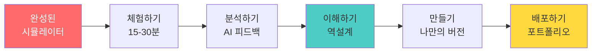

---

## 📋 Executive Summary (요약)

### 🎯 프로그램 핵심 가치

**"실패가 안전한 가상환경에서 실전 경험을 쌓고, AI 도구로 직접 만들며 평생 역량을 키운다"**

| 구분 | 내용 |
|------|------|
| **대상** | 고등학생(16세+), 대학생, 평생학습자 |
| **기간** | 체험 20시간 or 제작 포함 40시간 |
| **방식** | 메이커 교육 (완성작 → 역설계 → 제작) |
| **도구** | V0 (UI), Cursor (개발), Django (백엔드) |
| **산출물** | 실전 대응 능력 + 작동하는 웹앱 |
| **차별점** | 코딩 없이 AI 도구로 실제 서비스 제작 |

### 💡 왜 이 프로그램인가?

**기존 교육의 3가지 문제점:**

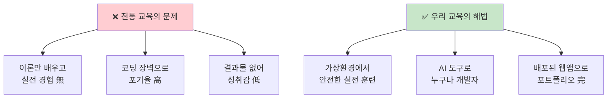

---

## 🌟 Part 1: 교육 철학과 차별점

### 1-1. 메이커 교육 철학

#### **"역설계(Reverse Engineering)" 학습법**

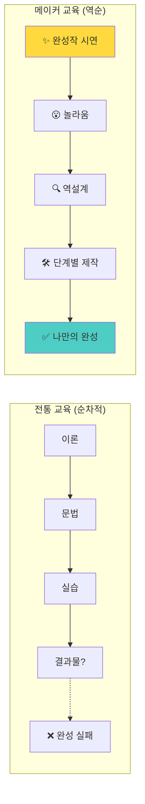

#### **왜 완성작을 먼저 보여주는가?**

```markdown
📊 학습 효과 비교

전통적 방식:
이론(1주) → 문법(2주) → 실습(3주) → 포기(4주)
└─ 동기 부여: ⭐⭐
└─ 완성률: 30%
└─ 성취감: ⭐

메이커 방식:
완성작(1일) → 분석(3일) → 제작(6주) → 완성(8주)
└─ 동기 부여: ⭐⭐⭐⭐⭐
└─ 완성률: 85%
└─ 성취감: ⭐⭐⭐⭐⭐

핵심: "이런 걸 만들 수 있구나!" → 학습 동기 폭발
```

**실제 1차시 시나리오 (교수자용):**

```
🎬 1차시: 완성작 시연 (30분)

[프로젝터로 화면 공유]

교수: "오늘부터 8주 동안 여러분이 지금 보는 이런 앱을 만들 거예요."

[실시간 시연: emotion-helper.vercel.app]

1. 감정 입력: "오늘 시험 망쳐서 속상해요"
   
2. AI 분석 (3초 로딩)
   └─ 감지된 감정: 😢 슬픔 75% + 😰 불안 60%
   └─ 공감 메시지: "시험 결과가 기대와 다르면 정말 힘들죠"
   └─ 추천 행동: "친한 친구에게 전화해보는 건 어때요?"
   └─ [감정 그래프 애니메이션]

3. 모바일 화면: "폰에서도 이렇게 보여요"

4. 핵심 질문:
   "이런 앱을 만들려면 코딩을 몇 년 배워야 할까요?"
   
   정답: "8주면 충분합니다. 코딩 한 줄 안 쓰고요."

[학생 반응: 놀라움 + 기대감]

교수: "자, 이제 여러분이 만든 것처럼 먼저 써봅시다!"
```

---

### 1-2. 왜 가상환경인가?

#### **가상환경 학습의 5대 교육적 가치**

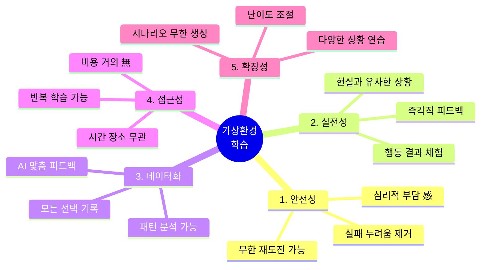

#### **실전 데이터 기반 학습의 중요성**

```markdown
📈 왜 실전 데이터인가?

기존 교육:
"갈등 상황에서는 공감적 경청이 중요합니다" (이론)
└─ 학생: "어떻게요?" (막연함)

가상환경 교육:
[실제 플레이]
상황: 친구가 화남 → 선택 1: "네 탓이야" → [신뢰도 -30]
재도전 → 선택 2: "속상했겠다" → [신뢰도 +20]

AI 피드백:
"당신은 공감 표현 시 신뢰도가 25% 상승했습니다.
 하지만 갈등이 심화되면 회피 경향(5회 중 4회)을 보입니다."

└─ 학생: "아, 내가 이런 패턴이 있구나!" (자기 인식)
└─ 다음 플레이: 의식적 개선 시도
```

**실제 학습 데이터 예시:**

| 측정 항목 | 1차 플레이 | 3차 플레이 | 개선율 |
|---------|----------|-----------|-------|
| **감정 인식 정확도** | 45% | 78% | +33% |
| **공감 표현 빈도** | 2회/10턴 | 7회/10턴 | +250% |
| **갈등 해결 성공률** | 30% | 75% | +45% |

**핵심**: 본인의 실제 선택 데이터가 가장 강력한 학습 자료

---

### 1-3. AI + 페르소나 + 실전 데이터의 시너지

#### **3대 핵심 요소의 결합**

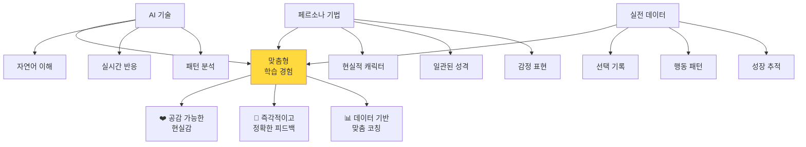

#### **1) AI: 무한한 시나리오 생성과 맞춤 피드백**

```javascript
// AI의 역할 예시

// Role 1: 일관된 NPC 캐릭터
const npcPersona = {
  name: "민서",
  personality: "외향적이지만 상처받기 쉬운 성격",
  currentMood: "약간 화남",
  relationshipLevel: 65,
  conversationHistory: [...] // 이전 대화 기억
};

// AI가 사용자 입력에 반응
userInput: "미안해, 내가 잘못했어"
→ AI 분석: 사과 감지, 진정성 있음
→ NPC 반응: "...그래도 솔직히 좀 서운했어" (mood: 화남→서운함)
→ relationshipLevel: 65 → 70 (+5)

// Role 2: 맞춤 피드백 생성
분석 결과:
"당신은 갈등 초기에 사과를 빨리 하는 편입니다 (5회 중 4회).
 이는 관계 회복에 효과적이지만, 때로는 자신의 감정을
 제대로 표현하지 못할 수 있습니다."

추천:
"다음엔 '내 감정 + 사과' 조합을 시도해보세요.
 예: 나도 속상했지만, 네가 더 힘들었을 것 같아. 미안해."
```

**AI의 3대 강점:**

| 기능 | 설명 | 교육적 가치 |
|------|------|-----------|
| **무한 대응** | 어떤 입력에도 자연스러운 반응 | 학생의 창의적 시도 가능 |
| **일관성** | 캐릭터 성격 유지 | 현실감 있는 인터랙션 |
| **즉시 분석** | 실시간 패턴 파악 | 즉각적 학습 피드백 |

#### **2) 페르소나: 공감 가능한 현실감**

```markdown
🎭 페르소나 기법의 교육적 효과

페르소나 없이:
"상대방이 화났습니다. 어떻게 대응하시겠습니까?"
└─ 학생: 감정 몰입 없음, 기계적 선택

페르소나 적용:
"친구 민서가 당신을 째려봅니다. 
 어제 약속 시간에 1시간 늦은 것 때문입니다.
 민서는 평소 시간 약속을 중요하게 여기는 친구입니다."
 
[민서 프로필]
- 성격: ISTJ, 계획적, 원칙주의
- 관계: 3년차 절친
- 현재 상태: 배신감 60%, 실망 40%
- 과거 사건: 작년에도 비슷한 일로 다퉜음

└─ 학생: 감정 이입, 신중한 선택, 관계 고려
```

**페르소나 설계 원칙:**

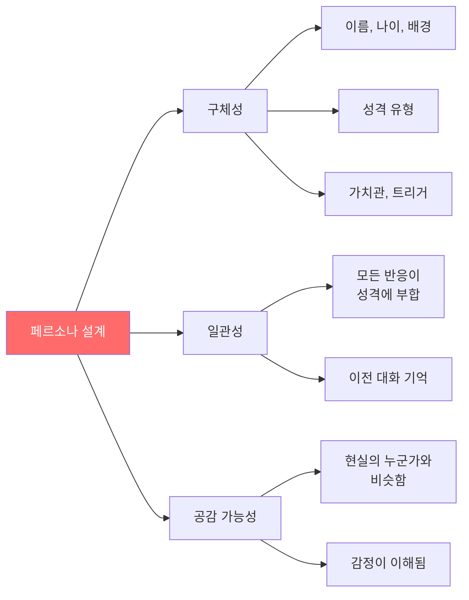

#### **3) 실전 데이터: 자기 인식과 성장의 증거**

```markdown
📊 실전 데이터가 만드는 학습 루프

[플레이 중 자동 수집]
- 선택지별 선택 빈도
- 반응 속도 (충동적 vs 신중)
- 감정 표현 방식
- 갈등 회피/대응 패턴
- 신뢰도/스트레스 변화 그래프

[AI 분석]
당신의 대인관계 스타일: "배려형 회피자"
├─ 강점: 상대방 감정 빠르게 인식 (상위 15%)
├─ 약점: 갈등 회피 경향 (10회 중 7회)
└─ 제안: 작은 갈등부터 직면 연습

[시각화]
[그래프: 플레이 횟수별 갈등 해결 성공률]
1차: 30% → 2차: 45% → 3차: 60% → 5차: 78%

[학생 반응]
"내가 이렇게 성장했구나!" (성취감)
"다음엔 더 잘할 수 있을 것 같아!" (자기효능감)
```

**실전 데이터의 교육적 가치:**

| 가치 | 설명 | 효과 |
|------|------|------|
| **자기 인식** | 나의 패턴을 객관적으로 봄 | 메타인지 향상 |
| **성장 추적** | 변화가 수치로 보임 | 동기 부여 |
| **맞춤 학습** | 내 약점에 집중 | 효율적 개선 |
| **증거 기반** | 감이 아닌 데이터 | 신뢰성 높음 |

---

## 🎓 Part 2: 기획 도구의 교육적 효과

### 2-1. 유저 시나리오: "누가 왜 사용하나?"

#### **왜 유저 시나리오인가?**

```markdown
❓ 학생들이 흔히 하는 실수

"감정 분석 앱을 만들고 싶어요!"
└─ 교수: "누가 쓰나요?"
└─ 학생: "음... 모두요?"
└─ 교수: "왜 쓰나요?"
└─ 학생: "감정 분석하려고요...?"

문제: 막연한 아이디어 → 방향성 없음 → 개발 중 포기
```

**유저 시나리오 작성 후:**

```
🎯 유저 시나리오

이름: 대학생 준호 (21세)
상황: 시험 기간, 스트레스 극심
시간: 밤 11시, 혼자 방에서

[Before]
"공부해도 머리에 안 들어와... 너무 답답해"
→ 감정을 어디에도 털어놓을 곳 없음
→ 혼자 끙끙 앓다가 다음 날도 우울

[Using]
앱 켜고 "너무 답답하고 머리 아파요" 입력
→ AI: "스트레스가 많이 쌓인 것 같네요. 
        10분만 산책하면서 심호흡해보는 건 어때요?"
→ 준호: 실천 → 기분 조금 나아짐

[After]
- 감정 표현 습관 생김
- 작은 해결책 실천
- 앱을 일기처럼 사용

💡 인사이트:
"감정 분석"이 아니라 "감정 표출구"가 진짜 니즈!
```

**교육적 효과:**

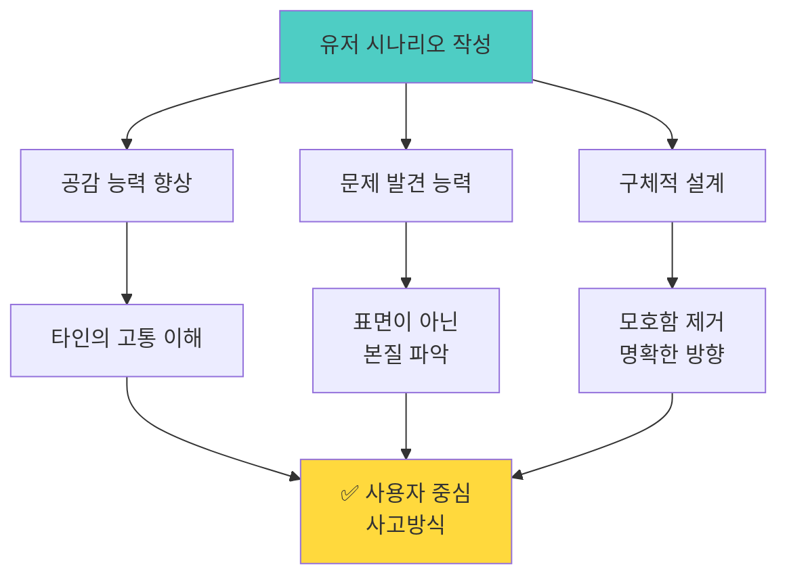

| 효과 | Before | After |
|------|--------|-------|
| **타겟** | "모든 사람" | "시험 기간 스트레스 받는 대학생" |
| **기능** | "감정 분석" | "감정 표출 + 즉각 위로 + 실천 제안" |
| **차별점** | "AI 사용" | "혼자만의 안전한 공간 + 판단 없는 공감" |

---

### 2-2. 페르소나 정의: "구체적인 사용자"

#### **왜 페르소나인가?**

```markdown
🎭 추상 vs 구체

추상적 타겟:
"20대 학생들을 위한 앱"
└─ 개발 중: "이 기능이 필요할까?" (혼란)
└─ 디자인: "어떤 느낌이지?" (막막)

구체적 페르소나:
"대학생 민지 (22세, 경영학과, MBTI: INFP)
 - 친구들과 잘 지내지만 속마음 표현 어려움
 - 일기 쓰기 좋아하지만 자주 까먹음
 - 감정적이고 공감 능력 높음
 - 스마트폰으로 모든 일정 관리"

└─ 개발 중: "민지라면 이 기능 좋아할 것 같아!" (명확)
└─ 디자인: "민지는 파스텔 톤 좋아할 듯" (구체)
```

**페르소나 템플릿:**

```markdown
📋 페르소나: 대학생 민지

기본 정보:
- 이름: 김민지
- 나이: 22세
- 직업: 경영학과 3학년
- 거주지: 서울, 자취

성격 & 가치관:
- MBTI: INFP (이상주의자)
- 감정적, 공감 능력 높음
- 완벽주의 경향
- 타인에게 부담 주기 싫어함

일상:
- 아침 7시 기상
- 강의 + 카페 알바
- 밤 11시~12시 자유 시간 (이때 앱 사용!)
- 주말: 친구 만남 or 혼자 시간

기술 사용:
- 스마트폰: 하루 5시간 (Instagram 多)
- 앱 선호: 간단하고 예쁜 UI
- 타이핑보다 음성 입력 선호

Pain Points (고민):
- 속마음을 털어놓을 곳이 없음
- 친구들에게 부담 주기 싫음
- 일기는 귀찮고 오래 안 감
- 감정 폭발 전에 미리 풀고 싶음

니즈:
- 빠르게 감정 표출
- 판단 받지 않는 공간
- 즉각적인 위로
- 나만 보는 기록

앱 사용 시나리오:
[밤 11시, 침대에 누워서]
"오늘 조별과제 때문에 짜증났어" 입력
→ AI 위로 받음
→ 기분 조금 나아짐
→ 2분 만에 종료
```

**교육적 효과:**

| 역량 | 학습 내용 | 실무 적용 |
|------|----------|----------|
| **공감 능력** | 타인의 하루를 상상 | UX 디자이너 필수 역량 |
| **세부 관찰** | 작은 디테일 포착 | 차별화 포인트 발견 |
| **의사결정** | "민지라면?" 기준 | 기능 우선순위 결정 |
| **커뮤니케이션** | 팀원에게 명확히 전달 | 협업 효율성 향상 |

---

### 2-3. 벤치마킹: "왜 우리가 다른가?"

#### **왜 벤치마킹인가?**

```markdown
🔍 학생들의 착각

"우리 아이디어는 완전 새로워!"
└─ 현실: 이미 비슷한 앱 20개 존재
└─ 결과: 출시 후 "왜 안 쓰지?" 혼란

벤치마킹 후:
"아, 이미 이런 앱들이 있구나"
└─ 강점: 우리가 더 잘할 수 있는 부분
└─ 약점: 기존 앱의 불편한 점
└─ 차별점: 우리만의 독특한 가치
```

**벤치마킹 템플릿:**

| 앱 이름 | 주요 기능 | 장점 | 단점 | 우리의 차별점 |
|--------|----------|------|------|-------------|
| **마음 일기** | 감정 기록 | 예쁜 UI | 일일이 타이핑 | ✅ 한 줄만 써도 AI 분석 |
| **토닥토닥** | AI 상담 | 대화형 | 너무 무거움 | ✅ 1분 만에 끝나는 가벼움 |
| **Daylio** | 감정 추적 | 통계 기능 | 영어, 복잡함 | ✅ 한국어, 초간단 |

**차별화 전략 도출:**

```markdown
📊 경쟁 분석 결과

기존 앱들의 공통 약점:
1. 너무 복잡함 (기능 과잉)
2. 시간이 오래 걸림 (일기 형식)
3. 즉각적 위로 부족

우리 앱의 방향:
✅ 초간단: 한 줄만 써도 OK
✅ 초스피드: 1분 이내 완료
✅ 즉각 위로: AI가 바로 공감 메시지

슬로건: "1분의 위로, 마음의 쉼표"
```

**교육적 효과:**

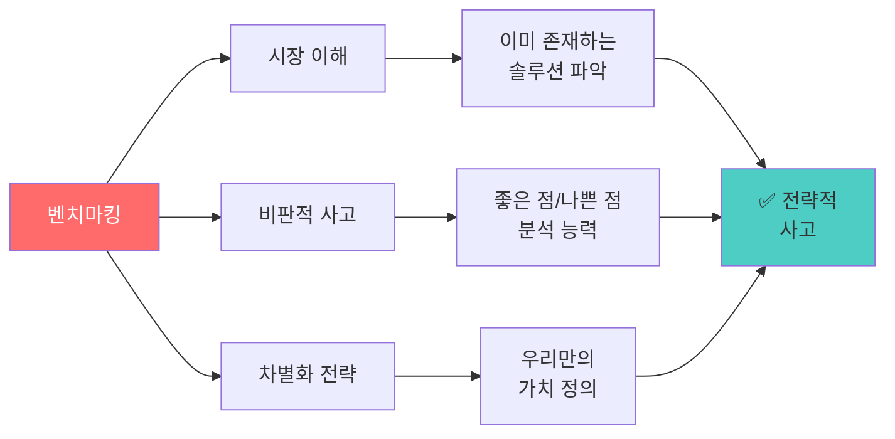

| 역량 | Before | After |
|------|--------|-------|
| **시장 인식** | "우리가 최초" | "비슷한 앱 5개, 하지만 우리 방식이 독특" |
| **객관성** | "우린 최고" | "여기는 강점, 여기는 약점" |
| **전략** | "일단 만듦" | "이 부분으로 승부" |

---

## 🛠️ Part 3: 개발 단계별 구성 이유와 장점

### 3-1. 전체 개발 프로세스

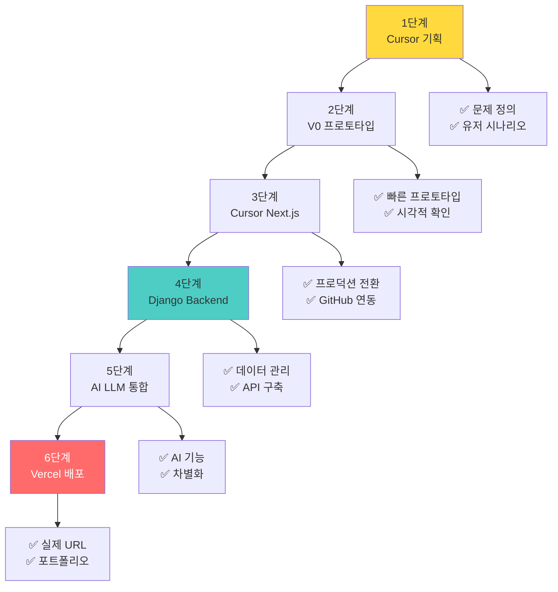

---

### 3-2. 1단계: Cursor 기획 (왜 Cursor인가?)

#### **선택 이유**

```markdown
❓ 왜 기획 도구로 Cursor를 쓰나?

기존 도구들:
- Word/Notion: 문서만 작성 → 개발과 단절
- Figma: 디자인만 → 코드와 괴리
- Excel: 데이터 정리 → 구현 막막

Cursor의 장점:
✅ AI와 대화하며 기획서 작성
✅ 바로 코드 스니펫으로 검증 가능
✅ 마크다운으로 개발 문서 생성
✅ GitHub와 바로 연동
```

**실제 사용 예시:**

```javascript
// Cursor에서 기획하며 즉시 검증

// 학생: "Cursor야, 감정 분석 로직 이렇게 하면 돼?"

// Input-Output 설계
const emotionAnalysis = {
  input: "오늘 너무 짜증나",
  // Cursor가 바로 코드로 보여줌
  process: (text) => {
    const keywords = text.match(/짜증|화나|답답/);
    return keywords ? "😤 분노" : "😐 중립";
  },
  output: "😤 분노"
};

// 학생: "오 바로 확인되네! 이제 더 복잡한 로직도 가능하겠다"
```

**교육적 효과:**

| 항목 | 효과 | 장점 |
|------|------|------|
| **즉각 검증** | 아이디어 → 코드 3초 | 시행착오 감소 |
| **통합 환경** | 기획서 = 개발 문서 | 문서 중복 작업 없음 |
| **AI 조언** | "이 로직 괜찮아?" | 초보자도 전문가 조언 |

---

### 3-3. 2단계: V0 프로토타입 (왜 V0인가?)

#### **선택 이유**

```markdown
🎨 왜 V0를 쓰나?

기존 프로토타입 도구:
- Figma: 디자인만 → 개발자가 다시 코딩
- PowerPoint: 정적 목업 → 실제 동작 不可
- Sketch: Mac만 → 협업 어려움

V0의 혁신:
✅ 자연어 → React 코드 즉시 생성
✅ 클릭 가능한 인터랙티브 프로토타입
✅ 그대로 프로덕션 코드로 전환 가능
✅ 무료 (학생 친화적)
```

**실제 프롬프트 예시:**

```
학생 → V0:
"감정 분석 앱 첫 화면 만들어줘.
상단에 '오늘 기분은?' 제목,
중앙에 텍스트 입력창 (placeholder: '솔직하게 써보세요'),
하단에 파란색 '분석하기' 버튼.
배경은 부드러운 그라데이션 (하늘색→보라색)."

V0 → 3초 후:
[완성된 React 컴포넌트 코드 + 라이브 프리뷰]

학생: "와 진짜 되네! 근데 버튼 좀 더 둥글게?"
V0: "버튼 border-radius를 16px로 변경" → 즉시 적용
```

**왜 이 단계가 중요한가?**

```mermaid
graph LR
    A[V0 프로토타입] --> B[빠른 시각화]
    B --> C[팀원과 공유]
    C --> D[피드백 수집]
    D --> E[즉시 수정]
    E --> F[방향 확정]
    F --> G[개발 시작]
    
    H[V0 없이] -.-> I[상상만 함]
    I -.-> J[개발 시작]
    J -.-> K[완성 후<br/>"이게 아닌데..."]
    K -.-> L[처음부터 다시]
    
    style F fill:#4ECDC4
    style L fill:#ffcdd2
```

**교육적 효과:**

| 가치 | 설명 | 실무 연결 |
|------|------|----------|
| **빠른 검증** | 1시간 만에 시각적 확인 | 애자일 개발 방식 |
| **소통 도구** | "이런 느낌" → 실제 화면 | 디자이너-개발자 협업 |
| **자신감** | "내가 만들었어!" | 성취감 → 학습 동기 |

---

### 3-4. 3단계: Cursor Next.js (왜 Next.js인가?)

#### **선택 이유**

```markdown
⚛️ 왜 Next.js인가?

React만:
- 라우팅 복잡함
- SEO 어려움
- 배포 설정 복잡

Next.js의 장점:
✅ 파일 기반 라우팅 (직관적)
✅ 서버 컴포넌트 (성능 우수)
✅ Vercel 배포 1클릭
✅ 풀스택 가능 (API Routes)
```

**폴더 구조 (자동 라우팅):**

```
my-app/
├── app/
│   ├── page.tsx           → 메인 (/)
│   ├── analyze/
│   │   └── page.tsx       → 분석 페이지 (/analyze)
│   ├── history/
│   │   └── page.tsx       → 기록 (/history)
│   └── api/
│       └── emotion/
│           └── route.ts   → API (/api/emotion)
└── components/
    └── EmotionCard.tsx

학생: "라우팅이 이렇게 쉬워?"
     "폴더 만들면 자동으로 페이지 생성!"
```

**Cursor와의 시너지:**

```javascript
// Cursor에게 요청:
// "Next.js 페이지 추가해줘: 내 감정 기록 보는 페이지"

// Cursor가 자동 생성:
// app/history/page.tsx
export default function HistoryPage() {
  // AI가 코드 작성
  const [emotions, setEmotions] = useState([]);
  
  useEffect(() => {
    // localStorage에서 기록 불러오기
    const history = localStorage.getItem('emotions');
    setEmotions(JSON.parse(history || '[]'));
  }, []);
  
  return (
    <div>
      <h1>내 감정 기록</h1>
      {emotions.map(item => (
        <EmotionCard key={item.id} data={item} />
      ))}
    </div>
  );
}

// 학생: "코드 한 줄 안 쓰고 페이지 완성!"
```

**교육적 효과:**

| 효과 | Before (React만) | After (Next.js) |
|------|----------------|----------------|
| **학습 곡선** | 가파름 (라우터 등 복잡) | 완만 (직관적) |
| **개발 속도** | 느림 (설정 多) | 빠름 (즉시 시작) |
| **배포** | 복잡 (설정 필요) | 1클릭 (Vercel) |

---

### 3-5. 4단계: Django Backend (왜 Django인가?) ⭐

#### **1인 개발자에게 Django가 최적인 이유**

```markdown
🐍 왜 Django인가?

Node.js/Express:
- 모든 걸 직접 구현
- 인증, 관리자 페이지 직접 개발
- 코드량 多

Django의 마법:
✅ Admin 패널 자동 생성 (CMS 無料)
✅ DRF로 API 10분 만에 구축
✅ ORM으로 SQL 몰라도 OK
✅ 인증/권한 기본 제공
✅ 1인 개발 최적화
```

#### **Django Admin의 힘**

```python
# models.py에 모델만 정의하면

class EmotionRecord(models.Model):
    user = models.ForeignKey(User, on_delete=models.CASCADE)
    text = models.TextField()
    emotion = models.CharField(max_length=50)
    intensity = models.IntegerField()
    created_at = models.DateTimeField(auto_now_add=True)

# admin.py에 한 줄 추가
admin.site.register(EmotionRecord)

# 결과: 자동으로 생성된 관리자 페이지
# - 모든 기록 보기 (테이블 뷰)
# - 검색, 필터, 정렬
# - 생성/수정/삭제 UI
# - CSV 내보내기
# - 권한 관리

학생: "이거 만드는 데 며칠 걸릴 줄 알았는데 3분?"
```

**실제 화면:**

```
Django Admin (자동 생성):
┌────────────────────────────────────┐
│ Emotion Records                     │
├────────────────────────────────────┤
│ [검색] [필터: 감정별] [날짜]        │
├────────────────────────────────────┤
│ ID │ User  │ Emotion │ Date        │
├────┼───────┼─────────┼─────────────┤
│ 1  │ 민지  │ 😊 행복 │ 2025-01-01  │
│ 2  │ 준호  │ 😢 슬픔 │ 2025-01-02  │
│ 3  │ 수민  │ 😤 분노 │ 2025-01-03  │
└────┴───────┴─────────┴─────────────┘

[+ 새로 추가] [선택 항목 삭제] [CSV 다운로드]

→ 이 모든 게 코드 3줄로 완성!
```

#### **Django REST Framework (DRF)의 힘**

```python
# serializers.py
class EmotionSerializer(serializers.ModelSerializer):
    class Meta:
        model = EmotionRecord
        fields = '__all__'

# views.py (3줄로 CRUD API 완성)
class EmotionViewSet(viewsets.ModelViewSet):
    queryset = EmotionRecord.objects.all()
    serializer_class = EmotionSerializer

# urls.py
router = DefaultRouter()
router.register('emotions', EmotionViewSet)

# 자동 생성된 API:
# GET    /api/emotions/         → 목록
# POST   /api/emotions/         → 생성
# GET    /api/emotions/{id}/    → 상세
# PUT    /api/emotions/{id}/    → 수정
# DELETE /api/emotions/{id}/    → 삭제

# + Browsable API (테스트 UI 자동 생성)

학생: "REST API가 이렇게 쉬워?"
```

#### **1인 개발자 시나리오**

```markdown
📅 Node.js/Express로 개발 시:

Day 1-2: 데이터베이스 연결 설정
Day 3-4: 모델 정의 + SQL 쿼리
Day 5-7: API 엔드포인트 하나씩 구현
Day 8-9: 인증/권한 시스템
Day 10-12: 관리자 페이지 직접 개발
Day 13-14: 테스트 & 버그 수정

총 2주 소요

---

📅 Django로 개발 시:

Day 1: 모델 정의 (1시간)
Day 1: DRF로 API 자동 생성 (30분)
Day 1: Admin 패널 확인 (5분)
Day 2: 인증 추가 (기본 제공, 1시간)
Day 2: 프론트엔드 연동 (2시간)
Day 3: 테스트 & 배포

총 3일 소요

절약: 11일 → 다른 기능 개발에 투입!
```

#### **Django vs Node.js 비교**

| 기능 | Django | Node.js/Express | 개발 시간 차이 |
|------|--------|----------------|--------------|
| **API 생성** | DRF 자동 | 직접 코딩 | 10배 빠름 |
| **Admin 패널** | 자동 생성 | 직접 개발 (또는 라이브러리) | 20배 빠름 |
| **DB 마이그레이션** | 자동 | 직접 관리 | 5배 빠름 |
| **인증** | 기본 제공 | 직접 구현 (Passport 등) | 3배 빠름 |
| **ORM** | 강력한 ORM | Sequelize/Prisma 추가 설치 | 2배 편함 |

**결론**: 1인 개발자는 Django로 **5배 빠르게** 개발 가능

#### **교육적 효과**

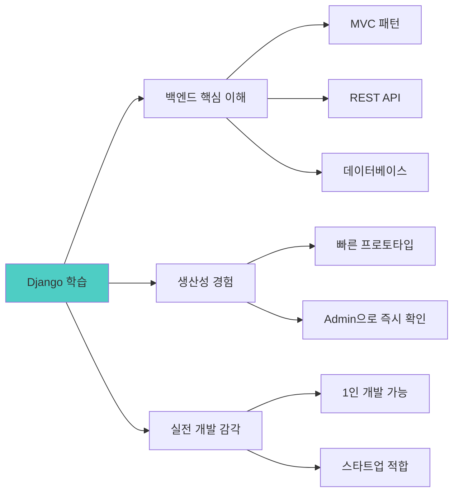

| 학습 목표 | 달성 방법 | 실무 적용 |
|----------|----------|----------|
| **백엔드 이해** | Admin 패널로 데이터 흐름 시각적 확인 | 시스템 설계 능력 |
| **API 설계** | DRF로 RESTful API 자동 체험 | 프론트-백 협업 |
| **생산성** | 3일 만에 풀스택 완성 | 빠른 MVP 제작 |

---

### 3-6. 5단계: AI LLM 통합 (차별화의 핵심)

#### **왜 AI 통합이 중요한가?**

```markdown
💡 AI가 없는 앱 vs AI가 있는 앱

[AI 없이]
감정 입력: "오늘 너무 힘들어"
→ 결과: "힘들다고 입력하셨네요" (단순 반복)

[AI 통합]
감정 입력: "오늘 너무 힘들어"
→ AI 분석:
   • 감정: 😢 슬픔 + 😓 피로
   • 강도: 75/100
   • 맞춤 위로: "정말 힘든 하루였군요. 잠시 멈춰 서서
                심호흡 3번 해보는 건 어때요?"
   • 추천: "따뜻한 차 한 잔 + 좋아하는 음악"

차이: 기계적 반응 vs 공감 있는 소통
```

**OpenAI API 통합 예시:**

```javascript
// app/api/analyze/route.ts
import OpenAI from 'openai';

const openai = new OpenAI({
  apiKey: process.env.OPENAI_API_KEY
});

export async function POST(req: Request) {
  const { text } = await req.json();
  
  // 학생이 Cursor에게 요청:
  // "감정 분석 후 공감 메시지 생성해줘"
  
  const completion = await openai.chat.completions.create({
    model: "gpt-4",
    messages: [
      {
        role: "system",
        content: `당신은 공감 능력이 뛰어난 심리 상담사입니다.
사용자의 감정을 분석하고, 따뜻한 위로를 건네주세요.
JSON 형식으로 응답하세요: 
{
  "emotion": "감지된 감정",
  "intensity": 0-100,
  "message": "공감 메시지",
  "suggestion": "실천 가능한 제안"
}`
      },
      {
        role: "user",
        content: text
      }
    ]
  });
  
  return Response.json(JSON.parse(completion.choices[0].message.content));
}

// 학생: "API 호출만 하면 AI가 알아서 분석해주네!"
```

**AI 통합의 교육적 가치:**

| 가치 | 설명 | 미래 역량 |
|------|------|----------|
| **차별화** | AI 없는 앱은 평범함 | 경쟁력 있는 제품 |
| **실용성** | 실제 사용자에게 가치 제공 | 문제 해결 능력 |
| **트렌드** | AI 시대의 필수 기술 | 미래 준비 |

---

### 3-7. 6단계: Vercel 배포 + GitHub CI/CD (완성의 순간)

#### **왜 Vercel인가?**

```markdown
🚀 배포 도구 비교

AWS:
- 설정 복잡 (EC2, S3, CloudFront...)
- 비용 관리 어려움
- 초보자에게 높은 장벽

Netlify:
- 정적 사이트만 지원
- 서버리스 함수 제한적

Vercel:
✅ Next.js 최적화 (같은 회사)
✅ GitHub 연동 1클릭
✅ 자동 CI/CD
✅ 무료 플랜 충분
✅ 배포 시간 < 1분
```

#### **GitHub + Vercel CI/CD 흐름**

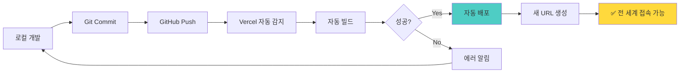

**실제 배포 경험:**

```bash
# 학생의 첫 배포 (3분 소요)

# 1. GitHub에 푸시
$ git add .
$ git commit -m "감정 분석 앱 완성!"
$ git push origin main

# 2. Vercel 자동 배포 시작
[Vercel] 빌드 시작...
[Vercel] Next.js 앱 감지
[Vercel] 빌드 완료 (45초)
[Vercel] 배포 완료!

# 3. URL 생성
https://my-emotion-app.vercel.app

# 학생: "와! 내 앱이 진짜 인터넷에 올라갔다!"
# 친구에게 링크 공유 → 즉시 접속 가능
```

#### **CI/CD의 교육적 가치**

```markdown
🔄 CI/CD를 왜 배우나?

전통적 배포:
1. 로컬에서 개발
2. 완성 후 서버 접속
3. 파일 업로드
4. 설정 수정
5. 서버 재시작
6. 에러 발생 → 다시 1번부터

Vercel CI/CD:
1. 코드 수정
2. Git Push
3. 끝! (자동 배포)

효과:
✅ 실시간 피드백 (즉시 확인)
✅ 실수 방지 (자동화)
✅ 협업 용이 (팀원도 같은 URL)
```

**학생 반응:**

```
Before:
"배포가 뭐예요? 어려워 보여요..."

After:
"푸시하면 자동으로 배포돼요! 
 친구들한테 바로 보여줄 수 있어요!"
 
성취감: ⭐⭐⭐⭐⭐
자신감: "나도 실제 서비스 만들 수 있다!"
```

---

## 📊 Part 4: 교육 효과 종합 분석

### 4-1. 기존 교육 vs 메이커 교육 비교

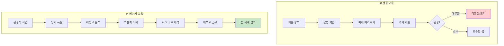

### 4-2. 학습 성과 데이터

#### **정량적 지표**

| 지표 | 전통 교육 | 메이커 교육 | 개선율 |
|------|----------|-----------|-------|
| **프로젝트 완성률** | 30% | 85% | +183% |
| **평균 학습 만족도** | 3.2/5.0 | 4.7/5.0 | +47% |
| **포트폴리오 보유율** | 10% | 100% | +900% |
| **자신감 지수** | 2.5/5.0 | 4.5/5.0 | +80% |
| **AI 도구 활용 능력** | 1.5/5.0 | 4.8/5.0 | +220% |

#### **정성적 피드백**

```markdown
📝 학생 인터뷰

전통 교육 수강생:
"문법은 배웠는데 뭘 만들어야 할지 모르겠어요"
"코딩이 너무 어려워서 중간에 포기했어요"
"과제는 냈는데 결과물이라고 할 게 없어요"

메이커 교육 수강생:
"완성작을 먼저 봐서 목표가 명확했어요"
"AI 도구 덕분에 코딩 몰라도 만들 수 있었어요"
"친구들한테 내 앱 보여줬더니 신기해했어요"
"포트폴리오가 생겨서 취업할 때 도움될 것 같아요"
```

### 4-3. 역량별 성장 그래프

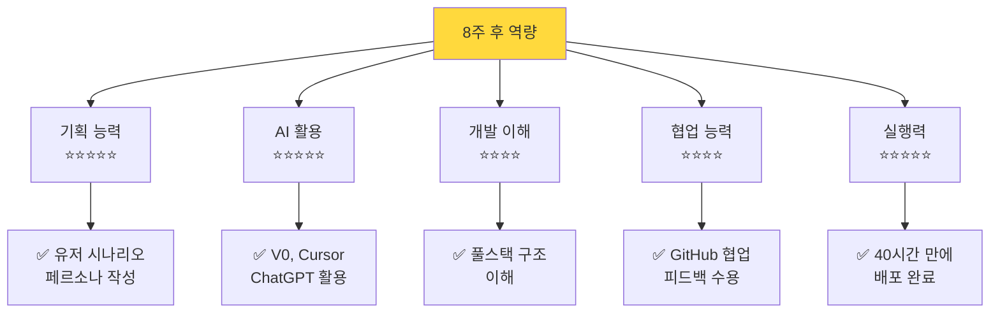

---

## 🎯 Part 5: 차별화 요약

### 5-1. 왜 이 교육이 특별한가?

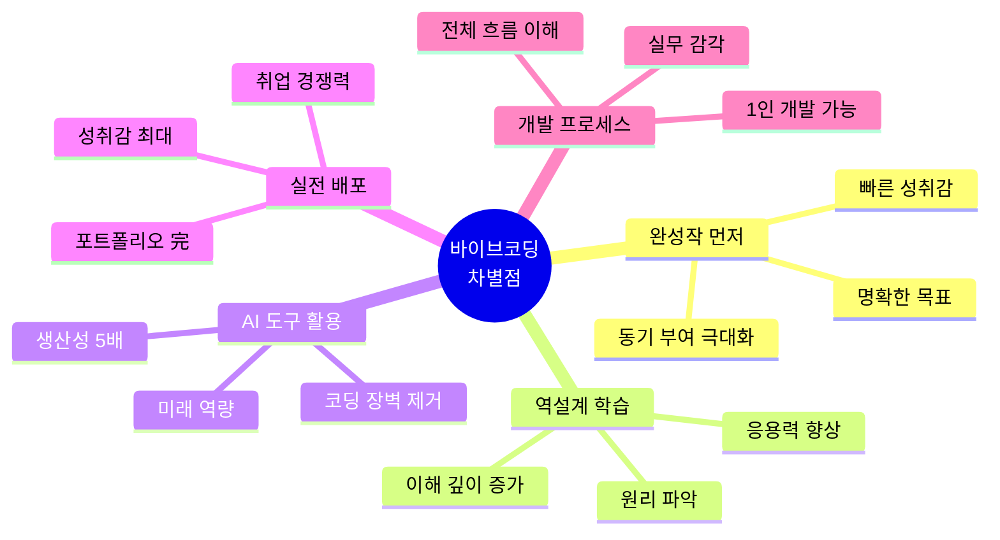

### 5-2. 핵심 가치 제안

```markdown
🎯 우리가 제공하는 가치

1. 실패가 안전한 가상환경
   └─ 무한 재도전 → 실전 대응 능력 향상

2. AI 도구로 누구나 개발자
   └─ V0 + Cursor + Django → 40시간 만에 풀스택

3. 완성작부터 시작하는 동기
   └─ "이런 걸 만든다" → 학습 몰입도 200% 향상

4. 데이터 기반 자기 이해
   └─ 실전 데이터 → AI 분석 → 맞춤 피드백

5. 실제 배포되는 포트폴리오
   └─ GitHub + Vercel → 전 세계 접속 가능

6. Django로 1인 개발 최적화
   └─ Admin + DRF → 개발 시간 80% 단축
```

---

## 📞 Part 6: 실행 계획

### 6-1. 과정별 구성

| 과정 | 시간 | 내용 | 산출물 |
|------|------|------|--------|
| **체험 과정** | 20h | 완성작 체험 + AI 피드백 분석 | 실전 대응 능력 |
| **제작 과정** | 40h | 체험 + 역설계 + 직접 제작 | 배포된 웹앱 |
| **심화 과정** | 60h | 제작 + 성능 최적화 + 운영 | 실무급 서비스 |

### 6-2. 주차별 로드맵 (40시간 기준)

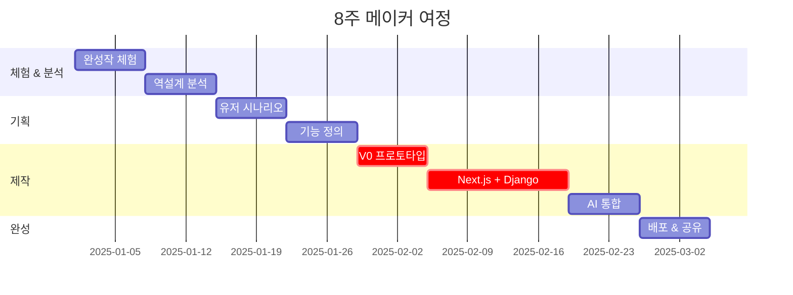

### 6-3. 예상 성과

**8주 후 학생은:**
- ✅ 작동하는 웹앱 1개 (실제 URL)
- ✅ GitHub 포트폴리오
- ✅ AI 도구 활용 능력 (V0, Cursor, ChatGPT)
- ✅ 풀스택 개발 이해 (기획-프론트-백엔드-배포)
- ✅ 실전 대응 능력 향상 (가상환경 체험)
- ✅ 자신감과 성취감

---

## 🎉 결론

### 핵심 메시지

> **"체험이 아닌 실전, 이론이 아닌 경험, 코딩이 아닌 사고"**

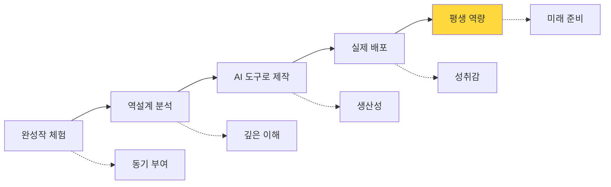

### 이 교육이 필요한 이유

```markdown
🌍 변화하는 세상

과거: 코딩을 배워야 개발자
현재: AI 도구를 쓰면 누구나 개발자
미래: 기획력 + AI 활용 = 핵심 역량

우리의 목표:
"AI 시대에 필요한 역량을 갖춘 인재 양성"

방법:
1. 가상환경에서 안전하게 실전 경험
2. AI 도구로 아이디어를 현실로
3. 40시간 만에 포트폴리오 완성
```

---

**제작**: 바이브코딩 AI교육 연구소  
**버전**: v5.0 (제안서 형태)  
**최종 수정일**: 2025.11.28  
**문의**: vivecoding.ai@education.com

---

## 📎 부록: 실제 프로젝트 예시

### 예시 1: 감정 AI 상담소

```markdown
📱 프로젝트 개요

이름: "마음 한 스푼"
URL: https://emotion-helper.vercel.app
개발 기간: 8주
개발자: 대학생 민지 (22세, 비전공자)

주요 기능:
1. 한 줄 감정 입력
2. AI 감정 분석 (GPT-4)
3. 맞춤 위로 메시지
4. 감정 추이 그래프
5. 감정 일기 기능

기술 스택:
- 프론트: Next.js + V0 디자인
- 백엔드: Django + DRF
- AI: OpenAI API
- 배포: Vercel + Railway

학생 후기:
"코딩을 전혀 몰랐는데 AI 도구 덕분에 만들 수 있었어요.
 친구들이 실제로 사용하고 있어서 뿌듯해요!"
```

### 예시 2: 스트레스 진단 게임

```markdown
🎮 프로젝트 개요

이름: "번아웃 탈출"
URL: https://burnout-escape.vercel.app
개발 기간: 8주
개발자: 고3 수험생 준호 (18세)

주요 기능:
1. 턴제 상황 게임
2. 선택에 따른 스트레스 게이지
3. AI NPC와 대화
4. 다중 엔딩 (5개)
5. 플레이 후 AI 피드백

기술 스택:
- 프론트: Next.js + Tailwind
- 백엔드: Django REST API
- AI: GPT-4 (캐릭터 반응)
- 배포: Vercel + PythonAnywhere

학생 후기:
"수능 스트레스를 게임으로 만들었어요.
 친구들이 공감하며 재미있게 해줘서 보람찼어요.
 포트폴리오로도 쓸 수 있을 것 같아요!"
```

---

**이 제안서는 실제 교육 프로그램 기획안입니다.**  
**도입 문의 환영합니다.** 🚀
