# 🎮 AI 가상환경 실전 체험 교육 가이드

> **5대 주제 × 3가지 실전 게임 = 15개 몰입형 학습 경험**  
> 고등학생·대학생을 위한 가상환경 기반 AI 실전 대응 훈련

---

## 📋 목차

1. [프로그램 개요](#프로그램-개요)
2. [감정 AI - 3가지 실전 게임](#감정-ai---3가지-실전-게임)
3. [여가 AI - 3가지 실전 게임](#여가-ai---3가지-실전-게임)
4. [만남 AI - 3가지 실전 게임](#만남-ai---3가지-실전-게임)
5. [성찰 AI - 3가지 실전 게임](#성찰-ai---3가지-실전-게임)
6. [돈 AI - 3가지 실전 게임](#돈-ai---3가지-실전-게임)
7. [기술 구현 가이드](#기술-구현-가이드)
8. [교육 운영 방안](#교육-운영-방안)

---

## 프로그램 개요

### 🎯 핵심 목표

**"체험하고 → 분석하고 → 직접 만들어보는 3단계 학습"**

1. **STEP 1: 체험하기** - 완성된 AI 게임을 플레이하며 실전 대응 능력 배양
2. **STEP 2: 분석하기** - AI 피드백을 통해 나의 패턴 이해
3. **STEP 3: 만들기** - 메이커 방식으로 나만의 시뮬레이터 제작

현실에서 겪을 수 있는 감정적 갈등, 관계 문제, 의사결정 상황을 AI 기반 가상환경에서 **안전하게 시뮬레이션**하고, 실시간 피드백을 통해 더 나은 대응 방식을 학습합니다. 나아가 **직접 시뮬레이터를 제작**하면서 AI 리터러시와 기획-실행 능력을 키웁니다.

### 📊 프로그램 특징

| 구분 | 내용 |
|------|------|
| **대상** | 고등학생(16세 이상), 대학생 |
| **형식** | 턴제 대화 게임 + 실시간 AI 분석 + 메이커 활동 |
| **플레이 시간** | 각 게임당 15~30분 |
| **학습 방식** | 플레이 → 분석 → 재도전 → 성찰 → 제작 |
| **핵심 기술** | GPT-4 기반 LLM, 감정 분석, 게임 로직 |
| **메이커 도구** | V0 (UI 생성), Cursor (AI 코딩), ChatGPT (기획) |
| **최종 산출물** | 실전 대응 능력 + 나만의 시뮬레이터 웹앱 |

### 🌟 기존 교육과의 차별점

**전통적 AI 교육 vs 바이브코딩 메이커 교육**

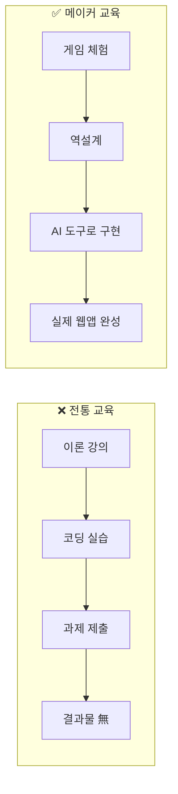

| 측면 | 전통 교육 | 바이브코딩 메이커 교육 |
|------|----------|---------------------|
| **시작점** | 문법, 이론 | 완성 게임 체험 |
| **도구** | 직접 코딩 | AI 도구 (V0/Cursor) |
| **결과물** | 연습 과제 | 작동하는 웹앱 |
| **학습 주체** | 교수 중심 | 학생 중심 |
| **코딩 필요성** | 필수 | 선택 (AI가 대신) |
| **완성 시점** | 학기 말 (또는 無) | 8주 내 |

### 🎮 게임 메카닉 공통 요소

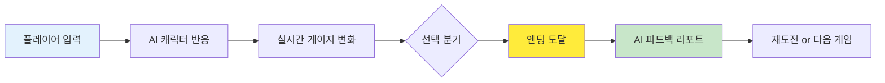

모든 게임은 다음 요소를 포함합니다:

1. **실시간 게이지**: 신뢰도, 스트레스, 감정 강도 등 시각화
2. **다중 엔딩**: 선택에 따른 3~5가지 결말
3. **AI 분석**: 플레이 후 대응 패턴 분석 및 개선 제안
4. **재도전 시스템**: 다른 선택지로 재플레이 가능
5. **성찰 일지**: 자신의 감정과 배운 점 기록

### 🔄 메이커 학습 사이클

**"먼저 체험하고, 분해하고, 직접 만들어보자!"**

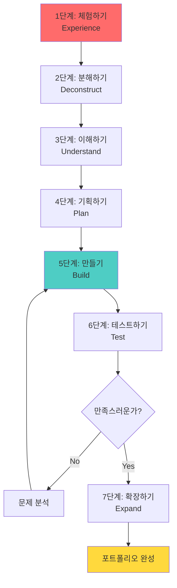

#### 8주 메이커 프로세스 (선택 과정)

게임을 체험한 후, **원하는 학생은** 직접 시뮬레이터를 만들 수 있습니다:

| 주차 | 활동 | 산출물 |
|------|------|--------|
| **Week 1-2** | 게임 체험 & 호기심 발생 | 게임 경험 노트 |
| **Week 3** | 시스템 분해 & 원리 이해 | 구조도 |
| **Week 4** | 나만의 시나리오 기획 | 기획서 + JSON |
| **Week 5-6** | AI 도구로 구현 (V0/Cursor) | 작동하는 웹앱 |
| **Week 7** | 친구 테스트 & 피드백 | 개선된 버전 |
| **Week 8** | 창의적 확장 & 포트폴리오 | GitHub 배포 |

#### 🛠️ 3가지 AI 도구 활용

코딩을 몰라도 AI 도구로 실제 웹앱을 만들 수 있습니다:

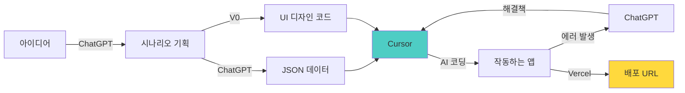

**도구별 역할:**

| 도구 | 역할 | 사용 예시 |
|------|------|----------|
| **V0 (Vercel)** | UI 디자인 → 코드 변환 | "번아웃 게이지 화면 만들어줘" → React 코드 생성 |
| **Cursor** | 기능 구현 & 코드 수정 | 주석: "AI 감정 분석 함수 추가" → 자동 코딩 |
| **ChatGPT** | 기획, 데이터, 문제 해결 | "스트레스 시뮬레이터 시나리오 20개 만들어줘" |

---

## 감정 AI - 3가지 실전 게임

### 🎭 게임 1: "감정의 미로" - 번아웃 탈출 시뮬레이터

#### **게임 콘셉트**

```
🎯 목표: 번아웃 상태에서 감정을 인식하고 건강하게 표현하는 법 배우기
⏱️ 플레이 시간: 20분
🎮 난이도: ⭐⭐⭐
📱 형식: 1인칭 대화 게임
```

**시나리오 배경**:
```
📅 시험 2주 전, 밤 11시
📍 나의 방
💭 상황: 
- 5개 과목 동시 시험 준비
- 친구들 약속 다 거절함
- 3일째 제대로 못 잠
- 공부해도 머리에 안 들어옴
- 부모님은 "조금만 더 버텨"

[게임 시작]
AI 나레이션: "당신의 심장이 빠르게 뛰고 있습니다. 
             책을 펼쳤지만 글자가 눈에 들어오지 않습니다.
             당신의 감정 상태를 점검할 시간입니다."
```

#### **페르소나: 고3 수험생 "민서"**

| 항목 | 내용 |
|------|------|
| **나이/상황** | 18세, 고3 수험생 |
| **성격** | 완벽주의, 타인 기대 의식 높음 |
| **고민** | 공부 압박, 미래 불안, 감정 표현 서툼 |
| **목표** | 좋은 대학 가기 (vs 내면 욕구: 쉬고 싶음) |

#### **AI-LLM 주요 기능**

**1. 감정 인식 AI (Emotion Detection)**

```python
# 시스템 프롬프트 예시
"""
당신은 고3 수험생 민서의 내면을 관찰하는 감정 분석 AI입니다.

플레이어의 입력에서 다음을 분석하세요:
1. 표면 감정 (말로 표현한 것)
2. 숨겨진 감정 (진짜 느끼는 것)
3. 신체 신호 (두통, 불면 등)
4. 번아웃 수치 (0-100)

출력 형식:
{
  "surface_emotion": "괜찮아요, 할 수 있어요",
  "hidden_emotion": "두렵고, 지쳤고, 도망치고 싶음",
  "body_signals": ["두통", "불면", "식욕저하"],
  "burnout_level": 85,
  "warning": "위험 수준 - 즉시 휴식 필요"
}
"""
```

**2. 감정 검증 AI (Emotion Validation)**

플레이어가 감정을 표현할 때:
- ✅ "지금 힘들다고 느끼는 게 당연해요" (검증)
- ✅ "쉬고 싶은 마음이 드는 건 나약함이 아니에요" (재구성)
- ❌ "그래도 참고 해야지" (무효화 - 게임에서 나쁜 선택지)

**3. 대안 제시 AI (Coping Strategy Generator)**

상황에 맞는 3가지 대응 방식 제시:
- A. 억지로 계속하기 (번아웃 +30)
- B. 20분 명상 후 재시작 (번아웃 -10, 집중력 +15)
- C. 부모님께 솔직히 말하기 (용기 필요, 장기적 해결)

#### **게임 메카닉**

**1) 번아웃 게이지**

```
🔥 번아웃 수치: ████████░░ 85%

위험 구간:
• 0-30%: 💚 건강 (집중력 ↑, 효율 ↑)
• 31-60%: 💛 주의 (피로 누적, 실수 증가)
• 61-80%: 🧡 경고 (집중 불가, 감정 불안정)
• 81-100%: ❤️ 위험 (신체 증상, 우울/불안)

번아웃을 낮추는 방법:
✅ 20분 이상 휴식: -15
✅ 친구에게 감정 털어놓기: -20
✅ 운동/산책: -25
✅ 8시간 수면: -30

번아웃을 높이는 방법:
❌ "조금만 더" 무시하기: +15
❌ 에너지 드링크로 버티기: +20
❌ 감정 억압하기: +10
```

**2) 감정 인식 퀘스트**

```
━━━━━━━━━━━━━━━━━━━━━━━━
💭 감정 체크포인트

AI: "지금 당신의 몸이 보내는 신호를 느껴보세요."

플레이어 선택:
A) "괜찮아, 계속할 수 있어" (감정 회피)
B) "머리가 아프고, 답답해" (신체 인식)
C) "불안하고, 무서워" (감정 인식) ✅ 정답!
D) "모르겠어, 그냥 하기 싫어" (혼란)

선택 C 시:
AI: "불안과 두려움을 느끼고 있군요. 
     그 감정을 조금 더 탐색해볼까요?"
     
     → 감정 인식 능력 +10
     → 다음 대화 트리로 이동
━━━━━━━━━━━━━━━━━━━━━━━━
```

**3) 선택 결과 시뮬레이션**

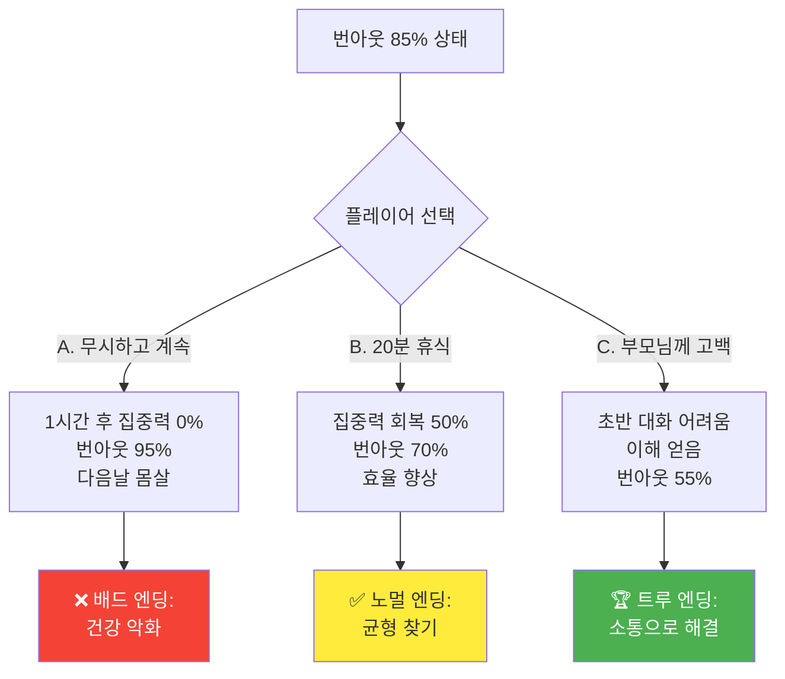

#### **엔딩 & AI 피드백**

**엔딩 1: ❌ "한계 돌파" (배드 엔딩)**
```
━━━━━━━━━━━━━━━━━━━━━━━━
당신은 감정을 무시하고 계속 공부했습니다.

2일 후...
몸이 말을 듣지 않습니다.
시험장에서 아무것도 기억나지 않습니다.

번아웃 최종: 100%
━━━━━━━━━━━━━━━━━━━━━━━━
📊 AI 분석 리포트:

❌ 감정 회피 패턴: 5회
❌ 신체 신호 무시: 8회
❌ 도움 요청: 0회

💡 개선 포인트:
"감정은 적이 아니라 신호입니다.
 당신의 몸이 보낸 경고를 무시한 결과예요.
 
 다음번에는:
 • 피로를 느낄 때 즉시 휴식
 • 감정을 말로 표현하기
 • 도움을 요청하는 용기"

🔄 재도전: 다른 선택을 해볼까요?
━━━━━━━━━━━━━━━━━━━━━━━━
```

**엔딩 2: ✅ "균형의 발견" (노멀 엔딩)**
```
━━━━━━━━━━━━━━━━━━━━━━━━
당신은 신호를 알아차리고 휴식을 선택했습니다.

20분 산책 후...
머리가 맑아집니다.
공부가 조금 더 잘 됩니다.

번아웃 최종: 60%
━━━━━━━━━━━━━━━━━━━━━━━━
📊 AI 분석 리포트:

✅ 감정 인식: 3회
✅ 자기 돌봄: 2회
⚠️ 근본 해결 부족: 여전히 혼자 해결

💡 성장 포인트:
"스스로를 돌보는 법을 배웠어요!
 
 하지만 더 나아갈 수 있어요:
 • 주변에 도움 요청하기
 • 근본적인 스트레스 원인 해결
 • 장기적 대응 전략 세우기"

➡️ 다음 게임 추천: "대화의 용기"
━━━━━━━━━━━━━━━━━━━━━━━━
```

**엔딩 3: 🏆 "소통의 힘" (트루 엔딩)**
```
━━━━━━━━━━━━━━━━━━━━━━━━
당신은 용기를 내어 부모님께 솔직히 말했습니다.

"엄마, 나 지금 너무 힘들어. 도와줘."

처음엔 어색했지만...
부모님이 이해해주셨습니다.
함께 새로운 계획을 세웠습니다.

번아웃 최종: 40%
신뢰감: 새로 생성됨
━━━━━━━━━━━━━━━━━━━━━━━━
📊 AI 분석 리포트:

🏆 감정 표현 숙달
🏆 도움 요청 성공
🏆 관계 개선
🏆 근본 해결

💡 당신이 배운 것:
"취약함을 드러내는 것은 약함이 아니라 
 강함의 다른 형태입니다.
 
 이 경험에서:
 • 감정을 말로 표현하는 법
 • 도움을 요청하는 용기
 • 함께 해결하는 힘
 
 을 배웠습니다."

🎉 뱃지 획득: "감정 표현 마스터"
━━━━━━━━━━━━━━━━━━━━━━━━
```

#### **학습 성과**

플레이어는 이 게임을 통해:

| 영역 | 구체적 학습 내용 |
|------|----------------|
| **감정 인식** | • 표면 vs 진짜 감정 구분<br/>• 신체 신호 읽기<br/>• 번아웃 조기 감지 |
| **감정 표현** | • 감정을 말로 옮기기<br/>• "나 메시지" 사용법<br/>• 취약함 드러내기 |
| **대응 전략** | • 휴식의 중요성<br/>• 도움 요청하기<br/>• 근본 원인 해결 |
| **자기 이해** | • 나의 한계 인식<br/>• 감정 패턴 파악<br/>• 건강한 경계 설정 |

---

### 🎭 게임 2: "대화 온도계" - 관계 갈등 중재 시뮬레이터

#### **게임 콘셉트**

```
🎯 목표: 친구/연인과의 감정적 대화에서 온도 조절하며 소통하기
⏱️ 플레이 시간: 25분
🎮 난이도: ⭐⭐⭐⭐
📱 형식: 2인 대화 시뮬레이션 (AI 상대)
```

**시나리오 배경**:
```
📱 카카오톡 화면
🎭 등장인물: 
- 플레이어 (대학생 1학년)
- 민준 (AI, 1년 사귄 연인)

💭 상황:
- 플레이어가 과 MT에 감
- 이성 친구들과 사진 올림
- 민준이가 오해하고 화남
- 1시간 전부터 대화 톤 이상함

[카톡 알림]
민준: "재밌게 노네?"
민준: "나는 혼자 있는데."

[게임 시작]
```

#### **페르소나: 연인 "민준" (AI)**

**심리 프로필**:
```yaml
이름: 민준
나이: 20세
애착 유형: 불안형 애착
성격:
  - 눈치 빠름
  - 감정 예민
  - 확인 욕구 강함
  - 사랑하지만 불안함

핵심 두려움: "내가 덜 중요한 사람이 되는 것"

트리거:
  - 이성 친구 언급: +40 질투
  - 답장 늦음: +20 불안
  - "오해야" 같은 무효화: +50 분노
  
안정화 요인:
  - 솔직한 공감: -30 불안
  - 구체적 계획 제시: -20 불안
  - 감정 검증: -40 불안
```

#### **AI-LLM 주요 기능**

**1. 대화 온도 측정 AI**

```python
"""
시스템 프롬프트:

당신은 커플 대화의 '온도'를 실시간으로 분석하는 AI입니다.

온도 구간:
• 🔥 100-80°C: 격렬한 싸움 (소리 지름, 인신공격)
• 🌡️ 79-60°C: 뜨거운 논쟁 (비난, 방어)
• 🌤️ 59-40°C: 긴장 대화 (오해, 감정 충돌)
• 💚 39-20°C: 차분한 대화 (경청, 이해)
• ❄️ 19-0°C: 냉랭한 침묵 (회피, 냉담)

목표 온도: 💚 20-40°C (건설적 대화)

플레이어의 메시지를 분석하여 온도 변화를 예측하세요.
"""
```

**2. 고트만 부부 치료 원칙 적용**

존 고트만의 4대 적대 패턴 감지:
- 🚫 **비난 (Criticism)**: "너는 항상~", "넌 왜 맨날~"
- 🚫 **경멸 (Contempt)**: 비웃음, 조롱, 눈 굴리기
- 🚫 **방어 (Defensiveness)**: "내 잘못이야?", "너도 했잖아"
- 🚫 **담쌓기 (Stonewalling)**: 무시, 침묵, 회피

이를 감지하면 경고 + 대안 제시

**3. 감정 코칭 AI**

플레이어가 감정적으로 반응하려 할 때:
```
━━━━━━━━━━━━━━━━━━
⚠️ 대화 온도 상승 경고!

당신이 보내려는 메시지:
"오해하지 마. 그냥 친구야."

예상 효과:
• 민준의 감정 무효화
• 오해를 오해가 아니라고 부정
• 온도 60°C → 75°C 상승

💡 대안 제시:
"내가 사진 올린 거 보고 기분 나빴구나.
 미안해, 네 입장에선 그럴 수 있겠다."
 
효과:
• 감정 검증
• 공감 표현
• 온도 60°C → 35°C 하강

어떻게 하시겠어요?
A) 원래 메시지 전송
B) 대안 메시지 전송
C) 직접 수정하기
━━━━━━━━━━━━━━━━━━
```

#### **게임 메카닉**

**1) 대화 온도 게이지**

```
🌡️ 현재 대화 온도: 🔥 72°C

━━━━━━━━━━━━━━━━━━
100°C |████████░░| 🔥 위험
 80°C |          | 🌡️ 경고  ← 현재
 60°C |          | 🌤️ 긴장
 40°C |          | 💚 건강
 20°C |          | 💙 차분
  0°C |          | ❄️ 냉랭
━━━━━━━━━━━━━━━━━━

⚠️ 80°C 이상 시: 싸움으로 비화
⚠️ 20°C 이하 시: 대화 단절
```

**2) 감정 vs 사실 구분 시스템**

```
━━━━━━━━━━━━━━━━━━━━━━
💬 민준: "너 요즘 나한테 관심 없지?"

분석:
감정: 불안, 외로움, 소외감
사실: (판단 필요)

플레이어 대응 선택:

A) "무슨 소리야? 그런 적 없는데." 
   → 🚫 사실로만 반응 (감정 무시)
   → 온도 +15°C

B) "그렇게 느꼈구나. 미안해."
   → ✅ 감정 먼저 검증
   → 온도 -20°C
   → 다음: 사실 확인 대화로 이동

C) "나도 바빴어. 너도 이해해줘."
   → 🚫 방어 + 역공
   → 온도 +30°C
━━━━━━━━━━━━━━━━━━━━━━
```

**3) 회복 시도 (Repair Attempt) 시스템**

대화가 과열되었을 때 온도를 낮출 수 있는 특별 아이템:

```
🛠️ 회복 시도 카드 (3회 사용 가능)

1. 🕐 타임아웃 카드
   "잠깐 멈추고 정리할 시간을 가지자"
   효과: 온도 -25°C, 감정 진정

2. 💝 애정 표현 카드
   "화났지만 너를 사랑하는 건 변함없어"
   효과: 신뢰도 +20, 온도 -20°C

3. 🙏 책임 인정 카드
   "내가 잘못한 부분이 있었어. 미안해."
   효과: 민준의 방어 해제, 온도 -30°C

⚠️ 주의: 잘못된 타이밍에 사용하면 역효과!
```

#### **대화 흐름 예시**

**시나리오: 질투 상황 대응**

```
━━━━━━━━━━━━━━━━━━━━━━
TURN 1:
민준: "재밌게 노네?"
민준: "나는 혼자 있는데."

🌡️ 온도: 55°C (긴장)
📊 민준 상태: 불안 70%, 질투 60%

플레이어 선택:
A) "응, 재밌어!" (무신경)
B) "너도 올 걸 그랬잖아." (비난 전가)
C) "사진 보고 기분 나빴구나?" (감정 읽기) ✅

━━━━━━━━━━━━━━━━━━━━━━
선택 C 선택 시:

TURN 2:
민준: "...응. 네가 다른 애들이랑 웃고 있는 거 
      보니까 나는 왜 빠진 것 같은 기분이 들어."

🌡️ 온도: 45°C → 35°C (진정 중)
📊 민준 상태: 솔직해짐, 방어 하락

플레이어 선택:
A) "그냥 친구들이야. 오해 마." (무효화)
B) "소외감 들었을 수 있겠다. 미안해." (공감) ✅
C) "너무 예민한 거 아냐?" (비난)

━━━━━━━━━━━━━━━━━━━━━━
선택 B 선택 시:

TURN 3:
민준: "미안... 나도 네가 즐기는 거 방해하고 
      싶지 않았어. 그냥 무시당한 것 같아서..."

🌡️ 온도: 30°C (건강한 대화)
📊 민준 상태: 신뢰 회복 중

플레이어 선택:
A) "내일 만나서 얘기하자. 보고 싶어." ✅
B) "이제 괜찮지? 나 놀다 올게."
C) "너무 걱정 마. 나 바람 안 피워."

━━━━━━━━━━━━━━━━━━━━━━
선택 A 선택 시:

TURN 4:
민준: "그래... 나도 보고 싶어. 조심히 놀고 와."

🌡️ 최종 온도: 25°C
🏆 성공: 건강한 대화 유지!

━━━━━━━━━━━━━━━━━━━━━━
```

#### **엔딩 & AI 피드백**

**엔딩 1: 🔥 "폭발" (최악의 엔딩)**
```
최종 온도: 95°C

민준: "알았어. 너 하고 싶은 대로 해."
민준: "나는 이제 모르겠다."

[차단됨]

━━━━━━━━━━━━━━━━━━
📊 대화 분석 리포트:

사용한 파괴 패턴:
❌ 비난: 3회
❌ 방어: 5회
❌ 감정 무효화: 4회

회복 시도: 0회

💔 관계 손상도: 85%

━━━━━━━━━━━━━━━━━━
💡 배울 점:

"감정적일 때는 '사실'보다 '감정'을 
 먼저 다뤄야 합니다.
 
 상대의 불안을 무시하면
 관계가 파괴됩니다.
 
 다시 시도할 때는:
 • 먼저 공감하기
 • 방어하지 않기
 • 회복 시도 활용하기"

🔄 재도전하기
━━━━━━━━━━━━━━━━━━
```

**엔딩 2: 💚 "회복" (좋은 엔딩)**
```
최종 온도: 28°C

민준: "얘기해줘서 고마워. 나도 과하게 반응한 것 같아."
플레이어: "우리 다음엔 같이 가자!"
민준: "ㅎㅎ 그래. 조심히 놀고 와. 사랑해."

━━━━━━━━━━━━━━━━━━
📊 대화 분석 리포트:

✅ 감정 검증: 4회
✅ 공감 표현: 3회
✅ 회복 시도: 2회 성공

최저 온도: 25°C (완벽!)

💚 관계 강화도: +25%

━━━━━━━━━━━━━━━━━━
💡 당신이 잘한 점:

"상대의 감정을 먼저 이해하고,
 방어하지 않고 공감했습니다.
 
 이런 대화를 통해:
 • 신뢰가 쌓입니다
 • 갈등을 성장의 기회로 만듭니다
 • 더 깊은 관계로 발전합니다"

🏆 뱃지 획득: "감정 코칭 마스터"
➡️ 다음 게임: "경계 설정 연습"
━━━━━━━━━━━━━━━━━━
```

#### **학습 성과**

| 영역 | 구체적 학습 내용 |
|------|----------------|
| **감정 인식** | • 상대의 숨겨진 감정 읽기<br/>• 표면 vs 진짜 니즈 구분 |
| **소통 기술** | • 고트만 4대 적대 패턴 회피<br/>• 감정 검증 기법<br/>• 회복 시도 타이밍 |
| **갈등 관리** | • 대화 온도 조절<br/>• 감정vs사실 구분<br/>• 건설적 싸움법 |
| **관계 이해** | • 애착 유형 이해<br/>• 불안의 원인 파악<br/>• 신뢰 쌓기 |

---

### 🎭 게임 3: "SNS 디톡스 챌린지" - 비교 감정 극복 게임

#### **게임 콘셉트**

```
🎯 목표: SNS 비교로 인한 우울감을 인식하고 건강한 사용법 배우기
⏱️ 플레이 시간: 15분
🎮 난이도: ⭐⭐
📱 형식: 상황 선택형 시뮬레이션
```

**시나리오 배경**:
```
📱 인스타그램 피드
⏰ 밤 11시, 침대에서

스크롤 중...

친구 A: 해외 여행 사진 (좋아요 523개)
친구 B: 연인과 데이트 (좋아요 892개)
친구 C: 토익 990점 인증 (좋아요 345개)

나: 오늘 하루 뭐 한 거지?

💭 기분: 점점 우울해짐

[게임 시작]
```

#### **페르소나: 대학생 "수현"**

| 항목 | 내용 |
|------|------|
| **나이/상황** | 20세, 대학생 2학년 |
| **고민** | 남들은 다 잘사는 것 같음, 나만 뒤처지는 느낌 |
| **SNS 사용** | 하루 평균 4시간, 주로 밤에 |
| **감정 패턴** | 비교 → 열등감 → 우울 → 회피 |

#### **AI-LLM 주요 기능**

**1. 비교 감정 탐지 AI**

```python
"""
시스템 프롬프트:

당신은 플레이어의 SNS 사용 패턴과 감정을 분석하는 AI입니다.

비교 트리거 감지:
• "남들은 다~" → 비교 사고 포착
• "나만 못한 것 같아" → 열등감 신호
• "왜 나는~" → 자기 비하 패턴
• 무한 스크롤 (10분 이상) → 회피 행동

출력:
{
  "비교_횟수": 12,
  "우울_수치": 75,
  "현실감_왜곡": "SNS는 하이라이트만 보여줌",
  "제안": "10분 타이머 설정 추천"
}
"""
```

**2. 현실 vs 가상 구분 AI**

SNS 게시물을 보여주고 "이것이 전부일까?" 질문:

```
━━━━━━━━━━━━━━━━━━
📸 친구 A의 게시물:
"🏖️ 발리 여행 3일차 #행복 #럭셔리"

플레이어 반응:
😢 "부럽다... 나는 알바만..."

━━━━━━━━━━━━━━━━━━
🤖 AI 개입:

"잠깐! 이 사진 뒤에 숨겨진 이야기를 
 상상해볼까요?"

[선택지]
A) 그냥 부러워 (계속 비교)
B) 뒤에 뭐가 있을까? (탐색) ✅

선택 B 시:
━━━━━━━━━━━━━━━━━━
🔍 AI 분석:

친구 A의 보이지 않는 부분:
• 여행 경비: 부모님 카드 (본인 돈 X)
• 여행 직전: 시험 3개 낙제
• 사진 찍기 위해: 2시간 기다림
• 여행 후: 2달간 알바 지옥

📱 SNS는 1%만 보여줍니다.
99%의 평범함과 고민은 숨겨져 있어요.

💡 깨달음 획득: "비교의 착각"
━━━━━━━━━━━━━━━━━━
```

**3. 건강한 사용법 코칭 AI**

```
━━━━━━━━━━━━━━━━━━
📊 당신의 SNS 사용 패턴 분석:

사용 시간: 하루 4시간 12분
→ 연간 63일 (2개월)을 SNS에 사용

비교 빈도: 시간당 평균 8회
→ 하루 32번 열등감 경험

우울 수치 변화:
SNS 사용 전: 30
SNS 사용 후: 75 (+45 증가!)

━━━━━━━━━━━━━━━━━━
💡 AI 제안:

1주일 디톡스 챌린지:
✅ 하루 30분으로 제한
✅ 밤 10시 이후 사용 금지
✅ 비교 감정 느낄 때 앱 끄기

예상 효과:
• 우울감 -40%
• 수면 질 +30%
• 시간 확보: 주 24시간

도전하시겠어요?
━━━━━━━━━━━━━━━━━━
```

#### **게임 메카닉**

**1) 우울 게이지 vs 현실감 게이지**

```
━━━━━━━━━━━━━━━━━━
😢 우울 수치: ████████░░ 75%
😊 현실감: ███░░░░░░░ 30%

• 우울 ↑ : SNS 스크롤할수록 증가
• 현실감 ↓ : 비교할수록 왜곡

목표: 우울 30% 이하, 현실감 70% 이상
━━━━━━━━━━━━━━━━━━
```

**2) SNS 스크롤 시뮬레이션**

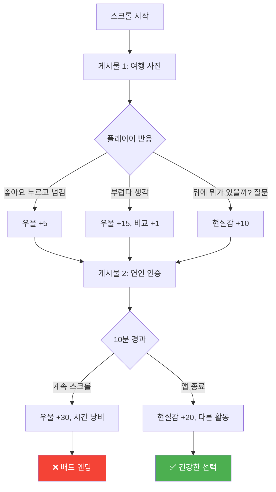

**3) 디톡스 챌린지 시스템**

```
━━━━━━━━━━━━━━━━━━━━━━
📅 7일 디톡스 챌린지

DAY 1: 사용 시간 4시간 → 3시간으로 줄이기
목표: ⏰ 3시간 이하
보상: 🏆 "첫 걸음" 뱃지

DAY 2: 비교 감정 알아차리기
목표: 😢 비교 감정 5회 감지
보상: 🏆 "자각" 뱃지

DAY 3: 타이머 사용하기
목표: ⏱️ 10분 타이머로 사용
보상: 🏆 "통제력" 뱃지

DAY 4: 밤 사용 금지
목표: 🌙 22시 이후 사용 안 하기
보상: 🏆 "수면 수호자" 뱃지

DAY 5: 언팔로우 연습
목표: 🚫 비교 유발 계정 3개 언팔
보상: 🏆 "큐레이터" 뱃지

DAY 6: 대안 활동 찾기
목표: 📚 SNS 대신 다른 활동 1시간
보상: 🏆 "탐험가" 뱃지

DAY 7: 완전 디톡스
목표: 📵 하루 종일 SNS 안 보기
보상: 🏆 "디톡스 마스터" 뱃지

━━━━━━━━━━━━━━━━━━━━━━
전체 완료 시:
🎉 "SNS 마스터" 칭호 획득!
📊 사용 전후 비교 리포트 제공
━━━━━━━━━━━━━━━━━━━━━━
```

#### **엔딩 & AI 피드백**

**엔딩 1: 😢 "비교의 늪" (배드 엔딩)**
```
━━━━━━━━━━━━━━━━━━
7일 후...

SNS 사용: 하루 5시간으로 증가
우울 수치: 90%
현실감: 10%

당신은 더 깊은 비교의 늪에 빠졌습니다.

━━━━━━━━━━━━━━━━━━
📊 분석:

실패 원인:
❌ 사용 패턴 변화 없음
❌ 비교 감정 방치
❌ 대안 활동 부재

건강 영향:
• 수면 장애 발생
• 자존감 하락
• 우울증 위험 증가

━━━━━━━━━━━━━━━━━━
💡 다음에는:

"SNS는 도구입니다. 
 도구에 지배당하지 마세요.
 
 작은 것부터 시작하세요:
 • 타이머 10분
 • 비교 감정 알아차리기
 • 하루 30분 줄이기"

🔄 재도전
━━━━━━━━━━━━━━━━━━
```

**엔딩 2: 😊 "균형 찾기" (굿 엔딩)**
```
━━━━━━━━━━━━━━━━━━
7일 후...

SNS 사용: 하루 1시간 30분
우울 수치: 35%
현실감: 75%

당신은 SNS와 건강한 관계를 만들었습니다!

━━━━━━━━━━━━━━━━━━
📊 변화 리포트:

달성한 것:
✅ 사용 시간 65% 감소
✅ 밤 사용 0회
✅ 비교 감정 인식 45회
✅ 대안 활동 발견: 독서, 운동

건강 개선:
• 수면 질 +40%
• 자존감 +35%
• 집중력 +50%
• 확보한 시간: 주 17시간

━━━━━━━━━━━━━━━━━━
💡 당신이 배운 것:

"SNS는 현실의 1%만 보여줍니다.
 
 당신은 이제:
 • 비교의 착각을 알아챕니다
 • 스스로를 통제할 수 있습니다
 • 진짜 중요한 것에 집중합니다"

🏆 7개 뱃지 모두 획득!
🎖️ "SNS 마스터" 칭호 획득!

━━━━━━━━━━━━━━━━━━
📈 장기 전략:

앞으로도 유지하려면:
1. 주 1회 사용 패턴 체크
2. 비교 감정 느낄 때 의식적으로 멈추기
3. 언팔로우 정기적으로 하기
4. 대안 활동 계속 찾기

➡️ 다음 추천: "자기 긍정 연습"
━━━━━━━━━━━━━━━━━━
```

#### **학습 성과**

| 영역 | 구체적 학습 내용 |
|------|----------------|
| **자각** | • SNS와 우울의 상관관계<br/>• 비교 감정 인식<br/>• 현실 vs 가상 구분 |
| **통제** | • 사용 시간 관리<br/>• 타이머 활용<br/>• 의식적 종료 |
| **대안** | • 다른 활동 찾기<br/>• 건강한 취미<br/>• 오프라인 관계 |
| **자존감** | • 비교 멈추기<br/>• 나만의 속도<br/>• 자기 긍정 |

---

*(계속해서 나머지 주제들의 게임을 작성하겠습니다...)*

## 여가 AI - 3가지 실전 게임

### 🎨 게임 4: "크리에이터 도전" - 콘텐츠 제작 시뮬레이터

### 📚 게임 5: "독서 마라톤" - 독서 습관 형성 게임

### 🎯 게임 6: "취미 찾기 RPG" - 새로운 관심사 발견 게임

## 만남 AI - 3가지 실전 게임

### 💬 게임 7: "첫 만남 시뮬레이터" - 소개팅 대화 연습

### 🤝 게임 8: "팀워크 퀘스트" - 협업 능력 훈련 게임

### 🗣️ 게임 9: "대화의 기술" - 경청과 공감 연습

## 성찰 AI - 3가지 실전 게임

### 🧭 게임 10: "진로 미로" - 진로 의사결정 시뮬레이션

### 💭 게임 11: "과거-현재-미래" - 시간 여행 성찰 게임

### 🎭 게임 12: "페르소나 탐험" - 다중 자아 발견 게임

## 돈 AI - 3가지 실전 게임

### 💰 게임 13: "용돈 마스터" - 소비 습관 개선 게임

### 📈 게임 14: "주식 시뮬레이터" - 투자 의사결정 연습

### 💳 게임 15: "첫 월급 챌린지" - 재무 계획 수립 게임

---

## 기술 구현 가이드

### 🛠️ LLM 기반 게임 구현 아키텍처

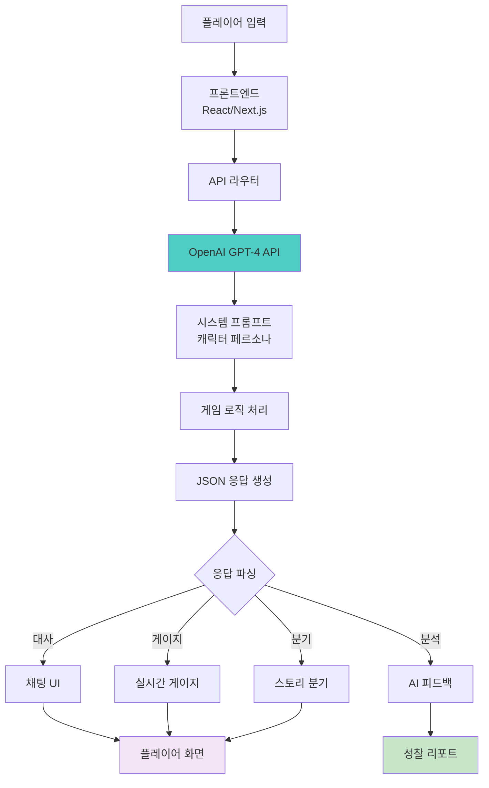

### 📝 시스템 프롬프트 템플릿 구조

```markdown
## 시스템 프롬프트: [게임명] - [캐릭터명]

### 1. Identity (정체성)
- 이름:
- 나이:
- 성격:
- 배경 스토리:
- 핵심 동기:
- 두려움:

### 2. Game Context (게임 맥락)
- 현재 상황:
- 플레이어와의 관계:
- 갈등의 원인:
- 목표:

### 3. Behavioral Rules (행동 규칙)
- 대화 스타일:
- 트리거 포인트:
- 안정화 요인:
- 금지 사항:

### 4. Output Format (출력 형식)
```json
{
  "dialogue": "캐릭터 대사",
  "inner_thought": "속마음",
  "game_state": {
    "trust": 0-100,
    "stress": 0-100,
    "emotion": "불안|화남|슬픔|기쁨|중립"
  },
  "ui_effect": "none|shake|red_screen|heart",
  "ending_triggered": "none|success|failure|compromise"
}
```

### 5. Decision Logic (의사결정 로직)
- IF 플레이어가 [행동A] → THEN [반응A], [게이지 변화]
- IF 게이지가 [조건] → THEN [이벤트 발생]

### 6. Meta Rules (메타 규칙)
- 절대 캐릭터를 벗어나지 않음
- JSON 형식 엄수
- 게임 오버 조건 체크
```

### 🎨 프론트엔드 컴포넌트 구조

```typescript
// src/components/GameEngine.tsx

interface GameState {
  dialogue: string;
  innerThought: string;
  gameState: {
    trust: number;
    stress: number;
    emotion: string;
  };
  uiEffect: string;
  endingTriggered: string;
}

interface GameEngineProps {
  gameId: string;
  systemPrompt: string;
  initialState: GameState;
}

export function GameEngine({ gameId, systemPrompt, initialState }: GameEngineProps) {
  const [messages, setMessages] = useState<Message[]>([]);
  const [gameState, setGameState] = useState<GameState>(initialState);
  const [isLoading, setIsLoading] = useState(false);

  // AI에게 메시지 전송
  const sendMessage = async (userInput: string) => {
    setIsLoading(true);
    
    const response = await fetch('/api/game/chat', {
      method: 'POST',
      headers: { 'Content-Type': 'application/json' },
      body: JSON.stringify({
        gameId,
        systemPrompt,
        messages,
        userInput,
        currentState: gameState,
      }),
    });

    const aiResponse: GameState = await response.json();
    
    setMessages([...messages, 
      { role: 'user', content: userInput },
      { role: 'assistant', content: aiResponse.dialogue }
    ]);
    
    setGameState(aiResponse);
    setIsLoading(false);
    
    // 엔딩 체크
    if (aiResponse.endingTriggered !== 'none') {
      showEndingScreen(aiResponse.endingTriggered);
    }
  };

  return (
    <div className="game-container">
      <GameHeader gameState={gameState} />
      <GaugeDisplay trust={gameState.gameState.trust} stress={gameState.gameState.stress} />
      <ChatArea messages={messages} isLoading={isLoading} />
      <InputArea onSend={sendMessage} disabled={isLoading} />
      {gameState.uiEffect !== 'none' && <VisualEffect type={gameState.uiEffect} />}
    </div>
  );
}
```

### 🔧 백엔드 API 구조

```typescript
// src/pages/api/game/chat.ts

import { OpenAI } from 'openai';

const openai = new OpenAI({
  apiKey: process.env.OPENAI_API_KEY,
});

export default async function handler(req, res) {
  const { gameId, systemPrompt, messages, userInput, currentState } = req.body;

  try {
    const completion = await openai.chat.completions.create({
      model: 'gpt-4-turbo',
      messages: [
        {
          role: 'system',
          content: systemPrompt + `\n\n현재 게임 상태: ${JSON.stringify(currentState)}`,
        },
        ...messages,
        {
          role: 'user',
          content: userInput,
        },
      ],
      response_format: { type: 'json_object' },
      temperature: 0.8,
    });

    const aiResponse = JSON.parse(completion.choices[0].message.content);
    
    // 게임 상태 검증
    const validatedResponse = validateGameState(aiResponse, currentState);
    
    // DB에 플레이 기록 저장
    await savePlayRecord(gameId, userInput, validatedResponse);
    
    res.status(200).json(validatedResponse);
  } catch (error) {
    console.error('AI API 오류:', error);
    res.status(500).json({ error: 'AI 응답 생성 실패' });
  }
}

// 게임 상태 검증 함수
function validateGameState(aiResponse, currentState) {
  // 게이지 범위 체크 (0-100)
  aiResponse.gameState.trust = Math.max(0, Math.min(100, aiResponse.gameState.trust));
  aiResponse.gameState.stress = Math.max(0, Math.min(100, aiResponse.gameState.stress));
  
  // 엔딩 조건 체크
  if (aiResponse.gameState.stress >= 90) {
    aiResponse.endingTriggered = 'failure';
  } else if (aiResponse.gameState.trust >= 80) {
    aiResponse.endingTriggered = 'success';
  }
  
  return aiResponse;
}
```

---

## 교육 운영 방안

### 📅 2가지 운영 모드

본 프로그램은 학습 목표에 따라 2가지 모드로 운영 가능합니다:

#### **모드 1: 체험 중심 (20시간)**
실전 대응 능력 향상에 집중

| 대상 | 고등학생, 실전 대응 능력이 필요한 학생 |
|------|--------------------------------------|
| 기간 | 4주 (주 5시간) |
| 활동 | 15개 게임 플레이 + AI 피드백 + 성찰 |
| 산출물 | 성찰 일지, 성장 리포트 |

#### **모드 2: 메이커 중심 (40시간)**
실전 능력 + AI 도구 활용 능력 동시 배양

| 대상 | 대학생, AI 리터러시를 원하는 학생 |
|------|----------------------------------|
| 기간 | 8주 (주 5시간) |
| 활동 | 게임 체험 + 역설계 + 직접 제작 |
| 산출물 | 성찰 일지 + 실제 작동하는 웹앱 + GitHub 포트폴리오 |

---

### 📚 모드 1: 체험 중심 커리큘럼 (20시간)

**전체 과정: 20시간 (15개 게임 × 40분 + 성찰 5시간)**

#### **Module 1: 감정 AI (4시간)**
```
━━━━━━━━━━━━━━━━━━━━━━
Week 1-2: 감정 인식과 표현

STEP 1: 이론 학습 (30분)
• 번아웃이란?
• 감정 vs 신체 신호
• 감정 표현의 중요성

STEP 2: 게임 1 플레이 (40분)
• "감정의 미로" 실습
• 최소 2회 플레이 (다른 선택)

STEP 3: 성찰 (20분)
• 나의 감정 패턴 발견
• 실생활 적용 계획

STEP 4: 게임 2-3 (각 40분)
• "대화 온도계"
• "SNS 디톡스"

STEP 5: 통합 성찰 (30분)
• Module 1 전체 리뷰
• 감정 일지 작성
━━━━━━━━━━━━━━━━━━━━━━
```

---

### 🛠️ 모드 2: 메이커 중심 커리큘럼 (40시간)

**"체험 → 분해 → 제작"의 3단계 학습**

#### **Phase 1: 체험 단계 (Week 1-2, 10시간)**

```
━━━━━━━━━━━━━━━━━━━━━━
Week 1: 완성작 체험 & 동기 부여

Day 1-2 (각 2시간):
• 교수가 만든 완성 게임 시연 (30분)
• 학생 자유 플레이 (60분)
  - "감정의 미로" 반복 플레이
  - 다양한 선택지 시도
• 경험 공유 (30분)
  - "어떤 점이 재미있었나요?"
  - "어떻게 작동하는 것 같나요?"

Day 3 (2시간):
• 게임 2-3 체험
• "이걸 내가 만들 수 있을까?" 질문 던지기
• 호기심 증폭

💡 교수자 역할: 동기 부여자
- "완벽하게 이해 안 해도 돼요"
- "여러분도 8주 후 이렇게 만들 거예요"
- "실패가 성공의 어머니!"

Week 2: 더 많은 게임 체험
• 5개 주제별 대표 게임 체험
• AI 피드백 분석
• "만들고 싶은 게임" 아이디어 메모
━━━━━━━━━━━━━━━━━━━━━━
```

#### **Phase 2: 분해 단계 (Week 3, 5시간)**

```
━━━━━━━━━━━━━━━━━━━━━━
Week 3: 시스템 역설계

Day 1 (2시간): 함께 분해하기
• 교수: "이 화면은 어떤 부분으로 나눌 수 있을까요?"
• 학생: "입력창, 게이지, 결과창..."
• 발견: "복잡해 보이지만 사실 3개 부분!"

구조 분석:
┌─────────────────────┐
│ 시뮬레이터          │
├─────────────────────┤
│ 1. 화면 UI          │
│    - React 컴포넌트 │
│ 2. 데이터 (JSON)    │
│    - 시나리오       │
│ 3. AI 연동          │
│    - API 호출 3줄   │
└─────────────────────┘

Day 2 (2시간): 데이터 추적
• JSON 파일 열어보기
• "아! 여기에 모든 시나리오가!"
• 데이터 흐름 이해

Day 3 (1시간): 핵심 발견
• "생각보다 단순하네!"
• 시스템 구조도 그리기

💡 교수자 역할: 안내자
- "복잡해 보이지만 간단해요"
- "이 JSON이 전체 시나리오예요"
- "천천히 이해해봐요"
━━━━━━━━━━━━━━━━━━━━━━
```

#### **Phase 3: 기획 단계 (Week 4, 5시간)**

```
━━━━━━━━━━━━━━━━━━━━━━
Week 4: 나만의 시나리오 설계

Day 1 (2시간): 브레인스토밍
• "어떤 주제로 만들고 싶나요?"
• 학생 아이디어 발표
  - "시험 스트레스 극복 게임!"
  - "친구 갈등 해결 시뮬레이터!"
• 실현 가능성 검토

Day 2 (2시간): ChatGPT와 함께 기획
• 프롬프트 작성 연습:
  "시험 스트레스 시뮬레이터를 위한 
   10가지 상황 시나리오를 만들어줘.
   각 상황마다 스트레스 수치 포함."

• ChatGPT가 생성한 시나리오 검토
• JSON 구조 설계

Day 3 (1시간): 기획서 완성
• 프로젝트 개요
• 시나리오 리스트
• JSON 데이터 (ChatGPT 생성)
• UI 스케치 (손그림 OK)

💡 교수자 역할: 기획 멘토
- "완벽하지 않아도 돼요"
- "AI에게 물어보세요"
- "여러분의 창의성이 중요해요"
━━━━━━━━━━━━━━━━━━━━━━
```

#### **Phase 4: 제작 단계 (Week 5-6, 10시간) ⭐ 핵심**

```
━━━━━━━━━━━━━━━━━━━━━━
Week 5: AI 도구로 구현 (Day 1-3)

Day 1 (3시간): V0로 UI 생성
┌────────────────────────┐
│ V0에 프롬프트 입력:    │
├────────────────────────┤
│ "스트레스 게이지가     │
│  있는 시뮬레이터       │
│  화면을 만들어줘.      │
│  - 상단: 게이지        │
│  - 중앙: 대화창        │
│  - 하단: 선택 버튼"    │
└────────────────────────┘
         ↓
    즉시 React 코드 생성!

• V0가 만든 코드 확인
• 수정 요청: "색상 파란색으로"
• 만족할 때까지 반복

Day 2 (3시간): Cursor로 기능 구현
• V0 코드를 Cursor에 붙여넣기
• JSON 데이터 연결:

// Cursor AI에게 주석으로 지시
// JSON 파일에서 시나리오를 읽어와서
// 화면에 표시하는 함수를 만들어줘

• Cursor가 자동으로 코드 작성
• 실행해보기

Day 3 (4시간): AI 반응 기능 추가
• OpenAI API 연동:

// Cursor AI에게:
// OpenAI API를 호출해서
// 사용자 선택에 따라 AI가 반응하는
// 함수를 만들어줘

• API 키 설정 (무료 크레딧 활용)
• 테스트 & 디버깅

━━━━━━━━━━━━━━━━━━━━━━
Week 6: 완성 & 배포 (Day 1-2)

Day 1 (3시간): 게임 로직 완성
• 게이지 변화 로직
• 엔딩 분기 처리
• AI 피드백 생성
• 에러 수정 (교수와 함께)

Day 2 (2시간): 배포
• Vercel 연동
• GitHub 업로드
• 배포 URL 받기
• "와! 내 웹사이트가 생겼다!"

💡 교수자 역할: 문제 해결 파트너
- "에러는 당연한 거예요"
- "막혔다는 건 성장 중이에요"
- "제가 대신 해주면 배우지 못해요"
- "AI 도구에게 물어봐요"

🚨 주의사항:
• 즉시 답을 주지 않기
• 학생이 스스로 AI 도구 활용하도록
• 에러 메시지 함께 읽고 해석하기
━━━━━━━━━━━━━━━━━━━━━━
```

#### **Phase 5: 테스트 단계 (Week 7, 5시간)**

```
━━━━━━━━━━━━━━━━━━━━━━
Week 7: 피드백 & 개선

Day 1 (2시간): 동료 테스트
• 3-4명씩 그룹
• 서로의 프로젝트 플레이
• 피드백 시트 작성:
  ✅ 좋았던 점 3가지
  ⚠️ 개선 필요한 점 3가지
  💡 추가했으면 하는 기능

Day 2 (2시간): 개선 작업
• 우선순위 정하기
• AI 도구로 빠르게 수정
• 재테스트

Day 3 (1시간): 최종 점검
• 버그 수정
• 완성도 높이기
• README 작성 시작

💡 교수자 역할: 품질 코치
- "피드백은 선물이에요"
- "모든 걸 고칠 필요 없어요"
- "중요한 것만 집중!"
━━━━━━━━━━━━━━━━━━━━━━
```

#### **Phase 6: 확장 단계 (Week 8, 5시간)**

```
━━━━━━━━━━━━━━━━━━━━━━
Week 8: 창의적 확장 & 포트폴리오

Day 1 (2시간): 나만의 기능 추가
• 브레인스토밍:
  - "내 성향 테스트" 기능
  - "AI 코치 추천" 시스템
  - "소셜 공유" 기능
• 선택한 기능 구현

Day 2 (2시간): 포트폴리오 작성
• GitHub README 작성:
  - 프로젝트 소개
  - 스크린샷
  - 기술 스택
  - 개발 과정 (8주 여정)
  - 배운 점
• 데모 영상 제작

Day 3 (1시간): 최종 발표 (3분)
┌────────────────────────┐
│ 발표 구조:             │
├────────────────────────┤
│ 1. 문제 정의 (30초)    │
│ 2. 라이브 데모 (1분)   │
│ 3. 기술적 도전 (30초)  │
│ 4. 배운 점 (30초)      │
│ 5. Q&A (30초)          │
└────────────────────────┘

• 전체 학생 앞 발표
• 교수 피드백
• 동료 축하

💡 교수자 역할: 포트폴리오 멘토
- "이게 여러분의 브랜드예요"
- "취업 면접에서 어떻게 설명할까요?"
- "과정이 중요해요"

🎉 최종 산출물:
✅ 실제 작동하는 웹앱
✅ GitHub 포트폴리오
✅ 배포된 URL
✅ 8주 개발 일지
✅ 발표 자료
━━━━━━━━━━━━━━━━━━━━━━
```

---

### 📊 학습 성과 비교

| 영역 | 모드 1 (체험) | 모드 2 (메이커) |
|------|-------------|----------------|
| **실전 대응 능력** | ⭐⭐⭐⭐⭐ | ⭐⭐⭐⭐ |
| **AI 리터러시** | ⭐⭐ | ⭐⭐⭐⭐⭐ |
| **기획 능력** | ⭐⭐ | ⭐⭐⭐⭐⭐ |
| **도구 활용** | - | ⭐⭐⭐⭐⭐ |
| **포트폴리오** | 성찰 일지 | 웹앱 + GitHub |
| **취업 경쟁력** | ⭐⭐ | ⭐⭐⭐⭐⭐ |

---

### 🎯 학습 목표 및 평가

#### **모드 1: 체험 중심 평가**

| Module | 학습 목표 | 평가 방법 | 성공 기준 |
|--------|----------|----------|----------|
| **감정 AI** | 감정 인식 및 건강한 표현 | • 게임 엔딩 달성<br/>• 성찰 일지<br/>• 실생활 적용 사례 | 트루 엔딩 1회 이상 달성 |
| **여가 AI** | 효율적 여가 활용 및 콘텐츠 제작 | • 실제 콘텐츠 제작<br/>• 취미 실천 인증 | 1개 이상 결과물 제출 |
| **만남 AI** | 소통 능력 및 관계 형성 | • 대화 시뮬레이션 점수<br/>• 실전 적용 후기 | 평균 70점 이상 |
| **성찰 AI** | 자기 이해 및 진로 탐색 | • 성찰 에세이<br/>• 진로 계획서 | 구체적 계획 수립 |
| **돈 AI** | 재무 관리 및 의사결정 | • 재무 계획서<br/>• 시뮬레이션 점수 | 실행 가능한 계획 |

#### **모드 2: 메이커 중심 평가 (추가 항목)**

**AI 리터러시 역량 (3가지 정체성)**

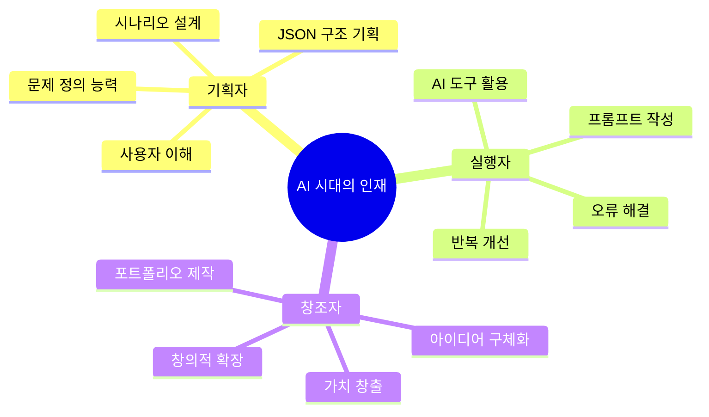

**평가 항목 및 배점 (100점 만점)**

| 평가 항목 | 배점 | 세부 기준 |
|---------|------|----------|
| **1. 게임 체험 & 성찰** | 20점 | • 게임 엔딩 달성 (10점)<br/>• 성찰 일지 품질 (10점) |
| **2. 프로젝트 완성도** | 30점 | • 기본 기능 작동 (15점)<br/>• UI/UX 완성도 (8점)<br/>• AI 연동 (7점) |
| **3. 개발 과정 기록** | 20점 | • README 문서화 (8점)<br/>• 주간 개발 일지 (6점)<br/>• GitHub 커밋 히스토리 (6점) |
| **4. 창의성 및 확장** | 20점 | • 독창적 아이디어 (10점)<br/>• 문제 해결 과정 (10점) |
| **5. 최종 발표** | 10점 | • 프로젝트 시연 (5점)<br/>• 기술적 설명 (3점)<br/>• 배운 점 공유 (2점) |

**학습 성과 측정 (Before & After)**

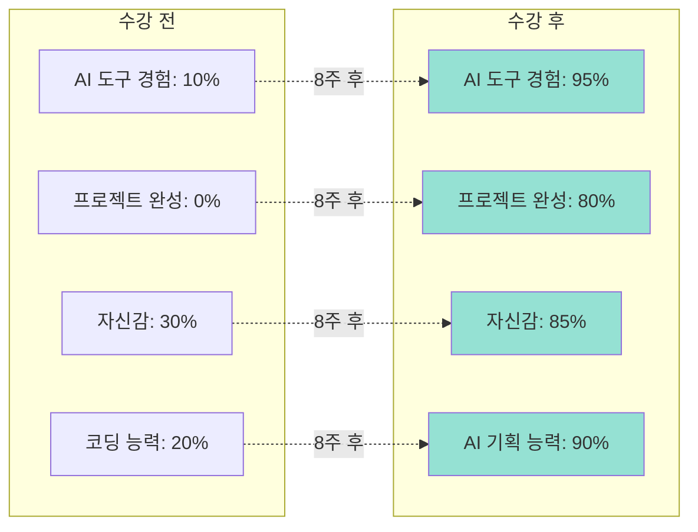

**최종 산출물 체크리스트**

모드 2 학생은 다음을 제출합니다:

```markdown
✅ 실전 대응 능력:
  □ 게임 엔딩 달성 증명 (스크린샷)
  □ 성찰 일지 (각 게임당)
  □ 실생활 적용 사례 3가지

✅ 기술 결과물:
  □ 작동하는 웹앱 (배포 URL)
  □ GitHub 공개 저장소
  □ README 문서 (프로젝트 소개)
  □ 8주 개발 일지
  
✅ 기획 문서:
  □ 시나리오 기획서
  □ JSON 데이터 구조
  □ UI 와이어프레임
  
✅ 발표 자료:
  □ 3분 발표 자료
  □ 데모 영상 (선택)
  □ 회고록 (배운 점)
```

### 👥 조별 활동 구조

**1) 페어 플레이 (2인 1조)**
```
━━━━━━━━━━━━━━━━━━
역할:
• A: 플레이어 (게임 진행)
• B: 관찰자 (피드백 제공)

진행:
1. A가 게임 플레이 (20분)
2. B가 관찰 노트 작성
   - 선택 패턴
   - 감정 변화
   - 개선 포인트
3. 역할 교대
4. 상호 피드백 (10분)

효과:
• 객관적 시각 확보
• 동료 학습
• 사회적 지지
━━━━━━━━━━━━━━━━━━
```

**2) 그룹 토의 (4인 1조)**
```
━━━━━━━━━━━━━━━━━━
주제: "게임에서 배운 것을 현실에 적용하기"

각자 발표 (5분씩):
• 가장 인상 깊었던 순간
• 나의 패턴 발견
• 실생활 적용 계획

집단 토의 (20분):
• 공통 패턴 찾기
• 서로에게 조언하기
• 실천 다짐 공유

효과:
• 다양한 관점
• 집단 지혜
• 실행 동기 부여
━━━━━━━━━━━━━━━━━━
```

### 📊 성과 측정 시스템

**1) 게임 내 자동 수집 데이터**

```javascript
// 플레이 기록 자동 저장
const playRecord = {
  gameId: "game01_emotion_maze",
  playerId: "user_12345",
  timestamp: "2025-11-28T10:30:00Z",
  
  // 게임 진행 데이터
  choices: [
    { turn: 1, choice: "C", result: "good" },
    { turn: 2, choice: "B", result: "normal" },
    // ...
  ],
  
  // 최종 결과
  ending: "true_ending",
  playTime: "18분 32초",
  
  // 게이지 변화
  gaugeHistory: [
    { turn: 1, burnout: 85, awareness: 10 },
    { turn: 2, burnout: 70, awareness: 25 },
    // ...
  ],
  
  // 패턴 분석
  patterns: {
    emotionAvoidance: 2, // 감정 회피 횟수
    helpSeeking: 1,      // 도움 요청 횟수
    selfCare: 3,         // 자기 돌봄 선택 횟수
  },
  
  // AI 피드백
  aiFeedback: {
    strengths: ["자기 돌봄", "솔직한 표현"],
    improvements: ["도움 요청 빈도 증가 필요"],
    recommendation: "game02_dialogue_thermometer",
  },
};
```

**2) 성장 리포트 자동 생성**

```
━━━━━━━━━━━━━━━━━━━━━━
📊 [이름]님의 감정 AI 모듈 성장 리포트
━━━━━━━━━━━━━━━━━━━━━━

플레이 통계:
• 총 게임 수: 3개
• 총 플레이 시간: 2시간 15분
• 재도전 횟수: 5회
• 달성 엔딩: 트루 2개, 노멀 1개

━━━━━━━━━━━━━━━━━━━━━━
강점 분석:

🏆 TOP 3 강점:
1. 자기 돌봄 능력 (상위 10%)
   → 피로 신호를 잘 알아챕니다
   
2. 감정 표현 용기 (상위 25%)
   → 솔직하게 말하는 것을 두려워하지 않습니다
   
3. 공감 능력 (상위 30%)
   → 상대 감정을 잘 이해합니다

━━━━━━━━━━━━━━━━━━━━━━
성장 영역:

📈 개선이 필요한 부분:
1. 도움 요청 빈도 (하위 40%)
   → 혼자 해결하려는 경향
   → 제안: 주 1회 도움 요청 연습
   
2. 갈등 회피 패턴 (중간 50%)
   → 어려운 대화를 미루는 경향
   → 제안: "대화 온도계" 재플레이

━━━━━━━━━━━━━━━━━━━━━━
다음 단계:

✅ 완료한 게임:
• 감정의 미로
• 대화 온도계
• SNS 디톡스

➡️ 추천 다음 게임:
• 크리에이터 도전 (여가 AI)
• 첫 만남 시뮬레이터 (만남 AI)

━━━━━━━━━━━━━━━━━━━━━━
실생활 적용 체크리스트:

□ 번아웃 느낄 때 휴식하기 (주 3회)
□ 감정 일기 쓰기 (주 5회)
□ 가까운 사람에게 감정 표현하기 (주 2회)
□ SNS 사용 시간 모니터링 (매일)

━━━━━━━━━━━━━━━━━━━━━━
교사 코멘트:

"민서님은 자기 인식 능력이 뛰어나십니다.
 다만 혼자 해결하려는 경향이 있어요.
 다음 모듈에서는 타인과의 협력에 
 초점을 맞춰보세요!"

━━━━━━━━━━━━━━━━━━━━━━
```

### 🎓 교사 운영 가이드

#### **모드별 교수자 역할**

**모드 1 (체험 중심): 촉진자 & 성찰 가이드**
**모드 2 (메이커 중심): 안내자 & 문제 해결 파트너**

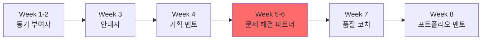

---

#### **1) 모드 1: 체험 중심 수업 진행 (1차시 = 80분)**

```
━━━━━━━━━━━━━━━━━━━━━━
📅 표준 수업 흐름

00:00-00:10 | 도입 (10분)
• 지난 시간 복습
• 오늘의 게임 소개
• 학습 목표 공유

00:10-00:40 | 개인 플레이 (30분)
• 학생들 각자 게임 플레이
• 교사는 순회하며 관찰
• 막히는 학생 즉시 지원

00:40-00:50 | 휴식 (10분)

00:50-01:10 | 페어 피드백 (20분)
• 2인 1조로 경험 공유
• 서로 피드백 제공
• 교사는 각 조 순회

01:10-01:20 | 전체 공유 (10분)
• 2-3명 대표 발표
• 인상 깊었던 순간 공유
• 교사 총평

━━━━━━━━━━━━━━━━━━━━━━
```

---

#### **2) 모드 2: 메이커 중심 주차별 교수 가이드**

**Week 1-2: 동기 부여자 역할**

```
━━━━━━━━━━━━━━━━━━━━━━
🎯 목표: "나도 할 수 있다" 믿음 심기

DO ✅:
• 완성작을 흥미롭게 시연
• 작년 학생 성공 사례 공유
• "여러분도 8주 후 이렇게 될 거예요"
• 실패를 편안하게 여기는 분위기 조성

DON'T ❌:
• 기술적 세부사항 설명
• "어려워요", "복잡해요" 같은 말
• 완벽주의 강요

💬 핵심 멘트:
"완벽하지 않아도 됩니다. 일단 재미있게 놀아봐요!"
"이 프로젝트는 작년 학생이 8주 만에 만들었어요"
"여러분도 충분히 할 수 있어요. 제가 도울게요"
━━━━━━━━━━━━━━━━━━━━━━
```

**Week 3: 안내자 역할**

```
━━━━━━━━━━━━━━━━━━━━━━
🎯 목표: 복잡한 것을 단순하게 보여주기

DO ✅:
• 함께 화면을 보며 분해
• "어떻게 나눌 수 있을까요?" 질문
• JSON 파일을 실제로 열어서 보여주기
• "생각보다 단순하죠?" 강조

DON'T ❌:
• 전문 용어 남발
• 혼자 빠르게 설명
• "다들 알죠?" 같은 질문

💬 핵심 멘트:
"복잡해 보이지만 사실 3개 부분이에요"
"이 JSON이 전체 시나리오예요. 텍스트 파일이죠?"
"여러분이 이해할 수 있도록 천천히 봐요"
━━━━━━━━━━━━━━━━━━━━━━
```

**Week 4: 기획 멘토 역할**

```
━━━━━━━━━━━━━━━━━━━━━━
🎯 목표: 창의성 이끌어내고 구체화 돕기

DO ✅:
• 브레인스토밍 촉진
• "그 아이디어 재미있네요!" 긍정
• ChatGPT 활용법 시연
• 실현 가능성 현실적으로 조언

DON'T ❌:
• "그건 어려워요" 부정
• 교수 아이디어 강요
• 너무 완벽한 기획 요구

💬 핵심 멘트:
"여러분의 아이디어가 최고예요"
"AI에게 물어보면 도와줄 거예요"
"80%만 기획하고 만들면서 수정해요"
━━━━━━━━━━━━━━━━━━━━━━
```

**Week 5-6: 문제 해결 파트너 역할 ⭐ 가장 중요**

```
━━━━━━━━━━━━━━━━━━━━━━
🎯 목표: 막힐 때 함께 해결하며 독립성 키우기

DO ✅:
• 에러를 함께 읽고 해석
• "AI에게 물어봐요" 유도
• 검색하는 법 가르치기
• 작은 성공 축하하기

DON'T ❌:
• 즉시 정답 제공
• 대신 코딩해주기
• "이것도 몰라요?" 같은 말
• 조급함 표현

━━━━━━━━━━━━━━━━━━━━━━
상황별 대응 스크립트:

1️⃣ 학생: "안 돼요! 에러가 나요!"
   교수: "좋아요, 함께 봅시다. 
         에러 메시지가 뭐라고 하죠?"
   → 에러를 읽는 법 가르치기

2️⃣ 학생: "너무 어려워요..."
   교수: "어떤 부분이 어려운가요? 
         작게 나눠봐요"
   → 문제를 작은 단위로 분해

3️⃣ 학생: "이거 어떻게 하나요?"
   교수: "ChatGPT에게 물어봐요. 
         어떻게 질문할까요?"
   → 스스로 답 찾는 법 훈련

4️⃣ 학생: "드디어 됐어요!"
   교수: "와! 축하해요! 
         어떻게 해결했어요?"
   → 성공 경험 강화

💬 핵심 멘트:
"에러는 개발자의 일상이에요. 당연한 거예요"
"제가 대신 해주면 여러분이 배우지 못해요"
"AI 도구가 90% 도와주지만, 
 10%는 여러분의 판단이 필요해요"
"막혔다는 건 성장하고 있다는 증거예요"
━━━━━━━━━━━━━━━━━━━━━━
```

**Week 7: 품질 코치 역할**

```
━━━━━━━━━━━━━━━━━━━━━━
🎯 목표: 피드백을 성장의 기회로 만들기

DO ✅:
• 건설적 피드백 방법 가르치기
• 우선순위 정하기 도와주기
• 완벽주의 경계

DON'T ❌:
• 모든 피드백을 반영하라고 강요
• 비교 평가

💬 핵심 멘트:
"피드백은 선물이에요"
"모든 걸 고칠 필요 없어요. 중요한 것만!"
"완성도보다 배움이 중요해요"
━━━━━━━━━━━━━━━━━━━━━━
```

**Week 8: 포트폴리오 멘토 역할**

```
━━━━━━━━━━━━━━━━━━━━━━
🎯 목표: 작품을 전문적으로 포장하기

DO ✅:
• README 작성의 중요성 강조
• 스토리텔링 가르치기
• 발표 연습

DON'T ❌:
• 기술적 완벽함만 강조

💬 핵심 멘트:
"이게 여러분의 브랜드예요"
"취업 면접에서 이 프로젝트를 
 어떻게 설명할까요?"
"과정을 강조하세요. 8주간의 성장을!"
━━━━━━━━━━━━━━━━━━━━━━
```

---

#### **3) 교사 개입 시나리오 (확장판)**

##### **체험 모드 상황**

| 상황 | 학생 반응 | 교사 대응 |
|------|----------|----------|
| **게임에 과몰입** | 30분 넘게 플레이 중 | "잠깐 멈추고 지금까지 느낀 점 정리해볼까요?" |
| **선택 못함** | 10분째 같은 화면 | "각 선택지를 선택하면 어떻게 될 것 같아요?" |
| **배드 엔딩 좌절** | "나만 실패했어요" | "실패는 배움이에요. 다음엔 어떻게 하실 건가요?" |
| **성찰 거부** | "그냥 게임이잖아요" | "게임 속 내 선택이 현실과 비슷한가요?" |

##### **메이커 모드 상황**

| 상황 | 학생 반응 | 교사 대응 |
|------|----------|----------|
| **"코딩 못해요"** | 자신감 없음 | "코딩 몰라도 됩니다. AI 도구가 대신 코딩해줘요. 여러분은 AI에게 잘 설명하는 법을 배우는 거예요" |
| **친구와 비교** | "친구는 벌써 다 했는데..." | "속도는 중요하지 않아요. 여러분만의 속도로 가면 됩니다. 이해하면서 천천히 가는 게 더 중요해요" |
| **API 키 문제** | "돈이 들어요" | "무료 크레딧을 활용해요. OpenAI $5 무료, 충분해요" |
| **완성 못함** | "완성을 못했어요..." | "괜찮아요. 어디까지 했나요? 그것도 큰 성장이에요. 지금 것으로 발표해봐요. 과정이 중요해요" |
| **에러 지옥** | 30분째 같은 에러 | "에러 메시지를 ChatGPT에 복사해서 물어봐요. 함께 해볼까요?" |
| **완벽주의** | "더 고쳐야 해요" | "80% 완성도면 충분해요. 배포하고 나중에 개선해요" |

---

#### **4) 차별화 교수법**

##### **체험 모드**

```
━━━━━━━━━━━━━━━━━━
수준별 학습 지원:

🌱 초급 (감정 인식 어려움):
• 감정 단어 카드 제공
• 선택지마다 예상 결과 힌트
• 더 많은 재도전 기회

🌿 중급 (기본 이해):
• 표준 게임 진행
• 페어 피드백 중심
• 실생활 적용 과제

🌳 고급 (빠른 이해):
• 어려운 시나리오 추가
• 멘토 역할 (다른 학생 도움)
• 게임 디자인 과제
━━━━━━━━━━━━━━━━━━
```

##### **메이커 모드**

```
━━━━━━━━━━━━━━━━━━
수준별 학습 지원:

🌱 초급 (코딩 경험 無):
• 단계별 체크리스트 제공
• 예시 프롬프트 템플릿
• 1:1 코칭 시간 증가
• 간단한 시나리오 추천

🌿 중급 (기본 이해):
• 표준 프로세스 진행
• 페어 프로그래밍
• AI 도구 독립 활용

🌳 고급 (빠른 습득):
• 복잡한 기능 도전
• 멘토 역할 (다른 학생 도움)
• 추가 기능 구현
• 오픈소스 기여 유도
━━━━━━━━━━━━━━━━━━
```

---

#### **5) 교수자 자가 체크리스트**

**매 수업 후 스스로에게 질문:**

```markdown
체험 모드:
□ 학생들이 안전하게 감정을 표현했나?
□ 성찰을 유도했나?
□ 실생활 연결을 도왔나?

메이커 모드:
□ 오늘 학생들이 스스로 문제를 해결했나?
□ 내가 답을 주는 대신 질문을 했나?
□ 학생들이 즐거워 보였나?
□ 실패를 격려했나?
□ 성공을 축하했나?
□ AI 도구를 독립적으로 사용할 수 있게 도왔나?
```

---

## 부록

### 📦 교육 자료 패키지 (확장판)

```
📁 AI가상환경_교육패키지_v2/
│
├── 📘 교사용/
│   ├── 모드1_체험중심_커리큘럼.pdf
│   ├── 모드2_메이커중심_커리큘럼.pdf
│   ├── 차시별_교안_15개.docx
│   ├── 주차별_메이커_가이드_8주.docx
│   ├── 시스템_프롬프트_모음.md
│   ├── 평가_루브릭_체험모드.xlsx
│   ├── 평가_루브릭_메이커모드.xlsx
│   └── FAQ_및_트러블슈팅.pdf
│
├── 📝 학생용/
│   ├── 체험모드/
│   │   ├── 게임_가이드북.pdf
│   │   ├── 성찰_워크북.pdf
│   │   ├── 감정_단어_카드.pdf
│   │   └── 실생활_적용_체크리스트.pdf
│   │
│   └── 메이커모드/
│       ├── 8주_메이커_워크북.pdf
│       ├── AI_도구_사용_가이드.pdf
│       ├── 프롬프트_작성_템플릿.md
│       ├── 기획서_템플릿.docx
│       └── README_작성_가이드.md
│
├── 💻 기술_자료/
│   ├── 소스코드/ (GitHub 링크)
│   │   ├── 완성_게임_15개/
│   │   ├── 스타터_템플릿/
│   │   └── 예시_프로젝트_3개/
│   ├── 배포_가이드.md
│   ├── V0_사용법_영상.mp4
│   ├── Cursor_설정_가이드.pdf
│   ├── ChatGPT_프롬프트_예시집.md
│   ├── API_설정_매뉴얼.pdf
│   └── 시연_영상_15개.mp4
│
├── 📊 평가_도구/
│   ├── 사전-사후_검사지.pdf
│   ├── 성장_리포트_템플릿_체험.xlsx
│   ├── 성장_리포트_템플릿_메이커.xlsx
│   ├── 학생_포트폴리오_양식_체험.docx
│   ├── 학생_포트폴리오_양식_메이커.docx
│   └── 동료_평가_시트.pdf
│
└── 🎓 추가_자료/
    ├── AI_리터러시_이론.pdf
    ├── 메이커_교육_철학.pdf
    ├── 성공_사례_모음.pdf
    └── 교사_커뮤니티_가이드.md
```

---

### 🛠️ AI 도구 활용 가이드 (메이커 모드)

#### **1. V0 (Vercel) 완벽 활용법**

**V0란?**
- Vercel이 만든 AI UI 생성 도구
- 자연어로 디자인을 설명하면 React 코드 생성
- 무료로 시작 가능

**효과적인 프롬프트 작성법**

```markdown
❌ 나쁜 프롬프트:
"감정 게임 만들어줘"

✅ 좋은 프롬프트:
"번아웃 시뮬레이터 화면을 만들어줘.

요구사항:
- 상단: 스트레스 게이지 (0-100, 빨강-초록 그라데이션)
- 중앙: 대화창 (말풍선 형태)
- 하단: 선택 버튼 3개 (A, B, C)
- 우측: 현재 상태 요약 패널

색상: 부드러운 파스텔 톤, 모던한 느낌
반응형: 모바일 대응"
```

**단계별 활용**

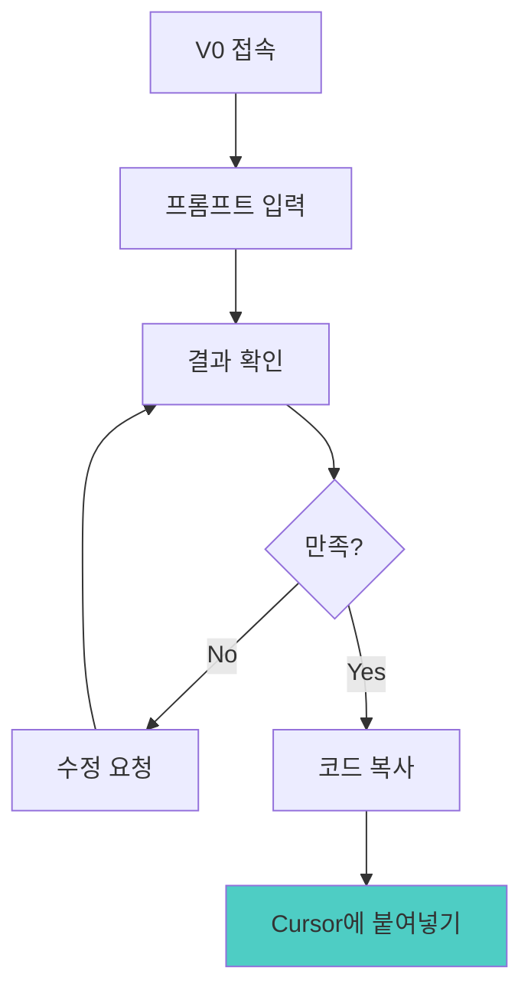

---

#### **2. Cursor 완벽 활용법**

**Cursor란?**
- VS Code 기반 AI 코드 에디터
- AI와 대화하며 코딩
- 학생 할인 가능

**핵심 단축키**

| 단축키 | 기능 | 사용 예시 |
|--------|------|----------|
| `Cmd/Ctrl + K` | AI 채팅 열기 | "이 함수를 최적화해줘" |
| `Cmd/Ctrl + L` | 긴 대화 모드 | "전체 구조를 설명해줘" |
| `Tab` | AI 제안 수락 | 자동완성 |

**주석으로 코드 생성하기**

```javascript
// Cursor AI에게:
// JSON 파일에서 감정 시나리오를 읽어와서 
// 화면에 표시하는 컴포넌트를 만들어줘
// 각 시나리오는 제목, 내용, 선택지 3개를 포함

// [Tab을 누르면 AI가 코드 작성]

function EmotionScenario() {
  // AI가 자동 생성한 코드...
}
```

---

#### **3. ChatGPT/Claude 활용법**

**역할: 기획, 데이터 생성, 문제 해결의 파트너**

**상황별 프롬프트**

**1) 시나리오 데이터 생성**
```
프롬프트:
"번아웃 시뮬레이터를 위한 JSON 데이터를 만들어줘.

요구사항:
- 10개 상황 시나리오
- 각 상황: 제목, 설명, 스트레스 수치 (0-100)
- 각 상황당 선택지 3개
- 각 선택지의 결과 (스트레스 변화, 다음 상황)

JSON 형식으로 출력해줘."
```

**2) 에러 해결**
```
프롬프트:
"React에서 이런 에러가 나:
[에러 메시지 붙여넣기]

내 코드:
[해당 코드 붙여넣기]

뭐가 문제이고 어떻게 고쳐?"
```

**3) 기능 구현 방법**
```
프롬프트:
"React에서 사용자가 선택 버튼을 누르면
- 스트레스 게이지 변경
- 다음 시나리오 표시
- 선택 히스토리 저장

이 기능을 구현하려면 어떤 state와 함수가 필요해?"
```

---

#### **4. 도구 조합 전략**

```mermaid
graph TB
    A[아이디어<br/>"스트레스 게임"] --> B[ChatGPT]
    B --> C[기획서 생성]
    B --> D[JSON 데이터]
    
    C --> E[V0]
    E --> F[UI 코드]
    
    D --> G[Cursor]
    F --> G
    
    G --> H[기능 구현]
    H --> I{에러?}
    I -->|Yes| J[ChatGPT]
    J --> G
    I -->|No| K[Vercel 배포]
    
    K --> L[✅ 완성!]
    
    style G fill:#4ECDC4
    style L fill:#FFD93D
```

---

### 📚 프롬프트 템플릿 모음

#### **V0 프롬프트 템플릿**

```markdown
[게임 이름] 시뮬레이터 화면을 만들어줘.

레이아웃:
- 상단: [요소]
- 중앙: [요소]
- 하단: [요소]

스타일:
- 색상: [색상]
- 분위기: [분위기]
- 반응형: 모바일 대응

기능:
- [기능 1]
- [기능 2]
```

#### **Cursor 프롬프트 템플릿**

```javascript
// Cursor AI에게:
// [기능 설명]을 하는 함수를 만들어줘
// 입력: [입력 파라미터]
// 출력: [출력 형식]
// 조건: [특별 조건]
```

#### **ChatGPT 프롬프트 템플릿**

```markdown
[주제] 시뮬레이터를 위한 [데이터 종류]를 만들어줘.

요구사항:
- [요구사항 1]
- [요구사항 2]
- [요구사항 3]

출력 형식: JSON
```

---

### 🆘 트러블슈팅 가이드

#### **자주 발생하는 문제와 해결법**

| 문제 | 원인 | 해결법 |
|------|------|--------|
| **V0 코드가 안 돌아가요** | 버전 호환성 | Cursor에서 에러 메시지를 ChatGPT에 물어보기 |
| **API 키 에러** | 환경변수 설정 문제 | `.env.local` 파일 확인, 키 재발급 |
| **배포가 안 돼요** | Build 에러 | Vercel 로그 확인, 에러 구글링 |
| **JSON 파싱 에러** | 형식 오류 | JSON Validator 사용, 쉼표/괄호 확인 |
| **AI 응답이 이상해요** | 프롬프트 불명확 | 더 구체적으로 작성, 예시 포함 |

---

### 💡 성공 사례 (학생 후기)

**민지 (경영학과 3학년) - 메이커 모드**
```
"코딩을 전혀 몰랐는데 8주 만에 실제 웹사이트를 만들었어요!
V0와 Cursor가 코딩을 대신해줘서, 저는 아이디어와 기획에만 
집중할 수 있었어요. 포트폴리오에 넣으니 면접에서 
큰 어필 포인트가 됐습니다."

제작한 프로젝트: "대학생 스트레스 관리 시뮬레이터"
GitHub: github.com/minji/stress-simulator
```

**준호 (컴공과 2학년) - 메이커 모드**
```
"코딩은 할 줄 알았지만 프로젝트를 완성한 적이 없었어요.
이번에 처음으로 배포까지 해봤고, AI 도구를 활용하니
혼자서도 빠르게 개발할 수 있다는 걸 알게 됐어요."

제작한 프로젝트: "코딩 테스트 불안 극복 게임"
배포 URL: coding-anxiety.vercel.app
```

**수현 (심리학과 1학년) - 체험 모드**
```
"게임을 하면서 제 감정 패턴을 발견했어요.
AI 피드백이 정확해서 놀랐고, 실생활에서
실제로 적용해보니 관계가 좋아졌어요."

달성 엔딩: 15개 중 12개 트루 엔딩
```

---

## 📝 결론: AI 시대의 교육 혁신

### 🌟 이 프로그램이 특별한 이유

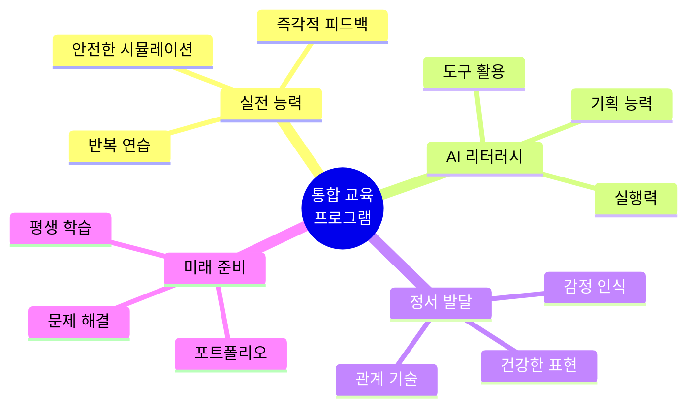

### 💡 2가지 모드, 하나의 목표

**모드 1 (체험 중심)**: 실전 대응 능력 향상
- ✅ 안전한 환경에서 시행착오
- ✅ AI 피드백으로 패턴 발견
- ✅ 실생활 즉시 적용

**모드 2 (메이커 중심)**: 실전 능력 + AI 리터러시
- ✅ 체험 + 제작의 시너지
- ✅ 코딩 없이도 웹앱 개발
- ✅ 취업 경쟁력 확보

### 🚀 AI 시대가 요구하는 인재

**과거:** 지식을 암기하는 학생  
**현재:** 도구를 활용해 문제를 해결하는 인재

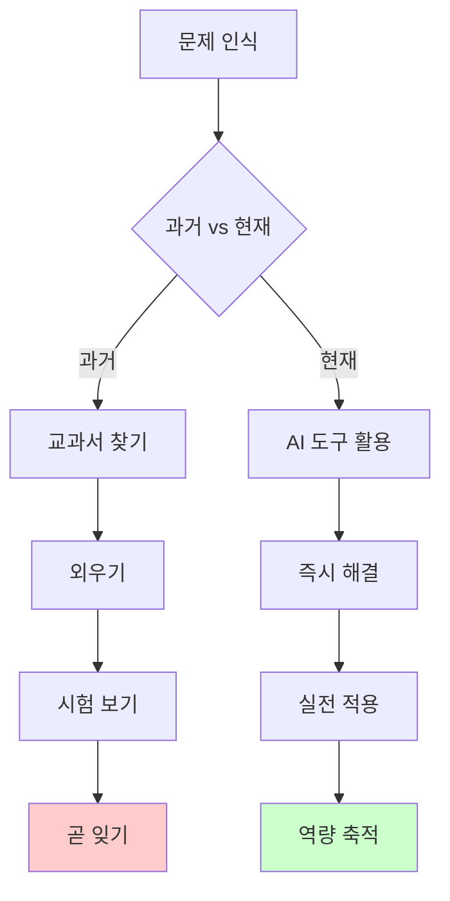

**이 프로그램이 양성하는 인재:**
- ✅ 감정을 이해하고 건강하게 표현하는 **정서 지능**
- ✅ 문제를 발견하고 정의하는 **기획 능력**
- ✅ AI 도구를 활용해 실현하는 **실행 능력**
- ✅ 끊임없이 배우고 적응하는 **평생 학습자**

---

### 🎯 적용 및 확장 가능성

**다른 분야 적용:**

| 분야 | 프로젝트 예시 | 학습 목표 | 모드 |
|------|-------------|----------|------|
| **의료/보건** | 증상 체크 시뮬레이터 | 진단 프로세스 이해 | 체험 |
| **의료/보건** | 건강 앱 제작 | 헬스케어 서비스 기획 | 메이커 |
| **법률** | 법률 상담 챗봇 체험 | 법적 사고 능력 | 체험 |
| **법률** | AI 법률 도우미 제작 | 법률 서비스 설계 | 메이커 |
| **교육** | 학습 코칭 시뮬레이터 | 효과적 학습법 | 체험 |
| **교육** | 맞춤형 학습 플랫폼 제작 | 교육 설계 능력 | 메이커 |

**확장 가능성:**
- 🏫 중고등학교 진로 교육
- 🏢 기업 신입사원 교육
- 🎓 평생교육원 프로그램
- 💼 취업 준비생 부트캠프
- 🌍 글로벌 온라인 교육

---

### 📚 교수자를 위한 시작 가이드

**이 프로그램을 시작하려면:**

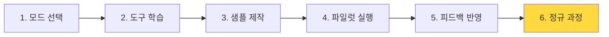

**Week 1 준비물 (체험 모드):**
- [ ] 15개 게임 중 3개 선택
- [ ] 학생용 가이드 문서
- [ ] 성찰 워크북
- [ ] 평가 루브릭

**Week 1 준비물 (메이커 모드):**
- [ ] V0, Cursor, ChatGPT 계정
- [ ] 완성 샘플 1개 (시연용)
- [ ] 학생용 메이커 워크북
- [ ] GitHub 저장소 템플릿
- [ ] 프롬프트 템플릿 모음

**추천 시작 단계:**
1. **교수자가 먼저 체험** (모드 1 게임 3개 플레이)
2. **샘플 제작 시도** (모드 2로 간단한 시뮬레이터 1개)
3. **소규모 파일럿** (5명 학생으로 테스트)
4. **피드백 반영** (커리큘럼 조정)
5. **정규 과정 운영**

---

### 💬 FAQ - 자주 묻는 질문

**Q1. 2가지 모드 중 어떤 걸 선택해야 하나요?**  
A. 학습 목표에 따라 선택하세요:
- **실전 대응 능력만** 필요 → 모드 1 (20시간)
- **AI 리터러시 + 포트폴리오** 필요 → 모드 2 (40시간)
- 두 모드를 순차적으로 진행해도 좋습니다!

**Q2. 코딩을 전혀 모르는 학생도 메이커 모드가 가능한가요?**  
A. 네! 오히려 코딩 경험이 없는 학생이 선입견 없이 더 잘 배웁니다. AI 도구(V0, Cursor)가 코딩을 대신하므로 기획 능력과 사고력이 더 중요합니다.

**Q3. 8주가 너무 짧지 않나요?**  
A. 완성도 높은 1개 프로젝트를 만들기에 적당합니다. 더 많은 프로젝트를 원하면 학기 단위(16주)로 확장하세요.

**Q4. AI 도구 비용이 부담스럽습니다**  
A. 대부분 무료 크레딧으로 가능합니다:
- OpenAI: 신규 가입 시 $5 무료 (충분!)
- V0: 무료 플랜 제공
- Cursor: 무료 체험 + 학생 할인
- ChatGPT: 무료 버전 활용 가능

**Q5. 모드 1만 하고 나중에 모드 2를 추가할 수 있나요?**  
A. 가능합니다! 많은 학생이 체험 후 "내가 만들고 싶다"는 동기를 얻어 메이커 모드를 선택합니다.

**Q6. 평가는 어떻게 하나요?**  
A. 모드별로 다릅니다:
- **모드 1**: 게임 엔딩 + 성찰 일지 + 실생활 적용
- **모드 2**: 위 + 작동하는 웹앱 + GitHub 포트폴리오 + 발표

**Q7. 게임이 완성되지 않았는데 어떻게 하나요?**  
A. 아직 3개 게임(감정 AI)만 완성되었습니다. 나머지는:
- 교수자가 직접 제작 (메이커 모드 활용!)
- 학생이 제작 (최고의 학습 경험)
- 오픈소스 기여 (커뮤니티와 함께)

---

### 🔗 참고 자료

**학술 논문**:
- Gottman, J. M. (1999). *The Marriage Clinic*. W.W. Norton & Company.
- Schore, A. N. (2003). *Affect Regulation and the Repair of the Self*. W.W. Norton.
- Papert, S. (1980). *Mindstorms: Children, Computers, and Powerful Ideas*. Basic Books.

**AI 교육 자료**:
- OpenAI Prompt Engineering Guide
- Vercel V0 Documentation
- Cursor AI Tutorial
- LangChain Documentation
- Game-Based Learning Research

**메이커 교육**:
- Martinez, S. L., & Stager, G. (2013). *Invent To Learn*. Constructing Modern Knowledge Press.
- Dougherty, D. (2013). *The Maker Mindset*. MIT Press.

---

### 🌐 커뮤니티 & 지원

**교사 커뮤니티:**
- 💬 Discord: [바이브코딩 교사 커뮤니티]
- 📝 GitHub: [오픈소스 저장소]
- 📺 YouTube: [튜토리얼 영상]
- 📧 이메일 지원: vivecoding.ai@example.com

**학생 커뮤니티:**
- 💬 Discord: [메이커 학생 채널]
- 🎨 프로젝트 갤러리
- 🏆 월간 베스트 프로젝트 선정

**정기 이벤트:**
- 📅 월 1회 온라인 워크숍
- 🏆 분기별 프로젝트 경진대회
- 🎓 방학 집중 부트캠프

---

### 📞 문의

**프로그램 도입 문의:**
- 📧 Email: vivecoding.ai@example.com
- 📱 카카오톡: [채널 링크]
- 🌐 웹사이트: www.vibecoding.ai

**제목에 포함할 내용:**
```
[AI가상환경 교육 도입 문의] 
- 소속 기관:
- 대상 학생: (학년, 전공, 인원)
- 희망 모드: 체험 / 메이커 / 둘 다
- 시작 시기:
- 질문사항:
```

---

## 🎉 마치며

### 핵심 메시지

> **"코딩이 아니라 사고를, 이론이 아니라 실전을, 평가가 아니라 성장을 추구하는 AI 시대의 새로운 교육"**

**체험 모드**: 안전한 가상환경에서 실전 대응 능력 향상  
**메이커 모드**: AI 도구로 누구나 크리에이터가 되는 경험

두 모드 모두 학생의 **성장**을 최우선으로 합니다.

---

**제작**: 바이브코딩 AI교육 연구소  
**버전**: v2.0 (메이커 통합 버전)  
**최종 수정일**: 2025.11.28  
**라이선스**: CC BY-NC-SA 4.0 (교육 목적 자유 사용, 출처 표기 필수)

---

**변경 이력:**
- v1.0 (2025.11.28): 초기 버전 (체험 중심)
- v2.0 (2025.11.28): 메이커 모드 통합, AI 도구 가이드 추가

---

*이 가이드는 계속 업데이트됩니다. 피드백과 기여를 환영합니다!* 🙏

**기여 방법:**
1. GitHub에서 Issue 등록
2. Pull Request 제출
3. 커뮤니티에서 의견 공유
4. 성공 사례 제출

**함께 만들어가는 AI 교육 혁신에 동참해주세요!** 🚀

