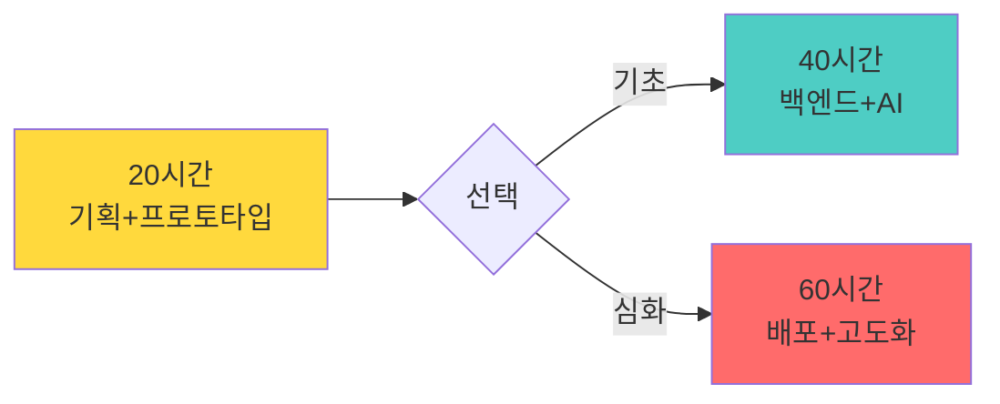
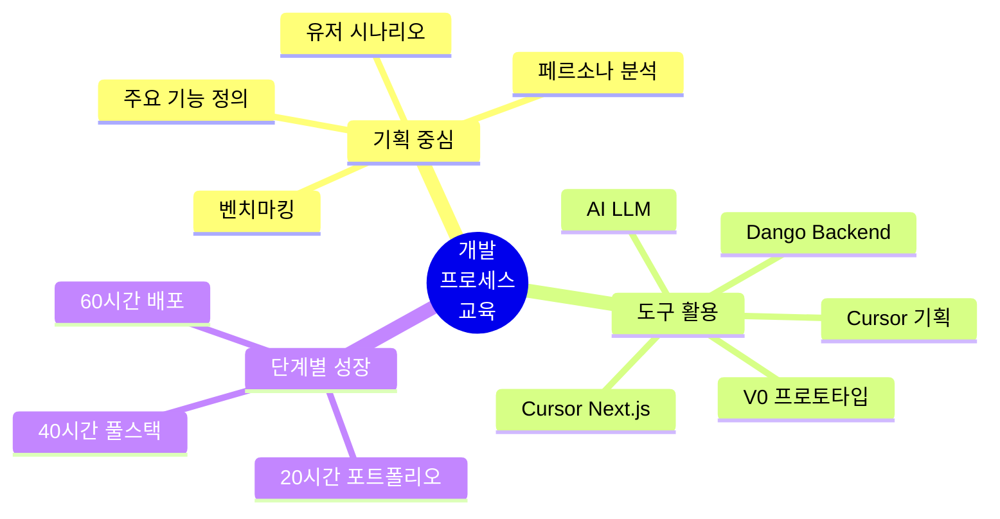
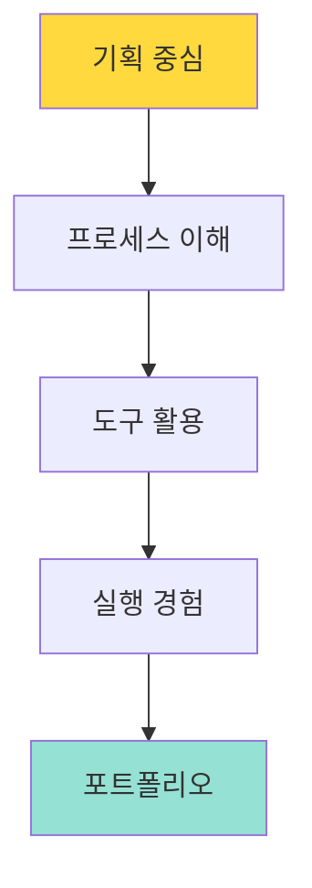
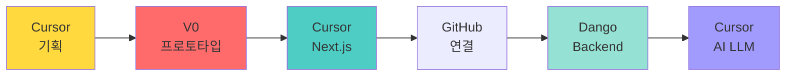
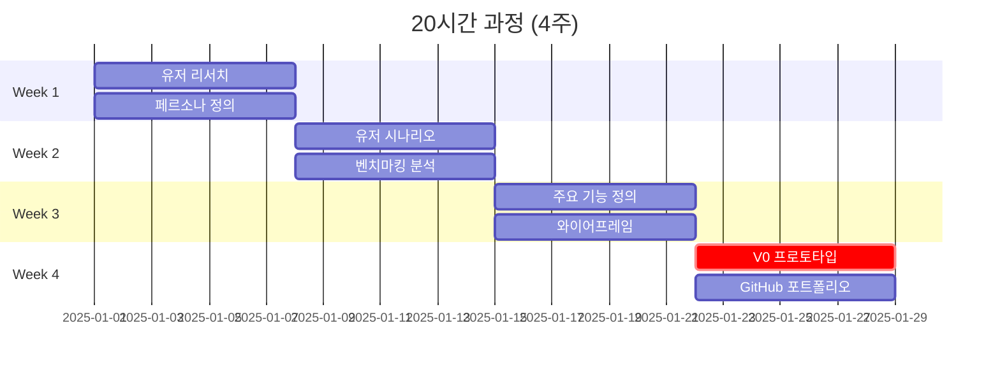
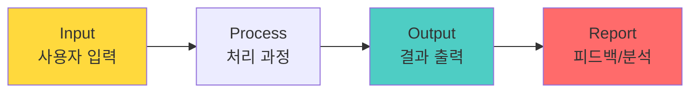
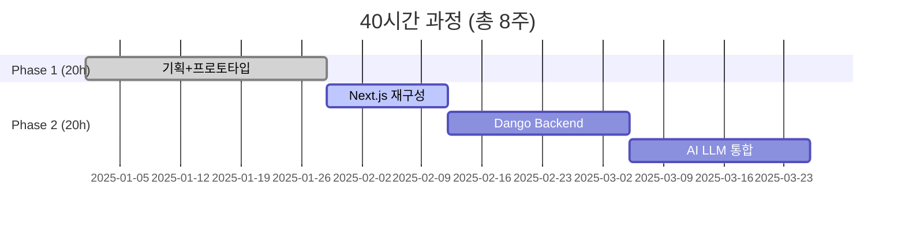
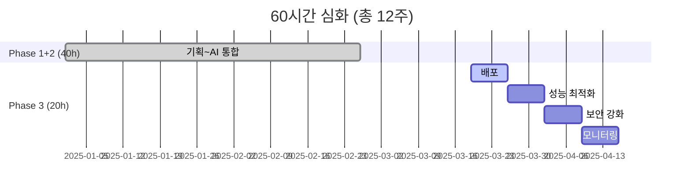
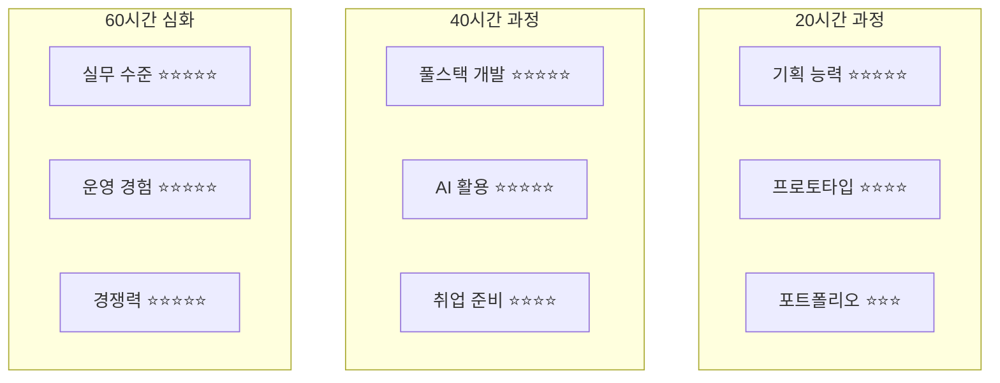
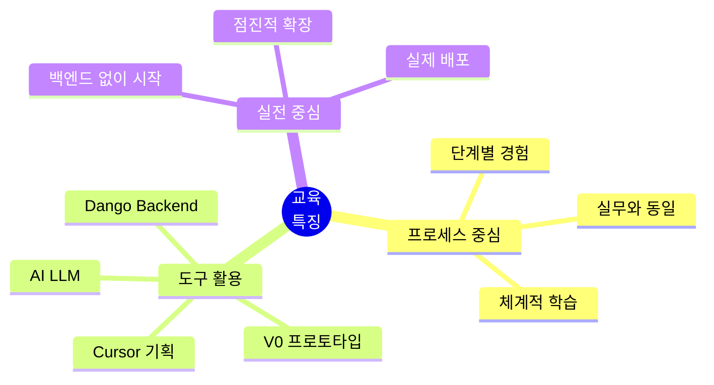

# 개발 프로세스 중심 AI 교육 가이드 v4.0
## 기획자와 실행자 양성을 위한 단계별 교육 프로그램

> **"기획 → 프로토타입 → 개발 → 배포"**  
> 개발 프로세스를 이해하고 경험하는 것이 핵심



---

## 📋 목차

1. [프로그램 개요](#프로그램-개요)
2. [교육 철학](#교육-철학)
3. [개발 프로세스](#개발-프로세스)
4. [20시간 과정: 기획+프로토타입](#20시간-과정-기획프로토타입)
5. [40시간 과정: 백엔드+AI](#40시간-과정-백엔드ai)
6. [60시간 심화: 배포+고도화](#60시간-심화-배포고도화)
7. [평가 및 성과 측정](#평가-및-성과-측정)

---

## 프로그램 개요

### 🎯 핵심 목표

**"개발 프로세스를 이해하고 경험하여 기획자와 실행자를 양성한다"**

### 💡 교육 대상

- **20시간 과정**: 고등학생, 대학생 (전공 무관)
- **40시간 과정**: 개발 지식이 필요한 학생 (동시 학습)
- **60시간 심화**: 실무 수준의 프로젝트를 원하는 학생

### 🌟 차별화 포인트



---

## 교육 철학

### 🎓 "체험이 아닌 개발 프로세스 이해"

**기존 교육의 문제점:**
- ❌ 체험 위주로 표면적 이해
- ❌ 개발 과정에 대한 실질적 경험 부족
- ❌ 기획과 실행의 분리

**새로운 접근:**
- ✅ 개발 프로세스의 전체 흐름 이해
- ✅ 기획부터 배포까지 직접 경험
- ✅ 기획자와 실행자 역량 동시 개발

### 💭 핵심 원칙



**1. 기획이 먼저다**
- 유저 시나리오 작성
- 페르소나 정의
- 벤치마킹 분석
- 주요 기능 정의 (Input-Output-Report)

**2. 프로세스를 경험한다**
- 단계별 개발 과정 체험
- 각 단계의 목적과 방법 이해
- 실무와 동일한 워크플로우

**3. 도구를 활용한다**
- Cursor로 기획 및 개발
- V0로 프로토타입 제작
- Dango로 백엔드 구축
- AI(LLM)로 기능 고도화

---

## 개발 프로세스

### 🔄 전체 개발 프로세스



### 📊 단계별 상세 프로세스

#### 1단계: Cursor 기획 (20시간 과정)

**주요 활동:**
- 유저 시나리오 작성
- 벤치마킹 분석
- 페르소나 정의
- 주요 기능 정의 (Input-Output-Report)

**산출물:**
- 기획서 문서
- 유저 플로우 다이어그램
- 기능 명세서
- 와이어프레임

#### 2단계: V0 프로토타입 (20시간 과정)

**주요 활동:**
- V0로 UI/UX 프로토타입 제작
- 사용자 테스트
- 피드백 반영

**산출물:**
- 작동하는 프론트엔드 프로토타입
- localStorage/JSON 기반 임시 데이터
- 동작 테스트 완료

**특징:**
- 백엔드 없이 독립적으로 동작
- 빠른 프로토타이핑
- 즉각적인 사용자 피드백

#### 3단계: Cursor Next.js (40시간 과정 시작)

**주요 활동:**
- V0 프로토타입을 Next.js로 전환
- GitHub 저장소 연결
- 컴포넌트 구조화
- 라우팅 설정

**산출물:**
- Next.js 프로젝트
- GitHub 저장소
- 컴포넌트 라이브러리

#### 4단계: Dango Backend (40시간 과정)

**주요 활동:**
- Cursor-Dango로 백엔드 API 개발
- 데이터베이스 설계
- API 엔드포인트 구현
- 프론트엔드-백엔드 연동

**산출물:**
- RESTful API
- 데이터베이스 스키마
- API 문서

#### 5단계: Cursor AI (LLM) (40시간 과정)

**주요 활동:**
- LLM API 통합
- AI 기능 구현
- 프롬프트 엔지니어링

**산출물:**
- AI 기능이 통합된 완성 프로젝트
- 배포 준비 완료

#### 6단계: 배포 및 고도화 (60시간 심화)

**주요 활동:**
- Vercel/AWS 배포
- 성능 최적화
- 보안 강화
- 모니터링 설정

**산출물:**
- 실제 서비스 URL
- 완성된 포트폴리오
- 운영 매뉴얼

---

## 20시간 과정: 기획+프로토타입

### 🎯 과정 목표

**"아이디어를 프로토타입으로 구현하여 포트폴리오 1개 완성"**

### 📅 주차별 커리큘럼



### 📝 Week 1-2: 유저 중심 기획 (10시간)

#### **Day 1-3: 유저 리서치 & 페르소나 (5시간)**

```markdown
━━━━━━━━━━━━━━━━━━━━━━
🔍 유저 리서치

00:00-01:30 | 문제 발견
• 일상의 불편함 찾기
• 해결하고 싶은 문제 정의
• 타겟 사용자 파악

예시 질문:
- 우리 주변에 어떤 문제가 있나요?
- 누가 이 문제로 힘들어하나요?
- 왜 기존 솔루션은 부족한가요?

01:30-03:00 | 페르소나 작성
• 구체적인 사용자 프로필
• 니즈와 페인 포인트
• 기대하는 해결책

페르소나 템플릿:
이름: 대학생 민지 (22세)
직업: 경영학과 3학년
문제: 팀 프로젝트 일정 관리의 어려움
니즈: 간단하고 직관적인 협업 도구
━━━━━━━━━━━━━━━━━━━━━━
```

**산출물:**
- [ ] 문제 정의서
- [ ] 페르소나 2-3개
- [ ] 유저 인터뷰 정리

#### **Day 4-7: 유저 시나리오 & 벤치마킹 (5시간)**

```markdown
━━━━━━━━━━━━━━━━━━━━━━
📖 유저 시나리오 작성

00:00-02:30 | 사용자 여정 설계
• 사용 전 상황
• 사용 중 경험
• 사용 후 변화

시나리오 예시:
"민지는 팀 프로젝트 마감이 다가오는데
팀원들의 진행 상황을 알 수 없어 답답하다.
→ 우리 앱을 통해 실시간으로 진행 상황 확인
→ 효율적인 일정 조율과 스트레스 감소"

02:30-05:00 | 벤치마킹
• 경쟁 서비스 분석 (최소 3개)
• 강점과 약점 파악
• 차별화 포인트 도출

벤치마킹 시트:
서비스명 | 장점 | 단점 | 우리의 차별점
━━━━━━━━━━━━━━━━━━━━━━
```

**산출물:**
- [ ] 유저 시나리오 3개 이상
- [ ] 벤치마킹 분석 보고서
- [ ] 차별화 전략

---

### 📝 Week 3: 주요 기능 정의 (5시간)

#### **Input-Output-Report 방식**



#### **Day 1-2: 핵심 기능 3가지 정의 (3시간)**

```markdown
━━━━━━━━━━━━━━━━━━━━━━
⚙️ 기능 정의 워크숍

각 기능별로 다음을 명확히 정의:

기능 1: [기능명]
├─ Input: 사용자가 입력하는 것
│  예) 할 일 제목, 마감일, 담당자
│
├─ Output: 시스템이 보여주는 것
│  예) 할 일 카드, 진행 상태, 알림
│
└─ Report: 피드백/분석
   예) 완료율, 지연 알림, 팀 성과

실습:
1. 우선순위 정하기 (Must Have vs Nice to Have)
2. 각 기능의 Input-Output-Report 작성
3. 실현 가능성 검토
━━━━━━━━━━━━━━━━━━━━━━
```

**템플릿:**

| 기능명 | Input | Output | Report | 우선순위 |
|--------|-------|--------|--------|----------|
| 할 일 등록 | 제목, 날짜, 담당자 | 할 일 카드 표시 | 등록 완료 알림 | Must Have |
| 진행 상황 확인 | 날짜 선택 | 진행률 그래프 | 지연 항목 경고 | Must Have |
| 팀원 초대 | 이메일 입력 | 초대 메시지 발송 | 수락/거절 알림 | Nice to Have |

#### **Day 3: 와이어프레임 (2시간)**

```markdown
━━━━━━━━━━━━━━━━━━━━━━
🎨 화면 설계

도구: 종이 스케치 or Figma or Excalidraw

화면별 와이어프레임:
1. 메인 대시보드
   - 상단: 네비게이션
   - 중앙: 핵심 기능
   - 하단: 부가 정보

2. 상세 페이지
3. 설정 페이지

체크리스트:
□ 모든 Input 요소 위치 표시
□ Output 표시 영역 명확히
□ 사용자 플로우 화살표로 연결
━━━━━━━━━━━━━━━━━━━━━━
```

**산출물:**
- [ ] 핵심 기능 3개 정의서 (Input-Output-Report)
- [ ] 와이어프레임 (최소 3개 화면)
- [ ] 사용자 플로우 다이어그램

---

### 📝 Week 4: V0 프로토타입 제작 (5시간)

#### **V0 활용 프로토타이핑**

```markdown
━━━━━━━━━━━━━━━━━━━━━━
🚀 V0로 UI 생성

00:00-00:30 | V0 소개 및 실습
• V0 계정 생성
• 기본 사용법 익히기
• 예시 프로젝트 체험

00:30-03:00 | 프로토타입 제작
• 와이어프레임 → V0 프롬프트
• UI 컴포넌트 생성
• 반복 수정 및 개선

V0 프롬프트 예시:
"팀 프로젝트 관리 대시보드를 만들어줘.
상단에는 프로젝트 제목과 진행률,
중앙에는 할 일 카드 리스트(제목, 담당자, 마감일),
우측에는 팀원 목록을 표시.
색상은 파란색 계열, 모던한 디자인"

03:00-05:00 | 데이터 연동
• JSON 파일로 임시 데이터 생성
• localStorage 활용
• 기본 인터랙션 구현
━━━━━━━━━━━━━━━━━━━━━━
```

#### **localStorage 활용 예시**

```javascript
// 간단한 데이터 저장/불러오기
// 백엔드 없이 프론트엔드만으로 동작 테스트

// 할 일 저장
function saveTodo(todo) {
  const todos = JSON.parse(localStorage.getItem('todos') || '[]');
  todos.push(todo);
  localStorage.setItem('todos', JSON.stringify(todos));
}

// 할 일 불러오기
function getTodos() {
  return JSON.parse(localStorage.getItem('todos') || '[]');
}
```

#### **JSON 임시 데이터 예시**

```json
{
  "todos": [
    {
      "id": 1,
      "title": "프론트엔드 개발",
      "assignee": "민지",
      "deadline": "2025-01-30",
      "status": "진행중"
    },
    {
      "id": 2,
      "title": "UI/UX 디자인",
      "assignee": "준호",
      "deadline": "2025-01-28",
      "status": "완료"
    }
  ]
}
```

### 🎉 Week 4: GitHub 포트폴리오 완성

```markdown
━━━━━━━━━━━━━━━━━━━━━━
📦 포트폴리오 정리

□ GitHub 저장소 생성
□ README 작성
  - 프로젝트 소개
  - 주요 기능
  - 기술 스택
  - 개발 과정
□ 프로토타입 배포 (Vercel/Netlify)
□ 스크린샷 및 데모 영상

README 템플릿:
# 프로젝트 이름

> 한 줄 소개

## 📌 기획 배경
[페르소나와 문제 정의]

## ✨ 주요 기능
1. 기능 1 (Input-Output-Report)
2. 기능 2
3. 기능 3

## 🎨 화면 구성
[스크린샷]

## 🛠 기술 스택
- V0 (프로토타이핑)
- Next.js / React
- localStorage (데이터)

## 📖 개발 과정
Week 1-2: 기획
Week 3: 기능 정의
Week 4: 프로토타입 제작
━━━━━━━━━━━━━━━━━━━━━━
```

---

### 📊 20시간 과정 평가

**총 100점**

| 평가 항목 | 배점 | 세부 기준 |
|---------|------|----------|
| **기획 문서** | 40점 | • 페르소나 (10점)<br/>• 유저 시나리오 (10점)<br/>• 기능 정의 (10점)<br/>• 와이어프레임 (10점) |
| **프로토타입** | 40점 | • UI 완성도 (15점)<br/>• 기능 동작 (15점)<br/>• 사용자 경험 (10점) |
| **포트폴리오** | 20점 | • GitHub README (10점)<br/>• 배포 (5점)<br/>• 발표 (5점) |

**학습 성과:**
- ✅ 완성된 프로토타입 1개
- ✅ GitHub 포트폴리오
- ✅ 기획 역량 습득
- ✅ V0 활용 능력

---

## 40시간 과정: 백엔드+AI

### 🎯 과정 목표

**"프로토타입을 실제 서비스로 발전시키기"**

**선수 조건:**
- 20시간 과정 수료 (프로토타입 보유)
- 기본 개발 지식 (동시 학습 가능)

### 📅 전체 구조 (20시간 + 추가 20시간)



### 📝 Week 5-6: Cursor Next.js (10시간)

#### **프로토타입 → 프로덕션 전환**

```markdown
━━━━━━━━━━━━━━━━━━━━━━
🔧 Next.js 프로젝트 세팅

Day 1-2: 프로젝트 구조화 (5시간)

1. Next.js 프로젝트 생성
   npx create-next-app@latest my-project
   
2. V0 코드 마이그레이션
   • 컴포넌트 분리
   • 페이지 라우팅
   • 레이아웃 구성

3. GitHub 연동
   git init
   git remote add origin [repository-url]
   git push -u origin main

프로젝트 구조:
my-project/
├── app/
│   ├── layout.tsx
│   ├── page.tsx
│   └── [feature]/
│       └── page.tsx
├── components/
│   ├── ui/
│   └── features/
├── lib/
└── public/

Day 3-5: 상태 관리 & API (5시간)

4. 전역 상태 관리
   • Zustand or Context API
   • localStorage → 상태 관리

5. API 라우트 준비
   • /app/api/ 폴더 구조
   • 백엔드 연동 준비
━━━━━━━━━━━━━━━━━━━━━━
```

**핵심 개념 학습 (동시 진행):**

```markdown
📚 필수 개발 지식

1. React 기초
   • 컴포넌트
   • Props & State
   • Hooks (useState, useEffect)

2. Next.js 기초
   • 파일 기반 라우팅
   • 서버/클라이언트 컴포넌트
   • API Routes

3. Git/GitHub
   • 기본 명령어 (add, commit, push)
   • 브랜치 관리
   • Pull Request

학습 방식:
- 온라인 튜토리얼 (2시간)
- 실전 적용하며 학습 (8시간)
- 막힐 때 Cursor AI에게 질문
```

---

### 📝 Week 7-9: Dango Backend (15시간)

#### **Cursor-Dango로 백엔드 구축**

```markdown
━━━━━━━━━━━━━━━━━━━━━━
🗄️ 백엔드 개발

Week 7: 데이터베이스 설계 (5시간)

1. 데이터 모델링
   • 엔티티 정의
   • 관계 설정
   • 스키마 작성

예시: 할 일 관리 앱
- User (사용자)
- Project (프로젝트)
- Todo (할 일)
- Comment (댓글)

2. Dango 설정
   • 데이터베이스 연결
   • 모델 생성
   • 마이그레이션

Week 8: API 개발 (5시간)

3. RESTful API 구현
   GET    /api/todos       → 목록 조회
   POST   /api/todos       → 생성
   PUT    /api/todos/:id   → 수정
   DELETE /api/todos/:id   → 삭제

4. Cursor-Dango 활용
   • 자동 코드 생성
   • CRUD 구현
   • 에러 처리

Week 9: 프론트-백 연동 (5시간)

5. API 호출
   • fetch/axios
   • 데이터 로딩 상태
   • 에러 핸들링

6. localStorage 제거
   • 백엔드 API로 전환
   • 실시간 데이터 동기화
━━━━━━━━━━━━━━━━━━━━━━
```

**Cursor-Dango 예시:**

```javascript
// Cursor에게 요청:
// "할 일 목록을 가져오는 API를 만들어줘"

// pages/api/todos/index.ts
export default async function handler(req, res) {
  if (req.method === 'GET') {
    // Dango를 통해 데이터베이스에서 조회
    const todos = await db.todos.findMany();
    res.status(200).json(todos);
  } else if (req.method === 'POST') {
    // 새 할 일 생성
    const newTodo = await db.todos.create({
      data: req.body
    });
    res.status(201).json(newTodo);
  }
}
```

---

### 📝 Week 10-11: Cursor AI (LLM) (10시간)

#### **AI 기능 통합**

```markdown
━━━━━━━━━━━━━━━━━━━━━━
🤖 AI 기능 추가

Week 10: LLM API 통합 (5시간)

1. OpenAI API 설정
   • API 키 발급
   • 환경 변수 설정
   • 요금제 이해

2. 프롬프트 엔지니어링
   • 시스템 프롬프트 작성
   • 컨텍스트 관리
   • 응답 파싱

예시: AI 할 일 추천 기능
사용자: "이번 주 해야 할 일"
AI 프롬프트:
"당신은 프로젝트 관리 도우미입니다.
사용자의 프로젝트 상황을 분석하여
우선순위가 높은 할 일 3가지를 추천해주세요.

현재 상황:
- 마감 임박 프로젝트: 2개
- 진행 중인 작업: 5개
- 팀원 가용 시간: ...

추천 형식:
1. [할 일] - [이유]"

Week 11: AI 기능 고도화 (5시간)

3. 다양한 AI 기능
   • 자동 요약
   • 스마트 알림
   • 챗봇 상담

4. 사용자 경험 개선
   • 로딩 상태 표시
   • 스트리밍 응답
   • 에러 처리
━━━━━━━━━━━━━━━━━━━━━━
```

**AI 통합 예시:**

```javascript
// app/api/ai/recommend.ts
import OpenAI from 'openai';

const openai = new OpenAI({
  apiKey: process.env.OPENAI_API_KEY
});

export async function POST(req: Request) {
  const { context } = await req.json();
  
  // Cursor AI가 도와주는 프롬프트 구성
  const completion = await openai.chat.completions.create({
    model: "gpt-4",
    messages: [
      {
        role: "system",
        content: "당신은 프로젝트 관리 AI 도우미입니다."
      },
      {
        role: "user",
        content: `다음 상황을 분석하여 추천해주세요:\n${context}`
      }
    ]
  });
  
  return Response.json({
    recommendation: completion.choices[0].message.content
  });
}
```

---

### 🎉 40시간 과정 완성

**최종 산출물:**

```markdown
✅ 체크리스트

1. 기획 문서 (20시간 과정)
   □ 페르소나
   □ 유저 시나리오
   □ 기능 정의서

2. 프론트엔드 (Week 5-6)
   □ Next.js 프로젝트
   □ 반응형 UI
   □ 상태 관리

3. 백엔드 (Week 7-9)
   □ 데이터베이스
   □ RESTful API
   □ 인증/권한

4. AI 통합 (Week 10-11)
   □ LLM API
   □ AI 기능 3개 이상
   □ 사용자 경험 최적화

5. GitHub & 문서
   □ 전체 소스코드
   □ API 문서
   □ 개발 일지
```

---

### 📊 40시간 과정 평가

**총 100점**

| 평가 항목 | 배점 | 세부 기준 |
|---------|------|----------|
| **기획 (20h)** | 20점 | 20시간 과정 평가 |
| **프론트엔드** | 25점 | • Next.js 구조 (10점)<br/>• UI/UX (10점)<br/>• 상태 관리 (5점) |
| **백엔드** | 25점 | • API 구현 (15점)<br/>• 데이터베이스 (10점) |
| **AI 통합** | 20점 | • LLM 연동 (10점)<br/>• AI 기능 품질 (10점) |
| **문서 & 발표** | 10점 | • GitHub (5점)<br/>• 발표 (5점) |

---

## 60시간 심화: 배포+고도화

### 🎯 과정 목표

**"실제 서비스 수준의 프로젝트 완성"**

**선수 조건:**
- 40시간 과정 수료
- 작동하는 풀스택 프로젝트 보유

### 📅 추가 20시간 구성



### 📝 Week 12: 배포 (5시간)

```markdown
━━━━━━━━━━━━━━━━━━━━━━
🚀 프로덕션 배포

1. 환경 분리 (1시간)
   • 개발/스테이징/프로덕션
   • 환경 변수 관리
   • 설정 파일 분리

2. Vercel 배포 (2시간)
   • 프론트엔드 배포
   • 도메인 연결
   • 환경 변수 설정

3. 백엔드 배포 (2시간)
   • AWS/Heroku 선택
   • 데이터베이스 마이그레이션
   • API 엔드포인트 업데이트

체크리스트:
□ HTTPS 적용
□ 커스텀 도메인
□ 환경 변수 보안
□ 배포 자동화 (CI/CD)
━━━━━━━━━━━━━━━━━━━━━━
```

### 📝 Week 13: 성능 최적화 (5시간)

```markdown
━━━━━━━━━━━━━━━━━━━━━━
⚡ 성능 개선

1. 프론트엔드 최적화 (2시간)
   • 이미지 최적화
   • 코드 스플리팅
   • 레이지 로딩

2. 백엔드 최적화 (2시간)
   • 데이터베이스 인덱싱
   • 쿼리 최적화
   • 캐싱 전략

3. 성능 측정 (1시간)
   • Lighthouse 스코어
   • API 응답 시간
   • 로드 테스트

목표:
□ Lighthouse 90점 이상
□ API 응답 < 500ms
□ 페이지 로드 < 3초
━━━━━━━━━━━━━━━━━━━━━━
```

### 📝 Week 14: 보안 강화 (5시간)

```markdown
━━━━━━━━━━━━━━━━━━━━━━
🔒 보안 점검

1. 인증/인가 (2시간)
   • JWT 토큰 관리
   • 세션 보안
   • 권한 체계

2. 데이터 보안 (2시간)
   • SQL Injection 방지
   • XSS 방어
   • CSRF 토큰

3. API 보안 (1시간)
   • Rate Limiting
   • API 키 관리
   • CORS 설정

보안 체크리스트:
□ 환경 변수 암호화
□ HTTPS 강제
□ 입력 검증
□ 에러 메시지 최소화
━━━━━━━━━━━━━━━━━━━━━━
```

### 📝 Week 15: 모니터링 & 유지보수 (5시간)

```markdown
━━━━━━━━━━━━━━━━━━━━━━
📊 모니터링 설정

1. 로깅 (2시간)
   • 에러 로깅
   • 사용자 행동 추적
   • 성능 로그

2. 모니터링 도구 (2시간)
   • Sentry (에러 추적)
   • Google Analytics (사용자 분석)
   • Uptime 모니터링

3. 알림 설정 (1시간)
   • 에러 알림
   • 성능 저하 알림
   • 보안 이벤트 알림

운영 문서:
□ 배포 매뉴얼
□ 장애 대응 가이드
□ API 문서
□ 사용자 가이드
━━━━━━━━━━━━━━━━━━━━━━
```

---

### 🎉 60시간 심화 완성

**최종 포트폴리오:**

```markdown
📦 완성된 서비스

1. 기획 문서 ⭐⭐⭐⭐⭐
   • 전문적인 기획서
   • 명확한 타겟과 목표

2. 프론트엔드 ⭐⭐⭐⭐⭐
   • 반응형 디자인
   • 직관적인 UX
   • 빠른 성능

3. 백엔드 ⭐⭐⭐⭐⭐
   • 안정적인 API
   • 확장 가능한 구조
   • 보안 강화

4. AI 기능 ⭐⭐⭐⭐⭐
   • 실용적인 AI 활용
   • 사용자 가치 제공

5. 배포 & 운영 ⭐⭐⭐⭐⭐
   • 실제 서비스 URL
   • 모니터링 시스템
   • 유지보수 체계

취업 포트폴리오로 강력!
```

---

### 📊 60시간 심화 평가

**총 100점**

| 평가 항목 | 배점 | 세부 기준 |
|---------|------|----------|
| **40시간 과정** | 50점 | 기존 평가 |
| **배포** | 15점 | • 프로덕션 배포 (10점)<br/>• 도메인 (5점) |
| **성능** | 15점 | • Lighthouse 점수 (10점)<br/>• 최적화 (5점) |
| **보안** | 10점 | • 보안 체크리스트 |
| **운영** | 10점 | • 모니터링 (5점)<br/>• 문서 (5점) |

---

## 평가 및 성과 측정

### 📊 과정별 성과 비교



### 🎯 학습 성과

#### **20시간 과정**

**정량적 성과:**
- ✅ 완성된 프로토타입 1개
- ✅ GitHub 포트폴리오
- ✅ 기획 문서 (페르소나, 시나리오, 기능 정의)

**정성적 성과:**
- "기획의 중요성을 깨달았어요"
- "V0로 빠르게 만들 수 있어서 신기했어요"
- "내 아이디어가 화면으로 구현되니 뿌듯해요"

#### **40시간 과정**

**정량적 성과:**
- ✅ 작동하는 풀스택 웹 애플리케이션
- ✅ 백엔드 API + 데이터베이스
- ✅ AI 기능 통합
- ✅ GitHub 포트폴리오 (커밋 100+ 개)

**정성적 성과:**
- "개발 프로세스를 이해하게 되었어요"
- "Cursor와 AI 도구가 엄청난 도움이 됐어요"
- "이제 아이디어만 있으면 구현할 수 있어요"

#### **60시간 심화**

**정량적 성과:**
- ✅ 실제 배포된 서비스 URL
- ✅ 모니터링 및 운영 시스템
- ✅ 전문적인 포트폴리오

**정성적 성과:**
- "면접에서 자신있게 설명할 수 있어요"
- "실제 서비스 운영 경험이 큰 자산이에요"
- "창업도 가능할 것 같아요"

---

### 💼 취업 경쟁력

| 과정 | 포트폴리오 수준 | 취업 경쟁력 | 추천 대상 |
|------|----------------|------------|----------|
| **20시간** | 프로토타입 | ⭐⭐⭐ | 고등학생, 기획 직군 |
| **40시간** | 풀스택 프로젝트 | ⭐⭐⭐⭐⭐ | 대학생, 개발 직군 |
| **60시간** | 실제 서비스 | ⭐⭐⭐⭐⭐ | 취업 준비생, 창업 희망자 |

---

## 🎓 결론

### 핵심 메시지

> **"기획부터 배포까지, 개발 프로세스의 완전한 이해"**

### 3단계 교육 체계

**20시간**: 기획자로서의 시작
- 문제 발견 → 솔루션 기획 → 프로토타입

**40시간**: 실행자로서의 성장
- 프론트엔드 → 백엔드 → AI 통합

**60시간**: 전문가로서의 완성
- 배포 → 최적화 → 운영

### 차별화 포인트



---

**제작**: 바이브코딩 AI교육 연구소  
**버전**: v4.0 (개발 프로세스 중심)  
**최종 수정일**: 2025.11.28  
**라이선스**: CC BY-NC-SA 4.0

---

## 부록

### A. 필수 도구 설치 가이드

```markdown
🛠️ 개발 환경 세팅

1. Node.js 설치
   https://nodejs.org/

2. VS Code + Cursor
   https://cursor.sh/

3. Git 설치
   https://git-scm.com/

4. GitHub 계정
   https://github.com/

5. Vercel 계정
   https://vercel.com/

6. OpenAI API (40시간 과정)
   https://platform.openai.com/
```

### B. 학습 자료

```markdown
📚 추천 학습 자료

20시간 과정:
- V0 공식 문서
- UI/UX 디자인 기초
- 기획 방법론

40시간 과정:
- React 공식 튜토리얼
- Next.js 문서
- API 설계 가이드

60시간 심화:
- 배포 자동화 (CI/CD)
- 성능 최적화 전략
- 보안 베스트 프랙티스
```

### C. FAQ

**Q1. 코딩을 전혀 모르는데 40시간 과정이 가능한가요?**
A. 20시간 과정을 먼저 수강하고, 기본 개발 지식을 동시에 학습하면 가능합니다. Cursor AI가 많은 부분을 도와줍니다.

**Q2. 20시간만 들어도 포트폴리오가 되나요?**
A. 네, 프로토타입 수준의 포트폴리오가 완성됩니다. 기획 직군이나 PM 지망생에게 적합합니다.

**Q3. 60시간 과정이 꼭 필요한가요?**
A. 개발자로 취업하거나 실제 서비스를 운영하려면 60시간 과정을 권장합니다.

**Q4. 팀 프로젝트도 가능한가요?**
A. 2-3명 팀으로 진행하면 더 큰 프로젝트를 만들 수 있습니다. 역할 분담과 협업 경험도 얻을 수 있습니다.

**Q5. 어떤 프로젝트를 만들어야 하나요?**
A. 본인이 관심 있고 해결하고 싶은 문제에서 시작하세요. 진정성 있는 프로젝트가 가장 좋습니다.

---

**함께 만들어가는 AI 시대의 개발 교육!** 🚀
