# 가상환경 체험 AI 교육 심화 가이드 v2.0
## 고등학생·대학생을 위한 체험 + 메이커 통합 프로그램

> **"체험하고 → 이해하고 → 직접 만들어보자!"**  
> 2가지 모드로 학습 목표에 맞춰 선택하는 맞춤형 AI 교육

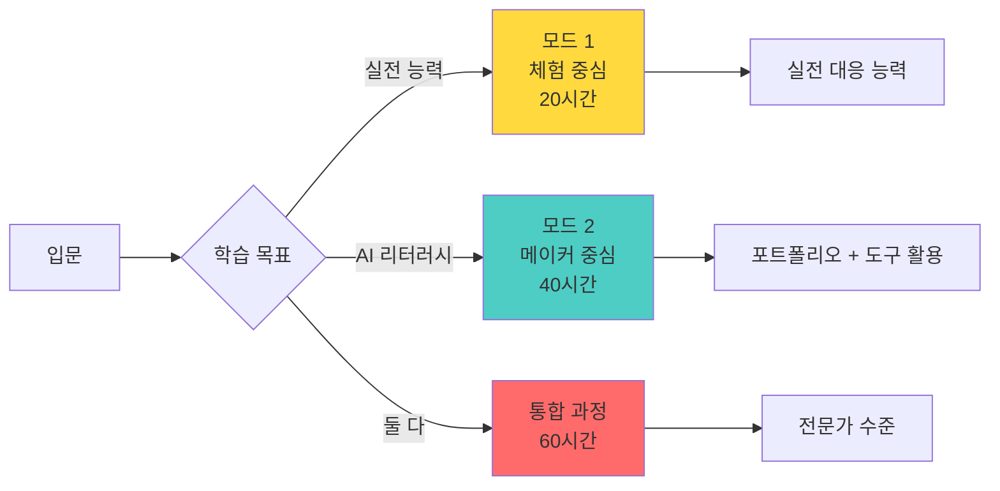

---

## 📋 목차

1. [프로그램 개요](#프로그램-개요)
2. [2가지 운영 모드](#2가지-운영-모드)
3. [메이커 교육 철학](#메이커-교육-철학)
4. [바이브코딩 학습 방식](#바이브코딩-학습-방식)
5. [3대 소주제 - 대학생 맞춤형](#3대-소주제)
6. [학습자 페르소나](#학습자-페르소나)
7. [AI-LLM 3단계 시스템](#ai-llm-3단계-시스템)
8. [모드 1: 체험 중심 커리큘럼](#모드-1-체험-중심-커리큘럼)
9. [모드 2: 메이커 프로세스 로드맵](#모드-2-메이커-프로세스-로드맵)
10. [AI 도구 활용 가이드](#ai-도구-활용-가이드)
11. [교수자 코칭 가이드](#교수자-코칭-가이드)
12. [학습 시나리오](#학습-시나리오)
13. [평가 및 성과 측정](#평가-및-성과-측정)

---

## 프로그램 개요

### 🎯 핵심 목표

**"체험으로 시작하고, 이해하고, 원하면 직접 만든다"**

학습자의 목표와 수준에 따라 **2가지 모드** 중 선택:
- 🎮 **모드 1**: 가상환경 체험을 통한 실전 대응 능력 향상
- 🛠️ **모드 2**: AI 도구로 직접 만들며 AI 리터러시 획득

대학생들이 흥미로워하는 주제(주식 투자, 연애, 창업)를 통해 실전 능력과 AI 활용 능력을 동시에 배양

### 🎓 교육 대상 및 목표

**공통 대상**: 고등학생(16세 이상), 대학생 (전공 무관)

| 구분 | 모드 1: 체험 중심 | 모드 2: 메이커 중심 |
|------|------------------|-------------------|
| **학습자** | 고등학생, 대학생 (실전 능력 우선) | 대학생 (AI 도구 학습 의지) |
| **기간** | 소주제당 2-3주 (총 6-9주) | 소주제당 6-8주 (총 18-24주) |
| **방식** | 체험 → 분석 → 재도전 → 성찰 | 체험 → 분해 → 재구성 → 창조 |
| **결과물** | 성찰 일지 + 실생활 적용 사례 | 작동하는 웹앱 3개 + 포트폴리오 |
| **도구** | 완성된 시뮬레이터 | V0, Cursor, ChatGPT 등 |
| **코딩 필요** | 不要 | 不要 (AI가 대신) |

### 🌟 기존 교육과의 차별점

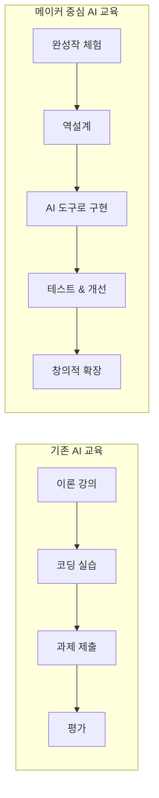

### 💡 왜 "가상환경 시뮬레이터"인가?

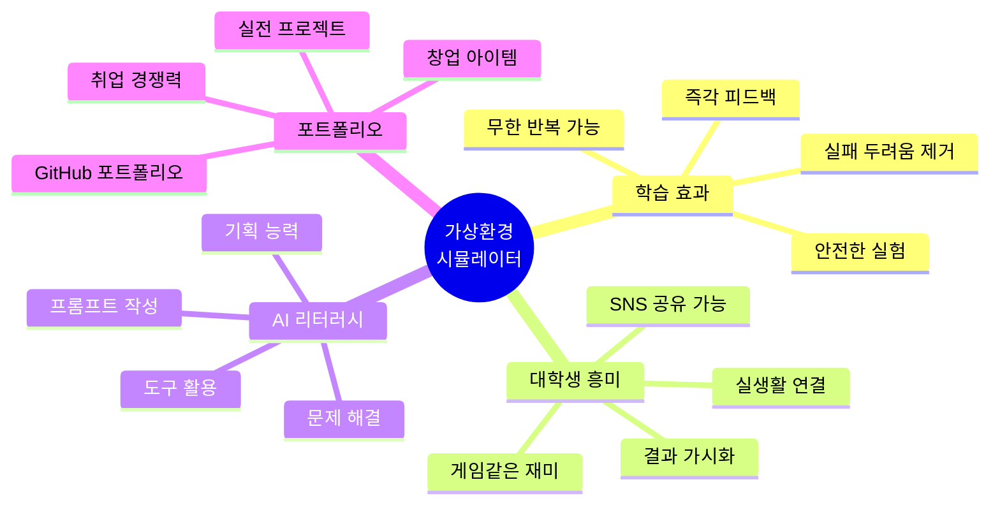

---

## 2가지 운영 모드

### 🎯 모드 선택 가이드

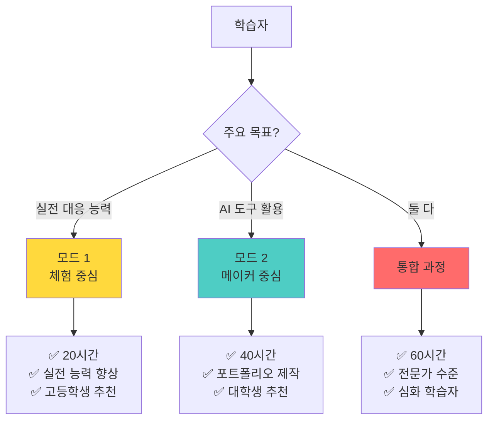

---

### 🎮 모드 1: 체험 중심 (20시간)

**"안전한 가상환경에서 실전 대응 능력 향상"**

#### 대상
- 고등학생 (실전 경험이 부족한 학생)
- 대학생 (빠르게 실전 능력을 키우고 싶은 학생)
- 코딩에 관심 없는 학생

#### 학습 흐름

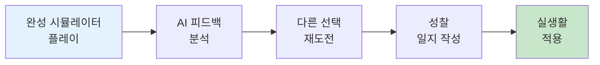

#### 커리큘럼 구조 (소주제당 2-3주)

```
━━━━━━━━━━━━━━━━━━━━━━
Week 1: 체험 & 분석
• Day 1-2: 시뮬레이터 플레이 (3시간)
  - 최소 3회 이상 플레이
  - 다양한 선택지 시도
• Day 3: AI 피드백 분석 (2시간)
  - 나의 패턴 발견
  - 강점과 약점 파악

Week 2: 재도전 & 성찰
• Day 1-2: 전략적 재도전 (3시간)
  - 개선된 선택
  - 더 나은 엔딩 도전
• Day 3: 성찰 및 적용 (2시간)
  - 실생활 연결
  - 실천 계획 수립

Week 3 (선택): 심화 & 공유
• 어려운 시나리오 도전
• 동료와 경험 공유
• 멘토링
━━━━━━━━━━━━━━━━━━━━━━
```

#### 학습 성과

| 영역 | 성과 |
|------|------|
| **실전 능력** | 주식 투자, 대인관계, 창업 등 실전 대응 |
| **자기 이해** | AI 피드백으로 나의 패턴 발견 |
| **의사결정** | 시뮬레이션을 통한 의사결정 연습 |
| **적용 능력** | 학습한 내용을 실생활에 즉시 적용 |

#### 평가

- ✅ 게임 플레이 완료 (각 시뮬레이터 3회 이상)
- ✅ AI 피드백 분석 리포트
- ✅ 성찰 일지 (주차별)
- ✅ 실생활 적용 사례 3가지

---

### 🛠️ 모드 2: 메이커 중심 (40시간)

**"AI 도구로 직접 만들며 AI 리터러시 획득"**

#### 대상
- 대학생 (AI 도구 학습 의지가 있는 학생)
- 포트폴리오가 필요한 학생
- 창의적 확장을 원하는 학생

#### 학습 흐름

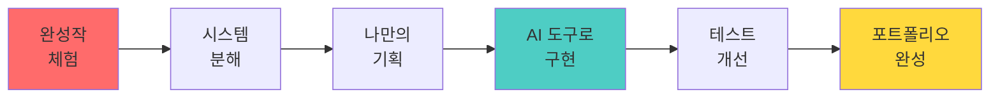

#### 커리큘럼 구조 (소주제당 6-8주)

```
━━━━━━━━━━━━━━━━━━━━━━
Week 1-2: 체험하기 (6시간)
• 완성작 플레이
• 호기심 발생
• "내가 만들고 싶다" 동기 부여

Week 3: 분해하기 (3시간)
• 시스템 구조 분석
• JSON 데이터 확인
• 원리 이해

Week 4: 기획하기 (3시간)
• 나만의 시나리오 설계
• ChatGPT로 데이터 생성
• 기획서 작성

Week 5-6: 만들기 (10시간) ⭐
• V0로 UI 생성
• Cursor로 기능 구현
• AI 연동
• 배포

Week 7: 테스트하기 (3시간)
• 친구 테스트
• 피드백 반영
• 개선

Week 8: 확장하기 (3시간)
• 창의적 기능 추가
• README 작성
• 발표 준비
━━━━━━━━━━━━━━━━━━━━━━
```

#### 학습 성과

| 영역 | 성과 |
|------|------|
| **실전 능력** | 모드 1과 동일 + 더 깊은 이해 |
| **AI 리터러시** | V0, Cursor, ChatGPT 활용 능력 |
| **기획 능력** | 시나리오 설계, JSON 구조 설계 |
| **실행 능력** | 아이디어를 실제 웹앱으로 구현 |
| **포트폴리오** | GitHub + 배포 URL |

#### 평가

- ✅ 게임 체험 및 성찰 (모드 1 항목)
- ✅ 작동하는 웹앱 (배포 URL 필수)
- ✅ GitHub 저장소 (코드 + README)
- ✅ 기획서 (시나리오 + JSON)
- ✅ 8주 개발 일지
- ✅ 3분 발표

---

### 🔄 통합 과정 (60시간)

**"체험 → 이해 → 제작 → 심화"의 완전한 학습**

두 모드를 순차적으로 진행:
1. **Phase 1 (20시간)**: 모드 1로 3개 주제 체험
2. **Phase 2 (40시간)**: 모드 2로 1개 주제 직접 제작
3. **추가 혜택**: 
   - 체험을 통한 깊은 이해
   - 더 완성도 높은 프로젝트
   - 전문가 수준의 역량

---

### 📊 모드별 비교표

| 항목 | 모드 1 (체험) | 모드 2 (메이커) | 통합 과정 |
|------|-------------|----------------|----------|
| **시간** | 20시간 | 40시간 | 60시간 |
| **주제 수** | 3개 | 1개 | 3개 체험 + 1개 제작 |
| **코딩** | 不要 | 不要 (AI 대신) | 不要 |
| **난이도** | ⭐⭐ | ⭐⭐⭐⭐ | ⭐⭐⭐⭐⭐ |
| **대상** | 고등학생, 대학생 | 대학생 | 심화 학습자 |
| **결과물** | 성찰 일지 | 웹앱 + 포트폴리오 | 둘 다 |
| **실전 능력** | ⭐⭐⭐⭐⭐ | ⭐⭐⭐⭐ | ⭐⭐⭐⭐⭐ |
| **AI 리터러시** | ⭐⭐ | ⭐⭐⭐⭐⭐ | ⭐⭐⭐⭐⭐ |
| **포트폴리오** | - | ⭐⭐⭐⭐⭐ | ⭐⭐⭐⭐⭐ |
| **취업 경쟁력** | ⭐⭐ | ⭐⭐⭐⭐⭐ | ⭐⭐⭐⭐⭐ |

---

### 💡 모드 선택 시나리오

**시나리오 1: 고3 수험생**
```
상황: 진로 고민, 스트레스 관리 필요
시간: 제한적 (주 5시간)
추천: 모드 1
이유: 빠르게 실전 능력 향상, 입시 스트레스 해소
```

**시나리오 2: 대학생 1학년**
```
상황: 진로 탐색 중, 다양한 경험 원함
시간: 충분 (방학 활용 가능)
추천: 통합 과정
이유: 체험으로 탐색 후 관심 분야 깊게 학습
```

**시나리오 3: 대학생 3-4학년**
```
상황: 취업 준비, 포트폴리오 필요
시간: 한 학기 (주 5시간)
추천: 모드 2
이유: 포트폴리오 제작, AI 도구 활용 능력 증명
```

**시나리오 4: 비전공자**
```
상황: 코딩 경험 無, AI 활용에 관심
시간: 방학 집중 (주 10시간)
추천: 모드 1 → 모드 2 순차
이유: 부담 없이 시작, 자신감 생긴 후 메이커 도전
```

---

## 메이커 교육 철학

### 🛠️ "만들면서 배운다" - Learning by Making

**전통적 교육의 문제점:**
- 이론만 배우고 실전 경험 없음
- 코딩 장벽으로 실행력 부족
- 결과물이 보이지 않아 동기 저하

**메이커 교육의 해법:**
- ✅ 완성작을 먼저 체험 → "이런 걸 만들 수 있구나!" (동기 부여)
- ✅ 역으로 분해하며 원리 이해 → "이렇게 작동하는구나!" (개념 학습)
- ✅ AI 도구로 직접 구현 → "나도 만들 수 있다!" (자신감)
- ✅ 자신만의 버전 창조 → "내 아이디어를 실현했다!" (성취감)

### 🔄 메이커 학습 사이클

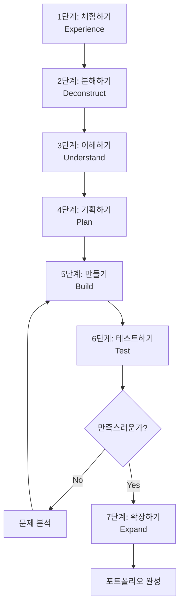

### 👨‍🏫 교수자의 역할 재정의

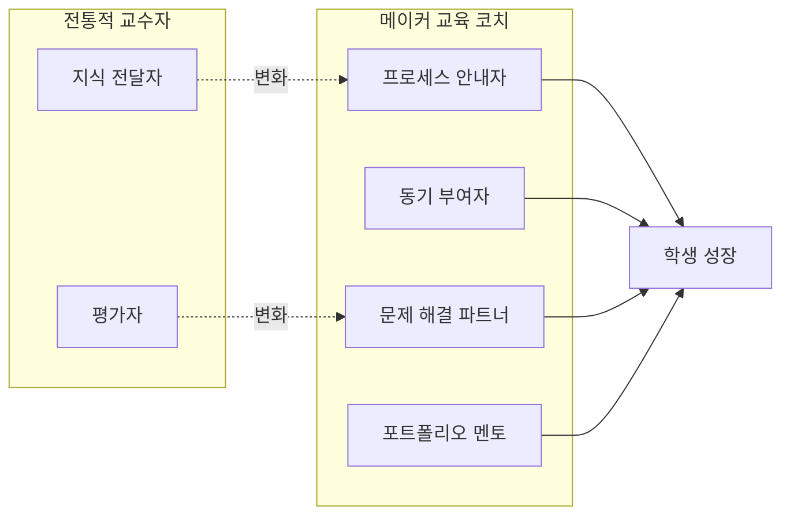

**교수자는 이렇게 행동합니다:**

1. **안내자**: "전체 개발 프로세스를 함께 걸어갈게요"
   - "우리는 이런 단계로 만들 거예요"
   - "지금은 여기 단계에 있어요"
   
2. **동기 부여자**: "이미 완성작이 있어요, 먼저 경험해봐요"
   - "와! 재미있죠? 우리도 만들 수 있어요"
   
3. **문제 해결 파트너**: "막힐 때 함께 해결해요"
   - "어떤 부분이 어려운가요?"
   - "AI 도구에게 이렇게 물어봐요"
   
4. **포트폴리오 멘토**: "당신의 강점을 살려요"
   - "이 부분이 당신만의 창의성이에요"
   - "이렇게 포트폴리오에 정리해봐요"

---

## 바이브코딩 학습 방식

### 🚀 V0 + Cursor = 누구나 개발자

**바이브코딩의 핵심:**
> "코딩을 몰라도 AI 도구를 활용하면 실제 작동하는 웹앱을 만들 수 있다"

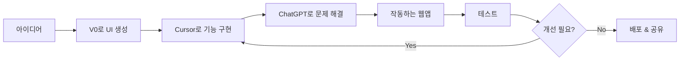

### 🎯 AI 리터러시 교육 목표

**우리가 양성하는 인재:**

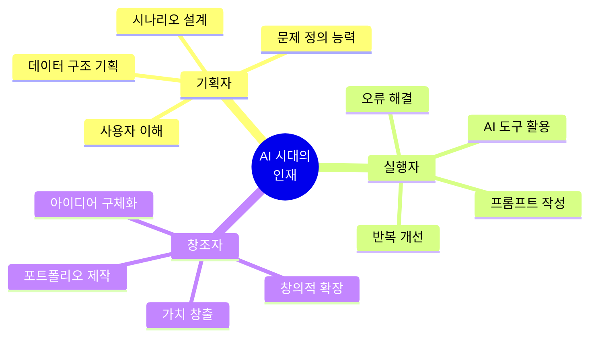

| 역량 | 기존 개발자 | AI 시대 기획-실행자 | 학습 방법 |
|------|------------|-------------------|---------|
| **문제 정의** | 요구사항 분석 | 사용자 니즈 파악 → 시뮬레이터 기획 | 페르소나, 시나리오 작성 |
| **설계 능력** | 아키텍처 설계 | JSON 데이터 구조 설계 | 가상환경 구축 실습 |
| **구현 능력** | 코딩 | AI 도구에게 지시 (프롬프트) | V0, Cursor 활용 |
| **문제 해결** | 디버깅 | AI와 대화하며 해결 | 실습 과정에서 경험 |
| **창의성** | 알고리즘 최적화 | 새로운 시나리오 창조 | 자신만의 버전 제작 |

### 🛠️ 주요 AI 도구 소개

**1. V0 (Vercel) - UI 생성 도구**
```
역할: 디자인 시안을 코드로 변환
사용법: "투자 시뮬레이터 대시보드를 만들어줘" → 즉시 React 코드 생성
학습 목표: UI/UX 기획 능력
```

**2. Cursor - AI 코드 에디터**
```
역할: 기능 구현 및 코드 수정
사용법: 코드에 주석으로 "여기에 AI 반응 생성 함수 추가" → AI가 코드 작성
학습 목표: 로직 설계 및 프롬프트 작성
```

**3. ChatGPT/Claude - 만능 도우미**
```
역할: 기획, 데이터 생성, 문제 해결
사용법: "주식 시뮬레이터의 JSON 시나리오를 만들어줘"
학습 목표: 구조화된 질문 능력
```

### 📚 학습 성과물

**8주 후 학생이 가질 것:**

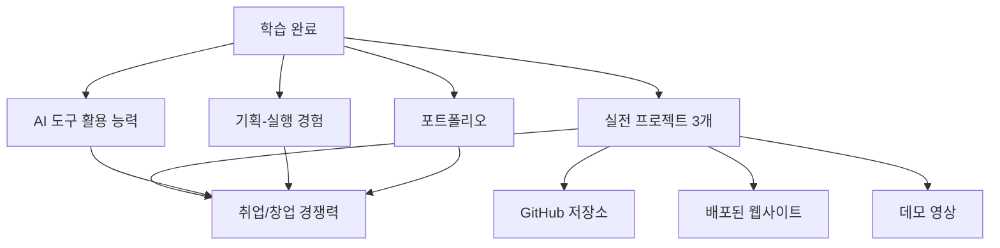

**구체적 성과:**
- ✅ 3개의 작동하는 웹 시뮬레이터 (배포된 URL 포함)
- ✅ GitHub 포트폴리오 (코드 + 문서)
- ✅ AI 도구 활용 능력 (V0, Cursor, LLM)
- ✅ 기획서 작성 능력 (시나리오, JSON 구조)
- ✅ 창의적 확장 능력 (자신만의 아이디어 실현)

---

## 3대 소주제

### 🎯 대학생이 진짜 관심 있는 주제로!

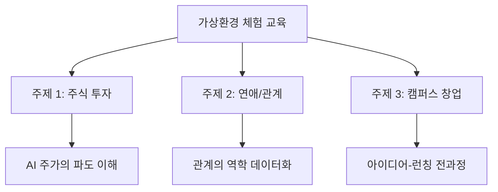

---

### 📈 소주제 1: 가상 주식 투자 시뮬레이터
#### "AI 주가의 파도를 타는 법"

**왜 이 주제인가?**
- 💰 대학생 90%가 관심 있는 주식/재테크
- 📊 데이터 분석, AI 예측의 직관적 이해
- 🎮 게임처럼 재미있고 중독성 있음
- 💼 취업 면접 소재 (경제 감각, 데이터 활용)

#### 학습 목표

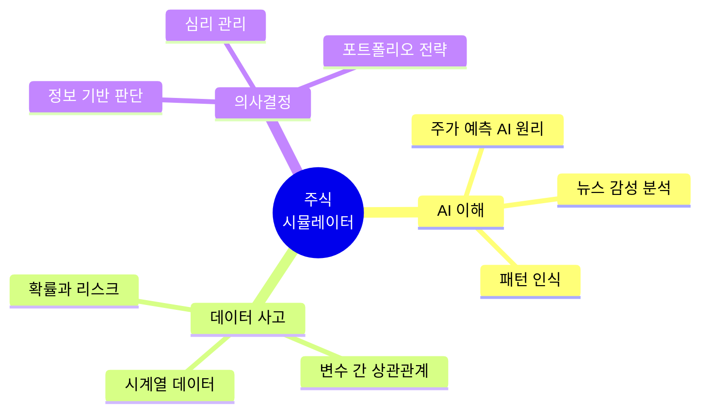

#### 핵심 기능

**1. AI 주가 생성 엔진**
```
- 뉴스 이벤트에 따른 주가 변동
- 시장 심리 시뮬레이션
- 랜덤성 + 패턴의 조화
```

**2. 투자 의사결정 시스템**
```
- 매수/매도/관망 선택
- AI 분석 리포트 제공
- 실시간 수익률 계산
```

**3. 학습 피드백**
```
- 투자 성향 분석 (공격적/보수적)
- 의사결정 패턴 시각화
- 개선 제안
```

#### 가상환경 구성

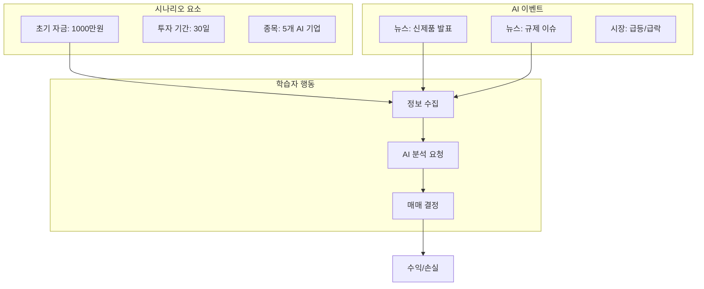

#### 개발 난이도 (초급)

**왜 첫 번째 프로젝트로 적합한가?**
- ✅ 간단한 데이터 구조 (JSON)
- ✅ 명확한 입출력 (매매 → 수익률)
- ✅ 시각화하기 좋음 (차트)
- ✅ 확장하기 쉬움 (종목 추가, 기능 추가)

---

### 💕 소주제 2: AI 연애 시뮬레이터
#### "관계의 역학을 데이터로 이해하기"

**왜 이 주제인가?**
- 💑 대학생의 최대 관심사
- 🧠 심리학, 커뮤니케이션 학습
- 🎭 롤플레잉 형태로 재미있음
- 🤖 AI의 자연어 처리 능력 체험

#### 학습 목표

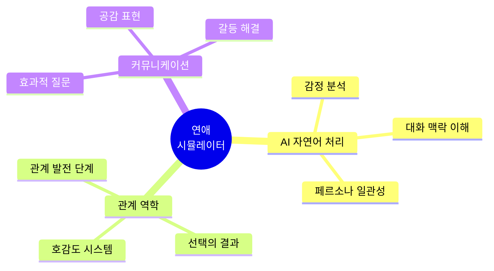

#### 핵심 기능

**1. AI 캐릭터 시스템**
```
- 3-5개의 독특한 성격 (외향적, 내향적, 예술가형 등)
- 호감도 지수 (0-100)
- 대화 히스토리 기억
- 일관된 성격 유지
```

**2. 대화 선택 시스템**
```
- 선택지 3-4개 제공
- 또는 자유 입력 (AI 반응)
- 선택에 따른 호감도 변화
- 관계 이벤트 발생
```

**3. 관계 분석 대시보드**
```
- 호감도 변화 그래프
- 대화 스타일 분석
- 성공/실패 요인 분석
- 다음 전략 제안
```

#### 가상환경 구성

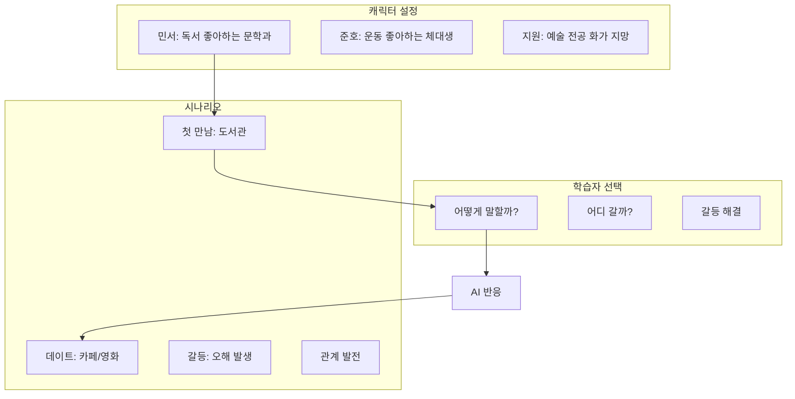

#### 개발 난이도 (중급)

**왜 두 번째 프로젝트인가?**
- ✅ 자연어 처리 도입 (LLM API)
- ✅ 복잡한 상태 관리 (호감도, 히스토리)
- ✅ 캐릭터 일관성 유지 (프롬프트 엔지니어링)
- ✅ 주식 시뮬레이터 경험 활용

---

### 🚀 소주제 3: 캠퍼스 창업 시뮬레이터
#### "아이디어부터 런칭까지 30일"

**왜 이 주제인가?**
- 💡 창업에 관심 있는 대학생 증가
- 🎯 실전 경험 없이 안전하게 시뮬레이션
- 📊 의사결정 능력 종합 훈련
- 🏆 실제 창업 아이템 발굴 가능

#### 학습 목표

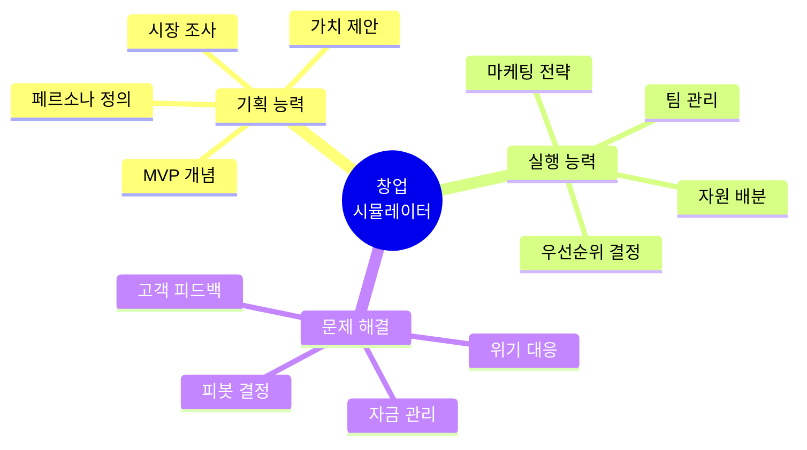

#### 핵심 기능

**1. 단계별 창업 프로세스**
```
Day 1-5: 아이디어 검증
Day 6-15: MVP 개발
Day 16-25: 베타 테스트
Day 26-30: 공식 런칭
```

**2. 자원 관리 시스템**
```
- 초기 자금: 500만원
- 시간: 주당 40시간
- 팀원: 3명 (개발, 디자인, 마케팅)
- 선택에 따른 자원 소모
```

**3. AI 이해관계자**
```
- 공동 창업자 (조언 제공)
- 잠재 고객 (피드백)
- 투자자 (투자 심사)
- 경쟁사 (시장 반응)
```

#### 가상환경 구성

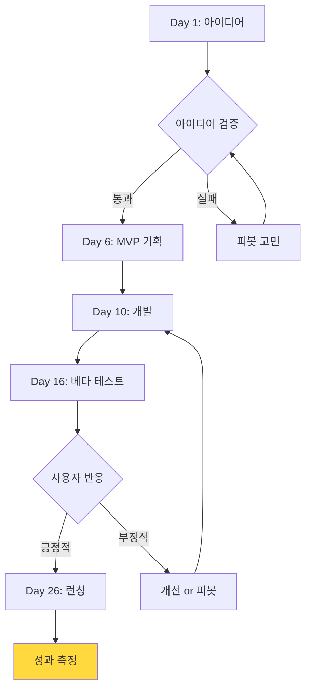

#### 개발 난이도 (고급)

**왜 마지막 프로젝트인가?**
- ✅ 복합적 시스템 (자원, 시간, 이벤트)
- ✅ 다양한 AI 캐릭터 동시 관리
- ✅ 분기 로직 복잡
- ✅ 이전 프로젝트 경험 총동원

---

## 전체 시스템 아키텍처

### 🏗️ 3계층 AI 시스템 구조

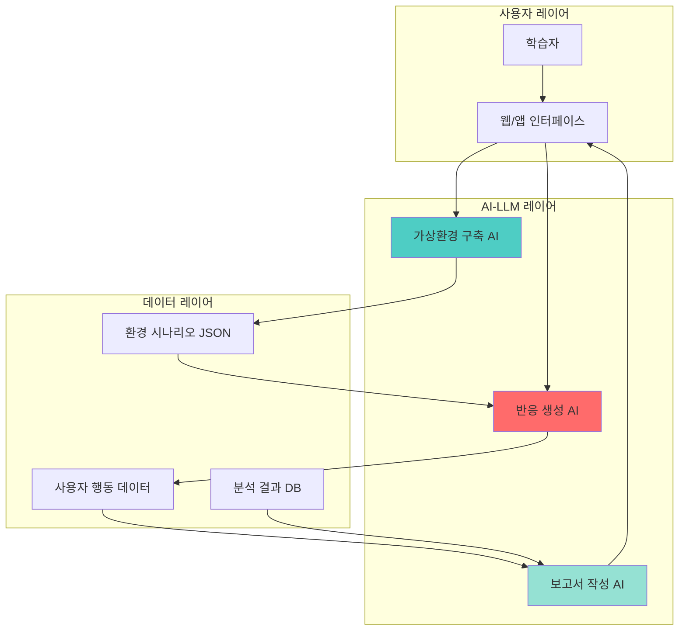

### 📦 시스템 구성 요소

| 구성 요소 | 역할 | 핵심 기술 |
|----------|------|----------|
| **가상환경 구축 AI** | 안정적인 시나리오 환경 생성 | 사전 정의 JSON + LLM 검증 |
| **반응 생성 AI** | 현실적이고 일관된 NPC/상황 반응 | GPT-4 + 컨텍스트 관리 |
| **보고서 작성 AI** | 행동 패턴 분석 및 인사이트 도출 | 데이터 분석 + 자연어 생성 |

---

## 3대 소주제 소개

### 🎭 소주제 1: 비즈니스 협상 시뮬레이터

**목표:** 다양한 협상 상황에서 최적의 의사결정 능력 배양

#### 핵심 개념

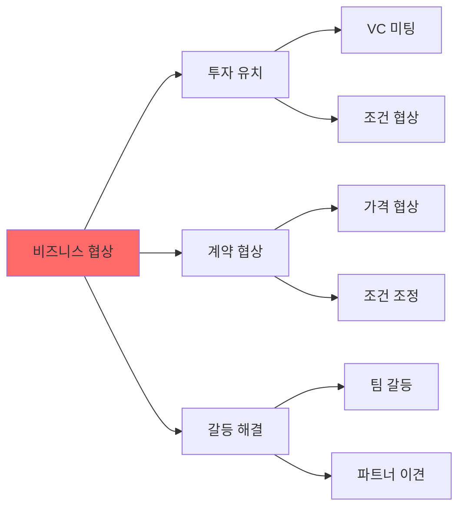

#### 학습 목표

- ✅ 협상 전략 수립 능력
- ✅ 상대방 심리 파악
- ✅ 윈-윈 솔루션 도출
- ✅ 위기 상황 대응력

#### 가상 환경 구성

```mermaid
graph TB
    subgraph "시나리오 타입"
        S1[스타트업 투자 유치]
        S2[공급사 가격 협상]
        S3[팀원 갈등 조율]
    end
    
    subgraph "난이도 설정"
        L1[초급: 우호적 상대]
        L2[중급: 까다로운 상대]
        L3[고급: 복합 변수]
    end
    
    subgraph "NPC 캐릭터"
        N1[보수적 투자자]
        N2[공격적 협상가]
        N3[감정적 파트너]
    end
    
    S1 --> L1
    S1 --> L2
    S1 --> L3
    
    L2 --> N1
    L2 --> N2
    L2 --> N3
    
    style S1 fill:#4ECDC4
```

---

### 🏥 소주제 2: 위기 상황 대응 트레이너

**목표:** 예측 불가능한 위기 상황에서의 판단력과 리더십 향상

#### 핵심 개념

```mermaid
graph LR
    A[위기 대응] --> B[비즈니스 위기]
    A --> C[조직 관리 위기]
    A --> D[고객 대응 위기]
    
    B --> E[자금 부족]
    B --> F[시장 변화]
    
    C --> G[핵심 인력 이탈]
    C --> H[팀 사기 저하]
    
    D --> I[불만 폭주]
    D --> J[평판 위기]
    
    style A fill:#FFD93D
```

#### 학습 목표

- ✅ 빠른 상황 판단 능력
- ✅ 우선순위 결정 능력
- ✅ 스트레스 관리
- ✅ 커뮤니케이션 능력

#### 가상 환경 구성

```mermaid
graph TB
    subgraph "위기 시나리오"
        C1[시스템 장애 발생]
        C2[주요 고객 이탈 위기]
        C3[자금 유동성 위기]
    end
    
    subgraph "시간 압박"
        T1[골든타임 30분]
        T2[24시간 대응]
        T3[1주일 계획]
    end
    
    subgraph "이해관계자"
        ST1[CEO]
        ST2[고객]
        ST3[팀원]
        ST4[투자자]
    end
    
    C1 --> T1
    C2 --> T2
    C3 --> T3
    
    T1 --> ST1
    T1 --> ST2
    T1 --> ST3
    
    style C1 fill:#FF6B6B
```

---

### 🌐 소주제 3: 글로벌 문화 적응 시뮬레이터

**목표:** 다문화 환경에서의 효과적인 소통과 협업 능력 개발

#### 핵심 개념

```mermaid
graph LR
    A[문화 적응] --> B[비즈니스 에티켓]
    A --> C[의사소통 스타일]
    A --> D[가치관 차이]
    
    B --> E[미국식 직설적]
    B --> F[아시아식 간접적]
    
    C --> G[고맥락 문화]
    C --> H[저맥락 문화]
    
    D --> I[시간 개념]
    D --> J[위계 구조]
    
    style A fill:#95E1D3
```

#### 학습 목표

- ✅ 문화적 감수성 향상
- ✅ 적응적 의사소통
- ✅ 오해 방지 및 해결
- ✅ 글로벌 네트워킹

#### 가상 환경 구성

```mermaid
graph TB
    subgraph "지역별 시나리오"
        R1[북미 - 실리콘밸리]
        R2[유럽 - 베를린]
        R3[아시아 - 서울/도쿄]
        R4[중동 - 두바이]
    end
    
    subgraph "상황 타입"
        ST1[첫 미팅]
        ST2[협업 프로젝트]
        ST3[갈등 상황]
    end
    
    subgraph "문화 요소"
        CE1[언어 장벽]
        CE2[비언어 소통]
        CE3[의사결정 방식]
    end
    
    R1 --> ST1
    R2 --> ST2
    R3 --> ST3
    
    ST1 --> CE1
    ST2 --> CE2
    ST3 --> CE3
    
    style R1 fill:#A29BFE
```

---

## 학습자 페르소나

### 👤 페르소나 1: 민지 (22세, 경영학과 3학년)

**프로필:**
- 전공: 경영학과, 주식 동아리 회장
- 특징: 재테크 관심 많지만 실전 경험 無
- 고민: "주식을 해봐야 하는데 돈 잃을까 봐 무섭다", "이론만 알고 실전이 없다"

```mermaid
mindmap
  root((민지))
    현재 상태
      경영 이론 공부 중
      주식 관심 多
      실전 투자 경험 無
    Pain Points
      실제 돈 투자 두려움
      감정 조절 어려움
      의사결정 자신감 부족
    학습 목표
      안전하게 투자 연습
      데이터 기반 판단
      감정 관리
    활용 소주제
      가상 주식 투자
      (첫 프로젝트)
```

**민지의 학습 여정 - 주식 시뮬레이터:**

```
Week 1: 체험하기 (Experience)
- 교수: "먼저 완성된 시뮬레이터를 체험해봐요"
- 민지: 30일 가상 투자 플레이
- 초기 자금 1000만원 → 최종 850만원 (실패)
- 민지: "와 재미있는데 어렵네요. 이걸 어떻게 만들었어요?"

Week 2: 분해하기 (Deconstruct)
- 교수: "함께 뜯어봅시다. 어떻게 작동할까요?"
- 민지: 화면 구성, 데이터 흐름 분석
- 발견: "아, JSON에 주가 데이터가 있고, AI가 뉴스를 생성하는구나!"
- 교수: "맞아요! 이제 우리가 만들어볼까요?"

Week 3-4: 기획하기 (Plan)
- 교수: "어떤 종목을 넣을까요? 시나리오는?"
- 민지: 기획서 작성
  * 종목 5개 선정 (실제 관심 기업)
  * 뉴스 이벤트 20개 작성
  * JSON 구조 설계
- 교수: "ChatGPT에게 물어보며 완성해봐요"

Week 5-6: 만들기 (Build)
- V0로 UI 생성: "투자 대시보드 화면 만들어줘"
- Cursor로 기능 구현: 주가 변동 로직
- ChatGPT로 데이터 생성: 뉴스 시나리오 JSON
- 막힐 때마다 교수가 코칭

Week 7: 테스트 & 개선 (Test)
- 친구들에게 테스트 요청
- 피드백: "차트가 보기 어려워요", "너무 쉬워요"
- 개선: 차트 라이브러리 변경, 난이도 조정

Week 8: 확장하기 (Expand)
- 민지의 창의적 아이디어 추가
  * "투자 스타일 테스트" 기능
  * "AI 투자 코치" 추천 시스템
- 포트폴리오 완성 & GitHub 업로드
- 배포: Vercel로 전 세계 공개!
```

---

### 👤 페르소나 2: 준호 (21세, 컴퓨터공학과 2학년)

**프로필:**
- 전공: 컴퓨터공학과, 코딩은 배웠지만 실전 프로젝트 없음
- 특징: 연애 경험 없음, 대화가 어색함
- 고민: "사람들과 대화가 어렵다", "연애를 해보고 싶은데 방법을 모르겠다"

```mermaid
mindmap
  root((준호))
    현재 상태
      코딩 능력 중급
      실전 프로젝트 無
      대인 관계 서툼
    Pain Points
      연애 경험 없음
      대화 어색함
      거절 두려움
    학습 목표
      자연어 AI 이해
      대화 패턴 분석
      자신감 향상
    활용 소주제
      AI 연애 시뮬레이터
      (두 번째 프로젝트)
```

**준호의 학습 여정 - 연애 시뮬레이터:**

```
Week 1-2: 체험 & 실패
- 준호: AI 캐릭터 '민서'와 대화 시도
- 어색한 선택 → 호감도 하락
- 준호: "내가 왜 틀렸는지 모르겠어요"
- AI 분석: "질문만 하고 자신의 이야기를 안 했어요"

Week 3-4: 분해 & 이해
- 교수: "AI는 어떻게 반응을 만들까요?"
- 준호: 프롬프트, 컨텍스트 이해
- 발견: "아! 대화 히스토리를 기억하는구나"

Week 5-7: 만들기
- 준호만의 캐릭터 3개 제작
- 각 캐릭터의 성격 JSON 설계
- GPT-4 API로 대화 구현
- 호감도 시스템 알고리즘

Week 8: 친구들과 테스트
- 친구: "이거 진짜 재미있다!"
- 준호: "내가 만들었어" (자신감 UP)
- 부가 효과: 실제 대화 능력도 향상
```

---

### 👤 페르소나 3: 수민 (24세, 디자인학과 4학년)

**프로필:**
- 전공: 시각디자인, 졸업 후 창업 희망
- 특징: 디자인은 잘하지만 비즈니스 전혀 모름
- 고민: "아이디어는 많은데 어떻게 시작해야 할지 막막하다"

```mermaid
mindmap
  root((수민))
    현재 상태
      디자인 역량 우수
      창업 관심 多
      비즈니스 지식 無
    Pain Points
      창업 프로세스 모름
      자금 관리 막연함
      의사결정 두려움
    학습 목표
      창업 전체 흐름 이해
      의사결정 연습
      MVP 개념 체득
    활용 소주제
      캠퍼스 창업 시뮬레이터
      (세 번째 프로젝트)
```

**수민의 학습 여정 - 창업 시뮬레이터:**

```
Week 1-2: 체험 (아이디어부터 실패까지)
- 수민: "디자인 스터디 앱" 아이디어로 시작
- Day 15: 개발 자금 소진으로 실패
- 수민: "아... 자금 배분을 잘못했구나"
- 교수: "실패가 학습이에요. 다시 해봐요!"

Week 3-4: 분해 & 재기획
- 어디서 잘못됐나 분석
- 자금 관리, 우선순위 결정 학습
- 새로운 시나리오 기획

Week 5-7: 복잡한 시스템 구현
- 이전 2개 프로젝트 경험 총동원
- 자원 관리 시스템
- 여러 AI 캐릭터 (공동 창업자, 고객, 투자자)
- 분기별 이벤트 시스템

Week 8: 실제 창업 준비
- 시뮬레이터에서 배운 것을 실전 적용
- 실제 사업 계획서 작성
- 학교 창업 경진대회 출전 준비
- 포트폴리오 3개 완성으로 자신감 MAX
```

---

## AI-LLM 3단계 시스템

### 🏗️ 1단계: 가상환경 구축 AI

**목적:** 안정적이고 일관성 있는 시뮬레이션 환경 생성

#### 시스템 구조

```mermaid
graph TB
    subgraph "입력 데이터"
        A1[시나리오 템플릿 JSON]
        A2[캐릭터 프로필 JSON]
        A3[규칙 및 제약조건]
    end
    
    subgraph "환경 구축 AI"
        B1[JSON 파서]
        B2[일관성 검증기]
        B3[초기 상태 생성기]
    end
    
    subgraph "출력 환경"
        C1[캐릭터 배치]
        C2[상황 설정]
        C3[목표 및 지표]
    end
    
    A1 --> B1
    A2 --> B1
    A3 --> B2
    
    B1 --> B2
    B2 --> B3
    
    B3 --> C1
    B3 --> C2
    B3 --> C3
    
    style B2 fill:#4ECDC4
```

#### JSON 시나리오 구조 예시

**비즈니스 협상 - 투자 유치 시나리오:**

```json
{
  "scenario_id": "investment_pitch_001",
  "scenario_name": "시리즈 A 투자 유치",
  "difficulty": "intermediate",
  "estimated_duration": "60-90분",
  
  "initial_context": {
    "company_valuation": 5000000000,
    "investment_target": 1000000000,
    "equity_offer": "15-20%",
    "runway": "6개월",
    "monthly_burn": 50000000
  },
  
  "npc_characters": [
    {
      "character_id": "investor_conservative_001",
      "name": "박성준",
      "role": "시니어 파트너, VC펀드",
      "personality": {
        "type": "보수적",
        "traits": ["데이터 중시", "리스크 회피", "꼼꼼함"],
        "decision_style": "느림",
        "trust_threshold": 0.7
      },
      "initial_stance": {
        "interest_level": 0.4,
        "concern_areas": ["시장 규모", "경쟁 우위", "수익 모델"],
        "positive_triggers": ["명확한 데이터", "차별화 전략", "경험 있는 팀"],
        "negative_triggers": ["모호한 답변", "과장된 주장", "준비 부족"]
      },
      "dialogue_patterns": {
        "opening": "자료를 먼저 보겠습니다. 시장 분석 부분이 궁금하네요.",
        "questioning_style": "구체적이고 날카로운 질문",
        "positive_feedback": "점진적으로 관심 표현",
        "negative_feedback": "회의적 표정과 추가 질문"
      }
    },
    {
      "character_id": "investor_aggressive_001",
      "name": "김서연",
      "role": "파트너, 성장형 펀드",
      "personality": {
        "type": "공격적",
        "traits": ["빠른 결정", "직관 중시", "도전적"],
        "decision_style": "빠름",
        "trust_threshold": 0.5
      },
      "initial_stance": {
        "interest_level": 0.6,
        "concern_areas": ["성장 속도", "스케일", "비전"],
        "positive_triggers": ["대담한 목표", "빠른 성장", "혁신성"],
        "negative_triggers": ["보수적 계획", "느린 진행", "방어적 태도"]
      }
    }
  ],
  
  "scenario_stages": [
    {
      "stage": 1,
      "name": "초기 피칭",
      "duration": "15-20분",
      "objectives": [
        "회사 소개 완료",
        "투자자 기본 관심 확보",
        "주요 질문 3개 이상 받기"
      ],
      "success_criteria": {
        "min_interest_level": 0.5,
        "required_topics_covered": ["문제 정의", "솔루션", "시장"]
      }
    },
    {
      "stage": 2,
      "name": "심화 질의응답",
      "duration": "20-30분",
      "objectives": [
        "우려사항 해소",
        "경쟁 우위 입증",
        "재무 계획 설명"
      ],
      "success_criteria": {
        "min_interest_level": 0.65,
        "concerns_addressed": 2
      }
    },
    {
      "stage": 3,
      "name": "조건 협상",
      "duration": "20-30분",
      "objectives": [
        "밸류에이션 합의",
        "지분율 협상",
        "이사회 구성 논의"
      ],
      "success_criteria": {
        "deal_reached": true,
        "acceptable_terms": true
      }
    }
  ],
  
  "branching_logic": {
    "good_preparation": {
      "condition": "자료 완비 + 명확한 답변",
      "outcome": "투자자 관심도 +20%, 빠른 진행"
    },
    "poor_communication": {
      "condition": "모호한 답변 3회 이상",
      "outcome": "투자자 관심도 -30%, 미팅 조기 종료 위험"
    },
    "emotional_reaction": {
      "condition": "방어적 태도 or 공격적 반응",
      "outcome": "신뢰도 -40%, 협상 결렬"
    }
  },
  
  "metrics_tracking": [
    "투자자 관심도",
    "신뢰 지수",
    "답변 품질",
    "협상 진행도",
    "시간 관리"
  ]
}
```

#### 환경 안정화 전략

```mermaid
graph LR
    A[JSON 기반 환경] --> B[일관성 보장]
    A --> C[예측 가능성]
    A --> D[재현 가능성]
    
    B --> E[버그 최소화]
    C --> E
    D --> E
    
    E --> F[학습자 신뢰]
    
    style A fill:#4ECDC4
    style F fill:#95E1D3
```

**핵심 장점:**
- ✅ 사전 정의된 시나리오로 안정성 확보
- ✅ 버전 관리 및 업데이트 용이
- ✅ 다양한 난이도 조절 가능
- ✅ A/B 테스트 및 개선 가능

---

### 🎭 2단계: 반응 생성 AI (핵심 시스템)

**목적:** 현실감 있고 일관된 NPC 및 상황 반응 실시간 생성

#### 시스템 구조

```mermaid
graph TB
    subgraph "입력"
        I1[사용자 발언/행동]
        I2[환경 JSON 컨텍스트]
        I3[캐릭터 상태]
        I4[대화 히스토리]
    end
    
    subgraph "반응 생성 AI 엔진"
        P1[컨텍스트 이해]
        P2[캐릭터 일관성 검증]
        P3[감정 상태 계산]
        P4[반응 생성 LLM]
        P5[현실성 검증]
    end
    
    subgraph "출력"
        O1[자연어 대화]
        O2[표정/제스처]
        O3[관계도 변화]
        O4[다음 액션]
    end
    
    I1 --> P1
    I2 --> P1
    I3 --> P2
    I4 --> P1
    
    P1 --> P2
    P2 --> P3
    P3 --> P4
    P4 --> P5
    
    P5 --> O1
    P5 --> O2
    P5 --> O3
    P5 --> O4
    
    O3 -.피드백.-> I3
    
    style P4 fill:#FF6B6B
    style P5 fill:#FFD93D
```

#### 현실감 있는 반응 생성 프로세스

```mermaid
sequenceDiagram
    participant User as 학습자
    participant UI as 인터페이스
    participant Context as 컨텍스트 관리자
    participant LLM as 반응 생성 AI
    participant Validator as 검증 레이어
    participant NPC as NPC 캐릭터
    
    User->>UI: "투자 금액은 10억입니다"
    UI->>Context: 발언 전달 + 현재 상황
    Context->>Context: 히스토리 로드
    Context->>LLM: 프롬프트 생성
    
    Note over LLM: 캐릭터 성격, 현재 관심도,<br/>이전 대화 맥락 분석
    
    LLM->>Validator: 반응 후보 3개 생성
    Validator->>Validator: 일관성 체크
    Validator->>Validator: 현실성 평가
    Validator->>NPC: 최적 반응 선택
    
    NPC->>UI: "10억이요? 지분은 몇 %를 제안하시나요?"
    NPC->>UI: (표정: 관심 있음, 몸 앞으로)
    UI->>User: 반응 표시 + 다음 선택지
    
    NPC->>Context: 관심도 +5% 업데이트
```

#### 현실성 확보 메커니즘

**1. 캐릭터 일관성 유지**

```mermaid
graph TB
    A[캐릭터 프로필] --> B[핵심 성격 traits]
    B --> C[대화 스타일]
    B --> D[의사결정 패턴]
    B --> E[감정 반응 범위]
    
    C --> F[모든 대화에 적용]
    D --> F
    E --> F
    
    F --> G[일관된 캐릭터]
    
    style A fill:#4ECDC4
    style G fill:#95E1D3
```

**예시: 보수적 투자자 캐릭터**

```
✅ 일관된 반응:
- 데이터 요청: "구체적인 숫자를 보여주시겠습니까?"
- 위험 회피: "만약 시장이 침체되면 어떻게 대응하실 건가요?"
- 신중한 결정: "좀 더 검토가 필요할 것 같습니다"

❌ 비일관적 반응 (시스템이 방지):
- 갑자기 공격적: "당장 투자하겠습니다!"
- 성격 변화: "데이터는 중요하지 않아요"
```

**2. 감정 상태 시뮬레이션**

```mermaid
graph LR
    A[초기 관심도<br/>40%] --> B{사용자 행동}
    
    B -->|좋은 답변| C[관심도 +10%]
    B -->|모호한 답변| D[관심도 -5%]
    B -->|준비 부족| E[관심도 -15%]
    
    C --> F[관심도 50%]
    D --> G[관심도 35%]
    E --> H[관심도 25%]
    
    F --> I[긍정적 태도]
    G --> J[중립적 태도]
    H --> K[회의적 태도]
    
    style I fill:#95E1D3
    style J fill:#FFD93D
    style K fill:#FF6B6B
```

**3. 다층적 반응 생성**

| 레이어 | 설명 | 예시 |
|--------|------|------|
| **언어적 반응** | 실제 대화 내용 | "흥미롭군요. 시장 규모는 얼마나 되나요?" |
| **비언어적 반응** | 표정, 제스처, 목소리 톤 | 표정: 약간 관심, 몸: 앞으로 기울임 |
| **내부 상태 변화** | 보이지 않는 지표 업데이트 | 관심도 45→50%, 신뢰도 30→35% |
| **행동 변화** | 다음 액션에 영향 | 추가 질문 준비, 미팅 연장 제안 |

#### 프롬프트 엔지니어링 전략

**시스템 프롬프트 구조:**

```
당신은 {캐릭터 이름}, {역할}입니다.

### 성격 및 특성:
- 핵심 성격: {personality_type}
- 주요 traits: {traits}
- 의사결정 스타일: {decision_style}
- 현재 감정 상태: {current_emotion}

### 현재 상황:
- 미팅 진행도: {stage}
- 관심도 지수: {interest_level}/100
- 신뢰도 지수: {trust_level}/100
- 주요 우려사항: {concerns}

### 대화 히스토리:
{conversation_history}

### 방금 학습자의 발언:
"{user_input}"

### 응답 지침:
1. 당신의 성격에 맞게 일관되게 반응하세요
2. 현재 관심도와 신뢰도를 고려하세요
3. 현실적인 투자자처럼 행동하세요
4. 구체적이고 날카로운 질문을 하세요
5. 50단어 이내로 간결하게 답하세요

이제 {캐릭터 이름}으로서 자연스럽게 반응하세요.
```

**동적 프롬프트 조정:**

```mermaid
graph TB
    A[기본 프롬프트] --> B{상황 분석}
    
    B -->|긴장 고조| C[압박 톤 강화]
    B -->|좋은 흐름| D[우호적 톤 추가]
    B -->|반복 실패| E[힌트 제공 모드]
    
    C --> F[최종 프롬프트]
    D --> F
    E --> F
    
    style F fill:#FF6B6B
```

---

### 📊 3단계: 최종 보고서 AI

**목적:** 학습자의 행동 패턴 분석 및 개선 방향 제시

#### 시스템 구조

```mermaid
graph TB
    subgraph "데이터 수집"
        D1[대화 로그]
        D2[의사결정 기록]
        D3[시간 데이터]
        D4[감정 변화 추적]
    end
    
    subgraph "분석 엔진"
        A1[패턴 인식 AI]
        A2[강점/약점 분석]
        A3[비교 분석]
        A4[인사이트 도출]
    end
    
    subgraph "보고서 생성"
        R1[요약 대시보드]
        R2[상세 분석]
        R3[개선 제안]
        R4[다음 단계]
    end
    
    D1 --> A1
    D2 --> A1
    D3 --> A1
    D4 --> A1
    
    A1 --> A2
    A2 --> A3
    A3 --> A4
    
    A4 --> R1
    A4 --> R2
    A4 --> R3
    A4 --> R4
    
    style A4 fill:#95E1D3
```

#### 보고서 구성 요소

**1. 퍼포먼스 대시보드**

```mermaid
graph LR
    subgraph "핵심 지표"
        M1[목표 달성도<br/>75%]
        M2[평균 시도 횟수<br/>4.2회]
        M3[의사결정 속도<br/>중상]
        M4[NPC 만족도<br/>68점]
    end
    
    subgraph "평가"
        E1[전체: B+]
    end
    
    M1 --> E1
    M2 --> E1
    M3 --> E1
    M4 --> E1
    
    style E1 fill:#95E1D3
```

**2. 행동 패턴 분석**

```mermaid
graph TB
    A[학습자 행동] --> B[데이터 수집]
    
    B --> C1[협상 스타일]
    B --> C2[의사결정 패턴]
    B --> C3[스트레스 반응]
    B --> C4[학습 곡선]
    
    C1 --> D1[협력적 70%<br/>경쟁적 30%]
    C2 --> D2[분석형<br/>평균 3.5분/결정]
    C3 --> D3[중압감에 방어적]
    C4 --> D4[빠른 적응력]
    
    style D1 fill:#FFD93D
    style D2 fill:#FFD93D
    style D3 fill:#FF6B6B
    style D4 fill:#95E1D3
```

**3. 강점 및 개선 영역**

| 영역 | 강점 | 개선 필요 | 구체적 제안 |
|------|------|----------|------------|
| **커뮤니케이션** | 명확한 의사 전달<br/>경청 능력 우수 | 압박 상황에서 말이 빨라짐 | 긴장 시 3초 호흡 후 답변 |
| **협상 전략** | 데이터 기반 설득<br/>논리적 접근 | 감정적 대응 부족 | 공감 표현 연습 필요 |
| **의사결정** | 신중한 판단 | 결정 속도 느림 | 80% 확신에서 결정 훈련 |
| **위기 대응** | 체계적 접근 | 초기 반응 지연 | 위기 체크리스트 사전 준비 |

**4. 타임라인 분석**

```mermaid
gantt
    title 학습자 시도별 성과 변화
    dateFormat  X
    axisFormat %s
    
    section 1차 시도
    실패(관심도 30%) :done, 0, 1
    
    section 2차 시도
    실패(관심도 45%) :done, 1, 2
    
    section 3차 시도
    부분 성공(관심도 60%) :active, 2, 3
    
    section 4차 시도
    성공(관심도 75%) :crit, 3, 4
```

**5. AI 생성 인사이트**

```
🎯 핵심 발견:

1. 당신의 협상 스타일: "분석형 협력자"
   - 데이터와 논리를 중시하며, 상대방과 윈-윈을 추구합니다.
   - 이는 장기적 관계 구축에 유리하지만, 빠른 결단이 필요한 상황에서는
     기회를 놓칠 수 있습니다.

2. 성장 패턴:
   - 1-2차 시도: 준비 부족으로 투자자 우려사항 파악 실패
   - 3차 시도: 경쟁사 분석 추가 후 관심도 급상승 (45%→60%)
   - 4차 시도: 감정적 공감 추가로 신뢰 확보 성공
   
   → 학습 속도가 빠르며, 피드백을 잘 흡수합니다.

3. 실전 활용 팁:
   ✅ 미팅 전 상대방의 관심사 3가지 사전 조사
   ✅ 데이터 + 스토리 결합 (현재는 데이터 80%, 스토리 20%)
   ✅ 첫 5분에 핵심 메시지 전달 (현재 15분 소요)

4. 다음 추천 시나리오:
   📌 "어려운 투자자와의 협상" (난이도 상)
   📌 "복수 투자자 동시 관리" (복잡도 상)
```

**6. 비교 분석 (선택적)**

```mermaid
graph LR
    subgraph "당신의 성과"
        Y1[평균 시도: 4.2회]
        Y2[성공률: 75%]
        Y3[시간: 72분]
    end
    
    subgraph "상위 10% 학습자"
        T1[평균 시도: 3.1회]
        T2[성공률: 90%]
        T3[시간: 58분]
    end
    
    subgraph "평균 학습자"
        A1[평균 시도: 5.8회]
        A2[성공률: 65%]
        A3[시간: 95분]
    end
    
    Y1 -.-> T1
    Y1 -.-> A1
    
    style Y1 fill:#FFD93D
    style T1 fill:#95E1D3
    style A1 fill:#FF6B6B
```

#### 보고서 생성 프로세스

```mermaid
sequenceDiagram
    participant User as 학습자
    participant Sim as 시뮬레이션
    participant Logger as 데이터 로거
    participant Analyzer as 분석 AI
    participant Report as 보고서 생성기
    
    User->>Sim: 시뮬레이션 시작
    loop 시뮬레이션 진행
        Sim->>Logger: 모든 행동 기록
        Logger->>Logger: 타임스탬프, 컨텍스트 저장
    end
    
    User->>Sim: 시나리오 완료
    Sim->>Analyzer: 데이터 전달
    
    Analyzer->>Analyzer: 패턴 분석
    Analyzer->>Analyzer: 강점/약점 도출
    Analyzer->>Analyzer: 인사이트 생성
    
    Analyzer->>Report: 분석 결과 전달
    Report->>Report: 시각화 생성
    Report->>Report: 자연어 보고서 작성
    
    Report->>User: 최종 보고서 제공
    
    Note over User,Report: 평균 생성 시간: 30-60초
```

---

## 모드 1: 체험 중심 커리큘럼

### 📅 2-3주 체험 프로그램 (주제당)

**"플레이 → 분석 → 재도전 → 성찰 → 적용"**

#### 전체 구조

```mermaid
graph TB
    Start[체험 시작] --> W1[Week 1<br/>플레이 & 분석]
    W1 --> W2[Week 2<br/>재도전 & 성찰]
    W2 --> W3[Week 3<br/>심화 & 공유]
    W3 --> Next[다음 주제]
    
    style W1 fill:#FFD93D
    style W2 fill:#4ECDC4
    style W3 fill:#95E1D3
```

---

### 📅 Week 1: 플레이 & 분석 (5시간)

#### **Day 1-2: 시뮬레이터 플레이 (3시간)**

```
━━━━━━━━━━━━━━━━━━━━━━
🎮 플레이 가이드

00:00-00:30 | 오리엔테이션
• 시뮬레이터 소개
• 학습 목표 공유
• 조작 방법 설명

00:30-02:00 | 자유 플레이 (1차)
• 제한 없이 선택
• 본능대로 반응
• 첫 엔딩 도달

02:00-02:30 | 짧은 휴식 & 토의
• 느낀 점 나누기
• 의외였던 순간 공유

02:30-03:00 | 전략적 플레이 (2차)
• 다른 선택 시도
• 다른 엔딩 도전
• 패턴 발견
━━━━━━━━━━━━━━━━━━━━━━
```

**학습자 활동:**
- ✅ 최소 2회 플레이 (다른 선택)
- ✅ 각 플레이 후 간단한 메모
- ✅ 어려웠던 순간 기록

**교수자 역할:**
- 순회하며 관찰
- 막히는 학생 지원
- 과몰입 방지

---

#### **Day 3: AI 피드백 분석 (2시간)**

```
━━━━━━━━━━━━━━━━━━━━━━
📊 피드백 분석 워크숍

00:00-00:30 | AI 리포트 확인
• 개인별 리포트 배부
• 주요 지표 설명
  - 의사결정 패턴
  - 강점/약점
  - 개선 포인트

00:30-01:00 | 페어 토의
• 2인 1조 피드백 공유
• 서로 발견한 점 나누기
• 질문 리스트 작성

01:00-01:30 | 전체 토의
• 공통 패턴 찾기
• 교수자 해설
• Q&A

01:30-02:00 | 성찰 일지 작성
• 나의 패턴 정리
• 왜 그런 선택을 했는지
• 현실과의 연결점
━━━━━━━━━━━━━━━━━━━━━━
```

---

### 📅 Week 2: 재도전 & 성찰 (5시간)

#### **Day 1-2: 전략적 재도전 (3시간)**

```
━━━━━━━━━━━━━━━━━━━━━━
🎯 개선된 플레이

00:00-00:20 | 전략 수립
• Week 1 피드백 복습
• 개선 목표 설정
• 선택 전략 계획

00:20-01:30 | 플레이 (3차)
• 의식적 선택
• 개선된 대응
• 더 나은 엔딩 도전

01:30-02:00 | 비교 분석
• 1-2차 vs 3차 비교
• 변화 확인
• 성장 포인트 발견

02:00-03:00 | 심화 플레이 (선택)
• 어려운 시나리오
• 극단적 선택 시도
• 시스템 한계 탐색
━━━━━━━━━━━━━━━━━━━━━━
```

---

#### **Day 3: 성찰 & 실생활 적용 (2시간)**

```
━━━━━━━━━━━━━━━━━━━━━━
📝 성찰 워크숍

00:00-00:40 | 종합 성찰 작성
• 3주간의 변화 정리
• 가장 큰 깨달음
• 현실 속 나와 비교

질문 가이드:
1. 어떤 상황에서 어려웠나요?
2. 왜 그런 선택을 했나요?
3. 현실에서도 비슷한가요?
4. 어떻게 바꾸고 싶나요?

00:40-01:20 | 실천 계획 수립
• 구체적 행동 계획 3가지
• 언제, 어떻게, 무엇을
• 측정 가능한 목표

예시:
"이번 주 친구와 갈등 시
 먼저 상대 감정을 물어본다"

01:20-02:00 | 조별 발표
• 조별로 배운 점 공유
• 서로 격려
• 실천 다짐
━━━━━━━━━━━━━━━━━━━━━━
```

---

### 📅 Week 3: 심화 & 공유 (선택, 3시간)

```
━━━━━━━━━━━━━━━━━━━━━━
🏆 심화 활동

Option 1: 어려운 시나리오 도전
• 고난이도 버전 플레이
• 복합 변수 상황 대응

Option 2: 멘토링 활동
• 새로운 학습자 도움
• 경험 공유
• 조언 제공

Option 3: 크리에이티브 활동
• 자신만의 시나리오 기획
• 다른 엔딩 상상하기
• (메이커 모드 준비)
━━━━━━━━━━━━━━━━━━━━━━
```

---

### 📊 모드 1 평가 기준

**총 100점**

| 평가 항목 | 배점 | 세부 기준 |
|---------|------|----------|
| **플레이 완료** | 30점 | • 최소 3회 플레이 (10점)<br/>• 다양한 선택 시도 (10점)<br/>• 엔딩 달성 (10점) |
| **AI 피드백 분석** | 20점 | • 리포트 이해도 (10점)<br/>• 패턴 발견 (10점) |
| **성찰 일지** | 30점 | • 자기 이해 깊이 (15점)<br/>• 현실 연결 (15점) |
| **실천 계획** | 20점 | • 구체성 (10점)<br/>• 실행 가능성 (10점) |

---

### 🎯 모드 1 학습 성과

**3주 후 학생이 얻는 것:**

```mermaid
mindmap
  root((학습 성과))
    실전 능력
      안전한 시행착오
      즉각적 피드백
      반복 연습
    자기 이해
      패턴 발견
      강점 파악
      약점 인식
    의사결정
      다양한 선택 경험
      결과 예측 능력
      전략적 사고
    적용 능력
      실생활 연결
      즉시 실천
      지속적 개선
```

**정량적 성과:**
- ✅ 시뮬레이터 플레이: 최소 3회
- ✅ 성찰 일지: 3편
- ✅ 실천 계획: 3가지 이상

**정성적 성과:**
- "나의 패턴을 알게 되었어요"
- "실생활에서 바로 적용했어요"
- "자신감이 생겼어요"

---

## 모드 2: 메이커 프로세스 로드맵

### 🗺️ 8주 메이커 여정 (프로젝트당)

**핵심 원칙: 완성작 체험 → 역설계 → 직접 구현 → 창의적 확장**

```mermaid
graph TB
    Start[Week 0: 오리엔테이션] --> W1[Week 1-2: 체험하기]
    W1 --> W2[Week 3: 분해하기]
    W2 --> W3[Week 4: 기획하기]
    W3 --> W4[Week 5-6: 만들기]
    W4 --> W5[Week 7: 테스트하기]
    W5 --> W6[Week 8: 확장하기]
    W6 --> Final[포트폴리오 완성]
    
    style W1 fill:#FF6B6B
    style W4 fill:#4ECDC4
    style W6 fill:#FFD93D
    style Final fill:#95E1D3
```

---

### 📅 Week 0: 오리엔테이션 (3시간)

**교수자의 역할:**
- 전체 프로세스 소개
- 완성된 3개 프로젝트 데모
- AI 도구 소개 (V0, Cursor, ChatGPT)
- 성공 사례 공유

**학습자 활동:**
- 프로젝트 선택 (주식/연애/창업)
- 팀 구성 (선택: 개인 또는 2-3인)
- 개발 환경 세팅

```mermaid
graph LR
    A[교수 시연] --> B[도구 체험]
    B --> C[프로젝트 선택]
    C --> D[환경 세팅]
    
    style A fill:#4ECDC4
```

---

### 📅 Week 1-2: 체험하기 - "먼저 놀아보자!" (6시간)

**목표: 완성작을 충분히 경험하고 흥미 유발**

#### 교수자 가이드

```
🎯 이번 주 목표
- 학생들이 완성된 시뮬레이터를 실제로 플레이
- "이걸 내가 만들 수 있다"는 믿음 심기
- 호기심 자극: "어떻게 작동하지?"

📋 진행 방식
1. 교수 시연 (30분)
   - "이걸 한 번 봐요. 저도 AI 도구로 만들었어요"
   - 핵심 기능 데모
   
2. 학생 자유 플레이 (2시간)
   - 제한 없이 여러 번 시도
   - 실패 장려: "많이 실패해봐요!"
   - 관찰 유도: "특별한 점을 발견했나요?"
   
3. 경험 공유 (1시간)
   - "어떤 점이 재미있었나요?"
   - "어려웠던 점은?"
   - "어떻게 작동하는 것 같나요?"
   
4. 호기심 증폭 (30분)
   - 핵심 비밀 힌트: "AI가 반응을 만들어요"
   - "다음 시간에 뜯어볼게요!"

🎤 교수자 멘트 예시
- "완벽하게 이해 안 해도 돼요. 일단 재미있게 놀아봐요"
- "실패가 성공의 어머니! 많이 실패해보세요"
- "이걸 만든 건 작년 학생이에요. 여러분도 할 수 있어요"
```

**학습자 활동:**

```mermaid
graph TB
    A[완성작 플레이] --> B{재미있나?}
    B -->|Yes| C[반복 플레이]
    B -->|No| D[다른 시나리오 시도]
    
    C --> E[패턴 발견]
    D --> E
    
    E --> F["어떻게 작동하지?" 호기심]
    
    style F fill:#FFD93D
```

**산출물:**
- 개인 경험 노트 (간단하게)
- 발견한 패턴 3가지
- "만약 내가 만든다면?" 아이디어 메모

---

### 📅 Week 3: 분해하기 - "뜯어보자!" (3시간)

**목표: 시스템을 이해 가능한 단위로 분해**

#### 교수자 가이드

```
🎯 이번 주 목표
- 복잡해 보이는 시스템을 단순한 요소로 분해
- "아! 이렇게 단순하구나" 깨달음
- 각 부분의 역할 이해

📋 진행 방식
1. 함께 분해하기 (1.5시간)
   교수: "이 화면은 어떤 부분으로 나눌 수 있을까요?"
   학생: "입력창, 결과창, 차트..."
   
   교수: "맞아요! 이제 데이터는 어디 있을까요?"
   [실제 JSON 파일 열어서 보여주기]
   
2. 데이터 흐름 추적 (1시간)
   - 사용자 입력 → 어떻게 처리?
   - AI는 어디서 반응?
   - 결과는 어떻게 표시?
   
3. 핵심 발견 (30분)
   - "생각보다 단순해요!"
   - "3개 부분으로 나눌 수 있어요"

🎤 교수자 멘트 예시
- "복잡해 보이지만 사실 간단해요"
- "이 JSON이 전체 시나리오예요. 텍스트 파일이죠?"
- "AI는 그냥 API 호출이에요. 여기 코드 3줄이 전부!"
```

**함께 분석하는 구조:**

```mermaid
graph TB
    System[시뮬레이터] --> UI[1. 화면 UI]
    System --> Data[2. 데이터 JSON]
    System --> Logic[3. 처리 로직]
    System --> AI[4. AI 연동]
    
    UI --> UI1[입력 폼]
    UI --> UI2[결과 표시]
    UI --> UI3[차트/그래프]
    
    Data --> D1[시나리오]
    Data --> D2[캐릭터]
    Data --> D3[이벤트]
    
    Logic --> L1[상태 관리]
    Logic --> L2[계산]
    Logic --> L3[분기 처리]
    
    AI --> A1[프롬프트]
    AI --> A2[API 호출]
    AI --> A3[응답 파싱]
    
    style System fill:#FF6B6B
```

**학습자 활동:**
- 시스템 구조도 그리기
- 각 부분의 역할 정리
- "내가 만들 수 있을 것 같다!" 자신감

---

### 📅 Week 4: 기획하기 - "내 버전 설계" (3시간)

**목표: 자신만의 시나리오와 데이터 설계**

#### 교수자 가이드

```
🎯 이번 주 목표
- 학생이 주체가 되어 기획
- 구체적인 설계 문서 작성
- AI 도구 활용하여 데이터 생성

📋 진행 방식
1. 브레인스토밍 (1시간)
   교수: "어떤 주제로 만들고 싶나요?"
   학생: "가상화폐 투자!", "아이돌과 연애!", "게임 회사 창업!"
   교수: "좋아요! 그럼 어떤 이벤트가 필요할까요?"
   
2. ChatGPT와 함께 기획 (1.5시간)
   교수: "ChatGPT에게 이렇게 물어봐요"
   → "가상화폐 투자 시뮬레이터에 필요한 이벤트 20개 만들어줘"
   → "각 이벤트의 영향도를 JSON으로 만들어줘"
   
3. 검토 및 수정 (30분)
   - 교수가 기획서 리뷰
   - 실현 가능성 체크
   - 우선순위 조정

🎤 교수자 멘트 예시
- "완벽하지 않아도 돼요. 만들면서 수정해요"
- "AI에게 물어보세요. AI가 도와줄 거예요"
- "여러분의 창의성이 들어가는 부분이에요!"
```

**학습자 산출물:**

```markdown
### 기획서 템플릿 (주식 시뮬레이터 예시)

#### 1. 프로젝트 개요
- 제목: 가상화폐 투자 시뮬레이터
- 목표: 변동성 큰 코인 시장 체험

#### 2. 시나리오 설계
- 초기 자금: 500만원
- 기간: 14일
- 코인 종목: 비트코인, 이더리움, 리플, 도지코인

#### 3. 이벤트 리스트 (ChatGPT 생성)
- Day 1: 테슬라 비트코인 결제 발표 (+15%)
- Day 3: 중국 규제 소식 (-25%)
- ...

#### 4. 데이터 구조 (JSON)
[ChatGPT가 생성한 JSON을 붙여넣기]

#### 5. UI 와이어프레임 (간단히)
[손그림 스캔 또는 피그마]
```

---

### 📅 Week 5-6: 만들기 - "AI 도구로 구현" (6시간)

**목표: V0 + Cursor로 실제 작동하는 웹앱 구현**

#### 교수자 가이드 (Week 5-6는 가장 중요!)

```
🎯 이번 주 목표
- 실제 작동하는 웹앱 완성
- AI 도구 활용 능력 극대화
- 문제 해결 경험

📋 진행 방식 (Week 5)

1단계: UI 생성 (V0) - 1시간
---
교수: "V0에 접속해서 프롬프트를 입력해봐요"

학생: "투자 시뮬레이터 대시보드를 만들어줘.
       - 상단에 현재 자금과 수익률 표시
       - 중앙에 코인 목록과 가격
       - 하단에 매수/매도 버튼"

[V0가 즉시 React 코드 생성]

교수: "와! 바로 나왔죠? 이제 수정해봐요"
학생: "차트 색을 파란색으로 바꿔줘"
[즉시 반영]

💡 교수자 팁
- 학생이 막히면 예시 프롬프트 제공
- "더 구체적으로 설명해봐요"
- "이미지를 보여주면 더 정확해요"

2단계: Cursor로 프로젝트 시작 - 30분
---
교수: "V0에서 생성한 코드를 Cursor에 복사해요"
[함께 따라하기]

- GitHub 저장소 만들기
- Cursor에서 프로젝트 열기
- 기본 구조 세팅

3단계: JSON 데이터 연결 - 1시간
---
교수: "ChatGPT가 만든 JSON을 /data 폴더에 넣어요"

[예시 코드 함께 작성]
// Cursor AI에게 주석으로 지시
// 이 JSON 파일을 읽어서 코인 목록을 표시해줘

[Cursor가 자동으로 코드 생성]

교수: "Ctrl+K (또는 Cmd+K)를 눌러서 AI에게 물어봐요"

💡 교수자 팁
- 에러 나면 함께 읽고 해석
- "에러 메시지를 AI에게 물어봐요"
- "천천히, 하나씩!"

4단계: AI 반응 기능 추가 - 2시간
---
교수: "이제 가장 중요한 부분이에요. AI 반응!"

[함께 코드 작성]
// Cursor AI에게:
// OpenAI API를 호출해서 뉴스 이벤트를 생성하는 함수를 만들어줘
// 입력: 날짜, 코인 이름
// 출력: 뉴스 텍스트, 가격 변동률

교수: "API 키는 어떻게 얻죠?"
→ [OpenAI 가입 방법 시연]
→ [무료 크레딧 활용]

💡 교수자 팁
- API 호출 에러는 흔함: "당황하지 마세요!"
- 네트워크 탭으로 확인하는 법
- 환경 변수(.env) 설정 가이드

📋 진행 방식 (Week 6)

5단계: 게임 로직 구현 - 2시간
---
- 매수/매도 기능
- 자금 계산
- 수익률 표시

[Cursor AI에게 단계별 지시]
교수: "복잡한 건 AI에게 물어봐요"
학생: "수익률 계산 로직을 추가해줘"

6단계: 디버깅 & 개선 - 1.5시간
---
교수: "에러가 나는 게 정상이에요. 함께 고쳐봐요"

[실제 디버깅 과정 시연]
1. 에러 메시지 읽기
2. 어디서 발생했는지 추적
3. ChatGPT에게 질문
4. 수정 시도

💡 교수자 멘트
- "개발자는 하루 종일 에러와 싸워요"
- "AI 도구가 90% 도와주지만 10%는 여러분이 해결"
- "막히면 언제든 물어보세요!"

7단계: 배포 - 30분
---
교수: "완성했으면 전 세계에 공개해봐요!"

[Vercel 배포 시연]
- GitHub 연동
- 자동 배포
- URL 받기

학생: "와! 내 웹사이트가 생겼다!"

🎤 교수자 멘트 예시 (Week 5-6)
- "막히는 게 당연해요. 그럴 때 AI 도구를 써요"
- "완벽하지 않아도 돼요. 작동하면 됩니다!"
- "Ctrl+Z는 개발자의 친구예요. 두려워 말고 시도해요"
- "에러 메시지는 힌트예요. 읽어봐요!"
- "여러분은 이미 개발자예요. 코딩을 하는 게 아니라 AI와 대화하는 거예요"
```

**학습자 경험:**

```mermaid
graph TB
    A[Week 5 시작] --> B[V0로 UI 생성]
    B --> C{만족?}
    C -->|No| B
    C -->|Yes| D[Cursor로 기능 구현]
    
    D --> E[막힘 발생]
    E --> F[교수/AI에게 질문]
    F --> G[해결]
    G --> H{더 막힘?}
    
    H -->|Yes| E
    H -->|No| I[Week 6: 완성]
    
    I --> J[배포]
    J --> K["내가 만들었다!" 성취감]
    
    style E fill:#FF6B6B
    style K fill:#FFD93D
```

---

### 📅 Week 7: 테스트하기 - "친구들에게 보여주기" (3시간)

**목표: 피드백 받고 개선하기**

#### 교수자 가이드

```
🎯 이번 주 목표
- 실제 사용자 피드백 수집
- 문제점 발견 및 개선
- 완성도 높이기

📋 진행 방식
1. 동료 평가 (1.5시간)
   - 3-4명씩 그룹
   - 서로의 프로젝트 테스트
   - 피드백 시트 작성
   
2. 개선 작업 (1시간)
   - 우선순위 높은 피드백부터
   - AI 도구로 빠르게 수정
   
3. 재테스트 (30분)
   - 개선된 버전 확인
   - 최종 점검

🎤 교수자 멘트 예시
- "완벽한 프로그램은 없어요. 피드백이 성장의 원천!"
- "부정적 피드백도 감사히 받아들여요"
- "시간 내에 모든 걸 고칠 순 없어요. 중요한 것만!"
```

**피드백 시트:**

```markdown
### 동료 평가 시트

평가자: ___________
프로젝트: ___________

#### 좋았던 점 (최소 3개)
1. 
2. 
3. 

#### 개선이 필요한 점 (구체적으로)
1. 
2. 
3. 

#### 추가했으면 하는 기능
1. 
2. 

#### 전체 평가 (5점 만점)
재미: ☆☆☆☆☆
UI/UX: ☆☆☆☆☆
완성도: ☆☆☆☆☆
```

---

### 📅 Week 8: 확장하기 - "나만의 창의성 추가" (3시간)

**목표: 자신만의 아이디어로 확장, 포트폴리오 완성**

#### 교수자 가이드

```
🎯 이번 주 목표
- 창의적 기능 추가
- 포트폴리오 문서화
- 발표 준비

📋 진행 방식
1. 창의성 브레인스토밍 (30분)
   교수: "여러분만의 특별한 기능을 추가해봐요"
   
   예시 아이디어:
   - 주식: "투자 성향 테스트" 추가
   - 연애: "내 이상형 AI 생성" 기능
   - 창업: "실제 시장 데이터 연동"
   
2. 기능 추가 (1.5시간)
   - 선택한 기능 구현
   - AI 도구 최대 활용
   - 완성도보다 창의성 중시
   
3. README 작성 (30분)
   - 프로젝트 소개
   - 기능 설명
   - 스크린샷
   - 기술 스택
   - 개발 과정
   
4. 발표 준비 (30분)
   - 3분 발표 준비
   - 데모 시나리오
   - 핵심 메시지

🎤 교수자 멘트 예시
- "여기서 여러분의 개성이 드러나요"
- "취업 면접에서 이 부분을 강조하세요"
- "포트폴리오는 평생 자산이에요"
```

**README 템플릿:**

```markdown
# 🚀 프로젝트 제목

> 한 줄 소개


## 📌 프로젝트 소개

이 프로젝트는...

## ✨ 주요 기능

- [ ] 기능 1
- [ ] 기능 2  
- [ ] 기능 3

## 🛠 기술 스택

- Frontend: React, TypeScript, Tailwind
- AI: OpenAI GPT-4 API
- 도구: V0, Cursor

## 📖 개발 과정

### 1주차: 체험
...

### 2주차: 분해
...

[8주간의 여정 기록]

## 🎯 배운 점

- AI 도구 활용 능력
- 프로젝트 기획 및 실행
- 문제 해결 능력

## 🔗 링크

- [배포 URL](https://...)
- [GitHub](https://github.com/...)
- [발표 영상](https://...)

## 👤 개발자

- 이름: ___
- 이메일: ___
- 포트폴리오: ___
```

---

### 🎉 최종 발표회 (Week 9, 3시간)

**전체 학생 앞에서 발표**

```
발표 구조 (3분)
1. 문제 정의 (30초)
   "저는 ___ 문제를 해결하고 싶었어요"
   
2. 솔루션 (1분)
   [라이브 데모]
   
3. 기술적 도전 (30초)
   "가장 어려웠던 건 ___였어요"
   "AI 도구로 ___하게 해결했어요"
   
4. 배운 점 (30초)
   "이 프로젝트를 통해 ___를 배웠어요"
   
5. Q&A (30초)
```

**교수자 피드백:**
- 개발 과정 칭찬
- 성장 포인트 강조
- 다음 프로젝트 격려

---

### 📊 8주 프로세스 요약

```mermaid
gantt
    title 8주 메이커 프로세스 타임라인
    dateFormat  YYYY-MM-DD
    
    section 경험
    완성작 체험           :a1, 2025-01-01, 2w
    
    section 이해
    시스템 분해           :a2, after a1, 1w
    
    section 설계
    자신만의 기획        :a3, after a2, 1w
    
    section 구현
    AI 도구로 개발       :crit, a4, after a3, 2w
    
    section 완성
    테스트 & 피드백      :a5, after a4, 1w
    창의적 확장          :a6, after a5, 1w
    
    section 발표
    최종 발표회          :milestone, after a6, 1d
```

**핵심 포인트:**
- ✅ 결과물을 먼저 경험 (동기 부여)
- ✅ 역으로 분해하며 이해 (학습)
- ✅ AI 도구로 직접 구현 (자신감)
- ✅ 창의성 추가 (차별화)
- ✅ 포트폴리오 완성 (경쟁력)

### 📅 Phase 1: 기획 및 설계 (4주)

```mermaid
gantt
    title Phase 1 상세 일정
    dateFormat  YYYY-MM-DD
    
    section 시나리오 설계
    3대 소주제 기획       :a1, 2025-01-01, 1w
    JSON 구조 설계        :a2, after a1, 1w
    캐릭터 프로필 작성    :a3, after a1, 1w
    
    section 페르소나 개발
    사용자 리서치         :b1, 2025-01-01, 1w
    페르소나 정의         :b2, after b1, 1w
    유저 시나리오 작성    :b3, after b2, 1w
    
    section 기술 설계
    시스템 아키텍처       :c1, 2025-01-08, 2w
    AI 모델 선정          :c2, 2025-01-08, 1w
    데이터 구조 설계      :c3, after c2, 1w
```

**주요 산출물:**
- ✅ 3대 소주제별 시나리오 문서 (각 50페이지 이상)
- ✅ JSON 템플릿 10개 이상 (시나리오별)
- ✅ 캐릭터 프로필 30개 이상
- ✅ 페르소나 5개 + 유저 시나리오 15개
- ✅ 시스템 아키텍처 설계서

---

### 🤖 Phase 2: AI 시스템 구축 (8주)

#### Week 1-2: 가상환경 구축 AI

```mermaid
graph TB
    W1[Week 1-2] --> T1[JSON 파서 개발]
    W1 --> T2[검증 로직 구현]
    W1 --> T3[초기 상태 생성]
    
    T1 --> Test1[단위 테스트]
    T2 --> Test1
    T3 --> Test1
    
    Test1 --> Output1[10개 시나리오 로딩 성공]
    
    style W1 fill:#4ECDC4
```

**개발 작업:**
1. JSON 스키마 정의 및 검증기 구현
2. 캐릭터 로더 및 초기화 시스템
3. 시나리오 상태 관리자
4. 환경 일관성 체크 로직

**테스트 기준:**
- ✅ 모든 JSON 정상 로딩
- ✅ 캐릭터 상태 초기화 정확도 100%
- ✅ 환경 재현 가능성 확보

#### Week 3-5: 반응 생성 AI (핵심)

```mermaid
graph TB
    W3[Week 3-5] --> T1[LLM 통합]
    W3 --> T2[프롬프트 엔지니어링]
    W3 --> T3[컨텍스트 관리]
    W3 --> T4[일관성 검증]
    
    T1 --> Sub1[GPT-4 API 연동]
    T2 --> Sub2[동적 프롬프트 생성]
    T3 --> Sub3[대화 히스토리 관리]
    T4 --> Sub4[캐릭터 일관성 체크]
    
    Sub1 --> Test[통합 테스트]
    Sub2 --> Test
    Sub3 --> Test
    Sub4 --> Test
    
    Test --> Output[현실적 반응 생성 성공]
    
    style W3 fill:#FF6B6B
```

**개발 작업:**
1. **Week 3: 기본 LLM 통합**
   - OpenAI API 연동
   - 기본 프롬프트 템플릿 구축
   - 응답 파싱 시스템

2. **Week 4: 컨텍스트 관리 시스템**
   - 대화 히스토리 저장 및 로드
   - 캐릭터 상태 추적
   - 감정 지수 계산 로직
   - 토큰 최적화 (긴 대화 압축)

3. **Week 5: 고급 기능**
   - 동적 프롬프트 조정
   - 다중 캐릭터 동시 반응
   - 현실성 검증 레이어
   - 응답 캐싱 시스템

**품질 기준:**
- ✅ 캐릭터 일관성 유지율 95% 이상
- ✅ 응답 생성 속도 2초 이내
- ✅ 컨텍스트 정확도 90% 이상
- ✅ 테스터 현실감 평가 4점 이상 (5점 만점)

#### Week 6-8: 보고서 AI

```mermaid
graph TB
    W6[Week 6-8] --> T1[데이터 수집]
    W6 --> T2[패턴 분석]
    W6 --> T3[인사이트 생성]
    W6 --> T4[시각화]
    
    T1 --> D1[로깅 시스템]
    T2 --> D2[분석 알고리즘]
    T3 --> D3[AI 텍스트 생성]
    T4 --> D4[차트/그래프]
    
    D1 --> Final[보고서 생성기]
    D2 --> Final
    D3 --> Final
    D4 --> Final
    
    style W6 fill:#95E1D3
```

**개발 작업:**
1. **Week 6: 데이터 파이프라인**
   - 실시간 로깅 시스템
   - 데이터베이스 설계 (PostgreSQL)
   - 이벤트 추적 시스템

2. **Week 7: 분석 엔진**
   - 행동 패턴 분석 알고리즘
   - 강점/약점 도출 로직
   - 비교 분석 시스템

3. **Week 8: 보고서 생성**
   - LLM 기반 인사이트 생성
   - 자동 시각화 (D3.js/Chart.js)
   - PDF 출력 기능

---

### 💻 Phase 3: 프론트엔드 개발 (6주)

```mermaid
graph TB
    UI[프론트엔드] --> C1[대시보드]
    UI --> C2[시뮬레이션 뷰]
    UI --> C3[보고서 뷰]
    
    C1 --> F1[시나리오 선택]
    C1 --> F2[진행 상황]
    
    C2 --> F3[대화 인터페이스]
    C2 --> F4[실시간 피드백]
    C2 --> F5[선택지 UI]
    
    C3 --> F6[대시보드]
    C3 --> F7[상세 분석]
    C3 --> F8[다운로드]
    
    style C2 fill:#FF6B6B
```

**기술 스택:**
- React + TypeScript
- Tailwind CSS
- Zustand (상태 관리)
- React Query (데이터 fetching)
- Framer Motion (애니메이션)

**주요 화면:**

1. **메인 대시보드**
   - 소주제 선택
   - 진행 상황 표시
   - 추천 시나리오

2. **시뮬레이션 화면** (가장 중요)
   - 채팅형 인터페이스
   - NPC 표정/상태 표시
   - 실시간 관심도 지표
   - 선택지 또는 자유 입력
   - 되돌리기/힌트 기능

3. **보고서 화면**
   - 인터랙티브 차트
   - 타임라인 뷰
   - AI 인사이트 하이라이트
   - PDF 다운로드

---

### 🔧 Phase 4: 통합 및 테스트 (4주)

```mermaid
graph LR
    A[통합 테스트] --> B[시나리오 테스트]
    A --> C[AI 품질 테스트]
    A --> D[사용성 테스트]
    
    B --> E[10개 시나리오 완료]
    C --> F[반응 현실성 검증]
    D --> G[UX 개선]
    
    E --> H[버그 수정]
    F --> H
    G --> H
    
    H --> I[릴리즈 준비]
    
    style A fill:#FFD93D
```

**테스트 항목:**

1. **기능 테스트**
   - [ ] 모든 시나리오 정상 로딩
   - [ ] AI 반응 생성 안정성
   - [ ] 보고서 생성 정확도
   - [ ] 데이터 저장/로드

2. **AI 품질 테스트**
   - [ ] 캐릭터 일관성 검증 (30회 이상 대화)
   - [ ] 현실성 평가 (10명 테스터)
   - [ ] 응답 속도 측정
   - [ ] 엣지 케이스 처리

3. **사용자 테스트**
   - [ ] 5명 알파 테스터 참여
   - [ ] 완료율 측정
   - [ ] 만족도 설문
   - [ ] UX 개선사항 도출

---

### 🚀 Phase 5: 파일럿 런칭 (2주)

```mermaid
graph TB
    Launch[파일럿 시작] --> U1[20명 베타 테스터]
    
    U1 --> M1[데이터 수집]
    U1 --> M2[피드백 수집]
    U1 --> M3[버그 리포트]
    
    M1 --> A[분석]
    M2 --> A
    M3 --> A
    
    A --> I[개선 작업]
    I --> V2[Version 2.0]
    
    style Launch fill:#95E1D3
```

**목표:**
- ✅ 20명 이상 완주율 70% 이상
- ✅ 평균 만족도 4.0 이상
- ✅ 치명적 버그 0건
- ✅ AI 현실성 평가 3.8 이상

---

### 🔄 Phase 6: 개선 및 확장 (지속)

```mermaid
graph LR
    V1[Version 1.0] --> F1[피드백 수집]
    F1 --> A1[분석]
    A1 --> I1[개선]
    I1 --> V2[Version 2.0]
    
    V2 --> E1[시나리오 추가]
    V2 --> E2[기능 확장]
    V2 --> E3[AI 고도화]
    
    style V2 fill:#4ECDC4
```

**확장 방향:**
1. 시나리오 다양화 (난이도, 업종별)
2. 멀티플레이어 모드 (협업 시뮬레이션)
3. 음성 인터페이스
4. VR/AR 통합

---

## AI 도구 활용 가이드

### 🛠️ V0 (Vercel) 완벽 활용법

**V0란?**
- Vercel이 만든 AI UI 생성 도구
- 자연어로 디자인을 설명하면 React 코드 생성
- 무료로 시작 가능

#### 효과적인 프롬프트 작성법

```markdown
❌ 나쁜 프롬프트:
"투자 사이트 만들어줘"

✅ 좋은 프롬프트:
"가상 주식 투자 시뮬레이터 대시보드를 만들어줘.
요구사항:
- 상단: 현재 보유 자금(큰 글씨), 수익률(색상으로 표시)
- 중앙: 주식 목록 테이블 (종목명, 현재가, 등락률, 매수 버튼)
- 우측: 실시간 차트 (Line Chart)
- 하단: 거래 히스토리
색상: 파란색 계열, 모던한 느낌"
```

**단계별 활용:**

```mermaid
graph TB
    A[V0 접속] --> B[프롬프트 입력]
    B --> C[결과 확인]
    C --> D{만족?}
    D -->|No| E[수정 요청]
    E --> C
    D -->|Yes| F[코드 복사]
    F --> G[Cursor에 붙여넣기]
    
    style G fill:#4ECDC4
```

---

### 🎯 Cursor 완벽 활용법

**Cursor란?**
- VS Code 기반 AI 코드 에디터
- AI와 대화하며 코딩
- 학생 할인 가능

#### 핵심 단축키

| 단축키 | 기능 | 사용 예시 |
|--------|------|----------|
| `Cmd/Ctrl + K` | AI 채팅 열기 | "이 함수를 최적화해줘" |
| `Cmd/Ctrl + L` | 긴 대화 모드 | "전체 구조를 설명해줘" |
| `Tab` | AI 제안 수락 | 자동완성 |

#### 주석으로 코드 생성하기

```javascript
// Cursor AI에게:
// JSON 파일에서 주식 데이터를 읽어와서 
// 테이블로 표시하는 컴포넌트를 만들어줘

// [Tab을 누르면 AI가 코드 작성]

function StockTable() {
  // AI가 자동 생성한 코드...
}
```

---

### 🤖 ChatGPT/Claude 활용법

**역할: 기획, 데이터 생성, 문제 해결의 파트너**

#### 상황별 프롬프트

**1. 시나리오 데이터 생성**
```
프롬프트:
"가상 주식 투자 시뮬레이터를 위한 JSON 데이터를 만들어줘.

요구사항:
- 5개 IT 기업 (가상)
- 각 기업의 초기 주가, 업종, 특징
- 30일간의 뉴스 이벤트 (긍정/부정/중립)
- 각 이벤트의 주가 영향도 (-30% ~ +30%)

JSON 형식으로 출력해줘."
```

**2. 에러 해결**
```
프롬프트:
"React에서 이런 에러가 나:
[에러 메시지 붙여넣기]

내 코드:
[해당 코드 붙여넣기]

뭐가 문제이고 어떻게 고쳐?"
```

**3. 기능 구현 방법**
```
프롬프트:
"React에서 사용자가 매수 버튼을 누르면
- 보유 자금에서 차감
- 포트폴리오에 추가
- 거래 내역 저장

이 기능을 구현하려면 어떤 state와 함수가 필요해?"
```

---

### 📊 도구 조합 전략

```mermaid
graph LR
    A[아이디어] -->|ChatGPT| B[기획서]
    B -->|ChatGPT| C[JSON 데이터]
    B -->|V0| D[UI 코드]
    
    C --> E[Cursor]
    D --> E
    
    E -->|코딩| F[작동하는 앱]
    F -->|에러 발생| G[ChatGPT]
    G -->|해결책| E
    
    style E fill:#4ECDC4
    style F fill:#FFD93D
```

---

## 교수자 코칭 가이드

### 👨‍🏫 교수자의 새로운 역할

**전통적 교수 vs 메이커 코치**

| 측면 | 전통적 교수 | 메이커 코치 |
|------|------------|-----------|
| **지식 전달** | 강의로 가르침 | 발견하도록 유도 |
| **문제 해결** | 정답 제공 | 함께 탐색 |
| **평가** | 시험 점수 | 과정과 성장 |
| **관계** | 평가자 | 파트너 |

### 🎯 주간별 코칭 포인트

#### Week 1-2: 동기 부여자

```
목표: 학생들이 "나도 할 수 있다"고 믿게 만들기

DO:
✅ 완성작을 흥미롭게 시연
✅ 작년 학생 성공 사례 공유
✅ "여러분도 8주 후 이렇게 될 거예요"
✅ 실패를 편안하게 여기는 분위기

DON'T:
❌ 기술적 세부사항 설명
❌ "어려워요", "복잡해요" 같은 말
❌ 완벽주의 강요

핵심 멘트:
"완벽하지 않아도 됩니다. 일단 재미있게 놀아봐요!"
"이 프로젝트는 작년 학생이 8주 만에 만들었어요."
"여러분도 충분히 할 수 있어요. 제가 도울게요."
```

#### Week 3: 안내자

```
목표: 복잡해 보이는 것을 단순하게 보여주기

DO:
✅ 함께 화면을 보며 분해
✅ "어떻게 나눌 수 있을까요?" 질문
✅ JSON 파일을 실제로 열어서 보여주기
✅ "생각보다 단순하죠?" 강조

DON'T:
❌ 전문 용어 남발
❌ 혼자 빠르게 설명
❌ "다들 알죠?" 같은 질문

핵심 멘트:
"복잡해 보이지만 사실 3개 부분이에요"
"이 JSON이 전체 시나리오예요. 텍스트 파일이죠?"
"여러분이 이해할 수 있도록 천천히 봐요"
```

#### Week 4: 기획 멘토

```
목표: 창의성을 이끌어내고 구체화 돕기

DO:
✅ 브레인스토밍 촉진
✅ "그 아이디어 재미있네요!" 긍정
✅ ChatGPT 활용법 시연
✅ 실현 가능성 현실적으로 조언

DON'T:
❌ "그건 어려워요" 부정
❌ 교수 아이디어 강요
❌ 너무 완벽한 기획 요구

핵심 멘트:
"여러분의 아이디어가 최고예요"
"AI에게 물어보면 도와줄 거예요"
"80% 만 기획하고 만들면서 수정해요"
```

#### Week 5-6: 문제 해결 파트너 (가장 중요!)

```
목표: 막힐 때 함께 해결하며 독립성 키우기

DO:
✅ 에러를 함께 읽고 해석
✅ "AI에게 물어봐요" 유도
✅ 검색하는 법 가르치기
✅ 작은 성공 축하하기

DON'T:
❌ 즉시 정답 제공
❌ 대신 코딩해주기
❌ "이것도 몰라요?" 같은 말
❌ 조급함 표현

상황별 대응:

1) 학생: "안 돼요! 에러가 나요!"
   교수: "좋아요, 함께 봅시다. 에러 메시지가 뭐라고 하죠?"
   → 에러를 읽는 법 가르치기
   
2) 학생: "너무 어려워요..."
   교수: "어떤 부분이 어려운가요? 작게 나눠봐요"
   → 문제를 작은 단위로 분해
   
3) 학생: "이거 어떻게 하나요?"
   교수: "ChatGPT에게 물어봐요. 어떻게 질문할까요?"
   → 스스로 답 찾는 법 훈련
   
4) 학생: "드디어 됐어요!"
   교수: "와! 축하해요! 어떻게 해결했어요?"
   → 성공 경험 강화

핵심 멘트:
"에러는 개발자의 일상이에요. 당연한 거예요"
"제가 대신 해주면 여러분이 배우지 못해요"
"AI 도구가 90% 도와주지만, 10%는 여러분의 판단이 필요해요"
"막혔다는 건 성장하고 있다는 증거예요"
```

#### Week 7: 품질 코치

```
목표: 피드백을 성장의 기회로 만들기

DO:
✅ 건설적 피드백 방법 가르치기
✅ 우선순위 정하기 도와주기
✅ 완벽주의 경계

DON'T:
❌ 모든 피드백을 반영하라고 강요
❌ 비교 평가

핵심 멘트:
"피드백은 선물이에요"
"모든 걸 고칠 필요 없어요. 중요한 것만!"
```

#### Week 8: 포트폴리오 멘토

```
목표: 작품을 전문적으로 포장하기

DO:
✅ README 작성의 중요성 강조
✅ 스토리텔링 가르치기
✅ 발표 연습

DON'T:
❌ 기술적 완벽함만 강조

핵심 멘트:
"이게 여러분의 브랜드예요"
"취업 면접에서 이 프로젝트를 어떻게 설명할까요?"
```

---

### 🆘 자주 발생하는 상황과 대응

**상황 1: "저는 코딩을 못해요..."**
```
❌ 나쁜 응답: "그럼 열심히 공부해야죠"
✅ 좋은 응답: "코딩을 몰라도 됩니다. AI 도구가 대신 코딩해줘요. 
              여러분은 AI에게 잘 설명하는 법을 배우는 거예요"
```

**상황 2: "친구는 벌써 다 했는데 저는..."**
```
❌ 나쁜 응답: "더 빨리 하세요"
✅ 좋은 응답: "속도는 중요하지 않아요. 여러분만의 속도로 가면 됩니다.
              이해하면서 천천히 가는 게 더 중요해요"
```

**상황 3: "API 키가 없어요 / 돈이 들어요"**
```
✅ 좋은 응답: "무료 크레딧을 활용해요. 제가 추천하는 방법은..."
              → 무료 대안 제시
              → 학과 지원 가능 여부 확인
```

**상황 4: "완성을 못했어요..."**
```
❌ 나쁜 응답: "다음엔 열심히 하세요"
✅ 좋은 응답: "괜찮아요. 어디까지 했나요? 그것도 큰 성장이에요.
              지금 있는 것으로 발표해봐요. 과정이 중요해요"
```

---

### 📊 교수자 자가 체크리스트

**매 수업 후 스스로에게 질문:**

```markdown
□ 오늘 학생들이 스스로 문제를 해결했나?
□ 내가 답을 주는 대신 질문을 했나?
□ 학생들이 즐거워 보였나?
□ 실패를 격려했나?
□ 성공을 축하했나?
□ 학생들이 AI 도구를 독립적으로 사용할 수 있게 도왔나?
```

---

## 학습 시나리오

### 📖 민지의 8주 완전 여정 - 주식 시뮬레이터

**전체 여정 요약:**

```mermaid
journey
    title 민지의 8주 메이커 여정
    section Week 1-2
      완성작 체험: 4: 민지
      반복 플레이: 5: 민지
      호기심 발생: 5: 민지
    section Week 3
      시스템 분해: 4: 민지
      원리 이해: 4: 민지
    section Week 4
      나만의 기획: 5: 민지
      JSON 설계: 4: 민지
    section Week 5-6
      V0로 UI: 5: 민지
      Cursor로 코딩: 3: 민지
      막힘과 돌파: 3: 민지
      배포 성공: 5: 민지
    section Week 7-8
      친구 피드백: 4: 민지
      창의적 확장: 5: 민지
      발표: 5: 민지
```

**핵심 성장 포인트:**

```markdown
Week 1: "와, 이런 걸 만들 수 있구나!"
→ 동기 부여

Week 3: "생각보다 단순하네? JSON이 전부?"
→ 자신감 상승

Week 5: "V0가 UI를 만들어줬어! 신기해!"
→ AI 도구 신뢰

Week 6: "막혔는데 Cursor한테 물어봤더니 해결!"
→ 문제 해결 경험

Week 8: "내 친구들이 내 프로젝트로 놀고 있어!"
→ 창조자의 자부심
```

---

### 📖 준호의 성장 - 연애 시뮬레이터

**Before:**
- 코딩: 중급 실력이지만 실전 프로젝트 無
- 대인관계: 서툴고 자신감 없음
- 목표: 기술 스택 쌓기

**After (8주 후):**
- 프로젝트: 작동하는 연애 시뮬레이터 배포
- 학습: LLM API, 프롬프트 엔지니어링
- 부가 효과: 실제 대화 능력도 향상
- 자신감: "나도 만들 수 있다!"

**핵심 에피소드:**
```
Week 5: AI 캐릭터가 일관성이 없어서 고민
→ 프롬프트에 "당신은 ___한 성격입니다. 절대 바뀌지 마세요" 추가
→ 해결!

Week 7: 친구가 "이거 진짜 실제 사람 같다!" 피드백
→ 준호: 가장 뿌듯했던 순간
```

---

### 📖 수민의 도전 - 창업 시뮬레이터

**Before:**
- 디자인 역량 우수
- 코딩 경험 全無
- 창업 꿈 있지만 막연함

**After (8주 후):**
- 프로젝트: 복잡한 창업 시뮬레이터 완성
- 학습: 자원 관리, 이벤트 시스템
- 실전 활용: 실제 사업 계획서 작성
- 경진대회: 학교 창업 대회 출전

**핵심 에피소드:**
```
Week 6: 자금 관리 로직이 너무 복잡해서 좌절
→ 교수: "ChatGPT한테 알고리즘을 물어봐요"
→ 해결하고 나서: "AI가 내 개발팀이 됐어!"

Week 8: 실제 창업 아이템 아이디어 발굴
→ "시뮬레이터에서 테스트했더니 괜찮은데?"
→ 실제 사업화 준비 중
```

---

## 평가 및 성과 측정

### 📊 모드별 평가 체계

#### **평가 철학의 변화**

| 평가 요소 | 전통적 교육 | 모드 1 (체험) | 모드 2 (메이커) |
|----------|-----------|-------------|----------------|
| **평가 대상** | 시험 점수 | 성찰 + 실천 | 프로젝트 + 과정 |
| **평가 시점** | 학기말 | 매주 | 매주 + 최종 |
| **평가 기준** | 정답 여부 | 자기 이해 + 성장 | 완성도 + 창의성 |
| **평가자** | 교수만 | 교수 + 자가평가 | 교수 + 동료 + 자가 |

---

### 🎮 모드 1: 체험 중심 평가 (100점)

#### 배점 구조

```mermaid
pie title 모드 1 성적 배분
    "플레이 완료" : 30
    "성찰 일지" : 30
    "AI 분석 이해" : 20
    "실천 계획" : 20
```

#### 세부 평가 기준

**1. 플레이 완료 (30점)**
```markdown
✅ 최소 플레이 횟수 달성 (10점)
  - 각 시뮬레이터 3회 이상
  - 다양한 선택 시도
  
✅ 엔딩 달성 (10점)
  - 최소 1개 트루 엔딩
  - 다양한 엔딩 경험
  
✅ 참여도 (10점)
  - 성실한 플레이
  - 조별 활동 참여
```

**2. 성찰 일지 (30점)**
```markdown
✅ 자기 이해 깊이 (15점)
  - 나의 패턴 발견
  - 강점/약점 분석
  - 구체적 사례 제시
  
✅ 현실 연결 (15점)
  - 실생활 사례 연결
  - 적용 가능한 통찰
  - 변화 의지 표현
```

**3. AI 분석 이해 (20점)**
```markdown
✅ 피드백 이해 (10점)
  - AI 리포트 해석
  - 주요 지표 파악
  
✅ 개선 계획 (10점)
  - 구체적 개선 방향
  - 실행 가능한 전략
```

**4. 실천 계획 (20점)**
```markdown
✅ 구체성 (10점)
  - 명확한 행동 계획
  - 측정 가능한 목표
  
✅ 실행 증거 (10점)
  - 실천 인증
  - 변화 기록
```

---

### 🛠️ 모드 2: 메이커 중심 평가 (100점)

#### 배점 구조

```mermaid
pie title 모드 2 성적 배분
    "프로젝트 완성도" : 30
    "개발 과정 기록" : 20
    "창의성 및 확장" : 20
    "발표" : 10
    "체험 및 성찰" : 20
```

#### 세부 평가 기준

**1. 체험 및 성찰 (20점)** - 모드 1과 동일 기준 축소

**2. 프로젝트 완성도 (30점)**
```markdown
✅ 기본 기능 작동 (15점)
  - 시나리오 진행
  - 사용자 입력/출력
  - 데이터 저장
  - 배포 성공
  
✅ UI/UX 완성도 (8점)
  - 직관적 인터페이스
  - 반응형 디자인
  - 에러 처리
  
✅ AI 연동 (7점)
  - API 정상 작동
  - 프롬프트 품질
  - 응답 처리
```

**3. 개발 과정 기록 (20점)**
```markdown
✅ GitHub 저장소 (8점)
  - README 문서화
  - 코드 주석
  - 커밋 메시지
  
✅ 주간 개발 일지 (6점)
  - 매주 진행 상황
  - 문제 해결 과정
  - 배운 점 기록
  
✅ 커밋 히스토리 (6점)
  - 의미 있는 커밋
  - 단계별 진행 흔적
  - 주 5회 이상
```

**4. 창의성 및 확장 (20점)**
```markdown
✅ 독창적 아이디어 (10점)
  - 기본 템플릿 초월
  - 자신만의 기능
  - 차별화 요소
  
✅ 문제 해결 (10점)
  - 어려움 극복 과정
  - AI 도구 효과적 활용
  - 독립적 해결 능력
```

**5. 최종 발표 (10점)**
```markdown
✅ 프로젝트 시연 (5점)
  - 라이브 데모
  - 핵심 기능 설명
  
✅ 기술적 설명 (3점)
  - 사용 기술 소개
  - 구현 방법
  
✅ 배운 점 공유 (2점)
  - 성장 과정
  - 인사이트
```

### 🎯 평가 항목 및 배점 (예시)

```mermaid
pie title 최종 성적 배분
    "프로젝트 완성도" : 30
    "개발 과정 기록" : 20
    "창의성 및 확장" : 20
    "동료 평가" : 10
    "최종 발표" : 10
    "수업 참여도" : 10
```

#### 1. 프로젝트 완성도 (30점)

```markdown
평가 기준:
□ 기본 기능 작동 (15점)
  - 시나리오 진행
  - 사용자 입력/출력
  - 데이터 저장
  
□ UI/UX 완성도 (8점)
  - 직관적 인터페이스
  - 반응형 디자인
  - 에러 처리
  
□ AI 연동 (7점)
  - API 정상 작동
  - 프롬프트 품질
  - 응답 처리
```

#### 2. 개발 과정 기록 (20점)

```markdown
GitHub Repository 체크:
□ README 문서화 (8점)
□ 주간 개발 일지 (6점)
□ 커밋 히스토리 (6점)
  - 의미 있는 커밋 메시지
  - 단계별 진행 흔적
```

#### 3. 창의성 및 확장 (20점)

```markdown
□ 독창적 아이디어 (10점)
  - 기본 템플릿을 벗어난 시도
  - 자신만의 기능 추가
  
□ 문제 해결 (10점)
  - 어려움 극복 과정
  - AI 도구 효과적 활용
```

#### 4. 동료 평가 (10점)

```markdown
3-4명이 서로 평가:
□ 협업 태도 (5점)
□ 피드백 기여도 (5점)
```

#### 5. 최종 발표 (10점)

```markdown
□ 프로젝트 시연 (5점)
□ 기술적 설명 (3점)
□ 배운 점 공유 (2점)
```

#### 6. 수업 참여도 (10점)

```markdown
□ 출석 (5점)
□ 질문 및 토론 (5점)
```

---

### 🏆 모드별 학습 성과 지표

#### **모드 1: 체험 중심 성과**

**정량적 지표:**

```mermaid
graph TB
    Start[수강생 30명] --> Complete[완주율 90%]
    Complete --> Reflection[성찰 완료 27명]
    Reflection --> Apply[실생활 적용 25명]
    Apply --> Continue[지속 실천 20명]
    
    style Continue fill:#FFD93D
```

| 지표 | 목표 | 측정 방법 |
|------|------|----------|
| **플레이 완료율** | 90% 이상 | 시스템 기록 |
| **엔딩 달성** | 평균 2개 이상 | 게임 데이터 |
| **성찰 제출** | 85% 이상 | 과제 제출 |
| **실천 인증** | 70% 이상 | 후속 조사 |

**정성적 성과:**

```
학생 피드백 - 모드 1:

"게임처럼 재미있게 배웠어요. 
 나의 패턴을 발견하고 바로 고쳤어요" 
 - 고3 수현

"실전에서 정말 도움됐어요. 
 친구와 갈등이 생겼을 때 게임에서 
 배운 대로 하니까 해결됐어요" 
 - 대학생 민서

"AI 피드백이 정확해서 놀랐어요. 
 나보다 나를 더 잘 아는 것 같았어요" 
 - 고2 지훈
```

---

#### **모드 2: 메이커 중심 성과**

**정량적 지표:**

```mermaid
graph TB
    Start[수강생 30명] --> Complete[완주율 80%]
    Complete --> Project[프로젝트 완성 24명]
    Project --> Deploy[배포 성공 22명]
    Deploy --> Portfolio[포트폴리오 등록 20명]
    
    style Portfolio fill:#4ECDC4
```

| 지표 | 목표 | 측정 방법 |
|------|------|----------|
| **프로젝트 완성률** | 80% 이상 | 배포된 URL 확인 |
| **AI 도구 사용 빈도** | 주 10회 이상 | GitHub 로그 |
| **코드 커밋** | 주 5회 이상 | GitHub 통계 |
| **동료 만족도** | 4.0/5.0 이상 | 설문 조사 |
| **포트폴리오 등록** | 70% 이상 | GitHub 공개 저장소 |

**정성적 성과:**

```
학생 피드백 - 모드 2:

"코딩을 몰라도 웹앱을 만들 수 있다는 게 
 신기했어요. V0와 Cursor 덕분이에요" 
 - 경영학과 민지

"AI 도구 쓰는 법을 알게 돼서 취업에 
 도움될 것 같아요. 면접에서 큰 어필 포인트예요" 
 - 컴공과 준호

"실제로 작동하는 걸 만들어서 자신감이 생겼어요. 
 이제 아이디어만 있으면 뭐든 만들 수 있어요" 
 - 디자인과 수민

"8주 만에 3개 프로젝트를 완성했어요. 
 포트폴리오가 생겨서 취업이 수월해졌어요" 
 - 사회학과 지훈
```

---

### 📈 역량 변화 측정 (Before & After)

#### **모드 1: 체험 중심 역량 변화**

```mermaid
graph LR
    subgraph "수강 전"
        B1[실전 경험: 10%]
        B2[자기 이해: 30%]
        B3[의사결정: 40%]
    end
    
    subgraph "수강 후"
        A1[실전 경험: 80%]
        A2[자기 이해: 85%]
        A3[의사결정: 75%]
    end
    
    B1 -.3주 후.-> A1
    B2 -.3주 후.-> A2
    B3 -.3주 후.-> A3
    
    style A1 fill:#FFD93D
    style A2 fill:#FFD93D
    style A3 fill:#FFD93D
```

| 역량 | Before | After | 변화 |
|------|--------|-------|------|
| **실전 대응 능력** | 10% | 80% | +70% |
| **자기 이해** | 30% | 85% | +55% |
| **의사결정 능력** | 40% | 75% | +35% |
| **실천 의지** | 20% | 70% | +50% |

---

#### **모드 2: 메이커 중심 역량 변화**

```mermaid
graph LR
    subgraph "수강 전"
        B1[AI 도구: 10%]
        B2[프로젝트: 0%]
        B3[자신감: 30%]
        B4[기획 능력: 20%]
    end
    
    subgraph "수강 후"
        A1[AI 도구: 95%]
        A2[프로젝트: 80%]
        A3[자신감: 85%]
        A4[기획 능력: 90%]
    end
    
    B1 -.8주 후.-> A1
    B2 -.8주 후.-> A2
    B3 -.8주 후.-> A3
    B4 -.8주 후.-> A4
    
    style A1 fill:#4ECDC4
    style A2 fill:#4ECDC4
    style A3 fill:#4ECDC4
    style A4 fill:#4ECDC4
```

| 역량 | Before | After | 변화 |
|------|--------|-------|------|
| **AI 도구 활용** | 10% | 95% | +85% |
| **프로젝트 완성** | 0% | 80% | +80% |
| **자신감** | 30% | 85% | +55% |
| **기획 능력** | 20% | 90% | +70% |
| **코딩 능력** | 20% | 40%* | +20% |

*AI 도구 활용 능력으로 대체

---

### 🎯 통합 과정 성과 비교

| 역량 | 모드 1 | 모드 2 | 통합 과정 |
|------|--------|--------|----------|
| **실전 대응 능력** | ⭐⭐⭐⭐⭐ | ⭐⭐⭐⭐ | ⭐⭐⭐⭐⭐ |
| **자기 이해** | ⭐⭐⭐⭐⭐ | ⭐⭐⭐⭐ | ⭐⭐⭐⭐⭐ |
| **AI 리터러시** | ⭐⭐ | ⭐⭐⭐⭐⭐ | ⭐⭐⭐⭐⭐ |
| **기획 능력** | ⭐⭐ | ⭐⭐⭐⭐⭐ | ⭐⭐⭐⭐⭐ |
| **실행 능력** | ⭐⭐ | ⭐⭐⭐⭐⭐ | ⭐⭐⭐⭐⭐ |
| **포트폴리오** | - | ⭐⭐⭐⭐⭐ | ⭐⭐⭐⭐⭐ |
| **취업 경쟁력** | ⭐⭐ | ⭐⭐⭐⭐⭐ | ⭐⭐⭐⭐⭐ |

---

### 🎓 학생 역량 변화 측정

**Before & After**

```mermaid
graph LR
    subgraph "수강 전"
        B1[AI 도구 경험: 10%]
        B2[프로젝트 완성: 0%]
        B3[자신감: 30%]
    end
    
    subgraph "수강 후"
        A1[AI 도구 경험: 95%]
        A2[프로젝트 완성: 80%]
        A3[자신감: 85%]
    end
    
    B1 -.8주 후.-> A1
    B2 -.8주 후.-> A2
    B3 -.8주 후.-> A3
    
    style A1 fill:#95E1D3
    style A2 fill:#95E1D3
    style A3 fill:#95E1D3
```

---

## 📝 결론 - AI 시대의 교육 혁신

### 🌟 이 프로그램이 특별한 이유

```mermaid
mindmap
  root((통합 교육<br/>프로그램))
    유연한 선택
      2가지 모드
      학습자 맞춤
      목표별 최적화
    실전 능력
      안전한 시뮬레이션
      즉각적 피드백
      반복 연습
    AI 리터러시
      도구 활용
      기획 능력
      실행력
    교육 철학
      체험 우선
      실패 허용
      창의성 장려
    미래 준비
      포트폴리오
      문제 해결
      평생 학습
```

### 💡 2가지 모드의 시너지

**모드 1 (체험)**: 기초를 다진다
- ✅ 안전한 환경에서 시행착오
- ✅ AI 피드백으로 패턴 발견
- ✅ 실생활 즉시 적용

**모드 2 (메이커)**: 역량을 확장한다
- ✅ 체험 + 제작의 시너지
- ✅ 코딩 없이도 웹앱 개발
- ✅ 취업 경쟁력 확보

**통합 과정**: 전문가로 성장한다
- ✅ 깊은 이해 + 높은 완성도
- ✅ 다양한 경험 + 특화된 포트폴리오
- ✅ 실전 능력 + AI 리터러시

### 💡 핵심 인사이트

**1. 학습자 선택권이 핵심이다**
- 전통 교육: 획일적 커리큘럼
- 통합 교육: 목표에 맞춰 모드 선택
- **차이점**: 학습자 중심, 맞춤형 학습

**2. 체험이 모든 것의 시작이다**
- 모드 1: 체험으로 실전 능력 향상
- 모드 2: 체험 후 제작으로 깊은 이해
- **공통점**: 완성작 체험이 학습의 출발점

**3. 코딩이 아니라 사고방식을 가르친다**
- 전통적 코딩 교육: 문법 → 알고리즘 → (결과물 無)
- 모드 1: 체험 → 분석 → 성찰 → 적용
- 모드 2: 체험 → 역설계 → AI로 구현 → 배포
- **차이점**: 도구(코딩)가 아닌 문제 해결(사고)에 집중

**4. 교수는 안내자, 학생이 주인공**
- 모드 1: 촉진자 & 성찰 가이드
- 모드 2: 안내자 & 문제 해결 파트너
- **공통점**: 답을 주지 않고 스스로 발견하게 유도

**5. AI 도구는 능력의 증폭기** (모드 2)
- 코딩 몰라도 → 기획 능력으로 보완
- 디자인 몰라도 → V0가 생성
- 막혀도 → ChatGPT가 도움
- **결과**: 누구나 크리에이터가 될 수 있다

---

### 🚀 AI 시대가 요구하는 인재

**과거:** 코딩을 잘하는 개발자  
**현재:** AI 도구를 잘 다루는 기획-실행자

```mermaid
graph TB
    A[아이디어] --> B{과거}
    A --> C{현재}
    
    B -->|장벽| D[코딩 학습<br/>6개월-2년]
    D --> E[개발 가능]
    
    C -->|AI 도구| F[즉시 구현<br/>2-8주]
    F --> G[배포 완료]
    
    style D fill:#ffcccc
    style F fill:#ccffcc
```

**이 프로그램이 양성하는 인재:**
- ✅ 문제를 발견하고 정의하는 **기획자**
- ✅ AI 도구를 활용해 실현하는 **실행자**
- ✅ 끊임없이 배우고 적응하는 **평생 학습자**

---

### 🎯 적용 및 확장

**다른 분야 적용 가능:**

| 분야 | 프로젝트 예시 | 학습 목표 |
|------|-------------|----------|
| **의료/보건** | 증상 체크 시뮬레이터 | 진단 프로세스 이해 |
| **법률** | 법률 상담 챗봇 | 법적 사고 능력 |
| **교육** | 맞춤형 학습 플랫폼 | 교육 설계 능력 |
| **비즈니스** | 창업 시뮬레이터 | 경영 의사결정 |
| **심리** | 감정 분석 일기 | 자기 이해 |

**확장 가능성:**
- 🏫 중고등학교 진로 교육
- 🏢 기업 신입사원 교육
- 🎓 평생교육원 프로그램
- 💼 취업 준비생 부트캠프

---

### 📚 교수자를 위한 시작 가이드

**이 프로그램을 시작하려면:**

```mermaid
graph LR
    A[1. 도구 학습] --> B[2. 샘플 제작]
    B --> C[3. 커리큘럼 조정]
    C --> D[4. 파일럿 실행]
    D --> E[5. 피드백 반영]
    E --> F[6. 정규 과정]
    
    style F fill:#FFD93D
```

**Week 1 준비물:**
- [ ] V0, Cursor, ChatGPT 계정
- [ ] 3개 소주제 중 1개의 완성 샘플
- [ ] 학생용 가이드 문서
- [ ] GitHub 저장소 템플릿

**추천 도서 및 자료:**
- Vercel V0 공식 문서
- Cursor AI 튜토리얼
- 프롬프트 엔지니어링 가이드
- 메이커 교육 사례 연구

---

### 💬 FAQ - 자주 묻는 질문

**Q1. 어떤 모드를 선택해야 하나요?**  
A. 학습 목표에 따라 선택하세요:
- **실전 능력만** 필요 → 모드 1 (20시간)
- **포트폴리오 + AI 도구** 필요 → 모드 2 (40시간)
- **둘 다** 원함 → 통합 과정 (60시간)
- 고등학생은 모드 1 추천, 대학생은 모드 2 추천

**Q2. 코딩을 전혀 모르는 학생도 모드 2가 가능한가요?**  
A. 네! 오히려 코딩 경험이 없는 학생이 선입견 없이 더 잘 배웁니다. AI 도구(V0, Cursor)가 코딩을 대신하므로 기획 능력과 사고력이 더 중요합니다.

**Q3. 모드 1만 하고 나중에 모드 2를 추가할 수 있나요?**  
A. 가능합니다! 많은 학생이 체험 후 "내가 만들고 싶다"는 동기를 얻어 메이커 모드를 선택합니다. 오히려 권장하는 순서입니다.

**Q4. 8주(모드 2)가 너무 짧지 않나요?**  
A. 완성도 높은 1개 프로젝트를 만들기에 적당합니다. 더 많은 프로젝트를 원하면:
- 24주 과정으로 확장 (3개 프로젝트)
- 통합 과정 (체험 3개 + 제작 1개)

**Q5. AI 도구 비용이 부담스럽습니다**  
A. 대부분 무료 크레딧으로 가능합니다:
- OpenAI: 신규 가입 시 $5 무료 (충분!)
- V0: 무료 플랜 제공
- Cursor: 무료 체험 + 학생 할인
- ChatGPT: 무료 버전 활용 가능

**Q6. 모드 1은 그냥 게임 하는 것 아닌가요?**  
A. 아닙니다! 체계적인 교육 프로그램입니다:
- AI 피드백으로 심층 분석
- 성찰 일지로 자기 이해 심화
- 실생활 적용으로 실전 능력 향상
- 단순 오락이 아닌 학습 도구

**Q7. 고등학생도 모드 2가 가능한가요?**  
A. 가능하지만 권장하지 않습니다:
- 고등학생: 시간 제약, 입시 압박 → 모드 1 추천
- 대학생: 시간 여유, 포트폴리오 필요 → 모드 2 추천
- 예외: 방학 집중 과정, AI 특화고 등

**Q8. 평가는 어떻게 하나요?**  
A. 모드별로 다릅니다:
- **모드 1**: 플레이 완료 + 성찰 일지 + 실천 계획
- **모드 2**: 위 + 작동하는 웹앱 + GitHub + 발표
- 과정을 중시하므로 완벽하지 않아도 괜찮습니다

---

## 📞 시작하기

### 🎯 교수자를 위한 시작 가이드

**1단계: 모드 선택**

```mermaid
graph TD
    Start[프로그램 도입] --> Q1{학생 특성?}
    
    Q1 -->|고등학생 중심| M1[모드 1 추천]
    Q1 -->|대학생 중심| M2[모드 2 추천]
    Q1 -->|혼합| M3[두 모드 병행]
    
    M1 --> P1[파일럿: 모드 1]
    M2 --> P2[파일럿: 모드 2]
    M3 --> P3[파일럿: 통합]
    
    style M1 fill:#FFD93D
    style M2 fill:#4ECDC4
    style M3 fill:#FF6B6B
```

**2단계: 준비 사항**

**모드 1 준비물:**
- [ ] 완성된 시뮬레이터 3개 (또는 1개)
- [ ] 학생용 플레이 가이드
- [ ] 성찰 워크북
- [ ] 평가 루브릭

**모드 2 추가 준비물:**
- [ ] V0, Cursor, ChatGPT 계정
- [ ] 메이커 워크북
- [ ] GitHub 저장소 템플릿
- [ ] 프롬프트 템플릿 모음

**3단계: 파일럿 실행**

```
Week 1-2: 소규모 테스트 (5-10명)
• 모드 1: 1개 주제 체험
• 모드 2: 간단한 프로젝트 1개

Week 3: 피드백 수집 및 반영
• 학생 설문
• 커리큘럼 조정
• 자료 보완

Week 4~: 정규 과정 운영
```

---

### 📧 프로그램 도입 문의

**이 프로그램에 관심 있는 교수자/교육자:**

```markdown
📧 Email: vivecoding.ai@example.com
제목: [가상환경 통합 교육 도입 문의]

포함 내용:
- 소속 기관:
- 대상 학생: (학년, 전공, 인원)
- 희망 모드: 
  □ 모드 1 (체험 중심, 20시간)
  □ 모드 2 (메이커 중심, 40시간)
  □ 통합 과정 (60시간)
  □ 상담 필요
- 시작 시기:
- 질문사항:
```

---

### 📦 제공 자료

**모드 1 자료 패키지:**
- 완성 시뮬레이터 소스코드
- 학생용 플레이 가이드북
- 성찰 워크북 (PDF)
- 교수자 운영 가이드
- 평가 루브릭

**모드 2 추가 자료:**
- 메이커 워크북 (8주)
- AI 도구 사용 가이드
- 프롬프트 템플릿 모음
- 스타터 프로젝트 템플릿
- 튜토리얼 영상

**학생용 자료 요청:**
- 📧 프로젝트 샘플 코드
- 📘 가이드 문서
- 🎥 튜토리얼 영상
- 💬 커뮤니티 초대

---

### 🎉 마치며

**핵심 메시지**

> **"선택의 자유, 학습의 유연성, 성장의 즐거움"**

**모드 1**: 빠르고 안전하게 실전 능력 향상  
**모드 2**: 깊고 넓게 AI 리터러시 획득  
**통합 과정**: 전문가 수준의 완전한 학습

**공통점**: 학생의 성장을 최우선으로 합니다.

```mermaid
graph LR
    A[체험] --> B[이해]
    B --> C{선택}
    C -->|빠른 적용| D[모드 1 완료]
    C -->|깊은 학습| E[모드 2 진행]
    E --> F[포트폴리오]
    D --> G[실전 능력]
    F --> G
    
    style D fill:#FFD93D
    style F fill:#4ECDC4
    style G fill:#95E1D3
```

---

**제작**: 바이브코딩 AI교육 연구소  
**버전**: v3.0 (2가지 모드 통합 버전)  
**최종 수정일**: 2025.11.28  
**라이선스**: CC BY-NC-SA 4.0 (교육 목적 자유 사용, 출처 표기 필수)

---

**버전 히스토리:**
- v1.0 (2025.10): 메이커 중심 초기 버전
- v2.0 (2025.11): 3대 소주제 추가, AI 시스템 심화
- v3.0 (2025.11.28): 2가지 모드 통합, 체험 중심 추가

---

**기여 방법:**
1. GitHub에서 Issue 등록
2. Pull Request 제출
3. 커뮤니티에서 의견 공유
4. 성공 사례 제출 (모드별)

**함께 만들어가는 AI 교육 혁신!** 🚀

**특별 감사:**
- 체험 모드를 경험한 모든 고등학생 🎮
- 메이커 모드로 성장한 모든 대학생 🛠️
- 통합 과정을 완주한 전문가 학습자 🏆

---

## 부록

### A. 프로젝트별 JSON 스키마 예시

#### 주식 투자 시뮬레이터 JSON

```json
{
  "scenario_id": "stock_investment_001",
  "title": "30일 가상 주식 투자",
  "initial_cash": 10000000,
  "duration_days": 30,
  
  "stocks": [
    {
      "symbol": "AI-TECH",
      "name": "AI 테크놀로지",
      "sector": "인공지능",
      "initial_price": 50000,
      "volatility": 0.15
    }
  ],
  
  "events": [
    {
      "day": 3,
      "type": "news",
      "title": "AI-TECH 신제품 발표",
      "description": "혁신적인 AI 칩 공개",
      "impact": {
        "AI-TECH": 0.15
      }
    }
  ]
}
```

### B. V0 프롬프트 템플릿

```
[주식 투자 대시보드 프롬프트]

"다음 요구사항에 맞는 주식 투자 시뮬레이터 대시보드를 만들어줘:

레이아웃:
- 상단 헤더: 로고, 현재 날짜(Day X/30), 총 자산
- 좌측 사이드바: 보유 주식 목록, 현금
- 중앙: 주식 목록 테이블 (종목명, 현재가, 등락률, 매수 버튼)
- 우측: 선택한 주식의 가격 차트 (Line Chart)
- 하단: 뉴스 피드

스타일:
- 다크모드, 파란색/초록색 포인트 컬러
- 등락률은 빨강(하락), 초록(상승)으로 구분
- 모던하고 직관적인 UI

기능:
- 주식 클릭 시 차트 업데이트
- 매수 버튼 클릭 시 모달 팝업
- 반응형 (모바일 대응)"
```

### C. Cursor AI 활용 코드 주석 예시

```javascript
// Cursor AI에게 요청:
// 이 함수는 주식 매수를 처리합니다
// 1. 현재 현금이 충분한지 확인
// 2. 충분하면 주식 추가, 현금 차감
// 3. 부족하면 에러 메시지 표시
// 4. 거래 내역에 기록

function buyStock(symbol, quantity) {
  // Cursor AI가 자동으로 코드 생성...
}
```

### D. ChatGPT 활용 예시

**시나리오 생성 요청:**
```
"가상 주식 투자 시뮬레이터를 위한 30일 치 이벤트를 만들어줘.

요구사항:
- 5개 AI/테크 기업 (가상 회사)
- 각 기업당 3-5개 뉴스 이벤트 (긍정/부정/중립)
- 이벤트는 현실적이어야 함 (신제품 발표, 실적 발표, 규제 등)
- 각 이벤트의 주가 영향도 (-30% ~ +30%)
- JSON 형식으로 출력

예시 이벤트:
- Day 5: "AI-TECH, 신규 AI 칩 발표" → +15%
- Day 12: "정부, AI 규제 강화 발표" → -10%"
```

---

**이 문서는 교육 기획안입니다.**  
**실제 수업 운영시 학생/기관 상황에 맞게 조정하세요.**

**핵심 메시지:**  

> **"체험으로 시작하고, 선택으로 확장하고, 성장으로 완성하는 AI 시대의 유연한 교육"**

**3가지 선택, 하나의 목표:**
- 🎮 모드 1: 안전한 체험으로 실전 능력 향상
- 🛠️ 모드 2: AI 도구로 꿈을 현실로
- 🏆 통합 과정: 전문가로의 완전한 여정

**공통 철학:**
> "코딩이 아니라 사고를,  
> 이론이 아니라 실전을,  
> 평가가 아니라 성장을,  
> 획일이 아니라 선택을 추구하는  
> AI 시대의 새로운 교육"

---

**💡 추천 학습 경로**

```
입문자 → 모드 1 (체험) → 관심 발견 → 선택
                                    ↓
                        모드 2 (메이커) or 다음 주제 체험
```

**당신의 선택을 응원합니다!** 🎉

