# 감정 AI: 마음을 읽는 인공지능 🧠💙

> **핵심 가치:** 현대인의 외로움과 번아웃을 AI로 해결하는 감정 케어 시스템

---

## 📋 목차

1. [프로젝트 개요](#프로젝트-개요)
2. [5가지 소주제](#5가지-소주제)
3. [전체 시스템 아키텍처](#전체-시스템-아키텍처)
4. [유저 시나리오](#유저-시나리오)
5. [UI/UX 상세 설계](#uiux-상세-설계)
6. [기술 구현 가이드](#기술-구현-가이드)

---

## 프로젝트 개요

### 🎯 해결하려는 문제

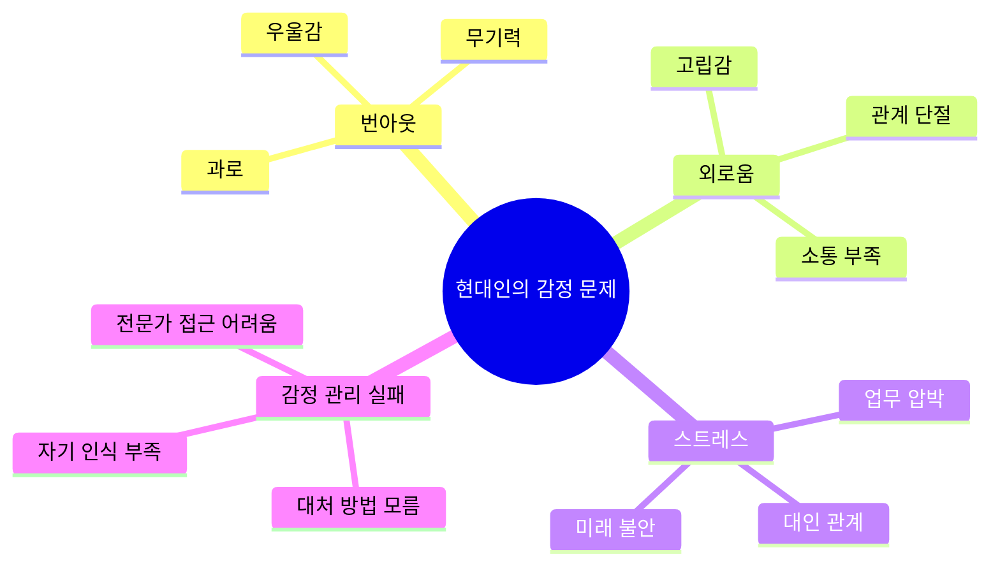

### 💡 솔루션 방향

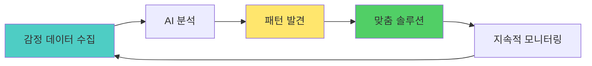

---

## 5가지 소주제

### 1️⃣ 나만의 AI 감정 일기장

#### 개념
음성으로 하루를 이야기하면 AI가 감정을 분석하고 장기 패턴을 발견하는 시스템

#### 핵심 기능
- 🎤 **음성 입력** - 3분 이내 자유 발화
- 📊 **감정 분석** - 6가지 기본 감정 (기쁨, 슬픔, 화남, 두려움, 혐오, 놀람)
- 📈 **트렌드 분석** - 주간/월간 감정 변화 그래프
- 💬 **AI 위로** - 감정에 맞는 공감 메시지
- 🔍 **트리거 발견** - "월요일마다 우울함" 같은 패턴

#### 순서도

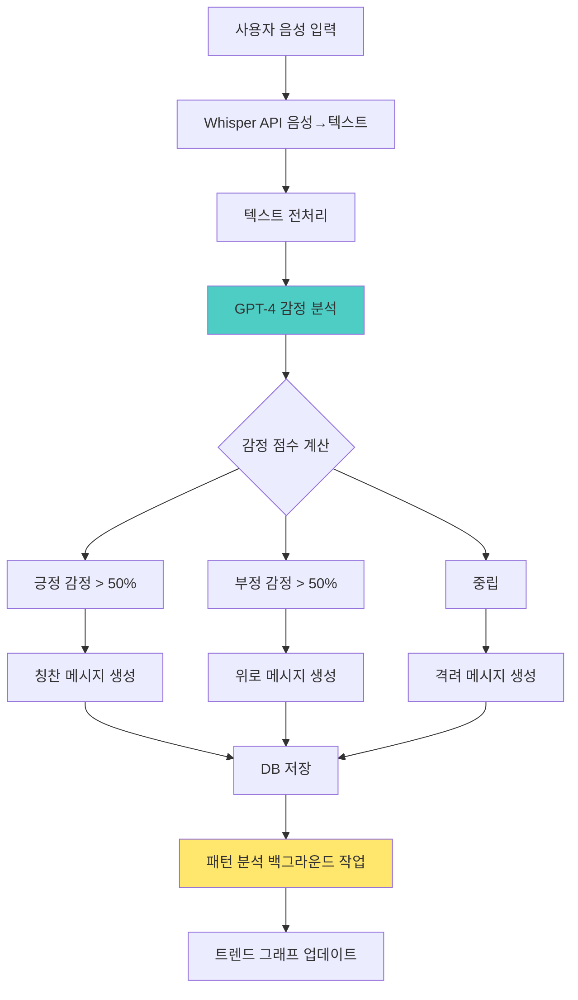

#### UI/UX 설계

**메인 화면**
```
┌─────────────────────────────────┐
│  🌤️ 오늘 기분은 어때요?          │
│                                 │
│  ┌─────────────────────────┐   │
│  │  🎤                      │   │
│  │                          │   │
│  │  [탭하여 말하기]         │   │
│  │                          │   │
│  └─────────────────────────┘   │
│                                 │
│  💡 팁: 오늘 있었던 일을         │
│      자유롭게 말해보세요         │
│                                 │
├─────────────────────────────────┤
│  📊 이번 주 감정 요약            │
│                                 │
│  😊 기쁨   ████████░░  80%      │
│  😢 슬픔   ███░░░░░░░  30%      │
│  😠 화남   ██░░░░░░░░  20%      │
│                                 │
│  [자세히 보기 →]                │
└─────────────────────────────────┘
```

**분석 결과 화면**
```
┌─────────────────────────────────┐
│  ← 오늘의 분석 결과 (3분 26초)   │
├─────────────────────────────────┤
│  📝 요약                         │
│  "오늘은 업무 스트레스가 있었지만│
│   저녁에 친구와 통화하며         │
│   기분이 나아졌네요"             │
│                                 │
├─────────────────────────────────┤
│  🎭 감정 분포                    │
│                                 │
│  😊 기쁨      40%  ████░░        │
│  😟 불안      30%  ███░░         │
│  😌 평온      20%  ██░░░         │
│  😤 짜증      10%  █░░░░         │
│                                 │
├─────────────────────────────────┤
│  💡 AI의 한마디                  │
│  "업무 스트레스를 친구와의 대화로│
│   푸는 게 당신에게 효과적이네요. │
│   내일도 힘내세요! 💪"           │
│                                 │
├─────────────────────────────────┤
│  🔍 발견한 패턴                  │
│  • 월요일 오후에 스트레스↑       │
│  • 친구 만남 후 기분↑            │
│                                 │
│  [패턴 자세히 보기]              │
└─────────────────────────────────┘
```

---

### 2️⃣ 리얼타임 회의 톤 분석기

#### 개념
온라인 회의나 발표 중 내 목소리를 실시간 분석하여 자신감, 명확성, 속도 등을 피드백

#### 핵심 기능
- 🎙️ **실시간 음성 분석** - 0.5초 지연
- 📊 **자신감 지수** - 목소리 떨림, 음높이 변화
- ⚡ **말 속도 측정** - 너무 빠르거나 느린지 체크
- 🎯 **필러 워드 감지** - "음...", "그...", "저..." 카운트
- 💬 **발화 패턴** - 질문 vs 진술 비율

#### 순서도

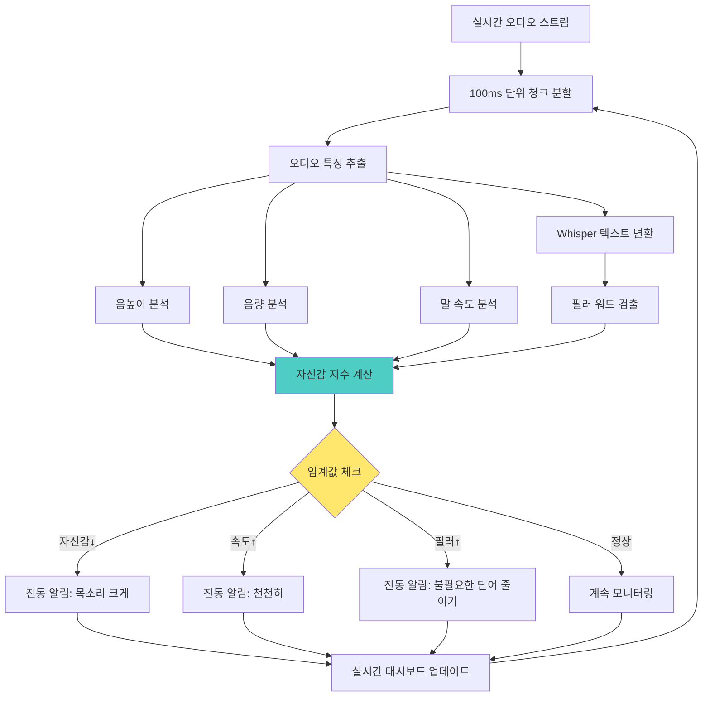

#### UI/UX 설계

**실시간 모니터링 화면 (회의 중)**
```
┌─────────────────────────────────┐
│  🎤 실시간 분석 중...            │
│  ⏱️ 10:32 / 30:00               │
├─────────────────────────────────┤
│                                 │
│  😊 자신감 지수                  │
│  ████████░░  82%  [좋음!]       │
│                                 │
│  🗣️ 말 속도                     │
│  ████░░░░░░  40%  [적절]        │
│  (분당 140단어)                 │
│                                 │
│  🎯 명확성                       │
│  ██████░░░░  65%  [주의]        │
│  "음..": 8회 발견               │
│                                 │
│  💡 지금 목소리 좋아요!          │
│     계속 유지하세요              │
│                                 │
└─────────────────────────────────┘
```

**회의 종료 후 리포트**
```
┌─────────────────────────────────┐
│  📊 발표 분석 리포트             │
│  2025.11.26 팀 회의 (28분)      │
├─────────────────────────────────┤
│  🎯 종합 점수: 78점 (Good!)      │
│                                 │
│  ┌────────────────────────┐    │
│  │ 자신감   ████████░░ 85% │    │
│  │ 명확성   ██████░░░░ 65% │    │
│  │ 속도     ███████░░░ 75% │    │
│  │ 에너지   ████████░░ 82% │    │
│  └────────────────────────┘    │
│                                 │
├─────────────────────────────────┤
│  💪 잘한 점                      │
│  • 처음 5분간 매우 자신감 있었음 │
│  • 목소리 크기가 일정했음        │
│  • 적절한 속도 유지              │
│                                 │
│  📈 개선 포인트                  │
│  • "음..." 18회 사용 (↓권장)    │
│  • 중반부터 말 속도 빨라짐       │
│  • 질문에 대한 답변 시간 짧음    │
│                                 │
│  🎓 다음 발표 목표               │
│  필러 워드 10회 이하 줄이기      │
│                                 │
│  [AI 연습 시작하기]              │
└─────────────────────────────────┘
```

---

### 3️⃣ 연인/가족 대화 온도계

#### 개념
카카오톡 대화 내보내기 데이터를 분석하여 관계 건강도를 체크하고 개선점 제안

#### 핵심 기능
- 💬 **대화 패턴 분석** - 빈도, 길이, 시간대
- ❤️ **감정 온도** - 대화의 긍정/부정 비율
- ⚠️ **갈등 시그널 감지** - 부정 단어, 짧은 답변 증가
- 📅 **관계 타임라인** - 지난 3개월 변화 추이
- 💡 **개선 제안** - AI 추천 대화 주제/방법

#### 순서도

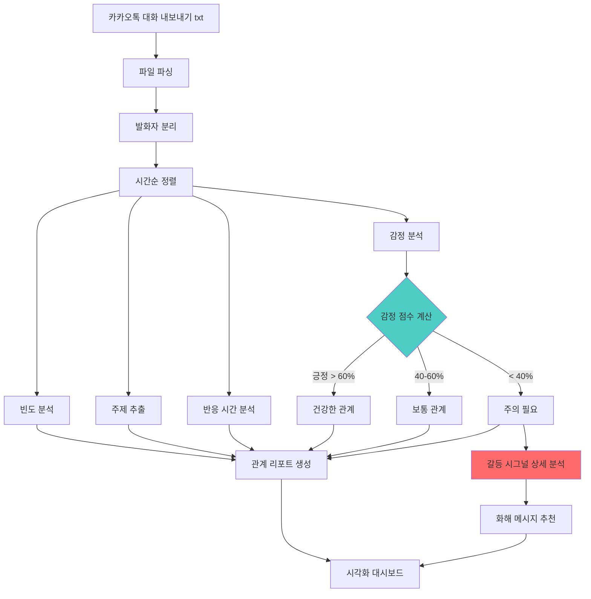

#### UI/UX 설계

**메인 분석 화면**
```
┌─────────────────────────────────┐
│  💑 관계 온도계                  │
│  [수진]님과의 관계               │
├─────────────────────────────────┤
│                                 │
│       🌡️ 현재 온도              │
│                                 │
│    ┌──────────────────┐        │
│    │                  │        │
│    │      72°C        │        │
│    │   [따뜻함]       │        │
│    │                  │        │
│    └──────────────────┘        │
│                                 │
│  ━━━━━━━━━━━━━━━━━━━━━━━       │
│  🥶  😐  🙂  😊  ❤️            │
│  0   25  50  75  100           │
│                                 │
├─────────────────────────────────┤
│  📊 최근 30일 분석               │
│                                 │
│  💬 대화 빈도  ████████░░  높음  │
│  ❤️ 긍정 비율  ███████░░░  70%  │
│  ⚡ 반응 속도  ██████████  빠름  │
│  🎯 대화 깊이  ██████░░░░  60%  │
│                                 │
│  [상세 리포트 보기]              │
└─────────────────────────────────┘
```

**갈등 시그널 알림**
```
┌─────────────────────────────────┐
│  ⚠️ 주의: 관계 변화 감지         │
├─────────────────────────────────┤
│  최근 1주일간 변화:              │
│                                 │
│  📉 긍정 표현 30% 감소           │
│  📉 대화 길이 평균 50% 감소      │
│  ⏰ 답장 시간 2배 증가           │
│                                 │
│  주요 시그널:                    │
│  • 짧은 답변 증가 ("ㅇㅇ", "ㅎ")  │
│  • 이모티콘 사용 감소            │
│  • "바빠" 단어 5회 등장          │
│                                 │
├─────────────────────────────────┤
│  💡 AI 추천                      │
│                                 │
│  "최근 대화가 줄어들었네요.      │
│   먼저 가벼운 주제로 대화를       │
│   시작해보는 건 어떨까요?"       │
│                                 │
│  추천 메시지:                    │
│  ┌──────────────────────────┐  │
│  │ "요즘 많이 바빠? 힘들지 않아?│  │
│  │  시간 될 때 밥 한번 먹자~"  │  │
│  └──────────────────────────┘  │
│                                 │
│  [이 메시지 전송하기]            │
│  [직접 작성하기]                 │
└─────────────────────────────────┘
```

---

### 4️⃣ AI 기반 수면 질 개선

#### 개념
잠들기 전 감정 상태와 하루 활동을 분석하여 맞춤형 수면 환경 제공

#### 핵심 기능
- 😴 **수면 전 체크인** - 간단한 질문으로 상태 파악
- 🎵 **맞춤 사운드 생성** - AI가 만드는 백색소음/명상음악
- 📊 **수면 패턴 분석** - 기상 시 컨디션 기록
- 💡 **수면 루틴 최적화** - 가장 잘 잤던 날의 패턴 분석
- ⏰ **스마트 알람** - 얕은 수면 단계에서 기상

#### 순서도

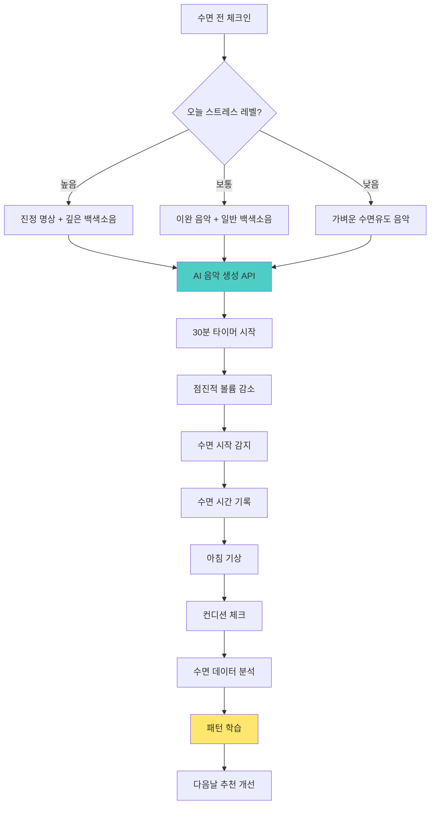

#### UI/UX 설계

**수면 전 체크인**
```
┌─────────────────────────────────┐
│  🌙 잠들 준비                    │
│  23:42                          │
├─────────────────────────────────┤
│  오늘 하루 어땠나요?             │
│                                 │
│  ┌─────┐ ┌─────┐ ┌─────┐       │
│  │ 😫  │ │ 😐  │ │ 😊  │       │
│  │힘듦 │ │보통 │ │좋음 │       │
│  └─────┘ └─────┘ └─────┘       │
│                                 │
│  오늘 머릿속이?                  │
│                                 │
│  ┌─────┐ ┌─────┐ ┌─────┐       │
│  │ 🌪️  │ │ 🌤️  │ │ ☁️  │       │
│  │복잡 │ │평온 │ │멍함 │       │
│  └─────┘ └─────┘ └─────┘       │
│                                 │
│  [다음]                          │
└─────────────────────────────────┘
```

**AI 수면 환경 생성**
```
┌─────────────────────────────────┐
│  🎵 맞춤 수면 환경 준비 중...    │
├─────────────────────────────────┤
│                                 │
│    ╔════════════════════╗       │
│    ║                    ║       │
│    ║   🌊 파도 소리      ║       │
│    ║   + 빗소리         ║       │
│    ║   + 432Hz 음악     ║       │
│    ║                    ║       │
│    ╚════════════════════╝       │
│                                 │
│  💡 오늘 같은 날엔 이 조합이     │
│     가장 효과적이에요            │
│                                 │
│  ⏱️ 30분 후 자동 꺼짐           │
│                                 │
│  ━━━━━━○━━━━━━━  볼륨 70%       │
│                                 │
│  [시작하기]  [사운드 변경]       │
└─────────────────────────────────┘
```

**아침 수면 리포트**
```
┌─────────────────────────────────┐
│  ☀️ 좋은 아침이에요!             │
│  7시간 32분 숙면                │
├─────────────────────────────────┤
│  😊 오늘 컨디션은?               │
│                                 │
│  ⭐⭐⭐⭐⭐  [선택하기]          │
│                                 │
├─────────────────────────────────┤
│  📊 어젯밤 수면 분석             │
│                                 │
│  입면 시간     23:58            │
│  기상 시간     07:30            │
│  순수 수면     7h 15m           │
│  수면 효율     96%              │
│                                 │
│  💡 인사이트                     │
│  "파도 소리를 들었을 때 15분     │
│   빨리 잠들었어요. 다음엔        │
│   이 조합을 추천할게요!"         │
│                                 │
│  [상세 리포트]                   │
└─────────────────────────────────┘
```

---

### 5️⃣ 소셜미디어 디톡스 도우미

#### 개념
내가 소비하는 SNS 콘텐츠가 감정에 미치는 영향을 분석하고 건강한 사용 유도

#### 핵심 기능
- 📱 **사용 시간 추적** - 앱별 사용 시간 모니터링
- 😔 **부정 영향 계정 감지** - 이 계정을 본 후 기분↓
- 🎯 **건강한 대안 제안** - 긍정적 콘텐츠 추천
- ⏰ **사용 제한 알림** - 설정 시간 초과 시 경고
- 📊 **감정 변화 추적** - SNS 전후 감정 비교

#### 순서도

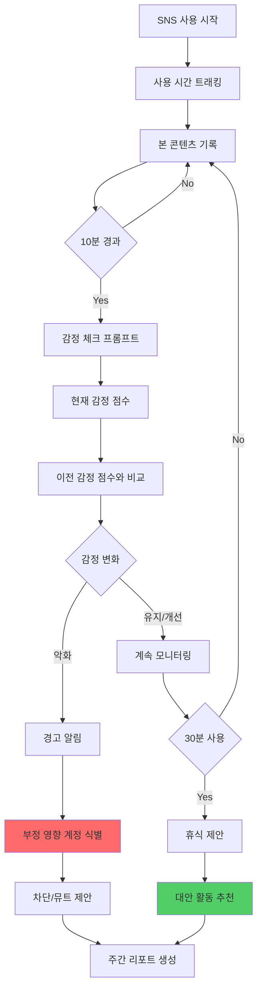

#### UI/UX 설계

**실시간 모니터링**
```
┌─────────────────────────────────┐
│  📱 Instagram 15분 사용 중       │
├─────────────────────────────────┤
│                                 │
│  현재 기분: 😐 → 😞              │
│                                 │
│  ⚠️ 주의: 기분이 나빠지고 있어요 │
│                                 │
│  최근 본 계정:                   │
│  • @perfect_life (5분)          │
│  • @luxury_daily (3분)          │
│  • @fitness_goals (2분)         │
│                                 │
│  💡 이런 계정들이 당신을          │
│     우울하게 만드는 것 같아요     │
│                                 │
│  [지금 그만두기]                 │
│  [계정 뮤트하기]                 │
│  [계속 보기]                     │
└─────────────────────────────────┘
```

**주간 디톡스 리포트**
```
┌─────────────────────────────────┐
│  🧘 주간 디지털 웰빙 리포트       │
│  11.20 - 11.26                  │
├─────────────────────────────────┤
│  📊 이번 주 사용 패턴             │
│                                 │
│  총 사용 시간: 14시간 23분       │
│  (전주 대비 -2시간)              │
│                                 │
│  앱별 사용:                      │
│  Instagram  6h 30m  ████████    │
│  TikTok     4h 15m  █████       │
│  Twitter    3h 38m  ████        │
│                                 │
├─────────────────────────────────┤
│  🎭 감정 영향 분석               │
│                                 │
│  😊 기분 좋아진 계정 Top 3       │
│  1. @positive_quotes            │
│  2. @cute_animals               │
│  3. @cooking_simple             │
│                                 │
│  😔 기분 나빠진 계정 Top 3       │
│  1. @perfect_life (⚠️)          │
│  2. @expensive_things (⚠️)      │
│  3. @success_flex (⚠️)          │
│                                 │
│  [부정 계정 한번에 뮤트하기]      │
│                                 │
├─────────────────────────────────┤
│  💡 이번 주 달성                 │
│  ✅ 저녁 10시 이후 사용 안함      │
│  ✅ 하루 평균 2시간 이하          │
│  ❌ 아침 기상 후 즉시 확인 안함   │
│                                 │
│  🎯 다음 주 목표                 │
│  [ ] 하루 1시간 30분 이하        │
│  [ ] 부정 계정 5개 언팔로우      │
│                                 │
└─────────────────────────────────┘
```

---

## 전체 시스템 아키텍처

### 🏗️ 통합 시스템 구조

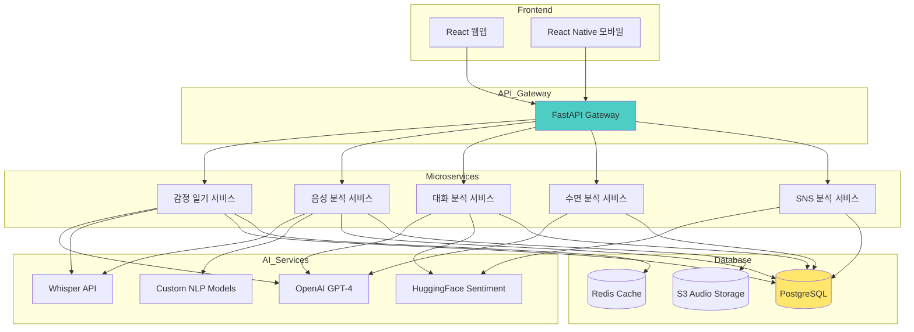

---

## 유저 시나리오

### 시나리오 1: 번아웃 위기의 직장인 민지

**배경:** 마케팅 팀 대리, 3개월째 야근 중, 최근 자주 우울함

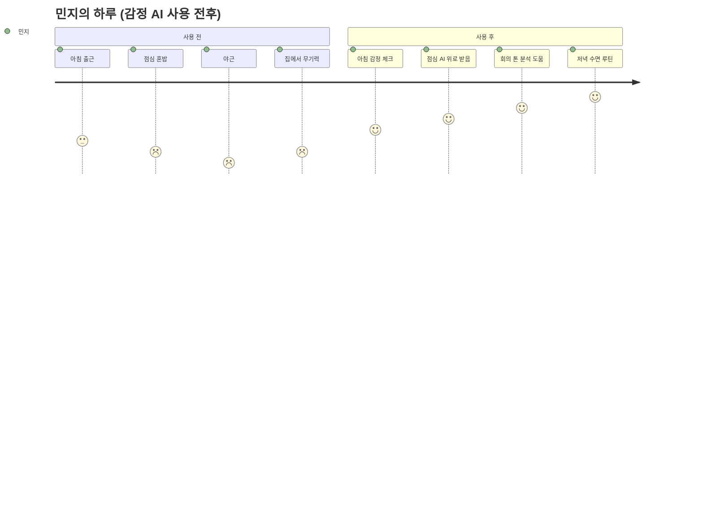

**1주차 사용 여정**

**월요일 아침**
```
07:30 - 기상 후 침대에서
[감정 일기 앱 실행]

민지: "휴... 월요일이다. 오늘도 회의가 3개나 있어.
      팀장님한테 또 혼날 것 같아. 솔직히 이 일이
      나한테 맞는지도 모르겠어..."

[AI 분석 완료]
앱: "많이 지쳐있는 것 같네요. 특히 '또'라는 단어에서
     반복되는 스트레스가 느껴져요. 오늘은 작은 것에
     집중해보는 건 어때요? 힘내요! 💙"

감정 점수: 😔 25/100 (매우 낮음)
주요 감정: 불안 60%, 무기력 30%, 두려움 10%
```

**월요일 오후 - 중요 회의**
```
14:00 - Zoom 회의 참여
[회의 톤 분석기 ON]

[15분 경과]
앱 진동: "목소리가 너무 작아요. 조금만 크게!"
민지: (목소리 키움)

[30분 경과]
앱: "지금 자신감 지수 85%! 계속 유지하세요!"

[회의 종료]
앱: "오늘 발표 점수 78점! 잘했어요!
     특히 후반부가 훌륭했습니다."

민지: (자신감 회복) "생각보다 잘한 것 같아!"
```

**화요일 저녁**
```
22:30 - 퇴근 후 집
[대화 온도계 확인]

앱: "⚠️ 주의: 남자친구와의 대화가 이번 주
     40% 감소했어요. 답장도 평소보다 늦어졌어요."

민지: "아... 내가 너무 바빠서 연락을 못했구나"

[AI 추천 메시지]
앱: "이런 메시지는 어때요?
     '요즘 너무 바빠서 연락 못 해서 미안해.
      주말에 시간 내서 만날까?'"

민지: [메시지 전송]
남자친구: "ㅇㅋㅇㅋ 나도 보고싶었어!"

앱: "관계 온도 +15도 상승! 😊"
```

**금요일 밤**
```
23:45 - 잠들기 전
[수면 루틴 시작]

앱: "이번 주 평균 수면 시간 5시간 30분이에요.
     오늘은 푹 쉬어봐요!"

[수면 전 체크인]
민지: (힘듦 선택)

앱: "오늘 같은 날엔 깊은 이완이 필요해요.
     파도 소리 + 432Hz 음악을 준비했어요."

[30분 후]
민지: (깊은 잠)

[아침]
앱: "7시간 45분 숙면! 이번 주 최고 기록이에요!"
민지: "와... 진짜 오랜만에 잘 잤다"
```

**일요일 저녁 - 주간 리포트**
```
20:00 - 일주일 회고

[주간 감정 리포트]
앱: 
"이번 주 민지님의 감정 여정 🎢

월: 😔 25점 (최저)
화: 😐 45점
수: 🙂 62점
목: 😊 71점
금: 😊 78점

📈 주간 개선율: +53점!

💡 발견한 패턴:
1. 월요일마다 스트레스 최고
   → 일요일 저녁 미리 계획 세우기 권장
   
2. 회의 후 자신감 상승
   → 발표 연습이 도움 됨
   
3. 남자친구와 통화 후 기분↑
   → 바빠도 주 2회 연락 유지 권장

🎯 다음 주 목표:
[ ] 월요일 아침 긍정 루틴 만들기
[ ] 하루 10분 명상
[ ] 주 3회 운동

민지님은 점점 나아지고 있어요! 💪"

민지: "AI가 날 이렇게 잘 이해하다니...
       다음 주도 힘내봐야겠다!"
```

---

### 시나리오 2: 취준생 수현의 면접 준비

**배경:** 경영학과 4학년, 첫 면접 앞두고 불안함

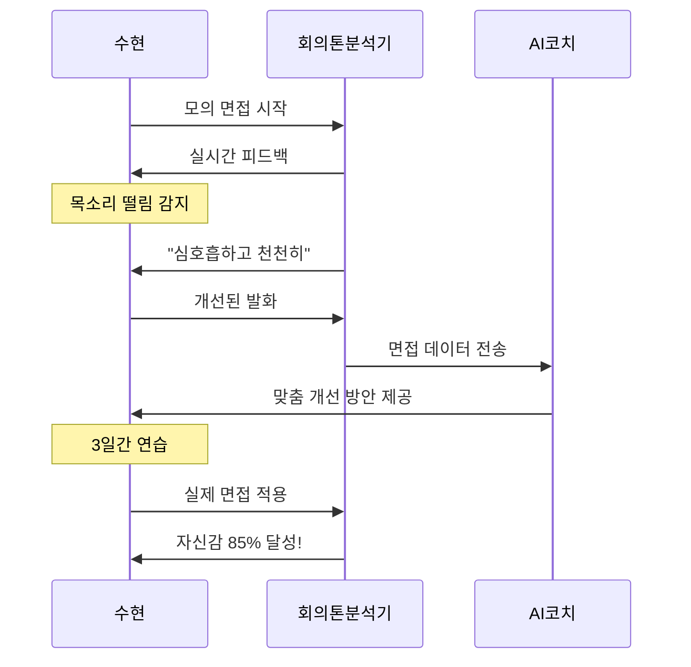

**D-7: 첫 연습**
```
[모의 면접 모드]
AI: "자기소개를 해주세요"

수현: "음... 저는... 그... 경영학과 4학년..."

[실시간 분석]
- 자신감: 35% (매우 낮음)
- 필러 워드: 분당 8회 (↓필요)
- 말 속도: 200단어/분 (너무 빠름)

앱 진동: "천천히, 심호흡하고 다시"

수현: (심호흡) "안녕하십니까. 저는 경영학을..."

[분석]
- 자신감: 55% (개선!)
- 필러 워드: 3회 (좋아요!)

앱: "훨씬 좋아졌어요! 계속 이 템포로!"
```

**D-1: 최종 점검**
```
[모의 면접 10회차]

수현: "안녕하십니까. 마케팅 직무에 지원한
      김수현입니다. 저는 대학 4년간..."

[분석]
- 자신감: 82% (훌륭!)
- 명확성: 88%
- 말 속도: 145단어/분 (적절)
- 필러 워드: 1회

앱: "완벽해요! 내일 이대로만 하시면 됩니다.
     민지님이라면 충분히 잘하실 거예요! 💪"

수현: "고마워... 이제 좀 자신감 생긴다"
```

---

## UI/UX 상세 설계

### 🎨 디자인 시스템

#### 컬러 팔레트
```css
:root {
  /* Primary - 차분한 블루 */
  --primary-50: #E0F7F6;
  --primary-100: #B3EEEC;
  --primary-500: #4ECDC4;  /* 메인 */
  --primary-700: #35A099;
  --primary-900: #1C5450;
  
  /* Emotion Colors */
  --emotion-joy: #FFD93D;      /* 기쁨 */
  --emotion-sadness: #6C63FF;  /* 슬픔 */
  --emotion-anger: #FF6B6B;    /* 화남 */
  --emotion-fear: #A29BFE;     /* 두려움 */
  --emotion-neutral: #95AAC4;  /* 중립 */
  
  /* Semantic */
  --success: #51CF66;
  --warning: #FFB800;
  --danger: #FF6B6B;
  --info: #4ECDC4;
  
  /* Grayscale */
  --gray-50: #F8F9FA;
  --gray-100: #F1F3F5;
  --gray-500: #ADB5BD;
  --gray-900: #212529;
}
```

#### 타이포그래피
```css
/* Heading */
.heading-1 {
  font-family: 'Pretendard', sans-serif;
  font-weight: 700;
  font-size: 32px;
  line-height: 1.3;
  letter-spacing: -0.02em;
}

.heading-2 {
  font-weight: 600;
  font-size: 24px;
  line-height: 1.4;
}

/* Body */
.body-regular {
  font-weight: 400;
  font-size: 16px;
  line-height: 1.6;
}

.body-emphasis {
  font-weight: 600;
  font-size: 16px;
}

/* Caption */
.caption {
  font-size: 14px;
  color: var(--gray-500);
}
```

#### 컴포넌트 라이브러리

**감정 점수 게이지**
```tsx
// EmotionGauge.tsx
interface EmotionGaugeProps {
  score: number;  // 0-100
  emotion: 'joy' | 'sadness' | 'anger' | 'fear' | 'neutral';
  size?: 'sm' | 'md' | 'lg';
}

// 사용 예시:
<EmotionGauge score={75} emotion="joy" size="lg" />

// 렌더링:
// ████████░░ 75% 😊
```

**실시간 피드백 카드**
```tsx
// FeedbackCard.tsx
interface FeedbackCardProps {
  type: 'success' | 'warning' | 'info';
  message: string;
  icon?: React.ReactNode;
  action?: {
    label: string;
    onClick: () => void;
  };
}

// 사용 예시:
<FeedbackCard 
  type="warning"
  message="말이 너무 빨라요"
  icon={<Speed />}
  action={{
    label: "천천히 말하기",
    onClick: handleSlowDown
  }}
/>
```

---

## 기술 구현 가이드

### 📱 감정 일기장 구현

#### 1. 음성 → 텍스트 변환

```python
# backend/services/voice_diary_service.py
import openai
from pathlib import Path

class VoiceDiaryService:
    """음성 일기 분석 서비스"""
    
    def __init__(self):
        self.openai_client = openai.OpenAI()
    
    async def transcribe_audio(self, audio_file: Path) -> str:
        """
        음성 파일을 텍스트로 변환
        
        Args:
            audio_file: 오디오 파일 경로
            
        Returns:
            변환된 텍스트
        """
        with open(audio_file, 'rb') as f:
            transcript = self.openai_client.audio.transcriptions.create(
                model="whisper-1",
                file=f,
                language="ko"
            )
        
        return transcript.text
    
    async def analyze_emotion(self, text: str) -> dict:
        """
        텍스트의 감정 분석
        
        Args:
            text: 분석할 텍스트
            
        Returns:
            감정 분석 결과
            {
                'emotions': {
                    'joy': 0.4,
                    'sadness': 0.3,
                    'anger': 0.1,
                    'fear': 0.1,
                    'neutral': 0.1
                },
                'dominant_emotion': 'joy',
                'summary': 'AI 요약',
                'comfort_message': 'AI 위로 메시지'
            }
        """
        prompt = f"""
다음은 사용자의 일기입니다. 감정을 분석해주세요:

"{text}"

다음 형식으로 분석 결과를 JSON으로 반환하세요:
{{
    "emotions": {{
        "joy": 0.0~1.0,
        "sadness": 0.0~1.0,
        "anger": 0.0~1.0,
        "fear": 0.0~1.0,
        "neutral": 0.0~1.0
    }},
    "summary": "일기 내용 요약 (50자 이내)",
    "comfort_message": "따뜻한 공감 메시지 (100자 이내)"
}}
"""
        
        response = self.openai_client.chat.completions.create(
            model="gpt-4",
            messages=[
                {"role": "system", "content": "당신은 공감 능력이 뛰어난 감정 분석 전문가입니다."},
                {"role": "user", "content": prompt}
            ],
            response_format={"type": "json_object"}
        )
        
        result = json.loads(response.choices[0].message.content)
        
        # 지배적 감정 찾기
        emotions = result['emotions']
        dominant = max(emotions, key=emotions.get)
        result['dominant_emotion'] = dominant
        
        return result
```

#### 2. 패턴 분석 알고리즘

```python
# backend/services/pattern_analyzer.py
from datetime import datetime, timedelta
from typing import List, Dict
import pandas as pd

class EmotionPatternAnalyzer:
    """감정 패턴 분석기"""
    
    def analyze_weekly_pattern(self, diary_entries: List[Dict]) -> Dict:
        """
        주간 감정 패턴 분석
        
        Args:
            diary_entries: 일기 데이터 리스트
            
        Returns:
            패턴 분석 결과
        """
        df = pd.DataFrame(diary_entries)
        df['date'] = pd.to_datetime(df['created_at'])
        df['weekday'] = df['date'].dt.day_name()
        df['hour'] = df['date'].dt.hour
        
        # 요일별 감정 평균
        weekday_emotions = df.groupby('weekday')['dominant_score'].mean()
        worst_day = weekday_emotions.idxmin()
        best_day = weekday_emotions.idxmax()
        
        # 트리거 찾기
        triggers = self._find_triggers(df)
        
        # 개선 추세 분석
        trend = self._calculate_trend(df)
        
        return {
            'worst_day': worst_day,
            'best_day': best_day,
            'triggers': triggers,
            'trend': trend,
            'insights': self._generate_insights(worst_day, best_day, triggers)
        }
    
    def _find_triggers(self, df: pd.DataFrame) -> List[str]:
        """감정 트리거 찾기"""
        triggers = []
        
        # 특정 키워드와 감정 상관관계
        keywords = ['회의', '팀장', '업무', '야근', '친구', '가족']
        
        for keyword in keywords:
            matching = df[df['text'].str.contains(keyword, na=False)]
            if len(matching) > 2:
                avg_score = matching['dominant_score'].mean()
                if avg_score < 0.4:  # 부정적 트리거
                    triggers.append(f"'{keyword}' 관련 내용에서 스트레스 증가")
                elif avg_score > 0.7:  # 긍정적 트리거
                    triggers.append(f"'{keyword}' 관련 내용에서 기분 개선")
        
        return triggers
    
    def _calculate_trend(self, df: pd.DataFrame) -> str:
        """감정 추세 계산"""
        # 최근 7일 평균 vs 이전 7일 평균
        recent = df.tail(7)['dominant_score'].mean()
        previous = df.iloc[-14:-7]['dominant_score'].mean()
        
        change = (recent - previous) / previous * 100
        
        if change > 10:
            return f"improving"  # 개선 중
        elif change < -10:
            return f"declining"  # 악화 중
        else:
            return f"stable"  # 안정적
    
    def _generate_insights(self, worst_day: str, best_day: str, 
                          triggers: List[str]) -> List[str]:
        """인사이트 생성"""
        insights = []
        
        insights.append(f"{worst_day}마다 스트레스가 높아요. "
                       f"이 날은 특별히 자기 관리가 필요해요.")
        
        insights.append(f"{best_day}에 가장 행복해요. "
                       f"이 날의 루틴을 다른 날에도 적용해보세요.")
        
        if triggers:
            insights.append("발견한 패턴: " + ", ".join(triggers[:2]))
        
        return insights
```

#### 3. 프론트엔드 - 음성 녹음

```typescript
// frontend/hooks/useVoiceRecorder.ts
import { useState, useRef } from 'react';

export const useVoiceRecorder = () => {
  const [isRecording, setIsRecording] = useState(false);
  const [audioBlob, setAudioBlob] = useState<Blob | null>(null);
  const mediaRecorderRef = useRef<MediaRecorder | null>(null);
  const chunksRef = useRef<Blob[]>([]);

  /**
   * 녹음 시작
   */
  const startRecording = async () => {
    try {
      // 마이크 권한 요청
      const stream = await navigator.mediaDevices.getUserMedia({ 
        audio: {
          echoCancellation: true,
          noiseSuppression: true,
          sampleRate: 44100,
        } 
      });

      // MediaRecorder 생성
      const mediaRecorder = new MediaRecorder(stream, {
        mimeType: 'audio/webm;codecs=opus'
      });

      mediaRecorderRef.current = mediaRecorder;
      chunksRef.current = [];

      // 데이터 수집
      mediaRecorder.ondataavailable = (event) => {
        if (event.data.size > 0) {
          chunksRef.current.push(event.data);
        }
      };

      // 녹음 종료 시
      mediaRecorder.onstop = () => {
        const blob = new Blob(chunksRef.current, { type: 'audio/webm' });
        setAudioBlob(blob);
        
        // 스트림 정리
        stream.getTracks().forEach(track => track.stop());
      };

      mediaRecorder.start();
      setIsRecording(true);
    } catch (error) {
      console.error('녹음 시작 실패:', error);
      alert('마이크 접근 권한이 필요합니다');
    }
  };

  /**
   * 녹음 중지
   */
  const stopRecording = () => {
    if (mediaRecorderRef.current && isRecording) {
      mediaRecorderRef.current.stop();
      setIsRecording(false);
    }
  };

  /**
   * 서버에 업로드
   */
  const uploadAudio = async () => {
    if (!audioBlob) return null;

    const formData = new FormData();
    formData.append('audio', audioBlob, 'diary.webm');

    try {
      const response = await fetch('/api/voice-diary/analyze', {
        method: 'POST',
        body: formData,
      });

      const result = await response.json();
      return result;
    } catch (error) {
      console.error('업로드 실패:', error);
      return null;
    }
  };

  return {
    isRecording,
    audioBlob,
    startRecording,
    stopRecording,
    uploadAudio,
  };
};
```

#### 4. 감정 시각화 컴포넌트

```typescript
// frontend/components/EmotionChart.tsx
import { Line } from 'react-chartjs-2';
import { EmotionData } from '@/types';

interface EmotionChartProps {
  data: EmotionData[];
  period: 'week' | 'month';
}

export const EmotionChart: React.FC<EmotionChartProps> = ({ data, period }) => {
  // 데이터 가공
  const chartData = {
    labels: data.map(d => {
      const date = new Date(d.date);
      return period === 'week' 
        ? date.toLocaleDateString('ko-KR', { weekday: 'short' })
        : `${date.getMonth() + 1}/${date.getDate()}`;
    }),
    datasets: [
      {
        label: '기쁨',
        data: data.map(d => d.emotions.joy * 100),
        borderColor: '#FFD93D',
        backgroundColor: 'rgba(255, 217, 61, 0.1)',
        tension: 0.4,
      },
      {
        label: '슬픔',
        data: data.map(d => d.emotions.sadness * 100),
        borderColor: '#6C63FF',
        backgroundColor: 'rgba(108, 99, 255, 0.1)',
        tension: 0.4,
      },
      {
        label: '화남',
        data: data.map(d => d.emotions.anger * 100),
        borderColor: '#FF6B6B',
        backgroundColor: 'rgba(255, 107, 107, 0.1)',
        tension: 0.4,
      },
    ],
  };

  const options = {
    responsive: true,
    plugins: {
      legend: {
        position: 'bottom' as const,
      },
      tooltip: {
        callbacks: {
          label: (context: any) => {
            return `${context.dataset.label}: ${context.parsed.y.toFixed(0)}%`;
          },
        },
      },
    },
    scales: {
      y: {
        beginAtZero: true,
        max: 100,
        ticks: {
          callback: (value: any) => `${value}%`,
        },
      },
    },
  };

  return (
    <div className="emotion-chart">
      <Line data={chartData} options={options} />
    </div>
  );
};
```

---

## 🔒 보안 및 프라이버시

### 데이터 보호 전략

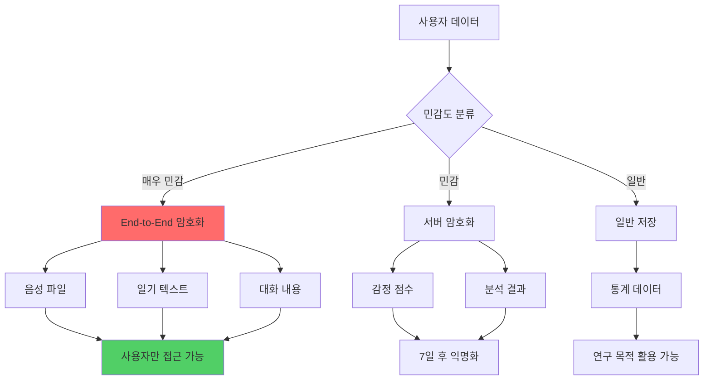

### 구현 예시

```python
# backend/utils/encryption.py
from cryptography.fernet import Fernet
from cryptography.hazmat.primitives import hashes
from cryptography.hazmat.primitives.kdf.pbkdf2 import PBKDF2
import base64

class DataEncryption:
    """데이터 암호화 유틸리티"""
    
    @staticmethod
    def generate_key(user_password: str, salt: bytes) -> bytes:
        """
        사용자 비밀번호로 암호화 키 생성
        
        Args:
            user_password: 사용자 비밀번호
            salt: 솔트 값
            
        Returns:
            암호화 키
        """
        kdf = PBKDF2(
            algorithm=hashes.SHA256(),
            length=32,
            salt=salt,
            iterations=100000,
        )
        key = base64.urlsafe_b64encode(kdf.derive(user_password.encode()))
        return key
    
    @staticmethod
    def encrypt_text(text: str, key: bytes) -> str:
        """텍스트 암호화"""
        f = Fernet(key)
        encrypted = f.encrypt(text.encode())
        return base64.urlsafe_b64encode(encrypted).decode()
    
    @staticmethod
    def decrypt_text(encrypted_text: str, key: bytes) -> str:
        """텍스트 복호화"""
        f = Fernet(key)
        decrypted = f.decrypt(base64.urlsafe_b64decode(encrypted_text))
        return decrypted.decode()
```

---

## 📊 성과 지표

### KPI 대시보드

| 지표 | 목표 | 측정 방법 |
|------|------|-----------|
| 사용자 만족도 | 4.5/5.0 | 주간 설문 |
| 일일 사용률 | 70% | 활성 사용자 / 전체 |
| 감정 개선율 | +30% | 4주 전후 비교 |
| 기능 완성도 | 90% | 버그 리포트 |
| 응답 속도 | <2초 | API 레이턴시 |

---

**마지막 업데이트:** 2025-11-26  
**다음 문서:** [여가AI_상세가이드.md](./여가AI_상세가이드.md)

