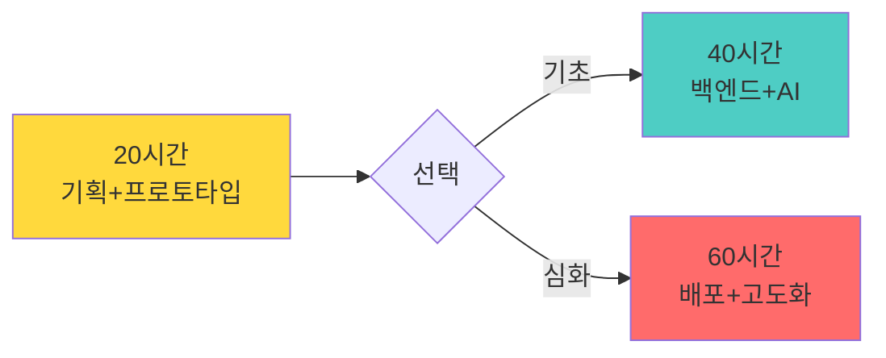
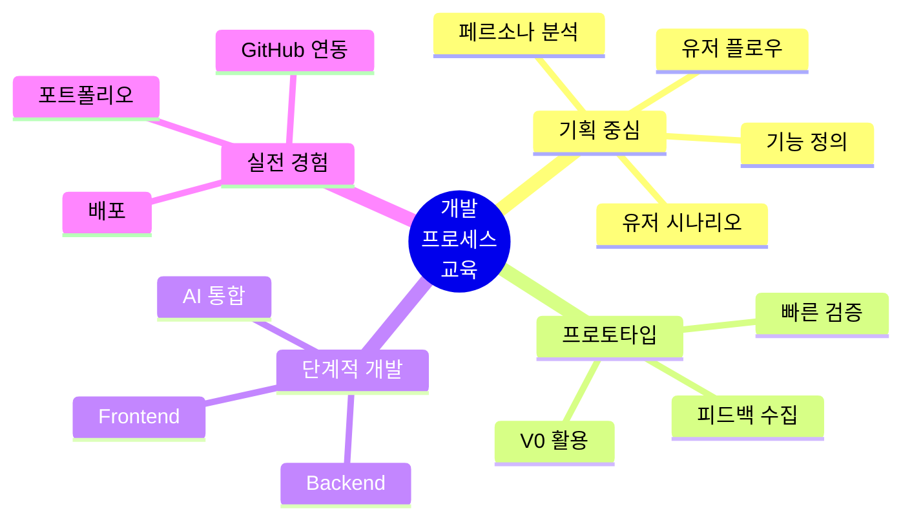
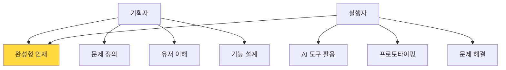
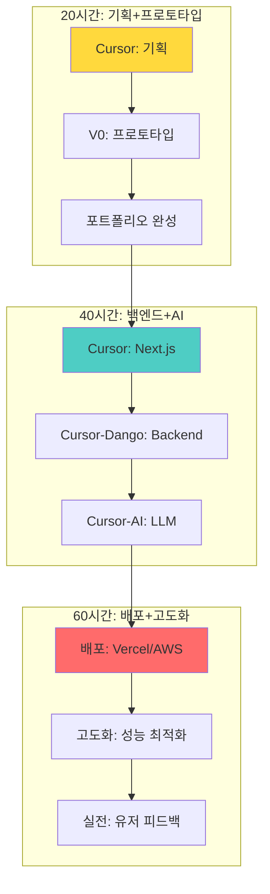
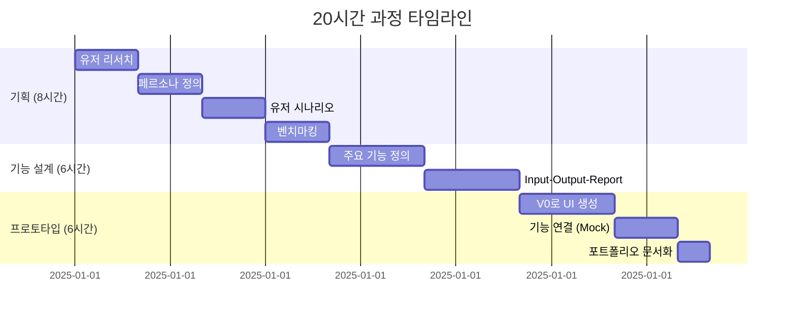
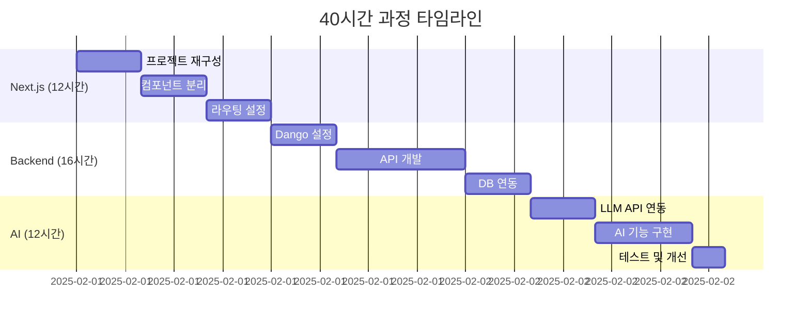
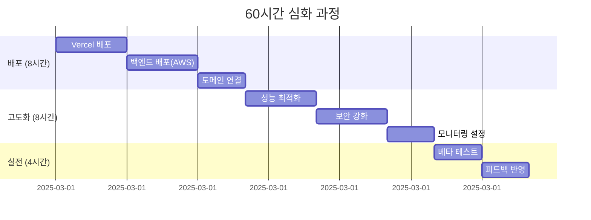
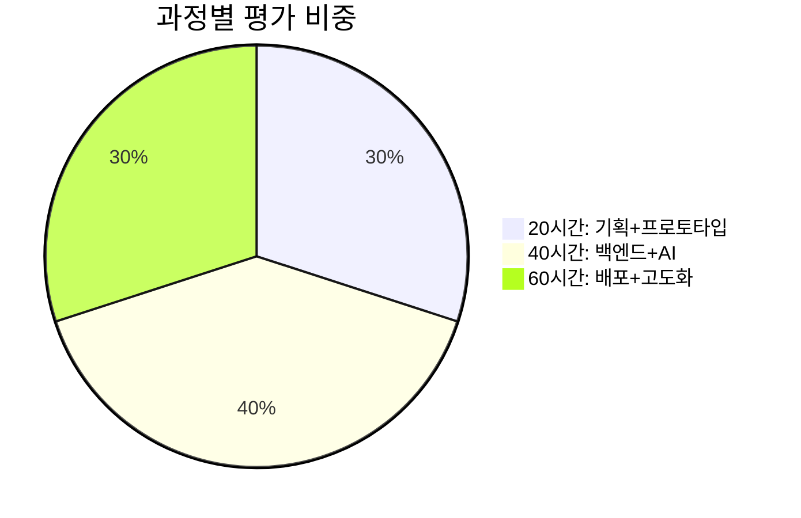

# 개발 프로세스 중심 AI 교육 가이드 v4.0
## 기획자와 실행자 양성을 위한 단계별 교육 프로그램

> **"기획 → 프로토타입 → 개발 → 배포"**  
> 개발 프로세스를 이해하고 경험하는 것이 핵심



---

## 📋 목차

1. [프로그램 개요](#프로그램-개요)
2. [교육 철학](#교육-철학)
3. [개발 프로세스](#개발-프로세스)
4. [20시간 과정: 기획+프로토타입](#20시간-과정-기획프로토타입)
5. [40시간 과정: 백엔드+AI](#40시간-과정-백엔드ai)
6. [60시간 심화: 배포+고도화](#60시간-심화-배포고도화)
7. [평가 및 성과 측정](#평가-및-성과-측정)

---

## 프로그램 개요

### 🎯 핵심 목표

**"개발 프로세스를 이해하고 경험하여 기획자와 실행자를 양성한다"**

### 💡 교육 대상

- **20시간 과정**: 고등학생, 대학생 (전공 무관)
- **40시간 과정**: 개발 지식이 필요한 학생 (동시 학습)
- **60시간 심화**: 실무 수준의 프로젝트를 원하는 학생

### 🌟 차별화 포인트



---

## 교육 철학

### 🎯 왜 "개발 프로세스"인가?

**기존 문제점:**
- ❌ 체험만으로는 실제 개발 능력이 생기지 않음
- ❌ 코딩만 가르치면 전체 프로세스를 이해 못함
- ❌ 결과물 없이 끝나는 교육

**우리의 해결책:**
- ✅ 기획부터 배포까지 전체 프로세스 경험
- ✅ 각 단계의 목적과 방법 이해
- ✅ 실제 작동하는 포트폴리오 완성

### 👥 양성하는 인재상



| 역량 | 기획자 | 실행자 | 학습 방법 |
|------|--------|--------|----------|
| **문제 정의** | 유저 니즈 파악 | 기술적 구현 가능성 판단 | 20시간: 기획 실습 |
| **설계 능력** | 유저 플로우, 와이어프레임 | 데이터 구조, API 설계 | 20시간 + 40시간 |
| **구현 능력** | 프로토타입 제작 | AI 도구로 개발 | 40시간 + 60시간 |
| **협업 능력** | 기획서 작성 | GitHub, 문서화 | 전 과정 |

---

## 개발 프로세스

### 📐 전체 프로세스 Overview



### 🔑 핵심 도구

| 단계 | 도구 | 용도 |
|------|------|------|
| **기획** | Cursor (AI) | 유저 시나리오, 페르소나 작성 |
| **프로토타입** | V0 | Frontend 프로토타입 생성 |
| **개발** | Cursor | Next.js 앱 개발 |
| **백엔드** | Cursor + Dango | API 개발 |
| **AI** | Cursor + LLM API | AI 기능 통합 |
| **배포** | Vercel / AWS | 서비스 배포 |
| **협업** | GitHub | 버전 관리 |

---

## 20시간 과정: 기획+프로토타입

### 🎯 목표

**"기획 능력을 키우고 V0로 작동하는 프로토타입을 만들어 포트폴리오를 완성한다"**

### 📅 커리큘럼 구조



---

### Week 1-2: 기획 (8시간)

#### **Day 1-2: 유저 리서치 & 페르소나 (4시간)**

```markdown
━━━━━━━━━━━━━━━━━━━━━━
🎯 학습 목표
- 실제 유저의 문제를 발견하고 정의
- 페르소나를 통해 타겟 유저 구체화

📋 진행 방식
1. 문제 발견 (1시간)
   교수: "여러분이나 주변 사람들이 겪는 불편한 점을 찾아봐요"
   학생: 브레인스토밍
   - 생활 속 불편함
   - 반복되는 문제
   - 개선하고 싶은 것

2. Cursor AI로 유저 인터뷰 (1시간)
   교수: "Cursor AI를 유저라고 가정하고 인터뷰해봐요"
   
   학생 → Cursor:
   "당신은 대학생입니다. 
    - 어떤 점이 가장 불편하나요?
    - 왜 그런가요?
    - 어떻게 해결하고 있나요?"
   
   Cursor → 답변:
   "저는 매주 과제 마감 관리가 어렵습니다..."

3. 페르소나 작성 (2시간)
   교수: "인터뷰 내용을 바탕으로 페르소나를 만들어요"
   
   [페르소나 템플릿 사용]
   • 이름, 나이, 직업
   • 목표와 동기
   • 불편한 점 (Pain Points)
   • 현재 해결 방법
   • 기대하는 솔루션

💡 실습 예시:
페르소나: 민지 (22세, 경영학과 3학년)
- 목표: 효율적인 시간 관리
- Pain: 과제 마감일을 자주 잊음
- 현재: 노트에 수기 작성 → 자주 확인 안함
- 기대: 자동 알림 + 우선순위 관리
━━━━━━━━━━━━━━━━━━━━━━
```

**산출물:**
- ✅ 페르소나 문서 (3명 이상)
- ✅ 유저 인터뷰 로그
- ✅ 문제 정의서

---

#### **Day 3-4: 유저 시나리오 & 벤치마킹 (4시간)**

```markdown
━━━━━━━━━━━━━━━━━━━━━━
🎯 학습 목표
- 유저가 서비스를 사용하는 전체 흐름 설계
- 경쟁 서비스 분석

📋 진행 방식
1. 유저 시나리오 작성 (2시간)
   교수: "민지가 우리 서비스를 처음 만났을 때부터 문제 해결까지의 여정을 그려봐요"
   
   [시나리오 템플릿]
   • 상황 (When/Where)
   • 동기 (Why)
   • 행동 (What)
   • 감정 (Feel)
   • 결과 (Outcome)

   예시:
   1. 월요일 아침, 수업 중
      - 교수가 과제 공지
      - 민지: "또 까먹을 것 같은데..."
      
   2. 바로 앱 실행
      - 과제 제목, 마감일 입력
      - 자동으로 캘린더 추가
      
   3. 마감 3일 전
      - 푸시 알림: "과제 마감 3일 남았어요!"
      - 민지: "아 맞다! 미리 알려줘서 좋다"

2. 벤치마킹 (2시간)
   교수: "비슷한 서비스를 찾아보고 분석해요"
   
   [벤치마킹 체크리스트]
   • 서비스 이름
   • 핵심 기능
   • 좋은 점
   • 아쉬운 점
   • 우리의 차별화 포인트
   
   예시:
   - Todoist: 기능 많지만 복잡함
   → 우리: 대학생 특화, 간단함

💡 Cursor AI 활용:
"대학생 과제 관리 앱의 경쟁사를 분석해줘.
 각 서비스의 강점과 약점을 표로 정리해줘"
━━━━━━━━━━━━━━━━━━━━━━
```

**산출물:**
- ✅ 유저 시나리오 3개
- ✅ 벤치마킹 보고서
- ✅ 차별화 전략

---

### Week 3: 기능 설계 (6시간)

#### **Day 1-2: 주요 기능 정의 (Input-Output-Report) (6시간)**

```markdown
━━━━━━━━━━━━━━━━━━━━━━
🎯 학습 목표
- 핵심 기능을 Input-Output-Report 구조로 명확히 정의

📋 진행 방식
1. 핵심 기능 도출 (2시간)
   교수: "유저 시나리오에서 필요한 기능을 뽑아봐요"
   
   [기능 우선순위 매트릭스]
   
   높음 │ 1순위(꼭 필요)    2순위(나중에)
   중   │ 
   요   ├─────────────────────────
   도   │ 3순위(여유있을 때) 4순위(안해도 됨)
   낮음 │
        └─────────────────────────
          낮음       높음
            긴급도
   
   예시:
   1순위: 과제 등록, 마감일 알림
   2순위: 우선순위 표시
   3순위: 통계 보기
   4순위: 친구와 공유

2. Input-Output-Report 설계 (4시간)
   교수: "각 기능을 3단계로 나눠봐요"
   
   [템플릿: 과제 등록 기능]
   
   ┌─ INPUT ─────────────────┐
   │ • 과제 제목 (필수)        │
   │ • 마감일 (필수)           │
   │ • 과목명 (선택)           │
   │ • 중요도 (선택)           │
   │                          │
   │ [등록하기 버튼]           │
   └──────────────────────────┘
              ↓
   ┌─ OUTPUT (처리 결과) ────┐
   │ • 데이터 저장 완료        │
   │ • 캘린더에 자동 추가      │
   │ • 알림 설정 완료          │
   │                          │
   │ "등록되었습니다!" 메시지  │
   └──────────────────────────┘
              ↓
   ┌─ REPORT (피드백) ───────┐
   │ • 이번 주 과제 3개        │
   │ • 가장 급한 것: OO과제    │
   │ • 완료율: 60%             │
   │                          │
   │ [시각화: 진행 바]         │
   └──────────────────────────┘

3. Cursor AI로 상세 스펙 작성 (교수 지도)
   
   학생 → Cursor:
   "과제 등록 기능의 상세 스펙을 작성해줘.
    Input 필드, 유효성 검사, 에러 처리까지"
   
   Cursor → 출력:
   ```
   기능명: 과제 등록
   
   Input:
   - title: string (1-100자, 필수)
   - deadline: date (오늘 이후, 필수)
   - course: string (선택)
   
   Validation:
   - title 공백 체크
   - deadline 과거 날짜 불가
   
   Output:
   - success: boolean
   - message: string
   - taskId: number
   
   Error Cases:
   - 제목 없음: "제목을 입력해주세요"
   - 과거 날짜: "오늘 이후 날짜를 선택해주세요"
   ```

💡 실습 가이드:
1. 기능 1개당 30분 목표
2. 최소 3개 기능 정의
3. Input-Output-Report 명확히
━━━━━━━━━━━━━━━━━━━━━━
```

**산출물:**
- ✅ 기능 명세서 (3개 이상)
- ✅ Input-Output-Report 다이어그램
- ✅ 유효성 검사 규칙

---

### Week 4: 프로토타입 제작 (6시간)

#### **Day 1-2: V0로 Frontend 프로토타입 (5시간)**

```markdown
━━━━━━━━━━━━━━━━━━━━━━
🎯 학습 목표
- V0를 활용하여 실제 작동하는 프로토타입 제작
- 백엔드 없이 localStorage로 동작 확인

📋 진행 방식 (중요!)

1. V0 프롬프트 작성 (1시간)
   교수: "기획서를 바탕으로 V0에게 요청해봐요"
   
   [V0 프롬프트 템플릿]
   "다음 요구사항에 맞는 대학생 과제 관리 앱을 만들어줘:
   
   페이지 구조:
   - 메인: 과제 목록 (카드 형태)
   - 추가: 과제 등록 폼
   - 상세: 과제 상세 정보
   
   주요 기능:
   1. 과제 등록
      - Input: 제목, 마감일, 과목명, 중요도
      - 등록 버튼 클릭 시 목록에 추가
   
   2. 과제 목록
      - 마감일 임박 순 정렬
      - 중요도별 색상 구분 (높음:빨강, 보통:노랑, 낮음:초록)
      - 완료 체크박스
   
   3. 데이터 저장
      - localStorage 사용
      - 새로고침해도 데이터 유지
   
   스타일:
   - 모바일 우선 반응형
   - 깔끔하고 직관적인 UI
   - 다크모드 지원
   
   기술 스택:
   - Next.js + TypeScript
   - Tailwind CSS
   - shadcn/ui 컴포넌트"

2. V0로 생성 및 수정 (3시간)
   교수: "V0가 만든 결과를 보고 수정을 요청해봐요"
   
   [반복 과정]
   V0 생성 → 확인 → 수정 요청 → 재생성
   
   수정 요청 예시:
   - "과제 카드를 더 크게 만들어줘"
   - "마감일이 3일 이내면 빨간색으로 표시해줘"
   - "완료된 과제는 회색으로 변경해줘"

3. 로컬에서 테스트 (1시간)
   교수: "V0에서 코드를 복사해서 로컬에서 실행해봐요"
   
   [터미널 명령어]
   ```bash
   # 프로젝트 생성
   npx create-next-app@latest my-task-manager
   
   # V0 코드 붙여넣기
   # (교수가 단계별 안내)
   
   # 실행
   npm run dev
   ```
   
   테스트 체크리스트:
   □ 과제 등록 작동
   □ 목록 표시 정상
   □ 새로고침 후 데이터 유지
   □ 모바일에서도 잘 보임

💡 교수자 팁:
- V0 프롬프트 작성이 가장 중요
- 처음엔 간단하게, 점진적으로 개선
- 에러 나면 V0에게 에러 메시지 보여주고 수정 요청
- 완벽하지 않아도 OK, 작동하면 성공!

🚨 주의사항:
- 백엔드는 아직 구현 안함
- localStorage만 사용 (임시 데이터)
- 복잡한 기능은 40시간 과정에서
━━━━━━━━━━━━━━━━━━━━━━
```

**산출물:**
- ✅ V0 생성 프로토타입 (링크)
- ✅ 로컬 실행 가능한 코드
- ✅ 기능 작동 영상

---

#### **Day 3: 포트폴리오 문서화 & GitHub (1시간)**

```markdown
━━━━━━━━━━━━━━━━━━━━━━
🎯 학습 목표
- GitHub에 프로젝트 업로드
- 포트폴리오용 README 작성

📋 진행 방식
1. GitHub 저장소 생성 (10분)
   교수: "GitHub에 프로젝트를 올려봐요"
   
   [GitHub 단계]
   1. New Repository 클릭
   2. 저장소 이름: task-manager-v1
   3. Public 선택
   4. Create repository

2. 코드 업로드 (10분)
   [터미널 명령어]
   ```bash
   git init
   git add .
   git commit -m "Initial commit: 20시간 프로토타입 완성"
   git remote add origin [GitHub URL]
   git push -u origin main
   ```

3. README 작성 (40분)
   교수: "이 프로젝트를 잘 설명하는 README를 작성해요"
   
   [README 템플릿]
   ```markdown
   # 📚 대학생 과제 관리 앱
   
   > 과제 마감일을 잊지 않게 도와주는 심플한 앱
   
   
   
   ## 🎯 프로젝트 개요
   
   ### 문제 정의
   - 대학생들이 과제 마감일을 자주 잊음
   - 여러 과목의 과제를 한눈에 보기 어려움
   
   ### 솔루션
   - 마감일 기준 자동 정렬
   - 중요도별 색상 구분
   - 모바일 최적화
   
   ## ✨ 주요 기능
   
   ### 1. 과제 등록
   - **Input**: 제목, 마감일, 과목, 중요도
   - **Output**: localStorage에 저장
   - **Report**: "등록 완료!" 메시지
   
   ### 2. 과제 목록
   - 마감일 임박 순 정렬
   - 완료 체크 기능
   
   ### 3. 데이터 관리
   - localStorage 활용
   - 새로고침해도 데이터 유지
   
   ## 🛠 기술 스택
   
   - **Frontend**: Next.js 14, TypeScript
   - **Styling**: Tailwind CSS, shadcn/ui
   - **Data**: localStorage (임시)
   - **개발 도구**: V0, Cursor AI
   
   ## 📐 개발 프로세스 (20시간)
   
   ### Week 1-2: 기획
   - 페르소나: 민지 (22세, 경영학과)
   - 유저 시나리오 작성
   - 벤치마킹: Todoist, Notion
   
   ### Week 3: 기능 설계
   - Input-Output-Report 정의
   - 핵심 기능 3개 도출
   
   ### Week 4: 프로토타입
   - V0로 UI 생성
   - localStorage 연동
   - GitHub 업로드
   
   ## 📱 화면 구성
   
   [와이어프레임 이미지]
   
   ## 🚀 다음 단계 (40시간 과정에서)
   
   - [ ] Next.js로 재구성
   - [ ] 백엔드 API 개발 (Dango)
   - [ ] AI 기능: 과제 우선순위 추천
   - [ ] 배포: Vercel
   
   ## 👤 만든 사람
   
   - 이름: 홍길동
   - 이메일: hong@example.com
   - 포트폴리오: [링크]
   
   ## 📝 배운 점
   
   1. **기획의 중요성**
      - 유저 리서치 없이는 좋은 제품을 만들 수 없다
      - 페르소나 정의가 모든 의사결정의 기준
   
   2. **V0의 힘**
      - 코딩 없이도 프로토타입 제작 가능
      - 프롬프트 작성이 핵심 역량
   
   3. **Input-Output-Report 구조**
      - 기능을 명확히 정의하는 프레임워크
      - 개발자와 소통할 때 유용
   
   ---
   
   **제작 기간**: 2025.01 ~ 2025.02 (20시간)  
   **라이선스**: MIT
   ```

💡 스크린샷 찍는 법:
- Mac: Cmd + Shift + 4
- Windows: Win + Shift + S
- 주요 화면 3-4개 캡처
━━━━━━━━━━━━━━━━━━━━━━
```

**최종 산출물:**
- ✅ GitHub 저장소 (Public)
- ✅ 완성된 README.md
- ✅ 스크린샷 3개 이상
- ✅ 20시간 포트폴리오 완성!

---

### 📊 20시간 과정 평가

**총 100점**

| 평가 항목 | 배점 | 세부 기준 |
|---------|------|----------|
| **기획 문서** | 40점 | • 페르소나 (10점)<br/>• 유저 시나리오 (10점)<br/>• 벤치마킹 (10점)<br/>• 기능 정의 (10점) |
| **프로토타입** | 40점 | • 기능 작동 (20점)<br/>• UI/UX (10점)<br/>• 완성도 (10점) |
| **문서화** | 20점 | • README 품질 (10점)<br/>• GitHub 관리 (10점) |

**Pass 기준: 60점 이상**

---

## 40시간 과정: 백엔드+AI

### 🎯 목표

**"20시간 프로토타입을 실제 서비스로 발전시킨다"**

**변화:**
- localStorage → 실제 데이터베이스
- 정적 페이지 → Next.js 앱
- Mock 데이터 → API 연동
- 없음 → AI 기능 추가

### 📚 사전 요구사항

⚠️ **40시간 과정부터는 개발 지식이 필요합니다**

**동시에 학습할 내용:**
- [ ] JavaScript/TypeScript 기초
- [ ] Next.js 기본 개념
- [ ] REST API 이해
- [ ] Git/GitHub 사용법

**추천 학습 자료:**
- Next.js 공식 튜토리얼 (3시간)
- TypeScript 기초 강의 (2시간)
- REST API 개념 (1시간)

---

### 📅 커리큘럼 구조



---

### Week 5-6: Cursor로 Next.js 재구성 (12시간)

```markdown
━━━━━━━━━━━━━━━━━━━━━━
🎯 학습 목표
- V0 프로토타입을 Next.js 프로젝트로 전환
- GitHub 연결 및 버전 관리

📋 진행 방식
1. Cursor로 프로젝트 열기 (30분)
   교수: "V0에서 만든 프로젝트를 Cursor로 가져와요"
   
   [Cursor 실행]
   1. Cursor 앱 실행
   2. Open Folder → 프로젝트 폴더 선택
   3. 프로젝트 구조 확인

2. 컴포넌트 분리 (4시간)
   교수: "Cursor AI에게 컴포넌트를 분리해달라고 요청해요"
   
   [Cursor AI에게]
   "이 코드를 다음 컴포넌트로 분리해줘:
   - TaskList: 과제 목록
   - TaskCard: 과제 카드 하나
   - TaskForm: 과제 등록 폼
   - TaskDetail: 과제 상세 보기
   
   각 컴포넌트는 별도 파일로 만들어줘"
   
   Cursor가 생성:
   ```
   components/
     ├── TaskList.tsx
     ├── TaskCard.tsx
     ├── TaskForm.tsx
     └── TaskDetail.tsx
   ```

3. Next.js 라우팅 (4시간)
   교수: "페이지 라우팅을 설정해봐요"
   
   [Cursor AI에게]
   "Next.js App Router로 다음 페이지를 만들어줘:
   - / (메인: 과제 목록)
   - /tasks/new (과제 등록)
   - /tasks/[id] (과제 상세)
   
   레이아웃도 공통으로 만들어줘"
   
   결과:
   ```
   app/
     ├── layout.tsx (공통 레이아웃)
     ├── page.tsx (메인)
     ├── tasks/
     │   ├── new/
     │   │   └── page.tsx
     │   └── [id]/
     │       └── page.tsx
   ```

4. GitHub 연결 (30분)
   [터미널]
   ```bash
   git checkout -b feature/nextjs-migration
   git add .
   git commit -m "Next.js로 재구성 완료"
   git push origin feature/nextjs-migration
   ```

💡 교수자 가이드:
- Cursor AI가 대부분 코드 작성
- 학생은 구조와 흐름 이해에 집중
- 에러 나면 Cursor에게 에러 메시지 복사해서 질문
━━━━━━━━━━━━━━━━━━━━━━
```

---

### Week 7-9: Cursor-Dango로 Backend 개발 (16시간)

```markdown
━━━━━━━━━━━━━━━━━━━━━━
🎯 학습 목표
- Dango(Django)로 REST API 서버 구축
- PostgreSQL 데이터베이스 연동

📋 진행 방식
1. Dango 프로젝트 초기화 (2시간)
   교수: "백엔드 서버를 만들어봐요"
   
   [Cursor AI에게]
   "Django 프로젝트를 만들어줘:
   - 프로젝트명: task_backend
   - 앱: tasks
   - PostgreSQL 설정
   - CORS 설정 (Next.js 연결용)"
   
   [터미널에서 Cursor가 생성한 명령어 실행]
   ```bash
   django-admin startproject task_backend
   cd task_backend
   python manage.py startapp tasks
   ```

2. 모델 설계 (2시간)
   [Cursor AI에게]
   "Task 모델을 만들어줘:
   
   필드:
   - title: 제목 (최대 100자)
   - description: 설명 (선택)
   - deadline: 마감일
   - course: 과목명 (선택)
   - priority: 중요도 (높음/보통/낮음)
   - completed: 완료 여부
   - created_at: 생성일
   - updated_at: 수정일
   
   유효성 검사도 추가해줘"
   
   Cursor 생성 → models.py

3. API 개발 (8시간)
   [Cursor AI에게]
   "Django REST Framework로 API를 만들어줘:
   
   엔드포인트:
   - GET /api/tasks/ (목록)
   - POST /api/tasks/ (생성)
   - GET /api/tasks/{id}/ (상세)
   - PUT /api/tasks/{id}/ (수정)
   - DELETE /api/tasks/{id}/ (삭제)
   
   Serializer와 ViewSet도 만들어줘"
   
   결과:
   ```
   tasks/
     ├── serializers.py
     ├── views.py
     └── urls.py
   ```

4. 데이터베이스 마이그레이션 (1시간)
   [터미널]
   ```bash
   python manage.py makemigrations
   python manage.py migrate
   python manage.py runserver
   ```

5. Next.js에서 API 호출 (3시간)
   [Cursor AI에게]
   "Next.js에서 Django API를 호출하는 함수를 만들어줘:
   
   파일: lib/api.ts
   - fetchTasks()
   - createTask(data)
   - updateTask(id, data)
   - deleteTask(id)
   
   에러 처리와 타입 정의도 포함해줘"

💡 실습 가이드:
- 백엔드(8000 포트)와 프론트엔드(3000 포트) 동시 실행
- Postman으로 API 테스트 먼저
- 연결 안되면 CORS 설정 확인
━━━━━━━━━━━━━━━━━━━━━━
```

---

### Week 10-11: Cursor-AI로 LLM 통합 (12시간)

```markdown
━━━━━━━━━━━━━━━━━━━━━━
🎯 학습 목표
- AI 기능을 추가하여 차별화
- OpenAI API 또는 Gemini API 연동

📋 진행 방식
1. AI 기능 기획 (1시간)
   교수: "어떤 AI 기능을 추가하면 좋을까요?"
   
   학생 아이디어:
   - 과제 우선순위 자동 추천
   - 학습 계획 생성
   - 과제 난이도 예측
   
   선택: "과제 우선순위 자동 추천"

2. OpenAI API 연동 (3시간)
   [Cursor AI에게]
   "OpenAI API를 사용하여 과제 우선순위를 추천하는 기능을 만들어줘:
   
   입력:
   - 현재 과제 목록 (제목, 마감일, 과목)
   
   출력:
   - 우선순위 순서
   - 각 과제에 대한 짧은 조언
   
   프롬프트:
   '당신은 대학생 학습 코치입니다.
    다음 과제 목록을 보고 우선순위를 정해주세요.
    고려사항: 마감일, 과목 난이도, 분량
    
    과제 목록: [JSON]'
   
   파일: lib/ai.ts"
   
   Cursor 생성 코드:
   ```typescript
   async function getPriorityRecommendation(tasks: Task[]) {
     const response = await openai.chat.completions.create({
       model: "gpt-4",
       messages: [...]
     });
     return response;
   }
   ```

3. AI 기능 UI 추가 (4시간)
   [Cursor AI에게]
   "메인 페이지에 'AI 추천 받기' 버튼을 추가해줘:
   
   - 버튼 클릭 시 로딩
   - AI 응답을 카드로 표시
   - 각 과제 옆에 순위 표시"

4. 백엔드에 AI 엔드포인트 추가 (3시간)
   [Django에서]
   "POST /api/tasks/recommend/ 엔드포인트를 만들어줘:
   
   - 현재 유저의 과제 가져오기
   - OpenAI API 호출
   - 결과 반환"

5. 테스트 및 개선 (1시간)
   - 실제 과제 데이터로 테스트
   - AI 응답 품질 확인
   - 프롬프트 개선

💡 API 키 관리:
```.env.local
OPENAI_API_KEY=sk-...
```
- 절대 GitHub에 커밋하지 말 것!
- .gitignore에 .env.local 추가
━━━━━━━━━━━━━━━━━━━━━━
```

---

### 📊 40시간 과정 평가

**총 100점**

| 평가 항목 | 배점 | 세부 기준 |
|---------|------|----------|
| **Next.js 재구성** | 25점 | • 컴포넌트 분리 (10점)<br/>• 라우팅 (10점)<br/>• GitHub 관리 (5점) |
| **Backend API** | 35점 | • 모델 설계 (10점)<br/>• API 구현 (15점)<br/>• DB 연동 (10점) |
| **AI 통합** | 25점 | • API 연동 (10점)<br/>• 기능 구현 (10점)<br/>• UI 통합 (5점) |
| **전체 완성도** | 15점 | • 기능 작동 (10점)<br/>• 코드 품질 (5점) |

---

## 60시간 심화: 배포+고도화

### 🎯 목표

**"실제 서비스 수준으로 완성하고 유저 피드백을 받는다"**

### 📅 커리큘럼 구조 (20시간 추가)



---

### Week 12: 배포 (8시간)

```markdown
━━━━━━━━━━━━━━━━━━━━━━
🎯 학습 목표
- Vercel에 Frontend 배포
- AWS(또는 Railway)에 Backend 배포
- 도메인 연결

📋 진행 방식
1. Vercel 배포 (3시간)
   교수: "프론트엔드를 전 세계에 공개해봐요"
   
   [단계]
   1. Vercel 가입
   2. GitHub 연동
   3. 프로젝트 import
   4. 환경 변수 설정
      - NEXT_PUBLIC_API_URL
      - OPENAI_API_KEY
   5. Deploy 버튼 클릭
   
   결과: https://my-task-manager.vercel.app

2. 백엔드 배포 (3시간)
   [Railway 사용 (간단함)]
   1. Railway 가입
   2. New Project → Deploy from GitHub
   3. Django 프로젝트 선택
   4. PostgreSQL 추가
   5. 환경 변수 설정
   6. 배포 완료
   
   결과: https://my-backend.railway.app

3. 도메인 연결 (선택, 2시간)
   - Vercel에서 커스텀 도메인 연결
   - DNS 설정
   
   결과: https://mytasks.com

💡 배포 체크리스트:
□ Frontend 접속 가능
□ Backend API 응답
□ 데이터베이스 연결 확인
□ AI 기능 작동
━━━━━━━━━━━━━━━━━━━━━━
```

---

### Week 13: 고도화 (8시간)

```markdown
━━━━━━━━━━━━━━━━━━━━━━
🎯 학습 목표
- 성능 최적화
- 보안 강화
- 모니터링 설정

📋 진행 방식
1. 성능 최적화 (3시간)
   [Cursor AI에게]
   "다음 성능 개선을 해줘:
   
   Frontend:
   - 이미지 최적화 (Next.js Image)
   - 코드 스플리팅
   - 캐싱 전략
   
   Backend:
   - 쿼리 최적화
   - 인덱스 추가
   - 페이지네이션"

2. 보안 강화 (3시간)
   [Cursor AI에게]
   "보안을 강화해줘:
   
   - JWT 인증 추가
   - Rate limiting
   - XSS 방지
   - CSRF 토큰"

3. 모니터링 (2시간)
   - Vercel Analytics 설정
   - Sentry 에러 추적
   - 로그 관리
━━━━━━━━━━━━━━━━━━━━━━
```

---

### Week 14: 실전 테스트 (4시간)

```markdown
━━━━━━━━━━━━━━━━━━━━━━
🎯 학습 목표
- 실제 유저 피드백 수집
- 개선 및 최종 완성

📋 진행 방식
1. 베타 테스트 (2시간)
   - 친구 10명에게 링크 공유
   - 설문 조사
   - 사용 데이터 수집

2. 피드백 반영 (2시간)
   [우선순위 높은 것만]
   - 치명적 버그 수정
   - UI 개선
   - 기능 보완

📊 최종 점검:
□ 모든 기능 작동
□ 성능 문제 없음
□ 모바일 최적화
□ 보안 이슈 없음
━━━━━━━━━━━━━━━━━━━━━━
```

---

### 📊 60시간 심화 평가

**추가 20점**

| 평가 항목 | 배점 | 세부 기준 |
|---------|------|----------|
| **배포** | 8점 | • Frontend (3점)<br/>• Backend (3점)<br/>• 도메인 (2점) |
| **고도화** | 8점 | • 성능 (3점)<br/>• 보안 (3점)<br/>• 모니터링 (2점) |
| **실전** | 4점 | • 베타 테스트 (2점)<br/>• 피드백 반영 (2점) |

---

## 평가 및 성과 측정

### 🏆 전체 평가 체계



### 📊 과정별 최종 성과

| 과정 | 시간 | 산출물 | 역량 |
|------|------|--------|------|
| **20시간** | 20h | 프로토타입 + README | 기획 능력 ⭐⭐⭐⭐⭐ |
| **40시간** | 60h (누적) | 풀스택 앱 + AI | 개발 능력 ⭐⭐⭐⭐ |
| **60시간** | 80h (누적) | 배포된 서비스 | 실전 능력 ⭐⭐⭐⭐⭐ |

### 💼 취업 경쟁력

**20시간 수료자:**
- ✅ 기획 직무 지원 가능
- ✅ PM/PO 기초 역량 증명
- ✅ 포트폴리오 1개

**40시간 수료자:**
- ✅ 주니어 개발자 지원 가능
- ✅ AI 활용 능력 증명
- ✅ 풀스택 포트폴리오 1개

**60시간 수료자:**
- ✅ 실무 수준 개발자
- ✅ 실제 서비스 운영 경험
- ✅ 완성된 포트폴리오 1개 + 배포 링크

---

## 📚 부록

### A. 개발 지식 학습 가이드 (40시간 과정 전)

**필수 선수 학습 (총 10시간)**

| 주제 | 시간 | 학습 자료 |
|------|------|----------|
| **JavaScript 기초** | 3h | MDN 튜토리얼 |
| **TypeScript 기초** | 2h | TypeScript 공식 문서 |
| **Next.js 기본** | 3h | Next.js Learn Course |
| **REST API 개념** | 1h | YouTube 강의 |
| **Git/GitHub** | 1h | 실습 튜토리얼 |

### B. 도구별 프롬프트 템플릿

**Cursor AI 프롬프트:**
```
"다음 기능을 구현해줘:
[기능 설명]

요구사항:
- [요구사항 1]
- [요구사항 2]

기술 스택:
- [기술 1]
- [기술 2]

파일 구조:
[원하는 구조]"
```

**V0 프롬프트:**
```
"[페이지/컴포넌트]를 만들어줘:

레이아웃:
- [레이아웃 설명]

기능:
- [기능 1]
- [기능 2]

스타일:
- [디자인 설명]

기술 스택:
- Next.js
- Tailwind CSS"
```

### C. 트러블슈팅 가이드

**자주 발생하는 문제:**

1. **API 연결 실패**
   - CORS 설정 확인
   - 백엔드 서버 실행 확인
   - API URL 환경 변수 확인

2. **배포 후 환경 변수 오류**
   - Vercel 대시보드에서 환경 변수 재설정
   - 재배포

3. **타입 에러**
   - Cursor AI에게 타입 정의 요청
   - any 타입은 최후의 수단

---

## 🎉 마치며

### 핵심 메시지

> **"기획 → 프로토타입 → 개발 → 배포"**  
> **전체 프로세스를 경험하는 것이 진정한 학습**

### 단계별 추천

- **고등학생**: 20시간 과정 추천
- **대학생 (비전공)**: 20시간 → (관심 있으면) 40시간
- **대학생 (전공)**: 40시간 또는 60시간 심화
- **취업 준비생**: 60시간 심화 필수

### 다음 단계

20시간 완료 후:
1. 포트폴리오 SNS 공유
2. 40시간 과정 등록
3. 다른 프로젝트 기획

40시간 완료 후:
1. 배포된 서비스 운영
2. 유저 피드백 수집
3. 60시간 심화 또는 새 프로젝트

60시간 완료 후:
1. 이력서에 프로젝트 추가
2. 기술 블로그 작성
3. 오픈소스 기여 고려

---

**제작**: 바이브코딩 AI교육 연구소  
**버전**: v4.0 (개발 프로세스 중심)  
**최종 수정일**: 2025.11.28  
**라이선스**: CC BY-NC-SA 4.0

---

**함께 만들어가는 개발 프로세스 교육!** 🚀

