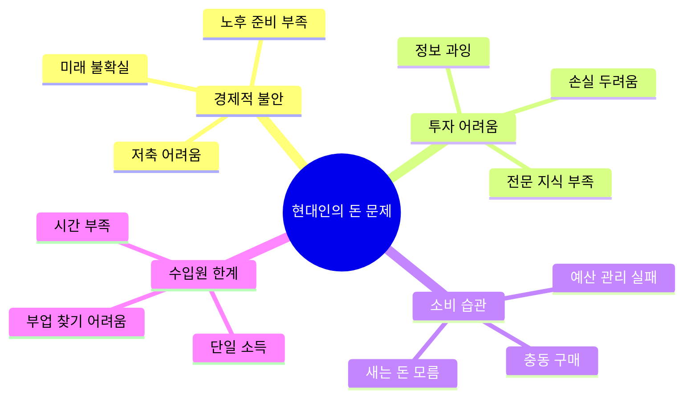
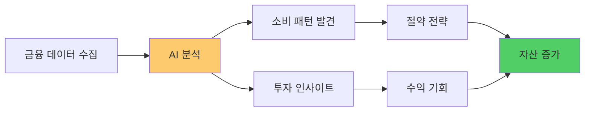
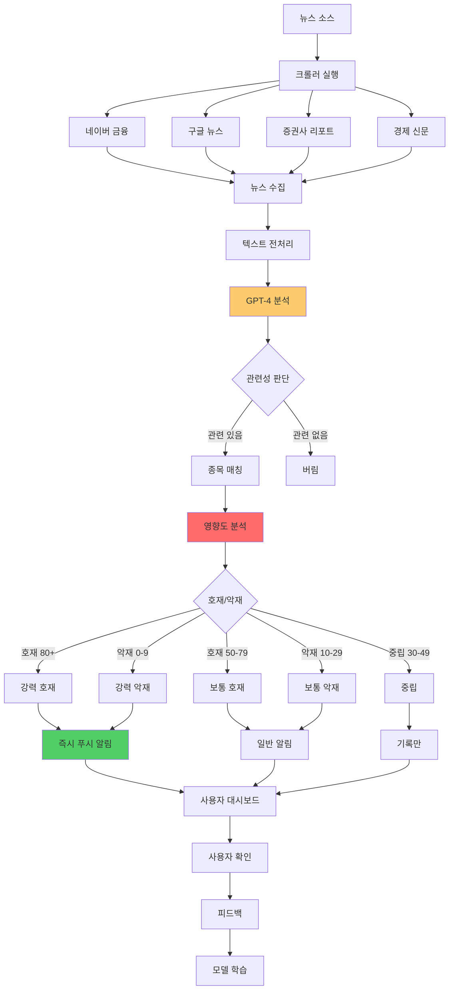
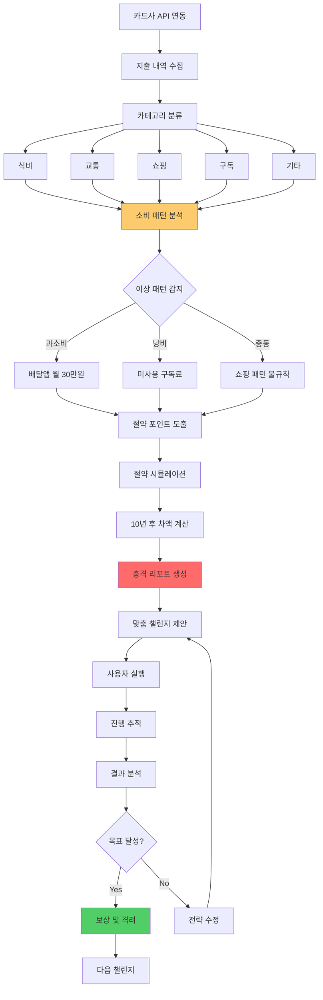
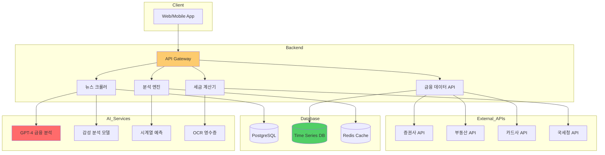
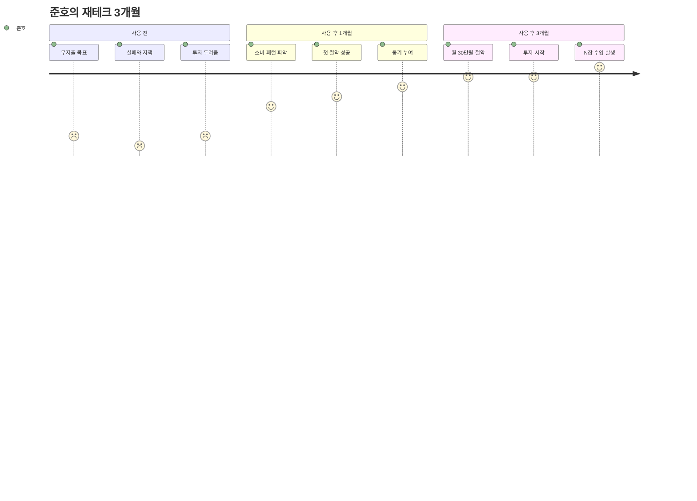

# 돈 AI: 똑똑한 재테크 비서 💰📈

> **핵심 가치:** 경제적 불안 해소 + 실질적 부의 축적

---

## 📋 목차

1. [프로젝트 개요](#프로젝트-개요)
2. [5가지 소주제](#5가지-소주제)
3. [전체 시스템 아키텍처](#전체-시스템-아키텍처)
4. [유저 시나리오](#유저-시나리오)
5. [UI/UX 상세 설계](#uiux-상세-설계)
6. [기술 구현 가이드](#기술-구현-가이드)

---

## 프로젝트 개요

### 🎯 해결하려는 문제



### 💡 솔루션 방향



---

## 5가지 소주제

### 1️⃣ AI 주식 뉴스 필터링

#### 개념
실시간 경제 뉴스 중 내 관심 종목 관련만 즉각 알림 + 호재/악재 영향도 분석

#### 핵심 기능
- 📰 **뉴스 크롤링** - 네이버, 구글 뉴스 실시간 수집
- 🎯 **관련성 필터** - 내 종목과 연관도 분석
- 📊 **영향도 예측** - 호재/악재 점수 (0-100)
- ⚡ **즉시 알림** - 중요 뉴스 푸시
- 📈 **트렌드 분석** - 시장 감성 지수

#### 시스템 플로우



#### UI/UX 설계

**메인 대시보드**
```
┌─────────────────────────────────┐
│  📈 주식 AI 비서                 │
│  실시간 뉴스 모니터링 중         │
├─────────────────────────────────┤
│  📌 내 관심 종목 (5개)           │
│  삼성전자, 카카오, NAVER,        │
│  SK하이닉스, 현대차              │
│                                 │
│  ⚡ 긴급 뉴스 (3)                │
│                                 │
│  🔴 삼성전자                     │
│  2분 전 • 호재 90점              │
│  "3나노 공정 수율 90% 돌파"      │
│  AI 분석: 주가 +3~5% 예상        │
│  [자세히]                        │
│                                 │
│  🟢 카카오                       │
│  15분 전 • 호재 75점             │
│  "카카오뱅크 분기 최대 실적"     │
│  AI 분석: 단기 상승 가능성       │
│  [자세히]                        │
│                                 │
│  🟡 현대차                       │
│  32분 전 • 중립 45점             │
│  "11월 내수 판매 소폭 증가"      │
│  [자세히]                        │
│                                 │
├─────────────────────────────────┤
│  📊 오늘의 시장 감성             │
│  ████████░░  78% (긍정)         │
│                                 │
│  주요 키워드:                    │
│  #반도체 #AI #실적개선           │
│                                 │
│  [전체 뉴스 보기]                │
└─────────────────────────────────┘
```

**상세 뉴스 분석**
```
┌─────────────────────────────────┐
│  📰 뉴스 상세 분석               │
├─────────────────────────────────┤
│  삼성전자 (005930)               │
│  현재가: 72,500원 (+2.3%)        │
│                                 │
│  🔥 긴급 뉴스                    │
│  2분 전 • 연합뉴스               │
│                                 │
│  "삼성전자, 3나노 공정 수율      │
│   90% 돌파... 업계 최초"         │
│                                 │
│  ━━━━━━━━━━━━━━━━━━━━━         │
│                                 │
│  🤖 AI 분석                      │
│                                 │
│  호재 지수: ████████░░  90/100  │
│                                 │
│  핵심 포인트:                    │
│  ✅ 3나노 수율 90%는 업계 최고   │
│  ✅ 경쟁사(TSMC) 대비 우위       │
│  ✅ 수익성 개선 기대             │
│                                 │
│  예상 영향:                      │
│  📈 단기 주가: +3~5% 상승 예상   │
│  📈 중기 전망: 긍정적            │
│  💰 목표가: 78,000원 (분석사)    │
│                                 │
│  ⚠️ 주의사항:                    │
│  • 단기 급등 시 차익 실현 가능   │
│  • 실적 발표까지 지켜봐야 함     │
│                                 │
│  🗣️ 시장 반응 (SNS 분석)        │
│  긍정 72% | 중립 20% | 부정 8%   │
│                                 │
│  💬 "3나노 드디어!"              │
│  💬 "이번엔 진짜인가?"           │
│  💬 "실적 기대"                  │
│                                 │
│  [원문 보기] [알림 끄기]         │
└─────────────────────────────────┘
```

---

### 2️⃣ 소비 습관 AI 진단 + 재설계

#### 개념
카드 내역을 분석하여 "새는 돈" 자동 발굴 및 맞춤형 절약 전략

#### 핵심 기능
- 💳 **카드 연동** - 자동 내역 수집
- 🔍 **패턴 분석** - 소비 습관 발견
- 💸 **새는 돈 발견** - 불필요한 지출
- 📊 **절약 시뮬레이션** - "10년 후 xxxx만원"
- 🎯 **챌린지 생성** - 맞춤형 절약 미션

#### 시스템 플로우



#### UI/UX 설계

**소비 분석 리포트**
```
┌─────────────────────────────────┐
│  💰 이번 달 소비 분석            │
│  2025년 11월 (26일까지)          │
├─────────────────────────────────┤
│  총 지출: 2,450,000원            │
│  예산 대비: +15% 초과 ⚠️         │
│                                 │
│  카테고리별:                     │
│                                 │
│  🍔 식비        ████████ 850k    │
│  🚗 교통        ███ 300k         │
│  🛍️ 쇼핑        ██████ 600k      │
│  💳 구독        ██ 180k          │
│  🏠 고정비      ████ 400k        │
│  ✨ 기타        █ 120k           │
│                                 │
├─────────────────────────────────┤
│  ⚠️ AI가 발견한 문제점           │
│                                 │
│  1️⃣ 배달앱 과다 사용             │
│     • 21회, 324,000원            │
│     • 전월 대비 +40%             │
│     • 1회 평균 15,400원          │
│                                 │
│  💡 절약 가능액: 월 15만원       │
│  방법: 주 3회로 줄이기           │
│                                 │
│  2️⃣ 안 쓰는 구독료               │
│     • 넷플릭스 (최근 30일 미접속)│
│     • FLO 음악 (월 9,900원)      │
│     • 클래스101 (수강 안함)      │
│                                 │
│  💡 절약 가능액: 월 3만원        │
│                                 │
│  3️⃣ 충동 쇼핑                   │
│     • 새벽 시간 구매 5회         │
│     • 평균 단가 12만원           │
│     • 대부분 패션/뷰티            │
│                                 │
│  💡 절약 가능액: 월 20만원       │
│                                 │
│  [상세 분석 보기]                │
└─────────────────────────────────┘
```

**충격의 10년 시뮬레이션**
```
┌─────────────────────────────────┐
│  😱 충격! 10년 후 차이           │
├─────────────────────────────────┤
│  지금 습관 vs 절약 실천          │
│                                 │
│  📉 현재 패턴 유지 시             │
│                                 │
│  월 38만원 새는 돈               │
│  × 12개월                        │
│  × 10년                          │
│  = 4,560만원 손실! 💸            │
│                                 │
│  이 돈이면...                    │
│  • 중형차 1대 구매 가능          │
│  • 전세 보증금 일부              │
│  • 해외여행 10회                 │
│                                 │
│  ━━━━━━━━━━━━━━━━━━━━━         │
│                                 │
│  📈 절약 실천 시                 │
│                                 │
│  월 38만원 투자 (연 7%)          │
│  10년 후: 6,580만원! 💰          │
│                                 │
│  차이: 1억 1,140만원             │
│                                 │
│  ━━━━━━━━━━━━━━━━━━━━━         │
│                                 │
│  🎯 AI 추천 액션                 │
│                                 │
│  1단계 (쉬움) - 월 8만원 절약    │
│  • 구독 정리하기                 │
│  • 미사용 서비스 해지            │
│                                 │
│  2단계 (보통) - 월 15만원 절약   │
│  • 배달 주 2회로 줄이기          │
│  • 직접 요리 늘리기              │
│                                 │
│  3단계 (도전) - 월 38만원 절약   │
│  • 충동 구매 방지                │
│  • 24시간 고민 후 구매           │
│                                 │
│  [1단계부터 시작하기]            │
└─────────────────────────────────┘
```

---

### 3️⃣ 부동산 AI 분석 플랫폼

#### 개념
관심 지역의 실거래가 + 개발 계획 + 뉴스를 통합 분석하여 투자 가치 예측

#### 핵심 기능
- 🏠 **실거래가 분석** - 국토부 데이터 활용
- 🏗️ **개발 계획 추적** - 재개발, 지하철 등
- 📰 **지역 뉴스 모니터링** - 호재/악재 발견
- 📊 **시세 예측** - 5년 후 예상 가격
- 💡 **투자 타이밍** - 매수/대기 추천

---

### 4️⃣ N잡러를 위한 수입원 다각화 AI

#### 개념
내 스킬셋 분석 후 가능한 사이드 프로젝트 추천 및 수익성 예측

#### 핵심 기능
- 🎯 **스킬 분석** - 이력서/경력 기반
- 💼 **수입원 추천** - 크몽, 클래스101, 유튜브
- 📊 **수익성 예측** - 월 예상 수입
- 📚 **로드맵 제공** - 단계별 실행 계획
- 💪 **성공 사례** - 비슷한 케이스

#### UI/UX 설계

**스킬 분석**
```
┌─────────────────────────────────┐
│  💼 N잡 가능성 분석              │
├─────────────────────────────────┤
│  당신의 스킬:                    │
│                                 │
│  💻 개발                         │
│  • React (중급)                  │
│  • Python (초급)                 │
│  • 3년 경력                      │
│                                 │
│  🎨 디자인                       │
│  • Figma (초급)                  │
│  • 취미 수준                     │
│                                 │
│  ✍️ 기타                         │
│  • 글쓰기 좋아함                 │
│  • 블로그 운영 경험              │
│                                 │
├─────────────────────────────────┤
│  🎯 AI 추천 N잡 (5개)            │
│                                 │
│  1️⃣ 프론트엔드 프리랜서           │
│     플랫폼: 크몽, 프리모아        │
│     예상 수익: 월 50-150만원     │
│     난이도: ⭐⭐⭐               │
│     시작 소요: 2주               │
│                                 │
│     💡 시작 방법:                │
│     • 포트폴리오 3개 준비        │
│     • 크몽 전문가 등록           │
│     • 저가 수주로 리뷰 쌓기      │
│                                 │
│     [상세 로드맵 보기]           │
│                                 │
│  2️⃣ 코딩 강의 (클래스101)        │
│     예상 수익: 월 30-100만원     │
│     난이도: ⭐⭐⭐⭐             │
│     시작 소요: 2개월             │
│                                 │
│     [상세 로드맵 보기]           │
│                                 │
│  3️⃣ 기술 블로그 수익화           │
│     예상 수익: 월 10-30만원      │
│     난이도: ⭐⭐                 │
│     시작 소요: 1개월             │
│                                 │
│     [상세 로드맵 보기]           │
│                                 │
└─────────────────────────────────┘
```

**상세 로드맵**
```
┌─────────────────────────────────┐
│  📚 프론트엔드 프리랜서 로드맵    │
│  목표: 월 50만원 벌기            │
├─────────────────────────────────┤
│  ✅ 1단계: 준비 (2주)            │
│                                 │
│  [ ] 포트폴리오 사이트 제작      │
│      • GitHub Pages 활용         │
│      • 프로젝트 3개 전시         │
│      • 예상 시간: 20시간         │
│                                 │
│  [ ] 크몽 전문가 등록            │
│      • 프로필 사진 전문적으로    │
│      • 소개글 작성 (예시 제공)   │
│      • 예상 시간: 3시간          │
│                                 │
│  [ ] 첫 서비스 3개 등록          │
│      • "랜딩페이지 제작" 5만원   │
│      • "React 컴포넌트" 3만원    │
│      • "웹사이트 수정" 2만원     │
│                                 │
│  ━━━━━━━━━━━━━━━━━━━━━         │
│                                 │
│  🔒 2단계: 첫 수주 (1개월)       │
│                                 │
│  • 저가 수주로 리뷰 쌓기         │
│  • 목표: 리뷰 10개               │
│  • 예상 수익: 30만원             │
│                                 │
│  🔒 3단계: 단가 올리기 (2개월)   │
│                                 │
│  • 리뷰 기반 가격 상승           │
│  • 목표: 리뷰 30개               │
│  • 예상 수익: 80만원             │
│                                 │
│  🔒 4단계: 안정화 (지속)         │
│                                 │
│  • 단골 고객 확보                │
│  • 예상 수익: 월 50-150만원      │
│                                 │
│  ━━━━━━━━━━━━━━━━━━━━━         │
│                                 │
│  💪 성공 사례                    │
│                                 │
│  "김○○님 (개발 3년차)            │
│   3개월 만에 월 120만원 달성!    │
│   비결: 빠른 응대 + 퀄리티"      │
│                                 │
│  [시작하기] [다른 N잡 보기]      │
└─────────────────────────────────┘
```

---

### 5️⃣ AI 세금 최적화 비서

#### 개념
프리랜서/N잡러를 위한 3.3% 절세 전략 + 연말정산 자동 시뮬레이션

#### 핵심 기능
- 📝 **경비 처리 가이드** - 인정되는 경비 목록
- 💳 **영수증 자동 분류** - OCR + AI 판단
- 📊 **절세 시뮬레이션** - 예상 세금 계산
- ⚠️ **실시간 알림** - "이 지출은 경비 처리 가능"
- 📄 **신고 서류 자동 생성** - 종합소득세

#### UI/UX 설계

**경비 처리 가이드**
```
┌─────────────────────────────────┐
│  📝 절세 비서                    │
│  프리랜서/N잡러 전용             │
├─────────────────────────────────┤
│  💡 이번 달 절세 현황            │
│                                 │
│  총 수입: 3,500,000원            │
│  경비 처리: 850,000원 (24%)      │
│  예상 절세: 280,500원            │
│                                 │
│  ━━━━━━━━━━━━━━━━━━━━━         │
│                                 │
│  📸 영수증 스캔 (15건)           │
│                                 │
│  ✅ 인정됨 (12건)                │
│                                 │
│  • 업무용 노트북  1,200,000원    │
│  • 카페 작업     45,000원        │
│  • 인터넷 요금   33,000원        │
│  • 책 구매       52,000원        │
│  ...                            │
│                                 │
│  ⚠️ 불인정 (3건)                 │
│                                 │
│  • 개인 의류     120,000원       │
│    → 업무 관련성 부족            │
│                                 │
│  • 친구 식사     85,000원        │
│    → 사업 목적 불명확            │
│                                 │
│  🤔 판단 보류 (1건)              │
│                                 │
│  • 아이패드      950,000원       │
│    → 업무용이라면 인정 가능      │
│    → 사용 용도 입력 필요         │
│                                 │
│  [용도 입력하기]                 │
│                                 │
│  ━━━━━━━━━━━━━━━━━━━━━         │
│                                 │
│  💰 놓친 절세 기회               │
│                                 │
│  "이번 달 교육비 0원이에요.      │
│   온라인 강의도 경비 처리        │
│   가능합니다! (최대 월 50만원)"  │
│                                 │
│  [추천 강의 보기]                │
│                                 │
└─────────────────────────────────┘
```

---

## 전체 시스템 아키텍처



---

## 기술 구현 가이드

### 뉴스 크롤링 및 분석

```python
# backend/services/stock_news_service.py
import requests
from bs4 import BeautifulSoup
from typing import List, Dict
import openai
from datetime import datetime

class StockNewsAnalyzer:
    """주식 뉴스 분석 서비스"""
    
    def __init__(self):
        self.openai_client = openai.OpenAI()
        self.watched_stocks = []
    
    def crawl_naver_finance(self, stock_code: str) -> List[Dict]:
        """
        네이버 금융 뉴스 크롤링
        
        Args:
            stock_code: 종목 코드 (예: '005930')
            
        Returns:
            뉴스 리스트
        """
        url = f"https://finance.naver.com/item/news.naver?code={stock_code}"
        response = requests.get(url, headers={
            'User-Agent': 'Mozilla/5.0'
        })
        
        soup = BeautifulSoup(response.text, 'html.parser')
        news_list = []
        
        for item in soup.select('.newsList .articleSubject'):
            news = {
                'title': item.text.strip(),
                'url': 'https://finance.naver.com' + item['href'],
                'timestamp': datetime.now(),
                'source': 'naver_finance'
            }
            news_list.append(news)
        
        return news_list
    
    def analyze_news_impact(self, news_title: str, news_content: str) -> Dict:
        """
        뉴스의 주가 영향도 분석
        
        Returns:
            {
                'impact_score': 0-100,
                'sentiment': 'positive/neutral/negative',
                'key_points': [...],
                'prediction': '...'
            }
        """
        prompt = f"""
다음 뉴스가 주가에 미치는 영향을 분석해주세요:

제목: {news_title}
내용: {news_content}

다음 형식으로 JSON 응답:
{{
    "impact_score": 0-100 (높을수록 강한 영향),
    "sentiment": "positive/neutral/negative",
    "key_points": ["포인트1", "포인트2", ...],
    "short_term_prediction": "단기 주가 예상 (1-2일)",
    "reason": "분석 근거"
}}
"""
        
        response = self.openai_client.chat.completions.create(
            model="gpt-4",
            messages=[
                {"role": "system", "content": "당신은 20년 경력의 증권 애널리스트입니다."},
                {"role": "user", "content": prompt}
            ],
            response_format={"type": "json_object"}
        )
        
        result = json.loads(response.choices[0].message.content)
        return result
    
    def should_notify_user(self, impact_score: int, sentiment: str) -> bool:
        """
        사용자에게 알림을 보낼지 판단
        
        Args:
            impact_score: 영향도 점수
            sentiment: 감성 (positive/negative)
            
        Returns:
            알림 여부
        """
        # 긴급 알림: 영향도 80 이상
        if impact_score >= 80:
            return True
        
        # 일반 알림: 영향도 50 이상
        if impact_score >= 50:
            return True
        
        return False
    
    def monitor_stocks(self, stock_codes: List[str]):
        """
        종목 실시간 모니터링
        """
        while True:
            for stock_code in stock_codes:
                news_list = self.crawl_naver_finance(stock_code)
                
                for news in news_list:
                    # 이미 처리한 뉴스인지 확인
                    if self._is_processed(news['url']):
                        continue
                    
                    # 뉴스 분석
                    analysis = self.analyze_news_impact(
                        news['title'], 
                        self._get_news_content(news['url'])
                    )
                    
                    # 알림 필요 여부 확인
                    if self.should_notify_user(
                        analysis['impact_score'], 
                        analysis['sentiment']
                    ):
                        self._send_notification(stock_code, news, analysis)
                    
                    # 처리 완료 표시
                    self._mark_as_processed(news['url'])
            
            # 5분마다 체크
            time.sleep(300)
```

### 소비 패턴 분석

```python
# backend/services/spending_analyzer.py
from typing import List, Dict
import pandas as pd
from datetime import datetime, timedelta

class SpendingAnalyzer:
    """소비 패턴 분석기"""
    
    def __init__(self):
        self.categories = {
            '식비': ['배달', '식당', '카페', '편의점'],
            '교통': ['택시', '버스', '지하철', '주유'],
            '쇼핑': ['쇼핑몰', '패션', '뷰티'],
            '구독': ['넷플릭스', '멜론', '구독'],
        }
    
    def analyze_monthly_spending(self, transactions: List[Dict]) -> Dict:
        """
        월간 소비 분석
        
        Args:
            transactions: 거래 내역 리스트
            
        Returns:
            분석 결과
        """
        df = pd.DataFrame(transactions)
        df['date'] = pd.to_datetime(df['date'])
        
        # 카테고리별 집계
        category_spending = {}
        for category, keywords in self.categories.items():
            mask = df['description'].str.contains('|'.join(keywords), case=False)
            category_spending[category] = df[mask]['amount'].sum()
        
        # 문제점 발견
        issues = self._find_issues(df)
        
        # 절약 가능액 계산
        savings_potential = self._calculate_savings(issues)
        
        return {
            'total_spending': df['amount'].sum(),
            'by_category': category_spending,
            'issues': issues,
            'savings_potential': savings_potential
        }
    
    def _find_issues(self, df: pd.DataFrame) -> List[Dict]:
        """소비 문제점 발견"""
        issues = []
        
        # 1. 배달앱 과다 사용
        delivery_mask = df['description'].str.contains('배달|배민|쿠팡이츠', case=False)
        delivery_spending = df[delivery_mask]['amount'].sum()
        delivery_count = delivery_mask.sum()
        
        if delivery_count > 15:  # 월 15회 이상
            issues.append({
                'type': '배달앱 과다',
                'detail': f'{delivery_count}회, {delivery_spending:,}원',
                'savings': int(delivery_spending * 0.5),  # 50% 절약 가능
                'suggestion': '주 3회로 줄이기'
            })
        
        # 2. 미사용 구독료
        # (실제로는 사용 로그와 대조 필요)
        subscription_mask = df['description'].str.contains('구독|정기결제', case=False)
        subscriptions = df[subscription_mask]
        
        if len(subscriptions) > 0:
            issues.append({
                'type': '미사용 구독',
                'detail': f'{len(subscriptions)}개 서비스',
                'savings': subscriptions['amount'].sum() // 2,
                'suggestion': '사용하지 않는 구독 해지'
            })
        
        # 3. 충동 구매 (새벽 시간 구매)
        df['hour'] = df['date'].dt.hour
        late_night_purchases = df[(df['hour'] >= 0) & (df['hour'] <= 6)]
        
        if len(late_night_purchases) > 3:
            issues.append({
                'type': '충동 구매',
                'detail': f'새벽 구매 {len(late_night_purchases)}회',
                'savings': late_night_purchases['amount'].sum(),
                'suggestion': '24시간 고민 후 구매 규칙'
            })
        
        return issues
    
    def simulate_10year_impact(self, monthly_savings: int) -> Dict:
        """
        10년 절약 시뮬레이션
        
        Args:
            monthly_savings: 월 절약액
            
        Returns:
            시뮬레이션 결과
        """
        # 단순 저축
        simple_savings = monthly_savings * 12 * 10
        
        # 투자 (연 7% 복리)
        annual_return = 0.07
        investment_value = 0
        
        for year in range(10):
            annual_invest = monthly_savings * 12
            investment_value = (investment_value + annual_invest) * (1 + annual_return)
        
        return {
            'simple_savings': simple_savings,
            'investment_value': int(investment_value),
            'difference': int(investment_value - simple_savings),
            'what_you_can_buy': self._suggest_purchases(int(investment_value))
        }
    
    def _suggest_purchases(self, amount: int) -> List[str]:
        """이 돈으로 살 수 있는 것들"""
        suggestions = []
        
        if amount >= 50000000:
            suggestions.append('중형차 1대')
        if amount >= 30000000:
            suggestions.append('전세 보증금 일부')
        if amount >= 10000000:
            suggestions.append('해외여행 10회')
        
        return suggestions
```

---

## 유저 시나리오

### 시나리오: 프리랜서 준호의 재테크 여정



---

## 📊 성과 측정

### KPI

| 지표 | 목표 | 측정 |
|------|------|------|
| 월 절약액 | +20% | 사용 전후 비교 |
| 투자 시작률 | 40% | 투자 계좌 개설 |
| N잡 수입 | 평균 50만원 | 3개월 추적 |
| 앱 만족도 | 4.5/5 | 리뷰 평균 |

---

## ⚠️ 법적 고려사항

```
⚠️ 주의: 이 AI는 투자 조언이 아닙니다

• 모든 투자 결정은 사용자 책임
• 과거 데이터는 미래 보장 안 함
• 세금 관련은 세무사 자문 권장
• 개인정보 보호법 철저히 준수
```

---

**마지막 업데이트:** 2025-11-26  
**이전 문서:** [성찰AI_상세가이드.md](./성찰AI_상세가이드.md)  
**통합 가이드:** [AI교육_5대주제_통합가이드.md](./AI교육_5대주제_통합가이드.md)

