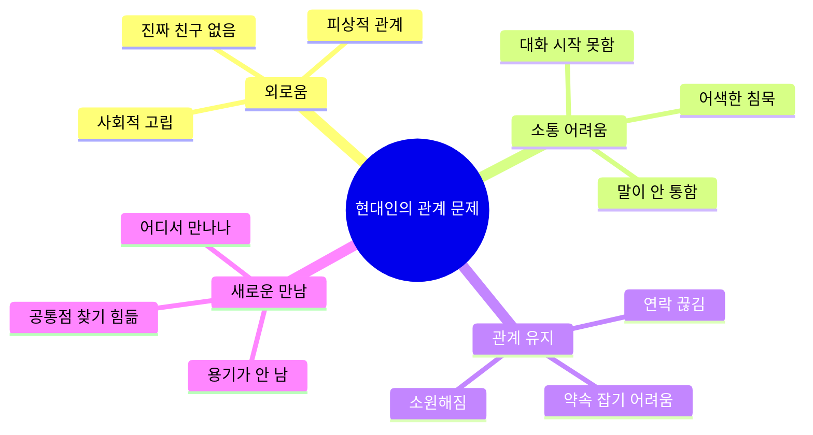
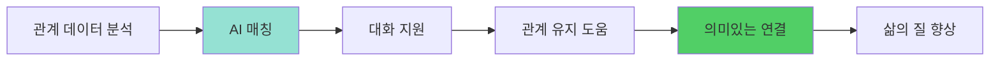
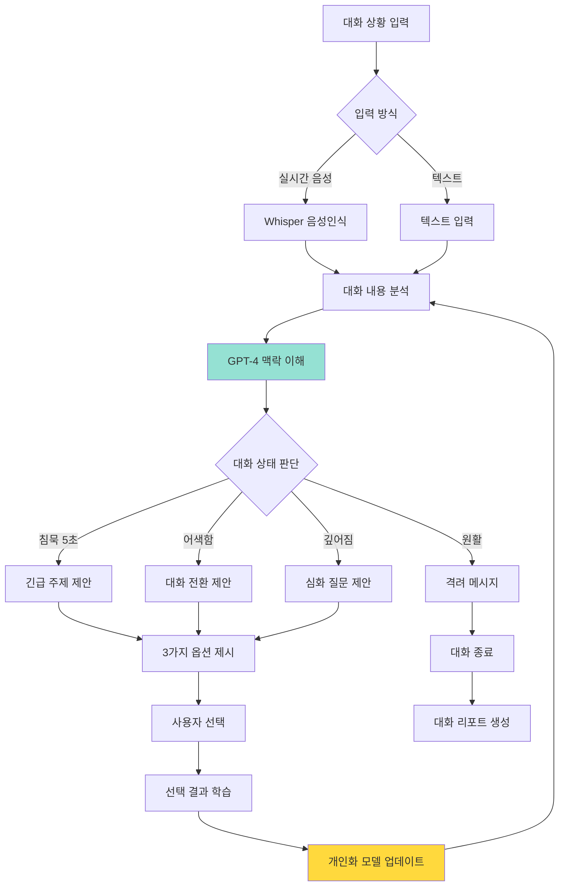
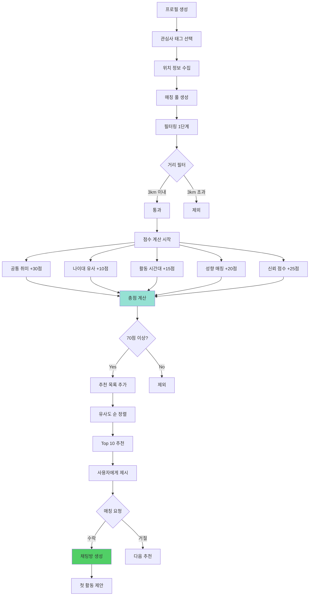
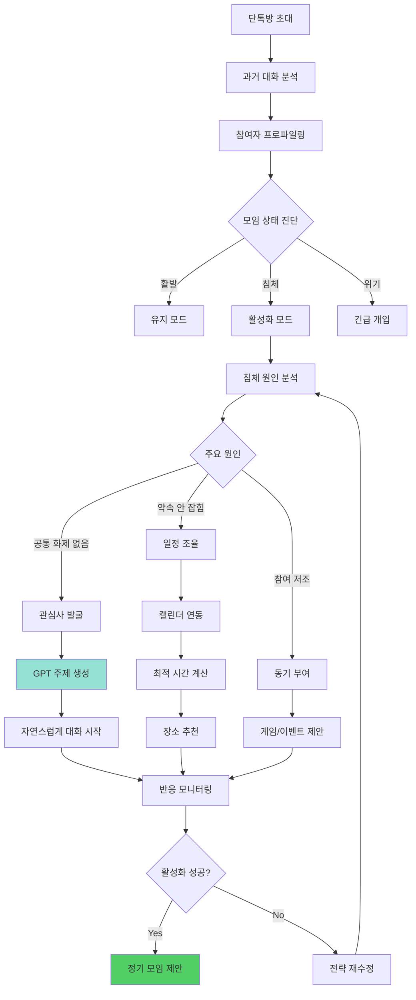
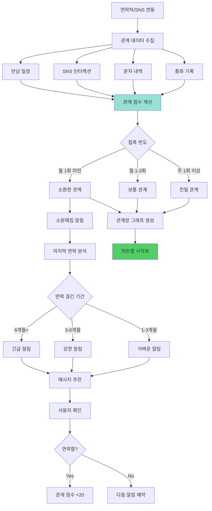
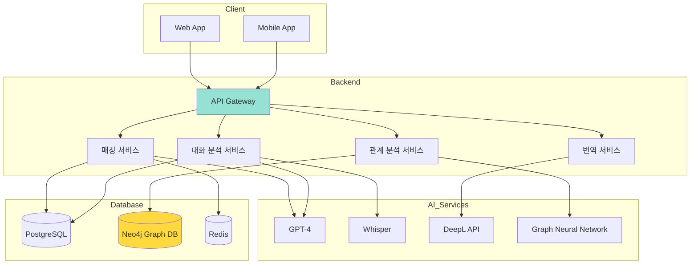

# 만남 AI: 연결과 소통의 기술 🤝💬

> **핵심 가치:** 진짜 연결의 어려움 해결 (알고리즘 사회에서의 인간관계)

---

## 📋 목차

1. [프로젝트 개요](#프로젝트-개요)
2. [5가지 소주제](#5가지-소주제)
3. [전체 시스템 아키텍처](#전체-시스템-아키텍처)
4. [유저 시나리오](#유저-시나리오)
5. [UI/UX 상세 설계](#uiux-상세-설계)
6. [기술 구현 가이드](#기술-구현-가이드)

---

## 프로젝트 개요

### 🎯 해결하려는 문제



### 💡 솔루션 방향



---

## 5가지 소주제

### 1️⃣ AI 대화 코치: 어색함 제로 프로젝트

#### 개념
실시간 대화 중 AI가 조언을 주고, 어색한 순간을 돕는 시스템

#### 핵심 기능
- 💬 **실시간 대화 분석** - 대화 맥락 이해
- 💡 **주제 추천** - 이어질 대화 소재 제안
- 🎯 **질문 생성** - 상황에 맞는 질문 추천
- 📊 **대화 패턴 분석** - 내 대화 습관 피드백
- 🎓 **연습 모드** - AI와 대화 시뮬레이션

#### 시스템 플로우



#### UI/UX 설계

**이어폰 진동 알림 UI (실시간 모드)**
```
┌─────────────────────────────────┐
│  🎧 대화 코치 활성화 중          │
│  [진동 알림 ON]                  │
├─────────────────────────────────┤
│  현재 대화 분석:                 │
│                                 │
│  😊 분위기: 좋음                 │
│  🗣️ 발화: 나 40% / 상대 60%     │
│  ⏱️ 대화 시간: 12분              │
│                                 │
│  💡 AI 제안 (진동 1회)           │
│                                 │
│  "상대방이 영화 이야기를          │
│   꺼냈어요. 이렇게 물어보세요:"  │
│                                 │
│  ┌──────────────────────┐      │
│  │ "요즘 어떤 영화 봤어?"│      │
│  └──────────────────────┘      │
│                                 │
│  [사용함] [다른 제안]            │
│                                 │
│  ⚠️ 5초간 침묵 감지 (진동 2회)   │
│  긴급 주제 3개 준비됨            │
└─────────────────────────────────┘
```

**대화 연습 모드**
```
┌─────────────────────────────────┐
│  🎓 대화 연습: 첫 만남           │
│  AI 역할: 새로운 친구            │
├─────────────────────────────────┤
│  🤖 AI:                          │
│  "안녕하세요! 처음 뵙겠습니다.   │
│   저는 마케팅 일 하고 있어요."   │
│                                 │
│  ━━━━━━━━━━━━━━━━━━━━━         │
│                                 │
│  💡 AI 코치 제안:                │
│                                 │
│  🎯 좋은 질문 3가지:             │
│  1. "마케팅은 어떤 일 하세요?"   │
│  2. "일하면서 재미있는 점은?"    │
│  3. "마케팅 일 하신 지 얼마나?"  │
│                                 │
│  ❌ 피해야 할 질문:              │
│  • "돈 많이 버세요?"             │
│  • "힘들지 않아요?"              │
│                                 │
│  ┌──────────────────────┐      │
│  │ [답변 입력창]         │      │
│  └──────────────────────┘      │
│                                 │
│  [제안 사용] [직접 작성]         │
└─────────────────────────────────┘
```

**대화 후 피드백**
```
┌─────────────────────────────────┐
│  📊 대화 분석 리포트             │
│  김수진님과의 대화 (35분)        │
├─────────────────────────────────┤
│  🎯 전체 평가: B+ (좋음!)        │
│                                 │
│  ┌────────────────────────┐    │
│  │ 경청       ████████ 85%│    │
│  │ 질문 능력  ██████ 60%  │    │
│  │ 공감       ███████ 75% │    │
│  │ 자기개방   ████ 40%    │    │
│  └────────────────────────┘    │
│                                 │
├─────────────────────────────────┤
│  💪 잘한 점                      │
│  • 상대방 말을 잘 들어줌         │
│  • 적절한 타이밍에 질문          │
│  • 긍정적인 리액션               │
│                                 │
│  📈 개선 포인트                  │
│  • 자신에 대한 이야기가 부족     │
│    (상대 70% vs 나 30%)          │
│  • "음..." 12회 사용 (습관)     │
│  • 침묵 3회 (평균 8초)           │
│                                 │
│  💡 다음 대화 팁                 │
│  "상대방이 당신에 대해           │
│   궁금해할 수 있어요.            │
│   자신의 이야기도 나눠보세요!"   │
│                                 │
│  🎓 맞춤 연습 코스 추천           │
│  • 자기 소개 연습                │
│  • 침묵 채우기 스킬              │
│                                 │
│  [연습 시작하기]                 │
└─────────────────────────────────┘
```

---

### 2️⃣ 동네 친구 AI 매칭

#### 개념
취미와 관심사 기반으로 3km 이내 친구를 AI가 매칭

#### 핵심 기능
- 📍 **위치 기반 매칭** - 동네 친구 찾기
- 🎯 **취미 매칭** - 공통 관심사 우선
- ⭐ **신뢰 점수** - 리뷰 기반 안전성
- 📅 **활동 제안** - 같이 할 것 추천
- 💬 **아이스브레이킹** - 첫 대화 시작 도움

#### 매칭 알고리즘



#### UI/UX 설계

**프로필 생성**
```
┌─────────────────────────────────┐
│  👤 프로필 만들기                │
│  동네 친구를 찾아볼까요?         │
├─────────────────────────────────┤
│  📍 동네                         │
│  [위치 자동 감지]                │
│  서울 마포구 연남동              │
│  (공개 범위: 동 단위만)          │
│                                 │
│  🎯 관심사 (최대 5개)            │
│  [✓] 헬스/운동  [✓] 카페투어    │
│  [✓] 영화/드라마  [ ] 독서       │
│  [ ] 게임  [ ] 요리  [ ] 사진   │
│  [ ] 등산  [ ] 러닝  [ ] 음악   │
│                                 │
│  ⏰ 주로 활동하는 시간            │
│  [✓] 평일 저녁  [✓] 주말         │
│  [ ] 평일 낮                     │
│                                 │
│  👥 선호하는 만남                │
│  ( ) 1:1 만남                    │
│  (●) 소규모 그룹 (3-5명)         │
│  ( ) 대규모 모임                 │
│                                 │
│  💬 한 줄 소개                   │
│  ┌──────────────────────┐      │
│  │ 같이 운동하고 카페에서│      │
│  │ 수다 떨 친구 구해요!  │      │
│  └──────────────────────┘      │
│                                 │
│  [완료!]                         │
└─────────────────────────────────┘
```

**매칭 추천**
```
┌─────────────────────────────────┐
│  ✨ AI 추천 동네 친구            │
│  3명 발견!                       │
├─────────────────────────────────┤
│  🏆 최고 매칭                    │
│                                 │
│  👤 김민지 (27세, 여)            │
│  📍 연남동 (도보 8분)            │
│  매칭률: 92% ⭐⭐⭐⭐⭐          │
│                                 │
│  공통 관심사 (3개):              │
│  🏃 헬스/운동  ☕ 카페  🎬 영화  │
│                                 │
│  💬 "같이 헬스 다니고 싶어요!    │
│      주말마다 운동 후 브런치?"   │
│                                 │
│  👥 활동 이력                    │
│  • 2명과 매칭 성사 (신뢰 높음)  │
│  • 평균 리뷰: 4.8/5.0           │
│  • "친절하고 시간 잘 지켜요"     │
│                                 │
│  💡 AI 추천 첫 활동:             │
│  "주말 오전 헬스 → 연남동 브런치"│
│                                 │
│  [매칭 신청하기] [더 보기]       │
│                                 │
├─────────────────────────────────┤
│  📋 다른 추천                    │
│                                 │
│  2️⃣ 박준호 (85% 매칭)           │
│     공통: 카페, 영화             │
│                                 │
│  3️⃣ 이수현 (78% 매칭)           │
│     공통: 운동, 영화             │
│                                 │
└─────────────────────────────────┘
```

**매칭 성사 후**
```
┌─────────────────────────────────┐
│  🎉 매칭 성사!                   │
│  김민지님과 연결되었어요         │
├─────────────────────────────────┤
│  💬 AI가 대화 시작을 도와드릴게요│
│                                 │
│  추천 첫 메시지 3가지:           │
│                                 │
│  1️⃣ "안녕하세요! 저도 헬스      │
│     다니는데, 보통 언제          │
│     운동하세요?"                 │
│                                 │
│  2️⃣ "반가워요! 연남동에 사시면  │
│     혹시 '○○카페' 가봤어요?     │
│     거기 맛있더라고요"           │
│                                 │
│  3️⃣ "매칭 감사해요~ 주말에      │
│     시간 되시면 한번             │
│     만나볼까요?"                 │
│                                 │
│  [이 메시지 보내기]              │
│  [직접 작성하기]                 │
│                                 │
├─────────────────────────────────┤
│  🎯 첫 만남 추천 장소            │
│                                 │
│  • 연남동 '○○카페' (중간 지점)  │
│  • 낮 2시, 카페에서 1시간        │
│  • 공공장소라 안전해요           │
│                                 │
│  💡 첫 만남 팁:                  │
│  • 밝은 시간대 선택하기          │
│  • 공공장소에서 만나기           │
│  • 1시간 정도가 적당해요         │
│                                 │
└─────────────────────────────────┘
```

---

### 3️⃣ 모임 활성화 AI 봇

#### 개념
죽어가는 단톡방을 살리는 AI - 공통 관심사 발굴 + 일정 조율

#### 핵심 기능
- 📊 **대화 분석** - 침체 원인 파악
- 💡 **주제 제안** - 공통 관심사 찾기
- 📅 **일정 자동 조율** - 모두 가능한 시간
- 🎲 **활동 제안** - 모임 아이디어
- 🤖 **봇 참여** - 자연스러운 대화 활성화

#### 시스템 플로우



#### UI/UX 설계

**봇 초대 화면**
```
┌─────────────────────────────────┐
│  🤖 모임 활성화 봇               │
│  죽어가는 단톡방을 살려드려요!   │
├─────────────────────────────────┤
│  어떤 모임인가요?                │
│                                 │
│  ( ) 대학 동기                   │
│  ( ) 직장 동료                   │
│  (●) 취미 모임 (헬스)            │
│  ( ) 동네 친구들                 │
│  ( ) 기타                        │
│                                 │
│  현재 상황은?                    │
│                                 │
│  [✓] 대화가 거의 없음            │
│  [✓] 약속 잡기 어려움            │
│  [ ] 특정 멤버만 대화함          │
│  [ ] 주제가 없음                 │
│                                 │
│  💡 AI가 할 일:                  │
│  ✓ 과거 대화 분석 (동의 필요)    │
│  ✓ 공통 관심사 발견              │
│  ✓ 자연스럽게 대화 시작          │
│  ✓ 모임 일정 자동 조율           │
│                                 │
│  [톡방에 초대하기]               │
└─────────────────────────────────┘
```

**봇 분석 리포트 (관리자만)**
```
┌─────────────────────────────────┐
│  📊 '헬스 메이트' 모임 분석      │
│  멤버 5명 / 활동 기간 3개월      │
├─────────────────────────────────┤
│  ⚠️ 모임 건강도: 35% (위험)      │
│                                 │
│  문제점:                         │
│  • 최근 7일간 대화 2건뿐         │
│  • 마지막 만남: 23일 전          │
│  • 참여율: 김민지(80%), 기타(20%)│
│                                 │
│  발견한 공통 관심사:             │
│  🏃 헬스 (전원)                  │
│  ☕ 카페 (4명)                   │
│  🍔 맛집 (3명)                   │
│  📺 넷플릭스 (3명)               │
│                                 │
│  💡 AI 제안 전략:                │
│                                 │
│  1️⃣ 즉시: 가벼운 주제로 대화 시작│
│     "요즘 헬스장 사람 많죠?"     │
│                                 │
│  2️⃣ 오늘: 넷플릭스 화제         │
│     "흑백요리사 보신 분?"        │
│                                 │
│  3️⃣ 내일: 모임 제안             │
│     "다음 주 주말 운동 후 브런치?"│
│                                 │
│  [전략 승인] [수정하기]          │
└─────────────────────────────────┘
```

**봇의 실제 대화 (자연스러운 개입)**
```
┌─────────────────────────────────┐
│  💬 헬스 메이트 (5)              │
├─────────────────────────────────┤
│  [3일간 대화 없음]               │
│                                 │
│  🤖 AI봇                         │
│  헐 요즘 헬스장 진짜 사람 많지   │
│  않아요? 오늘 런닝머신 30분      │
│  기다렸네요 ㅋㅋㅋ               │
│  10:23                           │
│                                 │
│  김민지                          │
│  아 ㄹㅇ ㅋㅋㅋ 저녁 시간대는    │
│  완전 헬인데요                   │
│  10:25                           │
│                                 │
│  박준호                          │
│  인정 ㅋㅋ 나도 오늘 포기하고    │
│  그냥 왔음                       │
│  10:26                           │
│                                 │
│  🤖 AI봇                         │
│  그러니까요 ㅠㅠ 그나저나 다들   │
│  혹시 흑백요리사 보셨어요?       │
│  요즘 완전 핫하던데               │
│  10:28                           │
│                                 │
│  [대화 활성화 성공! 🎉]          │
│                                 │
│  이수현                          │
│  오 저 봤어요! 진짜 재밌음       │
│  10:29                           │
│                                 │
│  🤖 AI봇                         │
│  오 대박! 저도 정주행 중 ㅋㅋ    │
│  혹시 다음주 주말에 운동하고     │
│  같이 브런치 어때요?             │
│  이번엔 흑백요리사 나온 그 집... │
│  10:31                           │
│                                 │
│  [💡 AI가 자연스럽게 모임 제안]  │
│                                 │
│  김민지                          │
│  좋아요! 저 토요일 가능!         │
│  10:32                           │
│                                 │
└─────────────────────────────────┘
```

---

### 4️⃣ 글로벌 펜팔 AI 번역 시스템

#### 개념
언어 장벽 없는 진짜 소통 - 실시간 번역 + 문화적 뉘앙스까지

#### 핵심 기능
- 🌏 **다국어 번역** - 100개 언어 지원
- 🎭 **뉘앙스 보존** - 농담, 관용구 설명
- 🗣️ **음성 대화** - 실시간 통역
- 📚 **언어 학습** - 대화하며 배우기
- 🌍 **문화 이해** - 문맥 설명

---

### 5️⃣ 관계망 히트맵 분석

#### 개념
내 인간관계를 시각화하고 소홀한 관계 알림

#### 핵심 기능
- 📊 **관계 시각화** - 네트워크 그래프
- 💔 **소원해짐 감지** - 연락 끊긴 친구
- 🔔 **리마인더** - 중요한 사람 연락 알림
- 📈 **관계 점수** - 친밀도 측정
- 💌 **메시지 추천** - 다시 연락하기

#### 시스템 플로우



#### UI/UX 설계

**관계망 히트맵**
```
┌─────────────────────────────────┐
│  👥 나의 관계망                  │
│  총 42명 / 활발 18명 / 주의 8명  │
├─────────────────────────────────┤
│                                 │
│         [관계망 그래프]          │
│                                 │
│         나                       │
│         ●                        │
│    ╱│╲                          │
│   ● ● ●  가족 (4)               │
│   친한 친구 (8)                  │
│       ●●●●●                      │
│     직장 동료 (12)               │
│       ●●●●● ●                   │
│       ●●●●●                      │
│     대학 동기 (10)               │
│                                 │
│  ● 초록: 활발 (주 1회+)          │
│  ● 노랑: 보통 (월 1-3회)         │
│  ● 빨강: 주의 (월 1회 미만)      │
│                                 │
├─────────────────────────────────┤
│  ⚠️ 주의가 필요한 관계 (8명)     │
│                                 │
│  🔴 김수진 (대학 친구)           │
│     마지막 연락: 4개월 전        │
│     [연락하기]                   │
│                                 │
│  🔴 박준호 (전 직장 동료)        │
│     마지막 연락: 5개월 전        │
│     [연락하기]                   │
│                                 │
│  🟡 이민지 (고등학교 친구)       │
│     마지막 연락: 2개월 전        │
│     [연락하기]                   │
│                                 │
│  [전체 보기]                     │
└─────────────────────────────────┘
```

**소원해짐 알림**
```
┌─────────────────────────────────┐
│  💔 소중한 관계를 놓치고 있어요   │
├─────────────────────────────────┤
│  👤 김수진님                     │
│  관계: 대학 친구 (7년)           │
│                                 │
│  ⏰ 마지막 연락: 4개월 전         │
│     2025년 7월 23일 (카톡)       │
│     "여행 잘 다녀와~!"           │
│                                 │
│  📊 관계 히스토리                │
│                                 │
│  2020-2023: 월 2-3회 연락       │
│  2024 상반기: 월 1회             │
│  2024 하반기: 연락 끊김 ⚠️       │
│                                 │
│  💡 AI 분석:                     │
│  "이전엔 자주 연락하던 소중한    │
│   친구예요. 바쁘다 보니          │
│   연락이 뜸해진 것 같아요.       │
│   지금 연락하면 좋아할 거예요!"  │
│                                 │
├─────────────────────────────────┤
│  💌 추천 메시지                  │
│                                 │
│  1️⃣ "수진아! 요즘 어떻게 지내?   │
│     바쁘다 보니 연락 못 했네.    │
│     여행 이후로 뭐 재밌는 거     │
│     있었어?"                     │
│                                 │
│  2️⃣ "수진아~ 오랜만이다!         │
│     시간 되면 밥 한번 먹자.      │
│     그동안 할 얘기 많아!"        │
│                                 │
│  3️⃣ "수진아 나야! 미안 ㅠㅠ      │
│     요즘 너무 바빴어.            │
│     조만간 만나자!"              │
│                                 │
│  [이 메시지 보내기]              │
│  [직접 작성하기]                 │
│  [나중에 알림]                   │
└─────────────────────────────────┘
```

---

## 전체 시스템 아키텍처



---

## 기술 구현 가이드

### 매칭 알고리즘 구현

```python
# backend/services/matching_service.py
from typing import List, Dict
import numpy as np
from geopy.distance import geodesic

class FriendMatchingService:
    """동네 친구 매칭 서비스"""
    
    def __init__(self):
        self.max_distance_km = 3.0
        self.min_score = 70
    
    def calculate_match_score(self, user1: Dict, user2: Dict) -> float:
        """
        두 사용자 간 매칭 점수 계산
        
        Returns:
            0-100 점수
        """
        score = 0
        
        # 1. 거리 점수 (25점 만점)
        distance = self._calculate_distance(
            user1['location'], user2['location']
        )
        if distance > self.max_distance_km:
            return 0  # 거리 초과 시 매칭 불가
        
        distance_score = (1 - distance / self.max_distance_km) * 25
        score += distance_score
        
        # 2. 공통 취미 (30점 만점)
        common_hobbies = set(user1['hobbies']) & set(user2['hobbies'])
        hobby_score = (len(common_hobbies) / len(user1['hobbies'])) * 30
        score += hobby_score
        
        # 3. 나이대 유사도 (10점 만점)
        age_diff = abs(user1['age'] - user2['age'])
        age_score = max(0, 10 - age_diff * 0.5)
        score += age_score
        
        # 4. 활동 시간대 (15점 만점)
        time_overlap = self._calculate_time_overlap(
            user1['available_times'], user2['available_times']
        )
        time_score = time_overlap * 15
        score += time_score
        
        # 5. 신뢰 점수 (20점 만점)
        trust_score = (user2['trust_rating'] / 5.0) * 20
        score += trust_score
        
        return min(100, score)
    
    def find_matches(self, user_id: int, limit: int = 10) -> List[Dict]:
        """
        사용자에게 맞는 친구 찾기
        
        Returns:
            매칭 점수 순 추천 목록
        """
        user = self._get_user(user_id)
        candidates = self._get_candidates(user)
        
        matches = []
        for candidate in candidates:
            score = self.calculate_match_score(user, candidate)
            if score >= self.min_score:
                matches.append({
                    'user': candidate,
                    'score': score,
                    'common_hobbies': list(
                        set(user['hobbies']) & set(candidate['hobbies'])
                    )
                })
        
        # 점수 순 정렬
        matches.sort(key=lambda x: x['score'], reverse=True)
        
        return matches[:limit]
```

---

## 📊 성과 측정

### KPI

| 지표 | 목표 | 측정 |
|------|------|------|
| 매칭 성공률 | 60% | 매칭 → 실제 만남 |
| 대화 지속 시간 | +40% | AI 코치 사용 전후 |
| 모임 활성화율 | 70% | 침체 → 활발 전환 |
| 관계 유지율 | +50% | 연락 빈도 증가 |

---

**마지막 업데이트:** 2025-11-26  
**다음 문서:** [성찰AI_상세가이드.md](./성찰AI_상세가이드.md)

