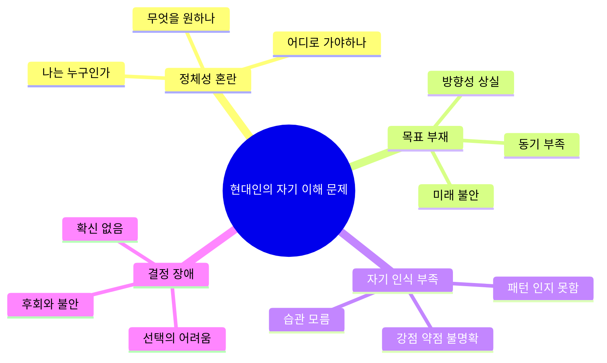
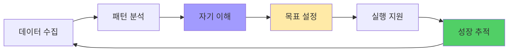
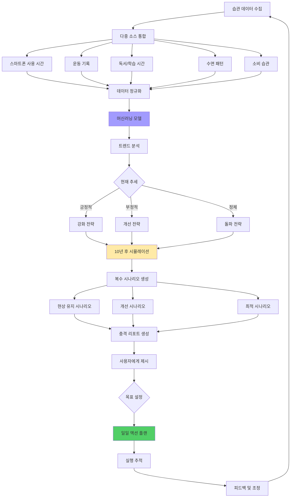
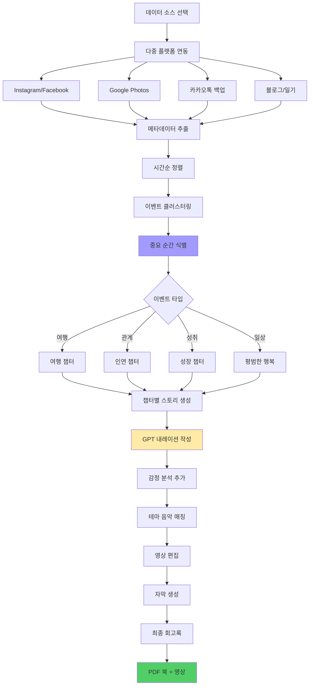
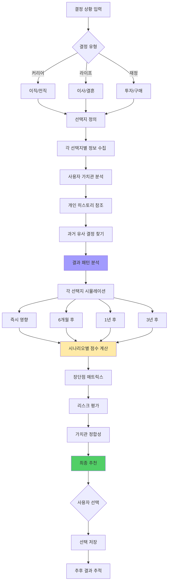
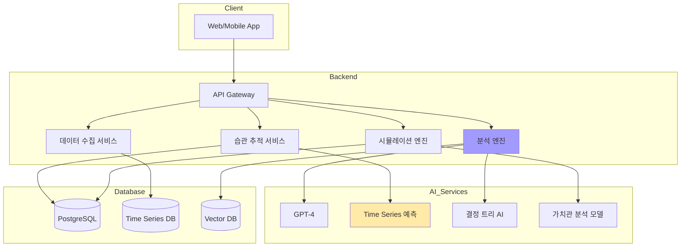

# 성찰 AI: 나를 발견하는 여정 🧭💭

> **핵심 가치:** 정체성 혼란 시대의 자기 발견과 방향성

---

## 📋 목차

1. [프로젝트 개요](#프로젝트-개요)
2. [5가지 소주제](#5가지-소주제)
3. [전체 시스템 아키텍처](#전체-시스템-아키텍처)
4. [유저 시나리오](#유저-시나리오)
5. [UI/UX 상세 설계](#uiux-상세-설계)
6. [기술 구현 가이드](#기술-구현-가이드)

---

## 프로젝트 개요

### 🎯 해결하려는 문제



### 💡 솔루션 방향



---

## 5가지 소주제

### 1️⃣ AI 라이프 코치: 10년 후 나는?

#### 개념
현재 습관 데이터로 미래를 시뮬레이션하고 원하는 미래를 위한 오늘의 액션 제안

#### 핵심 기능
- 📊 **습관 추적** - 일상 루틴 자동 기록
- 🔮 **미래 예측** - 10년 후 시뮬레이션
- 🎯 **목표 설정** - SMART 목표 생성 도움
- 📈 **진도 추적** - 목표 달성률 실시간 체크
- 💪 **동기 부여** - AI 코칭 메시지

#### 시스템 플로우



#### UI/UX 설계

**현재 습관 대시보드**
```
┌─────────────────────────────────┐
│  📊 나의 현재 모습               │
│  최근 30일 분석                  │
├─────────────────────────────────┤
│  ⏰ 시간 사용                    │
│                                 │
│  수면        ████████ 7.5h (31%)│
│  업무        ████████ 9h (38%)  │
│  유튜브      ███ 3h (12%)       │
│  자기계발    ██ 1.5h (6%)       │
│  운동        █ 0.5h (2%)        │
│  기타        ███ 2.5h (11%)     │
│                                 │
│  ━━━━━━━━━━━━━━━━━━━━━         │
│  📚 하루 평균 24시간             │
│                                 │
├─────────────────────────────────┤
│  💰 지출 패턴 (월평균)           │
│                                 │
│  고정비      ████████ 150만원   │
│  식비        ████ 60만원        │
│  쇼핑        ███ 40만원         │
│  저축        ██ 30만원          │
│  투자        ░ 0원              │
│                                 │
├─────────────────────────────────┤
│  📈 자기계발                     │
│                                 │
│  이번 달 완독: 0.5권             │
│  운동 일수: 4일 (13%)            │
│  새로운 스킬: 0개                │
│                                 │
│  ⚠️ AI 경고:                     │
│  현재 추세로는 성장이            │
│  정체되어 있어요                 │
│                                 │
│  [미래 예측 보기]                │
└─────────────────────────────────┘
```

**충격의 10년 후 시뮬레이션**
```
┌─────────────────────────────────┐
│  🔮 10년 후 당신의 모습           │
│  (2035년 11월 26일)              │
├─────────────────────────────────┤
│  ⚠️ 현상 유지 시나리오            │
│                                 │
│  💼 커리어                       │
│  • 같은 회사, 비슷한 포지션      │
│  • 연봉: +20% (물가 상승 고려 시│
│    실질 소득 거의 동일)          │
│  • 특별한 스킬 발전 없음         │
│                                 │
│  💰 자산                         │
│  • 저축: 3,600만원               │
│    (월 30만원 × 120개월)         │
│  • 투자: 0원                     │
│  • 총 자산: 3,600만원            │
│  • 집 구매: 불가능 ❌            │
│                                 │
│  🏃 건강                         │
│  • 체력: 현재 대비 -30%          │
│  • 체중: +8kg 예상               │
│  • 건강검진 주의 항목 증가       │
│                                 │
│  🧠 성장                         │
│  • 읽은 책: 60권 (년 6권)        │
│  • 새 스킬: 1-2개 (부족)         │
│  • 네트워크: 정체                │
│                                 │
│  😔 만족도 예측: 42/100          │
│                                 │
│  [이대로는 싫어요!] [다른 길 보기]│
│                                 │
├─────────────────────────────────┤
│  ✨ 최적 시나리오                │
│                                 │
│  필요한 변화:                    │
│  • 하루 2시간 자기계발           │
│  • 월 50만원 투자                │
│  • 주 3회 운동                   │
│                                 │
│  10년 후 결과:                   │
│  💼 시니어 전문가 or 창업 성공   │
│  💰 자산 2억+ (복리 효과)        │
│  🏃 건강한 40대                  │
│  😊 만족도: 85/100               │
│                                 │
│  [이 길로 가고 싶어요!]          │
└─────────────────────────────────┘
```

**오늘의 액션 플랜**
```
┌─────────────────────────────────┐
│  🎯 2035년 목표를 위한           │
│     오늘의 액션                  │
├─────────────────────────────────┤
│  10년 목표: 전문가 + 자산 2억    │
│  오늘은 D+1일                    │
│                                 │
│  ✅ 아침 (6:00-9:00)             │
│  [✓] 6:30 기상 (완료!)           │
│  [ ] 7:00 운동 30분              │
│  [ ] 7:45 독서 30분              │
│                                 │
│  ✅ 낮 (9:00-18:00)              │
│  [ ] 점심시간 온라인 강의 20분   │
│  [ ] 퇴근 전 오늘 배운 것 정리   │
│                                 │
│  ✅ 저녁 (18:00-23:00)           │
│  [ ] 저녁 식비 절약 (배달X)      │
│  [ ] 사이드 프로젝트 1시간       │
│  [ ] 23:00 취침 (수면 7.5h)     │
│                                 │
│  ━━━━━━━━━━━━━━━━━━━━━         │
│  오늘 달성률: 1/9 (11%)          │
│                                 │
│  💡 AI 코칭:                     │
│  "좋은 시작이에요! 아침 기상을   │
│   성공했으니 운동까지 해보세요.  │
│   하루를 완벽하게 시작하면       │
│   동기부여가 높아집니다!"        │
│                                 │
│  [다음 할 일 시작]               │
└─────────────────────────────────┘
```

---

### 2️⃣ 나의 디지털 자서전

#### 개념
SNS, 사진, 문자 기록을 AI가 연대기로 재구성하여 자동 회고록 생성

#### 핵심 기능
- 📸 **데이터 통합** - 여러 소스에서 수집
- 📅 **타임라인 생성** - 시간순 자동 정리
- 🎬 **영상 제작** - "나의 20대" 같은 테마 영상
- 📝 **자동 내레이션** - AI가 스토리 작성
- 💾 **아카이빙** - 디지털 유산 보존

#### 시스템 플로우



#### UI/UX 설계

**데이터 수집 화면**
```
┌─────────────────────────────────┐
│  📚 디지털 자서전 만들기         │
│  나의 인생 이야기를 책으로       │
├─────────────────────────────────┤
│  어떤 시기를 담을까요?           │
│                                 │
│  ( ) 지난 1년                    │
│  ( ) 20대 전체 (2018-2025)       │
│  (●) 맞춤 기간 선택              │
│      2020.01.01 ~ 2025.11.26    │
│                                 │
│  데이터 소스 선택:               │
│                                 │
│  [✓] Instagram (1,247장)        │
│  [✓] Google Photos (3,582장)    │
│  [✓] 카카오톡 (백업 파일)        │
│  [ ] Facebook                    │
│  [ ] 블로그/노션                 │
│                                 │
│  💡 더 많은 소스를 연결할수록    │
│     풍부한 스토리가 만들어져요   │
│                                 │
│  ⚙️ 프라이버시 설정              │
│  [✓] 민감한 대화 자동 제외       │
│  [✓] 특정 인물 얼굴 블러         │
│  [ ] 위치 정보 제외              │
│                                 │
│  [분석 시작하기]                 │
│  예상 소요: 약 10분              │
└─────────────────────────────────┘
```

**AI 분석 결과**
```
┌─────────────────────────────────┐
│  ✨ 당신의 5년 이야기             │
│  2020-2025 분석 완료             │
├─────────────────────────────────┤
│  📊 발견한 이야기                │
│                                 │
│  총 사진: 4,829장                │
│  주요 이벤트: 47개               │
│  등장 인물: 28명                 │
│  방문 장소: 156곳                │
│                                 │
│  🎬 챕터 구성 (7개)              │
│                                 │
│  1️⃣ 코로나 시대의 적응 (2020)   │
│     "힘들었지만 버텨냈던 시간"   │
│     핵심: 재택, 온라인 모임      │
│                                 │
│  2️⃣ 새로운 시작 (2021)          │
│     "이직과 새로운 도전"         │
│     핵심: 회사 변경, 성장        │
│                                 │
│  3️⃣ 여행의 재발견 (2022)        │
│     "제주도와 강릉, 떠남의 기쁨" │
│     핵심: 여행 8회                │
│                                 │
│  4️⃣ 소중한 만남 (2023)          │
│     "친구들과의 추억"            │
│     핵심: 결혼식 5번, 모임 증가  │
│                                 │
│  5️⃣ 자기계발의 해 (2024)        │
│     "배우고 성장하다"            │
│     핵심: 헬스, 독서, 강의       │
│                                 │
│  6️⃣ 그리고 지금 (2025)          │
│     "현재 진행형"                │
│                                 │
│  [자서전 미리보기]               │
│  [PDF 다운로드]                  │
│  [영상으로 만들기]               │
└─────────────────────────────────┘
```

**자서전 미리보기 (PDF)**
```
┌─────────────────────────────────┐
│  📖 나의 디지털 자서전           │
│                                 │
│  ╔═══════════════════════════╗  │
│  ║                           ║  │
│  ║   [표지 이미지]           ║  │
│  ║                           ║  │
│  ║   김민지의 5년            ║  │
│  ║   2020-2025               ║  │
│  ║                           ║  │
│  ║   "성장의 기록"           ║  │
│  ║                           ║  │
│  ╚═══════════════════════════╝  │
│                                 │
│  ━━━━━━━━━━━━━━━━━━━━━         │
│                                 │
│  Chapter 1: 코로나 시대의 적응   │
│                                 │
│  2020년은 모두에게 힘든 해였다.  │
│  나 역시 예외는 아니었다.        │
│  하지만 그 속에서도...           │
│                                 │
│  [사진 3장 콜라주]               │
│                                 │
│  재택근무는 처음엔 낯설었지만,   │
│  점차 새로운 일상이 되어갔다.    │
│  친구들과 zoom으로 만나며...     │
│                                 │
│  "힘들었지만, 나는 버텨냈다."    │
│                                 │
│  ━━━━━━━━━━━━━━━━━━━━━         │
│                                 │
│  [다음 챕터] [영상으로 보기]     │
└─────────────────────────────────┘
```

---

### 3️⃣ 결정 장애 탈출 AI

#### 개념
이직/이사/연애 등 중대 결정에서 AI가 각 선택지를 시뮬레이션하고 분석

#### 핵심 기능
- 🤔 **의사결정 구조화** - 선택지 명확화
- ⚖️ **장단점 분석** - 객관적 비교
- 🔮 **결과 시뮬레이션** - 선택 후 예상 시나리오
- 📊 **과거 데이터 활용** - 나의 결정 패턴
- 🎯 **최적 선택 추천** - AI 조언

#### 시스템 플로우



#### UI/UX 설계

**결정 상황 입력**
```
┌─────────────────────────────────┐
│  🤔 결정 도우미                  │
│  어떤 고민이 있나요?             │
├─────────────────────────────────┤
│  결정 주제:                      │
│  ┌──────────────────────┐      │
│  │ 이직할지 말지 고민    │      │
│  └──────────────────────┘      │
│                                 │
│  현재 상황:                      │
│  ┌──────────────────────┐      │
│  │ 현재 회사 3년차       │      │
│  │ 연봉 5000만원         │      │
│  │ 새 제안: 6500만원     │      │
│  │ 하지만 출퇴근 1시간 증가│     │
│  └──────────────────────┘      │
│                                 │
│  선택지:                         │
│                                 │
│  A: 현 직장 유지                 │
│  B: 새 회사 이직                 │
│  C: 다른 기회 더 찾아보기        │
│                                 │
│  중요하게 생각하는 것:           │
│  [✓] 연봉                        │
│  [✓] 워라밸                      │
│  [✓] 성장 기회                   │
│  [ ] 안정성                      │
│  [ ] 회사 브랜드                 │
│                                 │
│  결정 시한: D-14일               │
│                                 │
│  [AI 분석 시작]                  │
└─────────────────────────────────┘
```

**AI 분석 결과**
```
┌─────────────────────────────────┐
│  🔍 AI 결정 분석 리포트          │
│  "이직 vs 현 직장 유지"          │
├─────────────────────────────────┤
│  📊 당신의 가치관 기반 점수      │
│                                 │
│  A: 현 직장 유지     72점        │
│  B: 새 회사 이직     68점        │
│  C: 더 찾아보기      55점        │
│                                 │
│  💡 AI 추천: A (근소 차이)       │
│     하지만 신중한 검토 필요       │
│                                 │
├─────────────────────────────────┤
│  ⚖️ 선택지 A: 현 직장 유지       │
│                                 │
│  장점:                           │
│  ✅ 출퇴근 30분 (삶의 질)        │
│  ✅ 팀 문화 잘 알고 편함         │
│  ✅ 승진 가능성 (내년 대리?)     │
│  ✅ 리스크 낮음                  │
│                                 │
│  단점:                           │
│  ❌ 연봉 +1500만원 포기          │
│  ❌ 새로운 경험 기회 상실        │
│  ❌ 편안함의 함정 (성장 정체?)   │
│                                 │
│  🔮 1년 후 예상:                 │
│  • 연봉: 5500만원 (승진 시)      │
│  • 만족도: 75%                   │
│  • 스킬 성장: +15%               │
│  • 후회도: 중간 (다른 기회 궁금) │
│                                 │
├─────────────────────────────────┤
│  ⚖️ 선택지 B: 새 회사 이직       │
│                                 │
│  장점:                           │
│  ✅ 연봉 +30% (6500만원)         │
│  ✅ 새로운 환경, 배울 것 많음    │
│  ✅ 이력서에 좋은 회사명          │
│  ✅ 네트워크 확장                │
│                                 │
│  단점:                           │
│  ❌ 출퇴근 2시간 (하루 중 큰 비중)│
│  ❌ 적응 스트레스                │
│  ❌ 3개월 수습 기간              │
│  ❌ 팀 문화 불확실               │
│                                 │
│  🔮 1년 후 예상:                 │
│  • 연봉: 6500만원 유지           │
│  • 만족도: 60% (출퇴근 피로)     │
│  • 스킬 성장: +35%               │
│  • 후회도: 중간 (출퇴근 후회)    │
│                                 │
├─────────────────────────────────┤
│  💭 과거 패턴 분석                │
│                                 │
│  당신은 과거 비슷한 상황에서:    │
│  • 안정성을 선택하는 경향 (70%)  │
│  • 돈보다 시간을 중시            │
│  • 변화를 두려워하는 편          │
│                                 │
│  하지만 주의:                    │
│  "편안함에 안주하면 3년 후        │
│   후회할 확률 높음"              │
│                                 │
├─────────────────────────────────┤
│  🎯 AI 최종 조언                 │
│                                 │
│  "근소하게 A를 추천하지만,       │
│   B의 가능성을 탐색하세요.       │
│                                 │
│   제안:                          │
│   1. 새 회사에 재택/유연근무     │
│      협상 시도                   │
│   2. 안 되면 현 직장에서         │
│      연봉 협상 한번 더           │
│   3. 그래도 안 되면 C 선택       │
│      (더 나은 기회 찾기)         │
│                                 │
│   당신의 가치관상 '출퇴근 시간'  │
│   은 생각보다 중요해요!"         │
│                                 │
│  [결정 저장] [더 탐색하기]       │
└─────────────────────────────────┘
```

---

### 4️⃣ 나만의 가치관 발굴 프로젝트

#### 개념
AI 질문 100개로 내 가치관을 프로파일링하고 그에 맞는 삶의 방향 제시

#### 핵심 기능
- ❓ **딥 인터뷰** - AI 100개 질문
- 🎯 **가치관 프로파일링** - 핵심 가치 도출
- 📊 **비교 분석** - 타인과의 차이
- 💼 **직업 추천** - 가치관 맞는 커리어
- 🏠 **라이프스타일 제안** - 맞춤형 삶의 방식

---

### 5️⃣ AI 멘토링 시뮬레이터

#### 개념
롤모델(빌 게이츠, 스티브 잡스)의 사고방식을 학습하여 "이 상황에서 멘토라면?" 시뮬레이션

#### 핵심 기능
- 👤 **멘토 선택** - 역사적 인물, 성공한 기업가
- 🧠 **사고방식 학습** - 그들의 결정 패턴
- 💬 **대화 시뮬레이션** - 멘토와 대화하듯
- 📚 **명언/조언** - 상황별 지혜
- 🎯 **액션 제안** - 멘토라면 할 행동

#### UI/UX 설계

**멘토 선택**
```
┌─────────────────────────────────┐
│  🎓 AI 멘토를 선택하세요         │
├─────────────────────────────────┤
│  커리어 멘토                     │
│                                 │
│  👨‍💼 스티브 잡스               │
│  "혁신과 완벽주의"               │
│  [선택하기]                      │
│                                 │
│  👨‍💼 빌 게이츠                 │
│  "전략적 사고와 기술"            │
│  [선택하기]                      │
│                                 │
│  👩‍💼 셰릴 샌드버그             │
│  "여성 리더십과 균형"            │
│  [선택하기]                      │
│                                 │
│  ━━━━━━━━━━━━━━━━━━━━━         │
│                                 │
│  라이프 멘토                     │
│                                 │
│  🧘 스토아 철학자들              │
│  "내적 평화와 지혜"              │
│  [선택하기]                      │
│                                 │
│  📚 작가/예술가                  │
│  "창의성과 표현"                 │
│  [선택하기]                      │
│                                 │
└─────────────────────────────────┘
```

**멘토와의 대화**
```
┌─────────────────────────────────┐
│  💬 스티브 잡스와의 대화         │
├─────────────────────────────────┤
│  👤 나:                          │
│  "이직 제안을 받았는데, 연봉은   │
│   높지만 하고 싶은 일은 아니에요.│
│   어떻게 해야 할까요?"           │
│                                 │
│  ━━━━━━━━━━━━━━━━━━━━━         │
│                                 │
│  🍎 스티브 잡스:                 │
│                                 │
│  "당신의 시간은 한정되어 있습니다.│
│   그러니 다른 사람의 인생을       │
│   사는 데 시간을 낭비하지 마세요. │
│                                 │
│   돈은 중요하지만, 아침에 일어나서│
│   '오늘도 이 일을 한다'고 생각할 │
│   때 설레지 않는다면, 그건        │
│   당신의 길이 아닙니다.          │
│                                 │
│   스스로에게 물어보세요:         │
│   '이 일이 세상을 조금이라도     │
│    바꿀 수 있을까?'              │
│   '5년 후 나는 이 결정을         │
│    자랑스러워할까?'              │
│                                 │
│   만약 두 질문 모두 '아니오'라면 │
│   연봉이 아무리 높아도 가지 마세요│
│                                 │
│   당신의 gut feeling을 믿으세요." │
│                                 │
│  ━━━━━━━━━━━━━━━━━━━━━         │
│                                 │
│  💡 이 조언이 도움이 됐나요?     │
│  [네, 명확해졌어요]              │
│  [더 구체적으로 물어보기]        │
│  [다른 멘토 의견 듣기]           │
└─────────────────────────────────┘
```

---

## 전체 시스템 아키텍처



---

## 기술 구현 가이드

### 미래 시뮬레이션 알고리즘

```python
# backend/services/future_simulator.py
from typing import Dict, List
import numpy as np
from sklearn.linear_model import LinearRegression

class FutureSimulator:
    """10년 후 미래 시뮬레이션 엔진"""
    
    def __init__(self):
        self.time_horizon_years = 10
    
    def simulate_future(self, user_data: Dict) -> Dict:
        """
        사용자 현재 습관으로 미래 예측
        
        Args:
            user_data: {
                'daily_study_hours': 1.5,
                'monthly_savings': 300000,
                'exercise_days_per_week': 2,
                'career_level': 'junior',
                ...
            }
        
        Returns:
            {
                'current_path': {...},
                'improved_path': {...},
                'optimal_path': {...}
            }
        """
        # 현상 유지 시나리오
        current = self._simulate_current_trend(user_data)
        
        # 개선 시나리오
        improved = self._simulate_improved(user_data)
        
        # 최적 시나리오
        optimal = self._simulate_optimal(user_data)
        
        return {
            'current_path': current,
            'improved_path': improved,
            'optimal_path': optimal,
            'comparison': self._compare_scenarios(current, improved, optimal)
        }
    
    def _simulate_current_trend(self, user_data: Dict) -> Dict:
        """현재 습관 유지 시 10년 후"""
        years = self.time_horizon_years
        
        # 자산 계산
        monthly_savings = user_data['monthly_savings']
        total_savings = monthly_savings * 12 * years
        
        # 투자 수익 (현재 투자 없다고 가정)
        investment_return = 0
        
        # 커리어 성장
        study_hours = user_data['daily_study_hours']
        skill_growth = self._calculate_skill_growth(study_hours, years)
        
        # 연봉 예측
        current_salary = user_data.get('annual_salary', 50000000)
        salary_growth_rate = 0.02 if skill_growth < 20 else 0.05
        future_salary = current_salary * (1 + salary_growth_rate) ** years
        
        # 건강 점수
        exercise_days = user_data['exercise_days_per_week']
        health_score = self._calculate_health_decline(exercise_days, years)
        
        return {
            'year': 2035,
            'total_assets': total_savings + investment_return,
            'annual_salary': int(future_salary),
            'skill_growth': skill_growth,
            'health_score': health_score,
            'satisfaction': self._calculate_satisfaction({
                'assets': total_savings,
                'salary': future_salary,
                'health': health_score,
                'growth': skill_growth
            })
        }
    
    def _simulate_improved(self, user_data: Dict) -> Dict:
        """개선된 습관 적용 시"""
        # 개선 목표
        improved_data = user_data.copy()
        improved_data['daily_study_hours'] = user_data['daily_study_hours'] + 1
        improved_data['monthly_savings'] = user_data['monthly_savings'] + 200000
        improved_data['exercise_days_per_week'] = 3
        
        return self._simulate_with_investment(improved_data)
    
    def _simulate_optimal(self, user_data: Dict) -> Dict:
        """최적 시나리오"""
        optimal_data = {
            'daily_study_hours': 2.5,
            'monthly_savings': 500000,
            'exercise_days_per_week': 4,
            'career_level': 'senior',
        }
        
        result = self._simulate_with_investment(optimal_data)
        result['note'] = "적극적인 자기계발 + 투자 + 건강 관리"
        
        return result
    
    def _calculate_skill_growth(self, daily_hours: float, years: int) -> float:
        """스킬 성장률 계산"""
        total_hours = daily_hours * 365 * years
        # 10000시간의 법칙 적용
        growth_rate = min(100, (total_hours / 10000) * 100)
        return growth_rate
    
    def _calculate_health_decline(self, exercise_days: int, years: int) -> int:
        """건강 점수 계산 (100점 만점)"""
        base_score = 100
        annual_decline = 3  # 기본 노화
        
        if exercise_days >= 3:
            annual_decline = 1  # 운동으로 감소
        elif exercise_days < 2:
            annual_decline = 5  # 운동 부족으로 가속
        
        final_score = base_score - (annual_decline * years)
        return max(50, final_score)
    
    def _simulate_with_investment(self, user_data: Dict) -> Dict:
        """투자 포함 시뮬레이션"""
        years = self.time_horizon_years
        monthly_invest = user_data['monthly_savings'] * 0.6  # 60% 투자
        monthly_save = user_data['monthly_savings'] * 0.4   # 40% 저축
        
        # 복리 계산 (연 7% 수익률 가정)
        annual_return = 0.07
        future_value = 0
        for year in range(years):
            annual_invest = monthly_invest * 12
            future_value = (future_value + annual_invest) * (1 + annual_return)
        
        total_savings = monthly_save * 12 * years
        
        return {
            'year': 2035,
            'total_assets': int(future_value + total_savings),
            'investment_return': int(future_value),
            'savings': int(total_savings),
            'health_score': self._calculate_health_decline(
                user_data['exercise_days_per_week'], years
            ),
            'skill_growth': self._calculate_skill_growth(
                user_data['daily_study_hours'], years
            ),
            'satisfaction': 85
        }
```

---

## 📊 성과 측정

### KPI

| 지표 | 목표 | 측정 |
|------|------|------|
| 목표 달성률 | 40% | 설정 목표 완수 |
| 자기 이해도 | +60% | 사전/사후 설문 |
| 의사결정 만족도 | 4.3/5 | 결정 후 1개월 |
| 앱 지속 사용률 | 50% | 30일 이상 사용 |

---

**마지막 업데이트:** 2025-11-26  
**다음 문서:** [돈AI_상세가이드.md](./돈AI_상세가이드.md)

