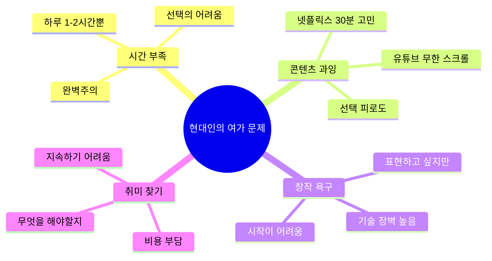
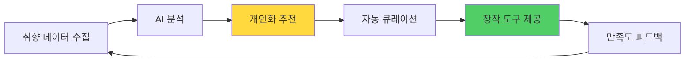
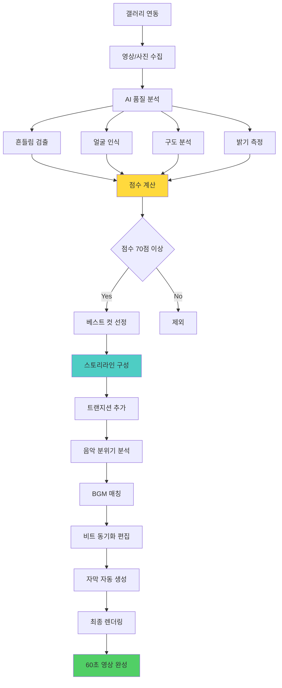
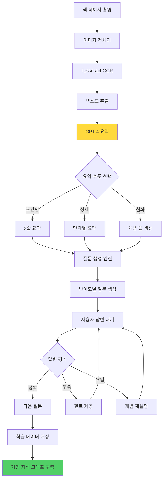
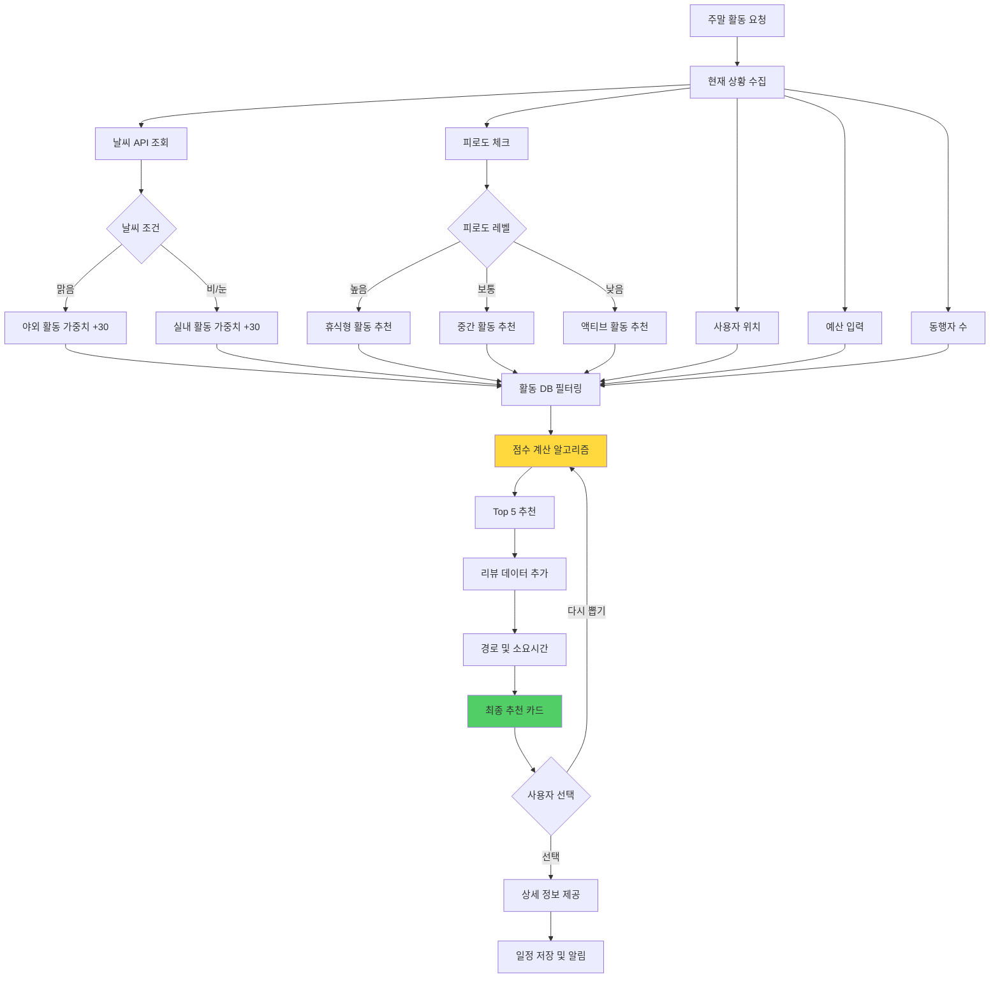
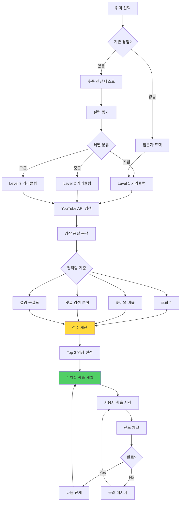
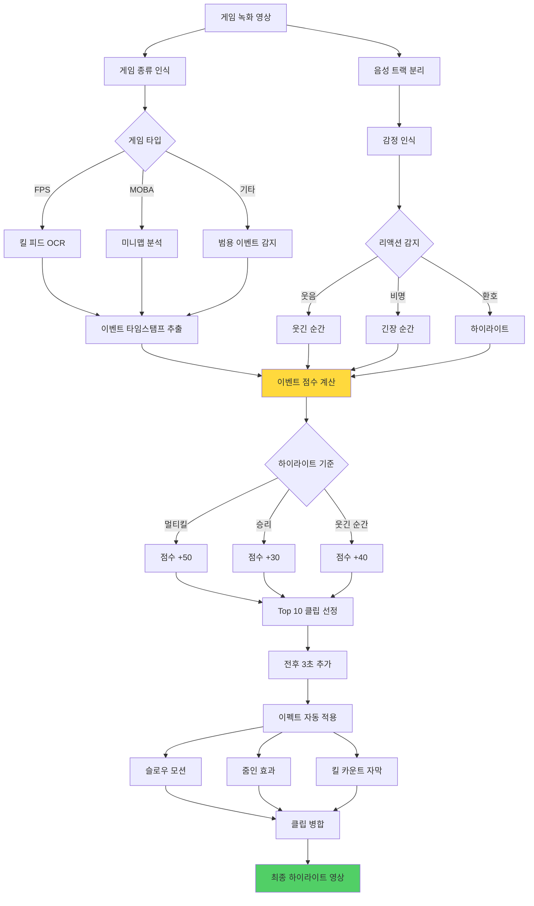
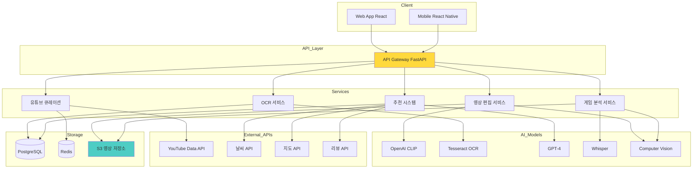
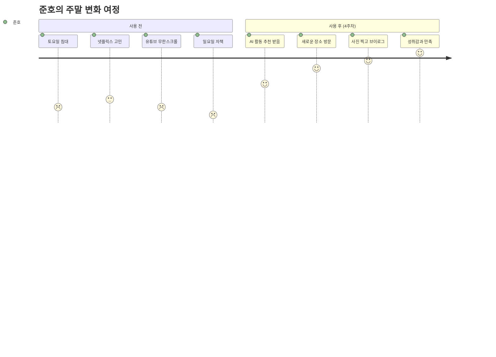

# 여가 AI: 나만의 취미 큐레이터 🎨🎮

> **핵심 가치:** 시간 빈곤 시대의 효율적 여가 + 자기표현

---

## 📋 목차

1. [프로젝트 개요](#프로젝트-개요)
2. [5가지 소주제](#5가지-소주제)
3. [전체 시스템 아키텍처](#전체-시스템-아키텍처)
4. [유저 시나리오](#유저-시나리오)
5. [UI/UX 상세 설계](#uiux-상세-설계)
6. [기술 구현 가이드](#기술-구현-가이드)

---

## 프로젝트 개요

### 🎯 해결하려는 문제



### 💡 솔루션 접근



---

## 5가지 소주제

### 1️⃣ 60초 브이로그 자동 생성기

#### 개념
스마트폰 갤러리에서 AI가 베스트 순간을 선별하여 1분 숏폼 영상 자동 제작

#### 핵심 기능
- 📸 **스마트 선별** - 흔들림, 밝기, 구도 분석
- 🎬 **자동 편집** - 트랜지션, 자막, 효과 자동 적용
- 🎵 **음악 매칭** - 영상 분위기에 맞는 BGM 추천
- ✂️ **리듬 편집** - 음악 비트에 맞춰 컷 편집
- 📱 **플랫폼 최적화** - TikTok/Shorts/Reels 포맷

#### 시스템 플로우



#### UI/UX 설계

**메인 화면**
```
┌─────────────────────────────────┐
│  🎬 브이로그 메이커              │
├─────────────────────────────────┤
│                                 │
│  이번 주말 영상 만들까요?        │
│                                 │
│  ┌──────────────────────┐      │
│  │ 📱                   │      │
│  │                      │      │
│  │  [갤러리 선택하기]   │      │
│  │                      │      │
│  │  또는                │      │
│  │                      │      │
│  │  [최근 사진 자동선택]│      │
│  └──────────────────────┘      │
│                                 │
│  💡 최근 3일 사진 25장 발견      │
│                                 │
├─────────────────────────────────┤
│  🎥 지난 작품                    │
│                                 │
│  ┌────┐ ┌────┐ ┌────┐          │
│  │ 🏖️ │ │ ☕ │ │ 🍽️ │          │
│  │제주│ │카페│ │맛집│          │
│  └────┘ └────┘ └────┘          │
│                                 │
└─────────────────────────────────┘
```

**AI 분석 중**
```
┌─────────────────────────────────┐
│  🤖 AI가 영상을 만들고 있어요    │
├─────────────────────────────────┤
│                                 │
│  ████████████░░░░  75%          │
│                                 │
│  ✅ 25장 중 18장 선정            │
│  ✅ 스토리라인 구성 완료         │
│  🔄 음악 매칭 중...              │
│                                 │
│  💡 당신의 영상 스타일:          │
│     "감성적이고 차분한 무드"     │
│                                 │
│  예상 완성 시간: 30초            │
│                                 │
└─────────────────────────────────┘
```

**편집 결과 미리보기**
```
┌─────────────────────────────────┐
│  ✨ 완성! 어때요?                │
├─────────────────────────────────┤
│  ┌───────────────────────┐     │
│  │                       │     │
│  │   [영상 플레이어]     │     │
│  │   ▶  0:32 / 1:00      │     │
│  │                       │     │
│  └───────────────────────┘     │
│                                 │
│  🎵 BGM: "Chill Afternoon"      │
│  ✂️  컷: 12개 / 평균 5초         │
│  🎨 스타일: Cinematic           │
│                                 │
├─────────────────────────────────┤
│  수정하고 싶은 부분이 있나요?    │
│                                 │
│  [음악 변경] [더 짧게] [더 길게]│
│  [자막 편집] [컷 순서 변경]      │
│                                 │
│  [완벽해요! 저장하기]            │
│  [인스타그램에 바로 업로드]       │
└─────────────────────────────────┘
```

---

### 2️⃣ AI 독서 비서: 책 내용을 내 것으로

#### 개념
책 사진을 찍으면 핵심 내용 요약 + 질문 생성 + AI 토론 파트너

#### 핵심 기능
- 📷 **OCR 스캔** - 책 페이지 사진 → 텍스트 변환
- 📝 **지능형 요약** - 핵심 개념만 추출
- ❓ **질문 생성** - 이해도 체크 질문 자동 생성
- 💬 **AI 토론** - 책 내용에 대해 대화
- 📊 **독서 통계** - 읽은 책, 시간, 성장 추적

#### 시스템 플로우



#### UI/UX 설계

**책 스캔 화면**
```
┌─────────────────────────────────┐
│  📚 독서 비서                    │
├─────────────────────────────────┤
│                                 │
│  ┌─────────────────────────┐   │
│  │                         │   │
│  │  [카메라 뷰파인더]       │   │
│  │                         │   │
│  │  책 페이지를 여기에      │   │
│  │  맞춰주세요              │   │
│  │                         │   │
│  └─────────────────────────┘   │
│                                 │
│  💡 팁:                          │
│  • 조명이 밝은 곳에서 촬영       │
│  • 페이지 전체가 보이게          │
│  • 흔들리지 않게                 │
│                                 │
│  [📸 촬영하기]                   │
└─────────────────────────────────┘
```

**AI 요약 결과**
```
┌─────────────────────────────────┐
│  📖 "사피엔스" 42-45페이지       │
│  호모 사피엔스의 인지혁명        │
├─────────────────────────────────┤
│  📝 3줄 요약                     │
│                                 │
│  1. 7만년 전 인지혁명으로        │
│     언어 능력 획득               │
│  2. 허구를 믿는 능력이           │
│     대규모 협력 가능케 함        │
│  3. 이것이 인류를 지배종으로     │
│     만든 핵심 요인               │
│                                 │
├─────────────────────────────────┤
│  🔑 핵심 개념                    │
│                                 │
│  • 인지혁명 (Cognitive Rev.)    │
│  • 허구적 언어                   │
│  • 집단 신화                     │
│                                 │
├─────────────────────────────────┤
│  💭 이해했는지 체크해볼까요?     │
│                                 │
│  Q1. 인지혁명이 왜 중요한가요?   │
│                                 │
│  [답변하기]  [힌트 보기]         │
│                                 │
│  ━━━━━━━━━━━━━━━━━━━━━         │
│                                 │
│  🤖 AI와 토론하기                │
│  "이 내용을 현대 사회에          │
│   어떻게 적용할 수 있을까?"      │
│                                 │
│  [대화 시작]                     │
└─────────────────────────────────┘
```

**AI 토론 화면**
```
┌─────────────────────────────────┐
│  💬 AI와 토론 중                 │
│  주제: 인지혁명과 현대 사회      │
├─────────────────────────────────┤
│                                 │
│  🤖 AI:                          │
│  "좋은 질문이에요! 현대의       │
│   '회사', '국가', '돈'도 모두   │
│   집단이 믿는 허구라고 볼 수    │
│   있어요. 어떻게 생각하세요?"   │
│                                 │
│  ━━━━━━━━━━━━━━━━━━━━━         │
│                                 │
│  👤 나:                          │
│  "회사는 실제로 존재하잖아요?"  │
│                                 │
│  ━━━━━━━━━━━━━━━━━━━━━         │
│                                 │
│  🤖 AI:                          │
│  "물리적 건물은 있지만, '회사'  │
│   라는 개념 자체는 인간이       │
│   만든 허구예요. 회사는 법적... │
│                                 │
├─────────────────────────────────┤
│  💡 이 토론으로 3가지 개념 이해! │
│                                 │
│  [대화 저장] [요약 보기]         │
└─────────────────────────────────┘
```

---

### 3️⃣ 주말 활동 AI 룰렛

#### 개념
날씨, 예산, 동행자, 피로도를 고려한 최적 주말 활동 추천

#### 핵심 기능
- 🎲 **스마트 매칭** - 상황 기반 활동 추천
- 🌤️ **날씨 연동** - 실시간 날씨 API 활용
- 💰 **예산 관리** - 가격대별 필터링
- 🚗 **경로 안내** - 길찾기 및 소요 시간
- ⭐ **리뷰 통합** - 네이버/카카오 리뷰 수집

#### 알고리즘 순서도



#### UI/UX 설계

**입력 화면**
```
┌─────────────────────────────────┐
│  🎲 주말 뭐하지?                 │
├─────────────────────────────────┤
│  현재 상황을 알려주세요!         │
│                                 │
│  🌤️ 날씨                         │
│  자동감지: 서울, 맑음 18°C      │
│                                 │
│  👥 누구와?                      │
│  [ ] 혼자  [✓] 연인  [ ] 친구   │
│  [ ] 가족                        │
│                                 │
│  💰 예산                         │
│  ━━━━○━━━━━━                    │
│  2만원 (0 ~ 10만원)             │
│                                 │
│  😴 오늘 컨디션                  │
│  [ ] 녹초  [✓] 보통  [ ] 활발   │
│                                 │
│  🚗 이동 가능 거리               │
│  ━━━━━○━━━━                     │
│  30분 (도보/대중교통)            │
│                                 │
│  ❌ 제외할 카테고리              │
│  [ ] 운동  [✓] 술집  [ ] 쇼핑   │
│                                 │
│  [AI한테 물어보기! 🎲]           │
└─────────────────────────────────┘
```

**추천 결과**
```
┌─────────────────────────────────┐
│  ✨ 오늘 이거 어때요?            │
├─────────────────────────────────┤
│  🏛️ 국립중앙박물관               │
│  ⭐ 4.7 (12,543 리뷰)            │
│                                 │
│  ┌───────────────────────┐     │
│  │   [박물관 이미지]     │     │
│  └───────────────────────┘     │
│                                 │
│  💡 AI 추천 이유:                │
│  "날씨가 좋지만 컨디션이 보통    │
│   이라 실내에서 여유롭게 즐길    │
│   수 있는 곳을 골랐어요.         │
│   연인과 데이트하기 좋고,        │
│   무료 입장이라 예산도 딱!       │
│   카페도 있어서 중간에 쉬기      │
│   좋아요."                       │
│                                 │
│  ✅ 무료 입장                    │
│  🚇 경복궁역 5분 (지하철 20분)   │
│  ⏰ 추천 시간: 2-3시간           │
│  ☕ 카페 있음                    │
│                                 │
│  [여기 가기!] [다른 거 볼래]     │
└─────────────────────────────────┘

┌─────────────────────────────────┐
│  🎯 다른 추천                    │
│                                 │
│  2️⃣ 한강 자전거 (서울숲)        │
│     ⭐ 4.6  🚴 40분  💰 1만원   │
│                                 │
│  3️⃣ 망원동 카페거리 산책         │
│     ⭐ 4.5  🚶 25분  💰 1.5만원 │
│                                 │
│  4️⃣ CGV 영화 + 맛집             │
│     ⭐ 4.4  🎬 30분  💰 4만원   │
│                                 │
│  5️⃣ 북촌 한옥마을 + 삼청동       │
│     ⭐ 4.6  🚇 35분  💰 2만원   │
│                                 │
└─────────────────────────────────┘
```

---

### 4️⃣ AI 취미 튜터 플랫폼

#### 개념
배우고 싶은 취미를 말하면 AI가 수준을 파악하고 맞춤 커리큘럼 + YouTube 강의 큐레이션

#### 핵심 기능
- 🎯 **수준 진단** - 간단한 테스트로 현재 실력 파악
- 📚 **커리큘럼 생성** - 단계별 학습 계획
- 🎥 **영상 큐레이션** - YouTube에서 최적 강의 선별
- 📈 **진도 관리** - 학습 추적 및 독려
- 🏆 **성취 기록** - 배운 것 포트폴리오화

#### 시스템 플로우



#### UI/UX 설계

**취미 선택**
```
┌─────────────────────────────────┐
│  🎨 무엇을 배우고 싶나요?        │
├─────────────────────────────────┤
│  인기 취미                       │
│                                 │
│  ┌────┐ ┌────┐ ┌────┐          │
│  │🎸  │ │🎨  │ │📸  │          │
│  │기타│ │그림│ │사진│          │
│  └────┘ └────┘ └────┘          │
│                                 │
│  ┌────┐ ┌────┐ ┌────┐          │
│  │👨‍💻│ │🍳  │ │✍️  │          │
│  │코딩│ │요리│ │글쓰기│        │
│  └────┘ └────┘ └────┘          │
│                                 │
│  ┌────┐ ┌────┐ ┌────┐          │
│  │🏃  │ │🧘  │ │🎤  │          │
│  │러닝│ │요가│ │노래│          │
│  └────┘ └────┘ └────┘          │
│                                 │
│  ┌──────────────────────┐      │
│  │ 🔍 직접 검색하기      │      │
│  └──────────────────────┘      │
└─────────────────────────────────┘
```

**수준 진단**
```
┌─────────────────────────────────┐
│  🎸 기타 수준 체크               │
├─────────────────────────────────┤
│  간단한 질문에 답해주세요!       │
│                                 │
│  Q1. 기타를 배운 적 있나요?      │
│                                 │
│  ( ) 완전 처음이에요             │
│  ( ) 조금 쳐봤어요 (3개월 이하)  │
│  ( ) 꽤 쳐봤어요 (6개월 이상)    │
│  ( ) 노래 몇 곡 칠 수 있어요     │
│                                 │
│  Q2. 코드는 얼마나 아세요?       │
│                                 │
│  ( ) 코드가 뭔지 몰라요          │
│  ( ) C, G, D 정도?               │
│  ( ) 바레코드까지 가능!          │
│  ( ) 재즈 코드도 할 줄 알아요    │
│                                 │
│  Q3. 목표는 뭔가요?              │
│                                 │
│  ( ) 좋아하는 노래 한 곡 치기    │
│  ( ) 친구들 앞에서 연주하기      │
│  ( ) 작곡하고 싶어요             │
│  ( ) 프로 수준 도달              │
│                                 │
│  [다음] (3/5)                    │
└─────────────────────────────────┘
```

**맞춤 커리큘럼**
```
┌─────────────────────────────────┐
│  🎯 민지님 맞춤 기타 커리큘럼    │
│  레벨: 초급 (입문 3개월차)       │
├─────────────────────────────────┤
│  📅 6주 완성 플랜                │
│                                 │
│  ✅ Week 1: 기본 자세와 튜닝     │
│     ✓ 기타 잡는 법 (완료)        │
│     ✓ 튜닝 방법 (완료)           │
│     → 총 학습 시간: 2h 30m       │
│                                 │
│  ▶️ Week 2: 오픈 코드 마스터     │
│     [ ] C, G, D 코드 익히기      │
│     [ ] 코드 체인지 연습         │
│     📺 추천 영상 3개 (45분)      │
│                                 │
│     🎥 [유튜브 썸네일]           │
│     "기타 초보 필수 3코드"       │
│     ⭐ 4.9 | 👍 98% | 15분      │
│     [시청하기]                   │
│                                 │
│  🔒 Week 3: 스트로밍 패턴        │
│  🔒 Week 4: 첫 곡 도전!          │
│  🔒 Week 5: 리듬 업그레이드      │
│  🔒 Week 6: 완성도 높이기        │
│                                 │
├─────────────────────────────────┤
│  📊 진도                         │
│  ████░░░░░░░░  Week 1 완료!     │
│                                 │
│  🔥 3일 연속 학습 중!            │
│  💪 이번 주 목표: 2시간 달성     │
│     (현재 1h 20m / 2h)           │
│                                 │
└─────────────────────────────────┘
```

---

### 5️⃣ 게임 하이라이트 자동 편집

#### 개념
게임 플레이 영상에서 킬 장면/웃긴 순간만 자동 추출하여 클립 제작

#### 핵심 기능
- 🎮 **게임 인식** - LOL, 발로란트, 오버워치 등
- 🎯 **이벤트 감지** - 킬, 데스, 멀티킬, 패배/승리
- 😂 **리액션 감지** - 음성 분석으로 웃음/비명 찾기
- ✂️ **자동 편집** - 전후 3초 포함 클립 생성
- 🎨 **이펙트 추가** - 슬로우 모션, 줌인, 자막

#### 시스템 플로우



#### UI/UX 설계

**영상 업로드**
```
┌─────────────────────────────────┐
│  🎮 게임 하이라이트 메이커       │
├─────────────────────────────────┤
│                                 │
│  게임 녹화 영상을 올려주세요     │
│                                 │
│  ┌──────────────────────┐      │
│  │                      │      │
│  │  📁                  │      │
│  │                      │      │
│  │  [파일 선택]         │      │
│  │  또는 드래그         │      │
│  │                      │      │
│  └──────────────────────┘      │
│                                 │
│  지원 형식: MP4, MOV, AVI       │
│  최대 크기: 5GB                 │
│                                 │
│  🎯 어떤 게임인가요?             │
│  [LOL] [발로란트] [오버워치]    │
│  [배그] [기타]                   │
│                                 │
│  ⚙️ 옵션                         │
│  [✓] 킬 장면                     │
│  [✓] 웃긴 순간                   │
│  [ ] 데스 장면 (반성용)          │
│  [✓] 승리/패배                   │
│                                 │
│  [분석 시작!]                    │
└─────────────────────────────────┘
```

**AI 분석 중**
```
┌─────────────────────────────────┐
│  🤖 AI가 하이라이트를 찾고 있어요│
├─────────────────────────────────┤
│  영상 길이: 45:23                │
│                                 │
│  ████████░░░░░  60%             │
│                                 │
│  ✅ 게임 인식 완료: 발로란트     │
│  ✅ 킬 장면 12개 발견            │
│  ✅ 웃긴 순간 5개 발견           │
│  🔄 음성 감정 분석 중...         │
│                                 │
│  💡 발견한 하이라이트:           │
│  • 12:34 - 에이스! 🔥           │
│  • 23:45 - 4킬!                 │
│  • 31:20 - 웃긴 데스 ㅋㅋㅋ     │
│                                 │
│  예상 완성 시간: 2분 30초        │
│                                 │
└─────────────────────────────────┘
```

**하이라이트 결과**
```
┌─────────────────────────────────┐
│  ✨ 하이라이트 완성!             │
│  총 8개 클립, 2분 45초           │
├─────────────────────────────────┤
│  🏆 베스트 클립                  │
│                                 │
│  ┌───────────────────────┐     │
│  │  [썸네일: 에이스]     │     │
│  │  ▶  0:15              │     │
│  │  12:34 - 에이스! 🔥   │     │
│  └───────────────────────┘     │
│                                 │
│  📺 전체 클립 (8개)              │
│                                 │
│  1. 12:34 에이스! ⭐⭐⭐⭐⭐      │
│  2. 23:45 4킬 ⭐⭐⭐⭐          │
│  3. 31:20 웃긴 데스 ⭐⭐⭐      │
│  4. 38:10 1v3 클러치 ⭐⭐⭐⭐   │
│  5. 42:05 승리! ⭐⭐            │
│  ...                            │
│                                 │
│  [전체 재생] [클립 선택 편집]    │
│                                 │
├─────────────────────────────────┤
│  💾 저장 옵션                    │
│                                 │
│  [ ] 전체 클립 병합 (2:45)       │
│  [ ] 개별 클립으로 저장          │
│  [ ] 베스트 Top 3만 (0:45)      │
│                                 │
│  [💾 다운로드]                   │
│  [🎬 YouTube Shorts 업로드]     │
│  [🎮 트위치 클립 생성]           │
└─────────────────────────────────┘
```

---

## 전체 시스템 아키텍처

### 🏗️ 통합 아키텍처



---

## 유저 시나리오

### 시나리오 1: 직장인 준호의 주말 만들기

**배경:** 프리랜서 개발자, 주말마다 집에만 있음, 취미 찾고 싶음



**토요일 오전 10시**
```
[주말 활동 AI 룰렛 실행]

입력:
- 혼자
- 예산 3만원
- 컨디션 보통
- 날씨 맑음

AI 추천:
"🏛️ 국립현대미술관 + 삼청동 산책
 
 추천 이유:
 • 혼자서도 즐길 수 있어요
 • 예술 작품 보며 영감 충전
 • 산책하며 사진 찍기 좋음
 • 카페 많아서 쉬기 좋아요
 
 예상 루트:
 11:00 출발
 11:40 미술관 도착
 13:00 전시 관람 종료
 13:30 삼청동 점심
 15:00 산책 & 사진
 17:00 카페에서 독서
 18:00 귀가"

준호: "오... 좋은데? 가볼까?"
```

**오후 3시 - 삼청동**
```
[60초 브이로그 자동 생성 사용]

준호: (스마트폰으로 사진 찍음)
- 미술관 전시 3장
- 삼청동 거리 5장
- 맛있는 점심 1장
- 카페 아메리카노 1장

[AI 자동 편집 완료]

앱: "✨ 브이로그 완성!
     오늘의 무드: 차분하고 감성적인
     BGM: Lo-fi Jazz
     길이: 58초"

준호: (영상 확인)
      "와... 내가 찍은 게 이렇게 멋있어 보이네?"
      
[인스타그램 스토리 업로드]
친구 반응: "오 준호야 어디야? 완전 감성이다!"

준호: (뿌듯함) "주말을 의미있게 보낸 기분이야"
```

**일요일 오후**
```
[AI 취미 튜터 접속]

준호: "사진 찍는 거 재미있었는데, 제대로 배워볼까?"

앱: "📸 사진 초급 커리큘럼
     
     Week 1: 스마트폰 사진의 기본
     • 구도의 3분할 법칙
     • 빛의 방향 이해하기
     • 보정의 기초
     
     추천 영상:
     '스마트폰으로 프로처럼 찍는 법'
     ⭐ 4.9 | 15분"

준호: (영상 시청 → 연습)
      
[2시간 학습]

앱: "🎉 Week 1 완료!
     다음 주말에 배운 걸 써먹어볼까요?
     • 북촌 한옥마을 (구도 연습하기 좋음)
     • 성수동 카페거리 (빛 활용 연습)"

준호: "좋아! 다음 주말도 기대된다"
```

**4주 후**
```
[주간 회고]

앱: "🎉 준호님의 4주 변화
     
     주말 활동:
     • 4주 연속 외출 성공!
     • 8개 장소 방문
     • 12개 브이로그 제작
     
     새로운 취미:
     • 사진 촬영 시작
     • 4시간 학습 완료
     • 100장 연습 사진
     
     변화:
     Before: 집콕 만족도 30%
     After: 주말 만족도 85% ↑
     
     준호님은 이제 '취미 사진가'예요! 📸"

준호: "AI 덕분에 인생이 바뀐 기분이야"
```

---

## UI/UX 상세 설계

### 🎨 디자인 시스템

#### 컬러 팔레트
```css
:root {
  /* Primary - 활기찬 옐로우 */
  --primary-50: #FFF9E6;
  --primary-100: #FFF0B3;
  --primary-500: #FFD93D;  /* 메인 */
  --primary-700: #E6B800;
  --primary-900: #996B00;
  
  /* Activity Categories */
  --outdoor: #51CF66;   /* 야외 */
  --indoor: #4ECDC4;    /* 실내 */
  --creative: #A29BFE;  /* 창작 */
  --active: #FF6B6B;    /* 액티브 */
  --relax: #95AAC4;     /* 휴식 */
}
```

---

## 기술 구현 가이드

### 📱 60초 브이로그 자동 생성 구현

```python
# backend/services/vlog_generator.py
import cv2
import numpy as np
from typing import List, Tuple
import openai

class VlogGenerator:
    """브이로그 자동 생성 서비스"""
    
    def __init__(self):
        self.quality_threshold = 70
    
    def analyze_image_quality(self, image_path: str) -> dict:
        """
        이미지 품질 분석
        
        Returns:
            {
                'score': 85,
                'brightness': 0.7,
                'sharpness': 0.9,
                'composition': 0.8,
                'has_face': True
            }
        """
        img = cv2.imread(image_path)
        
        # 밝기 분석
        brightness = np.mean(cv2.cvtColor(img, cv2.COLOR_BGR2GRAY)) / 255
        
        # 선명도 분석 (라플라시안 분산)
        gray = cv2.cvtColor(img, cv2.COLOR_BGR2GRAY)
        laplacian_var = cv2.Laplacian(gray, cv2.CV_64F).var()
        sharpness = min(laplacian_var / 1000, 1.0)
        
        # 얼굴 인식
        face_cascade = cv2.CascadeClassifier(
            cv2.data.haarcascades + 'haarcascade_frontalface_default.xml'
        )
        faces = face_cascade.detectMultiScale(gray, 1.1, 4)
        has_face = len(faces) > 0
        
        # 구도 분석 (3분할 법칙)
        composition = self._analyze_composition(img)
        
        # 종합 점수
        score = (
            brightness * 0.2 +
            sharpness * 0.3 +
            composition * 0.3 +
            (0.2 if has_face else 0)
        ) * 100
        
        return {
            'score': score,
            'brightness': brightness,
            'sharpness': sharpness,
            'composition': composition,
            'has_face': has_face
        }
    
    def select_best_images(self, image_paths: List[str], 
                          target_count: int = 12) -> List[str]:
        """베스트 이미지 선정"""
        scored_images = []
        
        for path in image_paths:
            quality = self.analyze_image_quality(path)
            if quality['score'] >= self.quality_threshold:
                scored_images.append((path, quality['score']))
        
        # 점수순 정렬
        scored_images.sort(key=lambda x: x[1], reverse=True)
        
        return [img[0] for img in scored_images[:target_count]]
    
    def create_storyline(self, images: List[str]) -> List[dict]:
        """스토리라인 구성"""
        # 이미지 메타데이터로 시간순 정렬
        # ... (이미지 EXIF 데이터 파싱)
        
        storyline = []
        for i, img in enumerate(images):
            storyline.append({
                'image': img,
                'duration': 5,  # 5초씩
                'transition': 'fade' if i < len(images) - 1 else None
            })
        
        return storyline
    
    def generate_video(self, storyline: List[dict], 
                      music_path: str, output_path: str):
        """최종 영상 생성"""
        from moviepy.editor import (
            ImageClip, concatenate_videoclips, 
            AudioFileClip, CompositeVideoClip
        )
        
        clips = []
        
        for scene in storyline:
            # 이미지 클립 생성
            clip = ImageClip(scene['image']).set_duration(scene['duration'])
            
            # 켄 번즈 효과 (줌인)
            clip = clip.resize(lambda t: 1 + 0.02 * t)
            
            clips.append(clip)
        
        # 클립 병합
        final_clip = concatenate_videoclips(clips, method='compose')
        
        # 음악 추가
        audio = AudioFileClip(music_path)
        final_clip = final_clip.set_audio(audio)
        
        # 60초로 자르기
        if final_clip.duration > 60:
            final_clip = final_clip.subclip(0, 60)
        
        # 렌더링
        final_clip.write_videofile(
            output_path,
            fps=30,
            codec='libx264',
            audio_codec='aac'
        )
        
        return output_path
```

---

## 📊 성과 측정

### KPI

| 지표 | 목표 | 측정 |
|------|------|------|
| 사용자 만족도 | 4.5/5 | 앱 리뷰 |
| 주말 활동 증가율 | +60% | 사용 전후 비교 |
| 영상 제작 시간 | <5분 | 평균 소요 시간 |
| 취미 학습 완수율 | 50% | 커리큘럼 완료 |

---

**마지막 업데이트:** 2025-11-26  
**다음 문서:** [만남AI_상세가이드.md](./만남AI_상세가이드.md)

