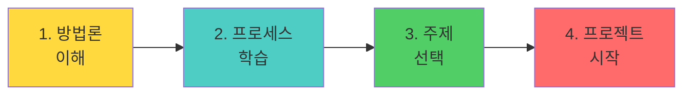
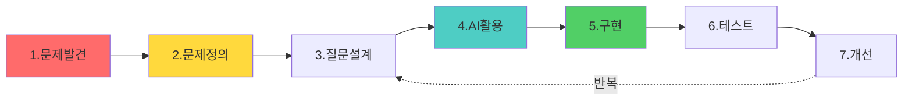
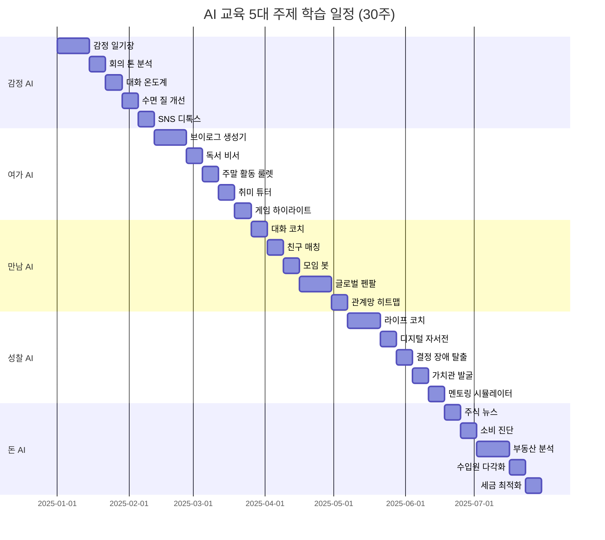

# AI-Vive-Coding v3.0 🚀

> **AI 시대의 새로운 코딩 교육**  
> 코드보다 생각, 구현보다 기획, 5가지 실생활 주제로 배우는 AI 개발

---

## 📚 프로그램 소개

바이브 코딩(Vibe Coding)은 자연어 기반 AI를 활용한 차세대 코딩 교육 방법론입니다.

### 🎯 v3.0 업데이트 (2025.11.26)

**✨ 새로운 점:**
- **5대 실생활 주제**: 감정, 여가, 만남, 성찰, 돈
- **7단계 개발 프로세스**: 체계적인 개발 방법론
- **완전한 설계 가이드**: Mermaid 다이어그램 + UI/UX 목업
- **구현 코드 포함**: Python + TypeScript 샘플

### 💡 핵심 철학

```
좋은 문제 정의 × 효과적인 질문 × AI 활용 = 최상의 결과
```

**"AI는 도구일 뿐, 중요한 것은 여러분의 생각입니다."**

---

## 🚀 시작하기

### 처음이신가요? 이 순서로 읽으세요!



#### 1️⃣ 방법론 이해
**[바이브코딩_방법론_v3.0.md](./Docs/바이브코딩_방법론_v3.0.md)** ⭐ 필독!
- 바이브 코딩이란?
- 전통 코딩 vs 바이브 코딩
- 핵심 4대 원칙
- 효과성 비교

#### 2️⃣ 프로세스 학습
**[바이브코딩_AI개발_프로세스.md](./Docs/바이브코딩_AI개발_프로세스.md)** 📐
- 7단계 개발 프로세스
- 질문 정의 방법론
- AI 도구 활용 전략
- 평가 기준

#### 3️⃣ 주제 선택
**[AI교육_5대주제_통합가이드.md](./Docs/주제/AI교육_5대주제_통합가이드.md)** 🎯
- 5가지 실생활 주제 소개
- 고객 페르소나 5명
- 유저 시나리오
- 학습 로드맵 (30주)

#### 4️⃣ 프로젝트 시작
주제별 상세 가이드에서 구체적인 구현 방법 확인!

---

## 🎯 7단계 개발 프로세스



### ⏱️ 시간 배분 원칙

```
┌─────────────────────────────────┐
│  전체 프로젝트 시간 배분         │
├─────────────────────────────────┤
│                                 │
│  문제 정의 ████████████░░  40%  │
│  AI 활용   ████████░░░░░  25%  │
│  구현      ██████░░░░░░  20%  │
│  테스트    ███░░░░░░░░░  10%  │
│  개선      █░░░░░░░░░░░   5%  │
│                                 │
└─────────────────────────────────┘
```

**왜 문제 정의에 40%?**
- 잘 정의된 문제 → AI가 정확히 이해
- 명확한 질문 → 원하는 답변 획득
- 시행착오 최소화 → 전체 시간 단축

---

## 💎 5대 실생활 주제

### 📊 주제별 개요

| 주제 | 문제 | 솔루션 | 핵심 AI |
|------|------|--------|---------|
| 💙 **감정 AI** | 번아웃, 외로움 | 감정 일기, 대화 분석 | GPT-4, Whisper |
| 🎨 **여가 AI** | 시간 부족, 창작 욕구 | 브이로그 생성, 활동 추천 | CLIP, GPT-4 |
| 🤝 **만남 AI** | 어색함, 관계 유지 | 대화 코치, 친구 매칭 | GPT-4, GNN |
| 🧭 **성찰 AI** | 정체성 혼란, 결정 장애 | 10년 후 시뮬레이터 | Time Series ML |
| 💰 **돈 AI** | 저축 실패, 투자 두려움 | 소비 분석, 주식 뉴스 | Sentiment Analysis |

### 📂 주제별 상세 가이드

각 주제별로 완전한 개발 가이드를 제공합니다:

#### 💙 [감정 AI 상세 가이드](./Docs/주제/감정AI_상세가이드.md)
**5가지 프로젝트:**
1. 나만의 AI 감정 일기장
2. 리얼타임 회의 톤 분석기
3. 연인/가족 대화 온도계
4. AI 기반 수면 질 개선
5. 소셜미디어 디톡스 도우미

**포함 내용:**
- 시스템 플로우차트
- UI/UX 목업 (ASCII 아트)
- Python 백엔드 코드
- TypeScript 프론트엔드 코드

#### 🎨 [여가 AI 상세 가이드](./Docs/주제/여가AI_상세가이드.md)
**5가지 프로젝트:**
1. 60초 브이로그 자동 생성기
2. AI 독서 비서
3. 주말 활동 AI 룰렛
4. AI 취미 튜터 플랫폼
5. 게임 하이라이트 자동 편집

**포함 내용:**
- 영상 편집 알고리즘
- 이미지 품질 분석
- YouTube API 활용

#### 🤝 [만남 AI 상세 가이드](./Docs/주제/만남AI_상세가이드.md)
**5가지 프로젝트:**
1. AI 대화 코치
2. 동네 친구 AI 매칭
3. 모임 활성화 AI 봇
4. 글로벌 펜팔 AI 번역
5. 관계망 히트맵 분석

**포함 내용:**
- 매칭 알고리즘 (점수 계산)
- Graph Neural Network
- 실시간 STT/TTS

#### 🧭 [성찰 AI 상세 가이드](./Docs/주제/성찰AI_상세가이드.md)
**5가지 프로젝트:**
1. AI 라이프 코치 (10년 후 시뮬레이터)
2. 나의 디지털 자서전
3. 결정 장애 탈출 AI
4. 나만의 가치관 발굴
5. AI 멘토링 시뮬레이터

**포함 내용:**
- 미래 예측 알고리즘
- Time Series 분석
- 데이터 시각화 (D3.js)

#### 💰 [돈 AI 상세 가이드](./Docs/주제/돈AI_상세가이드.md)
**5가지 프로젝트:**
1. AI 주식 뉴스 필터링
2. 소비 습관 AI 진단
3. 부동산 AI 분석
4. N잡러 수입원 다각화
5. AI 세금 최적화 비서

**포함 내용:**
- 뉴스 크롤링 + 감성 분석
- 금융 데이터 분석
- 절약 시뮬레이션

---

## 📅 30주 학습 로드맵



**프로그램 구조:**
```
주차    주제           핵심 프로젝트
─────────────────────────────────────
1-6    감정 AI        음성 감정 일기 앱
7-12   여가 AI        60초 브이로그 메이커
13-18  만남 AI        동네 친구 매칭 앱
19-24  성찰 AI        10년 후 시뮬레이터
25-30  돈 AI          소비 습관 분석 앱
```

---

## 🛠 사용 도구

### AI 도구

| 도구 | 용도 | 비용 |
|------|------|------|
| **ChatGPT** | 기획, 아이디어, 기획서 작성 | 무료/유료 |
| **Claude** | 긴 문서 분석, 코드 리뷰 | 무료/유료 |
| **Cursor** | 실시간 코드 작성 | 무료/유료 |
| **GitHub Copilot** | 코드 자동완성 | 유료 |
| **Midjourney** | UI 목업, 디자인 | 유료 |
| **DALL-E** | 이미지 생성 | 무료/유료 |

### 개발 도구

- **Frontend**: React, TypeScript, Tailwind CSS
- **Backend**: Python (FastAPI), Node.js
- **Database**: PostgreSQL, Redis, MongoDB
- **Deployment**: Vercel, Netlify, AWS

---

## 📊 평가 기준

### 종합 평가표 (100점)

```
┌─────────────────────────────────┐
│  1. 문제 정의 (40점)             │
│     ├─ 5W1H 명확성 (15점)       │
│     ├─ 측정 가능성 (10점)        │
│     ├─ 해결 가치 (10점)          │
│     └─ 범위 적절성 (5점)         │
│                                 │
│  2. 질문 설계 (30점)             │
│     ├─ 프롬프트 구조 (10점)      │
│     ├─ 맥락 제공 (10점)          │
│     └─ 반복 개선 (10점)          │
│                                 │
│  3. 구현 (20점)                  │
│     ├─ 기능 완성도 (10점)        │
│     ├─ 코드 품질 (5점)           │
│     └─ UI/UX (5점)              │
│                                 │
│  4. 개선 (10점)                  │
│     ├─ 피드백 반영 (5점)         │
│     └─ 완성도 향상 (5점)         │
└─────────────────────────────────┘
```

**등급 기준:**
- S등급: 90-100점 (완벽)
- A등급: 80-89점 (우수)
- B등급: 70-79점 (양호)
- C등급: 60-69점 (보통)

---

## 🎓 교육 대상

### 학년별 프로그램

- **9학년 (중3)**: 자기표현과 창의적 문제 발견
  - 추천 주제: 감정 AI, 여가 AI
  
- **10학년 (고1)**: 사회 공감과 협력적 문제 해결
  - 추천 주제: 만남 AI, 성찰 AI
  
- **11학년 (고2)**: 실용성과 창업 마인드
  - 추천 주제: 돈 AI, 종합 프로젝트

### 성인 학습자

- **직장인**: 업무 자동화, 사이드 프로젝트
- **취업 준비생**: 포트폴리오 제작
- **창업 희망자**: MVP 빠른 제작

---

## 🌟 특징

### ✨ 바이브 코딩의 장점

```
전통 코딩 vs 바이브 코딩
────────────────────────────

개발 시간:    3-6개월 → 1-2주
학습 곡선:    가파름 → 완만
진입 장벽:    높음 → 낮음
문제 해결:    코드 중심 → 기획 중심
결과물:       한정적 → 다양
```

### 💪 학습 성과

프로그램 완료 시:
- ✅ 5개 이상의 완성된 프로젝트
- ✅ GitHub 포트폴리오
- ✅ 문제 정의 능력
- ✅ AI 활용 능력
- ✅ 발표 및 소통 능력

---

## 📖 기존 문서

v3.0 업데이트 전 기존 교육 프로그램:

- **[바이브코딩_기업가정신_교육프로그램.md](./Docs/바이브코딩_기업가정신_교육프로그램.md)**
  - 9-11학년 24차시
  - 창업 실행 중심

- **[바이브코딩_기획중심_수업설계.md](./Docs/바이브코딩_기획중심_수업설계.md)**
  - 기획 능력 강화
  - 기획서 작성

- **[바이브코딩_프론트엔드_PBL_가이드.md](./Docs/바이브코딩_프론트엔드_PBL_가이드.md)**
  - Cursor 완벽 가이드
  - 실습 중심

- **[AI교육_3단계_프로그램.md](./Docs/AI교육_3단계_프로그램.md)**
  - v2.0 프로그램
  - 문제 정의 → 분해 → 구현

---

## 🤝 기여 방법

이 프로젝트는 교육 현장의 피드백을 환영합니다!

**참여 방법:**
- 🐛 Issue 등록: 버그 리포트, 개선 제안
- 🔀 Pull Request: 문서 개선, 코드 예시 추가
- 💬 Discussion: 교육 사례 공유, 질문

**기여 가이드:**
1. Fork this repository
2. Create your feature branch
3. Commit your changes
4. Push to the branch
5. Create a Pull Request

---

## 💬 커뮤니티

- 📧 Email: [교육 문의]
- 💬 Discord: [커뮤니티 초대 링크]
- 📝 GitHub Issues: 질문 및 토론

---

## 📝 라이선스

MIT License - 자유롭게 사용, 수정, 배포 가능합니다.

---

## 🗺️ 로드맵

### v3.1 (계획 중)

- [ ] 각 프로젝트별 영상 튜토리얼
- [ ] 샘플 코드 GitHub 저장소
- [ ] 실시간 Q&A 세션
- [ ] 수료증 발급 시스템

### v4.0 (예정)

- [ ] 고급 AI 모델 활용 (RAG, Fine-tuning)
- [ ] 협업 프로젝트 가이드
- [ ] 산업별 특화 프로그램
- [ ] 글로벌 확장 (영문 버전)

---

## 📈 통계

- **총 문서**: 11개
- **프로젝트 예시**: 25개
- **Mermaid 다이어그램**: 50개+
- **코드 예시**: 100개+
- **예상 학습 시간**: 30주 (주 8시간 기준)

---

## ❓ FAQ

**Q1: 코딩을 전혀 모르는데 가능한가요?**  
A: 네! 바이브 코딩은 자연어로 소통합니다. 문제 정의 능력이 더 중요합니다.

**Q2: AI가 모든 걸 해주나요?**  
A: 아니요. AI는 도구일 뿐입니다. 문제 정의, 기획, 판단은 인간이 해야 합니다.

**Q3: 얼마나 걸리나요?**  
A: 기본 프로토타입은 1-2주, 완성된 앱은 4-6주 정도입니다.

**Q4: 어떤 AI 도구가 필요한가요?**  
A: ChatGPT (기획) + Cursor (코딩)가 기본입니다. Midjourney는 선택사항입니다.

**Q5: 실제로 앱을 배포할 수 있나요?**  
A: 네! Vercel, Netlify 등으로 무료 배포 가능합니다.

---

## 👨‍🏫 문의

교육 프로그램 관련 문의나 협업 제안은 GitHub Issues를 통해 남겨주세요.

**특별 요청:**
- 학교/기관 맞춤형 프로그램
- 교사 연수
- 강연 및 워크숍

---

**마지막 업데이트**: 2025-11-26  
**버전**: 3.0  
**작성자**: Vive Coding Team

---

<div align="center">

### 🚀 지금 바로 시작하세요!

**[바이브코딩 방법론 v3.0 보러가기 →](./Docs/바이브코딩_방법론_v3.0.md)**

Made with ❤️ by Vive Coding Team

</div>
