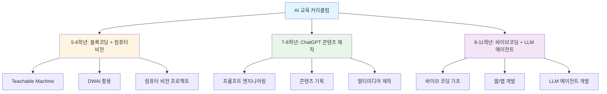
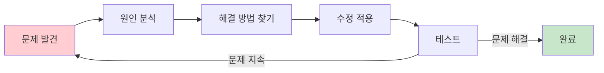

# AI 전체 교육 커리큘럼
## 메이커 교육 기반 AI 리터러시 함양 프로그램

---

## 📋 프로그램 개요

### 교육 철학
**"만들면서 배우고, 디버깅하면서 성장하고, AI와 협업하며 창조한다"**

### 핵심 목표
1. **메이커 교육**: 직접 만들어보며 문제 해결 능력 배양
2. **실행자 양성**: 아이디어를 실제 작동하는 결과물로 구현
3. **디버깅 능력**: 오류를 찾고 해결하는 논리적 사고력 강화
4. **AI 리터러시**: AI 도구를 효과적으로 활용하는 능력 함양

### 교육 대상 및 구성
- **5-6학년**: 블록 코딩 + 컴퓨터 비전 (Teachable Machine, DWAI)
- **7-8학년**: ChatGPT 콘텐츠 제작 교육
- **9-11학년**: AI 활용 바이브 코딩 + LLM 에이전트 개발

### 수업 운영 방식
- **수업 시간**: 주말 수업, 학년당 12주 × 2차시 (총 24차시)
- **프로젝트 수**: 학년당 2-3개 프로젝트
- **교육 방법론**: PBL (Project-Based Learning) + PRIMM 방식

---

## 🎯 전체 커리큘럼 구조도



---

## 📊 학년별 학습 목표 및 성취 기준

| 학년 | 핵심 주제 | 학습 목표 | AI 도구 | 최종 산출물 | 난이도 |
|------|----------|----------|---------|------------|--------|
| **5-6학년** | 블록코딩 + 컴퓨터비전 | - 블록코딩으로 논리적 사고 학습<br>- AI 이미지 인식 원리 이해<br>- 간단한 인터랙티브 프로젝트 제작 | Teachable Machine<br>DWAI<br>Scratch | 2-3개 컴퓨터 비전 프로젝트 | ⭐⭐ |
| **7-8학년** | ChatGPT 콘텐츠 제작 | - 프롬프트 엔지니어링 기초<br>- AI 활용 콘텐츠 기획 및 제작<br>- 멀티미디어 콘텐츠 편집 | ChatGPT<br>Midjourney<br>Canva | 2-3개 디지털 콘텐츠 | ⭐⭐⭐ |
| **9학년** | 바이브코딩 입문 | - 자연어로 코드 생성 이해<br>- 웹 기초 구조 학습<br>- 간단한 웹 페이지 제작 | V0.dev<br>Cursor<br>ChatGPT | 3개 웹 프로젝트 | ⭐⭐⭐ |
| **10학년** | 바이브코딩 심화 | - 인터랙티브 웹 개발<br>- API 연동 기초<br>- 데이터 시각화 | V0.dev<br>Cursor<br>Claude | 2-3개 웹앱 프로젝트 | ⭐⭐⭐⭐ |
| **11학년** | LLM 에이전트 개발 | - LLM API 활용<br>- 에이전트 설계 및 구현<br>- 실전 서비스 개발 | OpenAI API<br>LangChain<br>Cursor | 2개 AI 서비스 | ⭐⭐⭐⭐⭐ |

---

## 📚 5-6학년: 블록 코딩 + 컴퓨터 비전

### 교육 목표
- 블록 코딩을 통한 논리적 사고력 배양
- AI 이미지 인식의 원리 이해
- 직접 만들고 테스트하는 메이커 경험

### 학습 흐름 (PRIMM 방식)
1. **Predict (예측)**: AI가 어떻게 이미지를 인식할까?
2. **Run (실행)**: Teachable Machine으로 모델 학습시키기
3. **Investigate (탐구)**: 다양한 이미지로 테스트하기
4. **Modify (수정)**: 더 정확하게 인식하도록 개선하기
5. **Make (제작)**: 나만의 프로젝트 완성하기

---

### 📊 5-6학년 프로젝트 개요

| 번호 | 프로젝트명 | 주차 | 핵심 학습 | 난이도 | 간단 설명 |
|------|-----------|------|----------|--------|----------|
| 1 | 가위바위보 게임 | 1-4주 | 이미지 분류 기초 | ⭐⭐ | 손 모양을 인식하여 컴퓨터와 가위바위보 게임을 하는 프로젝트 |
| 2 | 스마트 분리수거 도우미 | 5-8주 | 다중 클래스 분류 | ⭐⭐ | 쓰레기를 카메라로 찍으면 재질을 자동 분류해주는 앱 |
| 3 | 감정 인식 챗봇 | 9-12주 | 얼굴 인식 + 조건문 | ⭐⭐ | 표정을 보고 감정을 파악하여 위로해주는 챗봇 |
| 4 | 동물 소리 분류기 | 13-16주 | 소리 인식 | ⭐⭐ | 동물 소리를 듣고 어떤 동물인지 맞추는 게임 |
| 5 | 스마트 출입 시스템 | 17-20주 | 포즈 인식 | ⭐⭐⭐ | 특정 포즈를 취하면 문이 열리는 보안 시스템 |

---

### 📌 프로젝트 1: 가위바위보 게임 (4주, 8차시)

#### 학습 목표
- Teachable Machine으로 이미지 분류 모델 학습
- 블록 코딩으로 게임 로직 구현
- 디버깅: 인식률 개선 방법 학습

#### 주차별 계획

| 주차 | 차시 | 학습 내용 | 활동 | 산출물 |
|------|------|----------|------|--------|
| **1주** | 1-2차시 | **AI 이미지 인식 원리**<br>- AI가 이미지를 보는 방법<br>- Teachable Machine 소개 | - 예제 모델 체험<br>- 손 모양 인식 테스트 | 체험 보고서 |
| **2주** | 3-4차시 | **모델 학습하기**<br>- 가위/바위/보 데이터 수집<br>- 모델 학습 및 테스트 | - 각자 손 모양 100장씩 촬영<br>- 모델 학습 및 정확도 확인 | 학습된 AI 모델 |
| **3주** | 5-6차시 | **게임 로직 구현**<br>- Scratch와 모델 연동<br>- 승패 판정 로직 | - 블록 코딩으로 게임 제작<br>- 디버깅: 인식 오류 수정 | 작동하는 게임 |
| **4주** | 7-8차시 | **개선 및 발표**<br>- 인식률 향상 방법<br>- 프로젝트 발표 | - 추가 데이터 학습<br>- 친구들과 게임 테스트 | 최종 프로젝트 + 발표 |

#### 디버깅 포인트
- ❌ **문제**: AI가 가위를 바위로 인식
  - ✅ **해결**: 다양한 각도의 가위 이미지 추가 학습
- ❌ **문제**: 배경에 따라 인식률 변동
  - ✅ **해결**: 다양한 배경에서 데이터 수집

#### 평가 기준
- [ ] AI 모델이 3가지 손 모양을 80% 이상 정확도로 인식
- [ ] 게임이 정상적으로 작동 (승패 판정 정확)
- [ ] 최소 3번 이상 디버깅 과정 기록
- [ ] 프로젝트 발표 및 시연

---

### 📌 프로젝트 2: 스마트 분리수거 도우미 (4주, 8차시)

#### 학습 목표
- 실생활 문제를 AI로 해결하는 경험
- 다중 클래스 분류 모델 학습
- 사용자 인터페이스 설계

#### 주차별 계획

| 주차 | 차시 | 학습 내용 | 활동 | 산출물 |
|------|------|----------|------|--------|
| **5주** | 9-10차시 | **문제 정의**<br>- 분리수거의 어려움<br>- AI 해결 방안 기획 | - 분리수거 문제 조사<br>- 프로젝트 기획서 작성 | 기획서 |
| **6주** | 11-12차시 | **데이터 수집 및 학습**<br>- 플라스틱/종이/캔 이미지 수집<br>- 모델 학습 | - 각 재질별 50장 촬영<br>- Teachable Machine 학습 | AI 분류 모델 |
| **7주** | 13-14차시 | **인터페이스 제작**<br>- DWAI로 앱 화면 구성<br>- 결과 표시 기능 | - 카메라 촬영 화면 제작<br>- 분류 결과 표시 | 작동하는 앱 |
| **8주** | 15-16차시 | **테스트 및 개선**<br>- 실제 쓰레기로 테스트<br>- 최종 발표 | - 정확도 측정<br>- 개선 사항 반영 | 최종 프로젝트 + 발표 |

#### 디버깅 포인트
- ❌ **문제**: 투명 플라스틱을 인식하지 못함
  - ✅ **해결**: 다양한 조명 환경에서 데이터 추가
- ❌ **문제**: 구겨진 종이를 인식 실패
  - ✅ **해결**: 다양한 형태의 종이 이미지 학습

#### 평가 기준
- [ ] 3가지 이상 재질을 70% 이상 정확도로 분류
- [ ] 사용자가 쉽게 사용할 수 있는 인터페이스
- [ ] 실제 쓰레기 10개 이상 테스트 완료
- [ ] 개선 과정 문서화

---

### 📌 프로젝트 3: 감정 인식 챗봇 (4주, 8차시)

#### 학습 목표
- 얼굴 표정 인식 AI 이해
- 조건문을 활용한 반응 로직 구현
- 공감 능력과 AI 윤리 학습

#### 주차별 계획

| 주차 | 차시 | 학습 내용 | 활동 | 산출물 |
|------|------|----------|------|--------|
| **9주** | 17-18차시 | **감정 인식 원리**<br>- 얼굴 표정과 감정<br>- AI 감정 인식 체험 | - 다양한 표정 만들기<br>- 감정 인식 테스트 | 체험 보고서 |
| **10주** | 19-20차시 | **표정 데이터 학습**<br>- 기쁨/슬픔/화남 표정 수집<br>- 모델 학습 | - 각 감정별 표정 촬영<br>- 정확도 확인 | 감정 인식 모델 |
| **11주** | 21-22차시 | **챗봇 반응 설계**<br>- 감정별 응답 메시지<br>- 블록 코딩 구현 | - 조건문으로 반응 구현<br>- 음성/텍스트 출력 | 작동하는 챗봇 |
| **12주** | 23-24차시 | **AI 윤리 토론**<br>- 감정 인식의 장단점<br>- 최종 발표 | - 윤리적 문제 토론<br>- 프로젝트 시연 | 최종 프로젝트 + 윤리 보고서 |

#### 디버깅 포인트
- ❌ **문제**: 미소를 화난 표정으로 오인식
  - ✅ **해결**: 표정의 특징을 더 명확하게 수집
- ❌ **문제**: 조명에 따라 인식률 변화
  - ✅ **해결**: 밝기 조절 기능 추가

#### 평가 기준
- [ ] 3가지 감정을 75% 이상 정확도로 인식
- [ ] 감정에 맞는 적절한 응답 제공
- [ ] AI 윤리에 대한 자신의 의견 작성
- [ ] 친구들과 테스트 및 피드백 반영

---

## 📚 7-8학년: ChatGPT 콘텐츠 제작 교육

### 교육 목표
- 프롬프트 엔지니어링 기초 습득
- AI를 활용한 창의적 콘텐츠 제작
- 디지털 리터러시 및 비판적 사고력 함양

### 학습 흐름 (PRIMM 방식)
1. **Predict (예측)**: ChatGPT가 어떻게 답변을 생성할까?
2. **Run (실행)**: 다양한 프롬프트 실험하기
3. **Investigate (탐구)**: 좋은 프롬프트와 나쁜 프롬프트 비교
4. **Modify (수정)**: 프롬프트 개선하여 원하는 결과 얻기
5. **Make (제작)**: 완성도 높은 콘텐츠 제작하기

---

### 📌 프로젝트 1: 디지털 스토리북 제작 (4주, 8차시)

#### 학습 목표
- ChatGPT로 스토리 기획 및 작성
- Midjourney로 일러스트 생성
- 멀티미디어 콘텐츠 편집

#### 주차별 계획

| 주차 | 차시 | 학습 내용 | 활동 | 산출물 |
|------|------|----------|------|--------|
| **1주** | 1-2차시 | **프롬프트 엔지니어링 기초**<br>- ChatGPT 사용법<br>- 효과적인 질문 방법 | - 다양한 프롬프트 실험<br>- 좋은 프롬프트 패턴 분석 | 프롬프트 실습 노트 |
| **2주** | 3-4차시 | **스토리 기획**<br>- 스토리 구조 설계<br>- ChatGPT로 초안 작성 | - 주제 선정 및 개요 작성<br>- AI와 협업하여 스토리 완성 | 스토리 초안 |
| **3주** | 5-6차시 | **일러스트 제작**<br>- Midjourney 프롬프트<br>- 이미지 생성 및 편집 | - 장면별 이미지 생성<br>- Canva로 편집 | 일러스트 세트 |
| **4주** | 7-8차시 | **스토리북 완성**<br>- 텍스트와 이미지 결합<br>- 발표 및 공유 | - 디지털 북 제작<br>- 친구들에게 발표 | 완성된 디지털 스토리북 |

#### 디버깅 포인트
- ❌ **문제**: ChatGPT가 스토리 중간에 설정을 바꿈
  - ✅ **해결**: 프롬프트에 "앞의 설정을 유지하세요" 추가
- ❌ **문제**: Midjourney 이미지가 일관성 없음
  - ✅ **해결**: 동일한 스타일 키워드 사용 (예: "pixar style")

#### 평가 기준
- [ ] 기승전결 구조의 완성된 스토리 (최소 5장면)
- [ ] 스토리에 맞는 일러스트 제작
- [ ] 프롬프트 개선 과정 3회 이상 기록
- [ ] 창의적이고 흥미로운 내용

---

### 📌 프로젝트 2: 유튜브 쇼츠 기획 및 제작 (4주, 8차시)

#### 학습 목표
- 숏폼 콘텐츠 기획 능력
- AI 도구를 활용한 영상 제작
- 스토리텔링 및 편집 기술

#### 주차별 계획

| 주차 | 차시 | 학습 내용 | 활동 | 산출물 |
|------|------|----------|------|--------|
| **5주** | 9-10차시 | **콘텐츠 기획**<br>- 인기 쇼츠 분석<br>- 주제 선정 및 기획 | - 트렌드 조사<br>- ChatGPT로 아이디어 브레인스토밍 | 콘텐츠 기획서 |
| **6주** | 11-12차시 | **스크립트 작성**<br>- 대본 구조 학습<br>- AI로 대본 작성 | - 후크/본문/마무리 구성<br>- 프롬프트로 대본 생성 | 영상 스크립트 |
| **7주** | 13-14차시 | **영상 소재 제작**<br>- AI 이미지/영상 생성<br>- 음악 및 효과음 | - Runway로 영상 생성<br>- 저작권 없는 음악 선택 | 영상 소재 |
| **8주** | 15-16차시 | **편집 및 업로드**<br>- CapCut 편집<br>- 최종 발표 | - 영상 편집 및 자막<br>- 친구들에게 시연 | 완성된 쇼츠 영상 |

#### 디버깅 포인트
- ❌ **문제**: 스크립트가 너무 길어서 60초 초과
  - ✅ **해결**: "60초 분량으로 요약해줘" 프롬프트 사용
- ❌ **문제**: AI 생성 이미지가 영상과 안 맞음
  - ✅ **해결**: 구체적인 장면 묘사 프롬프트 작성

#### 평가 기준
- [ ] 60초 이내의 완성된 쇼츠 영상
- [ ] 명확한 메시지와 스토리 구조
- [ ] AI 도구 3가지 이상 활용
- [ ] 편집 완성도 (자막, 음악, 전환 효과)

---

### 📌 프로젝트 3: 인터랙티브 퀴즈 콘텐츠 제작 (4주, 8차시)

#### 학습 목표
- 교육용 콘텐츠 설계
- ChatGPT로 퀴즈 생성 및 검증
- 인터랙티브 요소 구현

#### 주차별 계획

| 주차 | 차시 | 학습 내용 | 활동 | 산출물 |
|------|------|----------|------|--------|
| **9주** | 17-18차시 | **주제 선정**<br>- 교육 주제 선택<br>- 학습 목표 설정 | - 관심 분야 조사<br>- ChatGPT로 주제 구체화 | 주제 기획서 |
| **10주** | 19-20차시 | **퀴즈 생성**<br>- 난이도별 문제 제작<br>- 해설 작성 | - ChatGPT로 20문제 생성<br>- 정답 및 해설 검증 | 퀴즈 데이터베이스 |
| **11주** | 21-22차시 | **인터랙티브 구현**<br>- Kahoot 또는 Quizizz<br>- 디자인 및 설정 | - 플랫폼에 퀴즈 입력<br>- 이미지 및 타이머 설정 | 작동하는 퀴즈 |
| **12주** | 23-24차시 | **테스트 및 개선**<br>- 친구들과 퀴즈 진행<br>- 피드백 반영 | - 실제 퀴즈 대회<br>- 오류 수정 및 개선 | 최종 퀴즈 콘텐츠 |

#### 디버깅 포인트
- ❌ **문제**: ChatGPT가 틀린 정답 제시
  - ✅ **해결**: 신뢰할 수 있는 자료로 검증
- ❌ **문제**: 문제가 너무 어렵거나 쉬움
  - ✅ **해결**: 난이도 조절 프롬프트 사용

#### 평가 기준
- [ ] 20문제 이상의 퀴즈 완성
- [ ] 정답률 70-80% 수준의 적절한 난이도
- [ ] 명확한 해설 제공
- [ ] 실제 테스트 및 피드백 반영

---

## 📚 9학년: 바이브 코딩 입문 (자기표현과 창의)

### 교육 목표
- 자연어로 코드를 생성하는 바이브 코딩 이해
- 웹 개발 기초 (HTML, CSS, JavaScript)
- 자기표현을 위한 디지털 포트폴리오 제작

### 학습 흐름
1. **기획**: 무엇을 만들 것인가?
2. **설계**: 어떻게 구성할 것인가?
3. **프롬프트**: AI에게 어떻게 요청할 것인가?
4. **실행**: V0/Cursor로 코드 생성
5. **디버깅**: 오류 수정 및 개선

---

### 📌 프로젝트 1: 개인 포트폴리오 웹사이트 (4주, 8차시)

#### 학습 목표
- 웹 구조 이해 (HTML, CSS, JavaScript)
- V0.dev로 프로토타입 제작
- 자기소개 콘텐츠 기획

#### 난이도: ⭐⭐⭐ (초급)

#### 주차별 계획

| 주차 | 차시 | 학습 내용 | 활동 | 산출물 | 디버깅 포인트 |
|------|------|----------|------|--------|--------------|
| **1주** | 1-2차시 | **웹 기초 이해**<br>- HTML/CSS/JS 역할<br>- 웹사이트 구조 분석 | - 인기 포트폴리오 사이트 분석<br>- 기획서 작성 | 사이트 기획서 | - |
| **2주** | 3-4차시 | **V0로 프로토타입**<br>- V0.dev 사용법<br>- 프롬프트 작성 | - "개인 포트폴리오 사이트" 프롬프트<br>- 50회 수정하며 완성 | V0 프로토타입 | ❌ 레이아웃이 깨짐<br>✅ 반응형 디자인 요청 |
| **3주** | 5-6차시 | **Cursor로 커스터마이징**<br>- 코드 수정 방법<br>- 콘텐츠 입력 | - 자기소개 내용 작성<br>- 이미지 및 링크 추가 | 커스터마이징된 사이트 | ❌ 이미지가 안 보임<br>✅ 경로 확인 및 수정 |
| **4주** | 7-8차시 | **배포 및 공유**<br>- Vercel/Netlify 배포<br>- 발표 | - 실제 도메인으로 배포<br>- 친구들에게 공유 | 배포된 웹사이트 | ❌ 배포 오류<br>✅ 빌드 설정 확인 |

#### 만드는 것
- **메인 페이지**: 자기소개, 사진, 연락처
- **소개 섹션**: 관심사, 강점, 목표
- **프로젝트 섹션**: 이전 작품 갤러리
- **연락 섹션**: 이메일, SNS 링크

#### 핵심 프롬프트 예시
```
"반응형 개인 포트폴리오 웹사이트를 만들어줘. 
- 메인 페이지에 큰 사진과 이름
- 소개 섹션 (관심사 3가지)
- 프로젝트 갤러리 (카드 형식)
- 연락처 섹션
- 다크모드 토글 버튼
- 부드러운 스크롤 애니메이션"
```

#### 평가 기준
- [ ] 4개 섹션이 모두 작동
- [ ] 모바일에서도 잘 보임 (반응형)
- [ ] 실제 배포 완료
- [ ] 디버깅 과정 3회 이상 기록

---

### 📌 프로젝트 2: 인터랙티브 자서전 (4주, 8차시)

#### 학습 목표
- 스토리텔링과 웹 결합
- JavaScript 인터랙션 구현
- 타임라인 형식의 정보 구조화

#### 난이도: ⭐⭐⭐ (초-중급)

#### 주차별 계획

| 주차 | 차시 | 학습 내용 | 활동 | 산출물 | 디버깅 포인트 |
|------|------|----------|------|--------|--------------|
| **5주** | 9-10차시 | **스토리 기획**<br>- 인생의 주요 사건 정리<br>- 타임라인 구조 설계 | - 연도별 이벤트 정리<br>- 스토리보드 작성 | 스토리 기획서 | - |
| **6주** | 11-12차시 | **타임라인 UI 제작**<br>- V0로 타임라인 생성<br>- 클릭 인터랙션 | - 타임라인 프롬프트 작성<br>- 이벤트 클릭 시 상세 표시 | 타임라인 프로토타입 | ❌ 클릭이 안 됨<br>✅ 이벤트 리스너 추가 |
| **7주** | 13-14차시 | **콘텐츠 입력**<br>- 각 이벤트 상세 작성<br>- 이미지 및 영상 추가 | - 스토리 텍스트 작성<br>- 멀티미디어 삽입 | 완성된 콘텐츠 | ❌ 이미지 로딩 느림<br>✅ 이미지 최적화 |
| **8주** | 15-16차시 | **애니메이션 추가**<br>- 스크롤 애니메이션<br>- 발표 | - 부드러운 전환 효과<br>- 최종 발표 | 완성된 자서전 사이트 | ❌ 애니메이션 끊김<br>✅ CSS transition 조정 |

#### 만드는 것
- **타임라인 뷰**: 연도별 주요 사건 표시
- **상세 팝업**: 클릭 시 자세한 스토리 표시
- **이미지 갤러리**: 각 시기의 사진
- **음악 플레이어**: 배경 음악 (선택)

#### 핵심 프롬프트 예시
```
"인터랙티브 타임라인 웹사이트를 만들어줘.
- 세로 타임라인 (연도 표시)
- 각 이벤트 카드 클릭 시 모달 팝업
- 모달에 제목, 날짜, 설명, 이미지 표시
- 스크롤 시 타임라인 애니메이션
- 파스텔 톤 컬러 스킴"
```

#### 평가 기준
- [ ] 최소 5개 이벤트 포함
- [ ] 클릭 인터랙션 정상 작동
- [ ] 스크롤 애니메이션 구현
- [ ] 스토리가 흥미롭고 의미 있음

---

### 📌 프로젝트 3: 관심사 블로그 (4주, 8차시)

#### 학습 목표
- 블로그 구조 이해
- 동적 콘텐츠 표시
- 검색 및 필터 기능 구현

#### 난이도: ⭐⭐⭐⭐ (중급)

#### 주차별 계획

| 주차 | 차시 | 학습 내용 | 활동 | 산출물 | 디버깅 포인트 |
|------|------|----------|------|--------|--------------|
| **9주** | 17-18차시 | **블로그 기획**<br>- 주제 선정<br>- 카테고리 구조 | - 관심 주제 선택<br>- 콘텐츠 계획 | 블로그 기획서 | - |
| **10주** | 19-20차시 | **레이아웃 제작**<br>- V0로 블로그 템플릿<br>- 카드 그리드 레이아웃 | - 블로그 프롬프트 작성<br>- 포스트 카드 디자인 | 블로그 템플릿 | ❌ 그리드가 깨짐<br>✅ CSS Grid 수정 |
| **11주** | 21-22차시 | **기능 구현**<br>- 검색 기능<br>- 카테고리 필터 | - JavaScript로 검색 구현<br>- 필터 버튼 작동 | 기능이 있는 블로그 | ❌ 검색이 안 됨<br>✅ 검색 로직 디버깅 |
| **12주** | 23-24차시 | **콘텐츠 작성**<br>- 5개 이상 포스트 작성<br>- 발표 | - ChatGPT로 초안 작성<br>- 이미지 추가 및 배포 | 완성된 블로그 | ❌ 로딩 속도 느림<br>✅ 이미지 압축 |

#### 만드는 것
- **홈페이지**: 최신 포스트 카드 그리드
- **포스트 페이지**: 개별 글 상세 보기
- **검색 기능**: 제목/내용 검색
- **카테고리 필터**: 주제별 분류

#### 핵심 프롬프트 예시
```
"블로그 웹사이트를 만들어줘.
- 헤더: 로고, 검색창, 카테고리 메뉴
- 메인: 포스트 카드 그리드 (3열)
- 각 카드: 썸네일, 제목, 요약, 날짜
- 검색 기능 (제목/내용 필터링)
- 카테고리 클릭 시 해당 포스트만 표시
- 포스트 클릭 시 상세 페이지로 이동"
```

#### 평가 기준
- [ ] 5개 이상 포스트 작성
- [ ] 검색 기능 정상 작동
- [ ] 카테고리 필터 작동
- [ ] 반응형 디자인

---

## 📚 10학년: 바이브 코딩 심화 (사회 공감과 협력)

### 교육 목표
- 사회 문제 해결을 위한 웹 서비스 기획
- API 연동 및 데이터 시각화
- 협업 도구 활용 및 팀 프로젝트

### 학습 흐름
1. **문제 발견**: 사회에서 해결할 문제 찾기
2. **솔루션 설계**: 웹 서비스로 어떻게 해결할까?
3. **프로토타입**: V0로 빠른 시안 제작
4. **개발**: Cursor로 실제 구현
5. **테스트**: 사용자 테스트 및 개선

---

### 📌 프로젝트 1: 지역사회 이슈 맵 (4주, 8차시)

#### 학습 목표
- 지도 API 활용 (Google Maps / Leaflet)
- 위치 기반 데이터 시각화
- 사회 문제 조사 및 분석

#### 난이도: ⭐⭐⭐⭐ (중급)

#### 주차별 계획

| 주차 | 차시 | 학습 내용 | 활동 | 산출물 | 디버깅 포인트 |
|------|------|----------|------|--------|--------------|
| **1주** | 1-2차시 | **문제 조사**<br>- 지역 이슈 조사<br>- 데이터 수집 계획 | - 우리 동네 문제 찾기<br>- 해결 방안 브레인스토밍 | 문제 정의서 | - |
| **2주** | 3-4차시 | **지도 구현**<br>- Leaflet.js 사용법<br>- 마커 추가 | - V0로 지도 UI 생성<br>- 위치 데이터 입력 | 지도 프로토타입 | ❌ 지도가 안 보임<br>✅ API 키 확인 |
| **3주** | 5-6차시 | **인터랙션 추가**<br>- 마커 클릭 시 정보 표시<br>- 필터 기능 | - 팝업 창 구현<br>- 카테고리별 필터 | 인터랙티브 지도 | ❌ 클릭 이벤트 오류<br>✅ 이벤트 바인딩 수정 |
| **4주** | 7-8차시 | **데이터 시각화**<br>- 통계 차트 추가<br>- 발표 | - Chart.js로 그래프<br>- 최종 발표 | 완성된 이슈 맵 | ❌ 차트 데이터 오류<br>✅ 데이터 형식 확인 |

#### 만드는 것
- **지도 뷰**: 지역 이슈 위치 표시
- **마커**: 문제 유형별 아이콘
- **팝업**: 클릭 시 상세 정보, 사진
- **통계 패널**: 이슈 유형별 개수

#### 핵심 프롬프트 예시
```
"Leaflet.js를 사용한 인터랙티브 지도 웹앱을 만들어줘.
- 지도 중심: 서울시청
- 마커 데이터: JSON 배열 (위도, 경도, 제목, 설명, 카테고리)
- 마커 클릭 시 팝업 (제목, 설명, 이미지, 날짜)
- 사이드바: 카테고리 필터 버튼
- 하단: 카테고리별 통계 차트"
```

#### 평가 기준
- [ ] 10개 이상 이슈 데이터 수집
- [ ] 지도 마커 정상 표시
- [ ] 필터 기능 작동
- [ ] 통계 차트 구현

---

### 📌 프로젝트 2: 환경 보호 캠페인 사이트 (5주, 10차시)

#### 학습 목표
- 설득력 있는 웹 콘텐츠 기획
- 멀티미디어 통합 (영상, 인포그래픽)
- 사용자 참여 기능 (서명, 공유)

#### 난이도: ⭐⭐⭐⭐ (중상급)

#### 주차별 계획

| 주차 | 차시 | 학습 내용 | 활동 | 산출물 | 디버깅 포인트 |
|------|------|----------|------|--------|--------------|
| **5주** | 9-10차시 | **캠페인 기획**<br>- 환경 문제 선정<br>- 메시지 전략 | - 문제 조사 및 분석<br>- 캠페인 목표 설정 | 캠페인 기획서 | - |
| **6주** | 11-12차시 | **랜딩 페이지**<br>- 임팩트 있는 첫 화면<br>- 스크롤 애니메이션 | - V0로 랜딩 페이지<br>- 영상/이미지 배치 | 랜딩 페이지 | ❌ 영상 자동재생 안 됨<br>✅ autoplay 속성 추가 |
| **7주** | 13-14차시 | **정보 섹션**<br>- 인포그래픽 제작<br>- 데이터 시각화 | - Canva로 인포그래픽<br>- 통계 차트 삽입 | 정보 콘텐츠 | ❌ 이미지 해상도 낮음<br>✅ 고해상도로 재생성 |
| **8주** | 15-16차시 | **참여 기능**<br>- 서명 폼 구현<br>- SNS 공유 버튼 | - 폼 제출 기능<br>- 공유 버튼 연동 | 참여 기능 | ❌ 폼 제출 오류<br>✅ 유효성 검사 추가 |
| **9주** | 17-18차시 | **테스트 및 배포**<br>- 사용자 테스트<br>- 피드백 반영 | - 친구들에게 테스트<br>- 개선 및 배포 | 완성된 캠페인 사이트 | ❌ 모바일 레이아웃 깨짐<br>✅ 반응형 수정 |

#### 만드는 것
- **히어로 섹션**: 임팩트 있는 메시지 + 영상
- **문제 섹션**: 현재 상황 설명 + 인포그래픽
- **솔루션 섹션**: 우리가 할 수 있는 일
- **참여 섹션**: 서명 폼 + 공유 버튼

#### 평가 기준
- [ ] 명확한 메시지와 Call-to-Action
- [ ] 멀티미디어 효과적 활용
- [ ] 서명 기능 정상 작동
- [ ] 10명 이상 사용자 테스트

---

### 📌 프로젝트 3: 봉사활동 매칭 플랫폼 (3주, 6차시)

#### 학습 목표
- 사용자 매칭 로직 구현
- 필터 및 검색 기능
- 데이터베이스 기초 (Firebase)

#### 난이도: ⭐⭐⭐⭐⭐ (중상급)

#### 주차별 계획

| 주차 | 차시 | 학습 내용 | 활동 | 산출물 | 디버깅 포인트 |
|------|------|----------|------|--------|--------------|
| **10주** | 19-20차시 | **시스템 설계**<br>- 매칭 알고리즘 기획<br>- 데이터 구조 설계 | - 사용자/봉사활동 데이터 정의<br>- 매칭 로직 설계 | 시스템 설계서 | - |
| **11주** | 21-22차시 | **UI 구현**<br>- 봉사활동 리스트<br>- 필터 및 검색 | - V0로 리스트 UI<br>- 필터 기능 구현 | UI 프로토타입 | ❌ 필터가 안 됨<br>✅ 필터 로직 수정 |
| **12주** | 23-24차시 | **매칭 기능**<br>- Firebase 연동<br>- 신청 기능 | - 데이터 저장/불러오기<br>- 신청 버튼 구현 | 완성된 플랫폼 | ❌ Firebase 연결 오류<br>✅ 설정 파일 확인 |

#### 만드는 것
- **홈**: 추천 봉사활동 카드
- **검색**: 키워드, 지역, 날짜 필터
- **상세**: 활동 정보, 신청 버튼
- **마이페이지**: 신청한 활동 목록

#### 평가 기준
- [ ] 10개 이상 봉사활동 데이터
- [ ] 검색/필터 정상 작동
- [ ] Firebase 연동 성공
- [ ] 신청 기능 구현

---

## 📚 11학년: LLM 에이전트 개발 (혁신과 창업)

### 교육 목표
- LLM API 활용 능력
- AI 에이전트 설계 및 구현
- 실전 서비스 개발 및 배포

### 학습 흐름
1. **문제 발견**: 실생활의 불편함 찾기
2. **AI 솔루션 설계**: LLM으로 어떻게 해결할까?
3. **에이전트 구조 설계**: 프롬프트, 도구, 메모리
4. **개발**: OpenAI API + LangChain
5. **배포**: 실제 사용자에게 서비스

---

### 📌 프로젝트 1: AI 진로 상담 챗봇 (6주, 12차시)

#### 학습 목표
- OpenAI API 사용법
- 대화형 AI 설계
- 컨텍스트 관리 및 메모리

#### 난이도: ⭐⭐⭐⭐⭐ (고급)

#### 주차별 계획

| 주차 | 차시 | 학습 내용 | 활동 | 산출물 | 디버깅 포인트 |
|------|------|----------|------|--------|--------------|
| **1주** | 1-2차시 | **LLM 기초**<br>- GPT 모델 이해<br>- API 사용법 | - OpenAI Playground 실습<br>- API 키 발급 | API 테스트 결과 | - |
| **2주** | 3-4차시 | **프롬프트 엔지니어링**<br>- 시스템 프롬프트 설계<br>- Few-shot 예시 | - 진로 상담 프롬프트 작성<br>- 다양한 케이스 테스트 | 프롬프트 템플릿 | ❌ 답변이 일관성 없음<br>✅ 시스템 프롬프트 강화 |
| **3주** | 5-6차시 | **챗봇 UI 구현**<br>- 채팅 인터페이스<br>- 메시지 표시 | - V0로 채팅 UI<br>- 입력/출력 연동 | 챗봇 UI | ❌ 메시지 순서 뒤바뀜<br>✅ 비동기 처리 수정 |
| **4주** | 7-8차시 | **컨텍스트 관리**<br>- 대화 히스토리 저장<br>- 메모리 구현 | - 이전 대화 기억하기<br>- 사용자 정보 저장 | 메모리 기능 | ❌ 대화가 끊김<br>✅ 세션 관리 추가 |
| **5주** | 9-10차시 | **고급 기능**<br>- 진로 데이터베이스 연동<br>- 추천 알고리즘 | - 직업 정보 DB 구축<br>- 매칭 로직 구현 | 추천 기능 | ❌ 추천이 부정확함<br>✅ 가중치 조정 |
| **6주** | 11-12차시 | **테스트 및 배포**<br>- 사용자 테스트<br>- 피드백 반영 | - 실제 학생들 테스트<br>- 개선 및 배포 | 완성된 챗봇 서비스 | ❌ API 비용 초과<br>✅ 토큰 제한 설정 |

#### 만드는 것
- **채팅 인터페이스**: 깔끔한 대화 UI
- **진로 상담 AI**: 관심사 기반 추천
- **직업 정보 DB**: 100개 이상 직업 데이터
- **결과 리포트**: 상담 내용 요약 PDF

#### 핵심 코드 구조
```python
# 시스템 프롬프트 예시
system_prompt = """
당신은 청소년 진로 상담 전문가입니다.
학생의 관심사, 강점, 가치관을 파악하여
적합한 진로를 추천해주세요.
- 공감적이고 격려하는 톤
- 구체적인 정보 제공
- 다양한 옵션 제시
"""
```

#### 평가 기준
- [ ] 자연스러운 대화 흐름
- [ ] 이전 대화 기억 (최소 5턴)
- [ ] 적절한 진로 추천 (3개 이상)
- [ ] 20명 이상 사용자 테스트

---

### 📌 프로젝트 2: AI 학습 도우미 에이전트 (6주, 12차시)

#### 학습 목표
- LangChain 프레임워크 활용
- RAG (Retrieval-Augmented Generation) 구현
- 문서 기반 질의응답 시스템

#### 난이도: ⭐⭐⭐⭐⭐ (고급)

#### 주차별 계획

| 주차 | 차시 | 학습 내용 | 활동 | 산출물 | 디버깅 포인트 |
|------|------|----------|------|--------|--------------|
| **7주** | 13-14차시 | **RAG 개념**<br>- 벡터 데이터베이스<br>- 임베딩 이해 | - RAG 원리 학습<br>- 간단한 예제 실습 | RAG 이해 보고서 | - |
| **8주** | 15-16차시 | **문서 처리**<br>- PDF/텍스트 파싱<br>- 청크 분할 | - 교과서 PDF 업로드<br>- 텍스트 추출 및 분할 | 문서 DB | ❌ PDF 파싱 오류<br>✅ 라이브러리 변경 |
| **9주** | 17-18차시 | **벡터 DB 구축**<br>- Pinecone/Chroma<br>- 임베딩 생성 | - 문서 임베딩<br>- 벡터 DB 저장 | 벡터 데이터베이스 | ❌ 임베딩 속도 느림<br>✅ 배치 처리 |
| **10주** | 19-20차시 | **질의응답 구현**<br>- 유사도 검색<br>- 답변 생성 | - 질문 입력 시 관련 문서 검색<br>- LLM으로 답변 생성 | QA 시스템 | ❌ 답변이 부정확함<br>✅ 검색 개수 조정 |
| **11주** | 21-22차시 | **UI 및 기능 추가**<br>- 웹 인터페이스<br>- 출처 표시 | - Streamlit으로 UI<br>- 참고 페이지 표시 | 웹 앱 | ❌ UI 반응 느림<br>✅ 캐싱 추가 |
| **12주** | 23-24차시 | **최종 테스트**<br>- 다양한 과목 테스트<br>- 발표 | - 수학/과학/역사 질문<br>- 정확도 측정 | 완성된 학습 도우미 | ❌ 일부 질문 오답<br>✅ 프롬프트 개선 |

#### 만드는 것
- **문서 업로드**: PDF/텍스트 파일 업로드
- **질문 입력**: 자연어 질문
- **답변 생성**: 문서 기반 정확한 답변
- **출처 표시**: 어느 페이지에서 찾았는지

#### 핵심 코드 구조
```python
from langchain.vectorstores import Chroma
from langchain.embeddings import OpenAIEmbeddings
from langchain.chains import RetrievalQA

# 벡터 DB 구축
vectorstore = Chroma.from_documents(
    documents=chunks,
    embedding=OpenAIEmbeddings()
)

# QA 체인
qa_chain = RetrievalQA.from_chain_type(
    llm=ChatOpenAI(),
    retriever=vectorstore.as_retriever()
)
```

#### 평가 기준
- [ ] 100페이지 이상 문서 처리
- [ ] 질문에 정확한 답변 (80% 이상)
- [ ] 출처 페이지 정확히 표시
- [ ] 응답 속도 5초 이내

---

## 📊 전체 프로젝트 요약표

### 5-6학년 (블록 코딩 + 컴퓨터 비전)

| 프로젝트명 | 주차 | 학습 목표 | 만드는 것 | 난이도 | 핵심 기술 |
|-----------|------|----------|----------|--------|----------|
| 가위바위보 게임 | 1-4주 | AI 이미지 인식 기초 | 손 모양 인식 게임 | ⭐⭐ | Teachable Machine, Scratch |
| 스마트 분리수거 도우미 | 5-8주 | 실생활 문제 해결 | 쓰레기 분류 앱 | ⭐⭐ | 이미지 분류, DWAI |
| 감정 인식 챗봇 | 9-12주 | 감정 인식 + AI 윤리 | 표정 기반 챗봇 | ⭐⭐ | 얼굴 인식, 조건문 |

### 7-8학년 (ChatGPT 콘텐츠 제작)

| 프로젝트명 | 주차 | 학습 목표 | 만드는 것 | 난이도 | 핵심 기술 |
|-----------|------|----------|----------|--------|----------|
| 디지털 스토리북 | 1-4주 | 프롬프트 엔지니어링 | 일러스트 동화책 | ⭐⭐⭐ | ChatGPT, Midjourney |
| 유튜브 쇼츠 제작 | 5-8주 | 숏폼 콘텐츠 기획 | 60초 영상 | ⭐⭐⭐ | 스크립트, 영상 편집 |
| 인터랙티브 퀴즈 | 9-12주 | 교육 콘텐츠 설계 | 온라인 퀴즈 | ⭐⭐⭐ | 퀴즈 생성, 플랫폼 활용 |

### 9학년 (바이브 코딩 입문)

| 프로젝트명 | 주차 | 학습 목표 | 만드는 것 | 난이도 | 핵심 기술 |
|-----------|------|----------|----------|--------|----------|
| 개인 포트폴리오 | 1-4주 | 웹 기초 + 자기표현 | 포트폴리오 사이트 | ⭐⭐⭐ | V0, HTML/CSS |
| 인터랙티브 자서전 | 5-8주 | 스토리텔링 + JS | 타임라인 사이트 | ⭐⭐⭐ | JavaScript, 애니메이션 |
| 관심사 블로그 | 9-12주 | 동적 콘텐츠 | 검색 가능한 블로그 | ⭐⭐⭐⭐ | 검색, 필터 기능 |

### 10학년 (바이브 코딩 심화)

| 프로젝트명 | 주차 | 학습 목표 | 만드는 것 | 난이도 | 핵심 기술 |
|-----------|------|----------|----------|--------|----------|
| 지역사회 이슈 맵 | 1-4주 | 지도 API + 데이터 시각화 | 인터랙티브 지도 | ⭐⭐⭐⭐ | Leaflet, Chart.js |
| 환경 보호 캠페인 | 5-9주 | 설득력 있는 웹 | 캠페인 사이트 | ⭐⭐⭐⭐ | 멀티미디어, 폼 |
| 봉사활동 매칭 | 10-12주 | 매칭 알고리즘 + DB | 매칭 플랫폼 | ⭐⭐⭐⭐⭐ | Firebase, 필터 |

### 11학년 (LLM 에이전트 개발)

| 프로젝트명 | 주차 | 학습 목표 | 만드는 것 | 난이도 | 핵심 기술 |
|-----------|------|----------|----------|--------|----------|
| AI 진로 상담 챗봇 | 1-6주 | LLM API + 대화 설계 | 진로 상담 서비스 | ⭐⭐⭐⭐⭐ | OpenAI API, 메모리 |
| AI 학습 도우미 | 7-12주 | RAG + 문서 QA | 학습 도우미 에이전트 | ⭐⭐⭐⭐⭐ | LangChain, 벡터 DB |

---

## 🛠️ 공통 디버깅 가이드

### 메이커 교육 핵심: "만들고, 테스트하고, 고치고, 다시 만들기"

#### 디버깅 프로세스 (5단계)



#### 학년별 주요 디버깅 포인트

| 학년 | 주요 오류 유형 | 디버깅 방법 | AI 도구 활용 |
|------|--------------|-----------|-------------|
| **5-6학년** | - AI 인식률 낮음<br>- 블록 연결 오류 | - 더 많은 데이터 수집<br>- 블록 순서 확인 | Teachable Machine 재학습 |
| **7-8학년** | - 프롬프트 결과 부정확<br>- 이미지 생성 실패 | - 프롬프트 구체화<br>- 키워드 조정 | ChatGPT에게 개선 요청 |
| **9학년** | - 레이아웃 깨짐<br>- 클릭 이벤트 안 됨 | - CSS 속성 확인<br>- 이벤트 리스너 확인 | Cursor로 오류 설명 |
| **10학년** | - API 연동 실패<br>- 데이터 표시 오류 | - API 키 확인<br>- 콘솔 로그 확인 | Claude에게 오류 메시지 전달 |
| **11학년** | - LLM 응답 느림<br>- 토큰 제한 초과 | - 프롬프트 최적화<br>- 스트리밍 사용 | 공식 문서 참고 |

---

## 📈 평가 및 성장 측정

### 학년별 성취 기준

#### 5-6학년
- [ ] AI가 무엇인지 설명할 수 있다
- [ ] 이미지 인식 모델을 직접 학습시킬 수 있다
- [ ] 블록 코딩으로 간단한 프로그램을 만들 수 있다
- [ ] 오류를 찾아 수정할 수 있다

#### 7-8학년
- [ ] 효과적인 프롬프트를 작성할 수 있다
- [ ] AI 도구로 창의적인 콘텐츠를 제작할 수 있다
- [ ] AI의 장단점을 이해하고 설명할 수 있다
- [ ] 콘텐츠 기획부터 제작까지 완성할 수 있다

#### 9학년
- [ ] 웹의 기본 구조(HTML/CSS/JS)를 이해한다
- [ ] V0로 프로토타입을 빠르게 만들 수 있다
- [ ] Cursor로 코드를 수정할 수 있다
- [ ] 웹사이트를 배포할 수 있다

#### 10학년
- [ ] API를 연동하여 데이터를 가져올 수 있다
- [ ] 지도, 차트 등 복잡한 기능을 구현할 수 있다
- [ ] 사회 문제를 웹으로 해결하는 방법을 제안할 수 있다
- [ ] 사용자 테스트를 통해 개선할 수 있다

#### 11학년
- [ ] LLM API를 활용하여 AI 서비스를 만들 수 있다
- [ ] RAG 시스템을 구축할 수 있다
- [ ] 실전 서비스를 기획, 개발, 배포할 수 있다
- [ ] AI 에이전트의 원리를 이해하고 설명할 수 있다

---

## 🎓 교육 운영 가이드

### 주말 수업 운영 방식

#### 시간표 예시 (토요일)

| 시간 | 활동 | 내용 |
|------|------|------|
| 10:00-10:15 | 체크인 | 지난 주 복습, 오늘 목표 |
| 10:15-11:00 | 1차시 | 새로운 개념 학습 |
| 11:00-11:10 | 휴식 | - |
| 11:10-11:55 | 2차시 | 실습 및 프로젝트 작업 |
| 11:55-12:00 | 체크아웃 | 오늘 배운 것, 다음 주 과제 |

### PRIMM 방식 적용

| 단계 | 활동 | 시간 | 목적 |
|------|------|------|------|
| **Predict** | 예측하기 | 10분 | 호기심 유발 |
| **Run** | 실행하기 | 15분 | 직접 체험 |
| **Investigate** | 탐구하기 | 20분 | 원리 이해 |
| **Modify** | 수정하기 | 30분 | 실험 및 개선 |
| **Make** | 제작하기 | 35분 | 창의적 적용 |

### 메이커 교육 핵심 원칙

1. **실패는 배움의 과정**: 오류를 두려워하지 않기
2. **반복적 개선**: 버전 1, 2, 3... 계속 발전시키기
3. **공유와 피드백**: 친구들과 작품 공유하기
4. **실생활 연결**: 배운 것을 일상에 적용하기

---

## 📚 참고 자료 및 도구

### 학년별 추천 도구

#### 5-6학년
- **Teachable Machine**: https://teachablemachine.withgoogle.com/
- **Scratch**: https://scratch.mit.edu/
- **DWAI**: https://dwai.ai/

#### 7-8학년
- **ChatGPT**: https://chat.openai.com/
- **Midjourney**: https://www.midjourney.com/
- **Canva**: https://www.canva.com/
- **CapCut**: https://www.capcut.com/

#### 9-11학년
- **V0.dev**: https://v0.dev/
- **Cursor**: https://cursor.sh/
- **Claude**: https://claude.ai/
- **Vercel**: https://vercel.com/
- **Firebase**: https://firebase.google.com/

### 추가 학습 자료
- **MDN Web Docs**: HTML/CSS/JS 레퍼런스
- **OpenAI Cookbook**: API 활용 예제
- **LangChain Docs**: LLM 애플리케이션 개발

---

## 💡 성공적인 교육을 위한 팁

### 학생들에게
1. **완벽을 추구하지 마세요**: 일단 만들고, 나중에 개선하세요
2. **오류는 친구입니다**: 오류 메시지를 잘 읽고 이해하세요
3. **AI에게 물어보세요**: 막히면 ChatGPT/Claude에게 도움 요청
4. **작은 단위로 테스트**: 한 번에 하나씩 기능을 추가하고 테스트
5. **기록하세요**: 무엇을 시도했고 무엇이 효과가 있었는지

### 교사들에게
1. **과정을 중시하세요**: 결과보다 배움의 과정을 칭찬
2. **실패를 격려하세요**: "좋은 오류를 발견했네!"
3. **학생 주도 학습**: 답을 주기보다 질문으로 이끌기
4. **실생활 연결**: 배운 것이 어떻게 쓰이는지 보여주기
5. **AI 윤리 교육**: 기술과 함께 책임감도 가르치기

---

## 📞 문의 및 지원

이 커리큘럼에 대한 문의사항이나 추가 자료가 필요하시면 언제든 연락주세요.

**교육 목표 달성을 위해 함께 노력합시다! 🚀**

---

*본 커리큘럼은 PBL(Project-Based Learning)과 PRIMM 방식을 기반으로 설계되었으며, 메이커 교육과 AI 리터러시 함양을 목표로 합니다.*

