# 바이브 코딩 심화반 교육 프로그램 커리큘럼 설계

## 프로그램 개요

### 핵심 철학
**"AI 시대의 개발자는 기획자이자 설계자다"**

AI가 코드를 작성하는 시대, 개발자의 핵심 역량은:
- **유저 시나리오 설계**: 사용자가 어떻게 사용할지 상상하기
- **기획 능력**: 문제를 정의하고 해결책을 구조화하기
- **UI/UX 설계**: 사용자 경험을 시각적으로 설계하기
- **AI 협업**: AI에게 명확하게 요구사항 전달하기

### 교육 목표
1. 고객의 니즈와 목표를 명확히 파악하고 정의할 수 있다
2. 유저 시나리오를 기반으로 서비스 흐름을 설계할 수 있다
3. 사이트맵과 화면 설계도를 체계적으로 제작할 수 있다
4. V0를 활용하여 프로토타입을 빠르게 제작할 수 있다
5. Cursor/Claude를 활용하여 실제 동작하는 앱/웹을 개발할 수 있다

---

## 전체 개발 프로세스

### 개발 워크플로우 (상세)

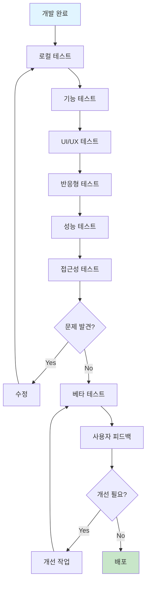

### 8단계 개발 프로세스

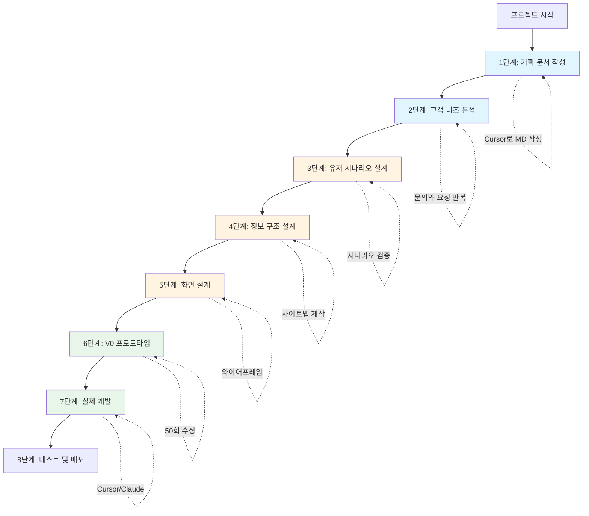

---

## 1단계: 기획 문서 작성 (Cursor + MD)

### 목표
프로젝트의 모든 요구사항을 문서화하여 명확한 개발 방향 설정

### 작성 항목

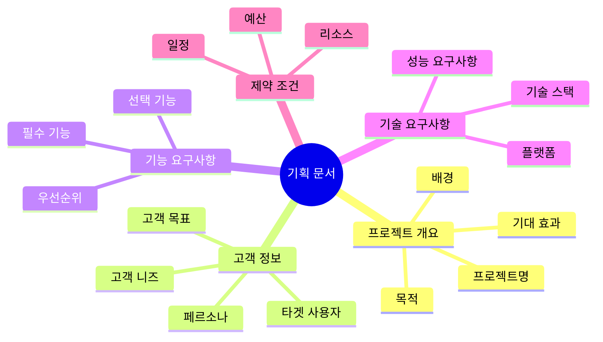

### 기획 문서 템플릿

```markdown
# [프로젝트명] 기획서

## 1. 프로젝트 개요

### 1.1 프로젝트명
- 정식 명칭: 
- 영문명: 
- 약칭: 

### 1.2 프로젝트 목적
**한 문장 요약**: 

**상세 설명**:
- 왜 이 프로젝트가 필요한가?
- 어떤 문제를 해결하는가?
- 누구에게 도움이 되는가?

### 1.3 프로젝트 배경
- 현재 상황:
- 문제점:
- 기회 요인:

### 1.4 기대 효과
- 사용자 관점:
- 비즈니스 관점:
- 기술적 관점:

---

## 2. 고객 분석

### 2.1 타겟 사용자
**주 타겟**:
- 연령대: 
- 직업/역할: 
- 기술 수준: 
- 사용 환경: 

**부 타겟**:
- 연령대: 
- 직업/역할: 

### 2.2 페르소나

#### 페르소나 1: [이름]
- **나이**: 
- **직업**: 
- **기술 수준**: 
- **목표**: 
- **불편 사항**: 
- **사용 시나리오**: 
- **기대하는 것**: 

#### 페르소나 2: [이름]
- **나이**: 
- **직업**: 
- **기술 수준**: 
- **목표**: 
- **불편 사항**: 
- **사용 시나리오**: 
- **기대하는 것**: 

### 2.3 고객 니즈 (Needs)
1. **핵심 니즈**: 
   - 설명: 
   - 중요도: ⭐⭐⭐⭐⭐

2. **부가 니즈**: 
   - 설명: 
   - 중요도: ⭐⭐⭐⭐

3. **잠재 니즈**: 
   - 설명: 
   - 중요도: ⭐⭐⭐

### 2.4 고객 목표 (Goals)
- **단기 목표** (서비스 사용 직후): 
- **중기 목표** (1-3개월): 
- **장기 목표** (6개월 이상): 

---

## 3. 기능 요구사항

### 3.1 핵심 기능 (Must Have)
| 번호 | 기능명 | 설명 | 우선순위 | 난이도 |
|------|--------|------|----------|--------|
| 1 | | | 높음 | 중 |
| 2 | | | 높음 | 높음 |
| 3 | | | 높음 | 낮음 |

### 3.2 추가 기능 (Nice to Have)
| 번호 | 기능명 | 설명 | 우선순위 | 난이도 |
|------|--------|------|----------|--------|
| 1 | | | 중간 | 중 |
| 2 | | | 낮음 | 낮음 |

### 3.3 주요 알고리즘
**알고리즘 1**: [이름]
- **목적**: 
- **입력**: 
- **처리**: 
- **출력**: 
- **예시**: 

**알고리즘 2**: [이름]
- **목적**: 
- **입력**: 
- **처리**: 
- **출력**: 
- **예시**: 

---

## 4. 기술 요구사항

### 4.1 플랫폼
- [ ] 웹 (Desktop)
- [ ] 웹 (Mobile)
- [ ] iOS 앱
- [ ] Android 앱
- [ ] 크로스 플랫폼

### 4.2 기술 스택
**프론트엔드**:
- 프레임워크: 
- 상태 관리: 
- 스타일링: 

**백엔드** (필요 시):
- 서버: 
- 데이터베이스: 
- 인증: 

**데이터 저장**:
- [ ] LocalStorage
- [ ] JSON 파일
- [ ] Firebase
- [ ] Supabase
- [ ] 기타: 

### 4.3 성능 요구사항
- 초기 로딩 시간: 3초 이내
- 페이지 전환 시간: 1초 이내
- 지원 브라우저: Chrome, Safari, Firefox 최신 버전
- 반응형: 모바일, 태블릿, 데스크톱

---

## 5. 제약 조건

### 5.1 일정
- 기획 기간: 
- 디자인 기간: 
- 개발 기간: 
- 테스트 기간: 
- 총 기간: 

### 5.2 리소스
- 개발 인원: 
- 디자이너: 
- 기획자: 

### 5.3 기타 제약
- 예산: 
- 기술적 제약: 
- 법적 제약: 

---

## 6. 성공 지표

### 6.1 정량적 지표
- 사용자 수: 
- 활성 사용자 수: 
- 사용 빈도: 
- 평균 사용 시간: 

### 6.2 정성적 지표
- 사용자 만족도: 
- NPS (Net Promoter Score): 
- 피드백 점수: 

---

## 7. 참고 자료
- 경쟁 서비스: 
- 레퍼런스 사이트: 
- 관련 문서: 
```

---

## 2단계: 고객 니즈 분석

### 고객 인터뷰 프로세스

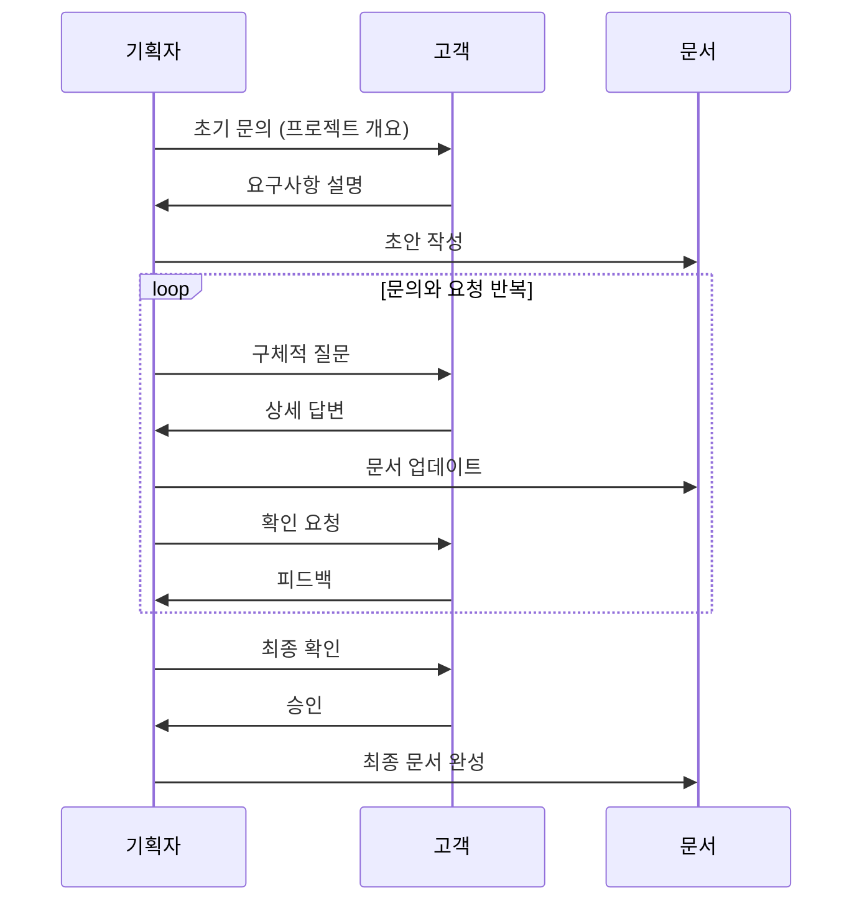

### 핵심 질문 리스트

#### 1. 프로젝트 목적 파악
```
Q1. 이 프로젝트를 통해 궁극적으로 달성하고 싶은 것은 무엇인가요?
Q2. 현재 어떤 문제나 불편함이 있나요?
Q3. 이 문제가 해결되면 어떤 변화가 생기나요?
Q4. 왜 지금 이 프로젝트가 필요한가요?
```

#### 2. 사용자 이해
```
Q5. 주요 사용자는 누구인가요? (연령, 직업, 기술 수준)
Q6. 사용자들은 언제, 어디서, 어떻게 이 서비스를 사용하나요?
Q7. 사용자들의 가장 큰 불편 사항은 무엇인가요?
Q8. 사용자들이 가장 원하는 기능은 무엇인가요?
```

#### 3. 기능 우선순위
```
Q9. 반드시 있어야 하는 기능은 무엇인가요? (Must Have)
Q10. 있으면 좋은 기능은 무엇인가요? (Nice to Have)
Q11. 나중에 추가해도 되는 기능은 무엇인가요?
Q12. 절대 하지 말아야 할 것은 무엇인가요?
```

#### 4. 성공 기준
```
Q13. 이 프로젝트가 성공했다고 판단하는 기준은 무엇인가요?
Q14. 출시 후 어떤 지표를 측정하고 싶으신가요?
Q15. 사용자가 어떤 행동을 하면 만족하실 건가요?
```

#### 5. 제약 조건
```
Q16. 언제까지 완성되어야 하나요?
Q17. 예산이나 리소스 제약이 있나요?
Q18. 기술적으로 반드시 사용해야 하는 것이 있나요?
Q19. 법적, 정책적 제약 사항이 있나요?
```

### 니즈 분석 프레임워크

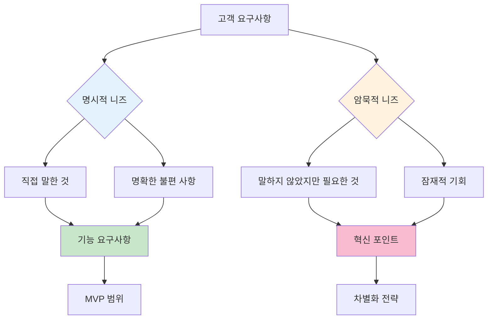

---

## 3단계: 유저 시나리오 설계

### 유저 시나리오란?
사용자가 서비스를 사용하는 전체 과정을 **이야기 형식**으로 구체적으로 기술한 것

### 유저 시나리오 작성 프로세스

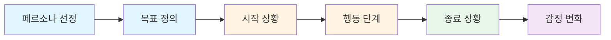

### 유저 시나리오 템플릿

```markdown
## 유저 시나리오 #1: [시나리오 제목]

### 페르소나
**이름**: 김민수 (25세, 대학생)
**기술 수준**: 중급
**사용 환경**: 주로 모바일, 이동 중

### 목표
스터디 그룹을 찾아서 가입하고 첫 모임에 참여하기

### 시작 상황
- **언제**: 월요일 오후 2시, 학교 도서관에서
- **어디서**: 스마트폰으로
- **왜**: 다음 주 중간고사 대비를 위해 스터디 그룹 필요
- **감정 상태**: 😰 걱정됨, 혼자 공부하기 힘듦

### 행동 단계

#### 1단계: 서비스 발견 및 접속
**행동**: 
- 친구 추천으로 서비스 링크 받음
- 링크 클릭하여 홈페이지 접속

**생각**: 
"이게 정말 도움이 될까? 한번 써보자"

**감정**: 😐 중립적, 약간 기대

**터치포인트**: 
- 홈페이지 첫 화면
- 서비스 소개 문구

**기대사항**: 
- 3초 이내 로딩
- 명확한 서비스 설명
- 쉬운 시작 버튼

---

#### 2단계: 회원가입
**행동**: 
- "시작하기" 버튼 클릭
- 소셜 로그인 (구글) 선택
- 기본 정보 입력 (학교, 학년, 관심 과목)

**생각**: 
"회원가입이 간단하네, 좋아"

**감정**: 🙂 긍정적

**터치포인트**: 
- 회원가입 폼
- 소셜 로그인 버튼
- 프로필 설정 화면

**기대사항**: 
- 1분 이내 가입 완료
- 최소한의 정보만 입력
- 소셜 로그인 지원

**Pain Point**: 
- 너무 많은 정보 요구 시 이탈
- 복잡한 인증 절차

---

#### 3단계: 스터디 그룹 검색
**행동**: 
- 메인 화면에서 "경영학 원론" 검색
- 필터 적용 (시간대: 저녁, 위치: 학교 근처)
- 검색 결과 확인

**생각**: 
"오, 생각보다 많은 그룹이 있네"

**감정**: 😊 기대감 상승

**터치포인트**: 
- 검색바
- 필터 옵션
- 검색 결과 리스트

**기대사항**: 
- 즉시 검색 결과 표시
- 관련성 높은 결과
- 명확한 그룹 정보 (인원, 시간, 장소)

---

#### 4단계: 그룹 상세 정보 확인
**행동**: 
- 관심 가는 그룹 카드 클릭
- 그룹 소개, 멤버, 일정 확인
- 리뷰/평점 확인

**생각**: 
"이 그룹은 나랑 잘 맞을 것 같아"

**감정**: 😃 확신

**터치포인트**: 
- 그룹 상세 페이지
- 멤버 프로필
- 일정 캘린더
- 리뷰 섹션

**기대사항**: 
- 그룹의 분위기를 파악할 수 있는 정보
- 실제 멤버들의 후기
- 명확한 가입 조건

---

#### 5단계: 그룹 가입 신청
**행동**: 
- "가입 신청" 버튼 클릭
- 간단한 자기소개 작성
- 신청 완료

**생각**: 
"승인되면 좋겠다"

**감정**: 🤞 기대와 긴장

**터치포인트**: 
- 가입 신청 버튼
- 자기소개 입력 폼
- 신청 완료 확인 화면

**기대사항**: 
- 간단한 신청 절차
- 신청 후 알림 받기
- 승인 예상 시간 안내

---

#### 6단계: 승인 대기 및 알림 받기
**행동**: 
- 앱을 나가서 다른 일 함
- 1시간 후 푸시 알림 받음
- 알림 클릭하여 앱 재접속

**생각**: 
"오, 벌써 승인됐네!"

**감정**: 😄 기쁨

**터치포인트**: 
- 푸시 알림
- 알림 센터

**기대사항**: 
- 빠른 승인 (당일 내)
- 명확한 알림 메시지
- 다음 단계 안내

---

#### 7단계: 첫 모임 참여
**행동**: 
- 그룹 채팅방 입장
- 인사 메시지 작성
- 다음 모임 일정 확인
- 캘린더에 일정 추가

**생각**: 
"좋은 사람들 같아, 잘 선택한 것 같아"

**감정**: 😊 만족

**터치포인트**: 
- 그룹 채팅
- 일정 캘린더
- 캘린더 연동 기능

**기대사항**: 
- 활발한 커뮤니케이션
- 명확한 모임 정보
- 쉬운 일정 관리

---

### 종료 상황
- **결과**: 스터디 그룹 가입 완료, 첫 모임 일정 확정
- **소요 시간**: 약 15분
- **최종 감정**: 😊 만족, 기대감
- **다음 행동**: 첫 모임 참여, 친구에게 추천

### 감정 변화 그래프

😰 → 😐 → 🙂 → 😊 → 😃 → 🤞 → 😄 → 😊

### 핵심 인사이트
1. **빠른 시작이 중요**: 3분 이내 검색까지 도달해야 함
2. **신뢰 구축**: 리뷰와 멤버 정보가 의사결정에 중요
3. **즉각적 피드백**: 신청 후 빠른 승인과 알림 필수
4. **커뮤니케이션**: 가입 후 즉시 소통 가능해야 함

### 개선 포인트
- [ ] 소셜 로그인 우선 제공
- [ ] 검색 결과에 더 많은 정보 표시
- [ ] 그룹장에게 빠른 승인 유도 알림
- [ ] 가입 후 온보딩 가이드 제공
```

### 다양한 시나리오 작성

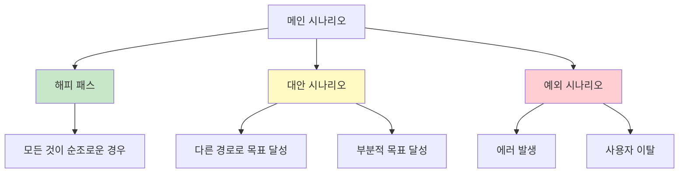

---

## 4단계: 정보 구조 설계 (사이트맵)

### 사이트맵이란?
웹사이트/앱의 모든 페이지와 그 계층 구조를 시각화한 다이어그램

### 사이트맵 작성 프로세스

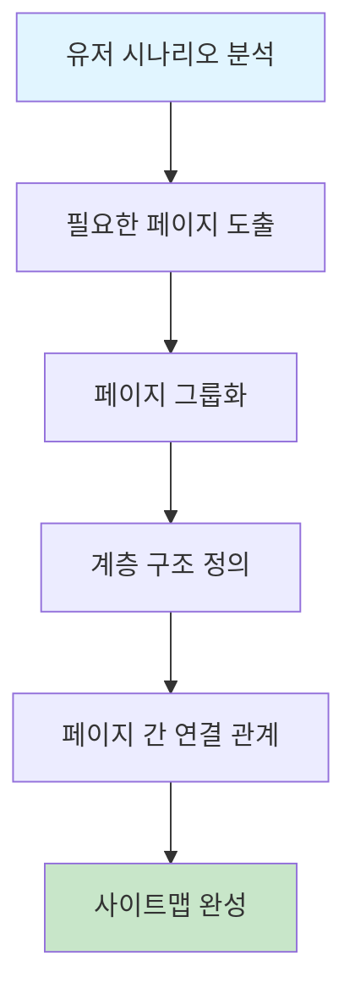

### 사이트맵 예시: 스터디 매칭 플랫폼

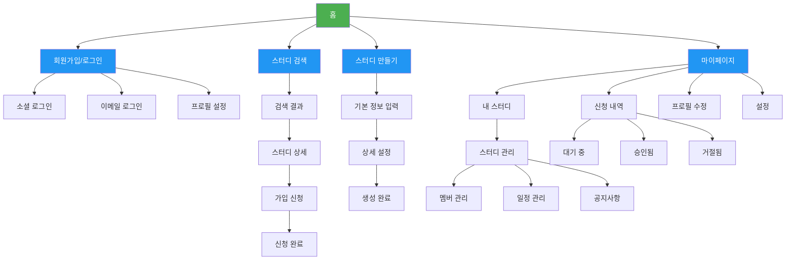

### 사이트맵 작성 가이드

#### 1. 페이지 분류

| 분류 | 설명 | 예시 |
|------|------|------|
| **인증 페이지** | 로그인, 회원가입 관련 | 로그인, 회원가입, 비밀번호 찾기 |
| **메인 페이지** | 서비스의 핵심 기능 | 홈, 검색, 목록 |
| **상세 페이지** | 개별 항목의 상세 정보 | 스터디 상세, 프로필 상세 |
| **작성/수정 페이지** | 데이터 입력 및 수정 | 스터디 만들기, 프로필 수정 |
| **마이 페이지** | 개인화된 정보 | 내 스터디, 신청 내역, 설정 |
| **관리 페이지** | 운영 및 관리 기능 | 멤버 관리, 신청 승인 |

#### 2. 페이지 정보 시트

```markdown
### 페이지 정보 시트

#### 1. 홈 (Home)
- **URL**: `/`
- **목적**: 서비스 소개 및 주요 기능 접근
- **주요 요소**:
  - 히어로 섹션 (서비스 소개)
  - 검색바
  - 인기 스터디 목록
  - CTA 버튼 (시작하기, 스터디 만들기)
- **접근 권한**: 모두
- **연결 페이지**: 검색, 로그인, 스터디 만들기

#### 2. 회원가입 (Sign Up)
- **URL**: `/signup`
- **목적**: 신규 사용자 등록
- **주요 요소**:
  - 소셜 로그인 버튼 (구글, 카카오)
  - 이메일 가입 폼
  - 이용약관 동의
- **접근 권한**: 비로그인 사용자
- **연결 페이지**: 프로필 설정, 홈

#### 3. 스터디 검색 (Search)
- **URL**: `/search`
- **목적**: 원하는 스터디 찾기
- **주요 요소**:
  - 검색바
  - 필터 (카테고리, 시간, 위치, 인원)
  - 검색 결과 카드 리스트
  - 정렬 옵션
- **접근 권한**: 모두
- **연결 페이지**: 스터디 상세

#### 4. 스터디 상세 (Study Detail)
- **URL**: `/study/:id`
- **목적**: 스터디 상세 정보 확인
- **주요 요소**:
  - 스터디 정보 (제목, 설명, 일정, 장소)
  - 그룹장 프로필
  - 멤버 리스트
  - 리뷰/평점
  - 가입 신청 버튼
- **접근 권한**: 모두 (가입 신청은 로그인 필요)
- **연결 페이지**: 가입 신청, 로그인

#### 5. 가입 신청 (Apply)
- **URL**: `/study/:id/apply`
- **목적**: 스터디 가입 신청
- **주요 요소**:
  - 자기소개 입력
  - 참여 가능 시간 선택
  - 신청 이유 작성
  - 제출 버튼
- **접근 권한**: 로그인 사용자
- **연결 페이지**: 신청 완료, 마이페이지

... (모든 페이지 작성)
```

### 내비게이션 구조

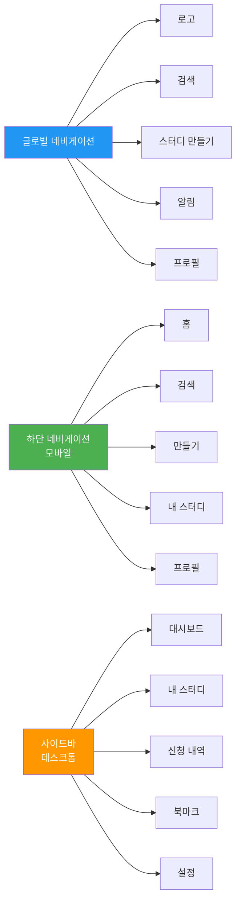

---

## 5단계: 화면 설계 (와이어프레임)

### 와이어프레임이란?
페이지의 레이아웃과 요소 배치를 **저해상도**로 표현한 설계도

### 화면 설계 프로세스

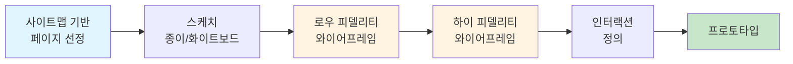

### 화면 설계 템플릿

```markdown
## 화면 설계: [페이지명]

### 화면 정보
- **화면 ID**: SCR-001
- **화면명**: 홈 화면
- **URL**: `/`
- **접근 권한**: 모두
- **디바이스**: 모바일 우선, 반응형

### 레이아웃 구조

┌─────────────────────────────────┐
│         Header (고정)            │
│  [로고]  [검색]  [알림]  [프로필]│
├─────────────────────────────────┤
│                                 │
│         Hero Section            │
│                                 │
│   "완벽한 스터디 그룹을 찾아보세요" │
│                                 │
│   [        검색바         ] 🔍  │
│                                 │
├─────────────────────────────────┤
│                                 │
│      카테고리 필터 (가로 스크롤)  │
│  [전체] [개발] [디자인] [언어]   │
│                                 │
├─────────────────────────────────┤
│                                 │
│       인기 스터디 그룹            │
│                                 │
│  ┌─────────┐  ┌─────────┐      │
│  │ 📚      │  │ 💻      │      │
│  │ React   │  │ Python  │      │
│  │ 스터디   │  │ 스터디   │      │
│  │ ⭐4.8   │  │ ⭐4.9   │      │
│  │ 5/10명  │  │ 8/12명  │      │
│  └─────────┘  └─────────┘      │
│                                 │
│  ┌─────────┐  ┌─────────┐      │
│  │ 🎨      │  │ 📝      │      │
│  │ Figma   │  │ 글쓰기   │      │
│  │ 스터디   │  │ 스터디   │      │
│  │ ⭐4.7   │  │ ⭐5.0   │      │
│  │ 3/8명   │  │ 6/10명  │      │
│  └─────────┘  └─────────┘      │
│                                 │
├─────────────────────────────────┤
│                                 │
│       새로운 스터디 그룹          │
│  (위와 동일한 카드 레이아웃)      │
│                                 │
├─────────────────────────────────┤
│         Footer                  │
│  회사 소개 | 이용약관 | 개인정보  │
└─────────────────────────────────┘

### 주요 컴포넌트

#### 1. Header
**위치**: 상단 고정
**높이**: 60px (모바일), 80px (데스크톱)
**요소**:
- 로고 (좌측)
- 검색 아이콘 (중앙)
- 알림 아이콘 (우측)
- 프로필 아이콘 (최우측)

**인터랙션**:
- 스크롤 시 배경 불투명도 증가
- 로고 클릭 → 홈으로 이동
- 검색 클릭 → 검색 페이지로 이동
- 알림 클릭 → 알림 드롭다운 표시
- 프로필 클릭 → 프로필 메뉴 표시

#### 2. Hero Section
**위치**: 상단, Header 아래
**높이**: 300px (모바일), 400px (데스크톱)
**요소**:
- 메인 문구 (H1)
- 부제목 (P)
- 검색바
- 검색 버튼

**인터랙션**:
- 검색바 포커스 시 확대 애니메이션
- 검색어 입력 시 자동완성 제안
- 엔터 또는 버튼 클릭 → 검색 결과 페이지

#### 3. 스터디 카드
**크기**: 
- 모바일: 전체 너비 - 32px (양쪽 여백)
- 태블릿: 2열 그리드
- 데스크톱: 4열 그리드

**요소**:
- 카테고리 아이콘
- 스터디 제목
- 평점 (별점)
- 현재 인원 / 최대 인원
- 북마크 버튼 (우측 상단)

**인터랙션**:
- 카드 호버 시 그림자 효과
- 카드 클릭 → 상세 페이지 이동
- 북마크 버튼 클릭 → 북마크 추가/제거 (로그인 필요)

### 반응형 레이아웃

#### 모바일 (< 768px)
- 1열 레이아웃
- 하단 네비게이션 바 표시
- 햄버거 메뉴

#### 태블릿 (768px ~ 1024px)
- 2열 그리드
- 상단 네비게이션 바
- 사이드바 접기 가능

#### 데스크톱 (> 1024px)
- 4열 그리드
- 고정 사이드바
- 확장된 네비게이션

### 상태별 화면

#### 로딩 상태
- 스켈레톤 UI 표시
- 카드 위치에 회색 박스 애니메이션

#### 빈 상태 (Empty State)
- 일러스트레이션
- "아직 스터디 그룹이 없습니다"
- "첫 번째 스터디를 만들어보세요" 버튼

#### 에러 상태
- 에러 아이콘
- 에러 메시지
- "다시 시도" 버튼

### 접근성 (Accessibility)
- [ ] 키보드 네비게이션 지원
- [ ] 스크린 리더 호환
- [ ] 충분한 색상 대비 (WCAG AA 이상)
- [ ] 포커스 인디케이터 명확
- [ ] Alt 텍스트 제공

### 성능 고려사항
- [ ] 이미지 Lazy Loading
- [ ] 무한 스크롤 또는 페이지네이션
- [ ] 캐싱 전략
- [ ] 초기 로딩 최적화 (3초 이내)
```

### 주요 화면 플로우

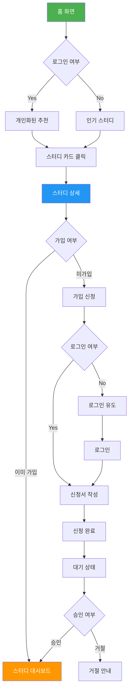

---

## 6단계: V0 프로토타입 제작

### V0 활용 전략

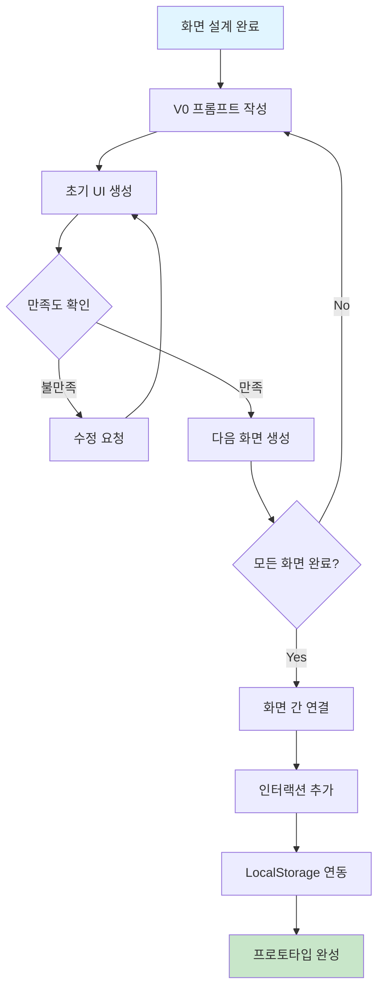

### V0 프롬프트 작성 가이드

#### 효과적인 프롬프트 구조

```markdown
### V0 프롬프트 템플릿

[화면명] 화면을 만들어줘.

**레이아웃**:
- 상단: [구체적 요소 나열]
- 중앙: [구체적 요소 나열]
- 하단: [구체적 요소 나열]

**주요 컴포넌트**:
1. [컴포넌트명]: [상세 설명]
2. [컴포넌트명]: [상세 설명]

**스타일**:
- 색상: [메인 컬러, 보조 컬러]
- 폰트: [폰트 스타일]
- 분위기: [키워드]

**인터랙션**:
- [요소] 클릭 시: [동작]
- [요소] 호버 시: [효과]

**반응형**:
- 모바일: [레이아웃 설명]
- 데스크톱: [레이아웃 설명]

**데이터**:
- [데이터 타입]: [예시 데이터]
```

#### 실제 프롬프트 예시

```
스터디 매칭 플랫폼의 홈 화면을 만들어줘.

**레이아웃**:
- 상단: 로고(좌측), 검색바(중앙), 알림 아이콘, 프로필 아이콘(우측)
- 히어로 섹션: 큰 제목 "완벽한 스터디 그룹을 찾아보세요", 검색바, 배경 그라데이션
- 카테고리 필터: 가로 스크롤 가능한 칩 버튼들 (전체, 개발, 디자인, 언어, 비즈니스)
- 스터디 카드 그리드: 2열(모바일), 4열(데스크톱)

**주요 컴포넌트**:
1. 스터디 카드: 
   - 카테고리 아이콘 (상단)
   - 스터디 제목 (H3)
   - 짧은 설명 (2줄 말줄임)
   - 평점 (별 아이콘 + 숫자)
   - 현재 인원 / 최대 인원
   - 북마크 아이콘 (우측 상단)
   - 카드 호버 시 살짝 떠오르는 효과

2. 검색바:
   - 돋보기 아이콘 (좌측)
   - 플레이스홀더: "관심 있는 주제를 검색하세요"
   - 검색 버튼 (우측)

**스타일**:
- 메인 컬러: #3B82F6 (파란색)
- 보조 컬러: #10B981 (초록색)
- 배경: 흰색, 밝은 회색 (#F9FAFB)
- 폰트: 산세리프, 깔끔하고 모던한 느낌
- 카드: 흰색 배경, 미세한 그림자, 둥근 모서리 (12px)

**인터랙션**:
- 카드 호버: transform translateY(-4px), 그림자 진하게
- 북마크 클릭: 색상 변경 (회색 → 파란색)
- 카테고리 칩 클릭: 배경색 변경, 필터링 애니메이션

**반응형**:
- 모바일 (< 768px): 1열, 하단 네비게이션 바
- 태블릿 (768-1024px): 2열
- 데스크톱 (> 1024px): 4열, 사이드바 표시

**샘플 데이터**:
- 스터디 1: "React 마스터 스터디", 개발, ⭐4.8, 5/10명
- 스터디 2: "Python 기초반", 개발, ⭐4.9, 8/12명
- 스터디 3: "Figma UI 디자인", 디자인, ⭐4.7, 3/8명
- 스터디 4: "영어 회화 스터디", 언어, ⭐5.0, 6/10명
```

### V0 수정 전략 (50회 반복)

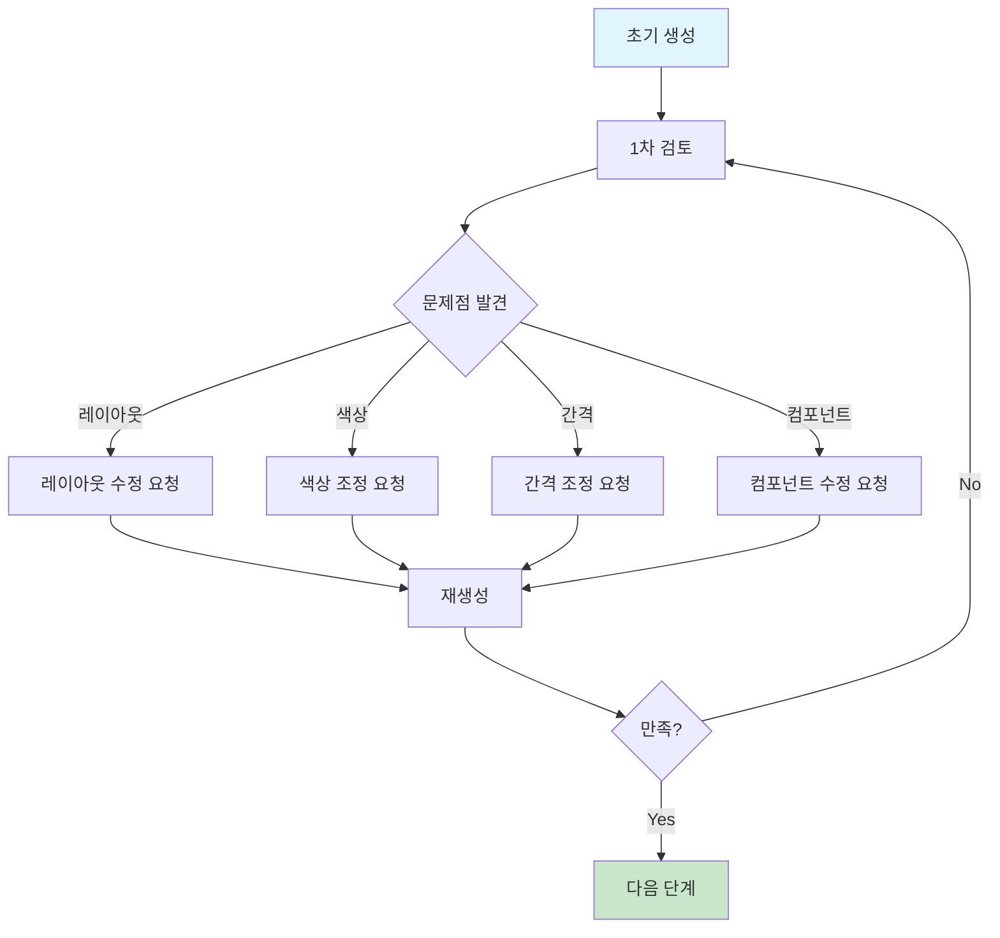

#### 수정 요청 예시

```markdown
### 1-10회: 전체 레이아웃 조정
"히어로 섹션의 높이를 줄이고, 카드 그리드를 더 위로 올려줘"
"검색바를 더 크게 만들고 중앙에 배치해줘"
"카드 간격을 좀 더 넓혀줘"

### 11-20회: 컴포넌트 디테일
"스터디 카드에 태그를 추가해줘 (예: #온라인, #주말)"
"평점 별 아이콘을 더 크게 만들어줘"
"북마크 아이콘 위치를 카드 우측 상단으로 이동해줘"

### 21-30회: 색상 및 스타일
"메인 컬러를 좀 더 진한 파란색으로 변경해줘"
"카드 그림자를 더 부드럽게 만들어줘"
"폰트 크기를 전체적으로 1px씩 키워줘"

### 31-40회: 인터랙션 추가
"카드 호버 시 배경색이 살짝 변하도록 해줘"
"카테고리 칩 클릭 시 선택 상태를 표시해줘"
"로딩 스켈레톤 UI를 추가해줘"

### 41-50회: 반응형 및 최적화
"모바일에서 카드 크기를 조정해줘"
"태블릿 레이아웃을 개선해줘"
"이미지 로딩을 최적화해줘"
```

### LocalStorage 활용 전략

```javascript
// LocalStorage 데이터 구조 설계

// 1. 사용자 데이터
const user = {
  id: "user123",
  name: "김민수",
  email: "minsu@example.com",
  profile: {
    school: "서울대학교",
    major: "컴퓨터공학",
    interests: ["개발", "디자인"]
  },
  createdAt: "2025-01-01"
};

// 2. 스터디 데이터
const studies = [
  {
    id: "study001",
    title: "React 마스터 스터디",
    category: "개발",
    description: "React를 처음부터 끝까지",
    maxMembers: 10,
    currentMembers: 5,
    rating: 4.8,
    tags: ["온라인", "주말", "초급"],
    schedule: {
      days: ["토", "일"],
      time: "14:00-16:00"
    },
    location: "온라인",
    createdBy: "user456",
    createdAt: "2025-01-15"
  }
];

// 3. 신청 데이터
const applications = [
  {
    id: "app001",
    studyId: "study001",
    userId: "user123",
    status: "pending", // pending, approved, rejected
    message: "React를 배우고 싶습니다!",
    appliedAt: "2025-01-20"
  }
];

// 4. 북마크 데이터
const bookmarks = [
  {
    userId: "user123",
    studyId: "study001",
    bookmarkedAt: "2025-01-18"
  }
];

// LocalStorage 저장/불러오기 함수
const storage = {
  // 저장
  save: (key, data) => {
    localStorage.setItem(key, JSON.stringify(data));
  },
  
  // 불러오기
  load: (key) => {
    const data = localStorage.getItem(key);
    return data ? JSON.parse(data) : null;
  },
  
  // 삭제
  remove: (key) => {
    localStorage.removeItem(key);
  },
  
  // 전체 삭제
  clear: () => {
    localStorage.clear();
  }
};

// 사용 예시
storage.save('user', user);
storage.save('studies', studies);
storage.save('applications', applications);
storage.save('bookmarks', bookmarks);
```

### JSON 파일 활용 전략

```javascript
// public/data/studies.json
{
  "studies": [
    {
      "id": "study001",
      "title": "React 마스터 스터디",
      "category": "개발",
      "description": "React를 처음부터 끝까지 마스터하는 스터디입니다.",
      "maxMembers": 10,
      "currentMembers": 5,
      "rating": 4.8,
      "reviews": 24,
      "tags": ["온라인", "주말", "초급"],
      "schedule": {
        "days": ["토", "일"],
        "time": "14:00-16:00"
      },
      "location": "온라인",
      "leader": {
        "id": "user456",
        "name": "이지은",
        "avatar": "/avatars/user456.jpg"
      },
      "members": [
        {
          "id": "user789",
          "name": "박철수",
          "avatar": "/avatars/user789.jpg"
        }
      ],
      "createdAt": "2025-01-15"
    }
  ]
}

// 데이터 불러오기
async function loadStudies() {
  try {
    const response = await fetch('/data/studies.json');
    const data = await response.json();
    return data.studies;
  } catch (error) {
    console.error('데이터 로딩 실패:', error);
    return [];
  }
}
```

---

## 7단계: 실제 개발 (Cursor + Claude)

### 개발 프로세스

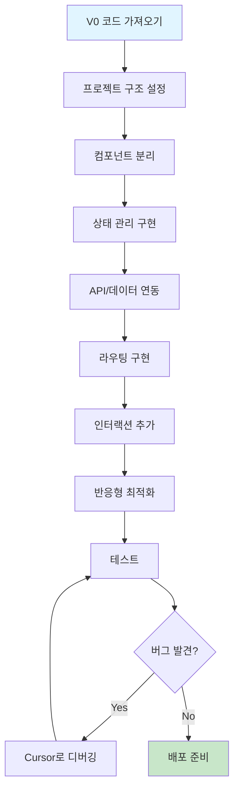

### Cursor 활용 전략

#### 1. 프로젝트 초기 설정

**Cursor 프롬프트:**

```
Next.js 14 프로젝트를 생성하고 다음 구조로 설정해줘:

프로젝트 구조:
src/
├── app/
│   ├── layout.tsx
│   ├── page.tsx
│   ├── search/
│   ├── study/[id]/
│   └── profile/
├── components/
│   ├── common/
│   │   ├── Header.tsx
│   │   ├── Footer.tsx
│   │   └── Button.tsx
│   ├── study/
│   │   ├── StudyCard.tsx
│   │   ├── StudyList.tsx
│   │   └── StudyDetail.tsx
│   └── ui/
│       ├── Input.tsx
│       ├── Modal.tsx
│       └── Skeleton.tsx
├── lib/
│   ├── storage.ts
│   ├── api.ts
│   └── utils.ts
├── types/
│   └── index.ts
└── styles/
    └── globals.css

기술 스택:
- Next.js 14 (App Router)
- TypeScript
- Tailwind CSS
- Zustand (상태 관리)
- React Hook Form (폼 관리)

초기 설정:
- ESLint, Prettier 설정
- TypeScript strict 모드
- Tailwind CSS 설정
- 절대 경로 import (@/ 사용)
```

#### 2. 컴포넌트 개발

**Cursor 프롬프트:**

```
StudyCard 컴포넌트를 만들어줘.

Props (TypeScript):
interface StudyCardProps {
  id: string;
  title: string;
  category: string;
  description: string;
  rating: number;
  currentMembers: number;
  maxMembers: number;
  tags: string[];
  isBookmarked: boolean;
  onBookmark: (id: string) => void;
  onClick: (id: string) => void;
}

요구사항:
1. 카드 레이아웃:
   - 카테고리 아이콘 (상단)
   - 제목 (H3, 1줄 말줄임)
   - 설명 (2줄 말줄임)
   - 평점 (별 아이콘 + 숫자)
   - 인원 (현재/최대)
   - 태그들 (최대 3개 표시)
   - 북마크 버튼 (우측 상단)

2. 스타일:
   - Tailwind CSS 사용
   - 카드: 흰색 배경, 그림자, 둥근 모서리
   - 호버: translateY(-4px), 그림자 진하게

3. 인터랙션:
   - 카드 클릭 → onClick 호출
   - 북마크 클릭 → onBookmark 호출 (이벤트 버블링 방지)
   - 호버 애니메이션

4. 반응형:
   - 모바일: 전체 너비
   - 태블릿: 2열 그리드
   - 데스크톱: 4열 그리드

5. 접근성:
   - 키보드 네비게이션
   - ARIA 레이블
   - 포커스 인디케이터
```

#### 3. 상태 관리

**Cursor 프롬프트:**

```
Zustand를 사용하여 전역 상태 관리 스토어를 만들어줘.

필요한 상태:
1. user: 현재 로그인한 사용자 정보
2. studies: 스터디 목록
3. bookmarks: 북마크한 스터디 ID 배열
4. applications: 신청한 스터디 정보

필요한 액션:
1. setUser: 사용자 정보 설정
2. addBookmark: 북마크 추가
3. removeBookmark: 북마크 제거
4. applyStudy: 스터디 신청
5. loadStudies: 스터디 목록 불러오기

LocalStorage 연동:
- 상태 변경 시 자동으로 LocalStorage에 저장
- 초기 로드 시 LocalStorage에서 복원

타입 정의도 함께 작성해줘.
```

#### 4. 라우팅 및 페이지

**Cursor 프롬프트:**

```
Next.js App Router를 사용하여 다음 페이지들을 만들어줘:

1. 홈 페이지 (app/page.tsx):
   - StudyList 컴포넌트 사용
   - 검색바
   - 카테고리 필터
   - 무한 스크롤

2. 검색 페이지 (app/search/page.tsx):
   - 검색 결과 표시
   - 필터링 옵션
   - 정렬 기능

3. 스터디 상세 페이지 (app/study/[id]/page.tsx):
   - 동적 라우팅
   - 스터디 상세 정보
   - 가입 신청 버튼
   - 리뷰 섹션

4. 프로필 페이지 (app/profile/page.tsx):
   - 내 정보
   - 내 스터디 목록
   - 신청 내역

각 페이지에 로딩 상태(loading.tsx)와 에러 상태(error.tsx)도 추가해줘.
```

#### 5. 인터랙션 및 애니메이션

**Cursor 프롬프트:**

```
다음 인터랙션을 구현해줘:

1. 검색 자동완성:
   - 입력 시 debounce (300ms)
   - 추천 검색어 드롭다운
   - 키보드 네비게이션 (↑↓ 키)

2. 북마크 애니메이션:
   - 클릭 시 하트 아이콘 애니메이션
   - 낙관적 업데이트 (Optimistic Update)
   - 에러 시 롤백

3. 무한 스크롤:
   - Intersection Observer 사용
   - 하단 도달 시 다음 페이지 로드
   - 로딩 스피너 표시

4. 모달:
   - 가입 신청 모달
   - 배경 클릭 시 닫기
   - ESC 키로 닫기
   - 포커스 트랩

Framer Motion을 사용하여 부드러운 애니메이션을 추가해줘.
```

### 개발 체크리스트

```markdown
## 개발 완료 체크리스트

### 기능 구현
- [ ] 모든 페이지 라우팅 동작
- [ ] 검색 기능 정상 작동
- [ ] 필터링 기능 정상 작동
- [ ] 북마크 추가/제거 동작
- [ ] 스터디 신청 기능 동작
- [ ] LocalStorage 데이터 저장/불러오기
- [ ] 로그인/로그아웃 기능

### UI/UX
- [ ] 모든 화면 디자인 완성
- [ ] 반응형 레이아웃 (모바일/태블릿/데스크톱)
- [ ] 로딩 상태 표시
- [ ] 에러 상태 표시
- [ ] 빈 상태 (Empty State) 표시
- [ ] 호버 효과 및 애니메이션
- [ ] 포커스 인디케이터

### 성능
- [ ] 초기 로딩 3초 이내
- [ ] 페이지 전환 1초 이내
- [ ] 이미지 최적화 (Next.js Image)
- [ ] 코드 스플리팅
- [ ] Lazy Loading

### 접근성
- [ ] 키보드 네비게이션
- [ ] 스크린 리더 호환
- [ ] ARIA 레이블
- [ ] 색상 대비 충분 (WCAG AA)
- [ ] Alt 텍스트

### 코드 품질
- [ ] TypeScript 타입 에러 없음
- [ ] ESLint 에러 없음
- [ ] 컴포넌트 재사용성
- [ ] 코드 주석 (한글)
- [ ] 함수/변수명 명확

### 테스트
- [ ] 주요 사용자 시나리오 테스트
- [ ] 다양한 브라우저 테스트
- [ ] 다양한 디바이스 테스트
- [ ] 에러 케이스 테스트
```

---

## 8단계: 테스트 및 배포

### 테스트 프로세스


### 테스트 시나리오

```markdown
## 테스트 시나리오

### 시나리오 1: 신규 사용자 가입 및 스터디 검색
**목표**: 처음 방문한 사용자가 스터디를 찾아 신청하기까지

**단계**:
1. [ ] 홈페이지 접속 (3초 이내 로딩)
2. [ ] 서비스 소개 확인
3. [ ] "시작하기" 버튼 클릭
4. [ ] 회원가입 (소셜 로그인)
5. [ ] 프로필 설정
6. [ ] 검색바에 "React" 입력
7. [ ] 자동완성 확인
8. [ ] 검색 결과 확인
9. [ ] 필터 적용 (온라인, 주말)
10. [ ] 스터디 카드 클릭
11. [ ] 상세 정보 확인
12. [ ] "가입 신청" 버튼 클릭
13. [ ] 신청서 작성
14. [ ] 제출 완료
15. [ ] 확인 메시지 표시

**예상 소요 시간**: 5분 이내

**성공 기준**:
- 모든 단계가 막힘 없이 진행
- 명확한 피드백 제공
- 에러 없음

### 시나리오 2: 기존 사용자 스터디 관리
**목표**: 로그인한 사용자가 자신의 스터디를 관리

**단계**:
1. [ ] 로그인
2. [ ] 프로필 페이지 이동
3. [ ] "내 스터디" 탭 클릭
4. [ ] 스터디 목록 확인
5. [ ] 스터디 클릭하여 상세 페이지
6. [ ] 멤버 관리 기능 확인
7. [ ] 신청자 승인/거절
8. [ ] 공지사항 작성
9. [ ] 일정 수정
10. [ ] 변경사항 저장

**성공 기준**:
- 모든 관리 기능 정상 작동
- 변경사항 즉시 반영
- 알림 발송 확인

### 시나리오 3: 모바일 사용자 경험
**목표**: 모바일에서 원활한 사용

**단계**:
1. [ ] 모바일 브라우저로 접속
2. [ ] 반응형 레이아웃 확인
3. [ ] 터치 인터랙션 확인
4. [ ] 하단 네비게이션 사용
5. [ ] 스크롤 성능 확인
6. [ ] 검색 기능 사용
7. [ ] 모달 동작 확인

**성공 기준**:
- 모든 요소가 터치하기 쉬운 크기
- 스크롤 부드러움
- 레이아웃 깨짐 없음
```

### 배포 프로세스

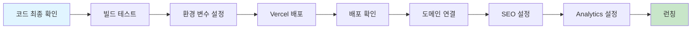

### 배포 체크리스트

```markdown
## 배포 체크리스트

### 빌드 전
- [ ] 모든 기능 테스트 완료
- [ ] TypeScript 에러 없음
- [ ] ESLint 에러 없음
- [ ] 콘솔 에러/경고 없음
- [ ] 불필요한 코드 제거
- [ ] 주석 정리

### 환경 설정
- [ ] 환경 변수 설정 (.env.production)
- [ ] API 키 확인
- [ ] 데이터베이스 연결 확인 (필요 시)

### 빌드 및 배포
- [ ] 로컬 빌드 테스트 (`npm run build`)
- [ ] 빌드 에러 없음
- [ ] Vercel 프로젝트 생성
- [ ] GitHub 연동
- [ ] 자동 배포 설정
- [ ] 배포 성공 확인

### 배포 후
- [ ] 배포된 사이트 접속 확인
- [ ] 모든 페이지 동작 확인
- [ ] 모바일 동작 확인
- [ ] 성능 측정 (Lighthouse)
- [ ] 에러 모니터링 설정

### SEO 및 Analytics
- [ ] 메타 태그 설정
- [ ] Open Graph 이미지
- [ ] sitemap.xml 생성
- [ ] robots.txt 설정
- [ ] Google Analytics 연동
- [ ] Google Search Console 등록

### 도메인 (선택)
- [ ] 커스텀 도메인 구매
- [ ] DNS 설정
- [ ] SSL 인증서 확인
```

---

## 부록: 템플릿 및 체크리스트

### A. 프로젝트 킥오프 미팅 템플릿

```markdown
# 프로젝트 킥오프 미팅

## 일시
YYYY-MM-DD HH:MM

## 참석자
- 기획자: 
- 개발자: 
- 디자이너: 
- 고객: 

## 안건

### 1. 프로젝트 소개
- 프로젝트명: 
- 목적: 
- 기대 효과: 

### 2. 고객 니즈 확인
- 핵심 니즈: 
- 타겟 사용자: 
- 성공 기준: 

### 3. 범위 정의
- 필수 기능: 
- 선택 기능: 
- 제외 사항: 

### 4. 일정 및 마일스톤
- 기획 완료: 
- 디자인 완료: 
- 개발 완료: 
- 테스트 완료: 
- 런칭: 

### 5. 커뮤니케이션
- 정기 미팅: 
- 소통 채널: 
- 문서 공유: 

### 6. 다음 단계
- [ ] 기획서 초안 작성
- [ ] 레퍼런스 수집
- [ ] 다음 미팅 일정
```

### B. 주간 진행 상황 보고 템플릿

```markdown
# 주간 진행 상황 보고

## 기간
YYYY-MM-DD ~ YYYY-MM-DD

## 이번 주 완료 사항
- [ ] 작업 1
- [ ] 작업 2
- [ ] 작업 3

## 다음 주 계획
- [ ] 작업 1
- [ ] 작업 2
- [ ] 작업 3

## 이슈 및 리스크
- 이슈 1: 
  - 영향도: 
  - 해결 방안: 

## 도움 필요 사항
- 

## 전체 진행률
[████████░░] 80%
```

### C. 코드 리뷰 체크리스트

```markdown
## 코드 리뷰 체크리스트

### 기능
- [ ] 요구사항 충족
- [ ] 에지 케이스 처리
- [ ] 에러 처리

### 코드 품질
- [ ] 가독성
- [ ] 재사용성
- [ ] 함수/변수명 명확
- [ ] 주석 (한글)
- [ ] 중복 코드 제거

### 성능
- [ ] 불필요한 렌더링 없음
- [ ] 메모이제이션 적절
- [ ] 이미지 최적화

### 보안
- [ ] XSS 방어
- [ ] 민감 정보 노출 없음
- [ ] 입력 검증

### 접근성
- [ ] 키보드 네비게이션
- [ ] ARIA 레이블
- [ ] 색상 대비
```

---

## 마무리

### 핵심 요약

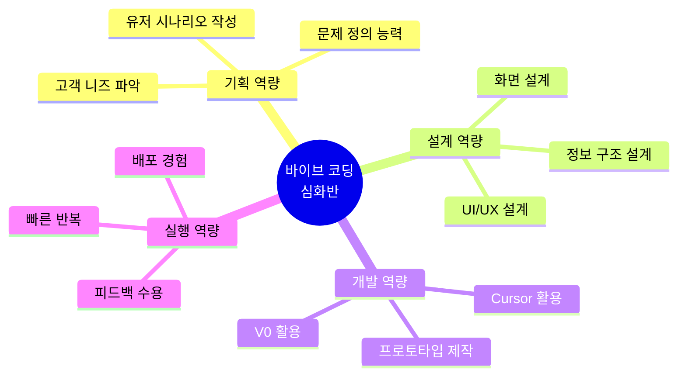

### 성공을 위한 핵심 원칙

1. **고객 중심 사고**: 항상 사용자 관점에서 생각하기
2. **명확한 문서화**: 모든 결정과 과정을 기록하기
3. **빠른 반복**: 완벽보다 빠른 피드백이 중요
4. **AI 협업**: AI를 도구로 활용하되, 판단은 사람이
5. **지속적 개선**: 출시가 끝이 아닌 시작

### 추천 학습 자료

- **UI/UX 디자인**: Refactoring UI, Laws of UX
- **유저 리서치**: The Mom Test
- **프로토타이핑**: V0 Documentation
- **AI 협업**: Cursor Documentation, Claude Prompt Engineering

---

**버전**: 1.0  
**최종 수정일**: 2025-11-20  
**대상**: 바이브 코딩 심화반  
**초점**: 유저 시나리오, 기획, UI/UX 설계

