# 바이브 코딩 주말 8주 집중 프로그램
## Frontend → Backend → AI 통합 완성 과정

---

## 프로그램 개요

### 핵심 컨셉
**"8주 만에 아이디어를 실제 서비스로 만들기"**

- **대상**: 고등학생 심화반
- **기간**: 8주 (주말 4시간 × 8회 = 총 32시간)
- **목표**: 기획부터 AI 기능이 포함된 풀스택 웹 서비스 배포까지

### 프로그램 구조

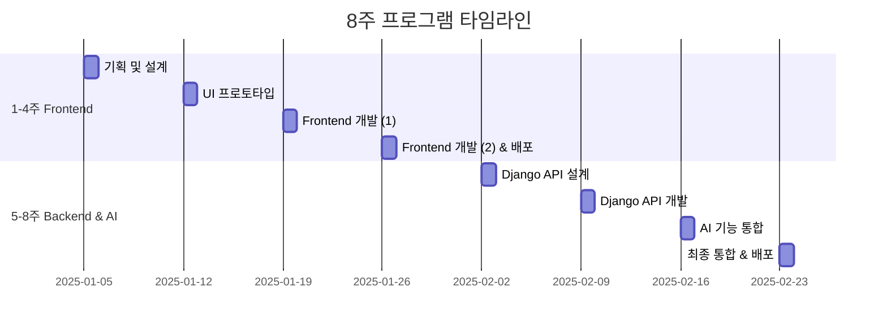

### 학습 목표

#### 1-4주: Frontend (프론트엔드)
- ✅ 문제 정의 및 기획 능력
- ✅ 유저 시나리오 설계
- ✅ UI/UX 디자인 및 프로토타입
- ✅ Next.js 기반 웹 개발
- ✅ Vercel 배포

#### 5-8주: Backend & AI (백엔드 및 AI)
- ✅ Django REST API 설계
- ✅ 데이터베이스 모델링
- ✅ API 엔드포인트 개발
- ✅ AI 기능 통합 (OpenAI, Claude 등)
- ✅ Frontend-Backend 연동
- ✅ 최종 배포 및 운영

---

## 전체 프로세스 플로우

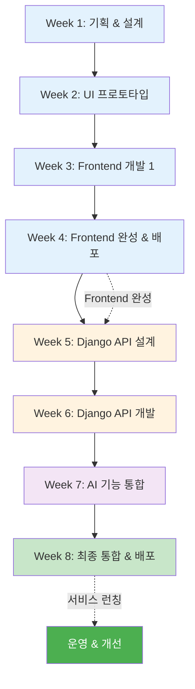

---

## 📅 주차별 상세 커리큘럼

---

## 🎨 PHASE 1: Frontend 개발 (1-4주)

---

## Week 1: 기획 및 설계 (4시간)

### 📋 수업 목표
- 프로젝트 아이디어 구체화
- 유저 시나리오 작성
- 정보 구조 설계
- 기획서 완성

### ⏰ 시간표

| 시간 | 활동 | 내용 | 산출물 |
|------|------|------|--------|
| 0:00-0:30 | 오리엔테이션 | 프로그램 소개, 목표 설정 | - |
| 0:30-1:30 | 아이디어 워크숍 | 문제 발견, 아이디어 발산, 선정 | 아이디어 시트 |
| 1:30-2:30 | 유저 시나리오 작성 | 페르소나, 사용자 여정 지도 | 유저 시나리오 문서 |
| 2:30-3:30 | 정보 구조 설계 | 사이트맵, 기능 명세 | 사이트맵 다이어그램 |
| 3:30-4:00 | 기획서 작성 | 전체 내용 통합, 발표 준비 | 기획서 (MD) |

### 📝 교사 준비사항

#### 사전 준비
- [ ] Cursor 설치 가이드 배포
- [ ] 기획서 템플릿 준비
- [ ] 우수 사례 3개 준비
- [ ] Miro/Figma 계정 안내

#### 필요 자료
- 아이디어 발산 워크시트
- 유저 시나리오 템플릿
- 사이트맵 예시
- 기획서 템플릿

### 🎯 핵심 활동

#### 1. 아이디어 워크숍 (60분)

**활동 1: 문제 발견 (20분)**

```markdown
## 문제 발견 브레인스토밍

### 질문 리스트
1. 일상에서 불편한 점은?
2. 학교/지역에서 개선하고 싶은 것은?
3. 친구들이 자주 하는 불평은?
4. 시간이 오래 걸리는 작업은?
5. 정보를 찾기 어려운 것은?

### 평가 기준
- 심각성: ⭐⭐⭐⭐⭐
- 빈도: ⭐⭐⭐⭐⭐
- 해결 가능성: ⭐⭐⭐⭐⭐
- 차별성: ⭐⭐⭐⭐⭐
```

**활동 2: 아이디어 구체화 (40분)**

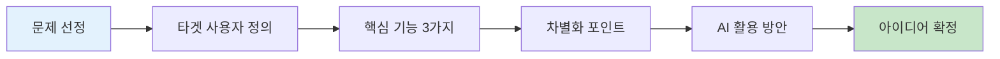

**교사 가이드:**
- 학생들이 너무 큰 아이디어를 선택하지 않도록 주의
- "8주 내 완성 가능한가?" 질문 반복
- 핵심 기능 3개로 제한
- AI 기능은 1-2개로 단순화

#### 2. 유저 시나리오 작성 (60분)

**템플릿 제공:**

```markdown
## 유저 시나리오: [프로젝트명]

### 페르소나
- 이름: 김민수 (18세, 고3)
- 상황: 대입 준비 중
- 목표: [구체적 목표]
- 불편 사항: [현재 문제]

### 사용자 여정

#### 1단계: 문제 인식
- 상황: 
- 감정: 😰
- 생각: 

#### 2단계: 해결책 탐색
- 행동: 
- 감정: 😐
- 생각: 

#### 3단계: 서비스 발견
- 행동: 
- 감정: 🙂
- 생각: 

#### 4단계: 서비스 사용
- 행동: 
- 감정: 😊
- 생각: 

#### 5단계: 목표 달성
- 결과: 
- 감정: 😄
- 생각: 

### 핵심 인사이트
1. 
2. 
3. 
```

#### 3. 정보 구조 설계 (60분)

**사이트맵 작성 가이드:**

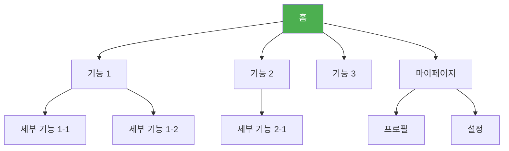

### 📤 과제 (Week 1 → Week 2)
- [ ] 기획서 최종 수정
- [ ] 레퍼런스 UI 5개 수집
- [ ] 필요한 이미지/아이콘 준비
- [ ] V0 계정 생성

---

## Week 2: UI 프로토타입 제작 (4시간)

### 📋 수업 목표
- V0로 주요 화면 UI 생성
- 디자인 시스템 구축
- 인터랙티브 프로토타입 완성

### ⏰ 시간표

| 시간 | 활동 | 내용 | 산출물 |
|------|------|------|--------|
| 0:00-0:30 | 기획서 발표 | 팀별 3분 발표, 피드백 | - |
| 0:30-1:30 | V0 UI 생성 (1) | 메인 화면, 주요 기능 화면 | UI 프로토타입 |
| 1:30-2:30 | V0 UI 생성 (2) | 서브 화면, 상세 페이지 | UI 프로토타입 |
| 2:30-3:30 | 디자인 통일 | 색상, 폰트, 간격 조정 | 디자인 시스템 |
| 3:30-4:00 | 프로토타입 시연 | 화면 플로우 확인, 수정사항 정리 | 수정 계획 |

### 🎯 핵심 활동

#### 1. V0 프롬프트 작성 전략 (30분)

**효과적인 프롬프트 구조:**

```
[화면명] 화면을 만들어줘.

**레이아웃:**
- 상단: [구체적 요소]
- 중앙: [구체적 요소]
- 하단: [구체적 요소]

**주요 컴포넌트:**
1. [컴포넌트명]: [상세 설명]
2. [컴포넌트명]: [상세 설명]

**스타일:**
- 메인 컬러: #3B82F6
- 폰트: 산세리프, 모던
- 분위기: 깔끔하고 전문적

**인터랙션:**
- [요소] 호버 시: [효과]
- [요소] 클릭 시: [동작]

**반응형:**
- 모바일: 1열
- 데스크톱: 3열

**샘플 데이터:**
- [데이터 예시]
```

#### 2. 화면별 제작 순서

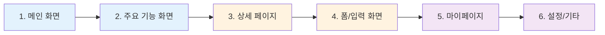

#### 3. 디자인 시스템 구축

**색상 팔레트:**
```css
/* Primary */
--primary-50: #eff6ff;
--primary-500: #3b82f6;
--primary-700: #1d4ed8;

/* Secondary */
--secondary-500: #10b981;

/* Neutral */
--gray-50: #f9fafb;
--gray-500: #6b7280;
--gray-900: #111827;
```

**타이포그래피:**
```css
/* Headings */
H1: 32px, Bold
H2: 24px, Bold
H3: 20px, SemiBold

/* Body */
Body: 16px, Regular
Small: 14px, Regular
```

### 📝 교사 가이드

**학생 지도 포인트:**
1. **프롬프트가 너무 짧을 때**
   - "더 구체적으로 설명해보세요"
   - "어떤 느낌의 디자인을 원하나요?"
   - "예시를 들어주세요"

2. **결과가 마음에 안 들 때**
   - "어떤 부분이 마음에 안 드나요?"
   - "수정 요청을 구체적으로 작성해보세요"
   - "여러 버전을 만들어보고 선택하세요"

3. **디자인 통일성이 없을 때**
   - "색상 팔레트를 먼저 정하세요"
   - "첫 화면 디자인을 기준으로 하세요"
   - "같은 프롬프트 패턴을 사용하세요"

### 📤 과제 (Week 2 → Week 3)
- [ ] 모든 화면 UI 완성
- [ ] 디자인 일관성 체크
- [ ] V0 코드 다운로드
- [ ] Cursor 설치 및 프로젝트 생성

---

## Week 3: Frontend 개발 (1) - 기본 구조 (4시간)

### 📋 수업 목표
- Next.js 프로젝트 설정
- 컴포넌트 구조화
- 라우팅 구현
- 기본 기능 동작

### ⏰ 시간표

| 시간 | 활동 | 내용 | 산출물 |
|------|------|------|--------|
| 0:00-0:30 | 프로젝트 설정 | Next.js 설치, V0 코드 통합 | 프로젝트 구조 |
| 0:30-1:30 | 컴포넌트 개발 (1) | 공통 컴포넌트, 레이아웃 | 재사용 컴포넌트 |
| 1:30-2:30 | 컴포넌트 개발 (2) | 주요 기능 컴포넌트 | 기능 컴포넌트 |
| 2:30-3:30 | 라우팅 & 상태관리 | 페이지 연결, 데이터 흐름 | 동작하는 앱 |
| 3:30-4:00 | 테스트 & 디버깅 | 기능 테스트, 버그 수정 | 테스트 리포트 |

### 🎯 핵심 활동

#### 1. 프로젝트 구조 설정 (30분)

**Cursor 프롬프트:**

```
Next.js 14 프로젝트를 생성하고 다음 구조로 설정해줘:

src/
├── app/
│   ├── layout.tsx
│   ├── page.tsx
│   ├── [주요 기능]/
│   │   └── page.tsx
│   └── api/
│       └── route.ts
├── components/
│   ├── common/
│   │   ├── Header.tsx
│   │   ├── Footer.tsx
│   │   ├── Button.tsx
│   │   └── Card.tsx
│   ├── [기능별]/
│   │   └── [컴포넌트].tsx
│   └── ui/
│       ├── Input.tsx
│       └── Modal.tsx
├── lib/
│   ├── utils.ts
│   └── storage.ts
├── types/
│   └── index.ts
└── styles/
    └── globals.css

기술 스택:
- Next.js 14 (App Router)
- TypeScript
- Tailwind CSS
- Zustand (상태 관리)

설정:
- ESLint, Prettier
- TypeScript strict
- 절대 경로 import (@/)
```

#### 2. 컴포넌트 개발 전략

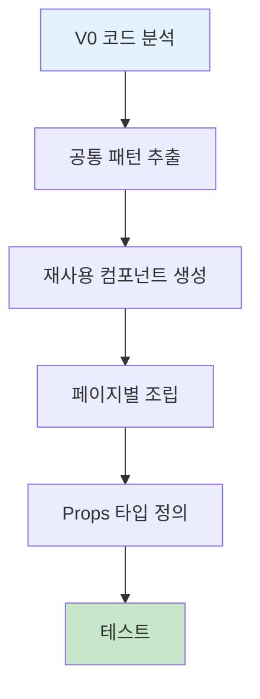

**Cursor 프롬프트 예시:**

```
Button 컴포넌트를 만들어줘.

Props:
- variant: 'primary' | 'secondary' | 'outline'
- size: 'sm' | 'md' | 'lg'
- children: ReactNode
- onClick: () => void
- disabled: boolean
- loading: boolean

요구사항:
1. Tailwind CSS 사용
2. variant별 다른 스타일
3. loading 시 스피너 표시
4. disabled 시 클릭 불가
5. 호버 애니메이션
6. 접근성 (키보드, ARIA)

TypeScript로 작성하고, 모든 타입을 명시해줘.
```

#### 3. LocalStorage 데이터 관리

**데이터 구조 설계:**

```typescript
// types/index.ts
export interface User {
  id: string;
  name: string;
  email: string;
  createdAt: string;
}

export interface Project {
  id: string;
  title: string;
  description: string;
  userId: string;
  status: 'draft' | 'published';
  createdAt: string;
  updatedAt: string;
}

// lib/storage.ts
export const storage = {
  // 저장
  save: <T>(key: string, data: T): void => {
    localStorage.setItem(key, JSON.stringify(data));
  },
  
  // 불러오기
  load: <T>(key: string): T | null => {
    const data = localStorage.getItem(key);
    return data ? JSON.parse(data) : null;
  },
  
  // 삭제
  remove: (key: string): void => {
    localStorage.removeItem(key);
  }
};
```

### 📝 교사 가이드

**자주 발생하는 문제 & 해결:**

1. **"코드가 너무 복잡해요"**
   - 작은 단위로 쪼개기
   - 한 번에 하나씩 구현
   - Cursor에게 리팩토링 요청

2. **"에러가 계속 나요"**
   - 에러 메시지를 Cursor에 붙여넣기
   - 콘솔 로그로 데이터 확인
   - 타입 에러는 TypeScript 설정 확인

3. **"디자인이 V0와 달라요"**
   - Tailwind 클래스 확인
   - 브라우저 개발자 도구로 스타일 검사
   - V0 코드와 비교

### 📤 과제 (Week 3 → Week 4)
- [ ] 모든 페이지 라우팅 완성
- [ ] 주요 기능 동작 확인
- [ ] 반응형 레이아웃 체크
- [ ] 버그 리스트 작성

---

## Week 4: Frontend 완성 & 배포 (4시간)

### 📋 수업 목표
- 인터랙션 및 애니메이션 추가
- 반응형 최적화
- Vercel 배포
- Frontend 완성

### ⏰ 시간표

| 시간 | 활동 | 내용 | 산출물 |
|------|------|------|--------|
| 0:00-1:00 | 인터랙션 구현 | 애니메이션, 모달, 드롭다운 | 완성된 UI |
| 1:00-2:00 | 반응형 최적화 | 모바일/태블릿 레이아웃 | 반응형 앱 |
| 2:00-3:00 | 테스트 & 수정 | 전체 기능 테스트, 버그 수정 | 안정화 |
| 3:00-3:30 | Vercel 배포 | 빌드, 배포, 도메인 연결 | 배포 URL |
| 3:30-4:00 | 발표 & 회고 | 결과물 공유, 피드백 | - |

### 🎯 핵심 활동

#### 1. 인터랙션 구현 (60분)

**Cursor 프롬프트:**

```
다음 인터랙션을 구현해줘:

1. 검색 자동완성
   - 입력 시 debounce 300ms
   - 드롭다운으로 추천 표시
   - 키보드 네비게이션 (↑↓)
   - ESC로 닫기

2. 모달
   - 배경 클릭 시 닫기
   - ESC 키로 닫기
   - 포커스 트랩
   - 애니메이션 (fade in/out)

3. 무한 스크롤
   - Intersection Observer 사용
   - 하단 도달 시 다음 페이지 로드
   - 로딩 스피너 표시

Framer Motion을 사용하여 부드러운 애니메이션을 추가해줘.
```

#### 2. 배포 프로세스

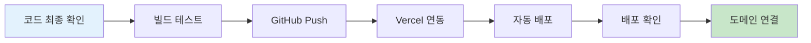

**배포 체크리스트:**

```markdown
## Vercel 배포 체크리스트

### 빌드 전
- [ ] npm run build 성공
- [ ] TypeScript 에러 없음
- [ ] ESLint 에러 없음
- [ ] 환경 변수 확인

### Vercel 설정
- [ ] GitHub 연동
- [ ] 프로젝트 import
- [ ] 환경 변수 설정
- [ ] 빌드 설정 확인

### 배포 후
- [ ] 배포 URL 접속 확인
- [ ] 모든 페이지 동작 확인
- [ ] 모바일 동작 확인
- [ ] Lighthouse 점수 확인 (70점 이상)
```

### 📝 교사 가이드

**배포 시 자주 발생하는 문제:**

1. **빌드 실패**
   - 에러 로그 확인
   - 로컬에서 `npm run build` 테스트
   - 타입 에러 수정

2. **환경 변수 문제**
   - Vercel 대시보드에서 환경 변수 설정
   - `NEXT_PUBLIC_` 접두사 확인

3. **이미지 로딩 안 됨**
   - Next.js Image 컴포넌트 사용
   - 이미지 경로 확인

### 🎉 Frontend 완성!

**학생들에게 축하 메시지:**
```
🎊 축하합니다! Frontend 개발을 완료했습니다!

✅ 완성한 것들:
- 기획부터 디자인까지 직접 설계
- V0로 빠른 프로토타입 제작
- Next.js로 실제 동작하는 웹 개발
- Vercel로 전 세계에 배포

📱 여러분의 웹사이트 URL:
https://your-project.vercel.app

다음 주부터는 Backend 개발로 
더 강력한 기능을 추가합니다! 🚀
```

---

## 🔧 PHASE 2: Backend & AI 개발 (5-8주)

---

## Week 5: Django API 설계 (4시간)

### 📋 수업 목표
- Django 프로젝트 설정
- 데이터베이스 모델 설계
- REST API 구조 설계
- API 명세서 작성

### ⏰ 시간표

| 시간 | 활동 | 내용 | 산출물 |
|------|------|------|--------|
| 0:00-0:30 | Backend 개요 | Django 소개, REST API 개념 | - |
| 0:30-1:30 | 데이터 모델 설계 | ERD 작성, 모델 정의 | ERD 다이어그램 |
| 1:30-2:30 | API 설계 | 엔드포인트 정의, 명세서 작성 | API 명세서 |
| 2:30-3:30 | Django 프로젝트 생성 | 설치, 설정, 모델 생성 | Django 프로젝트 |
| 3:30-4:00 | 테스트 데이터 생성 | Fixture 작성, 데이터 입력 | 샘플 데이터 |

### 🎯 핵심 활동

#### 1. 데이터 모델 설계 (60분)

**ERD 작성:**

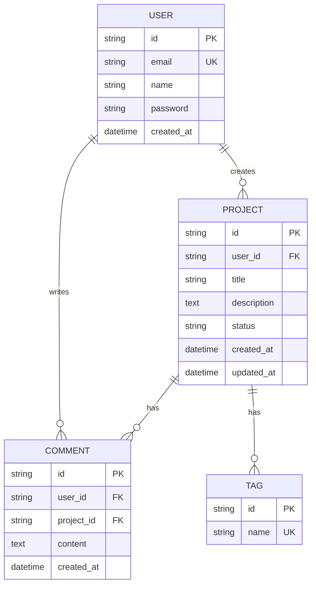

**Cursor 프롬프트:**

```
Django 모델을 설계해줘.

필요한 모델:
1. User (사용자)
   - id, email, name, password
   - created_at

2. Project (프로젝트)
   - id, user (FK), title, description
   - status (draft/published)
   - created_at, updated_at

3. Comment (댓글)
   - id, user (FK), project (FK)
   - content, created_at

4. Tag (태그)
   - id, name
   - ManyToMany with Project

요구사항:
- UUID 사용
- 자동 timestamp
- 관계 설정 (ForeignKey, ManyToMany)
- __str__ 메서드
- Meta 클래스 (ordering)

models.py 파일로 작성해줘.
```

#### 2. API 엔드포인트 설계 (60분)

**API 명세서 템플릿:**

```markdown
# API 명세서

## 인증 (Authentication)

### 회원가입
- **POST** `/api/auth/register`
- **Request Body:**
  ```json
  {
    "email": "user@example.com",
    "name": "홍길동",
    "password": "password123"
  }
  ```
- **Response:** `201 Created`
  ```json
  {
    "id": "uuid",
    "email": "user@example.com",
    "name": "홍길동",
    "token": "jwt_token"
  }
  ```

### 로그인
- **POST** `/api/auth/login`
- **Request Body:**
  ```json
  {
    "email": "user@example.com",
    "password": "password123"
  }
  ```
- **Response:** `200 OK`
  ```json
  {
    "token": "jwt_token",
    "user": {
      "id": "uuid",
      "email": "user@example.com",
      "name": "홍길동"
    }
  }
  ```

## 프로젝트 (Projects)

### 프로젝트 목록 조회
- **GET** `/api/projects`
- **Query Parameters:**
  - `page`: 페이지 번호 (default: 1)
  - `limit`: 페이지당 개수 (default: 10)
  - `status`: 상태 필터 (draft/published)
  - `search`: 검색어
- **Response:** `200 OK`
  ```json
  {
    "count": 100,
    "next": "/api/projects?page=2",
    "previous": null,
    "results": [
      {
        "id": "uuid",
        "title": "프로젝트 제목",
        "description": "프로젝트 설명",
        "status": "published",
        "user": {
          "id": "uuid",
          "name": "홍길동"
        },
        "tags": ["태그1", "태그2"],
        "created_at": "2025-01-01T00:00:00Z"
      }
    ]
  }
  ```

### 프로젝트 생성
- **POST** `/api/projects`
- **Headers:** `Authorization: Bearer {token}`
- **Request Body:**
  ```json
  {
    "title": "프로젝트 제목",
    "description": "프로젝트 설명",
    "status": "draft",
    "tags": ["태그1", "태그2"]
  }
  ```
- **Response:** `201 Created`

### 프로젝트 상세 조회
- **GET** `/api/projects/{id}`
- **Response:** `200 OK`

### 프로젝트 수정
- **PUT** `/api/projects/{id}`
- **Headers:** `Authorization: Bearer {token}`
- **Response:** `200 OK`

### 프로젝트 삭제
- **DELETE** `/api/projects/{id}`
- **Headers:** `Authorization: Bearer {token}`
- **Response:** `204 No Content`

## 댓글 (Comments)

### 댓글 목록 조회
- **GET** `/api/projects/{project_id}/comments`

### 댓글 작성
- **POST** `/api/projects/{project_id}/comments`
- **Headers:** `Authorization: Bearer {token}`

### 댓글 삭제
- **DELETE** `/api/comments/{id}`
- **Headers:** `Authorization: Bearer {token}`
```

#### 3. Django 프로젝트 설정 (60분)

**Cursor 프롬프트:**

```
Django REST Framework 프로젝트를 설정해줘.

프로젝트 구조:
backend/
├── manage.py
├── config/
│   ├── __init__.py
│   ├── settings.py
│   ├── urls.py
│   └── wsgi.py
├── apps/
│   ├── users/
│   │   ├── models.py
│   │   ├── serializers.py
│   │   ├── views.py
│   │   └── urls.py
│   ├── projects/
│   │   ├── models.py
│   │   ├── serializers.py
│   │   ├── views.py
│   │   └── urls.py
│   └── comments/
│       └── ...
└── requirements.txt

설정:
- Django 5.0
- Django REST Framework
- djangorestframework-simplejwt (JWT 인증)
- django-cors-headers (CORS)
- python-decouple (환경 변수)

requirements.txt:
Django==5.0
djangorestframework==3.14
djangorestframework-simplejwt==5.3
django-cors-headers==4.3
python-decouple==3.8
```

### 📝 교사 가이드

**Backend 개발 시작 전 확인사항:**

1. **Python 환경**
   - Python 3.10 이상 설치
   - 가상환경 생성 (`python -m venv venv`)
   - 가상환경 활성화

2. **Django 기본 개념 설명**
   - MTV 패턴 (Model-Template-View)
   - ORM (Object-Relational Mapping)
   - Migration
   - Admin 페이지

3. **REST API 개념**
   - HTTP 메서드 (GET, POST, PUT, DELETE)
   - 상태 코드 (200, 201, 400, 404, 500)
   - JSON 형식
   - 인증 (JWT)

### 📤 과제 (Week 5 → Week 6)
- [ ] Django 프로젝트 로컬 실행 확인
- [ ] Admin 페이지 접속 확인
- [ ] 모델 생성 및 마이그레이션
- [ ] 테스트 데이터 입력

---

## Week 6: Django API 개발 (4시간)

### 📋 수업 목표
- Serializer 작성
- ViewSet 구현
- 인증 시스템 구축
- API 테스트

### ⏰ 시간표

| 시간 | 활동 | 내용 | 산출물 |
|------|------|------|--------|
| 0:00-1:00 | Serializer 작성 | 데이터 직렬화, 유효성 검사 | Serializers |
| 1:00-2:00 | ViewSet 구현 | CRUD API 엔드포인트 | API Views |
| 2:00-3:00 | 인증 시스템 | JWT 인증, 권한 설정 | 인증 시스템 |
| 3:00-4:00 | API 테스트 | Postman 테스트, 디버깅 | 테스트 결과 |

### 🎯 핵심 활동

#### 1. Serializer 작성 (60분)

**Cursor 프롬프트:**

```
Django REST Framework Serializer를 작성해줘.

모델:
- User
- Project
- Comment

요구사항:
1. ModelSerializer 사용
2. 필드 선택 (fields)
3. 읽기 전용 필드 (read_only_fields)
4. 유효성 검사 (validate_*)
5. 관계 필드 (nested serializer)
6. 커스텀 필드

예시:
class ProjectSerializer(serializers.ModelSerializer):
    user = UserSerializer(read_only=True)
    tags = serializers.StringRelatedField(many=True)
    comment_count = serializers.SerializerMethodField()
    
    class Meta:
        model = Project
        fields = '__all__'
        read_only_fields = ['id', 'created_at', 'updated_at']
    
    def get_comment_count(self, obj):
        return obj.comments.count()
    
    def validate_title(self, value):
        if len(value) < 5:
            raise serializers.ValidationError("제목은 5자 이상이어야 합니다.")
        return value

모든 모델에 대해 작성해줘.
```

#### 2. ViewSet 구현 (60분)

**Cursor 프롬프트:**

```
Django REST Framework ViewSet을 구현해줘.

요구사항:
1. ModelViewSet 사용
2. 필터링 (filter_backends)
3. 검색 (search_fields)
4. 정렬 (ordering_fields)
5. 페이지네이션
6. 권한 설정 (permissions)
7. 커스텀 액션 (@action)

예시:
class ProjectViewSet(viewsets.ModelViewSet):
    queryset = Project.objects.all()
    serializer_class = ProjectSerializer
    permission_classes = [IsAuthenticatedOrReadOnly]
    filter_backends = [DjangoFilterBackend, SearchFilter, OrderingFilter]
    search_fields = ['title', 'description']
    ordering_fields = ['created_at', 'title']
    
    def get_queryset(self):
        queryset = super().get_queryset()
        status = self.request.query_params.get('status')
        if status:
            queryset = queryset.filter(status=status)
        return queryset
    
    def perform_create(self, serializer):
        serializer.save(user=self.request.user)
    
    @action(detail=True, methods=['post'])
    def publish(self, request, pk=None):
        project = self.get_object()
        project.status = 'published'
        project.save()
        return Response({'status': 'published'})

모든 모델에 대해 작성해줘.
```

#### 3. JWT 인증 구현 (60분)

**settings.py 설정:**

```python
INSTALLED_APPS = [
    # ...
    'rest_framework',
    'rest_framework_simplejwt',
    'corsheaders',
]

MIDDLEWARE = [
    'corsheaders.middleware.CorsMiddleware',
    # ...
]

REST_FRAMEWORK = {
    'DEFAULT_AUTHENTICATION_CLASSES': [
        'rest_framework_simplejwt.authentication.JWTAuthentication',
    ],
    'DEFAULT_PERMISSION_CLASSES': [
        'rest_framework.permissions.IsAuthenticatedOrReadOnly',
    ],
    'DEFAULT_PAGINATION_CLASS': 'rest_framework.pagination.PageNumberPagination',
    'PAGE_SIZE': 10,
}

CORS_ALLOWED_ORIGINS = [
    "http://localhost:3000",
    "https://your-frontend.vercel.app",
]

from datetime import timedelta

SIMPLE_JWT = {
    'ACCESS_TOKEN_LIFETIME': timedelta(days=1),
    'REFRESH_TOKEN_LIFETIME': timedelta(days=7),
}
```

#### 4. API 테스트 (60분)

**Postman 테스트 시나리오:**

```markdown
## API 테스트 체크리스트

### 1. 회원가입
- [ ] POST /api/auth/register
- [ ] 이메일 중복 체크
- [ ] 비밀번호 유효성 검사

### 2. 로그인
- [ ] POST /api/auth/login
- [ ] JWT 토큰 발급 확인
- [ ] 잘못된 비밀번호 에러

### 3. 프로젝트 CRUD
- [ ] GET /api/projects (목록)
- [ ] POST /api/projects (생성, 인증 필요)
- [ ] GET /api/projects/{id} (상세)
- [ ] PUT /api/projects/{id} (수정, 권한 체크)
- [ ] DELETE /api/projects/{id} (삭제, 권한 체크)

### 4. 필터링 & 검색
- [ ] GET /api/projects?status=published
- [ ] GET /api/projects?search=키워드
- [ ] GET /api/projects?ordering=-created_at

### 5. 댓글
- [ ] GET /api/projects/{id}/comments
- [ ] POST /api/projects/{id}/comments
- [ ] DELETE /api/comments/{id}

### 6. 에러 처리
- [ ] 401 Unauthorized (인증 없음)
- [ ] 403 Forbidden (권한 없음)
- [ ] 404 Not Found (존재하지 않음)
- [ ] 400 Bad Request (유효성 검사 실패)
```

### 📝 교사 가이드

**API 개발 시 자주 발생하는 문제:**

1. **CORS 에러**
   ```python
   # settings.py
   CORS_ALLOWED_ORIGINS = [
       "http://localhost:3000",
   ]
   ```

2. **JWT 토큰 에러**
   - 토큰 형식: `Bearer {token}`
   - Postman Headers: `Authorization: Bearer eyJ...`

3. **권한 에러**
   - `IsAuthenticated`: 로그인 필요
   - `IsAuthenticatedOrReadOnly`: 읽기는 모두, 쓰기는 로그인
   - 커스텀 권한 클래스 작성

### 📤 과제 (Week 6 → Week 7)
- [ ] 모든 API 엔드포인트 테스트 완료
- [ ] Frontend에서 API 호출 테스트
- [ ] AI 기능 아이디어 구체화
- [ ] OpenAI/Claude API 키 발급

---

## Week 7: AI 기능 통합 (4시간)

### 📋 수업 목표
- AI API 연동 (OpenAI/Claude)
- AI 기능 구현
- Frontend-Backend-AI 연결
- 실시간 처리

### ⏰ 시간표

| 시간 | 활동 | 내용 | 산출물 |
|------|------|------|--------|
| 0:00-0:30 | AI 기능 설계 | 어떤 AI 기능을 넣을지 결정 | AI 기능 명세 |
| 0:30-1:30 | AI API 연동 | OpenAI/Claude API 설정 | AI 서비스 |
| 1:30-2:30 | Backend AI 엔드포인트 | AI 처리 API 개발 | AI API |
| 2:30-3:30 | Frontend 연동 | AI 기능 UI 구현 | 통합 완료 |
| 3:30-4:00 | 테스트 & 최적화 | 응답 속도, 에러 처리 | 안정화 |

### 🎯 핵심 활동

#### 1. AI 기능 설계 (30분)

**프로젝트별 AI 활용 예시:**

| 프로젝트 유형 | AI 기능 | API |
|--------------|---------|-----|
| 학습 플랫폼 | 문제 생성, 해설 작성 | OpenAI GPT-4 |
| 콘텐츠 플랫폼 | 요약, 키워드 추출 | Claude |
| 추천 시스템 | 개인화 추천 | OpenAI Embeddings |
| 챗봇 | 대화형 상담 | OpenAI GPT-4 |
| 이미지 생성 | 썸네일 자동 생성 | DALL-E 3 |

**AI 기능 플로우:**

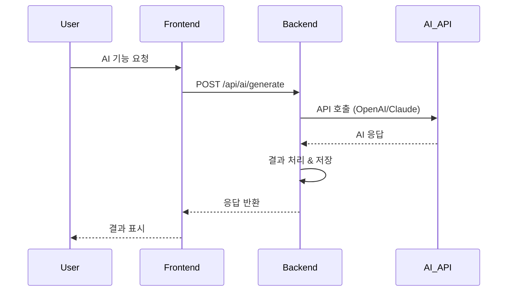

#### 2. OpenAI API 연동 (60분)

**Django 설정:**

```python
# settings.py
import os
from decouple import config

OPENAI_API_KEY = config('OPENAI_API_KEY')
```

**AI 서비스 구현:**

**Cursor 프롬프트:**

```
Django에서 OpenAI API를 사용하는 서비스를 만들어줘.

기능:
1. 텍스트 생성 (GPT-4)
2. 텍스트 요약
3. 키워드 추출
4. 감정 분석

파일 구조:
apps/ai/
├── __init__.py
├── services.py
├── views.py
├── urls.py
└── serializers.py

services.py:
from openai import OpenAI
from django.conf import settings

class AIService:
    def __init__(self):
        self.client = OpenAI(api_key=settings.OPENAI_API_KEY)
    
    def generate_text(self, prompt: str, max_tokens: int = 500) -> str:
        """텍스트 생성"""
        response = self.client.chat.completions.create(
            model="gpt-4",
            messages=[
                {"role": "system", "content": "당신은 도움이 되는 AI 어시스턴트입니다."},
                {"role": "user", "content": prompt}
            ],
            max_tokens=max_tokens
        )
        return response.choices[0].message.content
    
    def summarize(self, text: str) -> str:
        """텍스트 요약"""
        prompt = f"다음 텍스트를 3문장으로 요약해주세요:\n\n{text}"
        return self.generate_text(prompt, max_tokens=200)
    
    def extract_keywords(self, text: str) -> list:
        """키워드 추출"""
        prompt = f"다음 텍스트에서 핵심 키워드 5개를 추출해주세요 (콤마로 구분):\n\n{text}"
        result = self.generate_text(prompt, max_tokens=100)
        return [k.strip() for k in result.split(',')]

views.py:
from rest_framework.views import APIView
from rest_framework.response import Response
from rest_framework import status
from .services import AIService

class AIGenerateView(APIView):
    def post(self, request):
        prompt = request.data.get('prompt')
        if not prompt:
            return Response(
                {'error': 'prompt is required'}, 
                status=status.HTTP_400_BAD_REQUEST
            )
        
        try:
            ai_service = AIService()
            result = ai_service.generate_text(prompt)
            return Response({'result': result})
        except Exception as e:
            return Response(
                {'error': str(e)}, 
                status=status.HTTP_500_INTERNAL_SERVER_ERROR
            )

class AISummarizeView(APIView):
    def post(self, request):
        text = request.data.get('text')
        if not text:
            return Response(
                {'error': 'text is required'}, 
                status=status.HTTP_400_BAD_REQUEST
            )
        
        try:
            ai_service = AIService()
            summary = ai_service.summarize(text)
            return Response({'summary': summary})
        except Exception as e:
            return Response(
                {'error': str(e)}, 
                status=status.HTTP_500_INTERNAL_SERVER_ERROR
            )

urls.py:
from django.urls import path
from .views import AIGenerateView, AISummarizeView

urlpatterns = [
    path('generate/', AIGenerateView.as_view()),
    path('summarize/', AISummarizeView.as_view()),
]

전체 코드를 작성해줘.
```

#### 3. Frontend AI 기능 구현 (60분)

**Cursor 프롬프트:**

```
Next.js에서 AI 기능을 사용하는 컴포넌트를 만들어줘.

기능:
1. 텍스트 생성 버튼
2. 로딩 상태 표시
3. 결과 표시
4. 에러 처리

컴포넌트:
'use client';

import { useState } from 'react';

export default function AIGenerator() {
  const [prompt, setPrompt] = useState('');
  const [result, setResult] = useState('');
  const [loading, setLoading] = useState(false);
  const [error, setError] = useState('');

  const handleGenerate = async () => {
    if (!prompt.trim()) return;
    
    setLoading(true);
    setError('');
    
    try {
      const response = await fetch('http://localhost:8000/api/ai/generate/', {
        method: 'POST',
        headers: {
          'Content-Type': 'application/json',
          'Authorization': `Bearer ${localStorage.getItem('token')}`,
        },
        body: JSON.stringify({ prompt }),
      });
      
      if (!response.ok) {
        throw new Error('AI 생성 실패');
      }
      
      const data = await response.json();
      setResult(data.result);
    } catch (err) {
      setError(err.message);
    } finally {
      setLoading(false);
    }
  };

  return (
    <div className="max-w-2xl mx-auto p-6">
      <h2 className="text-2xl font-bold mb-4">AI 텍스트 생성</h2>
      
      <textarea
        value={prompt}
        onChange={(e) => setPrompt(e.target.value)}
        placeholder="생성하고 싶은 내용을 입력하세요..."
        className="w-full h-32 p-4 border rounded-lg mb-4"
        disabled={loading}
      />
      
      <button
        onClick={handleGenerate}
        disabled={loading || !prompt.trim()}
        className="w-full py-3 bg-blue-500 text-white rounded-lg hover:bg-blue-600 disabled:bg-gray-300"
      >
        {loading ? (
          <span className="flex items-center justify-center">
            <svg className="animate-spin h-5 w-5 mr-2" viewBox="0 0 24 24">
              <circle className="opacity-25" cx="12" cy="12" r="10" stroke="currentColor" strokeWidth="4" fill="none" />
              <path className="opacity-75" fill="currentColor" d="M4 12a8 8 0 018-8V0C5.373 0 0 5.373 0 12h4zm2 5.291A7.962 7.962 0 014 12H0c0 3.042 1.135 5.824 3 7.938l3-2.647z" />
            </svg>
            생성 중...
          </span>
        ) : (
          'AI로 생성하기'
        )}
      </button>
      
      {error && (
        <div className="mt-4 p-4 bg-red-50 border border-red-200 rounded-lg text-red-700">
          {error}
        </div>
      )}
      
      {result && (
        <div className="mt-6">
          <h3 className="text-lg font-semibold mb-2">생성 결과:</h3>
          <div className="p-4 bg-gray-50 border rounded-lg whitespace-pre-wrap">
            {result}
          </div>
        </div>
      )}
    </div>
  );
}

이 컴포넌트를 작성하고, 스트리밍 응답도 지원하도록 개선해줘.
```

#### 4. 스트리밍 응답 구현 (선택사항)

**실시간으로 AI 응답 표시:**

```python
# Django views.py
from django.http import StreamingHttpResponse
import json

class AIStreamView(APIView):
    def post(self, request):
        prompt = request.data.get('prompt')
        
        def generate():
            ai_service = AIService()
            for chunk in ai_service.stream_text(prompt):
                yield f"data: {json.dumps({'text': chunk})}\n\n"
        
        response = StreamingHttpResponse(
            generate(),
            content_type='text/event-stream'
        )
        response['Cache-Control'] = 'no-cache'
        return response
```

### 📝 교사 가이드

**AI 통합 시 주의사항:**

1. **API 키 보안**
   - 환경 변수 사용
   - `.env` 파일은 `.gitignore`에 추가
   - Frontend에서 직접 호출 금지

2. **비용 관리**
   - 토큰 수 제한 설정
   - 캐싱 활용
   - 사용량 모니터링

3. **에러 처리**
   - API 제한 초과 (Rate Limit)
   - 타임아웃
   - 잘못된 응답

### 📤 과제 (Week 7 → Week 8)
- [ ] AI 기능 모든 케이스 테스트
- [ ] 에러 처리 강화
- [ ] 로딩 UX 개선
- [ ] 최종 배포 준비

---

## Week 8: 최종 통합 & 배포 (4시간)

### 📋 수업 목표
- Frontend-Backend 완전 연동
- 전체 기능 테스트
- 배포 (Frontend + Backend)
- 최종 발표

### ⏰ 시간표

| 시간 | 활동 | 내용 | 산출물 |
|------|------|------|--------|
| 0:00-1:00 | 최종 통합 | API 연동 완성, 버그 수정 | 완성된 앱 |
| 1:00-2:00 | Backend 배포 | Railway/Render 배포 | Backend URL |
| 2:00-2:30 | Frontend 재배포 | API URL 업데이트, 재배포 | 최종 URL |
| 2:30-3:30 | 최종 테스트 | 전체 시나리오 테스트 | 테스트 리포트 |
| 3:30-4:00 | 최종 발표 | 프로젝트 발표, 시연 | 🎉 완성! |

### 🎯 핵심 활동

#### 1. Backend 배포 (Railway) (60분)

**배포 플로우:**

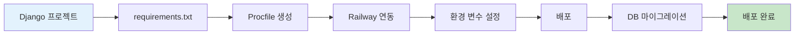

**배포 준비:**

```bash
# requirements.txt
Django==5.0
djangorestframework==3.14
djangorestframework-simplejwt==5.3
django-cors-headers==4.3
python-decouple==3.8
gunicorn==21.2
psycopg2-binary==2.9
whitenoise==6.6

# Procfile
web: gunicorn config.wsgi --log-file -

# runtime.txt
python-3.11.0
```

**settings.py 수정:**

```python
# settings.py
import os
from decouple import config

# SECURITY WARNING: don't run with debug turned on in production!
DEBUG = config('DEBUG', default=False, cast=bool)

ALLOWED_HOSTS = [
    'localhost',
    '127.0.0.1',
    config('RAILWAY_STATIC_URL', default=''),
    '.railway.app',
]

# Database
if DEBUG:
    DATABASES = {
        'default': {
            'ENGINE': 'django.db.backends.sqlite3',
            'NAME': BASE_DIR / 'db.sqlite3',
        }
    }
else:
    DATABASES = {
        'default': {
            'ENGINE': 'django.db.backends.postgresql',
            'NAME': config('PGDATABASE'),
            'USER': config('PGUSER'),
            'PASSWORD': config('PGPASSWORD'),
            'HOST': config('PGHOST'),
            'PORT': config('PGPORT', default='5432'),
        }
    }

# Static files
STATIC_URL = 'static/'
STATIC_ROOT = os.path.join(BASE_DIR, 'staticfiles')
STATICFILES_STORAGE = 'whitenoise.storage.CompressedManifestStaticFilesStorage'

# CORS
CORS_ALLOWED_ORIGINS = [
    "http://localhost:3000",
    config('FRONTEND_URL', default=''),
]
```

**Railway 배포 단계:**

1. Railway 계정 생성
2. New Project → Deploy from GitHub
3. 환경 변수 설정:
   - `DEBUG=False`
   - `SECRET_KEY=...`
   - `OPENAI_API_KEY=...`
   - `FRONTEND_URL=https://your-frontend.vercel.app`
4. 자동 배포
5. 배포 URL 확인: `https://your-project.railway.app`

#### 2. Frontend 재배포 (30분)

**환경 변수 업데이트:**

```bash
# .env.production
NEXT_PUBLIC_API_URL=https://your-backend.railway.app
```

**Vercel 재배포:**
1. Vercel 대시보드 접속
2. 프로젝트 선택
3. Settings → Environment Variables
4. `NEXT_PUBLIC_API_URL` 추가
5. Deployments → Redeploy

#### 3. 최종 테스트 (60분)

**전체 시나리오 테스트:**

```markdown
## 최종 테스트 체크리스트

### 사용자 플로우
- [ ] 1. 홈페이지 접속
- [ ] 2. 회원가입
- [ ] 3. 로그인
- [ ] 4. 주요 기능 사용
- [ ] 5. AI 기능 사용
- [ ] 6. 데이터 저장 확인
- [ ] 7. 로그아웃
- [ ] 8. 재로그인 (데이터 유지 확인)

### 기능 테스트
- [ ] 모든 페이지 로딩
- [ ] 모든 버튼 동작
- [ ] 폼 유효성 검사
- [ ] 에러 메시지 표시
- [ ] 로딩 상태 표시
- [ ] 반응형 (모바일/태블릿/데스크톱)

### 성능 테스트
- [ ] 페이지 로딩 속도 (3초 이내)
- [ ] API 응답 속도 (1초 이내)
- [ ] AI 응답 속도 (10초 이내)
- [ ] 이미지 로딩

### 보안 테스트
- [ ] 인증 없이 보호된 페이지 접근 차단
- [ ] 다른 사용자 데이터 접근 차단
- [ ] XSS 방어
- [ ] CSRF 방어

### 브라우저 테스트
- [ ] Chrome
- [ ] Safari
- [ ] Firefox
- [ ] Mobile Safari
- [ ] Mobile Chrome
```

#### 4. 최종 발표 (30분)

**발표 구조 (10분):**

```markdown
## 프로젝트 발표

### 1. 인사 및 소개 (1분)
"안녕하세요, [프로젝트명]을 개발한 [이름]입니다."

### 2. 문제 정의 (2분)
- 어떤 문제를 발견했는가?
- 왜 이 문제가 중요한가?
- 타겟 사용자는 누구인가?

### 3. 솔루션 소개 (2분)
- 우리의 해결책은 무엇인가?
- 핵심 기능 3가지
- AI 기능 설명

### 4. 시연 (3분)
- 실제 서비스 시연
- 주요 기능 동작 확인
- AI 기능 시연

### 5. 기술 스택 (1분)
- Frontend: Next.js, TypeScript, Tailwind
- Backend: Django, PostgreSQL
- AI: OpenAI GPT-4
- 배포: Vercel, Railway

### 6. 개발 과정 (1분)
- 8주간의 여정
- 어려웠던 점
- 배운 점

### 7. 향후 계획 (30초)
- 추가하고 싶은 기능
- 개선 계획
```

### 🎉 프로그램 완료!

**축하 메시지:**

```
🎊🎊🎊 축하합니다! 🎊🎊🎊

8주 만에 완성한 것들:

✅ Week 1-4: Frontend
   - 기획부터 디자인까지
   - Next.js 웹 개발
   - Vercel 배포

✅ Week 5-8: Backend & AI
   - Django REST API
   - PostgreSQL 데이터베이스
   - OpenAI AI 통합
   - Railway 배포

🚀 여러분은 이제:
   - 아이디어를 실제 서비스로 만들 수 있습니다
   - AI를 활용한 혁신적인 기능을 구현할 수 있습니다
   - 풀스택 개발자로서의 기본기를 갖췄습니다

📱 여러분의 서비스:
   Frontend: https://your-project.vercel.app
   Backend: https://your-api.railway.app

이제 여러분의 아이디어로 세상을 바꿔보세요! 💪
```

---

## 📚 부록: 교사용 자료

---

## A. 주차별 준비물 체크리스트

### Week 1: 기획 및 설계
- [ ] 기획서 템플릿 (MD)
- [ ] 유저 시나리오 템플릿
- [ ] 사이트맵 예시
- [ ] 우수 사례 3개
- [ ] 화이트보드/Miro

### Week 2: UI 프로토타입
- [ ] V0 계정 안내
- [ ] 프롬프트 작성 가이드
- [ ] 디자인 시스템 템플릿
- [ ] 색상 팔레트 도구

### Week 3: Frontend 개발 (1)
- [ ] Next.js 설치 가이드
- [ ] Cursor 설정 가이드
- [ ] 프로젝트 구조 템플릿
- [ ] 컴포넌트 예시

### Week 4: Frontend 완성 & 배포
- [ ] Vercel 배포 가이드
- [ ] 배포 체크리스트
- [ ] Lighthouse 사용법
- [ ] 도메인 연결 가이드

### Week 5: Django API 설계
- [ ] Python 설치 가이드
- [ ] Django 설치 가이드
- [ ] ERD 작성 도구
- [ ] API 명세서 템플릿

### Week 6: Django API 개발
- [ ] Postman 사용 가이드
- [ ] JWT 인증 설명 자료
- [ ] CORS 설정 가이드
- [ ] API 테스트 시나리오

### Week 7: AI 기능 통합
- [ ] OpenAI API 키 발급 가이드
- [ ] AI 서비스 예시 코드
- [ ] 비용 관리 가이드
- [ ] 에러 처리 패턴

### Week 8: 최종 통합 & 배포
- [ ] Railway 배포 가이드
- [ ] PostgreSQL 설정 가이드
- [ ] 배포 체크리스트
- [ ] 발표 평가 기준

---

## B. 수업 운영 팁

### 시간 관리

```mermaid
gantt
    title 4시간 수업 시간 배치
    dateFormat HH:mm
    axisFormat %H:%M
    
    section 도입
    출석 & 지난 주 복습    :10:00, 10min
    오늘 목표 설명         :10:10, 20min
    
    section 실습 1
    개념 설명              :10:30, 20min
    실습                   :10:50, 40min
    
    section 휴식
    휴식                   :11:30, 10min
    
    section 실습 2
    실습 계속              :11:40, 50min
    
    section 휴식
    휴식                   :12:30, 10min
    
    section 실습 3
    실습 마무리            :12:40, 50min
    
    section 정리
    발표 & 피드백          :13:30, 20min
    과제 안내              :13:50, 10min
```

### 학생 지도 전략

#### 1. 진도가 빠른 학생
- 추가 도전 과제 제공
- 다른 학생 도와주기 (멘토 역할)
- 고급 기능 구현 제안

#### 2. 진도가 느린 학생
- 1:1 코칭 시간 확보
- 간단한 버전으로 목표 조정
- 페어 프로그래밍 권장

#### 3. 동기 부여
- 매주 우수 사례 공유
- 중간 발표 기회 제공
- 실제 사용자 피드백 수집

### 문제 해결 패턴

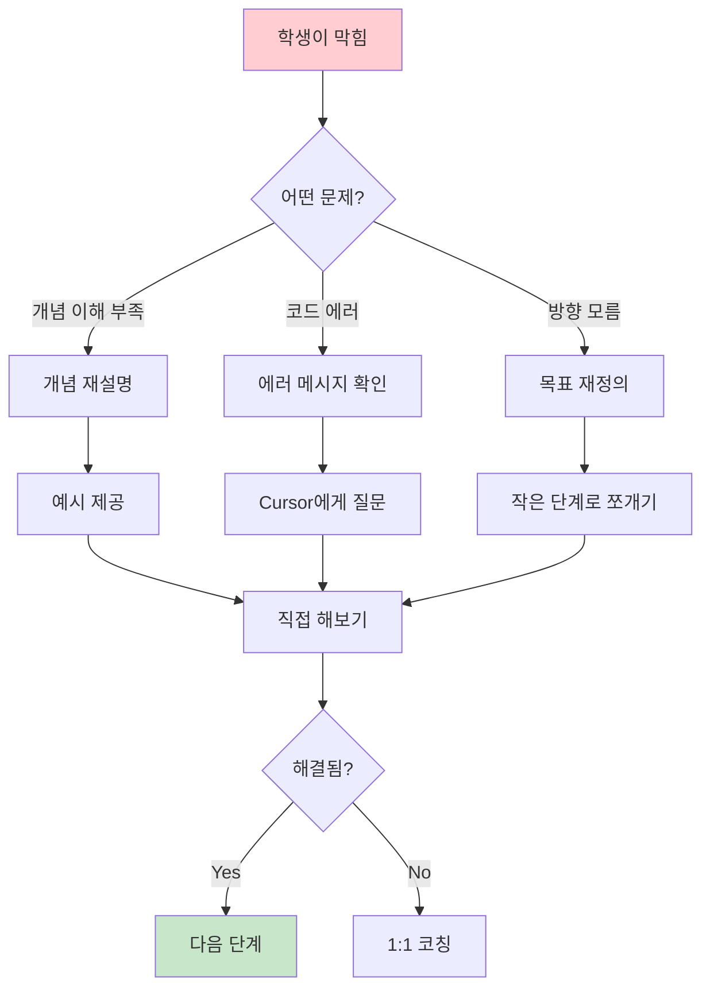

---

## C. 평가 기준

### 주차별 평가 (80점)

| 주차 | 평가 항목 | 배점 | 평가 기준 |
|------|-----------|------|-----------|
| Week 1 | 기획서 완성도 | 10점 | 문제 정의, 유저 시나리오, 사이트맵 |
| Week 2 | UI 프로토타입 | 10점 | 화면 완성도, 디자인 일관성 |
| Week 3 | Frontend 개발 (1) | 10점 | 컴포넌트 구조, 코드 품질 |
| Week 4 | Frontend 배포 | 10점 | 배포 성공, 동작 확인 |
| Week 5 | API 설계 | 10점 | ERD, API 명세서 |
| Week 6 | API 개발 | 10점 | 엔드포인트 동작, 테스트 |
| Week 7 | AI 통합 | 10점 | AI 기능 동작, 에러 처리 |
| Week 8 | 최종 완성 | 10점 | 전체 통합, 배포 |

### 최종 발표 (20점)

| 평가 항목 | 배점 | 평가 기준 |
|-----------|------|-----------|
| 문제 정의 | 5점 | 명확성, 중요성 |
| 솔루션 적합성 | 5점 | 문제-솔루션 연결, 창의성 |
| 기술 구현 | 5점 | 완성도, 기술 활용 |
| 발표력 | 5점 | 전달력, 시연 |

### 총점 계산

```
총점 = 주차별 평가 (80점) + 최종 발표 (20점)

90점 이상: A (탁월)
80-89점: B (우수)
70-79점: C (보통)
60-69점: D (미흡)
60점 미만: F (재이수)
```

---

## D. 자주 묻는 질문 (FAQ)

### 학생 FAQ

**Q1. 프로그래밍을 처음 해봐도 괜찮나요?**
A. 네! 이 프로그램은 AI 도구(Cursor, V0)를 활용하므로 코딩 경험이 적어도 괜찮습니다. 중요한 것은 아이디어와 기획 능력입니다.

**Q2. 개인 프로젝트인가요, 팀 프로젝트인가요?**
A. 개인 프로젝트를 권장하지만, 2인 팀도 가능합니다. 팀인 경우 역할을 명확히 분담하세요.

**Q3. 컴퓨터 사양이 낮아도 되나요?**
A. 웹 브라우저만 잘 돌아가면 됩니다. 개발은 클라우드 기반이므로 고사양이 필요하지 않습니다.

**Q4. 주중에도 작업해야 하나요?**
A. 주말 4시간 수업에 집중하면 됩니다. 다만 과제(1-2시간)는 주중에 하는 것을 권장합니다.

**Q5. AI API 비용이 많이 나오나요?**
A. OpenAI API는 소량 사용 시 월 $5-10 정도입니다. 학교에서 지원하거나 무료 크레딧을 활용할 수 있습니다.

### 교사 FAQ

**Q1. 학생들의 수준 차이가 크면 어떻게 하나요?**
A. 기본 목표와 도전 과제를 분리하여 제공하세요. 빠른 학생은 멘토 역할을 맡길 수 있습니다.

**Q2. 8주 안에 완성이 어려운 학생은?**
A. 핵심 기능만 완성하도록 범위를 축소하세요. "동작하는 최소 버전"이 목표입니다.

**Q3. AI API 키는 어떻게 관리하나요?**
A. 학교 계정을 만들어 공유하거나, 학생 개인 계정 생성을 안내하세요. 비용 제한을 설정하는 것이 중요합니다.

**Q4. 배포 비용은 얼마나 드나요?**
A. Vercel과 Railway 모두 무료 플랜이 있습니다. 학생 프로젝트는 무료 플랜으로 충분합니다.

**Q5. 저도 Django를 잘 모르는데 가르칠 수 있나요?**
A. 네! 이 가이드와 Cursor를 활용하면 됩니다. 교사도 학생과 함께 배우는 자세가 중요합니다.

---

## E. 추가 학습 자료

### 온라인 강의
- **Next.js**: [Next.js 공식 튜토리얼](https://nextjs.org/learn)
- **Django**: [Django Girls 튜토리얼](https://tutorial.djangogirls.org/ko/)
- **OpenAI API**: [OpenAI Cookbook](https://cookbook.openai.com/)

### 유튜브 채널
- **코딩애플**: Next.js, React 기초
- **노마드 코더**: Django REST Framework
- **드림코딩**: 웹 개발 전반

### 커뮤니티
- **디스코드**: 학생들을 위한 전용 채널 개설 권장
- **GitHub**: 코드 공유 및 협업
- **Stack Overflow**: 기술 질문

### 도구 문서
- [Cursor Documentation](https://cursor.sh/docs)
- [V0 Documentation](https://v0.dev/docs)
- [Vercel Documentation](https://vercel.com/docs)
- [Railway Documentation](https://docs.railway.app/)

---

## F. 프로그램 성공 사례

### 예시 프로젝트 1: 학습 플래너
**학생**: 김민수 (고2)
**기간**: 8주
**기능**:
- 시간표 관리
- 할 일 목록
- AI 학습 조언
- 진도 분석

**성과**:
- 학교 내 100명 사용
- 학습 시간 20% 증가
- 지역 공모전 수상

### 예시 프로젝트 2: 진로 추천 시스템
**학생**: 이지은 (고3)
**기간**: 8주
**기능**:
- 흥미/적성 검사
- AI 진로 추천
- 대학/학과 정보
- 선배 인터뷰

**성과**:
- 진로 상담 시간 50% 단축
- 교내 진로 박람회 전시
- 교육청 우수 사례 선정

---

## 마무리

### 프로그램의 핵심 가치

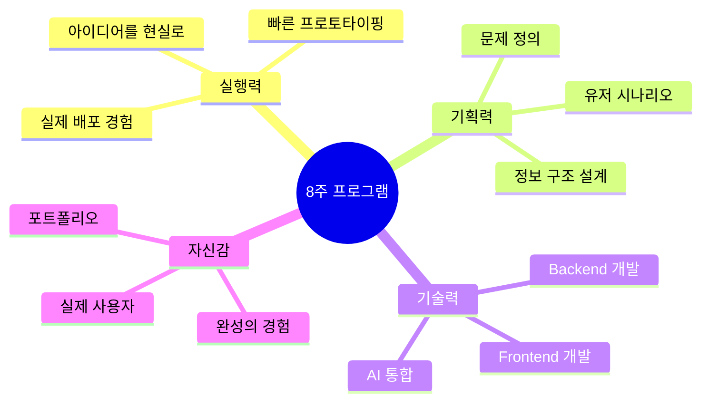

### 교사에게 드리는 말

이 프로그램의 목표는 **완벽한 코드**가 아닙니다.
학생들이 **"나도 만들 수 있다"**는 자신감을 얻는 것입니다.

AI 시대, 코드는 AI가 작성합니다.
중요한 것은:
- 무엇을 만들지 **기획**하는 능력
- 사용자를 **이해**하는 능력
- 아이디어를 **실행**하는 능력

8주 후, 학생들은 자신의 아이디어로
실제 동작하는 서비스를 만들 수 있습니다.

이것이 바로 **바이브 코딩**의 힘입니다.

---

**버전**: 1.0  
**최종 수정일**: 2025-11-20  
**대상**: 고등학생 심화반  
**기간**: 8주 (주말 4시간)  
**목표**: Frontend + Backend + AI 풀스택 서비스 완성

**문의**: 
- 이메일: vibecoding@example.com
- 디스코드: [바이브 코딩 커뮤니티]

**라이선스**: CC BY-NC-SA 4.0

